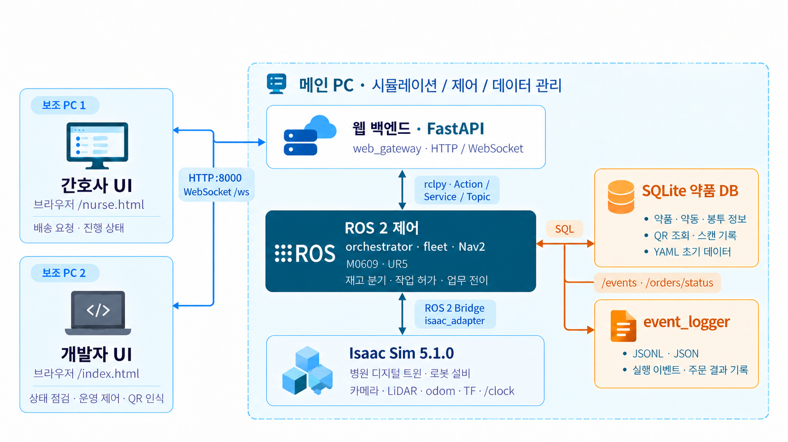
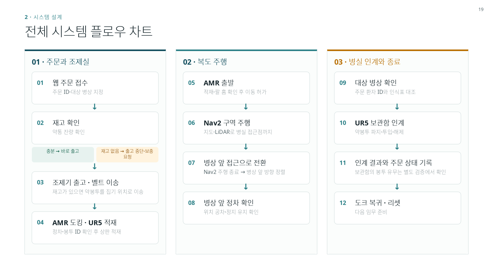

# Pharmacy to Bedside (ROKEY P3 A3)

> 이 저장소는 두산 로보틱스 ROKEY 부트캠프 협동 3차 프로젝트(A-3 조: 임재범·전제환·이태규·박세준)의 공개본이다. 원 개발 저장소는 비공개다.
> 문서의 `#숫자`(이슈·PR·댓글 번호)와 `v1.x` 릴리스는 원 개발 저장소 기준이라 여기서는 열리지 않는다.
> 조제기 모델 `dispenser.usdc` 와 팀 자산 묶음(`assets/hospital-20260918`)은 라이선스를 확인하지 못해 넣지 않았다. 필요한 자리는 [조제기 모델 README](src/rokey_p3_description/models/dispenser/README.md)와 [병원 전 구간 런카드](docs/runbooks/hospital-full.md) 0절에 있다.
> 라이선스는 [MIT](LICENSE)다.

Isaac Sim 5.1 과 ROS 2 Jazzy 로 만든 병원 약제 물류 시뮬레이션이다.
간호사가 관제 웹에서 약을 요청한다.
조제실에서는 레일 위 M0609 팔이 선반의 약통을 조제기에 채운다.
조제기가 낸 약 봉투는 컨베이어를 타고 창구 A1 까지 간다.
이동 로봇(Ridgeback 차체에 UR5 팔을 얹은 합본 AMR)이 봉투를 집어 트레이에 싣는다.
AMR 은 Nav2 로 병상까지 간다.
환자 인식표를 확인한 뒤 협탁 보관함에 봉투를 놓는다.
그다음 도크로 돌아온다.
배송 성공은 오케스트레이터가 정하지 않는다.
시뮬 평가기가 본 보관함 상태로 판정한다([시스템 그림](docs/architecture/system-overview.md) 4절).

무엇을 만드는지는 [시나리오](docs/planning/scenario.md)가 정한다(팀 확정, #21).
노드·토픽·역할 배치는 [시스템 그림](docs/architecture/system-overview.md)과 [배송 계약 v1](docs/architecture/delivery-contract-v1.md)에 있다.


발표·튜터 평가 자료는 [발표 자료](docs/presentation/README.md)에 있다.

## 제출 요약

### 주요 기능 (Key Features)

| 기능 | 내용 |
| --- | --- |
| 웹 주문·관제 | 간호사 화면(`nurse.html`)에서 병상별 약 배송을 요청한다. 개발자 화면(`index.html`)에서 단계·알람·카메라·재고를 본다. FastAPI·WebSocket |
| 긴급 우선 | 긴급 요청은 대기 중인 일반 요청보다 먼저 나간다. 진행 중인 배송은 끊지 않는다. 도착 전 `URGENT_ARRIVING` 알람 |
| 조제실 자동 보충 | 조제기 재고가 모자라면 레일 위 M0609 가 선반 약통을 집어 조제기에 채운다. 약통 QR 로 약품·유효기간을 확인하고, 만료 약통은 거부한다. 레일 자세는 `preferred_first` |
| 조제·이송 | 조제기가 약 봉투를 내고, 컨베이어가 창구 A1 까지 옮긴다 |
| 카메라 QR 확인 집기 | AMR 손 카메라(D455)가 봉투 QR 을 읽어 주문과 맞을 때만 UR5 가 흡착으로 집어 트레이에 싣는다. 트레이 클립이 주행 중 봉투를 고정한다 |
| 병동 주행 | Nav2 로 병상 접근점까지 간다. 라이다 costmap, 사람·다른 로봇 근처 감속 |
| 환자 확인·인계 | 환자 인식표 QR 을 읽어 주문 환자와 대조한 뒤 협탁 보관함에 봉투를 놓는다. 배송 성공은 시뮬 평가기가 보관함에서 판정한다 |
| 기록·재고 DB | SQLite 약품 DB(약품·약통·봉투·QR 조회), `event_logger` 가 실행 이벤트·주문 결과를 JSONL 로 남긴다 |
| 리셋·복귀 | 배송 뒤 도크 복귀. 단계형 리셋(epoch)으로 다음 임무를 받는다 |
| 두 PC 분리 | `P3_ROLES`·`P3_PEER` 로 Isaac 과 나머지 역할을 두 PC 에 나눠 띄운다(기본은 한 PC) |

### 시스템 설계 (System Architecture)



### 플로우 차트 (Flow Chart)



### 운영체제 환경 (Environment)

| 항목 | 값 |
| --- | --- |
| OS | Ubuntu 24.04.4 LTS, 커널 6.14 |
| ROS | ROS 2 Jazzy(`/opt/ros/jazzy`), RMW `rmw_fastrtps_cpp` |
| 시뮬레이터 | Isaac Sim 5.1.0(Python 3.11) |
| GPU 드라이버 | NVIDIA 580.173.02 |
| 빌드 | `colcon`, Python 3.12(ROS 쪽) |
| 웹 | Python venv(`web/backend`), FastAPI·uvicorn |

### 사용한 장비 목록 (Hardware Setup)

| 장비 | 사양 | 역할 |
| --- | --- | --- |
| master01(`IsaacSim14`) | 24 코어, 62 GB RAM, RTX 5080 Laptop 16 GB(80 W) | 시뮬 실행. 두 PC 분리 때는 Isaac(stage) |
| master02(`IsaacSim07`) | 24 코어, 62 GB RAM, NVMe 937 GB, RTX 5080 Laptop 16 GB(80 W) | 시뮬 실행. 두 PC 분리 때는 팔·주행·스택·웹 |
| 개발 PC 4대(dev01–dev04) | 개인 노트북 | 코드 작성·시험 |
| 유선망 | 2.5G 스위치, `10.10.0.x` 고정 IP | 두 PC 사이 ROS 2 통신 |
| Tailscale | `100.x` 주소 | 원격 접속, 폰에서 관제 웹 |

자세한 사양은 [장비 목록](docs/setup/host-inventory.md)에 있다.

### 의존성 (requirements.txt)

- Python 패키지: 저장소 루트의 [`requirements.txt`](requirements.txt). `pip install -r requirements.txt`
- ROS 패키지: `rosdep install --from-paths src --ignore-src -y`(각 `package.xml` 기준).
- 웹 백엔드만: [`web/backend/requirements.txt`](web/backend/requirements.txt).
- Isaac Sim 5.1 과 로봇 자산(합본 AMR `ridgeback_ur5.usd`, M0609)은 저장소에 없다. 받는 곳은 [병원 전 구간 런카드](docs/runbooks/hospital-full.md) 0절에 있다.

### 실행 순서 (launch 순서 및 스크립트)

1. **빌드**: `source /opt/ros/jazzy/setup.bash && colcon build && source install/setup.bash`
2. **자산 준비**(새 PC 한 번): [병원 전 구간 런카드](docs/runbooks/hospital-full.md) 0절(웹 venv, 로봇 자산) → 1절(조제실 입력 `base.usda`·`workcell.json`).
3. **환경 변수**: 아래 [병원 데모 실행](#병원-데모-실행) 4번의 `export` 를 한 셸에서 한다.
4. **기동**: `tools/demo_v2.sh up`. 한 PC 가 다섯 역할을 이 순서로 띄운다.

   | 순서 | 역할 | 띄우는 것 |
   | --- | --- | --- |
   | 1 | stage | Isaac Sim `sim/standalone/pharmacy_stage.py --preset hospital`(병원 씬·로봇·센서·`/clock`). PLAY 대기 |
   | 2 | arm | `m0609_arm`(보충 팔). 계획 캐시 16/16 대기 |
   | 3 | nav | `ros2 launch rokey_p3_navigation navigation.launch.py`(Nav2) |
   | 4 | stack | `ros2 launch rokey_p3_bringup stub_loop.launch.py use_isaac_adapter:=true pharmacy_only:=false`(오케스트레이터·Isaac 어댑터·UR5 팔·QR 인식·약품 DB·event_logger) |
   | 5 | web | 웹 백엔드 `web/backend` `app.main`(`:8000`)과 브라우저 |

5. **점검**: `tools/demo_window_layout.py` → `tools/boot_check.py`. 5 로 끝나면 주문하지 않는다.
6. **주문**: 웹 `http://127.0.0.1:8000/nurse.html` 에서 요청하거나 `python3 tools/hospital_orders.py --out <폴더>`.
7. **종료**: `tools/demo_v2.sh down`.

- 두 PC: master01 에서 `P3_ROLES=stage P3_PEER=10.10.0.2 tools/demo_v2.sh up` 을 먼저 하고, 준비가 끝나면 master02 에서 `P3_ROLES="arm nav stack web" P3_PEER=10.10.0.1 tools/demo_v2.sh up`([병원 월드 데모](docs/runbooks/hospital-demo.md) 10절).
- Isaac 없이: `ros2 launch rokey_p3_bringup stub_loop.launch.py`([Isaac 없이 스텁 한 바퀴](#isaac-없이-스텁-한-바퀴)).
- 기동 명령 전체는 `tools/demo_v2.sh cmds` 로 본다.

## 무엇이 되나

근거 링크가 있는 수치만 적는다.

| 무엇 | 결과 | 코드 | 근거 |
| --- | --- | --- | --- |
| 병원 전 구간 acceptance 회전 7(protocol v4, 참값 센서 집기) | attempt 14/14 PASS. 두 PC attempt 12·13 은 미실행 | `9760d9d`. 태그 `v1.0.0` `a5d1107` 과 프론트 파일 5개 차이 | [v1.0.0 배포 기록](evidence/deployments/2026-09-28-jaebeom-v1-0-0.md), [리하10](docs/reha/reha-10.md) |
| 병원 acceptance 회전 1–4(protocol v1·v2) | 61 run. PASS 51, FAIL 10(infra 6, robot 1, operator 3). 무실패 회전은 없다 | `64e5ab7`·`0b1319b`·`a4b1a4e`. 태그 `v0.5.0` = `a4b1a4e` | [리하09](docs/reha/reha-09.md), [회전 장부](docs/reha/campaigns.md) |
| M0609 보충, 레일 선택 `preferred_first`(#391) | 79회 중 ok 78(모듈 40, 원통 38). 실패 1건은 Isaac 창이 닫힌 뒤에 났다. rtf 0.974 | #391 `6246bde`. 9/21 master01 빈월드 조제실(실습21) | #240 댓글 5754620387 |
| 두 PC 분리 기동 | 회차19 계약 합격. rtf 0.711. 같은 날 한 PC 는 0.686 | `4d01333` | [시스템 그림](docs/architecture/system-overview.md) 1절, [리하05](docs/reha/reha-05.md), #240 댓글 5797973069 |
| 두 PC 분리 기동(9/24 밤) | 회차 64–66 모두 두 PC 통과. N=4, 10건 10/10, N=2. touch 0 | `fcec7a8` | [밤 일지 9/24–9/25](docs/reha/night-0925.md) |
| 카메라 배송(`v1.1.0` 카메라 기본 설정) | `bed_a1` 1건. 봉투 카메라 파지, 환자 인식표 카메라 판독 → `AUTH_OK`, `DELIVERED`, 도크 복귀 | 후보 `05b8e28`(9/29 master02) | [실습45](docs/practice/simworld/practice-45.md) |
| 카메라 QR 판독 | 봉투 `ord-0001` 한 변 49–65 px, 약통 `cn-0204` 59–74 px 판독 성공. 판독률은 미측정 | `4d01333` 회차17 | [QR 판독 회차 표](docs/presentation/qr-reading-rounds.md) |
| 빌드·L1·L2 시험 | 7 packages. 1691 tests, 0 failures, 2 skipped | `f316197`(`v1.1.0`) | main push CI Actions run 36583524338 |

## 지금 상태 (2026-09-30)

최신 릴리스는 `v1.1.3`이다.
병원 동작은 `v1.1.0`(`f316197`, #797)과 같다. D455 몸체 재질만 다르다(#823).
게시 시각과 커밋은 `gh release view v1.1.3` 로 본다.
릴리스 목록은 `gh release list` 로 본다.

### v1.1.0 에서 바뀐 것

릴리스 본문의 목록이다.

- 병원 기본이 카메라 집기다(#796, #797). 봉투 QR 이 주문과 맞아야 집는다.
- A1 도크가 적재 자리다. AMR 은 도크에서 바로 집는다(#790). dock_2–4 도 모듈 왼쪽으로 옮겼다(#795).
- 감속기 근접 속도는 0.7 m/s 다(#788).
- 병원 컨베이어는 2배 빠르다(#789).
- 손 카메라가 QR 을 읽는다(#784). 추적 영상과 판독 내용이 웹에 나온다(#785, #786, #787).
- 조제실 재고가 쓴 만큼 줄고 웹에 나온다(#791).
- 도크 벽이 반투명이다. 천장·로비 안내를 더했다(#792, #781).

`tools/demo_v2.sh` 에서 확인한 기본값이다.

- 병원(`P3_WORLD=hospital`)의 `P3_CAMERA_POUCHES` 기본은 `1` 이다.
- `P3_CAMERA_TAGS` 는 병원에서 `P3_CAMERA_POUCHES` 를 따른다. 그래서 환자 인식표도 손 카메라로 읽는다.
- `P3_V2_RAIL_SELECT` 기본은 `preferred_first` 다(#797). `m0609_arm` 에 그 값을 넘긴다.
- `m0609_arm` 노드 자체의 기본값은 `first_feasible` 그대로다(`m0609_arm_node.py`). 9/21 #391 은 이 선택을 opt-in 으로 열었다.
- `v1.0.0`(`a5d1107`)의 `tools/demo_v2.sh` 는 레일 선택 값을 넘기지 않았다. 그래서 노드 기본 `first_feasible` 로 돌았다.

### 표 밖의 사실

수치는 위 [무엇이 되나](#무엇이-되나) 표에 있다.

- 회전 7 은 참값 센서로 집는 구성이다(`P3_CAMERA_POUCHES=0`). protocol v4 가 참값 집기 구성이다([병원 런카드](docs/runbooks/hospital-full.md) 2절 표). `v1.1.0` 병원 기본(카메라 집기)과 다르다.
- `v1.1.0` 의 카메라 기본값은 실습45 회차 설정이다(#796, #797).
- L2 스텁 한 바퀴 시험(`test_stub_loop`)은 CI 의 `colcon test` 에 들어 있다.

### 안 된 것·확인 안 된 것

- `v1.1.0` 커밋으로 돌린 acceptance 회전은 없다(릴리스 본문).
- 카메라 집기의 근거는 `bed_a1` 한 건이다. 다른 병실과 반복 신뢰성은 미실행이다(실습45, #797 본문).
- 도크에서 이동 없이 집는 장면은 #797 에서 L3 미실행이었다. 그 뒤 회차 기록은 미확인이다.
- 감속기 긴급정지는 #752 진단만 있다. `v1.1.0` 에도 수정은 없다(v1.0.0 배포 기록, v1.1.0 릴리스 본문).
- 두 PC 로 나눠 도는 attempt 12·13 은 v1.0.0 SHA 에서 미실행이다. 두 PC 증거는 회전 1–3 을 인용한다(v1.0.0 배포 기록).

새 실습 카드는 #806이다.
`v1.1.0` 두 마스터 분리와 휴대폰 관제를 대상으로 한다. 2026-09-30 점검 시 결과 댓글은 없었다.
M0609 자기 충돌 gate 후보 #805는 **병합 없이 닫혔다**.
`preferred_first` 기본 설정과 자기 충돌 gate 구현·검증은 별개다.
문서별 점검 범위와 진행 중 PR은 [문서 점검표](docs/analysis/2026-09-30-jaebeom-documentation-audit.md)에 있다.

## 병원 데모 실행

병원 전 구간은 아래 런북을 따른다. 실제 기본값과 조합은 `tools/demo_v2.sh env`·`cmds` 및 스크립트의 실행 코드로 확인한다. 머리 주석에는 과거 값이 남아 있을 수 있다.

| 문서 | 무엇 |
| --- | --- |
| [병원 전 구간 런카드](docs/runbooks/hospital-full.md) | 새 PC 준비(0절), 조제실 입력 만들기(1절), 한 바퀴 명령과 점검(2절), 판정 다섯 장면(3절), 카메라 배송 설정(7절) |
| [병원 월드 데모](docs/runbooks/hospital-demo.md) | 환경 변수 표, 웹 요청 순서, 관찰 지점, 종료, 두 마스터로 나눠 띄우기(10절) |
| [마스터 배포·롤백](docs/runbooks/deployment.md) | 개발 clone 을 덮지 않고 후보 SHA 를 따로 받는 법 |

순서만 적는다. 값과 주의는 런카드에 있다.

1. 마스터에서는 릴리스 태그를 따로 받는다. `git worktree add ../release/v1.1.3 v1.1.3` 이다. 개발 clone 에 덮지 않는다. 만든 worktree 로 `cd ../release/v1.1.3` 한 뒤 빌드·실행한다.
2. 새 PC 면 런카드 0절을 한다. 빌드, 웹 백엔드 venv, 조제기 자산, 합본 AMR·M0609 자산, 화면·브라우저 순이다. 자산 파일은 저장소 트리에 없다.
3. 런카드 1절로 조제실 입력(`base.usda`, `workcell.json`)을 만든다. 씬이나 조제기가 바뀌면 다시 만든다.
4. 띄운다. 아래는 런카드 2절의 명령이다. `<...>` 는 그 PC 의 값이다.

   ```bash
   export P3_REPO="$PWD" P3_WORLD=hospital P3_SIM_SENSORS=1
   export P3_AMR_COMBINED="<ridgeback_ur5.usd 절대 경로>" P3_M0609="<M0609 자산 루트>"
   export P3_HOSPITAL_SCENE="<준비한 base.usda 절대 경로>"
   export P3_WORKCELL_LAYOUT="<같이 만든 workcell.json 절대 경로>"
   export P3_DISPENSER_FILE="$P3_REPO/src/rokey_p3_orchestrator/config/dispenser.hospital-v0.yaml"
   export P3_BROWSER=firefox P3_SCREEN_SIZE="<W H>" P3_DOMAIN="<배정 도메인>"
   export P3_RUN_HOST=master02  # 실행 장비에 따라 master01 또는 master02
   tools/demo_v2.sh env
   tools/demo_v2.sh cmds
   tools/demo_v2.sh up
   ```

   - `<...>` 는 현장 값으로 바꾼다. `export` 한 같은 셸에서 점검·기동·종료를 실행한다. 명령 하나 앞에만 변수를 붙이면 다음 `env`·`cmds` 에는 전달되지 않는다.
   - `P3_SIM_SENSORS=1` 은 카메라 모드에서도 평가용 보관함 관측을 켠다. 스크립트 자체 기본값은 `0` 이다. 생략하지 않는다.
   - protocol v4 는 참값 집기(`P3_CAMERA_POUCHES=0`)용이다. 이 값만 바꿔도 회전 7이 재현되는 것은 아니다. 코드 SHA·zones·속도·설정까지 [회전 7 기록](docs/reha/reha-10.md)의 실행 조건과 맞춰야 한다.
5. 주문 전에 `tools/demo_window_layout.py` 와 `tools/boot_check.py` 를 돌린다(런카드 2절). `boot_check` 가 5 로 끝나면 주문을 넣지 않는다.
6. 웹 창에서 주문을 넣는다. 런카드 2절의 예는 `ord-0001`(`bed_a1`) 한 건이다.
7. 끝나면 같은 셸에서 `tools/demo_v2.sh down`으로 내린다. 현재 `down`은 월드·`P3_ROLES`와 무관하게 이 PC의 자체 세션(nav 포함)을 정리한다. 두 PC 실행은 각 PC에서 내린다. 잔류 0을 확인한다(런카드 0절 7).

기본은 한 PC 가 다섯 역할(stage → arm → nav → stack → web)을 다 띄운다.
두 PC 로 나누려면 `P3_ROLES` 와 `P3_PEER` 를 준다([병원 월드 데모](docs/runbooks/hospital-demo.md) 10절).

<a id="실행-절차--isaac-없이-스텁-한-바퀴"></a>

## Isaac 없이 스텁 한 바퀴

Isaac Sim 없이 ROS 2 노드만으로 배송 한 바퀴를 돌린다.
시뮬레이터·주행·팔·인식 자리는 스텁 노드가 같은 토픽·서비스·액션 이름으로 대신한다([`rokey_p3_bringup`](src/rokey_p3_bringup/README.md)).
GPU 가 없는 개발 PC 에서 오케스트레이터와 계약을 확인할 때 쓴다.

### 전제

- Ubuntu 24.04 + ROS 2 Jazzy(`/opt/ros/jazzy`), `colcon`, `git`, Python 3.
- 시험에는 apt 패키지 셋이 더 든다. CI 가 설치하는 것과 같다(`.github/workflows/ci.yml`).

  ```bash
  sudo apt-get install -y --no-install-recommends ros-jazzy-nav2-msgs python3-opencv ros-jazzy-cv-bridge
  ```

- 저장소는 private 다. 접근 권한이 있는 GitHub 계정으로 받는다.

```bash
git clone https://github.com/jaebeom/pharmacy-to-bedside.git
cd ROKEY_P3_A3
```

docker 를 쓰면 CI 와 같은 이미지 `ros:jazzy-ros-base-noble` 에 들어간다.
컨테이너 안에서는 위 apt 명령을 `sudo` 없이 친다.

```bash
docker run --rm -it -v "$PWD":/work -w /work ros:jazzy-ros-base-noble bash
```

### 빌드와 시험

저장소 폴더 자체가 colcon 워크스페이스다.
**저장소 상위 폴더에서 빌드하면 설치본이 두 벌 생긴다**([워크스페이스 배치](docs/process/workspace-layout.md)).

```bash
source /opt/ros/jazzy/setup.bash
colcon build --symlink-install --event-handlers console_direct+
source install/setup.bash
colcon test --executor sequential --event-handlers console_direct+
colcon test-result --verbose
```

- 빌드 끝에 `Summary: 7 packages finished` 가 나온다.
- 시험 끝에 `0 errors, 0 failures` 가 나오면 된다. 시험 수는 커밋마다 다르다.
- `--executor sequential` 은 CI 와 같다. 패키지 시험을 동시에 돌리면 같은 ROS 도메인에서 노드가 섞인다(`ci.yml` 주석).

### 한 바퀴

```bash
source /opt/ros/jazzy/setup.bash
source install/setup.bash
ros2 launch rokey_p3_bringup stub_loop.launch.py
```

1. `order_generator` 로그에 `Deliver 결과 success=True [ord-0002=DELIVERED]` 가 찍힌다. 기본 주문 풀의 첫 요청이 `ord-0002`(긴급)다.
2. 요청은 한 건이다(`max_requests` 기본 1). launch 는 스스로 끝나지 않는다. **Ctrl+C(SIGINT)로 멈춘다.**
3. `docker stop`, `kill -TERM`, tmux 창 닫기로 내리면 `orders.jsonl`·`meta.json` 이 남지 않았다(9/17 확인, #65, #73). tmux 에서 멈추는 법은 [배포 runbook 의 중지](docs/runbooks/deployment.md#중지)에 있다.
4. run 기록은 `$HOME/.ros/rokey_p3/runs/<run-id>/` 에 생긴다. 이 파일은 실행 확인용 기록이다. 로봇 상태를 관리하는 DB 가 아니다([orchestrator 설명](src/rokey_p3_orchestrator/README.md#실행-상태와-json의-역할-현재-구현)).

멈춘 뒤 판정을 본다.

```bash
cat "$HOME"/.ros/rokey_p3/runs/*/orders.jsonl
```

`"state": "SUCCESS"` 와 `"cabinet_id": "bed_a2/cabinet"` 이 보이면 성공이다.
이 `SUCCESS` 는 스텁 시뮬레이터의 보관함 관측으로 `event_logger` 가 쓴 것이다([계약 8절](docs/architecture/delivery-contract-v1.md#8-검증)).
run 을 여러 번 돌렸으면 `runs/` 아래 가장 최근 디렉토리를 본다.

자주 주는 인자는 `run_host:=master01`, `pharmacy_only:=true`, `dispenser_file:=<yaml>`, `order_pool_file:=<yaml>` 이다.
전체 인자 표는 [`rokey_p3_bringup`](src/rokey_p3_bringup/README.md)에 있다.

### 확인 근거

- 빌드와 시험은 main push CI 가 `f316197` 에서 통과했다(Actions run 36583524338). 이미지는 `ros:jazzy-ros-base-noble` 이다.
- `ros2 launch rokey_p3_bringup stub_loop.launch.py` 를 손으로 돌린 기록은 main `7ac85b7`(2026-09-17, docker)이 마지막이다. 지금 main 에서 손으로 돌린 기록은 미확인이다.
- 이 README 를 고친 PR 에서는 위 명령을 돌리지 않았다(미실행). launch 인자 이름과 로그 문구는 `stub_loop.launch.py` 와 `order_generator_node.py` 에서 대조했다.

## 저장소 구조

| 디렉토리 | 내용 |
| --- | --- |
| [`src/`](src/README.md) | ROS 2 패키지 일곱(`rokey_p3_bringup`·`description`·`interfaces`·`manipulation`·`navigation`·`orchestrator`·`perception`) |
| [`sim/`](sim/README.md) | Isaac Sim 실행 코드(`standalone/`), 씬(`scenes/`), 작은 자산(`assets/`: 그리퍼 USD, 바닥 표시 그림), 시험(`tests/`). colcon 이 보지 않는다 |
| [`web/`](web/README.md) | 관제 웹. 프론트 정적 페이지와 백엔드 게이트웨이. API 정본은 [`web/api.md`](web/api.md) |
| [`config/`](config/README.md) | 배포 profile. `local/` 은 커밋하지 않는다. [카메라 배송 프로필](config/hospital-camera-delivery.sh)이 있다 |
| [`tools/`](tools/README.md) | 기동(`demo_v2.sh`), 기동 점검(`boot_check.py`), 녹화 점검, 집계, 저장소 검사 |
| [`experiments/`](experiments/README.md) | 실험 설계(protocol). 병원 acceptance v1–v4 와 성공 회차 입력 fixture |
| [`evidence/`](evidence/README.md) | run 기록, 배포 기록, 증거 검토 |
| [`tests/`](tests/README.md), [`schemas/`](schemas/README.md) | 도구 시험과 기록 형식 |
| [`docs/`](docs/README.md) | 셋업, 계약, ADR, 런북, 회차 기록, 발표 자료 |

원본 로그·rosbag·영상·가중치는 Git 에 넣지 않는다.
외부 저장소에 두고 `evidence/` 에 위치와 해시만 적는다.

## 팀

| 이름 | GitHub | 역할 | PC |
| --- | --- | --- | --- |
| 임재범 | [@jaebeom](https://github.com/jaebeom) | orchestration 주, manipulation 부, 저장소 관리 | `dev01` |
| 전제환 | [@JeonJehwan](https://github.com/JeonJehwan) | 팀장, manipulation 주 | `dev02` |
| 이태규 | [@Taegyu-Lee1117](https://github.com/Taegyu-Lee1117) | navigation 주, simulation 부 | `dev03` |
| 박세준 | [@parksejun12](https://github.com/parksejun12) | simulation 주 | `dev04` |

- 역할별로 맡는 일은 [일정의 담당 표](docs/planning/schedule.md#담당)에 있다.
- 마스터 PC 는 두 대다. `master01` 은 `IsaacSim14`, `master02` 는 `IsaacSim07` 이다. 둘 다 RTX 5080 Laptop 이다([장비 목록](docs/setup/host-inventory.md)).
- PC 별칭과 IP 도 [장비 목록](docs/setup/host-inventory.md)에 있다.

## 작업 규칙

- 공통 규칙은 [repository-rules.md](docs/process/repository-rules.md) 한 곳이다. 사람도 같은 규칙을 따른다.
- 절차는 [CONTRIBUTING.md](CONTRIBUTING.md)에 있다.
- 작업은 폴더가 아니라 브랜치로 나눈다(`feat/`, `fix/`, `docs/`). 이름은 [이름 규칙](docs/process/naming.md)을 따른다.
- ROS 2 코드는 `src/rokey_p3_*/`, Isaac 런타임은 `sim/` 에 둔다.
- 구현 전에 합격 조건을 먼저 정한다([개발 프로세스](docs/process/development-process.md)).
- PR 은 Draft 로 연다. 검토를 반영한 뒤 Ready 로 한 번 바꾼다([GitHub 적용 상태](docs/process/github-governance.md), 재범 9/23 결정).
- 마스터 PC 에서는 코드를 고치지 않는다. 지정 커밋의 배포·실행·수치 수집만 한다([역할](docs/process/agent-workflow.md)).
- 이미 기록된 run 과 frozen protocol 은 고치지 않는다. 정정은 새 파일과 `supersedes` 로 한다.

PR 전에 저장소 루트에서 돌린다. GPU·ROS 없이 Python 만 있으면 된다.

```bash
python3 tools/check_repository.py
python3 tools/evidence.py validate --base origin/main
python3 -m unittest discover -s tests
ruff check .          # pipx install ruff==0.15.8
```

## 문서 지도

| 알고 싶은 것 | 문서 |
| --- | --- |
| 무엇을 만드나 | [시나리오](docs/planning/scenario.md)(팀 확정) |
| 시스템이 어떻게 생겼나 | [시스템 그림](docs/architecture/system-overview.md), [배송 계약 v1](docs/architecture/delivery-contract-v1.md), [ROS2 연동 표](docs/architecture/ros2-integration-table.md), [ADR](docs/adr/README.md) |
| 병원 데모를 어떻게 띄우나 | [병원 전 구간 런카드](docs/runbooks/hospital-full.md), [병원 월드 데모](docs/runbooks/hospital-demo.md), [스테이지 인자](docs/architecture/stage-arguments.md) |
| 무엇으로 합격을 판정하나 | [지표 정책](docs/policy/metrics.md), [실험 protocol](experiments/README.md), [증거](evidence/README.md) |
| 어떤 회차가 돌았나 | [리하 회차 기록](docs/reha/README.md), [실습 기록](docs/practice/README.md) |
| 장비·네트워크 | [우리 셋업](docs/setup/README.md), [장비 목록](docs/setup/host-inventory.md) |
| 어떻게 일하나 | [작업 절차](docs/process/README.md), [Git 시작 가이드](docs/process/git-start-guide.md) |
| 최종 발표 | [발표 자료](docs/presentation/README.md) |
| 전체 목차와 용어 | [문서 목차](docs/README.md) |
