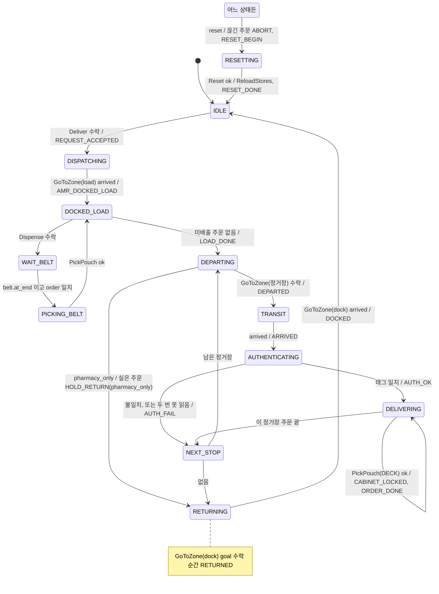
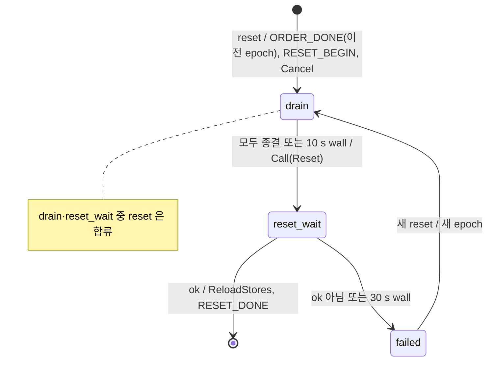
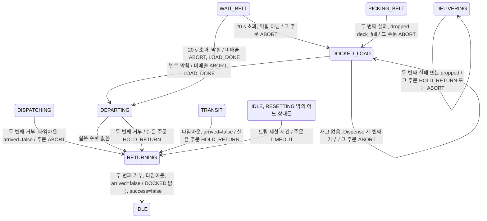

# ADR 0001 — 트립 순서는 오케스트레이터의 명시적 FSM 이 민다

- 상태: proposed
- 날짜: 2026-09-16
- 결정자: 임재범(orchestration). accepted 는 9/17 저녁 `v0.2.0` 스텁 한 바퀴가 이 FSM 으로 돈 뒤 팀이 바꾼다
- 승인 PR: (이 문서를 넣는 PR)
- 관련 issue / RFC / evidence review: [계약 v1](../architecture/delivery-contract-v1.md), [시나리오 4-5절](../planning/scenario.md#4-단계별-흐름), [일정 P1](../planning/schedule.md#phase-와-릴리즈)
- 대체 관계: 없음. [ADR README](README.md)의 후보 "BT vs FSM 선택"이 이것이다

## 맥락

요청 하나(트립)는 배차 → 도킹 → 봉투마다 배출·픽·적재 → 출발 → 도착 → 인증 → 봉투마다 검출·픽·놓기 → 복귀의 순서다.
그 사이에 [계약 5절](../architecture/delivery-contract-v1.md#5-인터락)의 인터락(팔이 홈일 때만 출발, 베이스가 서 있을 때만 팔 동작)과
[6절](../architecture/delivery-contract-v1.md#6-리셋-barrier)의 리셋 barrier, 주문마다 따로 남는 종료 상태가 있다.

제약과 관측:

- 작업일이 5일이고 오케스트레이션 담당은 한 명이다([일정](../planning/schedule.md)). 9/17 하루에 스텁 한 바퀴가 돌아야 9/18 통합을 시작한다.
- 지표는 전부 이벤트 stamp 의 차이다([시나리오 6절](../planning/scenario.md#6-측정-연결)). 순서기가 어느 순간 무슨 이벤트를 내는지가 곧 측정 정의다.
- `SUCCESS` 는 오케스트레이터가 판정하지 않는다. 평가 전용 경로(`/evaluator/cabinet`)가 판정한다([시나리오 5절](../planning/scenario.md#5-종료-상태)). 순서기는 "놓았다"까지만 주장한다.
- Nav2 는 안에 자기 BT 를 가지고 있다. 우리 순서기는 Nav2 밖에서 `GoToZone` 한 번을 호출할 뿐이다.
- 뼈대 규칙: 순수 전이 로직은 ROS import 없이 테스트한다([계약 안내](../architecture/README.md)). 이미 `terminal_states.py`, `pick_permission.py` 가 그 방식이다.
- 팀에 BehaviorTree.CPP 나 py_trees 경험이 있다는 기록은 없다(추정. 있으면 이 줄을 고친다).

## 대안

| 대안 | 비용 | 한계 | 반증 조건 |
| --- | --- | --- | --- |
| **A. 행동 트리** (py_trees 또는 BehaviorTree.CPP + Groot) | 새 의존성, 트리 설계 학습, 블랙보드 규약 | 병렬·재시도 표현은 좋지만 "지금 어느 이벤트를 냈는가"가 트리 틱 안에 숨는다. 순수 테스트가 어렵다 | 9/21 회고에서 병렬 분기(픽 중 다음 배출 등)가 꼭 필요해지면 |
| **B. SMACH / FlexBE** | ROS 1 유산, Jazzy 지원이 불안정 | 상태 클래스가 ROS 에 묶여 L1 테스트가 안 된다 | 없음 |
| **C. 순차 스크립트** (async 코루틴 한 줄씩) | 가장 빠름 | 취소·리셋·타임아웃이 스크립트 곳곳에 흩어진다. 상태가 무엇인지 로그로만 안다 | 없음 |
| **D. 명시적 FSM** (표 기반, 순수 Python, 입력 → 명령 목록) | 상태·전이 표를 우리가 유지 | 병렬 분기가 없다. 한 AMR 에 한 인스턴스 | 아래 결과 절의 재검토 조건 |

## 결정과 이유

**D.** `rokey_p3_orchestrator/trip_fsm.py` 에 트립 FSM 을 순수 Python 으로 둔다. 노드(`orchestrator_node.py`)는 액션 결과·상태 토픽·타이머 tick 을
FSM 에 입력으로 넣고, FSM 이 돌려주는 **명령 목록**(액션 goal 보내기, 서비스 호출, Event 발행, OrderStatus 갱신)을 실행한다.
FSM 은 ROS 를 import 하지 않는다.

이유:

1. 전이 하나 = 이벤트 하나. [계약 2.6](../architecture/delivery-contract-v1.md#26-이벤트-누가-무엇을-내는가)의 순서가 곧 전이 표라서 지표 정의와 코드가 같은 표를 본다.
2. guard = 인터락. 전이 조건에 `at_home`, `base_stopped`, `belt` 가 그대로 들어가고 L1 에서 "조건이 없으면 전이 안 함"을 검사한다.
3. 의존성 없음, 담당 한 명이 하루에 쓴다. 9/17 스텁 한 바퀴는 이 표를 코드로 옮기는 일이다.
4. Nav2 의 BT 는 그대로 쓴다. 우리가 BT 를 안 쓴다는 결정이지 BT 를 빼는 결정이 아니다.

적용 환경: ROS 2 Jazzy, rclpy, Python 3.12. Isaac Sim 5.1 은 FSM 과 무관하다.

## FSM 명세 v1

### 트립 상태

한 AMR 에 인스턴스 하나. `Deliver` goal 하나가 트립 하나다. 타임아웃은 sim time, 값은 [계약 7절](../architecture/delivery-contract-v1.md#7-id타임아웃재시도).
GitHub 미리보기는 5열 표를 세로로 접는다. 상태마다 제목과 `항목 | 값` 두 열만 둔다.

2026-09-17 에 이 절을 `rokey_p3_orchestrator/trip_fsm.py` 와 `test/test_trip_fsm.py`(기준 커밋 `5995899`)에 맞춰 고쳤다. 기준은 코드다.
같은 날 #56(배출 전 주문·벨트 막힘)과 #57(`pharmacy_only`), #58(보충 클라이언트)이 머지된 main `c4a9249` 로 다시 대조했다. `trip_fsm.py` 는 `7ac85b7` 과 같다.
이어서 #77(goal token)과 #80(리셋 barrier v2, 복귀 거부 재시도)이 머지된 main `fd13a46` 으로 한 번 더 대조했다.
코드가 계약 v1 과 다른 곳은 표를 코드로 바꾸지 않고 해당 상태의 "코드 차이" 행과 [코드 대조](#코드-대조)에 남겼다.

- 시한은 goal 을 보낸 시각부터 sim time 으로 잰다. 넘으면 FSM 이 그 goal 을 `Cancel` 하고 outcome `timeout` 결과로 처리한다.
- cancel 한 goal 이 종결(결과·거부·`canceled`)되거나 `cancel_wait_s`(10 s wall)가 지나기 전에는 트립의 새 goal·`Dispense` 를 보내지 않는다.
- goal 의 수락·거부도 결과 입력으로 들어온다(outcome `accepted`, `rejected`). 아래 "거부"는 goal 거부다.
- goal·서비스 호출마다 token 을 붙이고, 지금 기다리는 token 이 아닌 결과·피드백은 버린다([입력과 명령](#입력과-명령)).
- 주문을 닫으면 언제나 `OrderStatus`(종료 상태, reason) 다음에 `ORDER_DONE` 을 낸다.

#### `IDLE`

| 항목 | 값 |
| --- | --- |
| 들어갈 때 | 없음 |
| 나가는 조건 | `Deliver` 수락 → `DISPATCHING`. FSM 은 진행 중 트립 없음, 주문 있음, [정거장](#정거장)을 만들 수 있음만 본다. 나머지 수락 조건(ID 중복, 주문 풀, zone id 형식, 리셋 뒤 3 s)은 노드가 본다 |
| 이벤트 | `REQUEST_ACCEPTED`. 이어서 주문마다 `ACCEPTED` |

#### `DISPATCHING`

| 항목 | 값 |
| --- | --- |
| 들어갈 때 | guard `at_home` 확인 후 `GoToZone(load)`. 시한 120 s. **지난 트립이 도크에 못 돌아온 채 끝났으면**(`undocked`) 먼저 `GoToZone(dock_zone)` 을 보낸다. `arrived` 면 `undocked` 를 푼다. 그 뒤에만 `GoToZone(load)` 로 다시 들어간다. 도크 복귀 우선이다(#640, 계약 5절) |
| 나가는 조건 | `arrived` → `DOCKED_LOAD` |
| 이벤트 | `AMR_DOCKED_LOAD`. `arrived` 결과를 받은 순간 |
| 실패 | 거부 → 5 s 뒤 1회 다시 보낸다. 두 번째 거부, 타임아웃, `arrived=false` → 종료 안 된 주문 전부 `ABORT`(reason `goto_rejected`, `goto_timeout`, `goto_not_arrived`), `RETURNING`. 아직 실은 주문이 없어서 `HOLD_RETURN` 이 아니다([주문 상태](#주문-상태)) 재도킹(`undocked`) 중이면 시한 초과·미도착 reason 이 `redock_timeout`·`redock_not_arrived` 다(두 번째 거부는 그대로 `goto_rejected`) |

#### `DOCKED_LOAD`

| 항목 | 값 |
| --- | --- |
| 들어갈 때 | 미배출 주문이 없으면 `LOAD_DONE` 을 내고 `DEPARTING`. 있으면 먼저 벨트 막힘을 본다: `belt.occupied` 이고 그 봉투(`belt.order_id`)가 이 트립에서 이미 종료된 주문이면 막힘이다(아래 실패). 막힘이 아니면 `belt` 가 신선하고 `occupied=false` 일 때 재고에서 한 개를 빼고(주문마다 한 번) `Dispense(order)`. 조건이 안 맞으면 기다린다. 이 상태 자체의 시한은 없고 트립 제한 시간만 적용된다(이 트립 밖 주문의 봉투가 벨트에 있을 때가 그렇다) |
| 나가는 조건 | `Dispense` 수락 → 주문 `DISPENSED`, `WAIT_BELT`. 미배출 주문 없음 → `DEPARTING` |
| 이벤트 | `LOAD_DONE`(`DEPARTING` 으로 나갈 때). 재고 모듈이 돌려준 `DISPENSER_PAUSED`, `REFILL_REQUESTED` 를 `robot_id` `dispenser` 로 낸다 |
| 실패 | 재고 없음 → `Dispense` 를 부르지 않고 그 주문 `ABORT`(reason `out_of_stock` 또는 `unknown_item`), 다음 주문. `Dispense` 거부 → 2 s 뒤 다시 부른다. 세 번째 거부 → 그 주문 `ABORT`(reason 은 응답 `message`, 비었으면 `dispense_failed`), 다음 주문. 벨트 막힘 → 남은 미배출 주문 전부 `ABORT`(reason `belt_blocked`), `LOAD_DONE`, `DEPARTING` |

#### `WAIT_BELT`

| 항목 | 값 |
| --- | --- |
| 들어갈 때 | 없음. 시한은 `Dispense` 수락부터 20 s |
| 나가는 조건 | `belt.at_end` 이고 `belt.order_id` 일치 → `PICKING_BELT` |
| 이벤트 | 없음(`DISPENSED`, `POUCH_AT_END` 는 isaac 이 낸다) |
| 실패 | 시한 초과 → 그 주문 `ABORT`(reason `belt_timeout`). 그때 `belt.occupied` 가 true 면 막힘이다. 남은 미배출 주문 전부 `ABORT`(reason `belt_blocked`), `LOAD_DONE`, `DEPARTING`. 막힘이 아니면 `DOCKED_LOAD` 로 돌아가 다음 주문 |

#### `PICKING_BELT`

| 항목 | 값 |
| --- | --- |
| 들어갈 때 | guard `base_stopped` 와 벨트 끝 봉투가 그 주문인지(`belt.at_end`, `belt.order_id`) 확인 후 `PickPouch(BELT, order, slot k)`. k 는 이 트립에서 실은 순서(0부터). 시한 60 s |
| 나가는 조건 | `ok` → 주문 `LOADED`, `DOCKED_LOAD` |
| 이벤트 | 없음(`PICK_ATTEMPT`, `POUCH_PICKED`, `POUCH_LOADED` 는 arm 이 낸다) |
| 실패 | 상판 칸이 안 남음 → goal 없이 그 주문 `ABORT`(reason `deck_full`). `dropped` → 재시도 없이 `ABORT`. 그 밖의 실패(거부, 타임아웃, `rejected_interlock` 포함) → 같은 goal 1회 다시, 두 번째 실패 → `ABORT`(reason 은 outcome). 어느 경우든 `DOCKED_LOAD` 로 돌아간다. 닫힌 주문의 봉투가 벨트에 남고 미배출 주문이 있으면 `DOCKED_LOAD` 가 곧바로 벨트 막힘으로 처리한다 |

#### `DEPARTING`

| 항목 | 값 |
| --- | --- |
| 들어갈 때 | `pharmacy_only` 면 정거장으로 가지 않는다. 실은 주문을 전부 `HOLD_RETURN`(reason `pharmacy_only`)으로 닫고 `RETURNING`. 아니면: 실은 주문이 있는 남은 정거장이 없으면 `RETURNING`, 있으면 guard `at_home` 확인 후 `GoToZone(그 정거장)`. 시한 180 s, `TRANSIT` 까지 이어진다. **180 s 는 근거 없는 초안이다**([미해결 항목](#미해결-항목)) |
| 나가는 조건 | goal 수락 → `TRANSIT`. `pharmacy_only` 이거나 갈 정거장이 없으면 → `RETURNING` |
| 이벤트 | `DEPARTED`. `GoToZone` goal 이 수락된 순간(주행 시작). `pharmacy_only` 에서는 내지 않는다 |
| 실패 | 거부 → 5 s 뒤 1회 다시 보낸다. 두 번째 거부 → 실은 주문 전부 `HOLD_RETURN`(reason `goto_rejected`), `RETURNING` |

#### `TRANSIT`

| 항목 | 값 |
| --- | --- |
| 들어갈 때 | 없음 |
| 나가는 조건 | `arrived` → `AUTHENTICATING` |
| 이벤트 | 긴급이고 `distance_remaining <= arriving_distance_m`(기본 3.0 m) 이면 `ARRIVING`, 트립마다 1회. `arrived` 결과를 받은 순간 `ARRIVED` |
| 실패 | 타임아웃·`arrived=false` → 종료 안 된 주문(이 정거장과 이후 정거장 주문) `HOLD_RETURN`(reason `transit_timeout`, `transit_not_arrived`), `RETURNING` |

#### `AUTHENTICATING`

| 항목 | 값 |
| --- | --- |
| 들어갈 때 | guard `base_stopped` 확인 후 `ScanTag(kind, zone)`. 시한 30 s. 도착 직후 `base/stopped` 가 아직 true 가 아니면 기다린다([계약 5절](../architecture/delivery-contract-v1.md#5-인터락)의 팔 동작 guard 는 `ScanTag` 도 포함) |
| 나가는 조건 | `tag_id` 가 이 정거장의 태그(`pt-<환자 ID>` 또는 `st-<스테이션 ID>`)와 같음 → `DELIVERING`. `tag_id` 는 `ScanTag` 결과, 비었으면 마지막 `tag_reads` |
| 이벤트 | `AUTH_OK` / `AUTH_FAIL`. 판정이 난 결과를 받은 순간 |
| 실패 | 읽었는데 불일치 → 재시도 없이 `AUTH_FAIL`, 이 정거장 주문 `HOLD_RETURN`(reason `auth_mismatch`), `NEXT_STOP`. 못 읽음(`UNREADABLE`, 타임아웃, 거부) → 1회 다시, 두 번째도 못 읽음 → `AUTH_FAIL`, `HOLD_RETURN`(reason `tag_unreadable`), `NEXT_STOP` |

#### `DELIVERING`

| 항목 | 값 |
| --- | --- |
| 들어갈 때 | 이 정거장의 다음 주문에 guard `base_stopped` 확인 후 `PickPouch(DECK, order, -1)`. 시한 60 s |
| 나가는 조건 | `ok` → 주문 `DELIVERED`, 남은 주문 있으면 반복, 없으면 `NEXT_STOP` |
| 이벤트 | `ok` 결과를 받은 순간 `CABINET_LOCKED`, 주문 `DELIVERED`, `ORDER_DONE` 순서. `POUCH_DETECTED`, `POUCH_PLACED` 는 각각 detector·arm |
| 실패 | `dropped` → 재시도 없이 `ABORT`. 그 밖의 실패(`not_detected`, `qr_mismatch`, `grasp_failed`, 거부, 타임아웃, `rejected_interlock`) → 같은 goal 1회 다시, 두 번째 실패 → `HOLD_RETURN`(reason 은 outcome). 어느 경우든 다음 주문 계속 |
| 코드 차이 | 묶음(병실)에서 첫 침상의 주문이 끝나면 코드는 다음 침상의 주문을 같은 자리에서 `PickPouch` 한다. [코드 대조](#코드-대조) 1 |

#### `NEXT_STOP`

| 항목 | 값 |
| --- | --- |
| 들어갈 때 | 정거장 순번을 하나 올리고 인증·픽 시도 수를 0 으로 |
| 나가는 조건 | 실은 주문이 있는 남은 정거장 있음 → `DEPARTING`. 없음 → `RETURNING` |
| 이벤트 | 없음. `RETURNED` 는 `RETURNING` 에서 낸다 |

#### `RETURNING`

| 항목 | 값 |
| --- | --- |
| 들어갈 때 | guard `at_home` 확인 후 `GoToZone(dock_k)`. 시한 120 s |
| 나가는 조건 | `arrived` → `IDLE`, `Deliver` 결과 반환(`success` = `DOCKED` 했고 모든 주문 `DELIVERED`) |
| 이벤트 | `RETURNED`: 복귀 goal 이 수락된 순간 트립마다 1회. 정상 끝이든 실패 경로로 들어왔든 같다. `DOCKED`: `arrived` 결과를 받은 순간 |
| 실패 | 거부 → 5 s 뒤 1회 다시 보낸다. 두 번째 거부, 타임아웃, `arrived=false` → `DOCKED` 없이 `IDLE`, `success=false`. trip_time 은 null 로 기록, 리셋 대상. FSM 은 `undocked` 를 기억해 **다음 트립이 도크부터** 가게 한다(`DISPATCHING`). 리셋은 AMR 을 도크 자세로 되돌리므로 `undocked` 를 푼다 |

#### `RESETTING`

| 항목 | 값 |
| --- | --- |
| 들어갈 때 | 어느 상태에서든 `reset(epoch, now_sim, now_wall, drain)`. 진행 중 barrier(drain·reset_wait)면 **합류**한다: 아무것도 내지 않고 epoch·상한 그대로. 아니면(실패로 멈춘 barrier 포함) 새 barrier 를 시작한다. 순서는 ① 끊긴 주문을 `OrderState(ABORT, reset_interrupted)`·`ORDER_DONE` 으로 닫는다(이전 epoch·이전 request_id·같은 stamp, 이미 닫힌 주문은 그대로). 트립 중이었으면 `Finish(aborted)` ② 새 epoch 로 `RESET_BEGIN` ③ 노드가 넘긴 활성 goal(트립·보충)과 FSM 이 종결을 기다리던 goal 을 `Cancel` 하고 하위 단계 drain 으로 |
| 나가는 조건 | reset_wait 에서 `Reset` 응답 `ok` → `ReloadStores`, `RESET_DONE`, `IDLE`. 새 요청은 노드가 `RESET_DONE` 뒤 3 s wall 이 지나야 받는다 |
| 이벤트 | `RESET_BEGIN`(진입), `RESET_DONE`(`ok` 를 받은 순간, drain 상한을 넘겼으면 `detail` 이 `drain_timeout`). 끊긴 주문의 `ORDER_DONE` 은 이전 epoch 로 나간다 |
| 실패 | 하위 단계 failed(아래). 이 상태에서 받은 트립 결과는 버리고, drain 이 기다리던 token 의 종결 확인에만 쓴다 |

하위 단계. 상한은 wall 이고 노드가 `tick` 의 `now_wall` 로 넣는다(sim 이 멈춰도 상한이 돈다).

| 하위 단계 | 하는 일·끝·상한 |
| --- | --- |
| drain | 기다리는 token 이 모두 종결되면(`terminated` 입력, 또는 그 token 의 수락 외 결과) `Call(Reset, 새 epoch)` 를 내고 reset_wait 로. 상한 `cancel_wait_s`(10 s). 넘으면 `Note`(warning)를 내고 그대로 진행한다. 이때 종결이 안 온 goal 은 노드가 goal 표에서 빼고, 늦게 수락되면 곧바로 cancel 한다(#84) |
| reset_wait | `ok` → `ReloadStores`, `RESET_DONE`, `IDLE`. `ok` 가 아닌 응답(false·예외·`failed`) 또는 상한 `reset_timeout_s`(30 s) 초과 → failed. 이 barrier 의 token 이 아닌 응답은 버린다. 서버가 안 보이는 동안 노드는 호출을 잡고 있다가 `reset_timeout_s`(30 s)에 `failed` 를 넣는다. FSM 상한과 같은 tick 이라 실패는 한 번이다(#84) |
| failed | 종착. `Note`(error)를 한 번 내고 노드가 10 s 마다 다시 로그를 남긴다. `Deliver` 거부, `RESET_DONE` 없음, 자동 재시도 없음, 재고는 되돌리지 않는다. 새 `reset` 입력은 새 epoch 로 새 barrier 를 시작한다 |

트립 제한 시간은 `trip_limit_s` 다. 기본은 600 s sim 이다. 9/24 기준 기동 경로는 이 값을 넘기지 않는다. 늘 이 값이다. **재범 결정 9/24: 600 s sim 유지.** 계약 7절 ①이다. 도구의 wall 대기 한도 ②와 다르다. ②로 대체하지 않는다. 이 시간이 `IDLE`·`RESETTING` 이 아닌 어느 상태에서든 넘으면 종료 안 된 주문을 `TIMEOUT`(reason `trip_limit`)으로 닫는다. `RETURNING` 으로 간다. `RETURNING` 중이면 그대로 둔다.
진행 중인 goal 은 `Cancel` 하고, 그 goal 이 종결되거나 10 s wall 이 지난 뒤에 복귀 goal 을 보낸다.

`pharmacy_only`(조제실 구간만, #57) 한 바퀴의 이벤트는 `REQUEST_ACCEPTED → AMR_DOCKED_LOAD → DISPENSED → POUCH_AT_END → PICK_ATTEMPT → POUCH_PICKED
→ POUCH_LOADED → LOAD_DONE → ORDER_DONE → ARM_HOME → RETURNED → DOCKED` 다. 주문은 `HOLD_RETURN`(reason `pharmacy_only`), `Deliver` 결과는 `success=false` 다.
노드 파라미터 `pharmacy_only`(기본 `false`)로 켜고, 기동할 때 한 번 읽는다.

정상 경로와 리셋:



`RESETTING` 의 하위 단계. 끝(`[*]`)은 `IDLE` 이다.



실패 경로. 재시도(같은 상태로 다시 보내기)는 표에만 적는다.



### 주문 상태

트립 상태와 별개로 주문(봉투)마다 하나씩 간다. `/orders/status` 로 나간다.

```text
ACCEPTED → DISPENSED → LOADED → DELIVERED        (오케스트레이터의 주장)
   ↘ ABORT / TIMEOUT
               ↘ ABORT / TIMEOUT
                           ↘ HOLD_RETURN / ABORT / TIMEOUT
```

코드에서 각 화살표가 생기는 곳:

| 전이 | 어디서 |
| --- | --- |
| `ACCEPTED` → `DISPENSED` | `DOCKED_LOAD` 에서 `Dispense` 수락 |
| `DISPENSED` → `LOADED` | `PICKING_BELT` 에서 `ok` |
| `LOADED` → `DELIVERED` | `DELIVERING` 에서 `ok` |
| `ACCEPTED` → `ABORT` | 재고 없음, `Dispense` 세 번째 거부, 벨트 막힘, `DISPATCHING` 실패 |
| `DISPENSED` → `ABORT` | 벨트 시한 초과, 벨트 픽 실패, `deck_full` |
| `LOADED` → `HOLD_RETURN` | 주행 실패, 인증 실패, 놓기 실패(`dropped` 제외), `pharmacy_only` 의 적재 끝(reason `pharmacy_only`) |
| `LOADED` → `ABORT` | 놓기 중 `dropped` |
| 어느 비종료 상태든 → `TIMEOUT` | 트립 제한 시간 |

- `/orders/status` 의 `state` 는 `OrderStatus.msg` 상수다. `DISPENSED` 와 `LOADED` 는 둘 다 `STATE_IN_PROGRESS` 로 나간다(`orchestrator_node.py` 의 `ORDER_STATE_VALUES`).
- `DELIVERED` 는 "놓고 잠금 이벤트를 냈다"는 주장이다. `SUCCESS` 는 `event_logger` 가 `/evaluator/cabinet` 에서 그 봉투를 그 보관함에서 본 경우에만 run 기록에 쓴다.
  주장은 `DELIVERED` 인데 관측이 없으면 run 기록은 `ABORT`(reason `eval_not_observed`)다. 오케스트레이터는 평가 토픽을 구독하지 않는다.
- `HOLD_RETURN` 은 봉투가 상판 칸에 남아 있는 경우만이다. 봉투가 손을 떠났으면(`dropped`) `ABORT` 다. 여러 주문을 한꺼번에 `HOLD_RETURN` 으로 닫을 때 아직 `LOADED` 가 아닌 주문은 같은 reason 의 `ABORT` 로 닫는다(#56).
- `Deliver` 결과의 `success` = 모든 주문이 `DELIVERED`. 이것도 주장이다.
- 인터페이스 v1.1 에 `OrderStatus.STATE_DELIVERED=2` 를 추가한다([계약 10절](../architecture/delivery-contract-v1.md#10-인터페이스-v11-변경-목록)).

### 정거장

| 유형 | 정거장 목록 | 인증 태그 |
| --- | --- | --- |
| 1인·긴급 | 주문의 환자 침상 1개. 주문이 정확히 1건이어야 한다. 환자 침상을 모르면 `destination_id` | `pt-<환자 ID>` |
| 묶음(병실) | 주문들의 환자 침상. 요청에 적힌 주문 순서대로, 같은 침상은 처음 나온 자리에 묶는다. 침상을 모르는 환자가 있으면 거부 | 침상마다 `pt-` |
| 묶음(병동) | `destination_id` 스테이션 1개 | `st-<스테이션 ID>` 1회, 이후 봉투마다 놓기 |

환자 → 침상은 `order_pool.yaml` 이 준다. 긴급은 정거장 논리에 아무 차이가 없다. 차이는 발행기 큐의 순서와 `ARRIVING` 이벤트뿐이다.
정거장을 만들 수 없으면 FSM 이 요청을 거부한다(`IDLE` 의 수락 조건). 지금 `order_generator` 는 주문 풀에서 1인·긴급 요청만 만든다.

### 입력과 명령

FSM 은 아래 입력만 받고 아래 명령만 낸다. 노드는 이 둘을 ROS 로 옮기기만 한다. 이름은 `trip_fsm.py` 의 메서드와 명령 클래스다.

| 입력 | 출처 |
| --- | --- |
| `request(goal)` | `Deliver` goal |
| `result(action, outcome, detail, token)` | goal 수락·거부(outcome `accepted`, `rejected`), 액션 결과, 서비스 응답(`dispense`, `reset`). outcome 에는 `canceled`(wrapper status CANCELED)와 `failed`(서비스 false·예외·서버 없음)도 있다. token 이 지금 기다리는 것과 다르면 버린다. cancel 한 token 의 종결은 대체 goal 차단을 푼다. token 없이 넣으면 지금 기다리는 것의 결과로 본다(L1 표 테스트용) |
| `terminated(token)` | 노드가 아는 goal 하나가 종결됐다(결과·거부·보내기 전 cancel). 리셋 drain 이 기다리던 token 이면 뺀다. 노드는 epoch 확인 전에 넣으므로 이전 epoch 의 결과도 종결 확인에는 쓰인다 |
| `feedback(action, distance_remaining, token)` | `GoToZone` 피드백. 이전 goal 의 피드백은 버린다 |
| `state_update(name, value, fresh)` | `at_home`, `base_stopped`, `belt`, `holding` 의 최신값과 신선도(노드가 wall 로 잰다). v1 FSM 은 `holding` 을 판정에 쓰지 않는다. 낙하는 arm 의 outcome `dropped` 로 온다 |
| `tag(tag_id, kind, stamp)` | `tag_reads`. `ScanTag` 결과에 `tag_id` 가 없을 때만 쓴다 |
| `tick(now_sim, now_wall)` | 타이머. 액션 시한·트립 제한은 `now_sim`, cancel 종결 대기와 리셋 상한은 `now_wall` 로 잰다 |
| `reset(epoch, now_sim, now_wall, drain)` | 리셋 요청. 노드는 `epoch` 를 요청값과 상관없이 지금 + 1 로 넣는다(#84). `drain` 은 노드 goal 표의 활성 goal `(액션, token)` 목록이다(트립·보충). 진행 중 barrier 면 합류한다 |

token 은 `Token(epoch, owner, seq)` 이다. owner 는 `trip`(FSM) 또는 `refill`(보충 planner)이고, ROS goal UUID 와의 대응은 노드가 갖는다(#77). 액션 메시지 필드는 바뀌지 않았다.

| 명령 | 뜻 |
| --- | --- |
| `SendGoal(action, goal, token)` / `Cancel(action, token)` | 액션. `Cancel` 은 그 token 의 goal 만 |
| `Call(service, request, token)` | `Dispense`, `Reset` |
| `Emit(event, request_id, order_id, robot_id, detail, epoch, stamp)` | `Event` 발행. `epoch`·`stamp` 는 리셋으로 끊긴 주문을 닫을 때의 snapshot 이고, 비면 노드의 지금 epoch·sim time 을 쓴다. `robot_id` 가 비면 노드의 `robot_id`, 조제기 이벤트는 `dispenser` |
| `OrderState(order_id, state, reason, request_id, stamp)` | `OrderStatus` 발행. `request_id`·`stamp` 는 snapshot 이고, 비면 지금 요청·sim time |
| `Note(text, level)` | 노드 로그(`info`·`warning`·`error`). 판정에 쓰지 않는다 |
| `ReloadStores()` | 재고·선반·요청과 주문 사용 표시를 설정 파일 값으로 되돌린다. `/sim/reset` 이 `ok` 한 뒤에만 나온다 |
| `Finish(success, aborted)` | `Deliver` 결과. `aborted` 는 리셋으로 끊긴 경우 |

token 과 snapshot 필드(`epoch`·`stamp`·`request_id`)는 명령 비교(`==`)에서 빠진다. 그래서 L1 표는 명령의 종류와 내용만 비교한다.

L1 테스트는 "입력 순서 → 명령 순서"를 표로 검사한다. 1인 배송 정상 한 바퀴, guard 미충족 시 무전이, 각 실패 → 종료 상태, 리셋 중간 진입, 리셋 중에 들어온 결과 무시.
goal token 은 `test_goal_tokens.py`, 리셋 barrier 는 `test_reset_barrier.py` 가 본다. 뒤쪽은 노드 대역으로 drain 목록과 snapshot 발행도 확인한다.

### 보충은 FSM 밖이다

보충(`/m0609/refill`)은 트립 FSM 의 상태가 아니다(#58). orchestrator 노드 안의 `refill_planner.py`(ROS 를 import 하지 않는 모듈)가 재고의 보충 요청을 보고 goal 을 보낸다.
성공하면 재고에 반영하고, 멈춰 있던 약품이면 `DISPENSER_RESUMED` 를 낸다. 노드는 `Refill` 결과를 FSM 이 아니라 planner 에 넣는다.
planner 는 트립과 병렬로 돌고 goal 은 한 번에 하나다. 명령은 FSM 과 같은 `SendGoal`·`Cancel`·`Emit` 을 쓰므로 FSM 의 상태·전이·명령 집합은 바뀌지 않았다.
보충 goal 도 token(owner `refill`)을 쓴다. 이전 token 의 늦은 성공은 재고·선반을 바꾸지 않는다. 시한 초과로 cancel 한 goal 이 종결되기(최대 10 s wall) 전에는 재시도하지 않는다(#77, #80).
리셋 barrier 동안(실패로 멈춘 경우 포함) 노드는 planner 를 tick 하지 않아 새 goal 이 없다. 활성 보충 goal 은 노드가 drain 목록으로 FSM 에 넘기고, FSM 이 `Cancel` 한다.
이 병렬은 FSM 안의 분기가 아니어서 [결과](#결과) 절의 재검토 조건(적재와 보충을 FSM 안에서 동시에)에 해당하지 않는다고 #58 에서 정했다.

### 코드 대조

2026-09-17 에 위 표를 `trip_fsm.py`(기준 커밋 `5995899`)와 대조했다. 방법은 두 가지다. 코드와 `test_trip_fsm.py` 를 읽었고,
저장소 밖 스크립트로 순수 FSM 에 입력을 넣어 명령 목록을 봤다(L1 수준). ROS 노드·스텁·Isaac 은 이 대조에서 실행하지 않았다.

아래는 코드가 계약 v1 또는 이 ADR 의 정의와 달랐던 곳이다. 계약과 다른 곳은 표를 코드로 바꾸지 않고 여기 남겼다.
- 3, 4 는 #56 으로 해소됐다(main `c4a9249` 에서 재관측).
- 2, 5, 6 은 #77·#80 으로 해소됐다. main `fd13a46` 에서 같은 방법으로 1, 2, 5, 6 을 다시 관측했고, 위 표는 고친 코드를 따른다.
- 1 은 #243(`bafe2be`, "묶음(병실)에서 침상마다 이동·인증한 뒤 놓기")으로 해소됐다 — 아래 1 의 재관측(관측, 9/24 대조: 이 ADR 은 그때까지 1 을 미해결로 적고 있었다).

1. **해소(#243). 묶음(병실)에서 다음 침상으로 안 갔다.** 계약 2.6 은 "`ARRIVED` 부터 `ORDER_DONE` 까지를 침상마다 반복"이다.
   관측: 침상 둘(`bed_a1`, `bed_a2`) 요청에서 `bed_a1` 주문이 `DELIVERED` 된 직후, 코드는 `DEPARTED`·`ARRIVED`·`AUTH_OK` 없이
   `bed_a2` 주문의 `PickPouch(DECK)` 를 보낸다. 그 주문도 `ok` 면 `DELIVERED` 로 닫고 `RETURNING` 으로 간다.
   가설: `_orders_at_stop` 이 부르는 `_current_stop` 이 실은 주문이 있는 다음 정거장으로 `stop_index` 를 옮긴다. 기존 L1·L2 는 1인 배송만 돈다.
   재관측(`fd13a46`): 같다. `bed_a1` 주문 `DELIVERED` 직후 `ord-0002` 의 `PickPouch(DECK)` 가 나간다.
   재관측(9/23, main 7b808a5 빌드 스텁 한 바퀴, 병원 주문 풀): 병실 묶음 `ord-0001·0003·0004` 가 `bed_a1 → bed_a3 → bed_a4` 를 차례로
   `DEPARTED`·`ARRIVED`·`CABINET_LOCKED`·`ORDER_DONE` 하고 복귀한다. 실물: b40e133 · #240 5804528593 병실 묶음 C2(D5→D6→D7)가
   수락 뒤 255·309·362 sim s 에 차례로 잠겼다.
2. **해소(#80). `RETURNING` 에서 거부를 재시도하지 않았다.** 계약 5절은 `GoToZone` 이 거부되면 5 s 뒤 1회 재시도다.
   이전 관측: 복귀 goal 거부를 받으면 `DOCKED` 없이 바로 `Finish` 하고 `IDLE` 이었다. 모든 주문이 `DELIVERED` 였으면 `success=true` 였다.
   재관측(`fd13a46`): 첫 거부 뒤 2 s sim 에는 아무것도 없고, 6 s sim 에 새 token 으로 `GoToZone(dock_1)`. 두 번째 거부 → `Finish(success=False)`, `DOCKED` 없음. 모든 주문 `DELIVERED` 인데 `arrived=false` 여도 `success=False`.
3. **해소(#56). 배출 전 주문이 `HOLD_RETURN` 이었다.** `DISPATCHING` 실패는 봉투를 배출하기 전인데 주문을 `HOLD_RETURN` 으로 닫았다.
   `HOLD_RETURN` 의 정의("봉투가 상판 칸에 남은 경우")를 두고 코드를 고쳤다. 이제 `LOADED` 가 아닌 주문은 같은 reason 의 `ABORT` 다.
   재관측: `DISPATCHING` 에서 `arrived=false` → `ABORT`(reason `goto_not_arrived`). 실은 주문이 있는 `DEPARTING` 두 번째 거부는 `HOLD_RETURN`(reason `goto_rejected`).
4. **해소(#56). 픽 실패 뒤 벨트에 봉투가 남으면 트립 제한 시간까지 기다렸다.** 원래 표의 의도는 "벨트에 봉투가 남으면 막힘 규칙" 이었다.
   이제 `DOCKED_LOAD` 가 이 트립에서 이미 닫힌 주문의 봉투를 벨트에서 보면 막힘으로 처리한다.
   재관측: 벨트 픽 두 번 실패, 봉투가 벨트에 남고 미배출 1건 → 그 주문 `ABORT`(`grasp_failed`), 미배출 주문 `ABORT`(`belt_blocked`), `LOAD_DONE`, 실은 주문이 없어 `RETURNING`.
5. **해소(#80). 리셋이 cancel 을 기다리지 않았고 실패 경로가 없었다.** 계약 6절 1 은 cancel 완료를 최대 10 s 기다린다. 2.1절 `/sim/reset` 은 실패하면 run 무효, 재시작 래퍼로 넘긴다.
   이전 관측(`c4a9249`): FSM 이 `Cancel` 과 `Reset` 호출을 한 명령 목록으로 냈다. `Reset` 응답이 `ok` 가 아니면 `RESETTING` 에 머물렀다. 진행 중 주문은 종료 상태 없이 지워졌다.
   재관측(`fd13a46`, 트립 중 리셋, 노드 drain 에 보충 goal 1건):
   - 명령 순서는 `OrderState(ABORT, reset_interrupted)`(request_id `r001-0001`, stamp 1.5), `ORDER_DONE`(epoch 1, stamp 1.5), `Finish(aborted)`, `RESET_BEGIN`(epoch 2), `Cancel(refill)`, `Cancel(go_to_zone)`.
   - 5 s wall 동안 `Call` 없음. 트립 token `canceled` 뒤에도 없음. 그사이 온 리셋은 합류(명령 없음, epoch 2 그대로). 보충 token 종결 뒤 `Call(Reset, epoch 2)`. `ok` → `ReloadStores`, `RESET_DONE`.
   - drain 상한: 9.9 s wall 에는 없고 10.1 s 에 `Note`(warning)와 `Call`. 이어서 `ok` → `RESET_DONE` 의 `detail` 이 `drain_timeout`.
   - 실패: 응답 `failed` → failed 에서 `Note`(error), 60 s 뒤에도 그대로, `request` 는 빈 목록. 새 `reset(3)` → `RESET_BEGIN`(epoch 3), `Call(Reset, epoch 3)`. 이전 barrier token 의 늦은 `ok` 는 버림. 30 s wall 무응답 → 다시 failed.
   남은 것:
   - 재시작 래퍼가 failed 를 어떻게 감지할지는 정하지 않았다.
   - 결과가 영영 안 오는 goal 이 노드 goal 표에 남아 다음 리셋도 10 s 를 기다리던 것은 #84 로 해소됐다. drain 이 끝나 `Call(Reset)` 을 낼 때 노드가 남은 drain goal 을 표에서 빼고, 늦게 수락되면 곧바로 cancel 한다(코드 읽기, `test_drain_timeout_forgets_unterminated_goals`).
   - 지표에서는 [pharmacy-lap-pilot-v1](../../experiments/protocols/pharmacy-lap-pilot-v1.json) 이 끊긴 트립을 outcome `aborted` 로 분모에 넣기로 했다(proposed).
6. **해소(#77, #80). 같은 액션의 이전 goal 결과를 구분하지 않았다.** 입력에 goal ID 가 없고 노드는 epoch 만 비교했다.
   `TRANSIT` 타임아웃이나 트립 제한 시간으로 `RETURNING` 에 들어갈 때 진행 중 `GoToZone` 을 취소하지 않고 복귀 goal 을 보냈다.
   재관측(`fd13a46`):
   - `TRANSIT` 시한 초과(181 s sim) → `Cancel(go_to_zone)`(token 4), 주문 `HOLD_RETURN`(`transit_timeout`), `ORDER_DONE`. 5 s wall 동안 복귀 goal 없음.
   - token 4 `canceled` → `GoToZone(dock_1)`(token 5). token 4 의 늦은 `ARRIVED` 는 빈 목록. token 5 수락 → `RETURNED`.
   - 트립 제한 시간: `TIMEOUT`, `ORDER_DONE`, `Cancel`. 종결이 안 와도 10 s wall 에 복귀 goal.
   남은 것: fleet 내부 `NavigateToPose` 의 수락 전 취소는 navigation 코드라 확인하지 않았다.

## 미해결 항목

아래는 이 ADR 이 **정하지 못한 것**이다. 표의 값이 확정값으로 읽히지 않도록 여기 모은다.
출처는 issue #33 의 검토이다.

| 항목 | 지금 | 왜 미정인가 | 정해지는 시점 |
| --- | --- | --- | --- |
| **주행 시한 180 s** | `DEPARTING` 에서 `TRANSIT` 까지 180 s sim | 병동 구간은 P4 이고 주행만 따로 잰 분포가 없다. 보행자 회피나 저속 구역에서 모자랄 수 있다. 9/24 병원 10건(b40e133 · #240 5804528593): 1인 수락 → 보관함 잠김 148–168 sim s(적재·주행·인증 포함, 주행만의 값 아님). 138cbac 의 `ord-0003` `transit_timeout` 은 `bed_a3` 도착 뒤 방향(yaw) 정렬이 끝나지 않아 Nav2 가 취소된 것이다(master02 fleet 로그). #240 5798100488·5798652432 는 이 골든의 회차 댓글이다. 10건 1회차 원문 ID 는 미확인이다. 시한이 멈춘 주행을 끊은 사례다. 시한 값이 모자란 증거가 아니다. 50b658a 의 `ord-0003` `transit_not_arrived` 는 원인 미확인 | P4 pilot 주행 시간 분포 |
| **멈춤 판정 방식** | 시한 하나 | 시한은 느려진 것과 멈춘 것을 구분하지 못한다. `distance_remaining` 변화 없음(짧은 상한)과 전체 상한(긴 값)을 같이 두는 쪽이 낫다는 제안이 있다. `ClockWatch` 가 sim time 에 이미 같은 방식을 쓴다 | 위와 같이 P4 pilot |
| **묶음(병실)의 범위** | [정거장 표](#정거장)대로 침상 순회 | [시나리오 110·156·168줄](../planning/scenario.md)은 침상 순회이고, 병동 앞에서 간호사에게 넘긴다는 팀 이해와 다르다. 묶음(병실)을 빼면 `NEXT_STOP` 이 통과 상태가 된다. `DEPARTING` 은 인터락 guard 때문에 남는다 | 팀 결정 후 `scenario.md` 를 먼저 고친다 |

시한 자체를 없애지는 않는다. 없으면 안 끝나는 트립이 AMR 을 영구히 묶고, 지표가 전부 이벤트 stamp
차이라서 분모가 안 닫힌다. **실패도 수치로 남으려면 상한이 필요하다.** 바뀌는 것은 값과 판정 방식이다.

## 한계

이 FSM 이 감수하고 있는 것. 리포트의 "디지털 트윈으로 어디까지 검증했는가" 절에 그대로 들어간다.

- **리셋이 제품 경로에 있다.** `orchestrator` 가 `/sim/reset` 을 호출한다. 제품 코드가 시뮬레이터를
  아는 구조다. 실기기에서는 의미가 없고, 평가용 경로를 제품 경로에서 분리하는 것이 맞다.
  2주 안에 측정을 돌리려는 타협이다.
  리셋은 **다음 run 의 준비**이지 끝난 run 을 되돌리는 것이 아니다. run 중 실패는 `ABORT`·`HOLD_RETURN`·`TIMEOUT`
  으로 실패 그대로 기록하고 끝낸다. 실패를 지우고 다시 하면 성공률이 오염된다.
- **정지와 걸림 판정이 시뮬레이터 상태를 믿는다.** 벨트 걸림은 `BeltState` 의 `occupied` 와 `order_id`
  로 판정한다(시간이 아니라 논리다. 20 s `belt_timeout` 은 "배출했는데 끝에 안 왔다" 이고 그 시점에
  `occupied` 를 봐서 걸림인지 가른다). `base/stopped` 도 AMR 자신이 낸다.
  봉투가 물리적으로 끼었는지 독립적으로 관측하는 센서는 없다.

## 결과

- 만들 것(9/17): `trip_fsm.py`, `dispenser_inventory.py`(2슬롯·FEFO·임계값·정지·재개, 순수), `orchestrator_node.py` 배선, `test_trip_fsm.py`, `test_dispenser_inventory.py`.
- 감수하는 부채: 병렬이 없다. 픽하는 동안 다음 봉투를 배출하지 않는다(시나리오가 벨트 위 1개라 v1 에서는 손해가 없다). AMR 2대는 인스턴스 둘 + 배차기 한 조각이다. 배차기는 FSM 을 바꾸지 않는다.
- 예외 문서(9/22)가 실패 → 종료 상태 표를 확정하면 위 표의 "타임아웃·실패" 열이 그것을 따른다. 상태·명령 집합은 안 바뀐다.
- 재검토 조건: 9/21 회고에서 B+ 항목이 병렬 분기를 요구할 때(예: 적재와 보충을 동시에), 또는 정거장 3개 이상 묶음에서 표가 읽기 어려워질 때. 그때 A 를 다시 본다.

## 롤백

- 조건: 9/18 저녁까지 스텁 한 바퀴가 이 FSM 으로 안 돌거나, 실물 통합에서 상태가 표로 설명되지 않는 경우가 둘 이상.
- 방법: 순서기만 바꾼다. 계약의 이름·이벤트·guard 는 그대로라서 영향 범위는 `rokey_p3_orchestrator` 안이다. 대안 C 로 하루 안에 돌리고, A 는 시연 뒤에만 검토한다.
