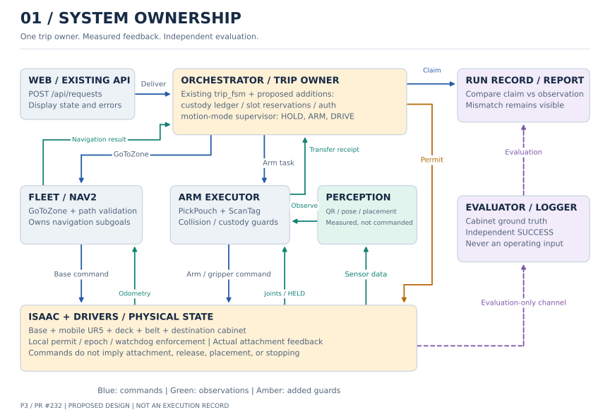
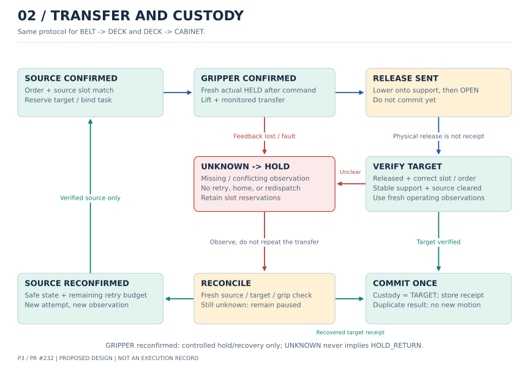
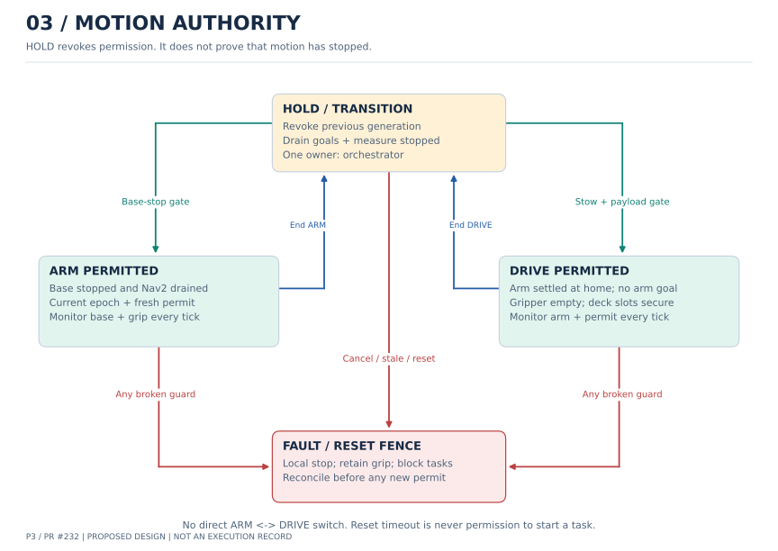
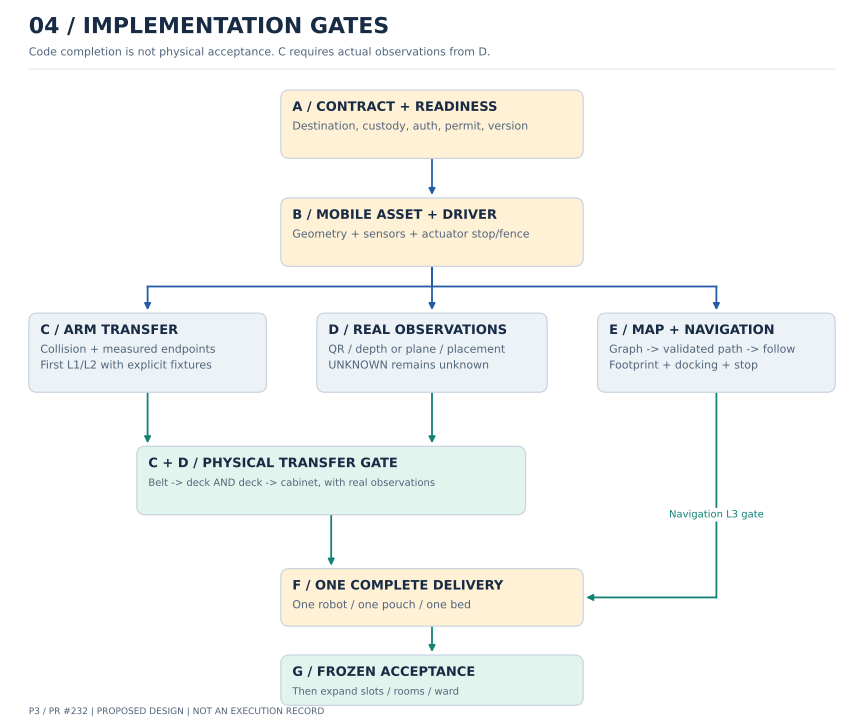

# UR5 배송 설계 재검토 — 목적지·물품 위치·제어권을 명시한다

- 상태: **unreviewed / 설계 제안**. 2026-09-19. 독립 검토자: 미배정.
- 대상: PR #232, 초안 `bd064984`, 기준 main `462b143`.
- 방법: 액션 정의, arm/fleet 실행·취소·홈 복귀, orchestrator 결과 분기와 계획 문서를 정적 대조했다. 아래 재현 조건은 실행하지 않은 반례다.
- 결과: 초안은 작업 분할에는 사용할 수 있으나, 목적지 결합·불확실한 인계·실행 중 인터록을 정하지 않아 **바로 구현 기준으로 쓰기에는 부족했다**. 아래 수정은 계획에 반영하며 제품 코드는 이 PR에서 바꾸지 않는다.
- 관련: [개정 구현 계획](../planning/ur5-hospital-delivery-implementation-plan.md), [배송 계약](../architecture/delivery-contract-v1.md), [측정 정책](../policy/metrics.md).

## 1. 발견 사항과 닫힘 조건

P0는 물품 오인도·중복 실행·동시 구동을 허용하는 설계 공백, P1은 구현·검증을 막는 공백이다. 실기 발생 빈도나 안전 인증 등급이 아니다.

| ID | 수준 / 코드 근거 | 반례·영향 | 설계 수정 / 후속 검증 |
| --- | --- | --- | --- |
| R1 | P0. [PickPouch.action](../../src/rokey_p3_interfaces/action/PickPouch.action)에 zone/source slot 없음. [arm_node.py](../../src/rokey_p3_manipulation/rokey_p3_manipulation/arm_node.py)의 `_accept_pick`, `_run_pick`은 고정 `_cabinet_frame` 사용 | 병상 A 인증 후 B로 이동해도 goal 자체는 어느 보관함인지 표현하지 못함. ScanTag가 이 파라미터를 갱신하는 경로도 없음 | 목적지·상판 원본 칸·인증을 한 작업에 결합. T01 |
| R2 | P0. [trip_fsm.py](../../src/rokey_p3_orchestrator/rokey_p3_orchestrator/trip_fsm.py)의 `_result_delivering`은 dropped 이외 실패를 재시도하고 마지막에 HOLD_RETURN | 해제는 됐으나 응답/안착 관측이 유실되면 빈 상판을 재파지하거나 이미 인도한 주문을 보유 상태로 기록 | 물품 위치 상태를 결과와 분리, UNKNOWN에서 재시도·재배출 금지. T02/T03 |
| R3 | P0. [fleet_node.py](../../src/rokey_p3_navigation/rokey_p3_navigation/fleet_node.py)의 `_on_goal`은 at_home 검사, `_tick`은 실행 중 at_home/RESET_BEGIN을 같은 방식으로 검사하지 않음 | 수락 뒤 홈 신호 소실·reset 시작에도 기존 cmd_vel이 살아 있을 수 있음. 단순 시작 guard만으로 동시 동작 방지 불충분 | 단일 mode 소유자와 수신부 로컬 연속 guard, 전환 시 실제 정지 확인. T04 |
| R4 | P0. arm `_wait_for_hold`은 명령 ID 없는 Bool을 확인, `dropped()`는 False만 낙하로 인식 | 직전 파지의 fresh true를 새 명령 결과로 오인하거나, 파지 중 stale→None을 정상처럼 통과할 수 있음 | 명령·관측 양쪽 상관관계와 HELD freshness, UNKNOWN 별도 처리. T05 |
| R5 | P0. arm `move_to`는 명령 점 발행 후 True, `_execute_pick` finally는 취소/reset/종료 외 실패에도 `start_homing()` | 목표 도달 전에 성공처럼 다음 동작, 물품 위치 불명·후퇴 실패 뒤 홈 동작이 가능 | 측정 종단 확인과 custody별 복구, 무조건 홈 복귀 제거 계획. T06 |
| R6 | P1. 초안은 “충돌 검증 계층”만 제시 | 링크·파지물 형상, collision 소유자·검증 실패 처리 없이 각 담당자가 서로 검증했다고 가정 | B의 geometry manifest → C의 보수적 회랑 검사와 검증 결과 계약. T07 |
| R7 | P1. 초안의 Dijkstra 출력과 Nav2 실행 경로 사이 연결 미정 | 그래프가 문 경유를 선택해도 Nav2가 다른 병실을 관통할 수 있음. global shortest claim도 성립하지 않음 | 경로 생성·허용 구역 검사·추종을 명시하고 revision 변경 시 중단. T08 |
| R8 | P1. 초안 C는 해제·안착 L3를 요구하지만 실제 관측 D는 선행 조건에서 빠짐 | 가상 attach/합성 관측만으로 C를 완료했다고 표시할 위험 | C의 L1/L2와 D 연동 L3 gate 분리, F 진입 조건 수정. T09 |
| R9 | P1. 초기·복귀·재시작·reset 뒤 상판 재고와 인증 유효기간 미정 | 오래된 인증/slot 예약 재사용, sensor 미수신을 빈 칸으로 오인, 불명 재고 재배출 | 초기 reconciliation, 인증 무효화, 중복 물리 실행 방지. T01/T03/T10 |

## 2. 시스템 구조와 상태 소유권

그림 1. **목표 설계**다. 파란 선은 작업 요청·명령 또는 운영 측 완료 주장, 초록 선은 운영 관측·결과, 보라색 점선은 평가 전용 경로다.
회색은 기존 구성요소, 주황색은 추가·보완 계약이다. 노드 전체가 구현되었다는 뜻은 아니다.

| 상태 | 유일한 소유자 | 다른 구성요소의 책임 |
| --- | --- | --- |
| 주문·트립·상판 예약 및 논리적 물품 위치 | 기존 orchestrator | arm은 물리 결과·관측 근거 반환, 웹은 명령 요청과 표시만 |
| 현재 DRIVE/ARM/HOLD 허가 | orchestrator 내부 mode supervisor | base_driver/arm/Isaac driver는 freshness·epoch·실측 guard를 로컬에서 강제 |
| 팔 동작 단계·실제 부착 상태 | arm 실행기 / Isaac 센서 각각 | 명령 상태와 측정 상태를 같은 변수로 덮어쓰지 않음 |
| Nav2 하위 goal·경로·취소 | fleet | orchestrator는 GoToZone만 호출. 별도 웹/복구 노드가 Nav2에 동시 명령 금지 |
| 운영용 물품 관측 | perception 또는 명시한 슬롯 센서 | simulator의 평가용 위치·객체 ID를 운영으로 우회 전달 금지 |
| 평가 SUCCESS | event_logger/evaluator | 운영 DELIVERED와 별도 산출. 상충하면 둘 다 기록하고 불일치로 보고 |

새 총괄 프로세스나 분산 스케줄러는 추가하지 않는다. mode supervisor와 custody ledger는 기존 orchestrator의 순수 로직 모듈로 둔다.
scene/map/geometry/calibration의 묶음 revision은 배포 시 고정하고 트립 중 교체하지 않는다.

## 3. 액션·관측의 구체적인 변경안

다음은 PR-A에서 리뷰할 **선택한 제안**이다. 현재 v1 필드가 아니며, 사람의 계약 승인 전 코드에 적용하지 않는다.
기존 액션 이름과 소유자는 유지하고 필드를 확장한다. ROS 인터페이스 필드 추가는 wire 호환으로 간주하지 않는다.
interfaces·server·client·adapter·stub을 같은 버전으로 빌드/배포하며, 버전 불일치·빈 필드는 readiness 실패다. 임시 Bool fallback으로 물리 경로를 활성화하지 않는다.

| 경계 | 필드·판정 제안 |
| --- | --- |
| PickPouch goal | 기존 필드 + `request_id`, `epoch`, `operation_seq`, `source_slot`, `destination_zone_id`, `cabinet_slot`, `auth_seq`, `scene_revision` |
| BELT→DECK | source_slot=-1, target_slot은 예약된 상판 칸. destination_zone_id는 `load`, cabinet_slot=-1, auth_seq=0. 벨트 order와 goal order 일치 |
| DECK→CABINET | source_slot은 그 주문의 확정 칸, target_slot=-1, destination_zone_id는 인증된 최종 zone, cabinet_slot은 예약된 목적지 칸. frame은 zones에서 유도하며 임의 frame 입력 금지 |
| 인증 context | ScanTag에서 얻은 관측에 orchestrator가 `auth_seq` 부여. epoch·request·zone·허용 주문 집합·정지 generation·scene revision과 함께 arm에 전달/확인. 한 정거장의 여러 주문은 허용 집합 안에서만 사용 |
| PickPouch result | 기존 success/outcome + `custody`(SOURCE/GRIPPER/TARGET/UNKNOWN), `observation_seq`. 결과는 immutable goal의 목적지와 묶임. ok는 TARGET 확인 시만 허용 |
| GripperCommand / Observation 신규 | 양쪽 모두 epoch·operation_seq·command_seq. 명령은 close/open, 관측은 source stamp·observation_seq·last_applied_command_seq·실제 상태·fault. ACK는 attachment 성공과 다름 |
| 운영 PlacementObservation 신규 | epoch·operation_seq·observation_seq·source stamp·zone/slot·관측된 order_id·occupied/unknown·confidence. arm이 제어에 사용하며 evaluator 메시지와 별도 타입/토픽 |
| 실행 명령 envelope 보강 | base/arm 명령에도 source epoch·permit generation·command_seq를 결합. 드라이버는 active permit과 일치하는 단조 증가 명령만 처리. 수신 시 최신 epoch를 덧붙여 과거 명령을 새것으로 만들지 않음 |
| MotionPermit 신규 | epoch·generation·heartbeat_seq·mode(HOLD/DRIVE/ARM)·수신 monotonic 기준 TTL. 하나의 publisher. 정상 heartbeat는 새 sequence, 재전송은 같은 sequence, 모드 전환은 generation 증가 |

`auth_seq`는 보안 인증 토큰이 아닌 오인도 방지용 작업 문맥이다. station/환자 QR 값은 기존 데이터에 대조하며, zone 이동·cancel·reset·base 이동·관측 시한 만료 시 무효화한다.
Bool 하드웨어를 adapter가 읽더라도 command ACK를 actual HELD로 만들지 않는다. 명령 처리 뒤 새 센서 관측이 없으면 UNKNOWN이다.
관측의 order_id는 실제 QR/센서에서 읽은 값이며 명령의 예상 order_id를 그대로 채우지 않는다.
각 수신자는 새 sequence의 유효 packet을 수신한 monotonic 시각으로 freshness를 계산한다. 다른 PC의 monotonic 값을 직접 비교하지 않는다.
허용 TTL·heartbeat 주기는 계약 기존값에서 시작해 명시적으로 검증한다. 리셋된 시뮬레이션 시간만으로 늦은 packet을 새것으로 만들지 않는다.

## 4. 물품 인계는 확인 가능한 상태 전이다

그림 2. BELT→DECK와 DECK→CABINET에 같은 전이 규칙을 쓴다. TARGET은 목적 슬롯이며, **그리퍼 OPEN만으로 COMMIT하지 않는다**.

`custody`는 목표 위치나 명령 의도가 아니라 마지막으로 확인한 물품 위치다.
처음에는 UNKNOWN이다. 초기화는 아직 주문을 실행하지 않는 준비 상태에서 상판·그리퍼·벨트 관측을 확보하는 단계이며, 물리 reset을 했다는 이유만으로 빈 상태를 주입하지 않는다. source 검출과 슬롯 예약 후 시작하며, 동일 order/slot에 동시 작업을 만들지 않는다.

| 상태/관측 | 허용 동작 | 금지 동작 |
| --- | --- | --- |
| SOURCE 확인 | source 점유·ID·예약 재검증 후 기존 총 retry budget 안에서 새 시도 | 오래된 pose 재사용, 다른 슬롯/주문 집기 |
| GRIPPER 확인 | 실제 부착을 유지하고 제한된 hold; 검증된 복구 위치로만 이동 | 빈손 홈 복귀, base 출발, 자동 해제 |
| RELEASE_SENT | 해제 및 목적 슬롯 관측을 기다림 | 즉시 재파지·주문 재배출·예약 해제 |
| TARGET 확인 | 그리퍼 해제 + 목적 슬롯 ID/안착 유지 + source에서 이동 확인 후 한 번만 COMMIT | 물리 전송 재실행, 결과 응답 누락을 실패로 덮기 |
| UNKNOWN / 관측 충돌 | HOLD, 내부 `PAUSED_RECONCILE`, 새 관측으로 SOURCE/TARGET/GRIPPER 판정 | 추정 HOLD_RETURN·DELIVERED, 자동 홈·재배출·다음 주문 |

운영 안착 기준은 목표 칸 안의 지지면 위에 있고 관측 창 동안 상대 위치가 안정적인 것이다.
허용 위치·속도·유지 시간과 occlusion 처리값은 calibration profile에 둔다. 한 프레임의 bbox 또는 gripper=false만으로 안착 처리하지 않는다.
센서가 UNKNOWN과 empty를 구분할 수 없으면 해당 물리 경로를 준비 완료로 판정하지 않는다.
재확인은 우선 정지 상태의 센서로 수행한다. 손목을 움직여야만 볼 수 있으면 HOLD에서 몰래 이동하지 않고, 최악의 파지물 형상까지 검증한 관측 복구 경로와 별도 ARM 허가를 요구한다. 그 경로가 없으면 operator 확인 또는 reset까지 유지한다.

COMMIT은 `(epoch, request_id, operation_seq)`에 대해 orchestrator에서 한 번만 처리한다.
중복 result/event는 이미 기록한 receipt를 반환/무시하며 물리 명령을 다시 발행하지 않는다.
이 키와 최근 물리 결과의 일관성은 같은 epoch에서 보장한다. **프로세스 재시작 후 자동 이어하기는 첫 범위에서 제공하지 않는다.**
재시작은 HOLD로 시작해 주문/물품/상판을 재확인하고 명시적 재개 또는 simulator reset을 거친다. 추후 crash-resume이 필요하면 durable journal을 별도 추가한다.

새 outcome은 `placement_unconfirmed`, `feedback_lost`, `motion_fault`를 제안하며 매핑도 PR-A에서 함께 변경한다.
물리 위치가 UNKNOWN이면 내부 PAUSED_RECONCILE에 남고, 현행 외부 주문 상태는 진행 중+reason/알람으로 표시한다.
실험 전체 시한 종료 시 TIMEOUT(reason=custody_unknown)으로 종료하며 재배출은 잠근다. 확인 없이 HOLD_RETURN으로 변환하지 않는다.
HOLD_RETURN은 상판 보유가 확인된 경우에만 사용하며, 복귀 성공은 별도 `DOCKED`/Deliver 결과로 확인한다.
확실한 낙하·소실은 ABORT, 확인된 목적 슬롯 인계만 DELIVERED 후보가 된다.
`CABINET_LOCKED`는 현재 FSM의 논리 이벤트다. 실제 잠금 액추에이터·센서가 없으면 물리 잠금 증명으로 사용하지 않는다.

## 5. 주행과 팔의 상호 배제 및 정지

그림 3. Mode는 주문 FSM 상태와 별개인 실행 허가다. HOLD는 “정지 확인됨”이 아니라 **새 움직임 허가를 철회한 상태**다.

1. ARM 진입: DRIVE 허가 철회 → Nav2 cancel/result 확인 → base_driver zero/watchdog → 실제 odom 정지 유지 확인 → 새 generation의 ARM 허가.
2. DRIVE 진입: ARM goal/homing 종료 → 실제 관절 정착·홈 확인 → gripper empty + 모든 운반 슬롯 안착 확인 → DRIVE 허가.
3. arm과 base_driver는 매 제어 주기 mode/epoch/TTL·필수 관측을 검사한다. fleet도 주행 중 팔 홈·permit 소실을 감시하고 Nav2를 취소한다. 명령 topic silence만으로 정지가 보장된다고 가정하지 않는다.
4. FAULT/cancel: permit=HOLD, 구동부 로컬 정지, 파지 해제 금지. 마지막 측정 위치로의 큰 점프를 만들지 않고 드라이버의 검증된 hold/stop 동작을 쓴다.
5. RESET_BEGIN: 모든 실행기에서 즉시 fence. 오래된 permit/command와 중복 sequence는 수신만으로 freshness를 갱신하지 않는다. 계약의 10 s drain 상한 뒤 reset을 진행할 수 있어도 **그 상한을 다음 작업 허가로 쓰지 않는다**. matching RESET_DONE + 드라이버 구세대 명령 폐기 + fresh 초기 관측이 모두 있어야 재개.
6. 취소 전에 늦게 수락된 하위 goal도 generation으로 찾아 취소하고 종료를 확인한다. 상위 action terminal과 하위 물리 정지는 서로 별도 관측이다.

초안의 “베이스 정지 후 팔 동작”을 실제 강제할 위치는 arm의 수락·매 tick과 Isaac actuator 입력단이다.
`at_home`에는 measured position뿐 아니라 충분한 관측 구간의 속도/정착과 no-active-goal/homing을 요구한다.
현행 결과 후 홈 복귀 이벤트 순서는 유지하되, **검증된 빈손 후퇴/홈 경로가 있는 성공 또는 SOURCE 확인 실패에서만** homing을 허용한다.
GRIPPER/UNKNOWN·후퇴 경로 불명은 자동 homing을 시작하지 않는다. ARM_HOME 이벤트도 명령 발행 종료가 아닌 실측 정착 후 발행한다.

## 6. 충돌 검증과 경로 실행의 구체화

### UR5: 첫 버전은 보정한 정적 작업 공간

PR-B가 link/TCP/cup/payload의 보수적 capsule·box 형상, 칸·벨트·보관함·베이스의 collision 형상과 frame을 geometry manifest로 제공한다.
PR-C의 신규 `ur5_path_validator.py`가 FK로 각 경로의 자기/환경/파지물 간섭과 joint/속도/가속도 한계를 확인한다.
approach/retract와 정해진 transit 회랑 후보를 검사하고 **검증 가능한 후보가 없으면 실행하지 않는다**. no-collision 결과를 빈 객체 목록으로 대체하지 않는다.
처음에는 NumPy 기반 보수적 형상 거리 검사로 범위를 제한한다. 실제 mesh 자유공간 탐색은 후속 planner 도입 검토 대상이다.

점 샘플 몇 개의 비충돌만으로 전체 경로를 보증하지 않는다.
관절 변화에 따른 링크·payload 최대 이동 상한과 측정 오차를 사용해 샘플 사이 여유를 보수적으로 검사하고, 경계 구간을 재분할한다.
상한 계산이나 여유 검증이 불가능하면 reject한다. clearance 예산에는 모델 오차, TCP/카메라 보정, 추종 오차, payload 형상 오차를 포함한다.
이 검사 결과는 `scene_revision + start joint snapshot + payload/slot + trajectory hash`에 묶는다. 시작 상태나 장면이 바뀌면 다시 계획한다.
검증한 정적 작업 구역에 새 장애물이 관측되면 HOLD 후 재계획한다. 동적 사람 회피나 실제 비닐 변형을 검증했다고 주장하지 않는다.

### Nav2: 그래프 경로를 실행 경로에 연결

첫 물리 경로의 fleet 내부 파이프라인 제안은 **Dijkstra(zone graph) → ComputePathThroughPoses → path validator → FollowPath**다.
외부 GoToZone 인터페이스를 유지하며, 이 모드에서는 기존 NavigateToPose/BT 복구와 동시에 실행하지 않는다.
Jazzy 소스에서 [ComputePathThroughPoses](https://github.com/ros-navigation/navigation2/blob/jazzy/nav2_msgs/action/ComputePathThroughPoses.action)의 경유·시작 pose와 [FollowPath](https://github.com/ros-navigation/navigation2/blob/jazzy/nav2_msgs/action/FollowPath.action)의 goal_checker_id를 확인했다.
[NavigateThroughPoses](https://github.com/ros-navigation/navigation2/blob/jazzy/nav2_msgs/action/NavigateThroughPoses.action) goal에는 goal_checker_id가 없으므로 외부 goal 필드만 추가한다고 공차가 선택된다고 설명하지 않는다.
실제 설치된 Nav2 패키지 버전은 PR-E manifest에 고정한다.

- edge마다 허용 통과 구역·필수 정지점·가용 폭·scene revision을 둔다. graph 비용은 비음수이며 실제 연속 공간 최적성을 보증하지 않는다.
- 현재 robot pose에서 첫 edge까지 연결 가능성을 확인한다. 가까운 zone으로 좌표를 순간 이동시킨 것처럼 시작하지 않는다.
- path validator는 전체 경로의 frame/revision·필수 통과 순서·허용 구역·footprint 여유를 검사한다. 경로와 구역 경계 사이도 보수적 보간으로 검사한다.
- 허용 구역 제한은 global/local costmap의 같은 keepout 설정에도 반영한다. 최초 path만 검사하고 추종·재계획이 금지 구역을 넘어가게 두지 않는다.
- 종단은 load/bed/station별 사전 로드한 goal checker를 선택하고 fleet의 최종 x/y/yaw·정지 판정과 맞춘다. 중간 through 구간을 모두 완전 정지시키지 않는다.
- 변화 감지·진행 정체 시 HOLD → 하위 goal 종료 → 최신 costmap에서 제한 횟수 재계획. spin/backup 자동 복구는 첫 물리 경로에서 제외한다.
- 과거 경로의 retry budget과 시간을 새 경로마다 초기화하지 않는다. 전체 GoToZone에 하나의 sim deadline과 wall clock-stall/통신 watchdog을 둔다.

## 7. 구현 의존성과 출구 조건

그림 4. 초안의 A–G 명칭을 유지한다. C/D/E의 코드 작업은 분리할 수 있지만 **각자 코드 완료와 물리 통합 합격은 다르다**.

| 묶음 | 초안에 추가할 작업 | 다음 단계의 필수 출구 |
| --- | --- | --- |
| A | PickPouch/command/observation/permit 계약 변경, custody·auth·retry 매핑, version readiness | 인터페이스·stub·웹 표시 변경표 확정. T01–T05 fixture를 계약과 같이 정의 |
| B | mobile geometry manifest, actuator fence/hold/실제 attach 관측, 센서 배선 | FK/장착 일치와 명령 소실·reset 로컬 정지 확인. 가상 attach는 증거 분리 |
| C | `ur5_path_validator.py`, 실측 종단, 실패별 homing, transfer receipt | 모의 관측 L1/L2 완료 후 **D 실제 관측과 결합해** 양방향 L3를 통과해야 물리 완료 |
| D | 운영 PlacementObservation, source/target QR와 지지면 안정 관측, UNKNOWN | 오인도·가림·해제 후 관측 누락 반례 통과. 실제 설치 센서로 확인 불가능하면 blocker 유지 |
| E | fleet path pipeline·costmap 구역 제한·작업별 goal checker, 주행 중 permit 감시 | 적재한 geometry와 허용 구역으로 경로/도킹/정지 L3 확인 |
| F | orchestrator의 `custody.py`·`motion_mode.py` 신규, 인증/예약·중복 result·재시작 reconcile, web reason | C+D 양방향 픽, E 이동, T01–T10 전체. 1대·1봉투·1침상 완주 |
| G | 사전 pilot/acceptance와 N칸 확장 | 실패 포함 증거, 독립 평가 일치. 코드 동작·측정 한계를 리뷰한 뒤 지원 장면만 기본 활성화 |

mode supervisor의 인터페이스와 최소 발행/소비 배선은 B/C/E에서 함께 준비하고 F에서 완전한 트립 전이를 연결한다.
F 전 테스트에서도 명시적 시험 supervisor만 허가를 발행하며, 실제 경로에서 permit 검사를 우회하지 않는다.

## 8. 설계를 반증하는 필수 시험

| 시험 ID | 입력/주입 시점 | 기대 결과와 증거 |
| --- | --- | --- |
| T01 | A 인증을 가지고 B cabinet 작업 또는 다른 source_slot 요청 | arm이 이동 전 거부. goal/auth/zone/slot ID 기록 |
| T02 | RELEASE_SENT 직후 결과/관측 패킷 유실 | UNKNOWN→HOLD. 재파지·재배출 0회, 새 TARGET 관측이면 COMMIT 1회 |
| T03 | COMMIT 결과 중복, 같은 주문 재접수, 프로세스 재시작 | 중복 물리 실행 0회. 재시작은 reconcile 전 출발/배출 불가 |
| T04 | 주행 중 home/permit 소실 또는 RESET_BEGIN, 취소 직후 늦은 Nav2 수락 | 정해진 wall 시한 내 로컬 정지·하위 goal fence. ARM과 DRIVE 동시 허가 0구간 |
| T05 | 새 grip 전에 지난 true 전달, grip 중 heartbeat 정지, 초기 무수신 | 이전 command 상태로 lift하지 않음. 진행 중 UNKNOWN이면 HOLD; 시작 관측 미확보는 bounded 실패 |
| T06 | 관절 응답을 명령보다 지연, 후퇴 IK 실패, 파지 상태에서 motion fault | 실측 전 ARM_HOME 없음, 불명 물품 상태에서 자동 homing 없음 |
| T07 | 샘플 사이 장애물·payload 모서리 충돌, 작은 dt/모델 revision 변경 | 경로 실행 전 reject 또는 새 검증. 시작 상태와 trajectory hash 일치 |
| T08 | Dijkstra 정상이나 Nav2 path가 금지 방 통과, 도중 edge 차단, 목표 공차 불일치 | 최초/재계획/추종 모두 구역 제한 적용. 다른 길 우회 시 유효성 재검증, 정렬 불가면 실패 |
| T09 | 가상 attach·명령 echo·evaluator ground truth만 있는 구성 | physical readiness 실패. 합성 시험은 L2에서만 집계 |
| T10 | reset 전 관측/인증·slot 예약이 reset 뒤 늦게 도착 | 이전 epoch 거부, 새 상판 점유 확인 전 주문 시작 없음 |

모든 시간 제한·오차 예산은 구현 PR에서 calibration profile의 **유한한 양수 값·단위·소유자·실패 처리**로 확정해야 한다.
없거나 미측정이면 acceptance를 차단한다. 현재 계획 단계에 새 수치나 합격률을 지어내지 않는다.
그림과 이 반례 표는 설계 검토 자료다. 제품 코드 시험·ROS L2·Isaac L3는 이 재검토에서도 **미실행**이다.

## 9. 다이어그램 원본과 남은 결정

SVG는 확대 가능한 저장소 산출물이며 [render_design.py](../images/ur5-delivery/render_design.py)로 재생성한다.
명령: `python3 docs/images/ur5-delivery/render_design.py` (Matplotlib 필요). PNG 미리보기는 `--preview-dir /tmp/p3-ur5-design-preview`를 추가해 지정한 디렉터리에 생성한다.
도면은 배치 치수도·로봇 도달성 증명·실측 상태도가 아니다. 설계의 데이터 경계와 허용 전이를 표현한다.

사람 검토가 필요한 결정은 PR-A의 ROS 인터페이스 일괄 변경, 모드 허가 소유권, 배포 가능한 관측 센서 구성이다.
센서·형상·지도 담당이 준비되지 않으면 C/E 물리 완료를 표시하지 않는다.
이 재검토는 작성자의 추가 검토이며 독립 리뷰 승인으로 계산하지 않는다.
