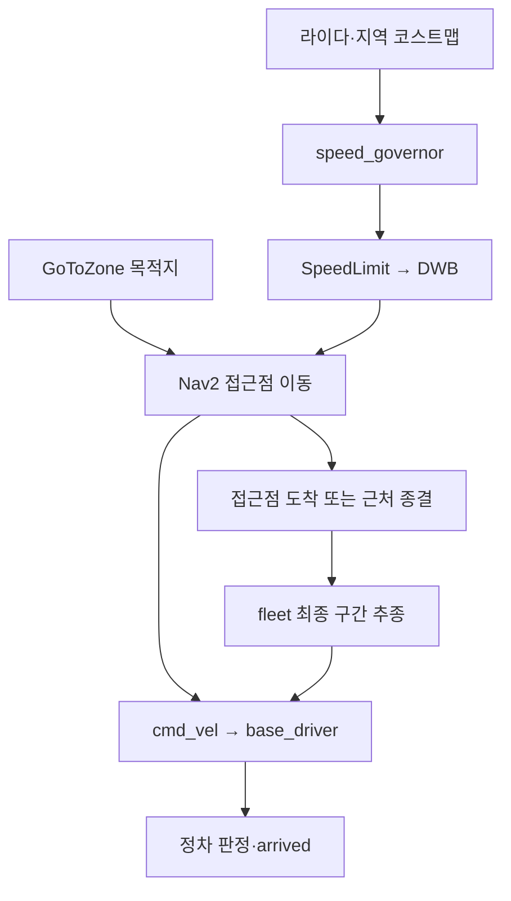

# P3A3 현황 재검토 — 네비게이션 결함, 통합 후보, 다음 실행 순서

- 2026-09-23. 독립 코드·증거 검토.
- 요청: 현재 어디까지 됐는지, 무엇을 해야 하는지, 무엇이 부족한지, 네비게이션의 실제 문제가 무엇인지 확인.
- 코드 기준: bfeb4af, 9/23 22:33:58 KST main.
- 현장 보고 기준: #240의 22:35 KST 보고까지. 22:39 main에 들어온 #609는 문서 갱신이다.
- 초판 #610은 검토 중 22:41 KST에 병합됐다. 이 보완판은 같은 문서를 교체하는 후속 PR이다.
- **확인 수준:** 소스·PR 패치·회차 보고를 대조했고, 감속기 순수 함수 오류를 로컬에서 재현했다. Isaac/ROS 실행과 원본 영상·rosbag의 직접 재검증은 하지 않았다.

## 1. 결론과 초판 정정

**병원에서 한 주문의 전 구간은 이어졌다. 다음 병목은 감속기의 실제 작동, 성공 조건을 보존한 후보 통합, 목적지별 내려놓기, 카메라 입력 전환이다.**

두 장비의 성공 보고로 **v0 통과가 확정**됐다. 초판과 초기 인계 댓글의 “통과 후보”는 후속 증거로 갱신한다.
다만 v0 완주가 적응 감속·AMCL·다침상 전달·여러 로봇의 동시 배송까지 입증하는 것은 아니다.

초판은 PR 설명을 요약하고 역할 분리를 권하는 수준이었다. 다음 사항이 빠져 있었다.

1. 감속기의 입력 메시지 값과 구현 상수 불일치.
2. 정상 빈 공간과 관측 불가를 같은 값으로 처리하는 오류.
3. 속도 제한의 최초 전달·재시작·수신 중단 처리.
4. Nav2에서 직접 속도 명령으로 넘어가는 최종 접근 구간.
5. 정차 오차와 팔의 도달 범위, 다침상 목적지 전달의 연결.
6. 시험마다 다른 후보를 실행해서 이미 고친 실패를 다시 만나는 비용.

이 보완판은 위 항목별로 **근거 → 영향 → 수정 방향 → 검증할 것**을 적는다.
레인 수만 보고 작업 동시 개수를 일률적으로 제한하는 제안은 철회한다.
충돌은 같은 파일의 작성자, 같은 장비의 실행자, 같은 배포 후보를 누가 확정하는지로 관리해야 한다.

## 2. 현재 상태: 완료·결함·미확인을 분리

| 영역 | 확인된 상태 | 남은 일 / 아직 주장할 수 없는 것 |
| --- | --- | --- |
| 병원 v0 | 모듈·원통 보충, 약통 QR 확인, A1 봉투 집기, bed_a1 인증·내려놓기, 복귀가 한 회차에 연결. 통과 확정 | 해당 SHA·설정의 성공이다. 최신 main이나 다른 후보 전체의 성공을 대신하지 않는다 |
| 반복성 | f8eac1c: master01 2/2, master02 1/1로 보고됨 | 표본은 작고 장비별 실행 인자가 완전히 같은지 추가 대조가 필요. 계획의 장비별 3/3은 아직 남음 |
| 약통 QR | 모듈 높이 +0.03 m 이후 장착 허용·REFILL_DONE 보고 | 확대 재판독 경로의 현장 기여는 미확인. 높이 변경과 확대 효과를 합쳐 성공으로 쓰면 안 됨 |
| 봉투 인식 | v0는 참값 센서 입력으로 성공 | 카메라 봉투 검출 → 자세 → 집기 → QR/DB 확인의 병원 전 구간 증거 필요 |
| Nav2 이동 | 전 구간 완주 및 AMR 본체 touch 0 보고 있음 | 적응 감속은 계산·전달 모두 결함. 최종 접근은 직접 추종기. AMCL 검증과 구분 |
| 적재 정차·IK | #598에 실측 봉투 정착점 기반 수정과 오프라인 결과 있음 | 그 PR의 통합 SHA에서 실제 정차·집기 반복 확인 필요 |
| 다침상 전달 | zone/경로 체계는 존재 | PickPouch 목적지 필드 부재가 실제 전달을 막음. bed_b1 등에서 이동·인증·내려놓기를 같은 목적지로 연결해야 함 |
| 다중 AMR 부하 | N=1–4 각각 한 회차, 첫 AMR 배송 성공 | 나머지는 센서를 켜고 정지. 다중 배송·교차로 양보·교착 회피 증거가 아님 |
| 성능 | N=1 의 RTF 는 0.450 이다. N=2 는 0.299 다. N=3 은 0.318 이다. N=4 는 0.267 이다. 측정 장비 GPU 는 80 W 부근이다 | 단순 VRAM 부족으로 설명되지 않는다. 전력 한도와 CPU, 물리, 렌더 비용을 분리해야 한다 |
| 분산 기동 | #602 코드 main 반영 | 두 PC의 동일 입력·DDS·clock·역할 중복 없음·한 바퀴 검증 필요 |
| 보충∥배송 | 병렬 구조와 관측 추가 PR #604 있음 | 보충 성공 두 번만으로 시간 겹침이 입증되지 않음. 실제 구간 겹침을 기록 |
| 발표·런북 | 성공 회차 기록 갱신 중 | 여러 문서 첫머리가 여전히 L3 미실행·과거 PR 대기. 운영 진입점의 현행화 필요 |

### 2.1 핵심 회차를 어떻게 읽어야 하나

| 보고 | 실행 / 관측 | 해석 |
| --- | --- | --- |
| 22:22 master02 | f8eac1c + rail-drive 1e5/1e4/5e4. 5/5, DOCKED sim 235.05, RTF 0.389. 모듈·원통 REFILL_DONE | 첫 연결 성공. 손가락/너클↔잡은 약통 touch 34줄은 원문대로 남긴다 |
| 22:26 master01 회차9 | f8eac1c. ORDER_DONE·DOCKED, 5/5, 본체 touch 0, RTF 0.444, 최고 1.00 m/s | 두 번째 장비 재현. #576에서 v0 통과 확정 |
| 22:32 master02 | e9b9498 + rail. 모듈 보충 없음, 내려놓기 not_detected. 관련 수정이 후보에 없음 | 속도 변경의 회귀라고 단정할 수 없음. 성공 후보 구성이 보존되지 않은 비교 |
| 22:35 master01 회차10 | f8eac1c. 5/5, 본체 touch 0, RTF 0.435, stall 0. 제한 50% 보고와 odom 1.00 동시 존재 | 완주 재현과 감속기 미작동이 동시에 관측됨 |

master02의 이동 42 s와 master01의 105/98 s를 바로 성능 차이로 계산하지 않는다.
요약의 시간 기준이 같다고 확인되지 않았고, RTF·경로·설정도 대조해야 한다.
다음 회차에는 각 이벤트의 **sim stamp와 monotonic wall stamp를 함께** 남긴다.

또한 “touch 0”은 대상을 적어야 한다.
AMR 본체↔환경 접촉, M0609↔환경 접촉, 그리퍼↔잡은 약통의 의도된 접촉을 같은 수치로 합치지 않는다.
센서에 설정된 접촉 보고 문턱도 후보 입력에 포함한다.

## 3. 현재 네비게이션 실행 구조

병원 실행 명령은 localization=odom, nav2_final_approach=true다.
[demo_v2.sh L354–365][launch-entry]와 [navigation.launch.py][nav-launch]가 근거다.



지도와 odom의 연결은 시뮬 도크 기준 TF다. base_driver는 시뮬 조인트 위치를 odom으로 만든다.
Nav2가 장거리 이동을 맡고, 고정물 옆 정밀 정차는 별도 추종기가 맡는다.
이 구성은 실제 구현 선택으로 기록해야 한다. 발표에서 전 구간이 Nav2 장애물 회피나 AMCL 위치 추정으로 수행됐다고 표현하면 범위를 넘는다.

## 4. 네비게이션 상세 발견

우선순위 P0는 **다음 속도 상향 후보의 검증 전에 해결할 항목**, P1은 **v1 확장 전 해결·확인할 항목**이다.
현재 코드 결함과 아직 현장에서 확인하지 않은 위험을 구분한다.

### N1 / P0 / 재현됨 — OccupancyGrid에 raw cost 기준 253을 적용

**근거**

- [speed_governor.py L20–55][governor]: LETHAL=253, value < lethal이면 장애물 계산에서 제외.
- [speed_governor_node.py L15, L30, L42–68][governor-node]: 구독 타입은 nav_msgs/OccupancyGrid, 기본 lethal 값을 그대로 전달.
- Nav2 Jazzy의 [Costmap2DPublisher][nav2-grid]는 내부 비용 253을 99, 254를 100, 255를 -1로 변환해 OccupancyGrid로 발행한다.
- OccupancyGrid의 data는 int8 배열이다. 정상 메시지에 raw 값 253을 그대로 넣을 수 없다.

**영향**

실제 장애물 값 99·100이 전부 걸러진다.
코스트맵을 받아도 clearance=None, 계산된 제한은 50%다.
이 계산 오류 자체는 “제한 50%가 controller에 전달되지 않아 1.00 m/s”인 전달 문제와 별개다.

**수정 방향**

OccupancyGrid를 유지한다면 의도한 장애물 의미에 맞게 99/100 기준을 사용하고 입력 계약을 명시한다.
raw 0–255 비용을 쓰려면 nav2_msgs/Costmap 구독과 메타데이터 접근까지 함께 바꿔야 한다.
토픽 이름만 바꾸거나 QoS만 바꾸는 수정으로 끝낼 수 없다.

**검증**

99, 100, -1, 0, 경계값과 혼합 격자를 실제 메시지 값 범위로 시험한다.
기존 테스트는 [test_speed_governor.py L10–15][governor-test]의 기본 장애물을 구현 상수 253으로 만들기 때문에 이 오류를 숨긴다.
구현 상수를 복사한 기대값 대신 외부 메시지 계약을 시험해야 한다.

### N2 / P0 / 재현됨 — 정상 빈 공간도 “모름 → 50%”

**근거**

clearance()는 탐색 반경 안에 장애물이 없을 때 None을 반환한다.
노드는 radius_m=far_m=1.8로 호출한다. limit_percent(None)은 50이다.

**영향**

N1을 고쳐도 충분히 관측된 빈 복도나 장애물이 1.8 m 밖에 있는 복도에서 100%가 되지 않는다.
장애물이 반경 경계를 넘어 멀어질 때 다시 50%로 떨어질 수도 있다.
기존 “빈 격자는 None” 시험과 “거리 5 m는 100%” 시험은 개별 함수를 통과하지만 실제 합성 경로를 검증하지 않는다.

**수정 방향**

최소한 다음 상태를 분리한다.

| 상태 | 필요한 처리 |
| --- | --- |
| 유효하고 관측된 탐색 영역, 장애물 없음 | far 이상임을 나타내는 거리 하한 또는 명시적 free 상태 |
| 장애물 검출 | 실제 거리와 기준점 정의 |
| 아직 미수신 / 오래된 데이터 / malformed | 보수 제한과 사유 |
| 탐색 영역 대부분 unknown | 관측 범위를 따져 보수 처리. 무조건 빈 공간으로 승격하지 않음 |

**검증**

clearance 결과를 limit_percent에 실제로 연결한 테스트가 필요하다.
전부 0인 격자와 전부 -1인 격자의 결과가 달라야 한다.
반경 안/밖 경계에서 제한이 비정상적으로 역전되지 않아야 한다.

### N3 / P0 / 코드와 현장 보고가 맞닿음 — 최초 제한 전달과 데이터 신선도

**근거**

- 노드는 초기화 때 50%를 한 번 발행한다.
- 이후 변화가 5% 미만이면 발행과 로그를 모두 생략한다.
- 발행 QoS는 TRANSIENT_LOCAL. 공식 Jazzy [controller_server][nav2-controller]의 SpeedLimit 구독은 QoS(10), 기본 VOLATILE다.
- 이 조합은 새 메시지의 전달 자체가 불가능한 QoS 조합은 아니다. 뒤늦게 생긴 VOLATILE 구독자가 과거의 한 번 발행을 받지 못하는 것이 문제다.
- 10초 타이머는 _seen이 한 번이라도 증가했으면 경고를 중단한다. 마지막 수신 나이나 지속적인 수신 끊김을 검사하지 않는다.
- #240 회차10은 제한 50%와 odom 1.00을 보고했고, 담당은 1초 재발행을 다음 수정으로 제시했다.

**수정 방향**

1. 제한 발행을 변화 로그와 분리한다. 같은 값도 재발행할 수 있어야 한다.
2. controller 활성화·재시작 뒤 제한이 실제 적용되기 전의 출발 정책을 정한다.
3. 마지막 코스트맵 수신의 wall age, 메시지 stamp, 유효성 상태를 추적한다.
4. 유효 데이터 뒤 수신이 끊기면 정한 시한 안에 보수 제한으로 돌아간다.
5. 재발행 타이머가 과거의 빠른 제한을 계속 보내지 않도록 한다.

**검증**

감속기 먼저/컨트롤러 먼저 기동, 컨트롤러 재시작, 첫 수신 전 이동 요청, 정상 수신 후 끊김을 각각 확인한다.
주행 중에는 입력 수신 횟수, 입력 age, 산출 제한, 실제 cmd_vel·odom을 같은 시간축으로 본다.

“speed_governor 로그가 한 줄”만으로 수신 0건을 단정하지 않는다.
N1 때문에 계속 같은 값이 계산돼도 로그는 한 줄이다.
회차10 보고의 “수신 0건”은 현장 보고로 존중하되, 이 리뷰가 그 원본 계측을 직접 확인한 것은 아니다.

### N4 / P0 / 설계 결합 — 최고 속도 상향이 근접 속도도 바꾼다

[nav2_params.yaml L98–110][nav-params]의 기본 최대 병진 속도는 1.0 m/s다.
현재 50%가 0.5 m/s인 것은 이 값에 의존한다.
#576의 다음 비교안에는 1.5 m/s가 있다. 50%를 유지하면 근접 제한은 **0.75 m/s**가 된다.

따라서 “복도만 빠르게, 가까운 곳은 0.5 유지”라는 요구를 만족하려면 절대 근접 속도와 비율을 함께 정의해야 한다.
최대 속도, 가감속도, 근접 기준 거리, 코스트맵 발행 2 Hz, 지연을 한 묶음으로 검토한다.
현재 값만으로 정지 거리·문 통과의 여유가 입증됐다고 볼 수 없다.

먼저 현재 최대 1.0 조건에서 50%/100%가 실제 속도에 적용되는지 확인한다.
그 뒤 속도를 올리는 후보를 별도로 비교한다.
감속기 수정·최고 속도·render-every를 동시에 바꾼 결과 하나로 각각의 효과를 설명하지 않는다.

### N5 / P1 / 코드 경로 확인 — 최종 접근은 감속기와 장애물 회피를 우회

[fleet_node.py L344–386, L397–445][fleet]의 동작은 다음과 같다.

1. Nav2 목표는 정차점 앞의 staging point다.
2. 접근점 0.5 m 안에서 Nav2 goal을 취소하고 직접 추종기로 넘길 수 있다.
3. Nav2가 SUCCEEDED가 아니어도 접근점 근처이면 직접 추종기로 진행한다. 코드 주석도 abort/cancel 양쪽을 포함한다.
4. 추종기는 cmd_vel을 직접 낸다. 코스트맵·SpeedLimit을 사용하지 않고 장애물 회피·재계획이 없다.

취소·리셋·시한·odom·팔 인터록 처리는 존재한다.
따라서 “모든 방어가 없다”고 말할 수는 없다.
문제는 장애물 때문에 Nav2가 실패한 경우에도 근처라는 이유로 최종 구간을 계속할 수 있다는 점이다.

**권고**

- 의도한 handoff 취소와 planner/controller 실패를 구분한다.
- 최종 접근 진입 전 경로와 로봇의 통과 영역을 확인하고, 장애물이 새로 들어오면 정지할 수 있게 한다.
- Nav2와 직접 추종기의 명령 소유권 전환을 기록한다.
- 속도 제한을 양쪽에 적용할지, 최종 접근 전용의 검증된 제한을 둘지 결정한다.

현재 follower_max_linear=0.4, arrive_xy=0.02 m, arrive_yaw=0.02 rad다.
따라서 “최종 접근에서도 1.0 m/s로 달린다”는 주장은 하지 않는다.
일반 zone 공차 0.15 m를 실제 정차 오차로 곧바로 간주하지도 않는다.

### N6 / P1 / 증거 범위 — 위치·지도·합본 외형을 별도로 확인

**위치 추정:** 병원은 odom 모드다. 런치 주석에는 전 높이 지도와 라이다 관측 차이로 AMCL이 0.18–0.31 m 어긋난 과거 회차가 기록돼 있다.
현재 성공을 AMCL 해결로 쓰지 않는다. 카메라·다침상 확대와 별개로, AMCL이 요구 범위라면 라이다 높이의 지도와 TF 대조를 다시 해야 한다.

**외형:** Nav2 footprint는 1.10×0.90 m 사각형이다.
[경로 생성기][hospital-nav-code]의 body는 0.9325×0.7932 m, riser 돌출은 0.034 m다.
수치 차이 자체가 결함을 뜻하지는 않는다. 팔 접힘·트레이·적재물과 회전 때의 외곽을 각 단계가 어떻게 보호하는지 대조해야 한다.

**관측:** 지역 costmap은 obstacle+inflation, 전역은 static+obstacle+inflation이다.
라이다 평면 밖의 낮거나 높은 구조물은 지역 감속 입력만으로 보장되지 않는다.
지도와 실제 PhysX 충돌 형상의 차이, 자기 몸체 반사, 적재물 돌출을 회차에서 확인해야 한다.

**문 형상:** [병원 주행 런북 6절][nav-runbook]은 #523 이후 문짝·문턱 제거 및 C1/C2 개구부 확대를 명시한다.
최신 런북의 벽 메시 폭은 약 1.97 m, 전 높이 지도 중심 여유는 0.90–0.95 m다.
옛 씬의 중심 여유 0.60 m를 현재 문 폭의 근거로 재사용하면 안 된다.

## 5. 네비게이션과 다른 모듈이 만나는 실제 막힘

### 5.1 적재 정차점이 실제 봉투 정착점과 달랐다

#598의 패치를 확인했다.
pharmacy.belt_end 계약 프레임 대신 실측 A1_SETTLED_XY=(-8.295, 5.036)를 적재 자세 계산에 사용한다.
zones·routes·카메라·도달 시험을 함께 갱신한다.

PR의 오프라인 결과는 기존 실측 수평 거리 0.779 m에서 뒤로 0.15 m 오차를 더하면 IK가 깨지고, 새 자세는 수평 0.70 m로 여유를 확보한다는 것이다.
이는 IK 수렴 허용 오차를 느슨하게 만드는 문제와 구분해야 한다.

**다음 관측:** 목표 pose, 실제 정차 pose, 봉투 검출 pose, 변환한 팔 좌표, IK 잔차, 집기 결과를 한 주문 ID로 묶는다.
정차 오차·봉투 위치 분산·카메라 추정 오차를 합친 조건에서 집기가 가능한지 본다.
실제 follower가 0.02 m를 목표로 한다는 사실과 최악 zone 공차를 넣은 오프라인 시험을 분리해 적는다.

### 5.2 다침상은 UI/주행의 zone 지원만으로 완성되지 않는다

[PickPouch.action][pick-action]에는 order_id, source, target_slot만 있고 zone_id가 없다.
[arm_node.py L341–342, L1200–1217][arm]는 이를 명시하고 cabinet_frame 파라미터로 목적지를 받는다.
target_slot=-1인데 cabinet_frame이 비어 있으면 요청을 거부한다.

이 상태에서 주문의 목적지와 Nav2 목표를 bed_b1으로 바꾸는 것만으로는 내려놓기 프레임이 주문별로 바뀌지 않는다.
**v1의 실제 완료 조건은 주문 목적지 → GoToZone → ScanTag → PickPouch 내려놓기 → CabinetObservation이 같은 zone을 가리키는 것**이다.

담당 작업은 인터페이스/계약, orchestrator goal 생성, arm 프레임 선택, 대역·검증 도구를 함께 갱신해야 한다.
서로 다른 두 침상을 번갈아 요청해 앞 주문의 목적지가 다음 주문에 남지 않는지도 확인한다.
지금 공개한 분석만으로 이 구현을 완료했다고 표시하지 않는다.

### 5.3 QR 수정과 카메라 집기는 서로 다른 단계다

#608 패치는 실제로 두 효과를 포함한다.

- 모듈 잡는 높이 +0.03 m와 QR 스티커 높이의 동기화.
- QR을 못 읽었을 때 확대해 재판독하는 경로.

첫 번째는 f8eac1c 현장 보고가 있다. 두 번째의 효과 로그는 아직 없다고 PR 자체가 명시한다.
오프라인 최소 여유 0.012 m는 하한 0.010 m보다 2 mm 크므로, 입력 형상·정차·실제 접촉을 함께 관찰할 필요가 있다.
이를 즉시 실패라고 판정하거나 오프라인 수치만으로 반복성을 보장하지 않는다.

카메라 봉투 집기는 별도 후보에서 검출 source, capture 시각, QR ID, DB 응답, 좌표 변환, 팔 결과를 연결한다.
카메라가 실패했을 때 참값으로 폴백한 성공은 별도 표기한다.
v0와 v1의 입력 모드를 실행 메타데이터와 발표 문구 모두에 적는다.

### 5.4 부하와 분산 기동

[AMR 대수별 부하 문서][load-report]의 N=1→2에서 loop_hz가 26.67→17.71로 약 34% 감소한다.
N=2와3의 순서가 뒤집히는 만큼, 한 회차씩의 결과로 미세한 차이나 정확한 대당 비용을 일반화하면 안 된다.

VRAM은 약 6.9–7.5 GB다. 관측 장비에서는 GPU 전력 한도와 낮은 RTF가 우선 조사 대상이다.
CPU/물리/렌더 비용을 분해하지 않은 상태에서 전력 상한만 제거하면 해결된다고 단정하지 않는다.
RTF<0.5라는 품질 판정선과 현장 중단선 rtf<0.2도 다른 기준이다.

#602의 역할 분산은 이미 main에 있다.
사용자가 요구한 두 PC 구성을 미루기보다, 같은 후보에서 역할 목록·DDS discovery·/clock·노드 중복·네트워크 지연을 확인하고 한 바퀴를 돈다.
제어 노드를 다른 PC로 옮겨도 Isaac 렌더·물리 부하 자체가 자동으로 분산되지는 않는다.

## 6. 후보와 PR 통합: 이미 고친 실패를 다시 실행하지 않기

22:32 e9b9498 회차는 모듈 높이와 내려놓기 수정이 빠진 후보여서 ①·④가 다시 실패했다.
이 사례가 병렬 작업 운영의 가장 구체적인 낭비다.
“main 최신”이나 “같은 기능 브랜치”라는 이름 대신 실행할 **정확한 트리와 입력**을 지정해야 한다.

### 6.1 검토 시점의 PR 구성

| PR | 확인 상태 | 다음 후보에 필요한 취급 |
| --- | --- | --- |
| #593 | main 반영 | 트레이 봉투 검출의 상대 운동 문제·병원 응답 시한 수정 보존 |
| #594 | main 반영 | 감속기 존재와 작동을 구분. N1–N4 후속 수정 필요 |
| #602 | main 반영 | 분산 역할 기동의 현장 검증 필요 |
| #598 | 열림, head 3913640, 패치 확인 | 적재 pose·zones·routes·카메라를 함께 반영하고 재생성 입력 확인 |
| #604 | 열림, head 847b688, 패치 확인 | refill_overlap 로그뿐 아니라 rail-drive 기본값 변경도 포함. 제목만 보고 “로그만”으로 분류하지 않음 |
| #608 | 열림, head e65fee1, 패치 확인 | 높이·스티커·확대 판독을 구분해 검증. 성공 회차 SHA와 이 통합 head는 별개 |
| #596 | 열림, head f369588 | 추가 AMR은 정지 센서 부하. 기본 1대 배송 후보와 촬영 대수 선택을 분리 |
| #609 | 22:39 main 반영 | 첫 성공 회차 기록. 후속 성공·수정 판단까지 자동 반영된 것은 아님 |
| #610 | 22:41 병합 | 초판의 부족한 분석을 이 후속 변경으로 교체 |

이는 조회 시점의 상태표다. 실행 직전에 PR 담당이 merge/head 상태를 다시 읽어 확정한다.
main에 머지됐다는 사실과 그 main에서 현장 성공했다는 사실을 같은 칸에 쓰지 않는다.

### 6.2 권하는 통합 순서

1. **성공 구성 보존:** f8eac1c 성공에 필요한 모듈 높이·스티커, #593, rail 인자, 씬·워크셀·params를 목록으로 만든다.
2. **단일 통합 후보:** #598·#604·#608의 승인된 변경을 최신 main 위에 직렬 반영한다. 파일 충돌은 작성자가 해결하고 후보의 오프라인 검사를 다시 한다.
3. **감속기 수정 후보:** N1–N3를 고치고 실제 1.0 m/s 상한에서 감속 적용을 확인한다. 재시작·미수신 처리를 포함한다.
4. **후속 비교:** 속도 상향/렌더, 카메라, 목적지 확장, 분산 기동은 효과를 구분할 수 있게 후보 차이를 기록한다.
5. **연속 주문·촬영:** 검증된 통합 SHA와 자산을 고정한 뒤 주문 10건과 장면별 촬영을 진행한다.

일부 개발은 병렬로 진행할 수 있다.
한 장비의 같은 프로세스·ROS 도메인에 서로 다른 후보를 동시에 배포하지 않는 것이 핵심이다.
master observer는 지정 후보를 실행·관측·종료하고, 현장에서 소스나 판정선을 고치지 않는다.

### 6.3 회차 카드에 반드시 들어갈 값

| 묶음 | 기록할 값 |
| --- | --- |
| 코드 | 전체 commit SHA, dirty 여부, 포함 수정 목록, 기준 후보와 diff |
| 입력 | scene/base/workcell/합본 자산/params/zones/routes/inventory의 경로와 해시 |
| 실행 | 장비, ROS_DOMAIN_ID, 역할, use_sim_time, rail-drive, render-every, 카메라·QR·참값 설정, AMR 수, seed |
| 성능 조건 | 냉/온 캐시, 다른 GPU 프로세스, 전력 한도, 창·녹화 상태 |
| 사건 | order_id, zone_id, phase, sim stamp, wall stamp, source, outcome |
| 산출물 | 로그·영상·rosbag 위치, SHA256SUMS, 담당, 판정 근거 링크 |

## 7. 바로 수행할 검증 묶음

아래는 새 합격선의 임의 확정이 아니다.
기존 v0 기준은 유지하고, 새 기능의 수치 기준은 실행 전에 확정한다.
현장 실행은 [hospital-full 런북][full-runbook]의 **창 모드 전 구간 한 바퀴** 규칙 안에서 수행한다.
기동 순서·메시지·실패 주입 등은 먼저 오프라인/ROS 통합 검사로 좁힌다.

| 순서 | 담당 제안 | 확인할 것 | 증거 / 종료 조건 |
| --- | --- | --- | --- |
| A1 | `sim/` 통합·속도 비교, 독립 검토 | 99/100/-1/0, 빈 격자, 반경 경계 | N1·N2 재현 시험이 수정 전 실패·수정 후 통과 |
| A2 | 같은 레인·격리 검증 | controller 선/후 기동·재시작, costmap 수신 중단 | 출발 전 제한 적용, 정한 age 초과 때 보수 처리, stale 고속 재발행 없음 |
| A3 | master01·master02 회차 | 현재 상한으로 전 구간 완주, 복도/문/최종 접근 | costmap count·age → limit → cmd_vel → odom의 시각 대응, 기존 v0 조건 보존 |
| B1 | `sim/` 통합·마스터 회차 | 최종 접근 handoff와 비정상 abort | 의도한 취소만 전환, 장애물·취소 때 정지, 명령 소유권 기록 |
| B2 | `sim/` 통합·마스터 회차 | #598 적재 정차·집기 | 실제 pose·검출 pose·팔 좌표·IK 잔차·성공을 한 주문에 연결 |
| B3 | 계약/`sim/` 통합·백엔드·프론트 | 목적지가 다른 두 주문 | 주문·주행·인증·팔·보관함 zone 일치, 잘못된 목적지 거부 |
| C1 | 비전·마스터 회차 | 카메라 봉투 경로와 약통 QR | 참값 폴백 여부 명시, 판독 성공 N/M·지연·집기 결과 |
| C2 | 속도 비교·마스터 회차 | 속도/렌더 비교 | 같은 경로·입력, sim/wall 분리, 접촉·적재물·정차 오차 유지 |
| C3 | 분산 기동·마스터 회차 | #602 양 PC 한 바퀴 | 단일 clock, 중복 노드 없음, 역할·토픽·성능 대조 |
| D | 전원 | v2 10건, 긴급·재보충·화면 | 주문별 종결 상태와 대기 사유, 실제 보충∥배송 구간, 영상 |

**네비게이션 계측 최소 집합**

- 입력: costmap 메시지 타입·QoS·namespace·width/height/resolution·0/-1/99/100 개수·수신 count/age.
- 계산: clearance 상태와 거리, 요청 제한 %, 적용 기준의 최대 m/s.
- 실행: Nav2 lifecycle/goal 상태, handoff 이유, 현재 cmd_vel 작성자, cmd_vel·odom 선속도 벡터 크기와 각속도.
- 결과: 단계별 sim/wall 시간, 실제 정차 pose 오차, AMR↔환경 접촉 쌍, 적재물 위치, 복귀·주문 종결.

카메라 비용은 평균뿐 아니라 처리 지연 분포와 stale 폐기 횟수를 본다.
감속기 정상 여부를 판단할 때 최고 속도 하나만 기록하지 않는다.

## 8. 11개 작업 레인을 어떻게 운영할 것인가

스크린샷은 역할과 표시 브랜치를 보여 준다.
같은 브랜치 이름이라는 이유만으로 같은 로컬 checkout을 동시에 수정한다고 단정할 수는 없다.
실제 장비·worktree·파일 담당을 확인해야 한다.

| 레인 | 지금 맡길 일 | 산출물·인계 대상 |
| --- | --- | --- |
| 계획·카드 | 현재 후보·필수 수정·다음 회차·완료 기준 확정 | #576에 단일 실행 카드. v0/v1/v2 상태 분리 |
| 속도·부하 | 감속기의 계산/전달 확인 후 속도·렌더 A/B, 부하 해석 | 같은 조건 비교표, 변경별 효과·비용. `sim/` 통합·계획 레인에 인계 |
| 백엔드 | 주문 목적지·상태·재고·DB 경로 확인 | zone/order ID 일치 증거, 10건 종결·대기 사유 |
| 비전 | #608 통합 head 검증, 카메라 봉투 집기 | 높이/확대/카메라 source별 결과·판독 N/M·지연 |
| master02 회차 | master02 지정 후보 한 바퀴·영상 | 입력 해시·전 구간 로그·접촉 쌍·영상 해시 |
| PR 통합 | 보호 경로 검토·의존성·충돌·후보 구성 관리 | 병합 순서, 정확한 통합 SHA, 오프라인 검사 결과 |
| `sim/` 통합 | N1–N5, 정차·팔 목적지·rail/씬 통합 | 소스 수정과 검증 가능한 후보. 공용 파일의 단일 작성자 지정 |
| master01 회차 | master01 재현·분산 기동 관측 | 동일 카드 결과, master02와 시간 기준·설정 대조 |
| 격리 검증 | 실행 head의 격리 빌드·인터페이스 시험 | 실제 메시지값 기반 검사, 성공 기능 회귀 검사. 구현 fixture 복사 금지 |
| 프론트 | 다침상·간호사 화면·오류/대기 표시 | API/order/zone과 맞는 화면 흐름, 촬영 화면 |
| 발표 | 현 상태와 주장 가능한 범위, 카메라 장면 검토 | 같은 SHA의 장면·원본 시각·화면·증거표 |

**이 검토의 범위**

이번에 실제로 수행한 것은 소스와 메시지 계약의 교차 검토, 감속기 오류 재현, 최종 접근·목적지 전달 분석, 기존 PR 패치의 실제 범위 확인이다.
다음 검토에서는 수정 PR의 99/100 처리·빈 공간·신선도·handoff 분기와 통합 head를 확인하고, 현장 보고를 같은 입력 기준으로 비교할 수 있다.
실행 호스트에 접근해 돌리지 않은 L3를 대신 승인하거나, 다른 레인이 댓글을 읽고 수락했다고 가정하지 않는다.

**운영 규칙**

- 파일별 수정 담당과 후보 확정 담당을 명시한다. 여러 레인이 동일 파일을 각각 고치는 상태를 피한다.
- 기동 직전 한 장비당 한 실행 카드만 활성화한다. 새 카드에는 이전 프로세스 종료 확인을 포함한다.
- 인계 댓글은 기준 SHA / 원인 / 변경 / 시험 / 다음 담당 / 필요한 답으로 작성한다.
- 성공·실패 원본은 보존하고 후속 판단을 덧붙인다.
- 분석 PR은 담당자가 발견 내용과 실행 우선순위를 확인한 뒤 병합한다. 문장 교정 통과만으로 기술 검토가 끝났다고 보지 않는다.

## 9. 일정과 완료 기준

#576의 현재 계획을 기준으로, 확인된 결함을 실행 순서에 반영한다.

| 시점 | 집중할 일 | 다음 단계로 갈 근거 |
| --- | --- | --- |
| 9/23 밤–9/24 오전 | 성공 후보 보존, 감속기 N1–N3, 실행 head 오프라인 검사·반복 | 제한이 실제 적용되고 기존 전 구간 성공이 유지됨. 장비별 3/3 계획의 진행률 명시 |
| 9/24 | 다침상 목적지 연결, 카메라 경로, 1350개 진열 범위, 분산 기동 | bed_b1 등 실제 전달 증거와 입력 source. 18칸 워크셀 성공을 1350개 집기 성공으로 확대하지 않음 |
| 9/25 | 연속 10건·긴급·재보충·화면 | 주문별 DELIVERED와 대기 사유, 중복/유실 없음, 겹침 구간 |
| 9/26 | 촬영 | 승인된 정지 캡처와 같은 SHA의 전 구간 원본 |
| 9/27–9/28 18:00 | 재촬영·증거 동결 | 최종 입력·영상·해시·발표 주장·실행 런북의 일치 |

카메라가 일정 안에 안 되면 참값 모드로 촬영할지, 촬영 AMR 수를 몇 대로 할지는 #576에 이미 사용자 결정 요청이 있다.
이 리뷰는 그 답을 대신 확정하지 않는다.
현재 확인된 성공 구성을 보존하면서 새 모드의 증거를 추가하는 방식으로 진행한다.

## 10. 문서와 관측에서 부족한 것

### 10.1 현재 운영 진입점이 오래됐다

검토한 [navigation README][nav-readme]는 L3 미실행 등의 과거 상태를 담고 있다.
[hospital-demo 런북][demo-runbook] 첫머리는 #553·#566이 열려 있고 main에서 hospital을 거부한다고 적지만, 실제 main은 병원 실행을 지원한다.
hospital-nav-l3도 앞의 “Nav2·라이다 없음”과 뒤의 실제 Nav2/odom 회차 기록이 섞여 있다.

과거 실험 기록은 보존하되, 문서 상단에 **현재 사용 절 / 검증된 SHA / 최신 회차 / 남은 항목**을 둬야 한다.
마스터 실행자가 읽는 기본 명령과 입력 경로를 성공 구성에 맞춰 갱신한다.
현재 상태의 권위 있는 진입점을 #576과 현행 런북으로 정하고 과거 기록에서 연결한다.

### 10.2 성공 로그와 효과 입증이 분리돼 있지 않다

- “5/5”는 장면 완료 수다. 카메라 인식률이나 감속 적용률이 아니다.
- “속도가 빨라졌다”는 같은 시간축·경로·입력 비교가 있어야 한다.
- “보충 2번 성공”은 배송과 시간상 겹침을 뜻하지 않는다.
- “N=4 완주”는 이번 실험에서 한 대 배송 + 세 대 정지 부하다.
- “CI 초록”은 ROS 메시지 계약이나 현장 물리 조건이 올바르다는 충분조건이 아니다.

각 주장을 코드 위치, 해당 입력, 관측 줄, 원본 파일 해시까지 연결해야 한다.

## 11. 이번 리뷰의 로컬 재현과 한계

### 11.1 실행한 최소 재현

아래는 저장소 루트에서 실행 가능한 재현이다.
ROS나 pytest 없이 현재 순수 함수의 입력 계약을 확인한다.

```bash
python3 - <<'PY'
import sys
sys.path.insert(0, "src/rokey_p3_navigation")
from rokey_p3_navigation import speed_governor as g

for label, value, offset in [
    ("occupied_100_near", 100, 3),
    ("inscribed_99_near", 99, 3),
    ("raw_254_near", 254, 3),
    ("occupied_100_far", 100, 19),
    ("observed_empty", 0, 3),
]:
    cells = [0] * (41 * 41)
    cells[20 * 41 + 20 + offset] = value
    outputs = []
    for threshold in (g.LETHAL, 99):
        d = g.clearance(cells, 41, 41, 0.1,
                        lethal=threshold, radius_m=g.FAR_M)
        outputs.append((d, g.limit_percent(d)))
    print(label, outputs)
PY
```

| 입력 | 현재 기본 253: 거리 / 제한 | 임계값만 99로 변경: 거리 / 제한 |
| --- | --- | --- |
| 실제 장애물 100, 0.3 m | None / 50% | 0.3 m / 50% |
| 실제 내접 장애물 99, 0.3 m | None / 50% | 0.3 m / 50% |
| raw 254, 0.3 m | 0.3 m / 50% | 0.3 m / 50% |
| 실제 장애물 100, 1.9 m | None / 50% | None / 50% |
| 전체 관측 자유 공간 0 | None / 50% | None / 50% |

raw 254 행은 기존 fixture 방식의 대조군이다. OccupancyGrid의 유효 전송값으로 사용하면 안 된다.
표의 0.3은 출력 부동소수점 0.30000000000000004를 반올림했다.
이 실험이 N1과 N2를 별개로 입증한다.

### 11.2 수행 / 미수행

| 확인 | 결과 |
| --- | --- |
| pinned 소스·런치·파라미터·런북·#240/#576 및 PR 패치 대조 | 수행 |
| 위 순수 함수 재현 | 수행, N1·N2 확인 |
| 기존 test_speed_governor.py의 test_ 함수 직접 호출 | **12/12 통과**. pytest 실행 결과가 아님 |
| python3 -m pytest | pytest 미설치로 실행 불가 |
| ROS 메시지 전송·QoS·노드 재시작 통합 시험 | 이 환경에서 미실행 |
| Isaac 전 구간·영상·rosbag 원본 직접 검사 | 미실행. 현장 담당 보고를 인용 |
| 전체 저장소 check_repository / colcon / ruff | 이 로컬 환경에서 미실행. 문서 PR의 GitHub CI 결과는 별도 확인 |
| 새로운 동작 수정 | 이 PR은 분석 문서 교체. 운영 코드 수정 완료를 주장하지 않음 |

## 12. 지금 필요한 결정과 인계

1. **`sim/` 통합·속도 비교:** 감속기의 입력값·빈 공간·전달·신선도를 한 수정 묶음으로 담당 지정. 1초 재발행만으로 완료 처리하지 않기.
2. **계획·PR 통합:** f8eac1c 성공 구성을 최신 통합 후보에 보존하고, 이미 수정이 빠진 e9b9498식 비교가 반복되지 않게 실행 카드 확정.
3. **인터페이스·팔·오케스트레이터 담당:** 목적지 전달을 함께 구현하고 다른 침상 두 곳에서 전체 전달 확인.
4. **master01·master02 회차·격리 검증:** 위 검증표에 맞춰 실제 속도 적용과 정차·집기의 연결 증거 수집.
5. **발표·런북 담당:** v0 통과 확정으로 갱신하되, odom·최종 추종기·참값 봉투 센서·정지 부하 AMR의 범위를 명시.

댓글을 게시한 것은 인계 요청이다. 담당 수락, 수정 완료, L3 통과는 각각 별도 응답으로 남긴다.

[governor]: ../../src/rokey_p3_navigation/rokey_p3_navigation/speed_governor.py
[governor-node]: ../../src/rokey_p3_navigation/rokey_p3_navigation/speed_governor_node.py
[governor-test]: ../../src/rokey_p3_navigation/test/test_speed_governor.py
[nav2-grid]: https://github.com/ros-navigation/navigation2/blob/jazzy/nav2_costmap_2d/src/costmap_2d_publisher.cpp#L91-L105
[nav2-controller]: https://github.com/ros-navigation/navigation2/blob/jazzy/nav2_controller/src/controller_server.cpp#L255-L257
[fleet]: ../../src/rokey_p3_navigation/rokey_p3_navigation/fleet_node.py
[launch-entry]: ../../tools/demo_v2.sh
[nav-launch]: ../../src/rokey_p3_navigation/launch/navigation.launch.py
[nav-params]: ../../src/rokey_p3_navigation/config/nav2_params.yaml
[pick-action]: ../../src/rokey_p3_interfaces/action/PickPouch.action
[arm]: ../../src/rokey_p3_manipulation/rokey_p3_manipulation/arm_node.py
[nav-runbook]: ../runbooks/hospital-nav-l3.md
[full-runbook]: ../runbooks/hospital-full.md
[load-report]: hospital-amr-count-load.md
[hospital-nav-code]: ../../sim/standalone/p3sim/hospital_nav.py
[nav-readme]: ../../src/rokey_p3_navigation/README.md
[demo-runbook]: ../runbooks/hospital-demo.md
