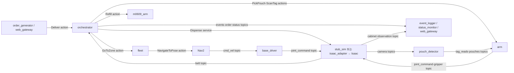

# 통신 경로와 상태 소유권 점검 (2026-09-17)

- 상태: **unreviewed**. 2026-09-17 `main` `bbb8e72`의 노드 코드·계약·웹 백엔드를 읽은 정적 점검이다.
- 작성: 제환. 대응 run: 없음. 실제 전체 그래프·자원 사용량은 측정하지 않았다.
- 2026-09-18 `main` `b39e047`에서 링크 대상 12개와 아래 주장을 다시 확인했다: `orchestrator`가
  `/m0609/arm/at_home`을 구독하지 않는 것, `/orchestrator/reset`이 요청 epoch를 쓰지 않고
  `self._epoch + 1`을 쓰는 것, 트립 단계 이름 12개, 어댑터 내부 토픽 7개, run 기록 파일 5개.
  그 사이 main에 들어온 변경 중 이 목록을 바꾸는 것은 없었다.

이 문서는 `main`의 ROS 노드 생성 코드, [배송 계약 v1](../architecture/delivery-contract-v1.md),
[노드 구성 분석](node-topology-v1.md)을 대조한 **정적 구현 목록**이다. 실제 배포에서 동시에
기동된 노드·토픽 수나 지연의 측정 결과는 아니다. 아래의 `구현`은 해당 코드 경로가 있다는
뜻이며 Isaac/다중 PC에서 동작을 검증했다는 뜻은 아니다. 계약은 `proposed`이고, 앞으로의
상태 제안은 인터페이스나 DB 스키마 확정이 아니다.

## 1. 선택 기준과 전체 경로

| 형식 | 여기서 맡는 일 | 결과·상태를 확인하는 경로 |
| --- | --- | --- |
| 토픽 | 센서·관절·속도·인터락처럼 생산 시점을 수신자가 정하지 않는 관측/명령, 여러 소비자가 보는 상태 변화·heartbeat·이벤트 | 구독 중인 각 노드가 새 메시지를 받을 때마다 갱신한다. `transient local`은 마지막 보관분을 늦은 구독자에게도 준다. 메시지 하나가 DB의 영속 상태가 되지는 않는다 |
| 서비스 | `Dispense`, `Reset`처럼 짧은 요청과 수락/실패 응답 | 응답은 호출자 한 곳으로 돌아온다. 다른 노드가 같은 사실을 봐야 하면 소유자가 별도 상태 토픽/이벤트를 발행한다. `/orchestrator/reset`의 즉시 `ok`는 barrier 완료가 아니다 |
| 액션 | 배송·이동·픽·스캔·보충처럼 시간이 걸리고 수락, 진행, 결과, 취소가 필요한 명령 | goal 클라이언트가 피드백/최종 결과를 받는다. 제3자 화면·기록은 `/events`, `/orders/status` 등 계약된 관측 경로를 읽는다 |

서비스를 한 번 호출하면 **그 호출자**가 응답을 한 번 받는다. 서비스 응답을 여러 노드에
자동 배포하지 않는다. 필요한 노드마다 서비스를 반복 호출해 현재값을 묻는 방식도 가능하지만,
이 프로젝트의 벨트·정지·홈·그립 같은 인터락은 지속 관측과 1초 stale 판정이 필요하므로
heartbeat 토픽으로 정의됐다. 주문 결과처럼 변화 시 발행하는 토픽은 계속 같은 값을 보내는
방식이 아니다. Isaac Sim 자체가 모든 단위의 ROS 토픽을 요구하는 것은 아니다. 지금 구조는
Isaac과 독립 ROS 노드를 잇는 프로젝트의 통신 선택이다.

그림의 `stub_sim`/`isaac_adapter`, `stub_fleet`/`fleet`, `stub_arm`/`arm` 등은
**대체 구현**이다. 같은 서비스·액션 서버 또는 상태 작성자를 동시에 켜는 구성은 유효한
배포안이 아니다. 이름의 `amr_1`은 현재 기본 로봇 한 대를 뜻한다. ROS 2 액션은 내부적으로
여러 토픽·서비스를 만들지만 아래 목록은 애플리케이션 인터페이스를 액션 한 건으로 센다.

## 2. 토픽: 작성자 → 구독자

표의 소비자는 코드에서 확인한 노드를 우선 적었다. `Isaac`은 `sim/standalone/`의
ROS 브릿지 또는 물리 시뮬레이터 쪽이며, `stub_*`은 L2 대체 노드다. `web_gateway`는
`--mock`이 아닌 ROS 연결 때만 존재한다. `status_monitor`는 읽기 전용이다.
`Isaac`이라고 쓴 작성자/소비자는 **계약상 역할**이며, 현재 스테이지에 그 배선이 모두
있다는 뜻이 아니다. 구체적인 구현 공백은 아래 표에 따로 적었다.
약어: **S** sensor/best effort, **R** reliable/volatile, **H** reliable/volatile 5 Hz
heartbeat·1초 미수신 시 unknown, **L** reliable/transient local. 정확한 depth·rate는
[계약 2절](../architecture/delivery-contract-v1.md#2-토픽서비스액션)을 따른다.

### 시뮬레이터·물리·시간

| 토픽 (타입) | 작성자 → 주요 소비자 | 용도·조건 |
| --- | --- | --- |
| `/clock` (`Clock`, R 목표 60 Hz) | Isaac 또는 `stub_sim` → sim time 사용 노드, `status_monitor`, `web_gateway` | 시뮬 시간. 작성자는 하나. 화면의 두 구독자는 S로 수신 가능하게 설정했다. 2초 wall 정지 시 새 goal 금지 |
| `/amr_1/joint_states` (`JointState`, S 30 Hz) | Isaac → `base_driver`, `arm` | 베이스 dummy 3관절과 UR5 6관절 관측. 1초 끊기면 두 제어기 명령 중지. 전체 Isaac 연동은 별도 검증 필요 |
| `/amr_1/scan` (`LaserScan`, S 10 Hz) | Isaac → Nav2/AMCL | 주행 거리 센서. Nav2 launch 설정에 의존 |
| `/amr_1/hand_camera/image_raw`, `/amr_1/hand_camera/camera_info` (`Image`, `CameraInfo`, S depth 2, 최대 10 Hz) | Isaac → `pouch_detector` | 봉투·QR 입력. 카메라 원본은 노트북의 팔 노드로 전달하지 않는다 |
| `/amr_1/front_camera/image_raw` (`Image`, S 5 Hz) | Isaac → 현재 소비자 없음 | C등급 사람 인식용, 기본 꺼짐. 켜질 때의 소비자·부하 계약 필요 |
| `/pharmacy/belt` (`BeltState`, H) | `stub_sim` 또는 `isaac_adapter` → `orchestrator`, `arm`, `stub_arm`, `status_monitor`, `web_gateway` | `occupied`, `at_end`, `order_id`; 배출·픽 인터락. 어댑터는 Isaac의 JSON 벨트 토픽을 변환한다 |
| `/amr_1/gripper/holding` (`Bool`, H, 계약 10 Hz) | Isaac 또는 `stub_sim` → `arm`, `orchestrator`, `status_monitor`, `web_gateway` | 실제 파지 여부. 이송 중 해제는 낙하 판정 |
| `/evaluator/cabinet` (`CabinetObservation`, L depth 50) | Isaac 또는 `stub_sim` → `event_logger`; 옵션으로 `status_monitor`, `web_gateway` | 평가 전용. 운영 노드 구독 금지. `SUCCESS` 판정의 유일한 물리 관측 근거 |
| `/m0609/joint_states`, `/m0609/gripper/holding` (`JointState` S, `Bool` H) | Isaac 또는 `stub_sim` → `m0609_arm` | 보충 팔 관절·파지 관측. 스텁과 Isaac의 중복 작성 금지 |
| `/tf`, `/tf_static` (`TFMessage`) | `base_driver`, AMCL, `zones_tf`, 로봇/센서 브릿지 등 → Nav2, `fleet`, 팔의 TF 조회자 | 프레임별 작성자 하나. 정적 zone TF를 두 번째 로봇 launch에서 중복 기동하지 않는다 |

### 제어·주행·팔

| 토픽 (타입) | 작성자 → 주요 소비자 | 용도·조건 |
| --- | --- | --- |
| `/amr_1/cmd_vel` (`Twist`, R 20 Hz) | Nav2 → `base_driver` | 베이스 속도 목표. 0.5초 미수신 시 0 명령 |
| `/amr_1/base/joint_command` (`JointState`, R 20 Hz) | `base_driver` → Isaac | dummy 베이스 관절 속도. 0.5초 미수신 시 Isaac 속도 0 |
| `/amr_1/odom` (`Odometry`, R 20 Hz) | `base_driver` → Nav2/AMCL, `fleet` | 베이스 관측과 도킹·정지 판단. 현재 dummy 관절 위치 기반 |
| `/amr_1/initialpose` (`PoseWithCovarianceStamped`, R depth 1) | `fleet` → AMCL | reset 후 로컬라이제이션 초기 자세 한 번 |
| `/amr_1/base/stopped` (`Bool`, H) | `fleet` 또는 `stub_fleet` → `orchestrator`, `arm`/`stub_arm`, `status_monitor`, `web_gateway` | 활성 주행 goal 없음 + 속도 임계/정지 유지. unknown이면 팔 동작 거부 |
| `/amr_1/arm/joint_command`, `/amr_1/gripper/command` (`JointState`, `Bool`, R) | `arm` → Isaac | UR5 관절 위치 궤적점과 흡착 열기/닫기. action goal의 저수준 실행 신호 |
| `/amr_1/arm/at_home` (`Bool`, H) | `arm` 또는 `stub_arm` → `fleet`/`stub_fleet`, `orchestrator`, `status_monitor`, `web_gateway` | 홈 허용오차 + 활성 goal 없음. unknown이면 출발 거부 |
| `/m0609/arm/joint_command`, `/m0609/gripper/command` (`JointState`, `Bool`, R) | `m0609_arm` → Isaac 또는 `stub_sim` | M0609 보충 동작의 저수준 명령 |
| `/m0609/arm/at_home` (`Bool`, H) | `m0609_arm` 또는 `stub_arm` → `status_monitor`, `web_gateway`; 계약상 `orchestrator` | 보충 팔 홈 관측. **현재 orchestrator 코드는 이 토픽을 구독하지 않는다**. 필요 시 guard 소비자 변경을 별도 계약/구현으로 진행 |

`sim/standalone/m0609_refill_stage.py`에는 `/m0609/rail/joint_states`와
`/m0609/rail/joint_command`도 있다. `pharmacy_stage.py`의 레일은 시연 확장으로,
배송 계약 v1 인터페이스가 아니며 현재 운영 흐름의 필수 경로로 세지 않는다.

### 인식·업무 관측

| 토픽 (타입) | 작성자 → 주요 소비자 | 용도·조건 |
| --- | --- | --- |
| `/amr_1/hand_camera/tag_reads` (`TagRead`, R) | `pouch_detector` 또는 `stub_detector` → `arm`/`stub_arm`, `orchestrator` | 환자·스테이션·봉투 QR 판독. 이미지 시각과 요청 시각으로 stale 판정 |
| `/amr_1/hand_camera/pouches` (`PouchDetectionArray`, R depth 5) | `pouch_detector` 또는 `stub_detector` → `arm`/`stub_arm` | 픽 후보 위치·confidence. 0건도 빈 배열로 발행 |
| `/orders/status` (`OrderStatus`, L depth 50) | `orchestrator` → `event_logger`, `status_monitor`, `web_gateway` | **주문별** 수락·진행·배송 주장·종료 상태를 변화 시 발행. `SUCCESS`는 운영 토픽에 발행하지 않고 평가 기록에서 판정 |
| `/pharmacy/dispenser/status` (`DispenserStatus`, L depth 1, 변화 + 1 Hz) | `orchestrator` → `status_monitor`, `web_gateway` | 슬롯 재고/로트/유통기한, 품목별 정지, 큐 길이, 벨트 점유를 보여주는 읽기 모델 |
| `/events` (`Event`, L depth 500) | `orchestrator`, 팔, 인식 노드, 시뮬레이터 또는 어댑터, 스텁 → `event_logger`, `status_monitor`, `web_gateway`, `fleet`, 팔 등 | 단계 전이·물리 사건·리셋 barrier 경계 기록/전달. `RESET_BEGIN`·`RESET_DONE`이 새 epoch를 싣고, 팔 제어 노드는 그 둘 사이에서 관절·그리퍼 명령을 멈춘다(계약 6절). 한 이벤트 이름의 작성자는 계약 2.6절에서 하나. `detail`은 판정용 필드가 아니다 |
| `/rosout` (`Log`) | ROS 노드 → `web_gateway` | WARN 이상 화면 로그. 배송 상태의 소유자나 명령 경로가 아니다 |

현재 스테이지와 계약을 혼동하기 쉬운 경로:

| 경로 | 정적 확인 결과 |
| --- | --- |
| `/amr_1/joint_states` | 계약은 베이스 dummy 3개 + UR5 6개. `pharmacy_stage.py`의 UR5 브릿지는 팔 관절 6개를 낼 수 있지만 dummy 베이스 3개 발행 경로는 이 스테이지에 없다 |
| `/amr_1/scan`, `/amr_1/cmd_vel`, `/amr_1/base/joint_command`, `/amr_1/odom` | navigation의 `fleet`·`base_driver` 코드와 계약은 있으나 현재 `pharmacy_stage.py`는 AMR 베이스·LiDAR를 제공하지 않는다. 전체 주행 루프가 연결됐다고 볼 수 없다 |
| 손 카메라와 UR5 관절/그리퍼 | `pharmacy_stage.py --ur5` 옵션에서 브릿지를 만들고, 손 카메라는 `--no-hand-camera`로 끌 수 있다. 실제 카메라 주기·QR 판독 품질은 L3 미검증 |
| `/amr_1/front_camera/image_raw`, `/evaluator/cabinet` | 전자는 계약상 선택 기능으로 현재 소비자가 없고, 후자는 `stub_sim` 발행은 있으나 `pharmacy_stage.py`의 평가기 발행 경로는 없다. 현재 Isaac 스테이지로 `SUCCESS`까지 확인했다고 적을 수 없다 |
| `/m0609/*` | `m0609_refill_stage.py` 또는 `pharmacy_stage.py`의 ROS 모드에 관절·파지/명령 배선이 있고, 스텁도 일부 관측을 낸다. 실제 캐니스터 장착과 재고 반영은 별도 통합 검증 필요 |

`/events`를 모든 노드가 모든 사건에 반응하는 공유 상태 버스로 보아서는 안 된다.
예를 들어 `fleet`는 `RESET_DONE`, 팔은 reset 경계, `order_generator`는 epoch를 읽는다.
소유자와 사건 이름은 [계약 2.6절](../architecture/delivery-contract-v1.md#26-이벤트-누가-무엇을-내는가)에 있다.

## 3. 서비스: 호출자 → 서버 → 뒤따르는 관측

| 서비스 (타입) | 호출자 → 서버 | 응답 의미와 완료 확인 |
| --- | --- | --- |
| `/pharmacy/dispense` (`Dispense`: `request_id`, `order_id` → `accepted`, `message`) | `orchestrator` → `stub_sim` 또는 `isaac_adapter` | 배출 요청 수락/거부. 실제 벨트 상태는 `/pharmacy/belt`, 물리 사건은 `DISPENSED`·`POUCH_AT_END` 이벤트로 확인. 어댑터는 Isaac JSON 요청/응답 토픽에 상관 ID를 붙여 변환 |
| `/sim/reset` (`Reset`: 새 `epoch` → `ok`, `message`) | `orchestrator` → `stub_sim` 또는 `isaac_adapter` | 시뮬레이터 reset 응답. 오케스트레이터가 취소 drain·재고 재적재 등을 거친 뒤 `RESET_DONE`을 내야 운영 barrier 완료 |
| `/orchestrator/reset` (`Reset`) | CLI 또는 `--allow-commands`의 `web_gateway` → `orchestrator` (`~/reset`) | 리셋 **접수** 응답. 현재 구현은 요청의 epoch 값을 사용하지 않고 자체 epoch를 올린다. 완료/실패는 이벤트·오케스트레이터 상태를 봐야 한다: `RESET_BEGIN`이 barrier 시작, `RESET_DONE`이 완료이고 실패하면 뒤쪽이 없다 |

Nav2의 lifecycle/parameter 서비스 등 ROS 프레임워크 내부 API는 프로젝트 업무 서비스
목록에서 제외한다. 이 서비스들의 호출과 응답도 다른 구독자에게 자동 전달되지 않는다.

## 4. 액션: goal 클라이언트 → 서버 → 결과

| 액션 (타입) | 클라이언트 → 서버 | goal / 진행 / 결과 |
| --- | --- | --- |
| `/deliver` (`Deliver`) | `order_generator`, 명령 허용된 `web_gateway` → `orchestrator` | `DeliveryRequest` 한 트립; `phase`, `current_order_id` feedback; 주문별 최종 `OrderStatus[]`와 모든 주문이 `DELIVERED`인지 나타내는 `success`. 평가 `SUCCESS`와 다름. 웹은 현재 수락 여부만 반환하고 진행은 `/events`로 본다 |
| `/amr_1/go_to_zone` (`GoToZone`) | `orchestrator` → `fleet` 또는 `stub_fleet` | zone ID 이동; 남은 거리 feedback, `arrived` 결과. 실제 `fleet`는 Nav2 action을 호출하고 정지·도킹 허용오차를 확인 |
| `/amr_1/navigate_to_pose` (`NavigateToPose`) | `fleet` → Nav2 `bt_navigator` | Nav2 주행 goal/feedback/result. 이름은 `fleet.navigate_action` 파라미터 기본값이며 배포에서 바꿀 수 있음 |
| `/amr_1/pick_pouch` (`PickPouch`) | `orchestrator` → `arm` 또는 `stub_arm` | 벨트→상판, 상판→보관함 픽/플레이스; phase feedback, `success`·`outcome` 결과. 팔은 검출·QR·벨트·정지·파지 상태를 검사 |
| `/amr_1/scan_tag` (`ScanTag`) | `orchestrator` → `arm` 또는 `stub_arm` | zone의 환자/스테이션 QR 스캔; phase feedback, 읽은 ID와 OK/UNREADABLE 결과 |
| `/m0609/refill` (`Refill`) | `orchestrator` → `m0609_arm` 또는 `stub_arm`의 선택 서버 | 빈 조제기 슬롯 보충; phase feedback, 성공·lot ID 결과. 재고 소유자는 `orchestrator` |

`GoToZone`을 완료하는 데 `fleet`·Nav2·`base_driver`·Isaac이 모두 참여하고,
`PickPouch`에는 팔·인식·Isaac이 참여한다. 참여 노드가 여럿이어도 같은 제어 대상의
활성 명령 작성자/액션 서버는 한 구성에서 하나씩이어야 한다. 액션이 끝나기 전에는
feedback·취소·timeout이 생길 수 있으므로 단발 서비스 응답으로 바꾸면 의미가 달라진다.

## 5. Isaac ↔ ROS 어댑터 내부 토픽

`pharmacy_stage.py --mode ros`는 표준 `Dispense`/`Reset` 서비스를 직접 제공하지 않는다.
`isaac_adapter`가 `std_msgs/String` JSON 토픽으로 왕복시키며, 이 JSON은 **통신 payload**다.
run별 `*.jsonl` 기록이나 DB 파일이 아니다.

| 내부 토픽 | 방향 | 외부 계약에 보이는 결과 |
| --- | --- | --- |
| `/isaac/pharmacy/dispense_request`, `/isaac/pharmacy/dispense_response` | adapter ↔ Isaac | `/pharmacy/dispense` 서비스 |
| `/isaac/sim/reset_request`, `/isaac/sim/reset_response` | adapter ↔ Isaac | `/sim/reset` 서비스 |
| `/isaac/pharmacy/belt` | Isaac → adapter | `/pharmacy/belt` `BeltState` |
| `/isaac/events` | Isaac → adapter | `/events` `Event` 중 `DISPENSED`, `POUCH_AT_END` |
| `/isaac/pharmacy/pick_notice` | adapter → Isaac, 옵션 | 스텁 픽에서 봉투 제거를 알림. 실제 UR5 픽이면 꺼야 함 |

어댑터의 JSON 요청/응답은 수락과 시간 상한을 가진 왕복 경로이며, 같은 이름의 외부
서비스 서버를 `stub_sim`과 중복 기동하지 않는다. `use_isaac_adapter:=true`만으로
`/clock`과 M0609 스텁 관측이 자동으로 꺼지지는 않는다. Isaac이 이를 발행할 때는
`publish_clock:=false`, `emulate_m0609:=false`도 지정해야 한다.

## 6. 현재 상태의 종류, 실제 소유자와 한계

| 상태/값 | 현재 권한·저장 위치 | 전달/사용 | 한계 |
| --- | --- | --- | --- |
| 트립 단계(`IDLE`, `DISPATCHING`, `DOCKED_LOAD`, `WAIT_BELT`, `PICKING_BELT`, `DEPARTING`, `TRANSIT`, `AUTHENTICATING`, `DELIVERING`, `NEXT_STOP`, `RETURNING`, `RESETTING`) | `orchestrator`의 `trip_fsm.py` 인스턴스 메모리 | `Deliver` feedback, 선택된 `/events`; 화면은 이벤트로 추정 | 재시작 후 복원 없음. 단계 전체의 authoritative 상태 조회 API 없음. `RESETTING` 내부 drain/reset_wait/failed는 별도 하위 단계 |
| 주문 상태(`ACCEPTED`, `IN_PROGRESS`, `DELIVERED`, `HOLD_RETURN`, `ABORT`, `TIMEOUT`) | `orchestrator` 메모리 | `/orders/status`, `Deliver` 결과, run 기록 | `OrderStatus.msg`에 `robot_id`, epoch 없음. 다중 AMR 배정과 reset 경계 조회에는 별도 계약 필요 |
| 평가 결과 `SUCCESS` | `event_logger`가 `/evaluator/cabinet` 관측으로 run별 계산 | `orders.jsonl` 등 실험 기록 | 운영 명령의 현재 상태나 재배차 입력으로 사용하지 않음 |
| 베이스 정지·팔 홈·그립·벨트 | 각 물리/제어 소유자 | H 토픽을 수신한 각 guard가 freshness 확인 | `Bool`의 false와 미수신 unknown을 구분해야 함. 새 구독자는 최근 메시지를 받기 전까지 unknown |
| 조제기 재고·정지·대기 | `orchestrator` 재고 모듈 메모리; YAML은 초기 입력 | `/pharmacy/dispenser/status`, `/events` | DB 영속화·재시작 복원 없음. 벨트 물리 관측과 재고 기록의 불일치 대응은 통합 검증 필요 |
| 요청/명령 진행과 취소 | `orchestrator`의 FSM token(`epoch`, owner, seq), 각 액션 서버 | 액션 결과·feedback, 일부 이벤트 | 전역 command ID/조회 이력 없음. 늦은 결과는 token으로 무시. 파일 로그는 제어 상태 저장소가 아님 |
| run 증거 | `event_logger` | `events.jsonl`, `order_status.jsonl`, `cabinet.jsonl`, `orders.jsonl`, `meta.json` | 검증/사람 확인용 불변 기록. 현재 로봇 상태 DB 아님 |
| 화면용 조립 상태 | `status_monitor`/웹 `WorldState` 메모리 | 읽기 전용 화면/API | 이벤트에서 추정한 단계이며 FSM 원본과 다를 수 있음. 재시작 시 다시 구독해 채움 |

`terminal_states.py`는 가능한 주문 종료 이름과 판정 함수를 정의한다. 현재값을
보관하지 않는다. `config/order_pool.yaml`, `config/dispenser.yaml`은 초기 입력이다.
현재 `robot_id`별 `IDLE`/`RUNNING`, 작업명령 코드, 명령 이력을 저장·조회하는 DB는 없다.
DB를 추가하더라도 ROS 토픽은 실시간 관측/인터락, 액션은 명령 수행, DB는 최신 운영
상태·이력 조회라는 서로 다른 목적을 맡는다.

## 7. 기능 확장 전에 정의할 상태 (제안; 현재 미구현)

아래 항목은 모두 **필요성 검토 목록**이다. 토픽을 항목마다 새로 만들자는 뜻이 아니다.
소유자, freshness, 갱신 시점, 리셋/재시작 규칙, 읽는 주체를 계약/ADR에서 정한 다음
형식을 고른다. 하나의 읽기 모델이나 DB 행에 여러 필드를 묶을 수 있다.

| 후보 상태 | 언제 필요한가·값 예시 | 권한 주체와 전달 후보 | 결정 전에 풀 문제 |
| --- | --- | --- | --- |
| 로봇 운영 상태 | 다중 AMR 배차·관제. `robot_id`, `IDLE`/`BUSY`/`BLOCKED`/`ERROR`/`OFFLINE`, 현재 request/command | 배차기/오케스트레이터가 전이를 소유; DB 최신 행 + 변화 통지 후보 | 트립 단계·주문 결과·물리 readiness를 한 코드로 섞지 않기. 상태 전이표, 재시작 시 복원/재확인 정의 |
| 작업명령 수명 | 명령 접수·실행·성공·실패·취소·timeout, 중복 제출 방지. command ID/code, robot ID, request/order ID, epoch, 시각, reason | 명령을 수락한 서버가 소유; 액션 feedback/result + DB 이력/조회 API 후보 | 액션 goal UUID와 업무 command ID 관계, 멱등 키, 취소 뒤 늦은 결과, 재시작 처리 |
| 배차 및 공유 자원 | AMR 2대가 조제기·벨트·적재 zone을 함께 사용. 로봇 배정, 예약/lease, 큐 순서, 만료·해제 | 단일 배차기와 조제기 소유자; DB/조회와 필요한 인터락 관측 후보 | `/deliver` 서버·재고·epoch를 로봇마다 복제하면 충돌. 공정성, 선점, 교착 해제 |
| 연결/신선도/준비 | Isaac·Nav2·팔·인식 연결, `/clock`·joint/scan/카메라 지연, tf 유효성 | 각 실행 주체의 로컬 watchdog + 집계 health 읽기 모델 후보 | 마지막 수신 wall 시각, stale/unknown 기준, 통신 단절 때 로컬 정지 보장 |
| 안전·고장 | 비상정지, 제어기 fault, 충돌, 파지 상실, 수동 개입 필요, 복구 허가 | 고장을 검출한 제어 주체가 소유; 안전 경로/관제 상태 후보 | fault와 주문 `ABORT` 분리, latch/ack/reset 권한, 실제 장비 안전 인터페이스 |
| 리셋·세션 | 현재 epoch, `drain`/`reset_wait`/`failed`/`ready`, 완료 시각 | `orchestrator`가 소유; 완료/실패를 조회 가능한 읽기 모델 또는 상태 인터페이스 후보 | 현재 `/orchestrator/reset`은 접수만 응답한다. 시작은 `RESET_BEGIN`으로 보이지만 실패하면 `RESET_DONE`이 없어 화면에서 '진행 중'과 구분되지 않는다. 신규 요청 거부와 복구 절차를 명시 |
| 조제기·M0609 진행 | 보충 예약·진행·실패 원인, 슬롯 장착 확인, 재고 불일치 | 재고는 orchestrator, 물리 동작은 M0609/Isaac; 액션 feedback/result + 재고 상태 후보 | `m0609/arm/at_home`의 운영 guard 소비, 실물 관측과 재고 commit 경계, selfdemo와 운영 모드 구분 |
| 주행·위치·픽 품질 | 로봇별 현재 zone/pose 신뢰도, 주행 실패, 검출 confidence, QR 불일치 | `fleet`/AMCL, `arm`/인식 소유; 기존 액션 feedback/결과·센서 토픽 우선 | 배차에 필요한 요약과 고빈도 원본을 구분. 카메라 원본을 관제/DB로 보내지 않기 |
| 화면 접속·관측 품질 | 데이터 마지막 갱신, 이벤트 누락, 화면의 추정 상태 여부 | `web_gateway`/모니터가 자신이 받은 시각을 표시 | 화면 값이 authoritative FSM 값처럼 보이지 않게 출처·stale 표시 |

특히 `OrderStatus`에 로봇 ID/epoch가 없는 상태에서 AMR 2대의 `/orders/status`를
그대로 합치면 화면과 기록이 어느 로봇의 주문인지 안정적으로 알기 어렵다. 이를
바꾸려면 인터페이스 메시지, 발행자, 소비자, run 스키마를 함께 변경하는 계약 PR이
선행돼야 한다. 다중 AMR의 노드 수 추정과 공유 자원 문제는
[노드 구성 분석](node-topology-v1.md#amr-2대와-m0609)에 따로 정리돼 있다.

## 8. 구현·검증 경계

- 이 목록의 주요 배선 근거는
  [orchestrator](../../src/rokey_p3_orchestrator/rokey_p3_orchestrator/orchestrator_node.py),
  [fleet](../../src/rokey_p3_navigation/rokey_p3_navigation/fleet_node.py),
  [base_driver](../../src/rokey_p3_navigation/rokey_p3_navigation/base_driver_node.py),
  [arm](../../src/rokey_p3_manipulation/rokey_p3_manipulation/arm_node.py),
  [m0609_arm](../../src/rokey_p3_manipulation/rokey_p3_manipulation/m0609_arm_node.py),
  [pouch_detector](../../src/rokey_p3_perception/rokey_p3_perception/pouch_detector_node.py),
  [isaac_adapter](../../src/rokey_p3_bringup/rokey_p3_bringup/isaac_adapter.py),
  [스텁](../../src/rokey_p3_bringup/rokey_p3_bringup/stubs/),
  [웹 구독 표](../../web/backend/app/ros_spec.py),
  [Isaac 스테이지](../../sim/standalone/pharmacy_stage.py)다.
  Nav2·Isaac OmniGraph가 실행 중 생성하는 내부 토픽과 서비스는 제외했다.
- 현재 전체 Isaac + 다중 PC 구성의 `ros2 node list`, `ros2 topic info -v`, 실제
  처리량·GPU 사용량·최종 지연을 수집한 run은 없다. 통신 경로의 개수만으로 GPU 부하를
  판정할 수 없다. 카메라 렌더링/인식·물리 로봇 수·센서 해상도와 전송률을 함께 측정해야 한다.
- 실제 배포 때는 스텁/실물 대체와 토픽·TF 작성자 하나를 확인하고, 서비스/액션 서버
  중복, heartbeat stale, goal 취소·늦은 결과, reset 실패를 L3에서 확인해야 한다.
