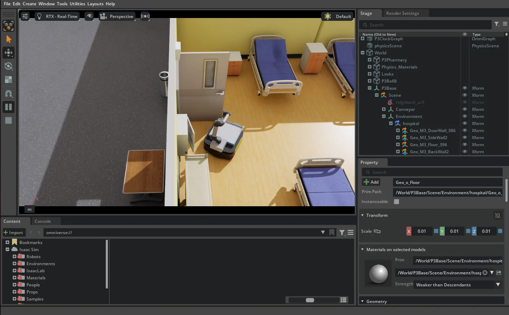
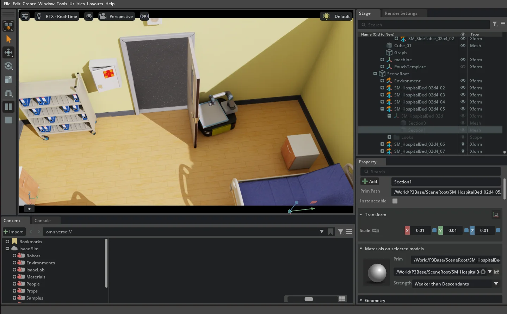

# 병원 문 주변 AMR 갇힘 — 사용자 캡처 보고 (2026-09-23)

수신: navigation @Taegyu-Lee1117, simulation @parksejun12. 사용자 임재범이 캡처 두 장과 함께 “갇혔음”이라고 보고를 요청했다.

## 관측

- 캡처 1: AMR이 병실 입구 바로 안쪽에 있으며 열린 문짝과 문틀/벽 가까이에 있다.
- 캡처 2: AMR이 열린 문짝 뒤와 병실 벽 사이의 좁은 공간에 있다.
- 사용자 관측은 **갇힘**이다. 정지 이미지 두 장만으로 지속 시간·진입 방향·탈출 시도·접촉 힘·성공/실패 회차 수를 측정할 수는 없다. 두 장이 같은 run인지도 미확인이다.
- 아래 이미지는 사용자 원본에서 형식만 바꾼 사본이다. 화면의 구조물과 로봇 위치를 바꾸지 않았다.

## 기준과 미확인 정보

보고 작성 기준 저장소 main: `09d349c3bb923ec327ef80e97e3d83dd2e147c3d`. **캡처에 해당하는 실행 SHA는 미확인**이다. stage 기동 시각·reset/seed·goal·waypoints/Nav2 구분·map/costmap·localization·수동 개입 여부도 미확인이다. 기준 저장소 SHA를 실행 SHA로 읽지 않는다.

관련 #504는 문 통과 여유 변경이며 병합됐다. #508·#514는 Nav2 접근/무진전 대응이다. 해당 변경이 이 캡처 실행에 들어갔다거나 이번 갇힘을 해결했다고 판정하지 않는다.

참고로 로컬 `m2-hospital-nav2-r3` 로그에는 실행 `d0d9e20a25b6c024b267487835b408b88579d4e2`, 기동 `2026-09-23T11:06:20+09:00`, station_a 180초 timeout과 `Failed to make progress`가 있다. **이 로그와 첨부 캡처의 회차 일치는 확인되지 않아 이번 갇힘의 재현 로그로 사용하지 않는다.**

## 담당자에게 요청

1. 실행 담당자가 두 캡처의 run·SHA·goal·주행 모드·문 상태와 로그/녹화 시점을 특정한다.
2. 주행/시뮬 담당자가 문짝·문틀·벽의 실제 충돌 형상과 지도/costmap의 표현을 대조한다. AMR 본체뿐 아니라 받침대·트레이·UR5의 회전 시 차지하는 범위와 실제 접촉 쌍을 확인한다.
3. 문 뒤로 들어간 경로, 접근점에서 최종 추종기로 전환된 시점, recovery의 후진/회전이 갇힘을 키웠는지 확인한다. 이는 경쟁 가설이며 원인 확정이 아니다.
4. 후보 수정 후 같은 문 상태·시작 자세·목표로 진입/이탈을 재현하고, 문 뒤 갇힘·무진전·접촉 여부를 영상과 로그로 함께 확인한다. 수동 이동·문 삭제·collision 비활성화를 성공으로 세지 않는다. 판정선과 시간 상한은 실행 전에 정한다.

상태: 원인/수정/L3 미완료, 담당자 응답 필요. 이 보고에서 런타임·지도·문 모델·합격선을 변경하지 않았다. 사진 보고를 Nav2/병원 전체 루프 통과로 사용하지 않는다.

## 원본 보존

원본은 master02 `/home/rokey/markle_tmp/hospital-door-entrapment-20260923/`, 변환과 해시는 `manifest.json`에 있다. 캡처 시각은 미확인이다.

| 원본 | SHA-256 |
| --- | --- |
| `user-capture-01.png` | `2852b048319b694f5538f4ee21baf44988335e1ff07827d6fcd8d8d4174f736c` |
| `user-capture-02.png` | `228f7942d47eb56f47a0cf56d7e2b4c23940f4b714631fb1d2105e3e0eaa9654` |
