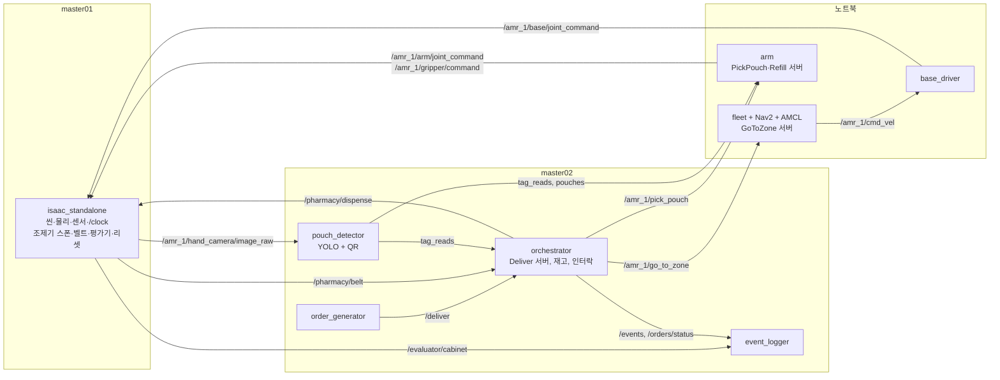

# 계약: 배송 한 바퀴 v1

- 상태: proposed
- 담당 / 소비자 / 이슈: orchestration(임재범) / simulation·manipulation·navigation·perception 전원 / 이슈 없음, PR 에서 검토
- 버전 / 대체 계약: v1 / 없음. 확정되면 [계약 안내](README.md)의 "초안" 표현과 [인터페이스 README](../../src/rokey_p3_interfaces/README.md)의 "정하지 않은 것"이 이 문서를 가리킨다
- 요구사항 / 완료 조건: [시나리오](../planning/scenario.md) 4절 단계 1-4 를 [인터페이스 초안](../../src/rokey_p3_interfaces/README.md)의 이름으로 돌린다.
  완료 = P1 스텁 한 바퀴(`v0.2.0`)와 P2 조제실 구간(`v0.3.0`)이 **이 문서의 이름만으로** 돈다.
  코드와 문서가 다르면 코드를 문서에 맞추거나, 문서를 고치는 PR 을 먼저 낸다.
- 코드 대조 기준: main `f316197`(v1.1.0), 2026-09-30.
  1.1·2·3·5·6·7·8·10·11절을 코드와 맞췄다.
  4절은 값만 대조했다.
  9절은 대조하지 않았다(미확인).
  부록 A 는 정차 자세만 대조했다.

**이 문서가 정하는 것**: 노드와 호스트 배치, 토픽·서비스·액션 이름과 QoS, 프레임과 단위, 시간·epoch·stale 판정,
인터락, 리셋 barrier, ID·타임아웃·재시도, 이벤트 순서, 인터페이스 v1.1 변경 목록.
**정하지 않는 것**: 예외 상황이 어느 종료 상태로 가는지의 전체 표([예외 → 종료 상태 표](exception-outcomes-v1.md)), 합격선(지표 정책과 protocol),
노트북 노드의 최종 배치(9/18 부하 측정 후 `rokey_p3_bringup/config/`).

트립 순서를 누가 어떻게 밀고 가는지는 [ADR 0001](../adr/0001-orchestrator-trip-fsm.md). 이 문서는 이름과 규칙만 정한다.

## 0. 한눈에

아래 그림은 9/16–17 **계획 배치**(노트북 포함)다. 실제 배치는 [1.1](#11-실제-배치-924)에 있다. 그림은 이름·방향만 본다.
지금(v1.1.0) 배치 그림은 [시스템 그림](system-overview.md)이다.



## 1. 노드와 배치

v1 은 AMR 1대(`amr_1`)다. 2대째는 네임스페이스만 `amr_2` 로 바뀌고 이름 규칙은 같다.

| 노드 | 패키지 (담당) | v1 호스트 | 하는 것 |
| --- | --- | --- | --- |
| `isaac_standalone` | `sim/standalone/` (simulation) | master01 | 씬·물리·센서·`/clock`. 조제기 스폰, 벨트, 끝 정지 센서, 그리퍼, 평가기 관측, 리셋 |
| `base_driver` | `rokey_p3_navigation` (navigation) | 노트북 | `cmd_vel` 을 dummy 조인트 속도로. `odom` 과 TF `odom → base_link` |
| `fleet` | `rokey_p3_navigation` (navigation) | 노트북 | `GoToZone` 서버. Nav2 `NavigateToPose` 를 감싼다. 도킹 판정, `base/stopped`, 리셋 후 `initialpose` |
| `zones_tf` | `rokey_p3_navigation` (navigation) | 노트북 | `zones.yaml` 의 고정 프레임을 `/tf_static` 으로 1회. `pharmacy/*`, `<zone>/cabinet`, `<zone>/tag` 의 **단일 작성자**다([3절](#3-프레임과-단위)). AMR 이 늘어도 공유한다 — 로봇마다 띄우면 같은 변환의 작성자가 둘이 된다 |
| Nav2, AMCL, map_server | `rokey_p3_navigation` launch (navigation) | 노트북 | 주행. 내부 BT 는 Nav2 것 그대로 |
| `speed_governor` | `rokey_p3_navigation` (navigation) | Nav2 와 같은 곳 | 지역 코스트맵을 읽어 `controller_server` 에 속도 상한을 낸다([2.2](#amr_1speed_limit)). 9/23 신설 |
| `arm` | `rokey_p3_manipulation` (manipulation) | 노트북 | `/amr_1/pick_pouch`, `/amr_1/scan_tag` 서버. IK, 관절 명령, 그리퍼 명령, `arm/at_home` |
| `m0609/arm` | `rokey_p3_manipulation` (manipulation) | 노트북 | `/m0609/refill` 서버 |
| `pouch_detector` | `rokey_p3_perception` (manipulation 레인) | master02 | 손 카메라 이미지 → YOLO 또는 색 검출 + OpenCV QR → `tag_reads`, `pouches` |
| `orchestrator` | `rokey_p3_orchestrator` (orchestration) | master02 | `Deliver` 서버. 트립 FSM, 조제기 재고 데이터, 인터락 guard, `OrderStatus`, `Event` |
| `order_generator` | `rokey_p3_orchestrator` (orchestration) | master02 | 합성 요청 발행 = `Deliver` 액션 클라이언트. 긴급은 큐 맨 앞 |
| `event_logger` | `rokey_p3_orchestrator` (orchestration) | master02 | `/events`, `/orders/status`, `/evaluator/cabinet` 을 run 기록 파일로 |
| `isaac_adapter` | `rokey_p3_bringup` (orchestration) | master01 | Isaac 의 JSON 토픽(`std_msgs/String`)을 이 계약의 이름·타입으로 옮긴다. Isaac 5.1 내부 Python(3.11)이 `rokey_p3_interfaces` 를 import 하지 못해서 둔다([ADR 0002](../adr/0002-isaac-json-topics-and-ros-adapter.md)). 켜면 `/pharmacy/dispense`·`/sim/reset` 서버와 `/pharmacy/belt` 작성자가 이 노드다 — 같은 기능의 스텁과 **동시에 켜지 않는다** |
| 스텁 서버 | `rokey_p3_bringup` (orchestration) | 어디든 | 실물이 없는 서버를 같은 이름으로 대신한다. [8절](#8-검증) |
| `dock_origin_tf` (v1 뒤 추가) | `rokey_p3_navigation` (navigation) | `nav` 역할 | `localization:=odom` 또는 `motion_backend:=waypoints` 일 때만 뜬다(`navigation.launch.py`). `map → <ns>/odom` 을 도크 자리만큼 평행이동으로 1회 낸다([3절](#3-프레임과-단위)). 병원 기동이 이 경우다 |
| `map_activation_guard` (v1 뒤 추가) | `rokey_p3_navigation` (navigation) | `nav` 역할(Nav2 안) | map_server 가 20 s 안에 active 가 아니면 직접 configure/activate 를 보낸다(#743). 개입·포기는 `/p3/alerts` 로 낸다([2.5](#25-오케스트레이션)) |
| `m0609_detector` (v1 뒤 추가) | `rokey_p3_perception` 의 `pouch_detector` 실행 파일, `robot_id=m0609` | `stack` 역할 | M0609 손 카메라의 약통 QR 판독. launch `use_m0609_detector:=true` 일 때만 뜬다. [QR·DB·카메라 계약](qr-db-camera-contract-v1.md) |
| 관제 웹 (v1 뒤 추가) | `web/backend` | `web` 역할 | `/deliver` 클라이언트이자 상태 구독자다. [관제 웹](web-console.md) |

- 실행 위치는 인터페이스가 아니다. `arm` 이 Isaac 프로세스 안에서 도는 편이 빠르면 그렇게 하되 위 이름·QoS 는 같다. 9/18 저녁에 정하고 `rokey_p3_bringup/config/hosts.yaml` 에 적는다.
- 노트북은 손 카메라 이미지를 구독하지 않는다. 이미지는 master01 → master02 한 경로만 간다([일정 9/17](../planning/schedule.md)).
- 마스터 PC 에서는 코드를 고치지 않는다. 위 노드의 코드는 PR 로 바꾼다([역할 규칙](../process/agent-workflow.md)).

### 1.1 실제 배치 (9/24)

위 표의 "v1 호스트" 열은 계획이다. 노트북은 쓰지 않았다. 병원 회차는 `tools/demo_v2.sh` 로 띄운다.

| 방식 | 어떻게 | 근거 |
| --- | --- | --- |
| 기본: 마스터 1대 | `P3_ROLES`·`P3_PEER` 를 비운다. 스테이지·팔·주행·스택·웹을 한 PC 에 띄운다 | 병원 회차 대부분(#240). v1.0.0 회전 7(`9760d9d`)의 master01 14건이 이 방식이다(#771 5867873681). 런북 [hospital-full](../runbooks/hospital-full.md) |
| 2대 분산 | master01 `P3_ROLES=stage`, master02 `P3_ROLES="arm nav stack web"`. 두 PC 는 같은 `P3_DOMAIN`·DDS 프로필이다. master02 는 `/clock` 발행자가 정확히 1 일 때만 뜬다 | 4d01333 · #240 5797973069·5797973429. 런북 [hospital-demo 10절](../runbooks/hospital-demo.md#10-두-마스터로-나눠-띄우기). 회전 7 의 다중 PC attempt 12·13 은 미실행이다(v1.0.0 릴리스 본문). v1.1.0 에서도 다시 돌리지 않았다 |

- 노드 이름·토픽·QoS 는 배치와 상관없이 같다. 위 표의 이름이 그대로다.
- 역할 묶음(`stage`·`arm`·`nav`·`stack`·`web`)과 기동 순서는 `tools/demo_v2.sh` 가 정한다. 이 문서는 바꾸지 않는다.
- v1.1.0(`f316197`)의 역할 묶음은 v1.0.0 과 같다(`tools/demo_v2.sh`).
  v1.1.0 커밋으로 돌린 acceptance 회전은 없다(v1.1.0 릴리스 본문).
- 지금 배치 그림은 [시스템 그림](system-overview.md)이다. 토픽 연결 표는 [ROS 2 통합 표](ros2-integration-table.md)다.

## 2. 토픽·서비스·액션

QoS 약어: **S** = sensor data(best effort, volatile, depth 5). **R** = reliable, volatile, depth 10.
**H** = 상태 heartbeat(reliable, volatile, depth 1, 5 Hz 주기 발행. 1.0 s 안 오면 unknown). **L** = latched(reliable, transient local).
rate 는 발행 주기의 목표값이다. stamp 는 전부 sim time([4절](#4-시간epochstale)).
GitHub 미리보기는 열 너비를 무시한다. 이름마다 제목을 두고 `항목 | 값` 두 열만 쓴다.

### 2.1 시뮬레이터가 내고 받는 것 (simulation)

#### `/clock`

| 항목 | 값 |
| --- | --- |
| 방향 | isaac → 전원 |
| 타입 | `rosgraph_msgs/Clock` |
| QoS | R, 60 Hz 목표 |
| 규칙 | 2.0 s wall 동안 안 오면 시뮬 정지로 본다. orchestrator 는 새 goal 을 내지 않는다 |

#### `/amr_1/joint_states`

| 항목 | 값 |
| --- | --- |
| 방향 | isaac → base_driver, arm |
| 타입 | `sensor_msgs/JointState`. dummy 3개 + UR5 6개, USD 조인트 이름 그대로 |
| QoS | S, 30 Hz |
| 규칙 | 1.0 s 없으면 base_driver 와 arm 은 명령을 멈춘다 |

#### `/amr_1/scan`

| 항목 | 값 |
| --- | --- |
| 방향 | isaac → Nav2, AMCL |
| 타입 | `sensor_msgs/LaserScan`, `amr_1/lidar_link` |
| QoS | S, 10 Hz |
| 규칙 | 코스트맵 장애물 층의 관측원 토픽은 **절대 이름** `<robot_namespace>/scan` 이다(`nav2_params.yaml`, launch 가 `<robot_namespace>` 를 채운다). 상대 이름 `scan` 은 `/amr_1/local_costmap/scan` 으로 풀려 아무도 안 내는 토픽이 된다 — 구독은 붙고 오류 없이 코스트맵이 빈다. 시험 `test_nav2_observation_sources.py`. 관측: 138cbac · #240 5798100488 |

#### 손 카메라 `/amr_1/hand_camera/image_raw`, `camera_info`

| 항목 | 값 |
| --- | --- |
| 방향 | isaac → pouch_detector **만** |
| 타입 | `sensor_msgs/Image` rgb8, `CameraInfo`, `amr_1/hand_camera_optical` |
| QoS | S(depth 2), **10 Hz 이하** |
| 규칙 | 노트북은 구독하지 않는다(대역폭). 해상도는 QR 판독 거리에서 정한다(9/16 스파이크) |
| v1.1.0 | 합본 손목 카메라를 `amr_base.py` 가 낸다. 해상도는 기동 값 `P3_CAMERA_RESOLUTION` 이다(기본 1280×800, `tools/demo_v2.sh`). 운영 소비자는 pouch_detector 하나다. 웹 카메라 탭(서버 `--live-sensors`, 기본 꺼짐)과 `P3_CAMERA_VIEW` 창(기본 0)도 볼 수 있다 |

#### `/amr_1/front_camera/image_raw`

| 항목 | 값 |
| --- | --- |
| 방향 | isaac → (C 등급 사람 인식) |
| 타입 | `sensor_msgs/Image`, `amr_1/front_camera_optical` |
| QoS | S, 5 Hz, 기본 **꺼짐** |
| 규칙 | 파라미터로 켠다. v1 소비자 없음 |
| v1.1.0 | 미구현이다. `src/`·`sim/` 코드에 이 토픽이 없다 |

#### `/pharmacy/belt`

| 항목 | 값 |
| --- | --- |
| 방향 | isaac → orchestrator, arm |
| 타입 | `BeltState` (v1.1): `occupied`, `at_end`, `order_id` |
| QoS | H |
| 규칙 | unknown 이면 배출도 픽도 금지. `at_end`·`occupied` 의 뜻과 한계는 [11.1](#111-pharmacybelt-의-뜻과-한계) |

#### `/amr_1/gripper/holding`

| 항목 | 값 |
| --- | --- |
| 방향 | isaac → arm, orchestrator |
| 타입 | `std_msgs/Bool` |
| QoS | H, 10 Hz |
| 규칙 | 이송 중 true → false 는 낙하. `PickPouch` 결과 `dropped`, 주문 `ABORT` |

#### `/evaluator/cabinet`

| 항목 | 값 |
| --- | --- |
| 방향 | isaac → event_logger **만** |
| 타입 | `CabinetObservation` (v1.1): `cabinet_id`, `order_id`, `present` |
| QoS | L(depth 50), 변화 시 + 1 Hz |
| 규칙 | **운영 노드(orchestrator·arm·fleet) 구독 금지.** 평가 전용 경로이고 이것만이 `SUCCESS` 의 근거다 |
| 작성자(v1.1.0) | 스텁이면 stub_sim(`publish_cabinet`)이다. Isaac 이면 isaac_adapter 가 `/isaac/evaluator/cabinet` 을 옮긴다(launch `sim_cabinet:=true`) |
| 코드 읽기(v1.1.0) | 병원 기동은 `P3_SIM_SENSORS=1` 일 때만 `sim_cabinet:=true` 를 준다(`tools/demo_v2.sh` 스택 명령). `P3_SIM_SENSORS` 기본은 0 이다. 그래서 demo_v2 기본값만으로는 이 토픽의 작성자가 없다. 그때 event_logger 는 `SUCCESS` 를 쓰지 못한다. `config/hospital-camera-delivery.sh` 와 protocol v4(§5)는 `P3_SIM_SENSORS=1` 을 준다 |

#### `/pharmacy/dispense`

| 항목 | 값 |
| --- | --- |
| 방향 | orchestrator → isaac |
| 타입 | srv `Dispense` |
| QoS | 응답 시한(wall, 어댑터 `dispense_timeout_s`): 기본 2.0 s. 병원 기동(`tools/demo_v2.sh` `P3_WORLD=hospital`)은 `P3_DISPENSE_TIMEOUT_S` 기본 30 s 를 넘긴다. 10 → 30 은 #660(커밋 `af78350`)이다. 그 전 10 s 는 PR #593(머지 커밋 `9ed054c`)이었다. protocol v4 fingerprint 도 30 이다. 실행 설정값은 회차의 기동 명령에서 본다 |
| 규칙 | `order_id` 의 QR 텍스처를 붙인 봉투를 벨트 시작에 스폰(위치·yaw 는 설정 범위 무작위)하고 벨트를 돌린다. `accepted=false` 의 `message` 는 `belt_occupied`, `unknown_order`, `not_ready`, `pool_exhausted`([10.2](#102-dispense-거부-pool_exhausted-924)) 중 하나. `accepted` 는 도착이 아니다. 재전송은 [11.2](#112-pharmacydispense-재전송) |

#### `/sim/reset`

| 항목 | 값 |
| --- | --- |
| 방향 | orchestrator → isaac |
| 타입 | srv `Reset` |
| QoS | 응답 30 s wall |
| 규칙 | 순서는 [6절](#6-리셋-barrier). 실패하면 run 무효, 프로세스 재시작 래퍼로 넘긴다 |

#### `/amr_1/base/joint_command`

| 항목 | 값 |
| --- | --- |
| 방향 | base_driver → isaac |
| 타입 | `sensor_msgs/JointState`. dummy 3개만, `velocity` (m/s, rad/s) |
| QoS | R, 20 Hz |
| 규칙 | 자기 조인트 이름만. 다른 쪽 이름이 섞이면 isaac 이 버린다. 0.5 s 없으면 isaac 이 속도 0 |

#### `/amr_1/arm/joint_command`

| 항목 | 값 |
| --- | --- |
| 방향 | arm → isaac |
| 타입 | `sensor_msgs/JointState`. UR5 6개만, `position` (rad) |
| QoS | R, 궤적 점마다 |
| 규칙 | 자기 조인트 이름만. 다른 쪽 이름이 섞이면 isaac 이 버린다 |

#### `/amr_1/gripper/command`

| 항목 | 값 |
| --- | --- |
| 방향 | arm → isaac |
| 타입 | `std_msgs/Bool`. true = 닫기(흡착) |
| QoS | R |

#### M0609: `/m0609/joint_states`, `/m0609/arm/joint_command`, `/m0609/gripper/command`, `/m0609/gripper/holding`, `/m0609/arm/at_home`

| 항목 | 값 |
| --- | --- |
| 방향 | `joint_states`·`gripper/holding` isaac → m0609/arm. `arm/joint_command`·`gripper/command` m0609/arm → isaac. `arm/at_home` m0609/arm → orchestrator |
| 타입 | amr_1 팔과 같다. `JointState` 6개(USD 조인트 이름 그대로, `position` rad), `Bool` |
| QoS | amr_1 팔과 같다(`joint_states` S, `joint_command` R 궤적 점마다, `holding`·`at_home` H) |
| 규칙 | 네임스페이스만 `m0609` 다. 베이스가 없어 `base/*` 는 없다. 조제기 슬롯·선반 위치는 `zones.yaml` 의 `pharmacy` 프레임([3절](#3-프레임과-단위)) |
| 계약 밖 이름(v1.1.0 코드) | 레일 `/m0609/rail/joint_command`·`/m0609/rail/joint_states`, `/m0609/arm/plan_cache`, 선반 재고 `/m0609/shelf/inventory`(`m0609_arm_node.py`). 손 카메라·약통 확인은 [QR·DB·카메라 계약](qr-db-camera-contract-v1.md)이다 |

#### `/tf`, `/tf_static`

프레임 작성자는 [3절](#3-프레임과-단위).

조제기의 **데이터**(슬롯 2개, 로트, 유통기한, 임계값, FEFO, 정지·재개)는 orchestrator 의 재고 모듈이 갖는다. isaac 은 봉투를 스폰하고 벨트를 돌리는 물리만 맡는다.

### 2.2 주행 (navigation)

#### `/amr_1/cmd_vel`

| 항목 | 값 |
| --- | --- |
| 방향 | Nav2 → base_driver. `nav2_final_approach` 또는 `motion_backend:=waypoints` 이면 fleet 의 waypoint 추종기도 낸다. 둘이 동시에 내지는 않는다(`fleet_node.py`) |
| 타입 | `geometry_msgs/Twist`. m/s, rad/s, `amr_1/base_link` 기준 |
| QoS | R, 20 Hz |
| 규칙 | base_driver 는 0.5 s 없으면 0 을 낸다 |

#### `/amr_1/odom`

| 항목 | 값 |
| --- | --- |
| 방향 | base_driver → Nav2, AMCL, fleet |
| 타입 | `nav_msgs/Odometry`. `amr_1/odom` → `amr_1/base_link` |
| QoS | R, 20 Hz |
| 규칙 | dummy 조인트 위치 그대로. 노이즈 없음. 그 사실을 run 기록에 적는다 |

#### `/amr_1/initialpose`

| 항목 | 값 |
| --- | --- |
| 방향 | fleet → AMCL |
| 타입 | `geometry_msgs/PoseWithCovarianceStamped`, `map` |
| QoS | R(depth 1), 리셋 뒤 1회 |

#### `/amr_1/go_to_zone`

| 항목 | 값 |
| --- | --- |
| 방향 | orchestrator → fleet |
| 타입 | action `GoToZone` |
| QoS | 120 s(load·dock), 180 s(병동) sim |
| 규칙 | `zone_id` → `zones.yaml` 자세 → Nav2 `NavigateToPose`. 수락 조건은 [5절](#5-인터락). `arrived=true` 는 허용오차 안에 정지한 뒤에만. 타임아웃이면 abort, `arrived=false` |
| 규칙(선택) | `nav2_final_approach` 는 선택이다(#508·#514). 기본은 꺼짐이다(Nav2 가 끝까지 간다). `nav2_final_approach:=true` 이면 Nav2 목표는 `routes_file` 의 마지막 waypoint(접근점)다. Nav2 가 그 점에서 `nav2_handoff_radius`(기본 0.5 m) 안에 들어오거나 그 안에서 끝나면 fleet 가 Nav2 goal 을 거둔다. 그 다음 waypoint 추종기가 `cmd_vel` 로 정차 자리까지 간다. 반경 밖 실패는 그대로 실패다. `motion_backend:=waypoints` 는 Nav2 없이 추종기만 쓴다. 병원 회차는 켠다 |
| 규칙(접근점 정책) | `nav2_final_approach` 일 때(9/24, [10.4](#104-gotozone-마지막-구간-정책-924)). **도착**: 추종기는 접근점에서 먼저 제자리로 목표 yaw 를 맞추고, 그 뒤 yaw 를 고정한 채 정차 자리로 옆걸음한다. **출발**: 병상(`kind: bed`) 정차 자리에서 떠날 때는 들어온 길의 접근점까지 yaw 고정 옆걸음으로 물러난 뒤 Nav2 에 넘긴다. **넘김 속도**: Nav2 를 거둔 순간의 odom 속도에서 추종기 가속 상한으로 줄인다. 접근점은 제자리 회전 반경이 나오는 점이다([3절 부록](#부록-a-병원-침상-정차접근점-여유-표-924)) |

#### `/amr_1/base/stopped`

| 항목 | 값 |
| --- | --- |
| 방향 | fleet → orchestrator, arm |
| 타입 | `std_msgs/Bool` |
| QoS | H |
| 규칙 | true = 활성 goal 없음 + `odom` 속도 0.02 m/s·0.02 rad/s 미만이 0.5 s 이상. unknown 이면 팔 동작 금지 |

#### `/amr_1/speed_limit`

| 항목 | 값 |
| --- | --- |
| 방향 | speed_governor → controller_server |
| 타입 | `nav2_msgs/SpeedLimit`, `percentage=true` |
| QoS | 발행은 reliable·transient local·depth 1 이다(`speed_governor_node.py`). 1 Hz 로 다시 발행한다(값이 같아도). `controller_server` 구독이 VOLATILE 이라 먼저 낸 한 장은 못 받는다(#620) |
| 입력 | `local_costmap/costmap`(`nav_msgs/OccupancyGrid`). 칸 값 0–100, -1 = 모름. **100 만 장애물**이다(`lethal_cost`). 99 는 팽창 띠라 쓰지 않는다. 정지 규칙은 `odom`·`map` 과 TF(map ← 코스트맵 프레임)도 읽는다 |
| 규칙 | 로봇에서 가장 가까운 장애물 칸까지 거리 d. d ≤ `near_m`(1.0) → 근접 속도 `slow_speed_mps`. d ≥ `far_m`(1.8) → 100 %. 사이는 직선. `far_m` 안엔 없고 창 어딘가엔 있으면 **넓다**(100 %). 창 전체에 장애물 칸이 0 이거나 격자가 깨졌거나 코스트맵이 `stale_after_s`(2.0 s sim) 넘게 끊기면 **모름** — 느린 쪽(근접 속도) |
| 근접 속도 | 0.7 m/s 다. 최고 속도 1.0 m/s(`nav2_params.yaml` `max_speed_xy`)의 70 % 다. 0.5 → 0.7 은 #788(재범 9/29)이다. 0.7 은 L3 미실행이다(#772 5891599172). 9/23–9/28 관측은 0.5 m/s(50 %) 때 값이다 |
| 정지 규칙 | #721(9/25). 진행 방향 앞, 몸체 폭 띠 안에 정적 지도에 없는 막힌 칸이 몸체 앞끝에서 `stop_m`(0.6 m) 안이면 1 %(0.01 m/s)를 낸다. Nav2 에서 0 은 "제한 없음"이라 0 을 쓰지 않는다. `resume_m`(0.9 m) 밖으로 `resume_delay_s`(1.0 s) 비면 다시 간다. 기본 켬(`stop_rule`). 정적 지도나 TF 가 없으면 꺼지고 근접 감속만 돈다 |
| 정지 규칙 상태 | 발동은 검증되지 않았다(#721 제목 "발동 미검증"). #752 는 진단만 있고 수정은 main 에 없다(v1.0.0·v1.1.0 릴리스 본문) |
| 관측 | 138cbac · #240 5798652432(처음으로 실제 여유로 제한이 바뀜) · 5a51804 · 5799586820(넓다 판정, 복도 99 → 72 s) · ad2aaa9 · 5799861453 |
| 미검증 | 코스트맵이 실제로 끊겼을 때 근접 속도로 바뀌는 것은 회차에서 보지 못했다(L1 만) |

Nav2 BT 의 action server 수락 대기 `bt_navigator.default_server_timeout` 은 **200 ms** 다(Jazzy 기본 20). Isaac 과 한 PC(rtf 0.36–0.45)에서 재계획 수락이 20 ms 를 넘어 `Timed out while waiting for action server to acknowledge goal request` 로 NavigateToPose 가 abort 됐다(50b658a · #240 5802751527, ord-0003). 200 ms 뒤 10건 10/10, 그 줄 0(b40e133 · #240 5804528593). 계획·제어 시간은 바꾸지 않는다.

도킹 허용오차(`tol_xy`, `tol_yaw`)는 zone 마다 `zones.yaml` 에 있다. 값은 UR5 도달 범위와 손 카메라 시야로 정한다(9/19 측정). 부족하면 fleet 안에 전진·후진 정렬 루틴을 넣고 인터페이스는 안 바꾼다.

### 2.3 팔 (manipulation)

#### `/amr_1/pick_pouch`

| 항목 | 값 |
| --- | --- |
| 방향 | orchestrator → arm |
| 타입 | action `PickPouch` |
| QoS | 60 s sim |
| 규칙 | `source=BELT`: 벨트 끝 봉투 QR 이 `order_id` 와 같은지 확인한 뒤 집어 `target_slot` 에 놓는다. `source=DECK`: 상판에서 QR 이 `order_id` 인 봉투를 찾아 `<zone>/cabinet` 에 놓는다. 끝나면 홈. 수락 조건은 [5절](#5-인터락). `outcome` 은 `ok`, `not_detected`, `qr_mismatch`, `grasp_failed`, `dropped`, `timeout`, `rejected_interlock` 중 하나. `ok` 의 뜻과 새 값 도입 규칙은 [11.4](#114-pickpouch-ok-와-새-outcome) |

#### `/amr_1/scan_tag`

| 항목 | 값 |
| --- | --- |
| 방향 | orchestrator → arm |
| 타입 | action `ScanTag` (v1.1) |
| QoS | 30 s sim |
| 규칙 | 손 카메라를 `<zone>/tag` 에 대고 `tag_reads` 를 기다린다. 시한 안에 못 읽으면 `status=UNREADABLE` |

#### `/m0609/refill`

| 항목 | 값 |
| --- | --- |
| 방향 | orchestrator → m0609/arm |
| 타입 | action `Refill` |
| QoS | 90 s sim |
| 규칙 | `pharmacy/shelf` 의 캐니스터를 `pharmacy/dispenser_slot_a` 또는 `pharmacy/dispenser_slot_b` 에 장착한다. 장착 뒤 `REFILL_DONE` 을 낸다. **결과는 홈으로 돌아온 다음 돌려준다.** 결과 직후 `m0609/arm/at_home` 은 true 다(#99). 9/23 에 옛 문구("결과를 돌려준 다음 홈")를 코드에 맞춰 고쳤다. v0 는 관절 waypoint 티칭이다(선반·슬롯은 고정 좌표) |

#### `/amr_1/arm/at_home`

| 항목 | 값 |
| --- | --- |
| 방향 | arm → fleet, orchestrator |
| 타입 | `std_msgs/Bool` |
| QoS | H |
| 규칙 | true = 관절이 홈 자세 0.05 rad 이내 + 활성 goal 없음. unknown 이면 출발 금지 |

검수 두 곳은 arm 이 한다. 벨트 끝: 봉투 QR 과 goal `order_id` 대조(`qr_mismatch`). 침상: 상판 봉투 QR 과 goal `order_id` 대조(`not_detected`). 환자 QR 과 요청의 대조는 orchestrator 가 한다([2.5](#25-오케스트레이션)).

### 2.4 인식 (perception)

#### `/amr_1/hand_camera/tag_reads`

| 항목 | 값 |
| --- | --- |
| 방향 | pouch_detector → arm, orchestrator |
| 타입 | `TagRead`. `amr_1/hand_camera_optical`, stamp = 이미지 시각 |
| QoS | R, 판독마다 |
| 규칙 | `TagRead.kind` 는 QR 내용 접두: `pt-` 환자, `st-` 스테이션, `ord-` 봉투. `cn-` 약통·`md-` 모듈은 [QR·DB·카메라 계약](qr-db-camera-contract-v1.md) 1절. 요청 시각보다 1.0 s 이상 오래된 판독은 쓰지 않는다 |
| 인증 대조(v1.1.0) | 환자·스테이션 `tag_id` 는 접두를 뺀 ID 다(`TagRead.msg`). orchestrator 는 정거장 인식표 전체(`pt-2001`)와 접두를 뺀 ID(`2001`)를 둘 다 받는다. 다른 정거장의 ID 는 `auth_mismatch` 다(#796, `trip_fsm._result_authenticating`) |

#### `/amr_1/hand_camera/pouches`

| 항목 | 값 |
| --- | --- |
| 방향 | pouch_detector → arm |
| 타입 | `PouchDetectionArray`. `pose` 는 optical frame, m |
| QoS | R(depth 5), 이미지마다 |
| 규칙 | 검출 0건이면 빈 배열을 낸다. 안 내는 것이 아니다. `slot_index` 는 v1 에서 -1 고정 |

파라미터: `detector` = `yolo` 또는 `color`(폴백). `qr_min_size_px`. 사람 인식은 C 등급이라 v1 토픽이 없다.

v1.1.0 코드에서 더 본 것:

- 팔의 입력 출처는 `pouch_source`·`scan_tag_source` 다. `camera` 면 위 두 토픽이다. `sim` 이면 계약 이름을 쓰지 않는다. `/amr_1/sim/pouches`·`/amr_1/sim/tag_reads`(isaac_adapter, H)를 쓴다(`arm_node._sensor_topic`).
- 병원 기동 기본은 둘 다 `camera` 다(`P3_CAMERA_POUCHES`·`P3_CAMERA_TAGS` 기본 1, #784·#797).
- pouch_detector 는 `/amr_1/hand_camera/qr_view`(`sensor_msgs/Image`, S depth 2)도 낸다. 보는 구독자가 있을 때만 그린다(#787).

### 2.5 오케스트레이션

#### `/deliver`

| 항목 | 값 |
| --- | --- |
| 방향 | order_generator, GUI → orchestrator |
| v1.1.0 기동 | 병원·빈월드는 order_generator 를 띄우지 않는다(`P3_AUTO_ORDER` 기본 0, `tools/demo_v2.sh`). 요청은 관제 웹이 보낸다. `tools/hospital_orders.py` 도 웹 API 만 부른다 |
| 타입 | action `Deliver` |
| QoS | 트립 제한 시간은 [7절](#7-id타임아웃재시도) `trip_limit_s`(sim) |
| 규칙 | 수락 조건(코드 `orchestrator_node._on_deliver_goal` 순서): 리셋 barrier 중이 아님, `RESET_DONE` 뒤 3 s wall 지남(`RESET_SETTLE_S`), `orders` 비지 않음, `request_id` 새 것, `destination_id` 가 **구역 ID 모양**(`rokey_p3_navigation/zones.py` 정규식 — `zones.yaml` 에 있는지는 보지 않는다. 없는 구역은 fleet 의 `GoToZone` 거부로 드러난다. **관측(9/24, main 66450ae 코드 읽기)**: 이 행의 옛 문장은 "`zones.yaml` 에 있음" 이었으나 코드는 정규식만 본다), 모든 `order_id` 가 주문 풀에 있고 미사용, 진행 중 트립 없음·정거장을 만들 수 있음(v1). 거부는 goal 거부로 끝난다. Event 없음, 지표 분모에 안 들어간다. 지난 트립이 도크에 못 돌아왔어도 수락한다 — 도크부터 간다([5절](#5-인터락) 도크 복귀 우선) |

#### `/orders/status`

| 항목 | 값 |
| --- | --- |
| 방향 | orchestrator → GUI, event_logger |
| 타입 | `OrderStatus` |
| QoS | L(depth 50), 변화 시 |
| 규칙 | 종료 상태 4개는 [시나리오 5절](../planning/scenario.md#5-종료-상태). orchestrator 는 `SUCCESS` 를 내지 않는다. 놓기까지 끝나면 `DELIVERED`(v1.1, 주장)이고 `SUCCESS` 는 event_logger 가 `/evaluator/cabinet` 으로 run 기록에 쓴다 |

#### `/events`

| 항목 | 값 |
| --- | --- |
| 방향 | 모든 노드 → event_logger, GUI, fleet |
| 타입 | `Event`. stamp = sim time, `epoch` 필수 |
| QoS | L(depth 500) |
| 규칙 | `epoch` 이 현재와 다르면 버린다. fleet 는 `RESET_DONE` 만 본다 |

#### `/pharmacy/dispenser/status`

| 항목 | 값 |
| --- | --- |
| 방향 | orchestrator(재고 모듈) → GUI |
| 타입 | `DispenserStatus` |
| QoS | L(depth 1), 변화 시 + 1 Hz |

계약 밖 이름(v1.1.0 코드):

- `/p3/alerts`: `std_msgs/String` JSON, reliable·transient local depth 20. 작성자는 orchestrator(`DOCK_RETRY`·`DOCK_GIVEUP`)와 map_activation_guard(`MAP_GUARD_*`)다. 관제 웹 표시용이다. 판정에 쓰지 않는다(`rokey_p3_navigation/alerts.py`). `/events`·`Event.msg` 는 바뀌지 않았다.
- `/orchestrator/check_container`(srv `CheckContainer`): launch `pharmacy_db:=true` 일 때만 orchestrator 가 연다. 뜻은 [QR·DB·카메라 계약](qr-db-camera-contract-v1.md) 2.3절이다.

`order_generator` 는 토픽이 아니라 액션 클라이언트다. 긴급 요청은 발행기 큐의 맨 앞에 넣는 것으로 선점을 구현한다. 진행 중인 트립은 건드리지 않는다.
발행기의 보낸 수(`max_requests`)는 epoch 마다 세고, 결과까지 받은 요청을 그 요청을 **보낸 epoch 가 지금 epoch 일 때만** 센다. 리셋으로 끊긴 요청의 abort 결과는 새 epoch 의 수에 들어가지 않는다.

### 2.6 이벤트: 누가 무엇을 내는가

규칙: **상태 전이는 orchestrator 가, 물리 사건은 그 사건을 아는 노드가 낸다.** 같은 이름을 두 노드가 내지 않는다.

#### orchestrator

`REQUEST_ACCEPTED`(v1.1), `AMR_DOCKED_LOAD`, `LOAD_DONE`, `DEPARTED`, `ARRIVING`, `ARRIVED`, `AUTH_OK`, `AUTH_FAIL`, `CABINET_LOCKED`, `ORDER_DONE`, `RETURNED`, `DOCKED`, `DISPENSER_PAUSED`, `DISPENSER_RESUMED`, `REFILL_REQUESTED`, `RESET_DONE`(v1.1), `RESET_BEGIN`

#### isaac

`DISPENSED`, `POUCH_AT_END`

#### arm

`PICK_ATTEMPT`(v1.1), `POUCH_PICKED`, `POUCH_LOADED`, `POUCH_PLACED`, `ARM_HOME`(v1.1)

#### m0609/arm

`REFILL_DONE`

#### pouch_detector

`POUCH_DETECTED`

- `ORDER_DONE` = 주문이 종료 상태 4개 중 하나에 들어감. 어느 상태인지는 같은 stamp 의 `/orders/status` 가 말한다.
- `RETURNED` = 마지막 주문 종료 후 복귀 주행 시작. `DOCKED` = 대기 도크 허용오차 안 정지. trip_time 은 `DOCKED` 에서 끝난다.
- `RESET_BEGIN` = 리셋 barrier 시작. 끊긴 주문의 `ORDER_DONE`(이전 epoch) 뒤, cancel 전에 새 epoch 로 낸다. `RESET_DONE` = `/sim/reset` 이 `ok` 한 뒤 barrier 끝. 순서는 [6절](#6-리셋-barrier).
- `detail` 은 사람이 읽는 메모다. 판정·지표 계산에 쓰지 않는다. `PICK_ATTEMPT` 의 시도 번호는 `detail` 이 아니라 **이벤트 개수**로 센다. `RESET_DONE` 의 `detail` 이 `drain_timeout` 이면 cancel 대기 상한을 넘긴 barrier 다(기록용).

1인 배송 `SUCCESS` 한 바퀴의 이벤트 순서. `v0.2.0` 판정은 스텁으로 이 순서가 그대로 찍히는 것이다.

```text
REQUEST_ACCEPTED → AMR_DOCKED_LOAD → DISPENSED → POUCH_AT_END → PICK_ATTEMPT → POUCH_PICKED
→ POUCH_LOADED → LOAD_DONE → ARM_HOME → DEPARTED → [ARRIVING: 긴급만] → ARRIVED → AUTH_OK
→ POUCH_DETECTED → PICK_ATTEMPT → POUCH_PICKED → POUCH_PLACED → CABINET_LOCKED → ORDER_DONE
→ ARM_HOME → RETURNED → DOCKED
```

도크 = 적재(`load_at_dock`, 병원 v1.1.0 기본)면 `GoToZone(load)` 를 보내지 않는다. `REQUEST_ACCEPTED` 뒤 바로 `AMR_DOCKED_LOAD` 다(#790, `trip_fsm._enter_dispatching`). 이름 순서는 같다.

묶음(병실)은 `ARRIVED` 부터 `ORDER_DONE` 까지를 침상마다 반복한다(병실 테이블이 있는 병원은 테이블 한 정거장에서 봉투마다 반복한다, 3절 "병원 배송 목적지 B·C·D"). 묶음(병동)은 `AUTH_OK` 한 번 뒤 `POUCH_DETECTED` 부터 `ORDER_DONE` 까지를 봉투마다 반복한다.

## 3. 프레임과 단위

#### `map`

| 항목 | 값 |
| --- | --- |
| 부모 | 없음 |
| 작성자 | map_server (navigation) |
| 비고 | 유일한 world 프레임. **원점·축 = Isaac world 원점·축.** 맵 추출 시 yaml `origin` 을 그렇게 맞춘다 |

#### `amr_1/odom`

| 항목 | 값 |
| --- | --- |
| 부모 | `map` |
| 작성자 | AMCL (navigation) |
| 예외(시뮬 전용, #514) | `motion_backend:=waypoints` 또는 `localization:=odom` 이면 AMCL 을 띄우지 않는다. 그때 작성자는 `dock_origin_tf` 이고, 도크 자리만큼 평행이동한 정적 변환이다. `/amr_1/scan` 은 Nav2 costmap 에만 쓰인다. 오차 관측은 [병원 주행 런북](../runbooks/hospital-nav-l3.md)에 둔다 |
| 병원 기동(v1.1.0) | `tools/demo_v2.sh` 의 nav 명령은 `localization:=odom` 을 준다. 그래서 병원 회차의 작성자는 `dock_origin_tf` 다. 도크 자세는 `P3_ZONES` 파일의 `dock_1` 이고 스테이지 `--amr-start` 와 같아야 한다 |

#### `amr_1/base_link`

| 항목 | 값 |
| --- | --- |
| 부모 | `amr_1/odom` |
| 작성자 | base_driver (navigation) |
| 비고 | dummy 조인트 x·y·yaw 값 그대로 |

#### `amr_1/ur_arm_base_link`

| 항목 | 값 |
| --- | --- |
| 부모 | 받침대 조합에서는 `map`(월드 고정), 이동 베이스에 얹은 뒤에는 `amr_1/base_link` |
| 작성자 | isaac TF 발행기 (simulation) |
| 비고 | UR5 기구학의 기준. 팔 노드 `arm_base_frame` 과 같은 이름이다. **결정 47(재범 9/21)** |

- 이름을 공식 Ridgeback+UR5 자산·URDF 의 링크 이름과 맞춘 것은 **강제가 아니라 읽는 사람이 덜 헷갈려서**다
  (Isaac 은 `isaac:nameOverride` 로 프레임 이름을 정하므로 다른 이름도 된다).
- **`amr_1/base_link` 를 이 뜻으로 쓰면 안 된다.** 그 이름의 작성자는 base_driver 이고 부모는 `amr_1/odom` 이다.
  같은 child 에 부모가 둘이면 tf2 트리가 메시지마다 뒤집히고, fleet 의 `map → amr_1/base_link` 조회
  (도착 판정의 유일한 위치 출처)가 팔이 선 자리를 읽는다. **실패가 아니라 조용히 틀린 값이 된다.**

#### `map → amr_1/ur_arm_base_link` (받침대 조합에서만)

| 항목 | 값 |
| --- | --- |
| 부모 | `map` |
| 작성자 | isaac TF 발행기 (`/tf_static`, simulation) |
| 비고 | 받침대 UR5 는 월드에 고정이라 이 변환을 아는 것은 씬뿐이다. **이동 베이스에 얹으면 없어지고** 부모가 `amr_1/base_link` 가 된다 |

- "isaac 은 `map`·`odom` 을 발행하지 않는다" 와 어긋나지 않는다. 그 규칙은 **`map`·`odom` 을 child 로 정의하지
  않는다**는 뜻이다(`map→odom`·`odom→base_link` 의 작성자가 아니다). `zones_tf` 도 `map` 아래에 자기 프레임을 붙인다.
- 대안이던 "받침대 위치를 `zones.yaml` 에 적는다" 는 택하지 않았다 — 장면 값이 두 곳에 생긴다.

#### 로봇 링크 (`lidar_link`, 카메라 optical, UR5 6개, `deck_slot_*`)

| 항목 | 값 |
| --- | --- |
| 부모 | `amr_1/base_link` 아래. UR5 링크와 `deck_slot_*` 는 `amr_1/ur_arm_base_link` 아래다 |
| 작성자 | isaac TF 발행기 (simulation) |
| 비고 | UR5 링크는 `joint_states` 로 움직이는 TF, 나머지는 `/tf_static`. **isaac 은 `map`·`odom` 을 발행하지 않는다** |

#### 구역 프레임 (`pharmacy/*`, `<zone>/cabinet`, `<zone>/tag`)

| 항목 | 값 |
| --- | --- |
| 부모 | `map` |
| 작성자 | `zones_tf` (navigation, `zones.yaml` 을 읽어 `/tf_static` 1회) |
| 비고 | 씬 배치와 같은 파일. 예: `bed_a1/cabinet` |

- 단위는 m, rad, s. yaw 는 z 축 반시계 양수. optical 프레임은 REP 103 (z 앞, x 오른쪽, y 아래).
- `PouchDetection.pose` 는 optical 프레임이다. `base_link` 로의 변환은 arm 이 `header.stamp` 의 TF 로 한다.
- 봉투의 QR 면은 봉투 +z. 트레이의 논리 적재 위치와 보관함은 위가 열려 있어 놓기는 -z 방향 접근이다.
- 한 부모→자식 변환의 작성자는 하나다. 두 노드가 같은 변환을 내면 계약 위반이다.

`zones.yaml` 은 `rokey_p3_description/config/zones.yaml` 하나다(simulation 소유, navigation 이 9/17 맵 추출 뒤 값을 채우는 PR 을 내고 simulation 이 리뷰).

v1.1.0 에서는 구역 파일이 월드마다 있다(`rokey_p3_description/config/`):

- `zones.yaml`(demo), `zones.emptyworld.yaml`, `zones.hospital.yaml`, `zones.hospital-receiver.yaml`.
- 기동이 `P3_ZONES` 로 하나를 고른다. 주행·웹·스택이 같은 파일을 받는다. 병원은 스테이지도 받는다(`tools/demo_v2.sh`).
- 형식은 아래와 같다. 한 번에 한 파일만 쓴다.

```yaml
frame: map
zones:
  load:      {kind: load,    x: 0.0, y: 0.0, yaw: 0.0, tol_xy: 0.05, tol_yaw: 0.05}
  dock_1:    {kind: dock,    x: 0.0, y: 0.0, yaw: 0.0, tol_xy: 0.10, tol_yaw: 0.10}
  bed_a1:    {kind: bed,     x: 0.0, y: 0.0, yaw: 0.0, tol_xy: 0.05, tol_yaw: 0.05,
              cabinet: {x: 0.0, y: 0.0, z: 0.0, yaw: 0.0}, tag: {x: 0.0, y: 0.0, z: 0.0, yaw: 0.0}}
  station_a: {kind: station, x: 0.0, y: 0.0, yaw: 0.0, tol_xy: 0.05, tol_yaw: 0.05,
              cabinet: {x: 0.0, y: 0.0, z: 0.0, yaw: 0.0}, tag: {x: 0.0, y: 0.0, z: 0.0, yaw: 0.0}}
```

zone id 규칙은 `rokey_p3_navigation/zones.py` 의 정규식이다: `pharm`, `load`, `dock_N`, `ward_x`, `station_x`, `room_xN`, `bed_xN`.
v1.1.0 정규식에는 경유 zone `door_xN`·`cp_x` 도 있다(#273, 아래 F3). 웹 백엔드의 정규식(`web/backend/app/zones.py`)에는 이 둘이 없다.

#### 놓는 곳 프레임의 기준점

물체를 집고 놓는 곳의 프레임 세 개는 **물체가 놓이는 윗면의 중심**을 원점으로 한다. 지지 평면 투영과 놓기 목표가 같은 기준을 쓰게 하려는 것이다.

| 프레임 | 작성자 | 원점 | 축 |
| --- | --- | --- | --- |
| `pharmacy/belt_end` | `zones_tf` | 벨트 상판 표면(봉투가 놓이는 면) 위, 벨트 중심선의 끝점 | x = 벨트 진행 방향, z = 위 |
| `<zone>/cabinet` | `zones_tf` | 보관함 칸 바닥 윗면의 중심 | z = 위 |
| `deck_slot_N` | isaac TF 발행기 | 트레이 안의 고정 논리 적재 위치. 그 자리의 실제 지지면 중심 | z = 위 |

- `deck_slot_N` 은 물리 칸막이가 아니다. 트레이 안의 고정 논리 적재 위치다.
- 기존 프레임 이름·부모·번호 대응과 놓기 높이는 유지한다.
- `target_slot` 은 논리 적재 위치 번호다. `-1` 은 보관함이다.
- 트레이 몸체의 개수와 논리 자리 개수는 별개다.
- **번호 매김(결정 28, 재범 확정 9/24 — 현재 구현 번호를 그대로 계약으로 한다).**

  | `target_slot`(goal, 0 부터) | TF 프레임(스테이지, 1 부터) | 자리(`amr_1/base_link` 로컬 x, y m) |
  | --- | --- | --- |
  | 0 | `deck_slot_1` | (0.05, −0.18) |
  | 1 | `deck_slot_2` | (0.05, 0.00) |
  | 2 | `deck_slot_3` | (0.05, +0.18) |

  - 프레임 이름은 팔이 `deck_slot_frame(target_slot)` 한 곳에서 `deck_slot_{target_slot + deck_slot_frame_base}` 로 만든다. 합본 팔 설정(`ur5_arm.amr-combined*.yaml`)은 `deck_slot_frame_base: 1` 이다. 노드 기본값 0 은 받침대 조합의 옛 동작이다.
  - 자리 좌표와 개수의 단일 출처는 `sim/standalone/p3sim/layout.py` 의 `TRAY["slots"]` 다. 스테이지는 그 순서대로 `deck_slot_1..N` 을 낸다(`amr_base.build_tray_on_base`, 세계 좌표는 `Runtime.slots_in_world` 가 AMR 자세로 매번 계산한다).
  - orchestrator 는 트립 안에서 0 부터 차례로 채운다(`TripFsm._next_slot`). 자리 수는 `TripConfig.deck_slots` 와 스테이지 `TRAY["slots"]` 개수가 같아야 한다(`tests/test_demo_v2.py` 가 맞댄다).
- 결정: 재범 9/20. 세 프레임을 같은 기준으로 통일한다.
- **값은 아직 미측정이다.** 값은 최종 합성 stage 에서 잰다.
- `zones.yaml` 의 `pharmacy.belt_end` 와 각 `cabinet` 에 있는 0 은 측정값이 아니다. 비워 둔 자리다.
- 병원 두 파일의 `pharmacy.belt_end` 는 잰 값이다. `zones.hospital.yaml` 은 A1 끝 롤러 윗면이다. `zones.hospital-receiver.yaml` 은 A1 모듈 탁자 위 정착점이다(아래 병원 zones).
- 좌표 0 은 유효한 값이다. readiness 가 거르지 못한다.
- 이 정의에 맞추는 것은 simulation 과 manipulation 의 구현 PR 에서 한다.
- 지금 스테이지의 `deck_slot_N` TF 원점은 칸 바닥판의 중심이다. 윗면보다 0.004 m 아래다(시뮬 정적 확인).
- 지금 놓기 목표는 칸 바깥 상자의 중심이다. TF 원점과 약 2 cm 어긋난다(시뮬 정적 확인).

#### 병원 zones·routes (확정값, 9/24)

병원 씬의 `zones.hospital.yaml`·`routes.hospital.yaml` 은 생성물이다. 손으로 고치지 않는다.
`python3 sim/standalone/hospital_nav_files.py --zones|--routes` 가 앵커 JSON·지도에서 만들고, `sim/tests/test_hospital_nav.py` 가 저장본과 생성기가 같은지 본다.

| 항목 | 값 |
| --- | --- |
| 정차 자세 | 몸체↔고정물 최소 틈 `STOP_CLEARANCE` 0.05 m. 병상은 협탁 옆이다 |
| 경로 | 몸체 중심을 장애물에서 `PATH_RADIUS` 0.56 m 떼어 찾은 최단 경로를 시야가 닿는 점만 남긴 것. 마지막 경유점이 접근점이다 |
| 접근점 | 정차 자세에서 몸체 축 네 방향으로 나가 **막힌 칸 가장자리까지** `TURN_RADIUS`(0.638) + 0.02 이상 떨어진 가장 가까운 점. 칸 중심 거리로 고른 9/23 판은 bed_a3 에서 협탁까지 0.594 m 였고 돌다 닿았다(138cbac 10건). 9/24 재선정으로 병상 6곳 0.3 m, load 0.05 m 옮겼다(#639) |
| 여유 | [부록 A](#부록-a-병원-침상-정차접근점-여유-표-924). 정지 기하만이다. 추종·위치 추정 오차는 빠져 있다 |
| 관측 | aca8840 · #240 5801268218·5801363458(ArmRiser 접촉 0) |

v1.1.0 의 병원 zones·routes 는 두 벌이다.

- `zones.hospital.yaml`·`routes.hospital.yaml`: 생성기 `--zones`·`--routes`.
- `zones.hospital-receiver.yaml`·`routes.hospital-receiver.yaml`: 같은 생성기에 `--receiver` 를 더한다.
- 병원 카메라 기본(`P3_CAMERA_POUCHES=1`)은 receiver 벌을 쓴다(`tools/demo_v2.sh`, #797).
- `sim/tests/test_hospital_nav.py` 가 두 벌 모두 생성기와 같은지 본다.
- 두 벌은 `load`·`dock_1`·`pharmacy.belt_end` 만 다르다. 나머지 zone 은 같다.

| 항목 | 값 |
| --- | --- |
| 도크 = 적재(재범 9/29 B안, #790) | 두 벌 모두 `dock_1` 자세가 `load` 자세와 같다. 옛 `dock_1` 은 (−7.272, 4.784)였다(`tools/demo_v2.sh` 주석) |
| `zones.hospital.yaml` | `load` = `dock_1` = (−8.995, 4.686, −90°). A1 끝 롤러에서 집는 자리다 |
| `zones.hospital-receiver.yaml` | `load` = `dock_1` = (−8.266, 4.102, −90°). `belt_end` = (−8.266, 4.902, 0.366). 9/29 master02 탁자 정착 회차의 값이다(`hospital_nav_files.RECEIVER_*`, [실습 45](../practice/simworld/practice-45.md), #796·#797) |
| dock_2–4 (#795) | 제 모듈 왼쪽, A1 도크와 같은 상대 자리다. 막히면 9/25 벽 앞 자리를 쓴다(`hospital_nav.zone_poses`). v1.1.0 값은 (−6.015 / −3.018 / −0.076, 4.686, −90°)다 |
| 적재 이동 생략 | orchestrator 는 두 자세가 5 mm·0.01 rad 안이면(`trip_fsm.load_is_dock`) `GoToZone(load)` 를 보내지 않는다([5절](#5-인터락)) |
| L3 | B안 도크와 dock_2–4 는 L3 미실행이다(#772 5891599172). 탁자 정착 원 회차(05b8e28, bed_a1 1건)는 도크에서 적재 자리로 이동했다. 도크 = 적재 구성으로 돈 기록은 없다 |

#### 병원 배송 목적지 B·C·D (재범 규칙 9/25 03:3x, #576)

주문 종류가 놓는 곳을 정한다. **병동 주문 → B, 병실 주문 → C(그 병실 입구 복도 협탁), 병상 주문 → D.**
B·C 는 재범이 오버헤드 컷에 원으로 찍은 씬의 실물 협탁 셋이다(9/25 03:5x). 코드는 이 표대로다
(`trip_fsm._build_stops`, `truth_sensors.tag_for_zone`, `hospital_nav`). 같은 색을 바닥 유도선·정차 칸·글자 판·
테이블 윗면에 쓴다(시각 재질만, 물리·기하 불변). 로비 바닥에 범례 판 "B 병동 / C 병실 / D 병상" 이 있다.

| 목적지 | zone id | 정차 자세 (x, y, yaw) | 놓는 점 (x, y, z) | 인식표 | 색 | 근거 |
| --- | --- | --- | --- | --- | --- | --- |
| B 간호스테이션 테이블 | `station_b` | (9.584, 4.660, 180°) | (9.934, 3.958, 0.587) | `st-station_b` | 파랑 | 테이블 `SM_SideTable_02a4_01`(씬). 재범 9/24, 983aef0 |
| C1 병동 입구 위쪽 복도 협탁 | `station_c` (room C1) | (19.228, 5.522, −90°) | (19.930, 5.872, 0.568) | `st-station_c` | 초록 | 협탁 `SM_SideTable_02a4`(씬 over, translate (20.141, 5.872)). 재범 9/25 |
| C2 병동 입구 아래쪽 복도 협탁 | `station_d` (room C2) | (19.238, −2.411, −90°) | (19.939, −2.061, 0.568) | `st-station_d` | 초록 | 협탁 `SM_SideTable_02a4_02`(씬 def, translate (20.151, −2.061)). 재범 9/25 |
| D 침상 협탁 D1–D10 | `bed_a1`–`bed_a4`, `bed_b1`–`bed_b6` | `zones.hospital*.yaml`(두 벌 같다) | 협탁 윗면 | `pt-<환자 ID>` | 노랑 | 9/23 확정(PDF P3_Map) |

- 인식표는 7절 규칙 그대로 `st-<스테이션 zone id>`·`pt-<환자 ID>` 다. 작업 카드의 "st-C1"·"st-C2" 는 `st-station_c`·
  `st-station_d` 다. zone id 가 `station_[a-z]` 한 글자 꼴인 것은 웹·주행 정규식을 바꾸지 않으려고다(회차74 50b8769 에서
  `table_c1` 이 웹 `bad_destination` 으로 거부됐다). 병실은 zone 의 `room` 칸(C1·C2)이 정한다.
  **테이블에는 스테이션 표가 붙는다.** 테이블 zone 으로 가는 정거장은 주문 종류와 상관없이 `st-<zone>` 으로 인증한다
  (station_b 1인 주문 ord-0011 도 9/25 부터 `pt-2011` 이 아니라 `st-station_b`).
- 세 테이블 모두 놓는 점이 몸체 왼쪽이고 팔 밑동↔놓는 점 0.70 m 다(병상과 같은 상대 기하). C 협탁은 긴 변이 y 라
  `<zone>/cabinet` yaw 가 90° 다 — 한 정거장에 봉투 여럿이면 긴 변을 따라 0/+0.15/−0.15 m 로 비켜 놓는다.
  prim·상자는 [스테이지 인자](stage-arguments.md) 1절에 있다.

| 주문 종류(`mode`) | 목적지 | 정거장 |
| --- | --- | --- |
| 1인 `0`·긴급 `1` | 주문의 `bed`(주문 풀). 침상이면 D, `station_b`·`station_c`·`station_d` 이면 그 테이블 | 하나 |
| 병실 묶음 `2` | 주문들 침상의 병실(zone `room`)에 테이블 zone 이 있으면 **그 테이블 하나**(n 봉투를 한 테이블에). 없으면 침상마다(옛 동작, 빈월드) | 하나 또는 침상 수 |
| 병동 묶음 `3` | `destination_id`(병원은 `station_b`) | 하나 |

- zones 에 테이블이 있는데 병실 묶음 주문이 두 병실에 걸치면 거부한다(웹은 `mixed_rooms` 로 먼저 막는다).

#### 경유 zone 과 경로 토폴로지 (F3: 병동 주행·인계, 제안)

아래 경유 zone·토폴로지는 **여전히 제안이다**(위 병원 routes 는 zone 쌍마다 경유점 목록이라 이 구조를 쓰지 않는다).
v1.1.0 코드에는 일부만 있다.

- 정규식의 `door_xN`·`cp_x` 와 검증기 `topology.py` 는 #273 에서 들어왔다. 그래서 아래 ID 는 zones 로드가 받는다.
- fleet 은 경유 전용 zone 을 `GoToZone` 목적지로 거부한다(`topology.is_terminal`, #285).
- 토폴로지 파일(`hospital_topology.yaml`)은 없다. 두 정거장 사이 경로 계산은 노드에 연결되지 않았다. 조항별 현황은 [구현 현황](delivery-contract-v1-status.md)이다.

값은 아직 없다.
병동 주행의 계층 경로(병동 → 병실 → 침상)에 필요한 것만 더한다.

| 항목 | 값 |
| --- | --- |
| 새 zone id | `door_xN`(병실 문 접근점, `room_a1` ↔ `door_a1`), `cp_x`(병동 checkpoint, `ward_a` ↔ `cp_a`) |
| 경유 전용 | `door_*`·`cp_*`·`room_*`. `GoToZone` 목적지·주문 목적지가 되지 않는다 |
| 종단 | `load`, `dock_N`, `bed_xN`, `station_x` |
| 영향 | 바뀌는 것은 `zones.py` 정규식과 토폴로지 검증기다. 주문 풀·orchestrator·스텁 태그·perception 은 바뀌지 않는다 |
| 토폴로지 파일 | `hospital_topology.yaml` 하나. 위치는 `zones.yaml` 옆(`rokey_p3_description/config/`)을 제안한다. 두 번째 토폴로지 파일을 만들지 않는다 |
| 좌표 | 토폴로지 파일은 좌표를 담지 않고 zone id 만 참조한다. 절대 좌표의 자리는 `zones.yaml` 하나다 |
| 프레임 이름 | `<zone>/cabinet`·`<zone>/tag` 는 zone id 에서 만든다. 토폴로지 파일에 다시 적지 않는다(진실이 둘이 되지 않게) |
| 버전 | 토폴로지 파일에는 `schema_version` 만 둔다. map·zones·topology·stage 가 같은 묶음인지는 실행 manifest 의 해시로 본다(파일끼리 revision 을 따로 두지 않는다). manifest 가 없으면 `ready=false` 다 |
| 미측정 값 | 문·통로 폭 같은 값이 없으면 `null` 로 두고 그 경로는 `ready=false` 다. `null` 을 0 으로 채우지 않는다. 좌표 0 은 유효한 값이다 |
| 방문 순서 | 묶음(병실)의 침상 순서는 트립 FSM 의 정거장 순서(요청에서 침상이 처음 나온 순서)다. 경로 계산은 연속한 두 정거장 사이만 하고 순회를 바꾸지 않는다 |
| 차단 | 첫 버전은 파일의 정적 차단만 쓴다. 동적 차단의 발행자·타입은 뒤의 개정에서 정한다. 경로 계산 함수는 처음부터 차단 edge 집합(기본 빈 집합)을 인자로 받는다 |

토폴로지 로드에서 거부할 것:

- 없는 zone 참조·중복 id
- 계층 순환·역참조 불일치
- 다른 병실의 침상
- 종단 zone 을 경유 정지점으로 지정한 파일
- 음수·NaN·Inf 비용·폭
- 목적지에 닿지 않는 그래프
- manifest 해시 불일치

경로 계산에서 종단 zone 은 시작과 끝에만 온다. 경로 중간에 종단을 두지 않는다.
- `load`↔`dock_1` 처럼 종단끼리 잇는 edge 는 정상이다. 그래서 이 규칙은 edge 가 아니라 경로에 건다.
- `dock_N` 이 `load` 에만 이어져 있으면 병동으로 갈 수 없다(`load` 가 중간에 올 수 없다). `dock_N` 에서 복도의 경유 zone(checkpoint 등)으로 가는 edge 가 필요하다.

## 4. 시간·epoch·stale

- 모든 노드는 `use_sim_time: true`. `/clock` 작성자는 isaac 하나다. Nav2·AMCL 도 같다.
- 모든 `header.stamp` 와 `Event.header.stamp` 는 sim time. 지표는 이 stamp 의 차이다.
- **stale·heartbeat·watchdog 는 수신 노드의 steady clock(wall)** 으로 잰다. 시뮬이 멈추면 sim time 도 멈춰서 sim time 으로는 단절을 못 본다. 값: 상태 토픽(H) 1.0 s, `/clock` 2.0 s, `cmd_vel`·`joint_command` 0.5 s.
- 액션 타임아웃은 sim time. 서비스 응답 시한은 wall.
- `epoch` 는 orchestrator 가 유일하게 발급한다. 시작 1, 리셋 barrier 마다 +1. `/orchestrator/reset` 요청의 `epoch` 값은 쓰지 않고 항상 지금 epoch + 1 이며, 응답 `message` 에 실제 epoch 를 적는다. 진행 중 barrier 에 합류한 리셋 요청은 올리지 않는다. 모든 `Event` 에 들어간다. 액션 결과·`TagRead`·`BeltState` 가 이전 epoch 의 요청에 대한 것이면 버린다. 같은 epoch 안에서도 goal token 이 지금 기다리는 것과 다르면 버린다([7절](#7-id타임아웃재시도)).
- sim time 이 되감기는 일은 리셋뿐이고, 되감기 전에 반드시 epoch 를 올린다([6절](#6-리셋-barrier)).
  epoch 는 리셋 barrier 0단계에서 끊긴 주문을 이전 epoch 로 닫은 **뒤** 올리고, `/sim/reset` 호출 전에 확정한다. `RESET_BEGIN`·`/sim/reset`·`RESET_DONE` 은 그 epoch 를 싣는다.
- 서버가 재시작되면 활성 goal 을 abort 하고 상태 토픽은 unknown 에서 시작한다(첫 발행 전까지 아무것도 내지 않는다). 오래된 `ARM_HOME` 으로 출발하지 않는다.

## 5. 인터락

guard 는 **실행하는 쪽이 거부**하고 orchestrator 도 보내기 전에 같은 조건을 본다(이중). 어느 한쪽만 믿지 않는다.

#### 출발: `GoToZone` 수락

| 항목 | 값 |
| --- | --- |
| 허용 조건 | `arm/at_home` 이 true 이고 1.0 s 이내 수신. 적재 위치에서는 `LOAD_DONE` 뒤 |
| 확인 | fleet 거부 + orchestrator 사전 확인 |
| 깨지면 | REJECT. orchestrator 는 5 s 뒤 1회 재시도. 그래도 거부면 실은 주문은 `HOLD_RETURN`, 안 실은 주문은 `ABORT` 로 닫고 이유(`goto_rejected`)를 `reason` 에 |

#### 복귀: 도크로 가는 `GoToZone` 수락

| 항목 | 값 |
| --- | --- |
| 허용 조건 | 출발과 같다 |
| 확인 | fleet 거부 + orchestrator 사전 확인 |
| 깨지면 | REJECT. orchestrator 는 5 s 뒤 1회 재시도. 그래도 거부면 `DOCKED` 없이 트립을 끝내고 `Deliver` 결과는 `success=false`. **이때 다음 트립은 도크부터 간다**(아래 도크 복귀 우선) |
| 실패(v1.1.0) | 거부가 아닌 실패(`arrived=false`·타임아웃·서버 오류)는 다시 보낸다. 간격은 10·20·40 s(sim)이고 최대 3번이다(`TripConfig.return_max_retries`·`return_retry_delay_s`, #749). 매번 `/p3/alerts` 에 `DOCK_RETRY` 를 낸다. 끝내 안 되면 `DOCK_GIVEUP` 을 내고 `DOCKED` 없이 `success=false` 다. cancel 은 다시 보내지 않는다. 9/24 판은 "재시도하지 않는다"였다. #749 는 회차133(#240 5848721883)에서 도크 밖 600 s 정지를 보고 넣었다 |

#### 도크 복귀 우선 (#640, 9/24)

| 항목 | 값 |
| --- | --- |
| 허용 조건 | 새 트립의 적재 이동(`GoToZone(load)`)은 AMR 이 도크에 있을 때만. 지난 트립이 `DOCKED` 없이 끝났으면(`_finish(docked=False)`) FSM 이 `undocked` 를 기억한다 |
| 확인 | orchestrator(`trip_fsm._enter_dispatching`) |
| 깨지면 | 새 트립은 `DISPATCHING` 에서 먼저 `GoToZone(dock_zone)` 을 보낸다(경고 Note). `arrived` 면 `undocked` 를 푼다. 그 뒤에만 `GoToZone(load)` 로 이어 간다. 실패하면 이 트립의 주문을 닫는다. 시한 초과는 reason `redock_timeout` 이다. 미도착은 reason `redock_not_arrived` 이다. 두 번째 **거부**는 재도킹 중이어도 `goto_rejected` 다. 아직 실은 주문이 없으므로 `ABORT` 다. `_close_all` 에서 `LOADED` 가 아닌 주문은 `HOLD_RETURN` 대신 `ABORT` 다. 리셋은 AMR 을 도크 자세로 되돌린다. 그래서 리셋은 `undocked` 도 푼다 |
| 관측 | b40e133 · #240 5804528593 — 10/10 회차에서 회복 경로는 **호출되지 않았다**(회귀 없음 증거뿐). 회복 동작 자체는 실측 전이다 |
| 도크 = 적재(v1.1.0) | `load_at_dock` 이면 재도킹 도착 뒤 이동 없이 적재한다. 도크에 서 있을 때도 `GoToZone(load)` 를 보내지 않고 바로 `AMR_DOCKED_LOAD` 다(#790, `trip_fsm._enter_dispatching`). 이 경로의 L3 는 미실행이다 |

이 절의 `HOLD_RETURN`·`redock_*` reason 은 [예외 → 종료 상태 표](exception-outcomes-v1.md) 3.2 에 다른 조건과 함께 있다.

#### 팔 동작: `PickPouch`·`ScanTag` 수락

| 항목 | 값 |
| --- | --- |
| 허용 조건 | `base/stopped` 가 true 이고 1.0 s 이내 수신. `source=BELT` 면 `belt.at_end` true 이고 `belt.order_id == goal.order_id` |
| 확인 | arm 거부 + orchestrator 사전 확인 |
| 깨지면 | REJECT, `outcome=rejected_interlock` |

#### 배출: `Dispense` 호출

| 항목 | 값 |
| --- | --- |
| 허용 조건 | `belt.occupied` false, `AMR_DOCKED_LOAD` 뒤, 배정 요청에 미배출 주문 있음, 그 약품의 활성 슬롯 `count > 0`. 다음 배출의 목표 조건은 [11.3](#113-다음-배출-허가) |
| 확인 | orchestrator |
| 깨지면 | 호출하지 않는다. 슬롯 둘 다 0 이면 `DISPENSER_PAUSED` 와 `REFILL_REQUESTED` |
| 예외(v1.1.0) | `dispense_while_dispatching`(#796)이 참이면 적재 이동을 보내면서 첫 봉투를 배출한다. `AMR_DOCKED_LOAD` 전이다. 노드·launch 기본은 false 다. 병원 카메라 기본은 true 를 준다(`tools/demo_v2.sh`). 도크 = 적재면 이동이 없어 이 길을 타지 않는다(`trip_fsm._enter_dispatching` 순서, 코드 읽기) |

#### 이송 중 파지

| 항목 | 값 |
| --- | --- |
| 허용 조건 | (깨지는 조건) `gripper/holding` 이 arm 이 열지 않았는데 false |
| 확인 | arm |
| 깨지면 | 결과 `dropped`, 주문 `ABORT` |

#### 정지 보장

| 항목 | 값 |
| --- | --- |
| 허용 조건 | 원격 노드에 stop 을 보냈다는 사실은 정지가 아니다 |
| 확인 | base_driver: `cmd_vel` 0.5 s 미수신이면 0. arm: 활성 goal 없으면 관절 명령을 내지 않는다 |
| 깨지면 | 각 실행 주체의 로컬 watchdog |

타임아웃은 진입 허가가 아니다. 조건이 unknown 이면 기다리고, 기다림이 액션 타임아웃을 넘으면 실패로 닫는다.

## 6. 리셋 barrier

리셋은 처리량에 안 들어간다. 순서를 어기면 이전 run 의 이벤트가 새 run 에 섞인다.

리셋 요청은 `/orchestrator/reset`(`Reset`)이다. 응답은 곧바로 `ok`(`message` 는 `epoch=N`)이고 **barrier 완료를 뜻하지 않는다.** 완료는 `RESET_DONE` 으로 본다.

0. orchestrator:
   - 새 `Deliver` goal 을 거부하기 시작하고, 새 `Refill` goal 을 내지 않는다.
   - 끊긴 트립의 아직 안 닫힌 주문을 `ABORT`(reason `reset_interrupted`)로 닫고 `ORDER_DONE` 을 낸다. 둘 다 **이전 epoch·이전 `request_id`·같은 sim stamp** 다. 이미 종료 상태인 주문은 덮지 않는다. `Deliver` 결과는 abort 로 한 번 돌려준다.
   - 그다음 epoch 를 올리고 `RESET_BEGIN`(새 epoch)을 낸다.
   - UR5·M0609 제어 노드는 `RESET_BEGIN` 부터 같은 epoch 의 `RESET_DONE` 까지 기존 실행·홈 복귀의 관절·그리퍼 명령을 멈추고 새 goal 을 거부해, 초기 자세 복원을 isaac 에 양보한다. fleet·base_driver 는 navigation 확인이 필요하다.
1. orchestrator: 활성 `GoToZone`·`PickPouch`·`ScanTag`·`Refill` 을 모두 cancel 하고 종결(결과·거부)을 기다린다(drain).
   - 수락 응답이 아직 안 온 goal 도 기다린다. 서버를 기다리며 아직 보내지 않은 goal 은 대기에서 빼면 끝이다.
   - 최대 10 s wall. 넘어도 진행하고, `RESET_DONE` 의 `detail` 을 `drain_timeout` 으로 남긴다.
   - 그때까지 종결이 안 온 goal 은 orchestrator 가 추적 목록에서 뺀다. 그 goal 이 늦게 수락되면 곧바로 cancel 하고 따라가지 않는다. 그래서 다음 리셋이 같은 goal 을 다시 10 s 기다리지 않는다.
   - `Dispense` 는 cancel 이 없어 대상이 아니다. 늦은 응답은 token 으로 버린다.
2. orchestrator → `/sim/reset(새 epoch)`, 응답 최대 30 s wall. 서버가 안 보이는 시간도 이 안에 든다(서버 탐색에 30 s 전체를 쓴다). isaac: 벨트·상판·보관함의 봉투 prim 삭제, 벨트 정지, 그리퍼 열기, AMR 을 `dock_k` 자세로, UR5 홈 자세, 인식표 배치 복원, M0609 홈 자세·그리퍼 열기·쥐고 있던 캐니스터와 리셋 전 보충으로 슬롯에 꽂힌 캐니스터 prim 삭제 후 선반 복원(씬 초기 배치는 그대로), `ok`.
   M0609 의 물리 리셋 범위는 simulation 이 확인한다(미확인). m0609/arm 노드는 `RESET_DONE` 뒤 스스로 홈으로 가지만(#51) 이미 홈이면 명령을 내지 않으므로 isaac 리셋과 겹치지 않는다.
3. orchestrator: `/sim/reset` 이 `ok` 한 **뒤에만** 재고·선반을 설정 파일 값으로 되돌리고, 요청·주문 사용 표시를 비우고, `RESET_DONE`(새 epoch)을 낸다.
4. fleet: `RESET_DONE` 을 보고 `initialpose` 를 `dock_k` 로, Nav2 costmap 초기화. arm·m0609/arm: 이전 goal 종료를 최대 2 s wall 기다린 뒤 명령 차단을 풀고 캐시 폐기, `at_home` 재계산. pouch_detector: 캐시 없음.
5. `RESET_DONE` 뒤 3 s wall 지나야 새 요청을 받는다. order_generator 는 새 epoch 의 `RESET_DONE` 을 본 뒤 `reset_settle_s`(3.5 s wall) 동안 요청을 보내지 않는다.

실패와 합류:

- `/sim/reset` 응답이 `ok` 가 아니거나(false·예외) 30 s wall 안에 오지 않으면 barrier 는 **실패로 멈춘다.**
  - `Deliver` 를 계속 거부하고 `RESET_DONE` 을 내지 않는다.
  - 재고는 되돌리지 않는다. 자동 재시도도 없고 ERROR 로그를 남긴다.
  - 새 `/orchestrator/reset` 요청은 새 epoch 로 0 부터 다시 시작한다. 실패한 barrier 의 늦은 응답은 버린다.
- 1-2(drain·`/sim/reset` 응답 대기)가 진행 중일 때 온 리셋 요청은 진행 중 barrier 에 **합류**한다. epoch 와 상한은 그대로이고 응답은 `ok` 다.

#### Isaac 툴바 Play/Stop (9/24)

타임라인 STOP 은 이 barrier 밖의 일이다. STOP 은 물리 핸들을 전부 지우고 몸체를 USD 에 작성된 자세로 돌린다.

| 항목 | 값 |
| --- | --- |
| 절차 | **Stop → (스테이지가) 자동 Play → `POST /api/reset`(= 위 barrier) → 주문** |
| 스테이지 복구 | `physics_view lost by timeline STOP` → 재생 → 스테이지 루프가 명령하는 articulation 을 모두 다시 잡는다: M0609, UR5 셀, **합본 AMR(베이스 3축 + UR5)**. 봉투·벨트·흡착을 비우고 AMR 3축을 출발 자세·속도 0 으로. `physics_view recovered` |
| 범위 밖 | 여벌 AMR(`--amr-count` > 1)은 명령을 받지 않아 다시 잡지 않는다. 120 틱 안에 못 잡으면 exit 3 |
| 관측 | 수정 전 aca8840 회차37: AMR `joint_states`·`odom` 이 STOP 시각에서 멈춤, 리셋 뒤 주문 `at_home unknown` 609 s. 79a0800 · #240 5802419185(회차39): 두 주문 5/5·DELIVERED(#641) |

N 회마다 Isaac 프로세스를 통째로 재시작하는 래퍼([일정 9/19](../planning/schedule.md))는 이 barrier 밖, `RESET_DONE` 뒤에 돈다. 재시작 뒤에도 epoch 는 이어서 센다.

## 7. ID·타임아웃·재시도

| 항목 | 규칙 |
| --- | --- |
| `request_id` | `r<epoch 3자리>-<seq 4자리>`, 예 `r001-0007`. 같은 ID 재수신은 거부 |
| `order_id` | 주문 풀 파일의 ID = QR 내용. `ord-0001` 형식. 형식은 `rokey_p3_perception/qr_payload.py` 정규식 |
| 환자·스테이션 QR | `pt-<환자 ID>`, `st-<스테이션 zone id>`. `TagRead.kind` 는 이 접두로 정한다 |
| 약통·모듈 QR | `cn-`·`md-`. ID 만 담고 정보는 DB 에서 찾는다. [QR·DB·카메라 계약](qr-db-camera-contract-v1.md) 1·2절 |
| 주문 풀 | `rokey_p3_orchestrator/config/order_pool.yaml` (orchestration). QR 이미지는 이 파일로 생성해 `rokey_p3_description/models/qr/<id>.png` (simulation 이 생성 스크립트 소유) |
| 액션 타임아웃(sim) | `GoToZone` 120 s(load·dock), 180 s(병동). `PickPouch` 60 s. `ScanTag` 30 s. `Refill` 90 s |
| 서비스 시한(wall) | `Dispense` 2 s(기본. 병원 기동은 30 s — [2.1](#pharmacydispense)). `Reset`(`/sim/reset`) 30 s. 서버가 안 보이는 시간도 이 안에 든다. 넘으면 리셋 실패([6절](#6-리셋-barrier)) |
| 서버 탐색(wall) | 액션 서버·서비스가 아직 안 보이면 거부가 아니라 기다린다. 최대 10 s(`server_wait_s`), 넘으면 거부로 본다. `/sim/reset` 만 `reset_timeout_s`(30 s) 전체를 기다린다 |
| cancel 종결 대기(wall) | cancel 한 goal 은 종결(결과·거부)을 최대 10 s(`cancel_wait_s`) 기다린다. 트립에서는 그동안 대체 goal·`Dispense` 를 보내지 않는다. 리셋에서는 drain(6절 1)이다. 보충은 종결 뒤에 재시도한다 |
| 벨트 | `Dispense` 뒤 `belt_timeout_s`(기본 20 s sim) 안에 `at_end` 가 안 오면 배출 실패. 주문 `ABORT`, 벨트는 리셋 대상. 병원 기동은 `P3_BELT_TIMEOUT_S` 기본 60 s 를 넘긴다(컨베이어 운반 34.58 s 실측 — 커밋 `8b7ccb8`, main 에는 PR #577 머지 `a2c8dc7` 로 들어옴, #240 회차 ID 미확인). 34.58 s 는 컨베이어 배율 1 에서 잰 값이다. v1.1.0 병원 preset 은 배율 2 다(`HOSPITAL_CONVEYOR_SPEED_SCALE`, `--conveyor-speed-scale`, #789). 배율 2 의 운반 시간은 L3 미확인이다(`sim/standalone/pharmacy_stage.py` 100–105행). 병원 카메라 기본(receiver)에서 `at_end` 는 봉투가 A1 모듈 탁자에 1 s 정착한 것이다([11.1](#111-pharmacybelt-의-뜻과-한계)) |
| 재시도 | `PickPouch` 1회(같은 goal 다시). `Dispense` `accepted=false` 면 2 s 뒤 재호출, 호출은 총 3회(코드 `TripConfig.dispense_max_calls`). 3회째도 거부면 그 주문 `ABORT`(reason = 거부 message, 예 `pool_exhausted` — 50b658a · #240 5802751527). `GoToZone` 거부는 5 s 뒤 1회(출발·복귀, [5절](#5-인터락)). `arrived=false`·타임아웃은 재시도 없음(Nav2 recovery 에 맡긴다). 예외: 도크 복귀의 실패는 10·20·40 s(sim) 뒤 최대 3번 다시 보낸다(#749, 5절). `ScanTag` 1회. `Refill` 실패는 `refill_retry_delay_s`(5 s sim) 뒤 최대 `refill_max_attempts`(3)번 |
| 트립 제한 시간 ① FSM(sim) | **재범 결정(9/24): 600 s sim 유지.** orchestrator 파라미터 `trip_limit_s`(`TripConfig`), 기본 **600 s sim**. 기산점: 트립 수락 순간의 sim 시각(`started_s`, `REQUEST_ACCEPTED` 를 내는 같은 호출에서 정한다). 만료 효과: `IDLE`·`RESETTING`·`RETURNING` 이 아니면 남은 주문 `TIMEOUT`(reason `trip_limit`), 진행 중 goal cancel, 종결 뒤(최대 10 s wall) 복귀 goal. **실행 설정값(관측, 9/24 main 66450ae 코드 읽기)**: 어떤 기동 경로(`tools/demo_v2.sh`, `stub_loop.launch.py`)도 이 파라미터를 넘기지 않고 protocol 파일에도 값이 없다 — 지금까지 회차는 전부 기본값 600 s sim 이다. v1.1.0(`f316197`)에서도 넘기는 경로가 없다. 값·판정 방식을 바꾸는 것은 별도 결정·계약·구현 검증이다(이 절은 코드를 바꾸지 않는다) |
| 관측 대기 한도 ② 도구(wall) | `tools/hospital_orders.py --trip-timeout`, 기본 900 s **wall** × 정거장 수(병실 묶음은 침상 수, 1인·긴급 1). 기산점: 앞 요청이 끝나고 도구가 그 요청을 보내기 시작한 순간(기다리면 풀리는 거부의 재시도 시간도 이 안에 든다). 만료 효과: **도구만 멈춘다** — 남은 요청을 보내지 않고 그때까지를 판정 로그에 남긴다(`stopped`·`stopped_at`). 오케스트레이터 트립은 건드리지 않는다. ②는 ①을 대체하지 않는다(재범 결정 9/24: 두 시계를 구분하고 ②는 대체가 아니다). 현장 값은 회차의 도구 명령에서 본다: 골든 138cbac(#240 5798100488·5798652432 가 이 골든의 회차 댓글이다. 10건 1회차 원문 댓글 ID 는 미확인), 도구 8df3513 은 1인 기준 900 s 에 병실 묶음이 걸렸고, 50b658a · #240 5802751527 · b40e133 · #240 5804528593 은 b1f018b(× 정거장 수) |
| 중복·늦은 결과 | goal·서비스 호출마다 token(epoch, owner, seq)을 붙인다. 지금 기다리는 token 이 아닌 수락·결과·피드백은 같은 epoch 안이어도 버린다. 이전 epoch 의 결과는 버리되 리셋 drain 의 종결 확인에는 쓴다. 액션 결과는 wrapper status 를 payload 보다 먼저 본다(CANCELED 는 canceled, SUCCEEDED 가 아니면 성공으로 읽지 않는다) |

실패 조건이 어느 종료 상태로 가는지의 v1 기본값은 [ADR 0001](../adr/0001-orchestrator-trip-fsm.md)에 있다. 전체 표(as-built)는 [예외 → 종료 상태 표](exception-outcomes-v1.md)에 있다.

## 8. 검증

#### L1

| 항목 | 값 |
| --- | --- |
| 무엇 | 순수 모듈: 트립 FSM 전이·guard, 재고 모듈(2슬롯·FEFO·임계값·정지), `pick_permission`, `zones`, `qr_payload`. ROS import 없음 |
| 언제 | 9/17 |

#### L2 스텁 한 바퀴

| 항목 | 값 |
| --- | --- |
| 무엇 | 스텁 서버 넷(`rokey_p3_bringup/stubs/`) + 실제 `orchestrator` |
| 주장 | `Deliver` 결과 `success=true`(모든 주문 `DELIVERED`) |
| 평가 | event_logger 가 스텁 sim 의 `/evaluator/cabinet` 관측으로 run 기록에 `SUCCESS` 를 쓴다 |
| 이벤트 | `/events` 순서가 [2.6](#26-이벤트-누가-무엇을-내는가)과 같음 |
| 스텁이 내는 것 | `at_home`, `base/stopped`, `belt`, `/evaluator/cabinet` |
| 언제 | 9/17 저녁 = `v0.2.0` 판정 |

#### L2 실패 주입

| 항목 | 값 |
| --- | --- |
| 무엇 | `at_home` 을 안 내면 `GoToZone` 거부. `belt.at_end=false` 면 `PickPouch` 거부. 이전 epoch 이벤트 무시. `holding` false 로 `dropped` → `ABORT` |
| 언제 | 9/17-9/18 |

#### L3

| 항목 | 값 |
| --- | --- |
| 무엇 | 조제실 구간 run(9/18-9/20). 리셋 3회 초기 상태 동일(9/19). 도킹 오차(9/19). run ID 는 [evidence](../../evidence/README.md) |
| 언제 | 마스터 |

#### L3 병원 한 바퀴 판정선 (9/24)

| 항목 | 값 |
| --- | --- |
| 주문 전 게이트 | `tools/boot_check.py`(#625). 종료 코드 0 = 통과, **5 = 하나라도 걸림 → 주문을 넣지 않는다**, 2 = 인자 오류. 관측 45223b7 · #240 5802983288 |
| 골든 판정선 | 다섯 장면 5/5 · 주문 `DELIVERED` · AMR 본체 접촉 0 · rtf ≥ 0.35(같은 장비끼리만 비교) · 모듈 투입 뒤 낙하 0. 정본은 [런카드 3절](../runbooks/hospital-full.md#3-판정-다섯-장면) |
| 감속기 두 줄 | `speed limit … 받은 코스트맵 N장` 의 N 이 늘어난다(구독이 붙었다), 그리고 `여유 x.xx m` 또는 `여유 ≥1.80 m` 줄이 있다(`여유 모름` 만이면 감속기가 눈을 감은 것이다). [navigation README](../../src/rokey_p3_navigation/README.md#speed_governor) |
| 연속 | 병원 주문 10건: 도구 `tools/hospital_orders.py`(#616). 10/10 관측 b40e133 · #240 5804528593 |

위 표는 9/24 판이다. 그 뒤 acceptance 판정선은 frozen protocol 로 옮겨 갔다.

#### L3 병원 acceptance (v1.0.0·v1.1.0)

| 항목 | 값 |
| --- | --- |
| 판정선(지금) | protocol `hospital-full-acceptance-v4`(frozen, #773) §4·§7. §7(a) 는 한 회전 16 attempt 중 성공 ≥ 15(≥ 90 %)면 PASS 라고 쓴다(v4 protocol 문장 그대로, 승인 아님). §7(b) 는 실패마다 네 필드를 남기라고 쓴다. `tools/evidence.py` 가 실패 run 에 요구하는 것은 `failure_class`·`failure_cause` 둘이다([지표 정책](../policy/metrics.md#지금-기준-protocol)). 감속기는 §4(b) G1·G2 다. rtf 는 기록만 한다(§4(e)). protocol 이 인용한 출처는 재범 9/27(#240 5854486187)이다 |
| 회전 7 (v1.0.0) | 코드 `9760d9d`, master01 attempt 1–11·14–16 14/14 성공. attempt 12·13(다중 PC)은 미실행이다. 판정표는 #771 5867873681 이다. 태그 `v1.0.0`(`a5d1107`)과의 차이는 프론트 5파일이다(릴리스 본문) |
| v1.1.0 | `f316197` 로 돈 acceptance 회전은 없다(릴리스 본문). v1.1.0 의 새 기본(카메라 집기·도크 = 적재·근접 0.7 m/s·컨베이어 2배·`preferred_first`)은 전부 acceptance 미실행이다 |
| 범위 | protocol v4 는 카메라 집기(`P3_CAMERA_POUCHES=1`)를 범위 밖으로 둔다(§1). fingerprint 는 `P3_SIM_SENSORS=1` 을 요구한다(§5). 그래서 v1.1.0 병원 기본 구성은 v4 의 attempt 가 아니다 |
| 카메라 경로 L3 | 05b8e28 에서 bed_a1 1건 `DELIVERED`(9/29 master02, [실습 45](../practice/simworld/practice-45.md), #796)뿐이다. 탐색 실습이고 acceptance 가 아니다. 그 설정을 합친 7860b4c·f316197 은 L3 미실행이다(#772 5891599172) |

스텁은 `rokey_p3_bringup` (orchestration 소유)에 둔다. 다른 레인 패키지를 건드리지 않고, launch 인자 `use_stub_arm`, `use_stub_fleet`, `use_stub_sim`, `use_stub_detector` 로 실물이 되는 대로 하나씩 끈다.

`use_stub_sim` 은 `Dispense`·`Reset` 서버, `/pharmacy/belt`, `/amr_1/gripper/holding` 에 더해 **`/evaluator/cabinet` 을 낸다.** 스텁 arm 이 `POUCH_PLACED` 를 내면 그 주문을 그 정거장 보관함에서 `present=true` 로 관측한 것으로 발행한다.
그래서 스텁 환경에서도 orchestrator 는 `SUCCESS` 를 내지 않고 event_logger 만 쓴다. `Deliver` 결과의 `success`(주장 `DELIVERED`)와 종료 상태 `SUCCESS`(평가 관측)는 다른 것이고 같은 단어로 쓰지 않는다.

이 PR 시점의 검증: **전부 미실행.** (v1 작성 때의 문장이다. 그 뒤 L3 기록은 위 두 병원 표에 있다.)

## 9. 변경·롤백

- 이 문서의 이름·타입·QoS 를 바꾸는 PR 은 생산자와 소비자 코드를 같은 PR 에서 바꾼다([공용 파일 절차](../process/git-start-guide.md#공용-파일을-바꿔야-할-때)). 이름 추가는 호환이고 이름 변경·삭제는 v2 다.
- 실행 위치·rate·타임아웃 값은 `rokey_p3_bringup/config/` 파라미터다. 값 변경은 이 문서를 안 바꾼다. 의미 변경만 바꾼다.
- 롤백: v1 이 9/18 통합에서 안 되면 인터페이스 초안 + 스텁 상태(`v0.2.0`)로 돌아간다. 이벤트 이름은 그대로 두고 문제가 된 규칙만 v1.x 로 고친다.

## 10. 인터페이스 v1.1 변경 목록

9/17 오전 orchestration 이 한 PR 로 낸다. 이 목록 밖의 변경은 공용 파일 절차다.

| 파일 | 변경 |
| --- | --- |
| `msg/Event.msg` | 상수 추가: `REQUEST_ACCEPTED`, `PICK_ATTEMPT`, `ARM_HOME`, `RESET_DONE` |
| `msg/BeltState.msg` (신설) | `std_msgs/Header header`, `bool occupied`, `bool at_end`, `string order_id` |
| `msg/CabinetObservation.msg` (신설) | `std_msgs/Header header`, `string cabinet_id`, `string order_id`, `bool present` |
| `action/ScanTag.action` (신설) | goal `uint8 kind`(`TagRead` 상수), `string zone_id` / result `string tag_id`, `uint8 status` / feedback `string phase` |
| `action/PickPouch.action` | 주석에 `outcome` 값 목록. 필드 변경 없음 |
| `msg/OrderStatus.msg` | 상수 추가: `STATE_DELIVERED=2` (orchestrator 의 주장. `SUCCESS` 는 평가 경로만 쓴다) |
| `action/Deliver.action` | 주석: `success` = 모든 주문이 `DELIVERED`. 필드 변경 없음 |
| `README.md` | "정하지 않은 것" 세 항목을 이 문서 링크로 |

v1.1 뒤에 더해진 것(v1.1.0 `rokey_p3_interfaces` 에 있다, 이름 추가라 호환):

- msg 다섯: `BeltObservation`·`GripperState`·`GripperCommand`·`ArmClearance`·`DockingState`(11.6, #268).
- srv `CheckContainer`([QR·DB·카메라 계약](qr-db-camera-contract-v1.md) 2.3절).
- `PickPouch` goal 의 `zone_id`(10.1).

### 10.1 `PickPouch` 에 `zone_id` (9/23 승인, 이 절을 담은 PR 머지로 확정)

**왜.** 전에는 `PickPouch` 가 보관함에 놓을 때 `target_slot = -1` 만 말했다. 어느 침상인지는 메시지에 없었고,
팔이 파라미터 `cabinet_frame` 한 값으로 정했다. 그래서 **한 회차에서 한 침상만** 내려놓을 수 있었다.
병원 주문 풀은 침상 열 곳이다(`order_pool.hospital.yaml`). 9/23 데모는 `ord-0001`(bed_a1) 한 건으로 피했다(D1).

**정한 것.**

| 파일 | 변경 |
| --- | --- |
| `action/PickPouch.action` | goal 에 `string zone_id`. 빈 문자열이면 팔의 `cabinet_frame` 파라미터를 쓴다 |
| 팔 노드 | `cabinet_frame_for(goal)` 한 곳이 이름을 만든다. `zone_id` 가 있으면 `{zone_id}/cabinet`, 없으면 `cabinet_frame` |
| orchestrator | 트립 FSM 이 **보관함 놓기** goal 에 그 정거장의 zone 을 넣는다. 벨트→상판 집기 goal 에는 넣지 않는다(보관함이 아니라 뜻이 없다) |

**빈 문자열을 기본으로 두는 이유.** 빈월드 한 바퀴와 조제실 회차는 침상이 하나다. 필드를 필수로 만들면
그 경로가 같이 바뀐다 — 지금 도는 것을 건드리지 않고 병원만 여러 침상으로 연다.

**`zones.yaml` 에 없는 zone.** 새 `outcome` 을 만들지 않는다. goal 은 수락되고(수락 조건은 "보관함 놓기면
zone_id 나 cabinet_frame 중 하나는 있다" 뿐이다), 실행에서 놓을 곳 TF 가 없으면 지금 있는 길대로
`not_detected` 로 닫고 로그가 프레임 이름을 말한다(`놓을 곳 TF 없음: bed_zzz/cabinet`). 새 값은 ADR 0001 의
종결 상태 대응까지 바꿔야 해서 이 절의 범위 밖이다.

**병동 묶음(mode 3).** `station_a` 에는 `cabinet` 이 없다. 그래서 mode 3 주문은 위 규칙대로 `not_detected`
로 닫힌다. v2 범위 밖이라 그대로 둔다(9/23 결정) — 나중에 살릴 때는 `zones.hospital.yaml` 의
`station_a` 에 cabinet 을 더하는 것 하나이고 코드는 안 바뀐다.
9/25 부터 병원의 병동 묶음 목적지는 `station_b` 다(3절 "병원 배송 목적지 B·C·D", #576). v1.1.0 의 `station_a` 에는 여전히 cabinet 이 없다.

**L3 관측.** 0819f80 이다. master02 다. `ord-0005` 다. bed_b1 이다. 다섯 장면 5/5 다. touch 는 0 이다. rtf 는 0.501 이다.
리하03 이다. 다침상 첫 L3 관측이다. 팔 파라미터 `cabinet_frame` 은 bed_a1 그대로였다. goal 의 `zone_id` 가 이겼다.

### 10.2 `Dispense` 거부 `pool_exhausted` (9/24)

**왜.** 9/24 다. master02 다. 병원 주문 10건 회차다. 골든은 `50b658a` 다. 아홉째 주문은 `ord-0009` 다. Isaac 이 `pool_exhausted` 로 거부했다. 스테이지가 9/17 부터 내던 값이다. 이 절 전에는 계약의 세 값 밖이었다. 어댑터가 "계약 밖" 경고를 찍었다. 그대로 넘겼다.

**무엇.** `/pharmacy/dispense` 의 거부 `message` 에 `pool_exhausted` 를 더한다(2.1). 뜻: 스테이지가 미리 만든 봉투가 전부
나가 있다(벨트·상판). srv 필드는 그대로다(`string message`).

**처리는 바뀌지 않는다.** orchestrator 는 거부를 message 와 상관없이 같게 본다. 2 s 간격이다. 최대 3회 다시 부른다. 끝내 거부면 그 주문을 `ABORT` 로 닫는다. reason 은 `pool_exhausted` 다. 다음 요청으로 간다. 봉투가 만들어진 적이 없다. 되가져올 것이 없다. `HOLD_RETURN` 은 실린 봉투를 되가져온 경우다. 그래서 `HOLD_RETURN` 이 아니다. `ABORT` 다. 웹의 결말은 `aborted` 다.

**정하지 않는 것.** 풀 크기(봉투 몇 개를 미리 만드나)는 스테이지 설정이다(시뮬레이션). 10건을 한 회차에 돌리려면 풀이 10 이상이어야 한다.

### 10.3 `/amr_1/speed_limit` 신설 (9/23)

이름 추가라 호환이다. 발행자 `speed_governor`, 구독자 Nav2 `controller_server`(`speed_limit_topic`). 규칙은 [2.2](#amr_1speed_limit).
구현 #620(다시 발행·LETHAL 100·scan 토픽)·#631(넓다 판정)·#634(끊김 2 s → 모름). 관측은 2.2 표의 회차다.
그 뒤: 정지 규칙 #721(9/25, 기본 켬, 발동 미검증)과 근접 속도 0.5 → 0.7 m/s #788(9/29, L3 미실행). 메시지·토픽 이름은 그대로다.

### 10.4 GoToZone 마지막 구간 정책 (9/24)

`GoToZone` 의 필드·결과·시한은 그대로다. `nav2_final_approach` 일 때 fleet 가 **어떻게** 정차 자리에 들고 나는지만 바뀐다([2.2](#amr_1go_to_zone)).

| 무엇 | 구현 | 관측(실행 조합 · #240) |
| --- | --- | --- |
| 도착: 접근점에서 제자리 회전 → yaw 고정 옆걸음. 접근점 재선정(막힌 칸 가장자리 기준) | #639 | aca8840 · 5801268218(회차35 bed_a3, ArmRiser 접촉 0) · 5801363458(회차36) |
| 출발: 병상에서 접근점까지 yaw 고정 옆걸음 뒤 Nav2 | #645 | 953ff5c · 5805153340(10건 #4, base↔협탁 접촉 0) |
| 넘김 속도: Nav2 를 거둔 순간의 odom 속도에서 가속 상한으로 줄인다 | #649 | 090a976 · 5806153204(10건 #5, 트레이 밀림 0, 넘김 속도 0.22–0.37 m/s). 그 회차는 배출 응답 시한 경합으로 4/10 — 별개 원인, #653 |

빈월드 `motion_backend:=waypoints` 는 바뀌지 않는다.

## 11. 컨베이어↔팔 경계 보강 (A1)

A1 은 이 절의 보강 묶음 이름이다.

이 절은 벨트 배출부터 다음 배출까지의 **뜻**을 좁힌다. 메시지 필드·이름·QoS 는 바꾸지 않는다.
각 항목의 "현재"는 지금 코드의 기본 동작이다. "목표"는 새 관측이나 opt-in 인자로 켜는 동작이다.
**(제안·미확정)** 표시가 붙은 것은 아직 결정되지 않은 항목이다. 그 표시가 풀리기 전에는 기본값으로 켜지 않는다.
근거와 코드 위치는 [컨베이어 CPS 계획](../planning/conveyor-cps-integration-plan.md) 3·5절이다.
"현재"는 v1.1.0(`f316197`) 코드와 대조했다. 조항별 PR·켜는 인자·시험은 [구현 현황](delivery-contract-v1-status.md)이다.

### 11.1 `/pharmacy/belt` 의 뜻과 한계

- `at_end` = 벨트 backend 가 STOP 명령을 낸 뒤, 종단 구역 안 봉투의 속도 표본이 정착 조건을 연속으로 만족했다.
  - **래치된다.** 정착 뒤 봉투가 다시 움직여도 false 로 돌아가지 않는다. 피킹 직전의 봉투 정지는 11.6 의 `pouch_motion` 으로 본다.
  - 지금 모드는 sim_sensor(시뮬레이터 pose·속도)다. **벨트 표면이 섰다는 관측이 아니다.**
  - 목표: 속도 미수신은 정착 표본이 아니고 정착 타이머를 초기화한다. 현재 stage 는 미수신을 0 으로 센다 **(기본 적용 시점 제안·미확정)**.
- `occupied` = 벨트 작업 자원의 점유. 스폰부터 아래 중 하나까지 true 다.
  - (a) 실제 팔: 그리퍼가 그 봉투를 쥐고(`held`) 봉투가 벨트 부피 밖이다. 가상 attach 에서는 기하 판정이라 sim_sensor 다. 파지 첫 순간에는 해제하지 않는다.
  - (b) 스텁 팔: `pick_notice`·stand-in 회수. 물리 성공이 아니고 물리 피킹 집계에서 뺀다. 구분은 로그·run 기록으로 한다.
  - (c) 리셋 barrier 의 회수.
- 해제 조건이 **아닌** 것: frame 누락, 벨트 밖 이탈·낙하(`held` 아님), 종단 도착 시한 초과.
  - 목표: 이때 `occupied=true` 를 유지해 배출을 막는다(fail-closed: 소실이어도 비었다고 보지 않음). 복구는 리셋이다.
  - 현재: 소실·이탈이면 `occupied=false` 가 된다 **(fail-closed 기본값 제안·미확정, 그 전에는 opt-in 인자)**.
- `occupied=false` 는 다음 배출 허가가 아니다(11.3).
- 병원 탁자 정착 모드(스테이지 `--hospital-receiver-prim`, #796)는 v1.1.0 병원 카메라 기본이다(`P3_HOSPITAL_RECEIVER_PRIM`, `tools/demo_v2.sh`).
  - 종단 구역은 A1 모듈 탁자 윗면이다. 정착 시간은 1 s 다.
  - 이 모드는 소실·이탈 때 `occupied=true` 를 유지한다(`sim/standalone/pharmacy_stage.py` 1988행 `fail_closed=bool(receiver) or …`).
  - 위 "fail-closed 기본값 제안·미확정" 과 어긋난다. 이 모드에서 켜기로 한 결정의 출처는 찾지 못했다(미확인).
  - 속도 미수신 규칙은 여전히 `--belt-fail-closed` 일 때만이다(같은 파일 2362행).

### 11.2 `/pharmacy/dispense` 재전송

- `accepted=true` 는 스폰·구동 시작이다. 벨트 도착이나 피킹 성공이 아니다.
- operation = (epoch, `request_id`, `order_id`).
- 현재: 응답을 못 받아 같은 요청을 다시 보내면, 먼저 올라간 자기 봉투 때문에 `belt_occupied` 로 거부될 수 있다.
- 목표: 같은 (`request_id`, `order_id`) 재전송은 그 봉투를 **추적 중인 동안만** `accepted=true` 로 다시 답한다. `DISPENSED` 는 다시 내지 않는다. 소실된 봉투에는 `accepted=true` 로 답하지 않는다.
- 이 절의 범위 밖: 봉투 해제 뒤의 늦은 재전송. operation 필드가 생기기 전(9/21 뒤 메시지 변경)까지 구별하지 못한다.

### 11.3 다음 배출 허가

- 목표 조건: 전부 참이어야 한다. orchestrator 가 조합해서 판정한다. 픽 이벤트·`pick_notice`·소실은 벨트가 비었다는 증거가 아니다.
  - `occupied=false`(신선)
  - 이전 주문 `PickPouch` 가 `ok` 로 종결
  - 지정 논리 적재 위치 안착 확인(11.4)
  - `arm_clear_of_belt=CLEAR`(신선, 11.6)
- 현재: `occupied=false`(신선)만 본다. 팔이 홈으로 돌아오기 전에 `ok` 를 돌려주므로, 팔이 벨트 위에 있어도 다음 배출이 나갈 수 있다.
- `arm/at_home` 은 통로 이탈의 대용이 아니다. UR5 홈은 도킹 자세에서 벨트 끝에 닿는 자세로 정의돼 있다.
- 새 guard 는 새 관측이 있는 구성에서 opt-in 으로 켠다 **(기본 적용 시점 제안·미확정)**.

### 11.4 `PickPouch` `ok` 와 새 outcome

- 현재 `ok` 는 "놓기 명령 + 정해진 대기"다. 지정 논리 적재 위치 안착 확인이 아니다.
- 지정 논리 적재 위치 안착 확인 **(제안)**:
  - arm 이 goal 의 `target_slot` 하나만 판정한다. 해제 뒤(11.6 `GripperState=RELEASED`, 해제 명령 이후 seq) 검출만 쓴다.
  - 검출 pose 를 이미지 stamp 의 TF 로 `deck_slot_<N>` 프레임에 옮긴다.
    그 자리의 허용 상자 안이고 QR 이 goal `order_id` 면 확인이다.
  - 트레이의 다른 영역에 존재하는 것만으로는 해당 위치의 안착으로 확인하지 않는다.
  - 깊이를 고정값으로 쓰는 검출 모드는 판정에서 뺀다.
  - 평가용 `/evaluator/cabinet` 은 쓰지 않는다.
- 주행 중 봉투가 자리를 벗어나면 초기 안착 확인과 따로 본다.
- 재배정·재파지·종료 정책이 없는 구성에서는 이탈 복구를 지원한다고 쓰지 않는다.
- 시뮬레이터 칸 센서를 운영 판정에 쓸지 **(제안·미확정)**: 쓰면 sim_sensor 로 표기한 별도 토픽이다. perception 성공으로 세지 않는다.
- 새 outcome 값(`placement_unconfirmed`, `cancelled`)을 지금 내면 이미 놓은 봉투를 다시 집을 수 있다. 값은 문자열이라 wire 는 호환이다. 지금 orchestrator 는 모르는 값을 재시도로 보낸다.
  - arm 이 새 값을 내는 변경과 orchestrator 의 처리는 **같은 PR 에서** 켠다.
  - `placement_unconfirmed` 의 종료 처리 **(제안·미확정)**.

### 11.5 이벤트 이름 **(재범 결정 9/24: 관측 이벤트만, v2 뒤로 보류)**

isaac: `POUCH_LOST`(추적 소실·벨트 밖 이탈), `BELT_AT_END_TIMEOUT`(종단 도착 시한 초과).
사유별로 이름을 나눈다(`detail` 은 판정에 쓰지 않는다). **재범 결정(9/24)**: 두 이름은 **관측 이벤트로만** 둔다 — FSM 판정과 종료 상태를
바꾸지 않는다. 구현(SIM 과 adapter 의 Isaac 이벤트 허용 목록을 같은 PR 에서)은 **v2 뒤로 보류**한다. 그 전에는 내지 않는다.

### 11.6 병행 관측 토픽

기존 토픽은 스텁·시연 경로용으로 그대로 둔다. 아래는 새 이름·타입 추가(9절상 호환)다. 기존 msg·srv·action 은 바꾸지 않는다.
물리 피킹 경로는 해당 새 토픽이 없으면 시작을 거부한다. 기존 Bool·`BeltState` 로 물리 경로를 허가하지 않는다.
v1.1.0 에서는 다섯 토픽 모두 생산자가 코드에 있다. Isaac JSON 이름과 adapter 변환도 있다.
전부 opt-in 이다. 기동 기본(`tools/demo_v2.sh`)은 하나도 켜지 않는다.
생산자·소비자 PR 과 켜는 인자는 [구현 현황](delivery-contract-v1-status.md) 11.6 이다.

| 이름 | 타입 | 생산자 | QoS | 뜻 |
| --- | --- | --- | --- | --- |
| `/pharmacy/belt/observation` (Isaac 쪽 `/isaac/pharmacy/belt_observation`) | `BeltObservation` | isaac | H, 5 Hz | `request_id`·`order_id`(operation), `mode`, `occupancy`, `pouch_zone`(ON_BELT/END/OFF_BELT), `pouch_motion`, `belt_motion`, `belt_command_applied` |
| `/amr_1/gripper/state` | `GripperState` | isaac | H, 10 Hz | `state`(RELEASED/HELD), `mode`(VIRTUAL/PHYSICAL), `last_applied_command_seq` |
| `/amr_1/gripper/command_seq` | `GripperCommand` | arm | R | `command_seq`, `close` |
| `/amr_1/arm/clear_of_belt` | `ArmClearance` | arm | H, 10 Hz | `clearance`(CLEAR/INTRUDING), `region`, `margin_m`, `detail`. 실측 관절 FK + 링크·파지물 vs 통로 상자(상자 치수는 simulation 제공) |
| `/amr_1/base/docked` | `DockingState` | navigation | H, 5 Hz | `docking`(DOCKED/NOT_DOCKED), `zone_id`, `error_xy`·`error_yaw`. 도킹 공차 충족. `base/stopped` 의 뜻은 바꾸지 않는다 |

다섯 타입의 공통 규칙:
- 상태 enum 은 `uint8` 이고 **0 = UNKNOWN** 이다.
  - 기본값 메시지는 "모름"이다. "비었다·섰다·쥐었다"가 아니다.
  - 그래서 상태에 `bool` 을 쓰지 않는다. `GripperCommand.close` 는 명령이라 예외다.
- `header.stamp` = 관측을 만든 sim time 이다. 발행 시각이 아니다.
- 수신 쪽은 자기 epoch 와 다르면 버린다.
  - `epoch` = 발행 노드가 본 **마지막 `RESET_DONE` 의 epoch** 다. 리셋 전은 1 이다. `RESET_BEGIN` 을 받았다고 올리지 않는다.
  - 생산자가 epoch 를 아직 모르면(기동 뒤 첫 `RESET_DONE` 전) 발행하지 않거나 상태를 UNKNOWN 으로 낸다. orchestrator 의 epoch 값을 추측하지 않는다.
- `seq` 는 **그 관측의 입력이 sim time 으로 앞으로 갔을 때만** 는다. 벨트·그리퍼는 물리 step, 팔은 `joint_states` stamp, 도킹은 odom stamp 다.
  - 발행 주기와 무관하다. clock 이 멈추면 늘지 않는다.
  - 발행 사이에 seq 가 건너뛰는 것은 정상이다. 수신 쪽은 "+1"이 아니라 증가했는지만 본다. 늘지 않으면 신선하지 않은 것으로 본다.
  - isaac 이 내는 관측(`BeltObservation`·`GripperState`)은 같은 물리 step 카운터를 seq 로 쓴다. 두 관측의 앞뒤를 seq 로 비교할 수 있다.

토픽별 규칙:
- `BeltObservation`
  - `belt_motion` 은 관측 수단이 생길 때까지 UNKNOWN 이다.
  - 벨트 속도 속성을 다시 읽은 값은 명령 적용 확인이라 `belt_command_applied` 로 따로 둔다.
  - `belt_command_applied` 는 쓴 값이 아니라 구동 속성을 다시 읽은 값이다. 운동 관측이 아니다.
  - `pouch_motion=STOPPED` 는 한 표본이 아니다. 정착 시간 동안 끊김 없이 정착했을 때만 낸다. 기준은 기존 `at_end` 와 같다.
  - 속도 미수신이거나 봉투가 없으면 `pouch_motion` 은 UNKNOWN 이다.
  - 피킹 허가는 아래가 모두 참일 때다.
    - `pouch_zone=ZONE_END`
    - `pouch_motion=STOPPED`
    - `belt_command_applied=APPLIED_STOP`
    - seq 증가
    - epoch·`order_id` 일치
  - `pouch_zone` 이 없으면 벨트 중간에 끼여 멈춘 봉투를 피킹 허가로 오판한다.
  - 래치된 `at_end` 는 없다. 래치 값은 기존 `/pharmacy/belt` 에만 있다. 래치 값은 "지금"을 말하지 못한다.
  - 추적 소실은 fail-closed 에서 `occupancy=OCCUPANCY_UNKNOWN` 이다.
  - `mode` 는 기본 `MODE_SIM_SENSOR` 다. 스텁 해제(`pick_notice`·stand-in) 직후부터 다음 배출까지는 `MODE_STUB` 이다.
- `GripperState`·`GripperCommand`
  - 물리 경로의 흡착 입력은 `GripperState` 뿐이다. 기존 `gripper/holding`(Bool)으로는 파지·해제를 판정하지 않는다.
  - 흡착 확인 = `state=HELD` 이고 `last_applied_command_seq` 가 닫기 명령의 `command_seq` 이상이다. 명령 전의 HELD 는 파지로 인정하지 않는다.
  - 해제 확인 = `state=RELEASED` 이고 `last_applied_command_seq` 가 열기 명령의 `command_seq` 이상이다.
  - `RESET_DONE` 뒤 arm 의 첫 명령은 `command_seq=1` 이다. isaac 의 `last_applied_command_seq` 는 그 명령을 적용하기 전까지 0 이다.
  - isaac 은 같은 epoch 에서 마지막으로 적용한 seq 이하의 명령을 무시한다(재전송 멱등).
  - `last_applied_command_seq` 의 "적용"은 명령을 처리한 것이다. 닿는 대상이 없어 붙지 않은 닫기(miss)도 적용이다.
  - `/amr_1/gripper/command_seq` 를 내는 arm 은 기존 `gripper/command` 에도 같은 값을 낸다.
  - isaac 은 command_seq 구성으로 기동하면 처음부터 Bool 명령을 무시한다.
  - 두 토픽의 도착 순서에 기대지 않는다.
  - 도입 직후 시뮬 흡착은 가상 attach 라 전부 VIRTUAL 이다. 물리 흡착이 생기기 전까지 **물리 피킹 집계는 0건**이 정상이다.
- `ArmClearance`
  - 리셋 barrier(`RESET_BEGIN` 부터 `RESET_DONE` 까지) 동안 UNKNOWN 이다.
  - `margin_m` 은 통로 상자까지의 최소 거리다. 상자 안이면 음수, 모르면 NaN 이다.
  - `detail` 은 사람이 읽는 메모다. 판정에 쓰지 않는다.
  - CLEAR 는 L3 에서 FK 와 실제 TCP 를 대조하기 전에는 믿지 않는다.
- `DockingState`
  - `zone_id` = 마지막으로 수락한 `GoToZone` 의 목표 zone 이다.
  - 다음 수락이나 `RESET_DONE` 에서 `zone_id` 를 바꾸거나 비운다.
  - goal 이 활성(주행 중)이면 NOT_DOCKED 다.
  - UNKNOWN 조건(아래 중 하나):
    - zone 이 readiness 기준으로 준비되지 않음(공차 0·NaN·미설정). fleet 의 readiness 와 **같은 함수**다.
    - `map`→`base_link` TF 조회 실패
    - odom 1.0 s(wall) 무수신
    - AMCL 이 오래됨(문턱은 L3 측정 뒤)
    - 첫 `RESET_DONE` 전
  - `error_xy`·`error_yaw` 는 zone 자세와의 오차다(모르면 NaN). 위치 출처는 `map`→`base_link` TF 하나라 출처 필드는 두지 않는다.

### 11.7 모드별 증거와 시험 벡터

- stub: 계약·FSM 시험용이고 물리 성공 집계에서 뺀다.
- sim_sensor: 시뮬레이터 pose·속도를 쓴 센서 흉내이고 표기한다.
- perception: 영상 검출·촬영 시각 TF 로 제어한다. perception 관측이 없을 때 sim_sensor 로 자동 전환하지 않는다.
- 시험 벡터:
  - 배출·피킹·다음 배출 허가별로 JSON 파일 하나씩 둔다. 한 벡터는 관측 열과 기대 허가다.
  - 물리(정지 거리·흡착)를 대신하지 않는다.
  - 위치 **(제안·미확정)**: `src/rokey_p3_interfaces/contract_vectors/conveyor_arm/`.
  - v1.1.0 에는 `conveyor_arm/v1/` 에 `dispense.json`·`pick.json`·`next_dispense.json` 이 있다(#253·#261).

## 부록 A. 병원 침상 정차·접근점 여유 표 (9/24)

앵커 `sim/scenes/hospital_navigationv1.anchors.json` 의 침상·협탁 상자와 대조한 **정지 기하**다. 추종·위치 추정 오차는 빠져 있다.
몸체 반길이 0.466 · 반폭 0.397, 팔 받침 뒤끝 0.500(폭 0.30). 제자리 회전 반경은 몸체 모서리 0.612 m(생성기는 받침을 몸체 폭으로 잡은 0.638 m 를 쓴다).
원 계산은 #240 5801006935. 생성기 기준값은 `sim/tests/test_hospital_nav.py` 가 매 커밋 본다.
v1.1.0 대조: 아래 정차 자세는 `zones.hospital.yaml`·`zones.hospital-receiver.yaml` 의 bed 자세와 같다. 접근점·여유 값은 대조하지 않았다(미확인).

| zone | 침상 | 정차 (x, y, yaw°) | 정지 여유 | 정차 자리 회전 여유 | 9/23 접근점 · 협탁까지 | 9/24 접근점 · 침상·협탁까지 |
| --- | --- | --- | --- | --- | --- | --- |
| bed_a1 | D1 | (22.30, 7.28, −90) | 0.055 | −0.152 | (21.998, 7.275) · 0.757 | 같음 · 0.757 |
| bed_a2 | D2 | (25.30, 7.28, −90) | 0.055 | −0.152 | (24.998, 7.283) · 0.757 | 같음 · 0.757 |
| bed_a3 | D3 | (23.70, 5.81, +90) | 0.055 | −0.152 | (23.702, 6.110) · **0.594** | (24.002, 5.810) · 0.756 |
| bed_a4 | D4 | (25.65, 6.23, 180) | 0.105 | −0.101 | (25.350, 6.226) · 0.642 | (25.650, 6.526) · 0.808 |
| bed_b1 | D5 | (22.30, −0.11, −90) | 0.055 | −0.152 | (22.298, −0.406) · **0.594** | (21.998, −0.106) · 0.753 |
| bed_b2 | D6 | (25.30, −0.11, −90) | 0.055 | −0.152 | (25.298, −0.406) · **0.594** | (24.998, −0.106) · 0.753 |
| bed_b3 | D7 | (28.30, −0.11, −90) | 0.055 | −0.152 | (28.298, −0.406) · **0.594** | (27.998, −0.106) · 0.753 |
| bed_b4 | D8 | (23.70, −1.39, +90) | 0.055 | −0.152 | (24.002, −1.385) · 0.757 | 같음 · 0.757 |
| bed_b5 | D9 | (26.70, −1.39, +90) | 0.055 | −0.152 | (27.002, −1.385) · 0.757 | 같음 · 0.757 |
| bed_b6 | D10 | (28.65, −0.97, 180) | 0.105 | −0.101 | (28.350, −0.969) · 0.641 | (28.650, −0.669) · 0.655 |

- 정차 자리에서는 어느 병상도 제자리로 돌 수 없다(회전 여유 음수). 그래서 회전은 접근점에서만 한다([10.4](#104-gotozone-마지막-구간-정책-924)).
- 굵은 값은 회전 반경 0.612 m 보다 작다. 9/23 판에서 bed_a3 로 돌다 팔 받침이 D3 협탁에 닿았다(138cbac 10건 5건째, 접촉 57).
- 정차 자리 ↔ 접근점 옆걸음 길의 몸체는 지도의 막힌 칸과 겹치지 않는다(`test_slide_from_the_approach_point_is_free`).
