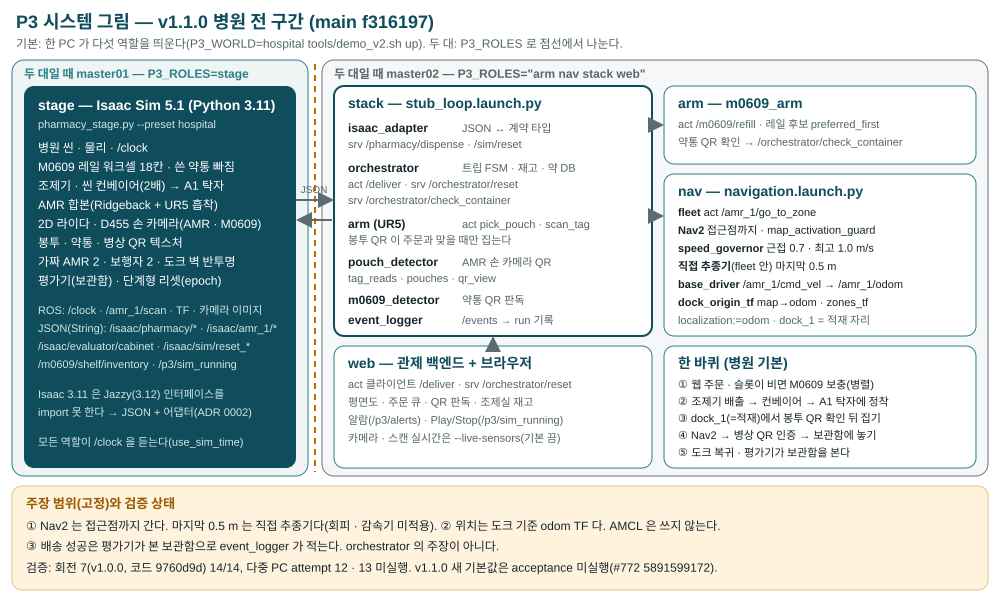

# 시스템 그림 — PC ↔ 역할 ↔ 노드 ↔ 토픽 (v1.1.0)

상태: **현황 기록**. 계약을 바꾸지 않는다.
기준: main `f316197` = 태그 `v1.1.0` 의 코드다. 병원 월드(`P3_WORLD=hospital`)의 기본 실행을 그린다.
첫판은 2026-09-24 main `66450ae` 기준이었다. 2026-09-30 에 v1.1.0 으로 다시 그렸다.
발표 슬라이드([slides.html](../presentation/slides.html), [tutor-main.html](../presentation/tutor-main.html))가 [system-overview.svg](system-overview.svg) 를 그대로 쓴다.
그림을 고치면 슬라이드 그림도 같이 바뀐다.

계약 1절의 **계획 배치**(master01 Isaac, master02 orchestrator, 노트북 fleet·arm)는 [배송 계약 v1](delivery-contract-v1.md)에 있다.
이 문서는 지금 **실제로 띄우는 배치**다. 둘이 다르면 이 문서는 관측이고, 계약은 그대로 둔다.

## 0. 한 바퀴 (병원 기본, v1.1.0)

1. 웹이 주문을 `/deliver` 로 보낸다.
2. 조제기 슬롯이 비면 orchestrator 가 M0609 보충(`/m0609/refill`)을 보낸다. 보충은 트립과 병렬로 돈다(`refill_planner.py`).
3. M0609 는 약통 QR 을 읽고 약 DB(`/orchestrator/check_container`)로 확인한다.
4. 조제기가 봉투를 낸다(`/pharmacy/dispense`). 봉투는 병원 씬 컨베이어를 탄다.
5. 봉투는 A1 모듈 탁자에 정착한다(`P3_HOSPITAL_RECEIVER_PRIM`, #796·#797).
6. AMR 합본은 dock_1 에서 기다린다. dock_1 이 곧 적재 자리다(`zones.hospital-receiver.yaml`, #790·#797).
7. 합본 팔이 손 카메라로 봉투 QR 을 읽는다. QR 이 주문과 맞을 때만 집는다(#784).
8. Nav2 가 병상 접근점까지 간다. 마지막 0.5 m 는 fleet 안의 직접 추종기다.
9. 병상 인식표 QR 을 손 카메라로 읽어 인증한다. 그 뒤 보관함에 놓는다.
10. AMR 은 도크로 돌아간다. 평가기가 본 보관함을 event_logger 가 적는다.

- 근거: `tools/demo_v2.sh` 124–183행(병원·카메라 기본값), 424–481행(스택 인자).
- dock_1 과 load 가 같은 자리라 orchestrator 는 `load_at_dock` 으로 본다. AMR 은 움직이지 않고 바로 적재로 간다(`trip_fsm.py` 931–936행, `orchestrator_node.py` 545–557행).
- 카메라 기본은 `dispense_while_dispatching:=true` 도 넘긴다(`tools/demo_v2.sh` 136·469행). 이 값은 적재 자리로 이동할 때만 쓰인다. `load_at_dock` 이면 먼저 걸리지 않는다(`trip_fsm.py` 938행).
- 참값 센서 집기는 `P3_CAMERA_POUCHES=0` 을 줄 때만이다. 그때 구역 파일은 `zones.hospital.yaml` 이다.

## 1. PC 와 역할

기동은 `tools/demo_v2.sh up` 하나다. 병원 월드는 역할 다섯을 순서대로 띄운다: stage → arm → nav → stack → web(`tools/demo_v2.sh` 254–260행).

| 배치 | 무엇을 띄우나 | 근거 |
| --- | --- | --- |
| **기본: 한 PC** | 다섯 역할 전부. `P3_ROLES` 를 비운다 | 회전 7 의 한 PC attempt 전부(v1.0.0 릴리스) |
| 두 대 | master01 `P3_ROLES=stage` 먼저. master02 `P3_ROLES="arm nav stack web"` 는 스테이지가 준비된 뒤. 둘 다 `P3_PEER=<상대 IP>` | `tools/demo_v2.sh` 20–28행, [병원 데모 런북](../runbooks/hospital-demo.md) 10절, [ADR 0005](../adr/0005-deployment-single-master-default.md) |

- 첫 두 대 회차는 회차19(`4d01333`, 리하05 B)다. #240 5797973069·5797973429 이 원문이다.
- 회차19 의 rtf 는 0.711 이다. 같은 날 한 PC 골든(`bfc8c38` 회차18)은 0.686 이다.
- acceptance protocol v4 의 phase E(attempt 12·13)가 두 대 실행이다(`experiments/protocols/hospital-full-acceptance-v4.json`).
- 회전 7 에서 attempt 12·13 은 미실행이다. v1.0.0 은 두 PC 증거로 회전 1–3 을 인용한다(릴리스 본문).
- v1.1.0 에서 두 대 실행은 검증하지 않았다(#772 5891599172).
- 해석: 두 대의 rtf 이득이 작아서 촬영과 기본 실행은 한 PC 로 한다.

## 2. 역할별 노드

| 역할 | 띄우는 것 | 노드 | 주 인터페이스 |
| --- | --- | --- | --- |
| stage | Isaac Sim 5.1 standalone(Python 3.11, `env -i`). `sim/standalone/pharmacy_stage.py --preset hospital` | 한 프로세스. 병원 씬 · 물리 · M0609 워크셀 · 조제기 · 씬 컨베이어 · AMR 합본 · 2D 라이다 · D455 손 카메라 둘 · QR 텍스처 · 가짜 AMR · 보행자 · 평가기 · 단계형 리셋 | ROS 타입: `/clock`, `/amr_1/scan`, TF, 관절 상태, `/amr_1/hand_camera/image_raw`, `/m0609/hand_camera/image_raw`, `/p3/sim_running`. JSON(String): `/isaac/pharmacy/*`, `/isaac/amr_1/*`, `/isaac/evaluator/cabinet`, `/isaac/sim/reset_*`, `/isaac/events`, `/isaac/fleet/poses`, `/m0609/shelf/inventory` |
| arm | `ros2 run rokey_p3_manipulation m0609_arm ... -p v2_rail_select:=preferred_first` | m0609_arm | action 서버 `/m0609/refill`. 구독 `/m0609/shelf/inventory`, `/m0609/hand_camera/tag_reads`. 서비스 클라이언트 `/orchestrator/check_container`(`container_check:=true`) |
| nav | `ros2 launch rokey_p3_navigation navigation.launch.py ... nav2_final_approach:=true localization:=odom` | fleet · base_driver · zones_tf · dock_origin_tf · Nav2(map_server · map_activation_guard · controller_server · speed_governor · planner_server · behavior_server · bt_navigator) | action `/amr_1/go_to_zone`, `/amr_1/cmd_vel` → `/amr_1/odom`, map→odom(`dock_origin_tf`), `/amr_1/speed_limit`, `/p3/alerts` |
| stack | `ros2 launch rokey_p3_bringup stub_loop.launch.py use_isaac_adapter:=true pharmacy_only:=false ...` | isaac_adapter · orchestrator · event_logger · arm(UR5) · pouch_detector · m0609_detector | action `/deliver`, `/amr_1/pick_pouch`, `/amr_1/scan_tag`. service `/pharmacy/dispense`, `/sim/reset`, `/orchestrator/reset`, `/orchestrator/check_container`. topic `/events`, `/orders/status`, `/pharmacy/belt`, `/pharmacy/dispenser/status`, `/amr_1/hand_camera/tag_reads`·`pouches`·`qr_view` |
| web | `web/backend` 의 `app.main --allow-commands` + 브라우저 | 관제 백엔드(ROS 노드 하나) | action 클라이언트 `/deliver`, service 클라이언트 `/orchestrator/reset`, 토픽 구독(`web/backend/app/ros_spec.py`) |

- 노드 근거: `src/rokey_p3_bringup/launch/stub_loop.launch.py` 302–387행, `src/rokey_p3_navigation/launch/navigation.launch.py` 85–100행, `src/rokey_p3_navigation/launch/nav2.launch.py` 84–106행.
- 병원 스택은 스텁(stub_sim·stub_fleet·stub_arm·stub_detector)과 order_generator 를 끈다(`tools/demo_v2.sh` 435–437·449·463행).
- pouch_detector 는 `detector:=color` 에 QR 판독을 더한다. YOLO 는 기본 경로에 없다(`stub_loop.launch.py` 371–380행).
- m0609_detector 는 같은 pouch_detector 실행 파일을 `robot_id:=m0609` 로 띄운 것이다. `P3_CONTAINER_QR=1`(병원 기본) 일 때만 뜬다.
- 어댑터를 두는 까닭: Isaac 5.1 의 Python 3.11 은 ROS 2 Jazzy(3.12) 인터페이스 패키지를 import 하지 못한다. Isaac 은 JSON 토픽을 내고, `isaac_adapter` 가 계약 타입으로 옮긴다([ADR 0002](../adr/0002-isaac-json-topics-and-ros-adapter.md)).
- m0609_arm 노드 자체의 `v2_rail_select` 기본은 `first_feasible` 이다(`m0609_arm_node.py` 230행). `tools/demo_v2.sh` 가 `P3_V2_RAIL_SELECT`(기본 `preferred_first`, #797)를 늘 넘긴다(207·406행).
- `/m0609/shelf/inventory` 는 스테이지가 낸다. m0609_arm 은 구독만 한다(`sim/standalone/pharmacy_stage.py` 2829행, `m0609_arm_node.py` 219행).
- `/p3/alerts` 는 orchestrator(도킹 재시도)와 map_activation_guard(지도 개입)가 낸다.

### 스테이지 병원 preset 이 켜는 것

값의 근거와 바꾸는 법은 [스테이지 인자·기본값](stage-arguments.md)에 있다.

- M0609 워크셀은 18칸을 가득 채운다. 쓴 약통은 선반으로 돌아오지 않는다(#791).
- 씬 컨베이어 표면 속도는 잰 값의 2배다(#789).
- 도크 벽은 불투명도 0.35 다(#792).
- 가짜 AMR 2대와 보행자 2명이 돈다.
- 봉투(`ord-`)·약통(`cn-`)·병상 인식표(`pt-`) QR 텍스처를 붙인다.

## 3. 누가 누구를 부르나

| 부르는 쪽 | 받는 쪽 | 이름 | 종류 |
| --- | --- | --- | --- |
| web | orchestrator | `/deliver` · `/orchestrator/reset` | action · service |
| orchestrator | isaac_adapter | `/pharmacy/dispense` · `/sim/reset` | service |
| orchestrator | fleet | `/amr_1/go_to_zone` | action |
| orchestrator | arm(UR5) | `/amr_1/pick_pouch` · `/amr_1/scan_tag` | action |
| orchestrator | m0609_arm | `/m0609/refill` | action |
| m0609_arm | orchestrator | `/orchestrator/check_container` | service |
| fleet | Nav2 | `/amr_1/navigate_to_pose`(접근점까지) | action |
| pouch_detector | arm(UR5) | `/amr_1/hand_camera/tag_reads` · `/amr_1/hand_camera/pouches` | topic |
| m0609_detector | m0609_arm | `/m0609/hand_camera/tag_reads` | topic |
| 모든 노드 | event_logger | `/events` | topic |

- 근거: `orchestrator_node.py` 258–294행, `m0609_arm_node.py` 370·391행, `arm_node.py` 562–569행, `isaac_adapter.py` 234–235행, `fleet_node.py` 203행.

## 4. 주장 범위(고정)

1. Nav2 는 **접근점까지** 간다. 마지막 0.5 m 는 fleet 안의 **직접 추종기**다(`navigation_params.yaml` 의 `nav2_handoff_radius` 0.5). 장애물 회피와 감속기는 거기에 적용하지 않는다.
2. 위치 추정은 **시뮬 도크 기준 TF(odom)** 다. AMCL 은 쓰지 않는다(`localization:=odom`, `dock_origin_tf`).
3. 배송 성공은 orchestrator 의 주장이 아니다. **평가기가 본 보관함**으로 event_logger 가 적는다.
   - 평가기 경로(`/isaac/evaluator/cabinet` → `/evaluator/cabinet`)는 `P3_SIM_SENSORS=1` 일 때만 켜진다(`tools/demo_v2.sh` 344·445행, `isaac_adapter.py` 209행).
   - `tools/demo_v2.sh` 자체 기본은 0 이다. 런카드 명령과 protocol v4 는 1 을 준다([hospital-full 런북](../runbooks/hospital-full.md) 2절, protocol v4 purpose 5).

- 감속기 근접 속도는 0.7 m/s 다. 최고 속도는 1.0 m/s 다(`speed_governor.py` 21–30행, `nav2_params.yaml` 139행, #788).

## 5. 검증 상태

- 회전 7 은 v1.0.0 의 코드 `9760d9d` 에서 돌았다. master01 attempt 14건이 모두 통과했다. attempt 12·13 은 미실행이다(v1.0.0 릴리스, 판정표 #771 `5867873681`).
- v1.1.0 커밋으로 돌린 acceptance 회전은 없다(v1.1.0 릴리스).
- v1.1.0 의 새 기본값(카메라 집기, 도크 = 적재 자리, 근접 0.7 m/s, 컨베이어 2배)은 L3 acceptance 미실행이다.
- acceptance protocol v4 는 카메라로 봉투를 집는 구성(`P3_CAMERA_POUCHES=1`)을 범위 밖이라고 적는다(`experiments/protocols/hospital-full-acceptance-v4.json` purpose 1).
- 회전 7 코드 `9760d9d` 의 기본은 참값 집기였다(`tools/demo_v2.sh` 155행, `P3_CAMERA_POUCHES` 기본 0).
- 카메라 배송은 master02 탐색 실습 1건이 있다. 코드 `05b8e28`, `bed_a1` 한 건 DELIVERED 다([실습 45](../practice/simworld/practice-45.md)). v1.1.0 통합본으로 다시 돌린 기록은 없다(#772 5891599172).
- 감속기 긴급정지는 #752 진단만 있다. 정지 규칙 수정은 main 에 없다.

## 6. 확인한 것과 안 한 것

- 확인: 노드 이름·토픽·액션·서비스는 main `f316197` 의 launch 파일, 노드 코드, `tools/demo_v2.sh`, `web/backend/app/ros_spec.py` 에서 옮겼다.
- 미실행: 살아 있는 그래프(`ros2 node list`·`ros2 topic info`)와의 대조. 마스터 슬롯이 필요하다.
- 그림에 없는 것: TF 트리 전체, QoS, `/amr_1/gripper/*`·`/amr_1/arm/*` 같은 보조 토픽. 발행자·구독자·QoS 표는 [ROS2 연동 표](ros2-integration-table.md)에 있다.
