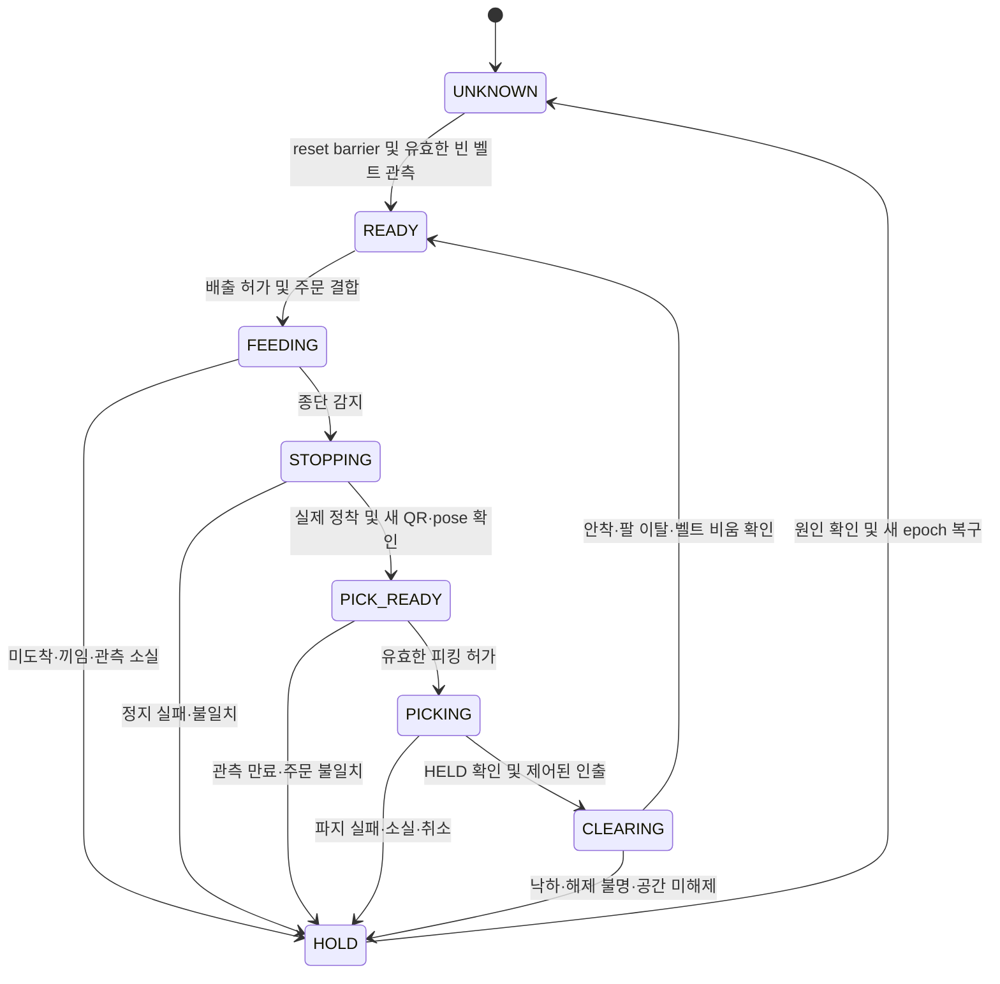

# 컨베이어 감지·정지·피킹 CPS 보완 계획

- 상태: **proposed — 구현·배포·물리 검증 완료 아님**. 2026-09-19.
- 기준: main `52be136ec1042b0a7ef469ae486d5999f71fe065`, #238 계획 `4ebf56b`; 사용자 제공 최종 지시문 검토.
- 연결: [통합 계획](mock-hospital-world-integration-plan.md), [시나리오](scenario.md), [배송 계약](../architecture/delivery-contract-v1.md), [#232 구현 계획](ur5-hospital-delivery-implementation-plan.md).
- 목적: 기존 단일 벨트부터 **배출 허가 → 도착 감지 → 실제 정지 확인 → 주문 확인·피킹 → 점유 해제 → 다음 배출**을 닫는다. 세준 분기 벨트 채택까지 미루지 않는다.
- 후속 역할·순서: [2단계 추진 계획](integration-resource-two-phase-plan.md). 재범의 상위 골격 인계 후 배정된 CPS 단위 모듈·포트만 구현한다. 분산 충전은 신규 F4 목표로 추적한다.

## 1. 현행 구현과 부족한 경계

컨베이어 제어가 전혀 없는 것은 아니다. 기존 구현은 타이머만으로 벨트를 돌리는 구조도 아니다.
아래는 소스 정적 관측이며 실제 장치에서 결함을 재현했다는 뜻은 아니다.

| 근거 | 현재 동작 | 보완할 점 |
| --- | --- | --- |
| [BeltModel](../../sim/standalone/p3sim/belt.py) | 단일 봉투 점유, 종단 구역 진입 시 running=false, 봉투 속도 ≤0.01 m/s가 0.3초 유지되면 POUCH_AT_END | running은 모델 상태다. 벨트 정지 명령과 실제 정지 관측을 구분해야 함. 기존 수치는 새 합격선이 아님 |
| [pharmacy_stage.observe_belt](../../sim/standalone/pharmacy_stage.py) | Isaac 물체 pose·linear velocity로 위치/속도를 얻고 graph velocity를 0으로 설정 | 시뮬레이터 정답 기반 감지다. 영상 기반 물리 피킹의 인지 성공으로 집계하지 않음. velocity 미수신을 0으로 취급하는 경로도 UNKNOWN으로 바꿀 대상 |
| 같은 BeltModel / stage | frame 누락·벨트 밖 이탈 시 점유 해제, stage는 봉투를 pool로 회수. 종단 도달 timeout은 note로 기록 | 낙하·추적 소실을 정상 수거와 구분. timeout을 실행 중단·재가동 금지로 연결 |
| [BeltState.msg](../../src/rokey_p3_interfaces/msg/BeltState.msg), [pick_permission.py](../../src/rokey_p3_manipulation/rokey_p3_manipulation/pick_permission.py) | occupied/at_end/order_id. pick guard는 at_end를 벨트 정지와 봉투 정지 양쪽 조건에 사용 | 장치·물품 정지, 관측 유효성, 작업 세대 및 실제 도킹을 따로 증명 |
| [isaac_adapter](../../src/rokey_p3_bringup/rokey_p3_bringup/isaac_adapter.py), stage | 스텁 POUCH_PICKED를 pick_notice로 전달해 봉투 회수. stage의 실제 cell.held 분기도 붙잡힌 순간 model.reset | 실제 피킹 구성은 pick_notice=false. attachment만으로 팔 작업 공간과 다음 배출 자원을 해제하지 않음 |
| #233 `b9ba0d6` | 정수 route와 같은 Cube의 시작점 재배치로 분기 시연 | 주문·관측·취소·reset 계약에 들어오는 backend로 별도 통합 |

기존 `BeltModel`·ROS 계약·orchestrator를 확장한다. 웹용 두 번째 마스터 FSM이나 `/hospital/*` 명령 체계를 병행하지 않는다.

## 2. 감지와 제어의 역할

| 역할 | 책임 / 금지 사항 |
| --- | --- |
| 종단 도착 감지 | 검증한 센서 또는 영상 감지가 정지 구역 진입을 알리면 즉시 STOP 요청. 두 센서가 모두 동의할 때까지 정지를 늦추지 않음 |
| 벨트 backend 하나 | 구동·정지 명령 소유, 로컬 watchdog, 실제 운동 상태 관측. 비전 노드는 같은 모터를 별도로 구동하지 않음 |
| 정지 후 인식 | 새 이미지·촬영 시각 TF로 봉투 pose/주문 QR/개수/관측 품질 확인. 이송 중 계산한 pose를 최종 파지점으로 재사용하지 않음 |
| 팔 실행기 | 유효한 피킹 허가와 실측 base 정지·도킹 확인 후 접근, attachment·인출·안착·팔 이탈을 확인 |
| orchestrator | 주문과 적재 위치 배정, 단일 작업 소유권, 성공/실패 종결, 다음 배출 허가 |

현 시나리오의 손목 카메라 QR 검출은 유지한다. 고정 종단 카메라는 도착 감지·가림 보완용 추가 후보이며, 필요성과 시야를 측정한 뒤 배치한다.
손목 카메라를 전개해야 보이는 구성이라면 종단 센서로 먼저 정지시키고, 별도의 관측 자세까지만 움직인 뒤 QR/pose를 얻는다.
관측 자세 이동은 base 정지·벨트/봉투 정지·충돌 검사 조건을 적용하며, 이를 파지 접근 허가로 사용하지 않는다.
센서 불일치·미수신·다중 봉투·주문 불일치 때는 STOP을 유지하고 피킹을 금지한다.

모드별 증거를 구분한다.

- `stub`: 계약/FSM L1/L2용. 물리 성공 집계 제외.
- `sim_sensor`: 명시적으로 표시한 시뮬레이터 pose·속도 기반 센서 에뮬레이션. 벨트 물리 이송·정지 실험에는 사용 가능하지만 영상 인지 실증과 구분.
- `perception`: 센서/영상 검출·촬영 시각 TF로 제어. GT는 분리된 평가 로그에서만 사용. 필수 관측이 없으면 sim_sensor로 자동 전환하지 않음.

## 3. 벨트 내부 상태와 작업 소유권

아래는 기존 배송 FSM 아래에 둘 **벨트 작업 상태 설계**다. 실제 인터페이스의 확정 enum이 아니다.



모든 상태에서 reset/clock 되감기는 기존 permit을 폐기한다. READY에서도 heartbeat가 끊기면 UNKNOWN이며 새 배출을 금지한다.
상태도 정상 전이와 별개로 실행기 로컬 watchdog은 계속 동작한다. 새 epoch는 이전 물품을 비운 것으로 간주하는 수단이 아니다.

**배출 허가:** 주문 배정·AMR의 적재 위치 도킹/정지·상판 칸 예약·이전 물품 처리 완료·팔이 벨트 통로 밖·belt ready·reset 완료·관측 freshness가 모두 유효해야 한다.
하나의 owner만 이를 수락한다. 동일 operation 재전송은 같은 결과를 돌려주고 물품을 두 번 생성하지 않는다.
`Dispense` 수락은 벨트 도착/피킹 성공이 아니다. 벨트가 점유된 뒤 새 주문·route 변경은 busy로 거부한다.

**피킹 허가:** 현재 epoch/operation/order, 동일 물품 1개, 정착한 벨트와 봉투, 정지 후 QR 일치·유효 pose, 실제 AMR 도킹/정지, 적재 칸 예약, TF/충돌/팔 상태가 모두 유효해야 한다.
상위 허가만 믿지 않고 팔 실행기가 수락 직전과 접근 중 필수 조건을 재검사한다. permit 만료 시 새 동작을 금지한다.
접촉·흡착 이후 카메라 가림은 예상 가능하므로 attachment 관측과 작업 단계별 감시로 전환한다. 잘 보이던 마지막 이미지가 갱신되는 것처럼 사용하지 않는다.

**다음 배출 허가:** HELD만으로 해제하지 않는다. 첫 구현은 상판의 지정 칸 안착, 물품 ID/custody 갱신, 팔/도구/물품의 벨트 통로 이탈, 유효한 벨트 비움 관측을 모두 확인한다.
그 후 벨트 작업 예약을 해제한다. 병행 투입으로 처리량을 늘리는 것은 별도 충돌·자원 시험 이후다.
물품 추적 소실·벨트 밖 이탈·픽 이벤트 하나는 비움의 증거가 아니다. UNKNOWN을 유지하여 뒤 봉투와 섞이지 않게 한다.

## 4. 정지 거리와 신선도 예산

“감지 즉시 정지”는 명령 지연을 최소화한다는 뜻이며 물리적으로 순간 정지한다는 뜻은 아니다.
감지 경계는 벨트의 물리적 끝보다 앞에 두고 봉투 선단 기준 남은 거리를 계산한다. 중심 pose를 쓰면 봉투 길이·회전을 반영한다.

```text
필요 여유 거리 ≥ 최대 이송속도 × 총 감지/전달/제어 지연
                + 검증된 제동 거리 + 봉투 미끄럼 거리
                + 위치 추정 오차 + 추가 여유
```

총 지연에는 센서 샘플 주기·영상 처리·전달·제어 tick·명령 적용 지연을 포함한다.
일정 감속을 보장할 수 있을 때만 제동 거리 `v²/(2a_min)` 모델을 쓴다. 현재 surface velocity 방식의 물리 응답을 먼저 측정한다.
마찰계수 0.8을 기입한 것만으로 정지 거리나 흡착 안정성을 보장하지 않는다.
여유가 부족하면 속도를 낮추거나 감지 경계를 앞당긴다. 완충 턱만으로 과주행을 정상 종료시키지 않는다.

- 모터 STOP 응답·graph 속성 0은 명령 처리 확인이다. 벨트 운동과 봉투 운동의 실제 정착 관측이 필요하다.
- fresh sample 여러 개로 정착 지속 시간을 증명한다. 같은 sample 반복 수신·미수신 속도=0·clock 정지를 정착으로 계산하지 않는다.
- sim time/epoch는 물리 진행·촬영 시각에 사용하고 monotonic wall time은 통신 freshness·watchdog에 사용한다. 관측 생성 시각/sequence도 검사하여 오래된 frame 반복이 heartbeat를 되살리지 못하게 한다.
- 미도착, STOP 후 정지 실패, 영상/QR 실패, 파지/안착 실패의 deadline을 각각 둔다. 측정 전 숫자를 임의로 확정하지 않는다. 설정 누락·예산 초과는 물리 실행 준비 실패다.
- 통신이 끊겨 STOP이 전달되지 않을 수 있으므로 backend 로컬 watchdog으로 정지시킨다. 실제 정지 지연을 기록하며 웹 오류 보고만으로 안전 정지를 주장하지 않는다.

## 5. 계약 확장과 수정 위치

**제안하는 계약 변경이며 현재 배포된 필드가 아니다.** #232 PR-A에서 정확한 타입·QoS·rate·deadline을 확정하고 생산자/소비자/stub을 함께 변경한다.
기존 `/pharmacy/belt`의 정보 부족을 문서상의 가정으로 메우지 않는다.

| 경계 / 위치 | 필요한 변경 |
| --- | --- |
| `rokey_p3_interfaces` BeltState 및 피킹 관측 | schema version, epoch/operation/order 결합, observation sequence/time/mode, occupancy의 UNKNOWN, 벨트·봉투 운동의 UNKNOWN/MOVING/STOPPED, stop 관측 근거. 기본 false를 정지/비움으로 해석하지 않음 |
| `p3sim/belt.py` | 명령/관측 분리, HOLD/UNKNOWN과 deadline, 중복 배출 차단, 피킹 허가·작업 자원 해제 조건을 ROS 없는 함수로 시험 |
| `pharmacy_stage.py` + backend | GT/센서 모드 명시, STOP 및 watchdog, 실측 운동 상태, 소실·timeout 시 보존. 실제 피킹에서 pick_notice/자동 회수 경로 차단 |
| `isaac_adapter.py` + bringup | schema/epoch 검증 후 상태 전달, 오래된·중복·역순 관측 차단, real pickup capability 검사. 구버전 epoch를 현재 세대로 승격하여 실제 permit을 발행하지 않음 |
| perception + manipulation | 정지 이후 새 QR/pose, 촬영 시각 TF, base 도킹/정지 구분, 실제 attachment와 지정 칸 안착, 통로 이탈 관측 |
| orchestrator + stub/fake backend | 배출·피킹·clear reservation의 유일 소유권, 늦은 성공/취소 경쟁 차단, 의미가 같은 실패 주입과 웹 오류 매핑 |

STOP은 벨트 backend의 취소 가능한 내부 명령으로 설계하고 stop 요청 ID/epoch 및 결과를 남긴다.
기존 `Dispense` 서비스로 STOP까지 표현하거나 불리언 SetBool 하나로 모든 상태를 대신하지 않는다.
구체적인 새 ROS 서비스가 필요하면 위 계약 PR에서 정의하며 별도 웹 명령 채널을 만들지 않는다.

복구 정책은 원인별로 제한한다. 정착한 동일 봉투·유효 pose·접촉 여유가 확인된 미파지만 정해진 전체 retry 상한 안에서 재시도한다.
센서 소실·주문 불일치·끼임·정지 실패에는 자동 추가 하강/역구동을 하지 않는다.
HOLD에서는 벨트 정지, base 주행 금지, 팔의 제어된 홀드와 파지 유지, 현재 물품 위치/작업 예약 보존을 적용한다. 무조건 홈 복귀·흡착 해제를 하지 않는다.
시뮬레이션 reset의 명시적 물품 회수는 기존 barrier 안에서만 수행하고 이전 작업을 성공 처리하지 않는다.

## 6. 시험과 구현 순서

| 단계 | 구현 / 담당 제안 | 필수 검증 |
| --- | --- | --- |
| 통합 1단계 / I1 | 박세준·임재범: 단일 backend, 센서 모드와 STOP 관측 경로·budget readiness | 이중 구동자, 구버전 상태, 관측 미준비일 때 시작 거부. 센서 배치·정지 거리 측정 계획 |
| 통합 2단계 / I3, #232 A–D | 임재범: 계약·벨트 상태/예약; 박세준: 장면/센서/backend; 전제환: QR·피킹·안착·통로 이탈 | L1 상태/시간/순서 시험 → L2 adapter·실행기 계약 → L3 물리 stop·픽·clear. I5까지 연기하지 않음 |
| 통합 3·4단계 / I2·I4 | 이태규·박세준: 동일 의미 앵커/가림/부하; 전제환: 도킹·도달성 | fixture와 병원에서 같은 state trace·실패 정책. 낮은 RTF·관측 지연·통로 점유 시험 |
| 분기 벨트 / I5 | 박세준·임재범: #233 backend와 출구별 관측 매핑 | 점유 중 route 변경 거부, 주문별 실제 출구 확인, 텔레포트 없이 동일 CPS 계약 통과 |

시험 목록:

1. 정상 1봉투: 배출·도착·STOP 명령/적용/정착·정지 후 영상·QR·HELD·안착·팔 이탈·다음 배출의 시각/ID를 추적한다.
2. STOP 명령 성공/실제 벨트 계속 이동, 벨트 정지/봉투 미끄럼, 위치·속도 누락, 종단 미도착·끼임을 각각 주입한다. 피킹/다음 배출은 0건이어야 한다.
3. 센서 불일치·이중 봉투·잘못된 QR·오래된 이미지·촬영 시각 TF 없음: STOP 유지, 잘못된 봉투 피킹 0건.
4. HELD 후 팔이 통로 안에 있음·적재 실패·낙하: 다음 배출 0건. 정상 안착/이탈 후 동일 operation 재전송으로 중복 spawn이 없어야 한다.
5. 벨트/비전/팔 통신 단절·clock stall·관측 역순·reset 뒤 늦은 성공·진행 중 취소: permit 무효, 실제 로컬 정지/홀드와 물품 소유권 보존을 확인한다.
6. 모드 전환: 물리 피킹에서 pick_notice=true 또는 스텁 서버가 연결되면 readiness 실패. GT 보조로 영상 성공률이 올라가지 않아야 한다.

각 run에는 stop 지연·최대 과주행·최종 정지 구간, 센서/영상 age·sequence, 정착 근거, QR/주문, grasp/custody, 오류·재시도·개입, 다음 배출 허가 근거를 남긴다.
10회 정상 반복은 smoke이며 센서 실패 시험을 대신하지 않는다. deadline/오차 예산을 측정·검토하고 새 protocol로 고정한 뒤 acceptance를 판정한다.
이 문서 작성 시 위 신규 시험 및 Isaac/ROS 실행은 **미실행**이다.

## 7. 외부 추가 요구의 채택 경계

| 요구 | 판단 / 후속 |
| --- | --- |
| 약 제조·패키징 물리 구현 제외 | 현행 blackbox 조제기와 일치. 주문·재고·M0609 보충·조제 재개 인터페이스는 유지 |
| 감지 기반 정지 후 UR5 피킹 | 이번 CPS 보완에 포함. 기존 센서 모델을 인정하고 실제 관측·재가동 조건을 추가 |
| 병실 앞 분산 무선 충전·배터리 최적 배차 | 현행 조제실 밖 5개 대기 독·복귀 순서 배차·배터리 모델 없음과 다른 신규 범위. 후속 사용자 요청으로 1차 기능 통합 목표에 포함하되, 배치/정책/계약은 재범 골격으로 확정. 검증 전 실행 기본값은 유지 |
| 빈월드는 물리 부하 없는 CPS 피킹 환경 | 순수 FSM stub과 저부하 물리 셀을 구분. 흡착·마찰·정지 거리 검증에는 물리가 필요 |
| 원본 CAD 좌표 강제, fixture 좌표 중단, SDF 추출 | #215 원점 A·합성 USD 기준과 명시적 fixture 좌표 유지. 자동 추출은 USD 경로 |
| ward/room 도착 즉시 배송 완료 | 기존 스테이션/보관함 인계·인증·안착 증거 필요. 도착과 물품 전달을 분리 |
| inflation 고정값 축소, 0.15 m 리프트·바스켓 투하 | 실측 형상·도달·정지/충돌/안착 기준으로 정함. 상수 복사로 확정하지 않음 |
| 새 카메라·독 모델 즉시 카페 공유 | 채택된 자산만 버전·해시·원본 위치를 PR/manifest로 관리. 이번 문서 PR은 모델 업로드나 팀 채널 전송을 수행하지 않음 |

분산 충전 코어를 인계할 때 다음을 명시한다: 통행/비상구를 침범하지 않는 배치, dock와 robot 각각의 원자적 예약·lease/만료·재시작 복구, 물리 점유 중 lease 만료에 의한 재배정 금지, 충전 가능/접속/충전 중/해제 완료 관측, 배터리 관측과 최소 복귀 에너지, 독 고장·만석·충전 실패 대안, 진행 주문의 소유권.
“최적 로봇”의 비용은 현재 위치→조제실→목적지→사용 가능한 독의 경로/에너지·대기 비용과 작업 가능 조건을 포함해 정의한다. 단순 근접도와 battery 숫자로 결정하지 않는다.
충전 기능·예약 서버·상태 관측이 없는 상태에서 CHARGING_IDLE/RESERVED 이름만 추가하지 않는다. 컨베이어 공통 CPS 구현의 선행 조건으로도 묶지 않는다.
원안의 `[span_*]` 표기는 출처로 해석할 수 없는 내보내기 흔적이며, 팀의 승인이나 구현 증거로 사용하지 않는다.
