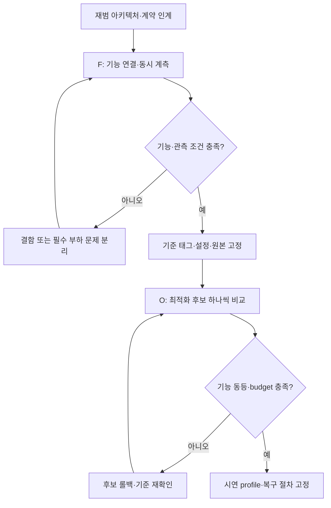

# 기능 통합 후 리소스 최적화: 2단계 적용 계획

- 상태: **proposed — 적용 방안 검토, 기능 구현·장비 튜닝 미착수**. 2026-09-19.
- 입력: 임재범의 2단계 추진 가이드 및 #238 결정 총괄 댓글.
- 소스: #238 `ace4c15`, main `427c3e33ef83d253363294c860f0c3efb312fdf2` 확인. 직전 main `52be136` 이후 변경은 #237 발표 자료이며 아래 런타임 소스는 동일하다.
- 갱신: 2026-09-21 빈월드 한 바퀴 계획의 전제는 **0절**이다. 1-6 절은 9/19 원문이다.
- 관계: [기존 통합 상세 계획](mock-hospital-world-integration-plan.md)의 4단계는 아래 **1차 F의 세부 작업 F1–F4**로 사용한다. 2차 O는 같은 장비 구성에서 성능을 조정하는 후속 작업이다. 공식 일정의 1·2차 시연/Phase 번호와 다른 구분이다.

## 0. 2026-09-21 갱신 — 빈월드 한 바퀴 계획의 전제

입력은 재범 결정이다.
**아래 1-6 절은 2026-09-19 원문 그대로 둔다.** 이 절은 그 뒤에 정해진 것을 적고,
어긋나는 곳에서는 **이 계획에 한해** 이 절이 우선한다. 원문의 판단을 지운 것이 아니다.

| 전제 | 2026-09-21 |
| --- | --- |
| 범위 | **요청 → 복귀 한 바퀴.** 계약 2.6절 ①-⑩ 을 빈월드에서 한 번 완주하는 것이 목표다. 원문 2절의 "빈월드는 픽·적재까지만" 을 이 계획에서는 한 바퀴로 넓힌다 |
| 주행 v0 | **고정 경로 따라가기.** 빈월드에서 **Nav2 튜닝은 여전히 하지 않는다**(원문 1절과 같은 말이다). 경로·속도·costmap 값을 현장에서 만지지 않는다 |
| 구역·프레임·계약 | **시뮬 세계와 같은 것을 쓴다.** 구역 이름·프레임 이름·계약 v1 을 따로 만들지 않는다. 지금 무엇이 있고 무엇이 비었는지는 [빈월드 한 바퀴 목록](empty-world-lap-inventory.md) |
| 순서 | **빈월드 전 구간이 먼저다.** 심월드 통합을 앞당기지 않는다. `preferred_first`(#391)와 리소스 최적화(아래 4절 O)는 **심월드 통합 뒤**에 적용한다(재범 결정, 9/21 12:12 "권고대로 진행하자") |
| 시간 단위 | **반나절 상자.** 카드 하나를 반나절 안에 끝나는 크기로 자른다 |
| 기준 기계 | **`master02`(도메인 118)다.** 실습22 통과로 정해졌다(v0.3.0 1부 headless 두 바퀴, #240 issuecomment-5754948948). 남은 표시: **창 모드 기준선 없음**, `PAUSED` 불일치 1·경계 1, 클립 미실행 |
| 도메인 | `master01` 117 · `master02` 118 · 웹 PC 119 · 개인 실험 120 (재범 결정 43). 117·118 은 [유선망 문서](../setup/ros2-wired-network.md)에 이미 있고 **119·120 은 아직 그 문서에 없다** — 후속 PR 로 넣는다 |

### 카드

카드는 K0-K6 이다. 아래는 2026-09-21 11:5x-12:2x 에 확정된 문구다.

**순서: K1 → K2 → K4 → K2b → K6.** K4 는 받침대에 고정한 UR5 가 `--mode ros` 에서 집는 것이고,
팔을 이동 베이스에 얹는 것은 그 뒤(K2b)다. 한꺼번에 하면 실패했을 때 베이스 탓인지 팔 탓인지 못 가린다.

| 카드 | 담당 | 내용 | 뼈대 판정선 | 상태 |
| --- | --- | --- | --- | --- |
| K0 | 통합·정비 | 전제(이 절)와 [단계별 목록](empty-world-lap-inventory.md) | 단계마다 "누가 하나" 가 한 표에 있다 | 이 PR |
| K1 | 시뮬(+세준) | 조제실 v2 위에 복도·병상·보관함·도크를 **상자 모형**으로 얹고(`layout.py` 의 `corridor_boxes`·`ward_boxes`, 전부 매개변수·출처 "임시"), zone 프레임(`load`·`dock_N`·`bed_xN`·`station_x` + `cabinet`·`tag`)을 스테이지가 TF 로 낸다. zone 값은 `zones.yaml` 을 덮어쓰지 않고 **월드별 파일**(단일 출처 = 장면 매개변수, 공차 양수). 모듈 투입구 받침 충돌체(#397) 포함 | `up` 한 번에 전부 보인다 · 손 카메라·라이다 끈 채 rtf ≥ 0.95 · VRAM 기록 · 기존 preset 회귀 | Draft #401 |
| K2 | 시뮬 + 주행 | **빈 베이스가 굴러가는 데까지다(팔을 얹지 않는다).** 스테이지가 파이썬으로 dummy 3축(prismatic x·y + revolute z)을 만들어 직접 구동한다(자산 그래프는 고치지 않는다, v0 키네마틱 허용). **Isaac 은 `/amr_1/base/joint_command` 수신·`/amr_1/joint_states` 발행만** 한다. odom 과 TF `odom→amr_1/base_link` 의 작성자는 `base_driver` 하나다 | 직진·회전·정지가 명령대로 보인다 · 리셋 뒤 원위치 · `joint_states` 20 Hz·sim stamp 단조 | 9/22 오전 Draft 예정 |
| K3 | 주행(+태규) | fleet 에 `motion_backend: nav2 \| waypoints`(기본 `nav2` = 지금 동작) 한 곳. 순수 모듈 `waypoint_follower.py` + 월드별 `routes.*.yaml`(from_zone, to_zone → waypoint). 명령 경로는 `cmd_vel → base_driver → joint_command` 이고 도착·정지·취소·리셋은 기존 그대로다. 빈월드 `map→odom` 은 `waypoints` launch 의 항등 static TF. **빈월드에서 Nav2 를 맞추지 않는다** | 트립에서 AMR 이 적재 위치 → 병상 앞 → 복귀로 가는 것이 보이고 계약대로 도착·`DOCKED` 가 난다 | K3a Draft #400, K3b 이어서 |
| K4 | 비전 + 통합·정비 | `deck_slot_frame_base`(기본 0, #402) + `stub_loop.launch.py` 의 `use_ur5_arm`(기본 false, #403) + 스테이지 `--ur5`(실습12 기하). **`--mode ros` 로 UR5 가 도는 첫 회차다** | 연속 3트립: 스테이지 `suction on distance ≤ 0.01` + **명령한 칸의 `in_slot=True`** + `PickPouch ok → POUCH_LOADED` + ERROR 0·새 WARN 0·바닥 접촉 0. **팔의 `ok` 가 아니라 스테이지 참값으로 센다** | #402·#403 |
| K2b | 시뮬 + 비전 | **UR5 를 이동 베이스에 얹는다.** K2(빈 베이스)와 K4(받침대 UR5 집기)가 각각 선 뒤에 한다(시뮬 제안, 9/21 승인) | 얹은 채로 K2 의 직진·회전·정지와 K4 의 집기가 **둘 다** 그대로 된다 | 신설, 착수 전 |
| K5 | 비전 + orchestrator(재범) | 인증 v0 = 스테이지가 주는 병상 ID 와 요청 대조(손 카메라 QR 이 아니다). 전달 v0 = 고정 자세로 상판 칸 → 보관함 + 잠금 이벤트. **`Deliver` 상태 머신은 재범 소유** — 인터페이스 한 장 먼저 | 웹의 인증·전달 단계가 실제 동작과 맞물린다 | 인터페이스 초안 작성 중 |
| K6 | master02 회차 | `master02`(도메인 118)에서 요청 → 복귀·리셋 **연속 3바퀴**. 로봇이 움직일 때만 클립 | 아래 | K1-K5 **와 K2b** 뒤 |

### 한 바퀴의 판정선

두 가지를 구별한다.

- **acceptance protocol** (`experiments/protocols/`, frozen)은 **재범 결정이고 아직 없다.** 그것이 생기기
  전에는 "돌았다" 를 합격으로 쓰지 않는다.
- **뼈대 판정선**은 결과를 보기 전에 고정한 것이다. K6 의 연속 3바퀴 **각각**에 대해:

1. 요청에서 `ORDER_DONE`·복귀 `DOCKED` 까지 이벤트 순서가 계약대로다.
2. 조제·보충·픽·이송·인증·전달·복귀가 **스텁이 아닌 경로로** 돌았다는 것이 로그로 보인다
   (단계마다 "누가 했나" 를 [목록 문서](empty-world-lap-inventory.md)의 열로 대조한다).
3. 픽은 K4 의 참값 기준으로 센다.
4. 의도하지 않은 거부 0 · `[ERROR]` 0 · **새 종류 WARN 0.** "새 종류" 의 뜻은 아래에 고정한다.
5. 리셋이 전 구간에서 먹는다(바퀴 사이 리셋 뒤 다음 바퀴가 정상이다).
6. rtf·VRAM·단계별 시간표·낙하 확인(#397)은 **기록이지 합격선이 아니다.**
7. 산출물 sha256 을 남긴다.

#### "새 종류 WARN" 의 뜻 (9/21 확정)

9/20-9/21 의 "새 종류 WARN 0" 은 전부 **arm 로그만** 센 것이었다. stack 에는 회차마다 `down` 의
SIGINT 줄이 1 건 있었고 아무도 세지 않았다. 그래서 뜻을 이렇게 못 박는다.

> "새 종류" 는 arm·stack·web 셋을 형식을 가리지 않고(`grep -i warn`) 센 뒤, 기준 목록에 없는 것으로
> 정의한다. 기준 목록: ① arm `joint_states 수신 공백…` ② arm `rail/joint_states 수신 공백…`
> ③ stack `[WARNING] [launch]: user interrupted with ctrl-c (SIGINT)`(`down` 구간 안, 1 건).
> stage 의 Kit 기동부 경고는 종류 수만 적고 판정에 넣지 않는다. **PLAY 시각 이후**(Kit 줄의 선두 UTC
> 타임스탬프 기준. PLAY 시각은 `demo_v2` 의 `stage 준비` 줄 시각)의 stage WARN 은 0 이어야 한다.
> `[pharmacy_stage]` 가 낸 WARN 은 타임스탬프가 없으므로 **줄 위치와 무관하게 0** 이어야 한다.
> headless 3종(GLFW·display)은 headless 회차에만 허용한다.

**`stage.log` 에서 "PLAY 뒤" 를 줄 번호로 자르지 않는다.** Kit 경고(stderr)와 스테이지 출력(stdout)이
섞여 줄 순서가 시각 순서와 다르다. 실습22 에서는 PLAY 행(558) 뒤 654-661 행에 PLAY 보다 5 초 이른 Kit
경고 6 줄이 있었다(master02, 9/21). **선두 타임스탬프로 자른다.**

### 월드별 파일의 자리 (9/21 12:20 결정)

- `src/rokey_p3_description/config/zones.emptyworld.yaml`(#401)과 **`routes.emptyworld.yaml` 도 같은 자리**다.
- 값은 시뮬의 장면 생성기가 찍고, 시험이 "파일 본문 == 생성기 출력" 으로 묶는다.
- routes 스키마의 주인은 주행의 `routes.py`(#400)다. launch 인자는 `routes_file`·`zones_file`(#407).
- **빈 쌍도 `waypoints: []` 로 적는다.** 빠뜨린 것과 비어 있는 것을 구별해야 한다.
- **위험: 경유점은 장면 기하에 묶인다. 단일 출처는 장면 매개변수다.** 시뮬이 경로 쌍을 따지다
  복도 끝과 보관함 사이 0.50 m 틈을 찾았다(AMR 폭 0.60). 병실을 +x 1.00 m 물려서 풀었다.
  장면 치수를 바꾸면 경유점도 같이 바뀐다.

### 남은 것

- **빈월드 zones 파일에는 주문 풀의 침상 넷(`bed_a1`·`bed_a2`·`bed_b1`·`bed_b2`)이 전부 있어야 한다.**
  시연 대본이 `bed_a1`·`bed_a2`·`bed_b1` 을 쓴다. 없으면 실물 `fleet` 에서만 거부된다. K1 의 조건이다.
- 기존 `zones.yaml`(심월드 자리)에 침상 셋이 빠진 것은 **시연 뒤 카드**로 남긴다.
- **`hospital-v2` preset 은 한 번도 안 돌았다**(`docs/runbooks/l3-sim-conveyor.md:14`). 통합 단계의 위험으로 든다.
- 도메인 119·120 을 [유선망 문서](../setup/ros2-wired-network.md)에 넣는 후속 PR(#406).
- **받침대 단독 UR5 자산의 로컬 사본이 아직 없다.** `ridgeback_ur5.usd` 는 합본이다. 병원 씬 자산은
  두 기계가 같은 판이다(`master02` 의 사본 2,610/2,610 일치, `Collected_hopital_custome/` 760 개,
  목록 sha256 `72a3cc1b…`, 9/21).
- **`ci.yml` 은 base 가 `main` 인 PR 에서만 돈다.** base 를 바꾸는 것(`edited`)으로는 돌지 않고 닫았다
  다시 열어야 한다(주행 확인, #407). **쌓은 PR 의 초록은 "안 돌았다" 일 수 있다.**

## 1. 검토 결론과 역할

**기능 연결을 고정한 뒤 최적화하는 순서는 채택한다. 성능 계측·필수 관측 deadline 확인은 1차부터 하고, 물리/센서 설정을 바꾸는 최적화 실험은 2차로 분리한다.**
과부하로 관측이 끊겨 기능 판정을 할 수 없다면 F가 막힌 것으로 기록한다. 필요한 최소 부하 수정은 별도 변경으로 비교·회귀한 뒤 F 기준을 다시 세운다. watchdog 완화나 GT 폴백으로 F를 통과시키지 않는다.

| 역할 | 책임 / 산출물 |
| --- | --- |
| 임재범 | 전체 아키텍처·코어 뼈대·범위·일정·모듈 배정과 최종 결정 총괄. #238의 팀별 질문도 재범이 취합하여 답변 |
| 단위 구현 | 전달받은 단위 모듈의 구현·시험·인터페이스 정합 및 PR. 전체 FSM·배차·토폴로지 골격을 별도로 새로 만들지 않음 |
| 기능 담당자 | 재범이 지정한 범위에서 자산·센서·팔·주행 구현/기술 검토 지원. 계획의 담당 표는 제안이며 직접 배정이 아님 |
| 마스터 관측 | 지정 태그·설정 실행, 물리/성능 로그 수집, 승인된 롤백. 현장에서 합격선·코드 임의 수정 금지 |

현재 수행 범위는 문서 검토와 적용 방안이다. **상위 골격 수령 전 새 코어 구현과 빈월드의 임의 경로 튜닝은 시작하지 않는다.**
기존 최소 충돌 fixture·좌표 변환·실패 회귀는 보존한다. “빈월드 작업 중단”을 기존 테스트 삭제나 관측 부재 허용으로 해석하지 않는다.

## 2. 원안에서 조정할 전제

| 원안 | 적용 방안 |
| --- | --- |
| 세준 map/CAD를 유일 기준으로 강제 | 원본 배치는 세준 자산을 따른다. 런타임은 #215 원점 A 변환을 거친 최종 합성 USD와 이에 맞는 map/zones/anchors를 한 revision으로 사용. 원점 재변경은 재범 골격에서 명시 |
| 빈월드는 픽·적재까지만 | 주 실험 범위를 CPS·인식·피킹·적재로 제한. 물리 없는 stub과 저부하 물리 fixture를 구분. 필요한 TF/도킹/충돌 단위 회귀는 유지 |
| 조제·패키징 제외 | 제조/포장 내부 물리는 blackbox 유지. 기존 주문·재고·M0609 보충/조제 재개는 외부 인터페이스와 회귀 대상으로 보존 |
| YOLO 감지 즉시 정지·흡착 | YOLO는 도착 후보 검출. STOP 요청 후 실제 벨트/봉투 정착, 새 QR/pose, base 정지/도킹을 확인한 다음 접근·흡착 |
| 분산 무선 충전·배터리/위치 배차 | 이번 요청의 **신규 1차 목표**로 추적. 기존 조제실 밖 독/FIFO 배차와 교체 지점을 명시하고 재범 골격에 연결. 현재 구현되거나 확정 배치가 있는 것으로 표시하지 않음 |
| Gazebo step-size/max_update_rate | 현재 Isaac Sim 5.1 / PhysX / ROS 2 Jazzy에 맞춰 physics dt·render dt·실행 loop·센서 주기를 대조. Gazebo 파라미터를 추가하지 않음 |
| RTF ≥1, 드롭·지연 없는 무결성 | RTF·화면 FPS·센서 age·제어 지연·기능 결과를 각각 계측. 허용 budget과 반복 조건을 고정하여 판정하며 영구 무장애를 보장하지 않음 |

분산 충전의 신규 목표 수용과 기존 시나리오의 실행 기본값 변경은 별개다. 해당 구성의 검증 전에는 기존 설정을 자동 교체하지 않는다.

## 3. 1차 F: 기능 통합과 기준 실행 고정

### 골격 인계 시 필요한 최소 입력

새 문서 체계를 만들지 않고 PR 본문에 다음을 기록한다. 비어 있는 항목은 임의로 채우지 않는다.

1. 기준 branch/commit, 수정 가능한 파일·단위 모듈, 코어의 호출 진입점과 command owner.
2. 생산자/소비자·메시지 타입·topic/action/service·namespace·QoS·rate, sim/wall timestamp·epoch/operation/order 의미.
3. 성공·실패·취소·reset·timeout·UNKNOWN과 retry 상한. 단위 모듈이 반환할 결과와 상위 전이 책임.
4. 장면/profile·anchor/TCP·센서 관측 모드, 실제/스텁 서버 선택 및 금지 조합.
5. fake adapter 또는 입력/출력 예제, L1/L2 검사 명령, L3 관측 입력과 아직 없는 값.

코어가 기존 계약과 다르면 차이표를 먼저 제출한다. 변경 범위가 정해지면 client/server/adapter/stub을 함께 수정하며, 충돌을 감추는 두 번째 FSM을 만들지 않는다.

### F의 작업·완료 조건

| 작업 | 실행 순서와 산출물 | 완료 조건 |
| --- | --- | --- |
| F0 인계 | 재범 골격 수령, 위 차이표와 단위 작업 범위 확정 | 담당·명령 소유권·계약을 한 버전으로 식별 가능 |
| F1 장면 기준 | 기존 상세 계획 1단계: 같은 셀의 fixture/hospital 연결 | 원점 A·자산·TF·clock/벨트 작성자·reset 회귀. 필수 관측 준비 |
| F2 조제실 CPS | 상세 계획 2단계와 [CPS 계획](conveyor-cps-integration-plan.md): 감지→STOP→정착→QR/pose→파지→안착→팔 이탈→다음 배출 | 실제 정지/파지/안착 근거, 소실/지연/취소/이전 epoch 주입 시 새 동작 차단. 스텁 성공 제외 |
| F3 계층 배송 | 상세 계획 3단계: 기존 Deliver/GoToZone에 topology·상대 목표 연결 | 병동/병실/병상별 기존 인계 의미, 목표 revision·도킹·충돌·주행 인터록 검증 |
| F4 통합·분산 독 | 상세 계획 4단계에 재범의 충전/예약 코어를 연결 | 배차→충전 해제→조제실 픽→계층 배송/인계→독 복귀·충전 관측. reset 포함 반복·실패 시험 |

분산 독 연결에 필요한 입력은 **독 ID/anchor/capacity, 실제 점유·충전 상태, robot availability/배터리 관측, 원자적 예약·lease·취소/reset·재시작 복구, 복귀 에너지 조건과 고장/만석 대안**이다.
독 모델 링크와 CHARGING_IDLE enum만으로 충전 완료를 증명하지 않는다. 모델링된 SoC를 쓰면 sim 모델임을 표시하고 충전/소모 시간 규칙을 고정한다.
새 배차 정책을 적용하는 구성에서는 기존 FIFO dispatcher를 함께 활성화하지 않는다. 진행 중 임무를 임의로 선점하는 의미도 새로 추가하지 않는다.
해당 코어가 미제공이면 F4의 그 경로를 미완료로 남긴다. 기존 독으로 축소 시연하려면 범위 변경을 재범 결정으로 기록하고 신규 목표 전체 완료라고 보고하지 않는다.

YOLO 준비에는 weights/class mapping/revision, 종단 ROI, 촬영 시각 TF, false stop·미감지·추론 지연 검증이 포함된다.
[현재 detector](../../src/rokey_p3_perception/rokey_p3_perception/pouch_detector_node.py)는 기본 color이며 YOLO 로드 실패 시 color 폴백이 있다. 실제 YOLO 목표 구성은 모드/가중치 readiness와 결과 출처를 검사하고, 폴백을 YOLO 성공으로 세지 않는다.
2D box는 물품 ID·3D 위치·정착을 단독으로 증명하지 않는다. QR·depth/검증한 평면 투영·TCP 변환과 결합한다. 세부 학습·검증은 [기존 비전 계획](vision-data-and-anomaly-plan.md)을 재사용한다.

F 종료 시 고정할 묶음: 코드 태그, 계약 버전, scene/map/anchor/asset/model hash, 로봇 수와 센서 모드, physics/render/loop 주기, detector 설정, 초기 물품/seed, 기능 protocol·run·원본, 실행 장비와 화면/스트리밍 모드.
기준 기능·deadline을 통과한 구성을 O의 control로 사용한다. 정상뿐 아니라 실패·개입 로그도 보존한다.

## 4. 2차 O: 계측에 따른 리소스 최적화

### 현재 코드에서 확인한 주기 의존성

[pharmacy_stage.py](../../sim/standalone/pharmacy_stage.py)의 기본 `--physics-dt`, `--render-dt`는 각각 1/60초, `--rate`는 60이다. preset/실행 인자가 바꿀 수 있으므로 resolved 값을 기록한다.
`World(physics_dt=..., rendering_dt=...)`, `step_world()` 뒤 `observe_belt()`, 일부 M0609 demo의 `get_rendering_dt()` 기반 궤적·정착/timeout 계산이 있다.
따라서 render/loop 주기 변경은 화면 비용 외에 감지 간격·데모 동작 시간에도 영향을 줄 수 있다. 해당 경로 사용 여부와 실제 sim time 진행을 먼저 검증한다.
필요한 시간 의존성 수정은 동작 변경 PR로 분리하고 L1/L2/L3 회귀 후 최적화 실험을 재개한다. 현 설정을 튜닝 없이 곧바로 결함으로 단정하지 않는다.

Isaac의 physics step과 rendering frame은 서로 다를 수 있으며 wall time과도 다르다([Isaac 5.1 시간 모델](https://docs.isaacsim.omniverse.nvidia.com/5.1.0/physics/simulation_fundamentals.html)).
physics dt 확대는 정확도 손실 가능성이 있고 collider 단순화에도 정밀도 절충이 있다([Isaac 5.1 성능 안내](https://docs.isaacsim.omniverse.nvidia.com/5.1.0/reference_material/sim_performance_optimization_handbook.html)). 이를 무조건 첫 조치로 삼지 않는다.

### 변경 순서

병목이 확인된 항목만 선택하며 한 후보에서 여러 계층을 동시에 바꾸지 않는다.

| 순서 | 후보 | 보존 조건 / 다시 확인할 기능 |
| --- | --- | --- |
| O0 기준 계측 | F 설정 그대로 CPU core별 사용·GPU/VRAM·RSS·RTF·physics/render/추론 시간·ROS age 수집 | 실제 시연 GUI/스트리밍/로봇 수 포함. 학습·빌드 동시 실행 여부 기록. 측정 도구 부하도 확인 |
| O1 불필요한 표시 비용 | 미사용 viewport, 불필요한 디버그 발행/로그, 시각 mesh·texture/LOD 후보 | 센서 render product·CPS 관측은 유지. QR·YOLO·LiDAR 결과가 바뀌는지 재검증 |
| O2 센서·추론 | 촬영/추론/전송 병목 분리 후 ROI·해상도·주기·큐 처리 조정 | 토픽 publish만 줄여 렌더/추론 부하가 줄었다고 가정하지 않음. RGB-depth 동기/내부 파라미터·QR 픽셀 크기·관측 age·정지 거리 예산 재검사 |
| O3 Nav2 | 불필요한 costmap 공개 빈도, 이후 측정된 갱신·제어 병목 조정 | 장애물 반영 지연·제동 거리·AMCL·문 통과·도킹 유지. scan 유효 거리 변경의 실제 비용·사각·감지 여유를 검사하며 하향 조정 자체를 최적화로 간주하지 않음 |
| O4 충돌·물리 | 충돌체 단순화, 근거 있는 비접촉 장식 collider 제외; dt·solver 조정은 마지막 후보 | 바닥/벽/문/상판/벨트/봉투/팔 충돌과 지지면 유지. 물품 마찰·정지 거리·흡착·안착·자기 간섭·도킹을 전부 회귀 |
| O5 시연 고정 | 기능 동등성과 budget을 통과한 변경만 묶어 후보 tag/profile·runbook 작성 | 실제 화면 구성·재시작·reset 반복과 이전 F/O tag 복구 검증. 이후 임의 live 튜닝 금지 |

“불필요한 인테리어”는 경로/팔/물품의 충돌·지지, 영상 가림, 사용 센서의 감지 형상 어디에도 필요한 역할이 없다는 근거로 분류한다.
시각 형상·collision·LiDAR raycast가 항상 같은 데이터를 쓴다고 가정하지 않는다. 사용 센서 backend에서 실제 반영 결과를 검사한다.
물리 형상이 바뀌면 관련 geometry/scene revision과 지도 생성 근거도 다시 검증한다. 장면은 가벼워졌는데 문/통로 폭이 달라진 결과를 동등한 시험으로 취급하지 않는다.

현재 [Nav2 설정](../../src/rokey_p3_navigation/config/nav2_params.yaml)은 controller 20 Hz, local costmap update/publish 5/2 Hz, global 1/1 Hz다. 이는 실측 최적값이 아니다.
`publish_frequency`는 토픽 발행, `update_frequency`는 costmap 내부 갱신이다([Nav2 Jazzy 정의](https://docs.nav2.org/jazzy/configuration_and_development/configuration_guide/core_servers/costmap_2d/)). 내부 갱신을 낮추면 장애물 반영이 늦어질 수 있으므로 “낮추면 주행 지연 방지”라는 주장은 채택하지 않는다.
센서/제어 주기를 낮춘 뒤 timeout·TF tolerance를 늘려 지연을 숨기지 않는다. budget을 못 맞추면 후보를 되돌리거나 명시적 기능/속도 변경으로 따로 검토한다.

### 비교와 완료 조건

| 구분 | 기록 / 판정 |
| --- | --- |
| 비교 조건 | 같은 HW/드라이버·코드·seed·초기 상태·주문·로봇 수·가동 센서·실행/스트리밍 모드에서 F 기준과 단일 후보 비교. warm/cold 시작·정상 구간·reset 구간을 구분 |
| RTF | epoch별 `Δsim_time / Δmonotonic_wall_time`. pause/reset을 정상 구간 평균에 섞지 말고 별도 보고. 고정 window의 분포·최저/하위 분위와 저하 지속 시간 기록 |
| 실시간 목표 | 실시간 pacing에서는 RTF≈1을 목표로 하며, RTF>1을 요구해 시연 속도를 올리지 않음. 평균 1만으로 지연 합격 처리하지 않음. 허용 구간·측정 window는 pilot 후 시험 전에 고정 |
| 화면·센서·제어 | 화면 frame time/FPS, 영상·scan·TF·관측 age, 추론/제어 실행 지연 p50/p95/p99/max, 누락·stale·deadline 위반 건수. 화면 FPS와 제어 갱신률을 분리 |
| 자원 | CPU core 포화, GPU/VRAM·RSS peak/추세, swap·OOM·crash, 실제 장비 온도/클럭 저하가 관측되면 함께 기록 |
| 기능 동등성 | 같은 protocol의 피킹·안착·인계·복귀·reset와 실패 주입 결과 유지. 관측 예산·최대 과주행·파지/도킹 공차를 완화하여 통과시키지 않음 |
| 복구 | 후보 실패 시 해당 후보만 롤백. 진행 물품/주문을 UNKNOWN으로 보존하고 기존 barrier에 따라 재개. 설정 파일 일부만 되돌리지 않고 검증된 profile 묶음 복구 |

RTF 목표, 토픽별 freshness/최대 지연, QR/검출 허용 오차, 정지 거리, 메모리 여유, 시험 시간·반복 횟수는 담당 관측과 재범 결정으로 protocol에 고정한다.
기존 계약 값이 있으면 유지하고, 아직 없는 값은 미정으로 표시한다. 누락된 합격선이 있는 상태에서 “무결성 시연 환경 확보”를 완료 처리하지 않는다.
최적화 설정·센서 주기·solver가 바뀌면 기능 시험 결과를 그대로 이월하지 않는다. 영향을 받는 시험과 전체 반복 루프를 다시 수행한다.

## 5. P7 운영 계획과의 관계

이번 O는 **시연 전 동일 배치에서 필요한 장면·센서·물리 부하 조정**이다.
[P7 안정형 A / 고도화형 B](two-master-final-stage-plan.md)의 마스터 역할 재배치·Zenoh·Docker·systemd 전환은 별도 후속 운영 계획으로 유지한다.
O를 핑계로 P7-B까지 시연 직전에 도입하지 않는다. 검증된 기존 배치와 수동 복구 방식을 우선 사용한다.
headless/스트리밍 실행 모드 자체를 바꾸려면 센서·화면·복구 동등성을 별도 검증하며 시연에서 실제 쓸 모드로 다시 계측한다.

## 6. 다음 단위 작업

다음은 **재범이 골격과 배정을 전달한 뒤 선택할 작업 카드**다. 현재 착수·일정 확정이 아니다.

| 카드 | 입력 | 구현·검증 산출물 | 완료 조건 |
| --- | --- | --- | --- |
| M1 도착/정지 판정 | 종단 ROI/센서 관측 계약, STOP backend와 budget | 기존 BeltModel의 순수 guard·UNKNOWN/deadline·중복/역순 시험 | 미감지·소실·정지 실패에서 픽 허가 0건 |
| M2 피킹·재가동 정합 | M1 상태, PickPouch 진입점, attachment/custody/상판/팔 이탈 관측 | 기존 팔 실행기·adapter의 단위 FSM 연결, 취소/reset/timeout 시험 | 실제 파지·안착·통로 비움 전에 다음 배출 0건 |
| M3 상위 골격 어댑터 | 재범의 주문·예약·충전·계층 주행 포트 | 현재 계약과의 차이표·지정 포트 어댑터·L2 | 동일 ID/epoch/취소 의미, 명령 작성자 중복 없음 |
| M4 성능 비교 | F 기준 run·profile, 지정 병목/변수·protocol | 단일 최적화 후보와 전후 로그·회귀·롤백 PR | 기능 동등성·기정의 budget 만족, 미실행 수치 없음 |

지금은 문서와 코드 근거 대조까지 수행했다. 새 모듈 구현, 배차 코어, 현장 센서 배치, PhysX/센서/Nav2 설정 변경 및 물리·성능 시험은 **미실행**이다.
원안의 `[span_*]`는 출처가 아니며, 계측값·팀 승인·완료 근거로 사용하지 않는다.
