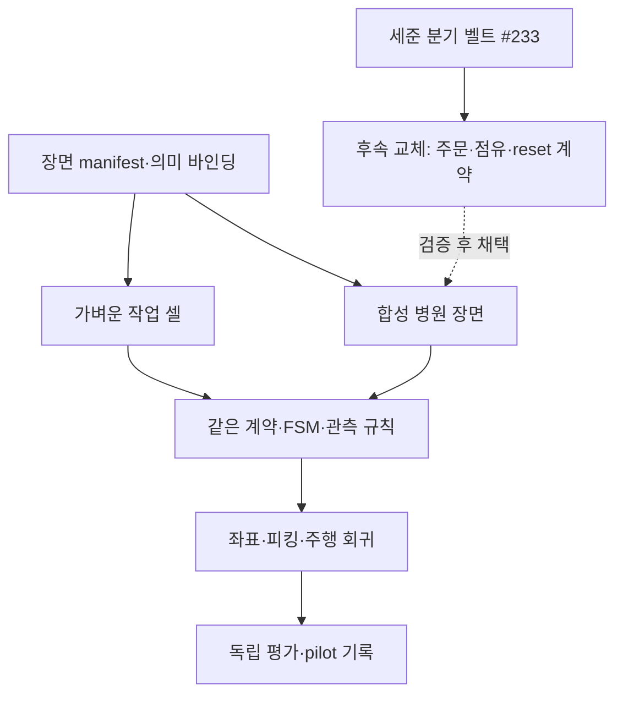

# 빈월드·병원 씬 통합 상세 계획

- 상태: **proposed — 구현·배포·합격 선언 아님**. 2026-09-19.
- 추진 순서·역할은 [기능 통합 F → 리소스 최적화 O의 2단계 계획](integration-resource-two-phase-plan.md)을 따른다. 이 문서의 1–4단계는 F의 상세 WBS다. 임재범이 전체 구조·코어와 검토 결정을 총괄하고, 골격 인계 후 배정된 단위 모듈·인터페이스를 구현한다.
- 기준: main `52be136ec1042b0a7ef469ae486d5999f71fe065`, Isaac Sim 5.1 / ROS 2 Jazzy.
- 입력 검토: [사용자 제공 원안과 현행 코드의 차이](../analysis/2026-09-19-jaebeom-world-integration-code-review.md).
- 후속 보완: [컨베이어 감지·정지·피킹 CPS 계획](conveyor-cps-integration-plan.md). 기존 단일 벨트부터 적용할 관측·피킹 허가·재가동 조건이며 분기 벨트 교체와 별개다.
- 상위 범위: [시나리오](scenario.md), [공식 일정](schedule.md), [배송 계약](../architecture/delivery-contract-v1.md), [#232 UR5 배송 구현 계획](ur5-hospital-delivery-implementation-plan.md).
- 이 문서의 새 profile·파일명·스키마·함수는 설계안이다. 현재 실행 가능한 CLI와 구분한다. 공식 P2/P4 범위 및 기한을 변경하지 않는다.

## 1. 목표와 적용 범위

**같은 주문·작업 로직을 가벼운 검증 장면과 병원 장면에서 사용하고, 장면 교체로 좌표·물품 상태·제어 소유권이 바뀌지 않게 한다.**
첫 이식은 기존 M0609·단일 벨트의 병원 배경 회귀다. UR5 이동 장착·피킹·물리 주행은 #232 A–G 의존성에 따라 추가한다.
병원 메시 전체를 로드했다는 사실만으로 배송 시스템 통합 완료로 보지 않는다.

| 실행 구성 | 현재 여부 | 용도 / 제한 |
| --- | --- | --- |
| ROS stub loop | 있음 | 주문·FSM·타임아웃·취소·리셋 L1/L2. 물리 성능 집계 제외 |
| `demo-ros-refill-v2` | 있음 | 가벼운 M0609·조제·벨트 실습. UR5·AMR 실제 통합 완료 아님 |
| `hospital-v2` | 있음, 병원 L3 미확인 | 같은 작업 셀 + 병원 배경. 원점 A·역변환·기존 벨트 유지 |
| #233 `hospital_main.py` | 별도 미병합 PR | 세준 분기 벨트의 수동 route 시연. 배송 실행기와 동시 기동 금지 |
| 모바일 UR5 fixture / 병원 배송 | 신규 구현 필요 | #232의 관측·양방향 피킹·주행 연결 이후 가능 |

빈월드에도 문·벽·상판·적재물의 최소 충돌 형상은 둔다. 그래야 저부하 실험이 실제 통과 가능성을 왜곡하지 않는다.
병원 트랙에서만 발견되는 가림·TF·부하 문제는 다시 fixture에 재현 사례로 옮긴다.



## 2. 좌표 기준과 데이터 소유권

### 2.1 유지할 기준

세준 USD는 병원 배치의 원본이다. 그러나 런타임 좌표의 기준은 **원점 A 변환·prim 비활성·작업 셀 추가를 끝낸 최종 합성 장면**이다.
#215의 결정과 `p3sim/base_scene.py`를 유지한다. 원본 USD의 좌표를 런타임 `map`에 그대로 넣지 않는다.

열벡터 표기로 `ᵃT_b`를 b 좌표를 a 좌표로 옮기는 변환이라 정의한다.
H는 원본 병원 world, M은 합성 stage world와 일치하는 ROS map, A는 정적 작업 앵커다.

```text
기존 pharmacy-origin = (0.25 m, 13.3 m, 0 m, yaw 0 deg), H에서 본 M의 자세
M_T_H = inverse(H_T_M)
M_T_A = M_T_H × H_T_A
M_T_goal = M_T_A × A_T_goal
```

합성 stage에서 `GetLocalToWorldTransform(anchor)`를 얻으면 이미 M 기준이므로 **원점 역변환을 다시 적용하지 않는다**.
기존 예: H의 벨트 시작 `(1.6, 14.3, 0.75)`는 M에서 `(1.35, 1.0, 0.75)`다. 이는 기존 배치의 계산 예이며 새 병상 실측값이 아니다.
`base_to_stage`/`stage_to_base`를 재사용하고 yaw 90도·음수·왕복 변환을 기존 테스트와 대조한다.
USD Gf 행렬의 행/열벡터 관례를 확인하여 경계에서 한 번 변환한다. 수식 순서를 API에 그대로 복사하지 않는다.

### 2.2 소유권

| 데이터 / 제어 | 작성자 | 소비자 / 제한 |
| --- | --- | --- |
| 원본 씬·자산·prim 바인딩·비활성 목록 | simulation | 각 profile에서 하나의 합성 결과 생성 |
| 앵커 상대 작업 offset·TCP / 접근면 | manipulation + simulation 검토 | meter·rad 기준. 모델 중심을 작업면으로 추정하지 않음 |
| 지도·zones·토폴로지 산출물 | simulation + navigation 리뷰 | 좌표를 노드마다 복사하지 않음 |
| `map → amr_1/odom` | AMCL | GT pose를 같은 TF로 중복 발행하지 않음 |
| `amr_1/odom → amr_1/base_link` | 기존 base_driver | Isaac 예제의 odom TF를 함께 켜지 않음 |
| base 아래 팔·상판·카메라 TF | 계약의 Isaac 발행 경로 | 이동 상판은 map 고정 앵커가 아님 |
| 기존 고정 `pharmacy/*`, cabinet/tag TF | `zones_tf` | 별도 자동 broadcaster가 같은 child를 재발행하지 않음 |
| `/clock`, 벨트 구동, spawn/reset | 선택된 stage·벨트 backend 하나 | profile 간 동시 작성 금지 |

새 정적 anchor TF가 필요하면 `zones_tf` 입력/계약을 확장한다. extractor 자체는 파일을 생성하는 도구이며 상시 TF 노드를 추가하지 않는다.
정적 TF가 캐시된 채 장면을 바꾸지 않는다. profile 전환은 프로세스 정지·새 revision·관련 노드 재기동 후 수행한다.

## 3. USD 추출기와 상대 목표 계산 설계

SDF 파서를 새로 만들지 않는다. `hospital_scene_check.py`·`base_scene.py`를 기반으로 다음 도구를 제안한다.

| 신규/확장 위치 | 책임 | 입력 → 출력 |
| --- | --- | --- |
| 신규 `sim/standalone/export_scene_anchors.py` | 합성 USD에서 정적 앵커 추출, TF 발행 없음 | 준비된 stage + 의미 바인딩 + profile → anchor snapshot·검사 결과 |
| 신규 `sim/standalone/p3sim/scene_manifest.py` | 자산·layer·profile·offset 해시와 준비 상태 검증 | manifest → 승인 가능한 실행 묶음 또는 명시적 실패 |
| 기존 `rokey_p3_navigation/zones.py` 보강 | finite/공차/준비 상태·revision 검사, generated zones 읽기 | zones + manifest → 기존 Zone 자료형 |
| 신규 `rokey_p3_navigation/relative_pose.py` | ROS 없는 상대 목표 계산 | 정적 anchor의 rigid pose + meter offset → map goal |
| #232 제안 `rokey_p3_navigation/topology.py` | 계층/허용 edge/차단 상태 경로 | zone IDs → 경유·종단 zone 순서 |

추출 순서:

1. 외부 자산을 승인한 경로와 해시로 해소하고 references/payloads/variants를 로드한다. 누락 자산·미해결 토큰은 실패다.
2. 원점 A·deactivate·rigid-off·작업 셀까지 포함한 stage를 검사한다. 삭제된 선택적 legacy prim은 새 revision에서 목록을 갱신하며, 필수 앵커 누락은 경고로 통과시키지 않는다.
3. prim 이름의 부분 문자열로 병실을 추정하지 않는다. 검토된 의미 ID→정확한 prim 경로 또는 명시적 marker 바인딩을 사용한다. 중복·inactive·다중 매칭은 거부한다.
4. 정적 앵커는 정해진 stage 시각에서 `UsdGeom.XformCache.GetLocalToWorldTransform`을 읽는다. layer/시각/epoch 변경 시 캐시를 폐기한다. 움직이는 로봇·약포지에는 정적 snapshot을 재사용하지 않는다.
5. `metersPerUnit`, `upAxis`, 부모 변환, pivot, `resetXformStack`, scale을 반영한다. 현재 병원 layer는 m/Z-up이지만 모든 참조 자산이 같다고 가정하지 않는다.
6. 변환된 위치는 m로 정규화한다. 합성 scale은 geometry 검증에 포함하고, meter offset을 적용할 rigid anchor에서는 scale을 분리한다. 벨트의 0.5 scale로 작업 offset까지 반으로 줄이지 않는다. 음수 scale·shear·검증하지 못한 비균등 scale은 거부한다.
7. quaternion은 ROS xyzw로 정규화한다. nav의 x/y/yaw 축약은 평면·roll/pitch 제한 검증 후에만 허용한다. manipulation은 full pose를 유지한다.
8. anchor snapshot에서 상대 목표를 계산해 기존 형식의 zones를 생성한다. 지도·collision·허용 edge·실제 장착 팔 도달성을 검사한 뒤에만 `ready=true`를 허용한다.

API 계약 제안:

```text
extract_anchors(composed_stage, binding, manifest, time_code)
  -> immutable AnchorSnapshot | unresolved_asset / invalid_transform / missing_anchor
resolve_target(snapshot, anchor_id, offset_m_rad, required_revision)
  -> map_pose | revision_mismatch / invalid_offset / unsupported_scale
validate_bundle(manifest, zones, topology, map_metadata, robot_geometry)
  -> ready | list[blocking_reason]
```

OpenUSD는 부모를 포함한 월드 변환과 시간별 캐시를 제공하지만 stage 변경에 따른 자동 캐시 무효화를 보장하지 않는다([XformCache](https://openusd.org/25.05/api/class_usd_geom_xform_cache.html)).
단위가 다른 참조 자산의 보정은 조립 책임이며 local translate만 단위 환산하는 방식은 잘못될 수 있다([단위 정의](https://openusd.org/release/api/group___usd_geom_linear_units__group.html)). Isaac 내 실제 USD 버전도 실행 manifest에 남긴다.

정적 병상/문 앵커로 작업 목표를 계산하는 것은 허용한다. AMR·물품의 simulator 정답 위치를 운영 검출·AMCL 입력으로 넣어 관측 성공을 만들어내는 것은 금지한다. 정답은 독립 평가 경로에만 둔다.

## 4. 공용 YAML 스키마 초안

**좌표 편집의 원본은 scene binding + 상대 offset이며, 런타임 절대 좌표는 generated zones 한 곳에만 둔다.**
토폴로지는 좌표를 복제하지 않고 zone ID를 참조한다. #232와 같은 `hospital_topology.yaml`을 확장하며 두 번째 경쟁 파일을 만들지 않는다.
기존 `zones.yaml` 소비자 호환을 위해 revision·준비 상태는 manifest에서 검증한 뒤 기존 shape로 내보낸다. 향후 schema 필드 추가는 모든 소비자를 함께 수정한다.

| 파일 역할 | 주요 필드 / 제약 |
| --- | --- |
| authored scene binding | `schema_version`, profile, semantic ID, 정확한 `prim_path`, 정적 여부, meter 기준 offset, zone/cabinet/tag 역할 |
| generated anchor snapshot | frame, source revision, prim path, position_m[3], quaternion_xyzw[4], 원본 scale, 추출 시각·도구 버전 |
| generated zones | 기존 `frame: map`, zones 및 pharmacy 구조. x/y/yaw, 양의 tol_xy/tol_yaw, cabinet/tag pose |
| authored topology | ward→room→bed 및 station 관계, checkpoint/door/final zone 참조, directed edge·stop/through·차단 조건·비음수 cost |
| generated manifest | profile, stage/layer/assets/map/zone/topology/offset hash, 단위·축·원점 변환, backend, controller·관측 준비 결과 |

아래는 **실행 불가인 초안 예시**다. `null`을 0으로 채워 실행하지 않는다.

```yaml
schema_version: 1
profile: hospital_v2
ready: false
frame: map
source:
  repository_commit: "52be136ec1042b0a7ef469ae486d5999f71fe065"
  composed_scene_sha256: null
  asset_manifest_sha256: null
  map_yaml_sha256: null
  map_image_sha256: null
  zones_sha256: null
  topology_sha256: null
  binding_sha256: null
  robot_geometry_sha256: null
composition:
  strategy: pharmacy_origin_inverse
  pharmacy_origin_in_hospital: [0.25, 13.3, 0.0, 0.0]
  origin_units: [m, m, m, deg]
  runtime_units: [m, rad]
  up_axis: Z
  belt_backend: p3_xform
bindings:
  bed_a1_dock:
    prim_path: null
    static: true
    offset_position_m: null
    offset_quaternion_xyzw: null
    target_zone_id: bed_a1
    tolerance_xy_m: null
    tolerance_yaw_rad: null
```

```yaml
schema_version: 1
frame: map
scene_revision: null
wards:
  ward_a:
    checkpoint_zone: ward_a
    station_zone: station_a
    rooms: [room_a1]
rooms:
  room_a1:
    ward: ward_a
    door_approach_zone: null
    room_waypoint_zone: room_a1
    beds: [bed_a1]
beds:
  bed_a1:
    room: room_a1
    docking_zone: bed_a1
    cabinet_frame: bed_a1/cabinet
    tag_frame: bed_a1/tag
edges: []
```

필수 검증:
- 실행 필수 필드의 null·NaN·Inf, 잘못된 quaternion·참조는 ready를 금지한다. 원점 0 자체는 유효하므로 미설정을 0 여부로 판단하지 않는다.
- zone ID는 기존 `zones.py` 규칙과 대조한다. 새 문 waypoint ID/kind가 필요하면 #232 PR-A에서 문법·stub·소비자를 함께 확장한다.
- 중복 ID·잘못된 ward/room 소속·계층 순환·단절 그래프·중복 TF child·다른 revision의 map/zones를 거부한다.
- 벽·문·비활성 목록이 바뀌면 map/anchors/zones를 함께 재생성한다. 지도 이미지 origin은 grid→map 변환이므로 임의로 `[0,0,0]`을 강제하지 않는다.
- 생성은 전체 묶음을 임시 경로에 검증한 뒤 revision 디렉터리로 확정한다. 실행기는 시작 때 해시 일치를 확인하고 중간 파일 hot reload를 하지 않는다.
- UI는 현재 `/api/destinations` 및 네 배송 모드와 연결한다. room은 병실 중앙에 놓고 완료하는 의미가 아니며 ward는 스테이션 인계다.

## 5. 1차 기능 통합 F의 세부 WBS와 출구 조건

기간은 **입력 확보·담당 합의 후의 순작업 추정**이며 공식 일정의 재배정이 아니다. 24시간 요구는 계획서 초안에만 대응한다.
자산 문제·L3 관측 슬롯 때문에 날짜를 확정할 수 없으므로 작업량과 선행 gate로 관리한다.
아래 담당은 기술 협업 제안이다. 재범이 전달할 전체 골격·단위 배정 전에 별도 코어 구현을 시작하지 않는다. 신규 분산 독·예약 연결은 2단계 추진 계획 F4에서 함께 추적하며 아래 기존 작업량에 그 공수가 포함됐다고 보지 않는다.

| 단계 | WBS / 구체 작업 | 담당 제안 | 선행 / 산출물 | 통과 조건 | 추정 |
| --- | --- | --- | --- | --- | --- |
| 1. 기준·배경 이식 | 1.1 실행 씬·벨트 소유권 고정; 1.2 동일 자산·원점 A로 준비; 1.3 기존 셀 그대로 병원 합성; 1.4 앵커·겹침·clock 점검 | 박세준 주, 이태규 좌표 리뷰, 임재범 구성 | #215 main. scene manifest·앵커 목록·이식 smoke 기록 | `/clock` 1, 중복 articulation/벨트 작성자 0, 필수 자산 해소, 기존 조제·M0609·reset 동작 회귀. L3 미통과면 이후 병원 작업 차단 | 0.5–1 작업일 + L3 슬롯 |
| 2. 저부하 물리 셀·계약 확정 | 2.1 #232 A/B 관측·모바일 장착; 2.2 벨트→상판 피킹; 2.3 상판→보관함 재파지; 2.4 실패·취소·reset·홈/주행 감시 | 전제환 주, 임재범 FSM/관측, 박세준 물리 셀 | #232 A–D와 공통. 고정 베이스 물리 smoke, 버전 고정 interface matrix | 명령 echo·가상 attach 제외한 HELD·release·안착 관측; 총 retry 상한, late callback 차단; 실행 중 물품 소실/팔 홈 상실 차단 | 2–4 작업일, 미구현 규모에 따라 재산정 |
| 3. topology·상대 도킹·지도 | 3.1 binding→합성 pose 추출; 3.2 map/zones/topology 묶음; 3.3 실제 footprint·문 폭; 3.4 fleet 경유/종단 goal checker·관측 연결 | 이태규 주, 박세준 배치, 전제환 도달성 | 1단계 좌표 및 2단계 모바일 자산 확정. 추출기·순수 solver·L1/L2 | 변환 왕복·회전·scale·누락 자산 검사; profile 교체 시 같은 의미 ID; 지도/도킹 revision 일치; 불가능한 문 경로 거부 | 1–2 작업일, 계약 확정 후 일부 병행 |
| 4. 병원 이식·부하·통합 pilot | 4.1 같은 셀을 병원에 적용; 4.2 AMCL/경로·종단 보정; 4.3 장애·가림·부하/clock-stall; 4.4 한 주문 전체 실행과 reset 반복 | 임재범 통합, 전원 기능별 지원, 마스터 관측 | 1–3 gate 통과 및 #232 E/F. 태그·profile·protocol·run 원본 | 실제 피킹→주행→인증→재파지→안착→복귀와 독립 평가 일치. 실패 포함 pilot 및 롤백 연습 | 1–2 작업일 + 관측 슬롯 |

2단계 계약 확정은 부족한 정보를 그대로 조기 동결하는 뜻이 아니다. #232의 목적지 결합, operation/epoch, 파지 heartbeat, custody, MotionPermit 합의 후 client/server/adapter/stub/web를 동일 버전으로 배포한다.
2단계에는 컨베이어 CPS도 포함한다. 도착 감지→실제 벨트/봉투 정착→새 QR/pose→피킹→안착/팔 이탈→다음 배출을 연결하고, STOP 실패·관측 소실·낙하 때는 점유를 자동 해제하지 않는다. 상세 시험은 CPS 보완 계획 6절을 따른다.
메시지 변경 없이 가능한 1단계 배경 비교를 UR5 전체 구현 완료까지 미룰 필요도 없다.
1차 시연 전에는 검증하지 못한 병원 구성으로 교체하지 않는다. 기존 검증 태그를 유지하더라도 공식 P2의 미완료 항목은 그대로 보고하며, 일정·시연 범위 조정은 별도 결정한다.

### 단계별 시험 묶음

- **1단계:** 동일 commit·seed·guard 설정으로 빈 셀/병원 셀의 M0609 계획·재고 JSON을 대조한다. 기존 README의 첫 병원 L3 비교 조건(`v2_guarded_module_path:=false`)은 해당 비교에만 명시한다. 기본값을 전역으로 끄지 않으며 guarded 경로는 별도 시험한다.
- **2단계:** 정상 피킹 10회 smoke 외에 초기 UNKNOWN, 장시간 운반 heartbeat, 흡착 명령 성공/실제 미파지, 해제 응답 유실, 이동 중 물품 소실, reset 뒤 늦은 성공, stale TF를 주입한다. 취소 뒤 무조건 홈 복귀·재흡착을 금지한다. M0609 회귀도 별도 유지한다.
- **3단계:** identity/90도 yaw/부모 transform/scale 0.5/단위 변화/비활성 prim/오래된 revision을 검사한다. `map→odom` 추정 오차가 있어도 목표 자체를 현재 base 좌표에 누적해 이동시키지 않는다. 도킹 목표는 static map anchor 기준이며 실시간 base pose는 TF로 읽는다.
- **4단계:** 한 병상 1개 주문부터 시작한다. 문·장애물·주행·보관함 인계를 결합하고 이후 room/ward 모드로 넓힌다. 5회 연속 무개입 성공은 pilot gate이며, 그 전에 실패한 시도도 동일 묶음의 분모에 남긴다.

## 6. 실행 profile과 기존 인터페이스

기존 stage preset을 먼저 사용한다. 신규 상위 profile 선택은 다음 공통 정보를 함께 해소하는 launcher/검증기로 제안한다.

| 필드 | 가벼운 셀 | 병원 배경 | 분기 벨트 후속 |
| --- | --- | --- | --- |
| stage preset | `demo-ros-refill-v2` | `hospital-v2` | 별도 승인 후 정의 |
| base USD | 없음 | 준비된 병원 USD | 채택한 #233 기반 씬 revision |
| belt backend | 기존 `p3_xform` | 기존 `p3_xform` | `hospital_sorter` 제안 |
| map·zones·anchors | fixture 전용 revision | 합성 병원 전용 revision | 교체 후 재생성 |
| capability | 실제 관측이 있는 기능만 | 1–3 gate 통과 기능만 | 별도 L3 이전에는 수동 데모만 |

`world_type=mock/real`은 실제 하드웨어로 오해하기 쉽다. 향후 `scene_profile=fixture_v2/hospital_v2`처럼 구분하며 **현재 존재하는 launch 인자로 안내하지 않는다**.
`world` 인자만 바꿨는데 실제/스텁 서버나 timeout이 몰래 바뀌지 않도록 resolved manifest를 기동 로그에 기록한다.
시작 시 asset·map·TF·관측·제어 작성자·필수 capability를 검증하고 준비가 안 된 물리 경로는 실행 거부한다.

| 원안 인터페이스 | 유지·확장할 현행 경로 |
| --- | --- |
| `/hospital/web_order` JSON, 별도 web_bridge/FSM | 기존 `POST /api/requests` → Deliver → orchestrator; `/api/snapshot`, events, `/ws` |
| 컨베이어 SetBool | 기존 `/pharmacy/dispense`, `/pharmacy/belt`, Isaac adapter. 실제 정지는 BeltState/관측으로 확인 |
| `/vision/pouch_pose` 하나 | 기존 PouchDetectionArray·TagRead/ScanTag, 촬영 시각 TF·주문 결합 |
| `/vacuum_gripper/*` | 기존 로봇 namespace 경계와 #232 관측 보강. Surface Gripper attachment를 진공 압력 측정이라 부르지 않음 |
| 웹/상위 FSM의 NavigateToPose 직접 호출 | 기존 GoToZone → fleet → 선택한 Nav2 실행 경로. goal 작성자 하나 |

## 7. 공통 컨베이어 CPS와 분기 벨트의 후속 통합

기존 단일 벨트에도 [CPS 보완 계획](conveyor-cps-integration-plan.md)의 정지 관측·주문 결합·팔 작업 공간 예약·재가동 조건을 적용한다.
현재 `at_end`만으로 벨트와 봉투의 정지를 동시에 증명하지 않으며, 실제 파지 직후 점유 해제를 다음 배출 허가로 연결하지 않는다.
이 공통 보완은 **I3 / 2단계 필수 범위**다. 다음 항목은 그 위에 세준 분기 벨트를 교체하는 별도 작업이다.

기존 단일 벨트 유지 결정은 먼저 보존한다. 분기 벨트를 배송 장치로 채택하려면 임재범 결정과 박세준·전제환·이태규의 경계 리뷰가 필요하다.
#233 전체 머지를 배경 이식의 필수 선행 조건으로 묶지 않는다. 반대로 #233이 머지돼 공유 USD가 바뀌면 기존 `hospital-v2`도 새 자산 revision으로 재검사한다.

필수 계약/구현:

1. 출구 1–4를 의미 있는 load zone에 매핑하고 출구별 UR5 도달·충돌·끝 정지 위치를 측정한다.
2. 첫 버전은 약포지 1개·출구 1개로 제한한다. 분기 명령은 배출 전 고정하며 벨트 점유 중 새 route는 busy로 거부한다. 소포 텔레포트로 현재 주문을 덮어쓰지 않는다.
3. `/pharmacy/dispense` 수락, order ID, occupied/at_end, 취소·reset epoch와 완료/오류를 기존 adapter 계약에 연결한다. 신규 route metadata가 필요하면 소비자·stub을 함께 바꾼다.
4. `/isaac/conveyor/route`는 수동 유지보수 모드에서만 허용한다. 배송 모드에서 외부 정수 메시지가 장치를 가로채지 못하도록 command owner를 하나로 제한한다.
5. 씬 벨트 backend를 켤 때 기존 xform 벨트는 생성/구동하지 않는다. 동시에 `hospital_main.py`와 `pharmacy_stage.py`를 켜지 않는다. 동작 모듈을 한 stage lifecycle로 통합한다.
6. 정지 명령·fresh 점유 관측·출구 도달·끼임 timeout·reset의 물리 효과를 L3로 확인한다. graph 입력 readback만으로 배송 성공을 발행하지 않는다.

## 8. 정량 기준·성능·실패 정책

| 항목 | 판정 제안 | 측정 / 금지할 해석 |
| --- | --- | --- |
| 정적 앵커 | 위치 오차 < 0.001 m는 검증 후보, 회전 오차 예산도 별도 확정 | 합성 USD 계산값을 같은 함수로 다시 읽어 성공 처리하지 않음. 알려진 합성 fixture와 Isaac 런타임의 독립 marker/물리 관측 비교. AMCL 정확도와 별개 |
| 피킹 | 10회 정상 smoke + 실패 주입 | 첫 시도 성공/최종 성공/재시도/취소/낙하를 별도 집계. 가상 attach·GT 제어는 물리 성공 집계 제외 |
| 문 통과 | 전체 swept footprint + 양측 margin + 오차 예산이 실제 유효 폭 이내 | 0.9 m 문·0.15 m 양측 여유면 불확실성 제외 폭 ≤0.6 m. 현 반경 0.6 m 설정으로 불가. 실제 형상 미측정 상태에서 합격선 확정 금지 |
| 도킹 | 후보 xy ≤0.05 m, yaw ≤0.05 rad + 정착 + 관측 신뢰도 | Nav2 0.25 m/rad 기본 checker와 fleet만 다른 공차를 적용하지 않음. 최종 checker/제한된 정렬과 팔 도달 여유 연결 |
| 전체 배송 | 5회 무개입 연속 성공 pilot, 독립 안착 평가 포함 | 모든 시작 요청·실패를 보존. 병상 도착·알림을 DELIVERED로 계산하지 않음 |
| 통신·물리 실패 | 새 동작 차단·로컬 정지/홀드·파지 유지·오류 보고 | 단발 cmd_vel 0이나 웹 에러만으로 정지 보장 주장 금지. 실제 감속·정지 지연 측정 |

문 통과 폭은 단순 정면 폭만이 아니라 회전한 전체 외곽과 경로를 검사한다. 문 법선을 향해 정렬한 상태를 yaw=0으로 두는 보수적 직사각형 예에서는 `W|cos(yaw)| + L|sin(yaw)| + 2×margin + 오차 예산 ≤ 문 폭`이 필요하다.
정확한 footprint를 global/local costmap과 planner/controller가 지원하는 방식으로 사용한다. inflation은 비용장 조정이며 형상 대체가 아니다([Nav2 Jazzy](https://docs.nav2.org/jazzy/configuration_and_development/tuning_guide/)).
동적 inflation은 고정 구성으로 통과 가능성을 입증한 뒤 필요성이 측정된 경우만 별도 PR로 검토한다. 적용 ACK·현재 값·취소/실패/종료 시 복구·노드 재기동 후 기본값까지 검증한다.

### RTF와 시계

- 1차 F부터 아래 항목을 계측하되, 설정 최적화는 [2차 O의 비교·회귀 순서](integration-resource-two-phase-plan.md)를 따른다. 기능 판정 자체를 막는 부하는 별도 최소 수정 후 F 기준을 다시 확보한다.
- 장면 메시가 병목이라는 가설부터 검증한다. 같은 HW·commit·seed·물리 timestep·센서 주기로 fixture와 병원을 비교하고, GUI/headless는 별도 조건으로 기록한다.
- warm-up 후 고정 구간의 sim/wall 시간, RTF 분포, physics step, 렌더 시간, LiDAR/RGB-D 발행 간격, 제어 loop 지연, wall freshness 위반·timeout 수를 수집한다.
- 시각 mesh/texture·그림자·센서 해상도를 하나씩 조정한다. 충돌 geometry·문의 폭·대상 물성을 몰래 제거해 성능을 맞추지 않는다.
- RTF 목표값과 센서/제어 최소 rate는 1단계 baseline 및 기존 watchdog budget으로 먼저 정한다. 정하지 못하면 성능 acceptance를 진행하지 않는다.
- freshness·watchdog는 monotonic wall time, 이미지/TF는 sim time·epoch. 낮은 RTF를 이유로 stale 관측을 허용하지 않는다. budget 충족 실패 시 부하를 줄이거나 경로를 차단한다.
- freeze/clock stall, QoS 지연, 장면 reset 때 TF·검출 캐시와 이전 goal token을 폐기하고 새 관측 후 재개한다.

## 9. 구현 PR 분할·릴리스·롤백

| PR 묶음 | 변경 범위 | #232와 관계 |
| --- | --- | --- |
| I1 기준과 준비 검사 | scene manifest/binding·profile readiness, 기존 hospital-v2 점검 확장 | A의 자산/설정 검증에 포함 |
| I2 좌표·지도 산출 | USD extractor·상대 pose solver·generated zones·topology validation | A/E의 topology schema와 동일 파일 사용 |
| I3 물리 셀 이식 | 공통 벨트 CPS·STOP 관측/피킹 허가/clear 예약, 이동 UR5·센서·상판·양방향 피킹과 fixture/hospital 공통 셀 | A의 벨트 관측 계약 + B/C/D를 재사용, 별도 마스터 FSM 없음 |
| I4 주행·통합 검증 | profile 선택·GoToZone 내부 경로·도킹·E2E protocol와 runbook | E/F/G와 통합 |
| I5 분기 벨트 교체 | #233 기반 backend 및 주문/상태/reset adapter | 채택 결정 이후, I1–I4의 첫 이식과 분리 |

각 PR은 소유자가 리뷰하고 L1/L2 후 마스터에서 승인된 태그로 L3를 수행한다. 새 경로는 pilot 동안 명시적 선택이며 현행 시연 preset 기본값은 바꾸지 않는다.
commit/tag, scene·외부 자산·map·zones·offset·topology 해시, robot/TCP, backend, seed, physics/sensor 설정, gate 결과, 원본 위치·해시, 실패·개입 이력을 한 run에 남긴다.
기존 frozen protocol/run은 수정하지 않고 필요 시 새 버전·supersedes를 만든다.

롤백은 실행 정지→진행 주문/물품 위치 UNKNOWN 보존→기록 마감→직전 검증 tag와 profile 묶음으로 재기동→reset/관측 재확인 순서다.
이전 zone 파일만 되돌리거나 물품이 잡힌 채 씬을 갈아끼우지 않는다. 중단 주문을 새 epoch의 성공으로 재사용하지 않는다.

## 10. 임재범이 총괄할 결정과 인계

#238 답변에 따라 결정 답변은 임재범이 취합한다. 다른 담당자에게 별도의 최종 결정을 요구하지 않는다.

- 첫 이식의 #215 유지와 분기 벨트 교체 시점, 원점/명령 소유권.
- 배포할 USD/자산 revision·prim 바인딩·출구 관측, map/footprint·문 폭·도킹 기준.
- UR5 장착/TCP·상판/보관함 앵커·#232 계약, 신규 분산 독/예약의 범위와 포트.
- 전체 골격 기준 commit과 구현할 단위 모듈·수정 경로·인터페이스.

골격과 배정이 인계되면 해당 모듈부터 구현한다. 이번 문서 검사 통과는 기능 완료나 로봇 동작 승인이 아니다.
