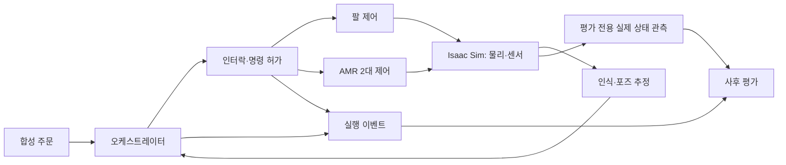

# P3 기획안 — 병원 약제 물류 시뮬레이션

> **상태: 제안, 팀 확정 전.** 저장소에 이 문서가 있다는 사실은 구현·환경 확인·팀 승인을 뜻하지 않는다.
> [기획 검토](plan-review.md), [첫날 확인 항목](first-day-checks.md), [일정](schedule.md)을 함께 읽는다.
> 수치의 정의·분모·판정은 [지표 정책](../policy/metrics.md)이 기준이며 이 문서는 이를 중복 확정하지 않는다.
>
> **시나리오는 [시나리오 문서](scenario.md)에서 확정했다 (2026-09-16).** 로봇 구성·물품·물리 흐름이 이 문서와
> 충돌하면 시나리오 문서가 우선한다. 달라진 점은 시나리오 문서 9절. 이 문서의 전면 개정과 로봇 교체 비용은 미확정이다.

## 1. 확인된 입력과 확인할 가정

| 구분 | 내용 | 근거 / 다음 확인 |
| --- | --- | --- |
| 사용자 제공 사실 | P3는 새 팀원 4명과 마스터 PC 2대를 사용하는 Isaac Sim 프로젝트 | 사용자 요청. P2_B2의 담당·장비·결정은 자동 승계하지 않음 |
| 사용자 제공 사실 | 팀원 PC 4대와 마스터 PC 2대를 Tailscale로 연결 | 연결 구성의 존재와 ROS 2 통신 검증은 별개 |
| 사용자 제공 사실 | 유선 연결은 동시 4대, 포트 1-2에 마스터 2대가 기본 연결 | 팀원 PC 전체가 동시에 유선에 연결된다고 가정하지 않음 |
| 확정된 환경 | Ubuntu 24.04 / ROS 2 Jazzy / Isaac Sim 5.1.0 | 실제 GPU·드라이버·RMW·에셋 접근을 D1에 기록. 강사 자료의 Humble 표기는 오기 |
| 원안의 시나리오 후보 | M0609 + Nova Carter 2대 + 병원 씬 + AI 비전 | 2026-09-16 [시나리오 문서](scenario.md)로 대체. AMR은 Ridgeback_UR5 |
| 확정된 일정 | 1차 시연 9/21, 최종 시연 9/29, 최종 발표 9/30 | [일정](schedule.md) |
| 미확인 | 실제 병원 작업량·인건비·오류율, 물리 하역 장치 | 근거를 확보하기 전까지 사실·성과로 표현하지 않음 |

네트워크 구성과 호스트별 실행 위치는 [셋업 문서](../setup/README.md)에서 관리한다.
IP 주소를 팀원의 역할로 사용하지 않는다. 팀원은 `simulation`, `orchestration`, `manipulation`,
`navigation` 역할을 나누고 비전·측정은 공동 계약으로 연결한다. 이름과 담당자는 팀이 배정한다.

## 2. 목적과 범위

원내 약제의 **분류·검수·병동 전달 흐름**을 시뮬레이션하고, 다중 로봇의 협업·대기·오류 대응을
재현 가능한 실행 기록으로 비교한다. 합성 주문과 모형 물품을 사용한다. 실제 처방 판단,
약 제조·포장, 투약, 실제 환자 데이터, 실제 의료 안전성 입증은 범위 밖이다.

약제 물류를 후보로 유지하는 이유는 주문, 품목, 목적지, 인계 완료를 명시하기 쉽기 때문이다.
응급실의 로봇 필요성이 낮다거나 병원의 도입 효과가 이미 입증됐다고 주장하지 않는다.
특정 병원의 실측 모델과 현실 데이터 연결이 없다면 결과는 **병원 물류 시뮬레이션 실험**으로
설명하고, 현실의 디지털 트윈으로 어느 부분까지 검증했는지 따로 명시한다.

| 단계 | 제안 범위 | 다음 단계 진입 조건 |
| --- | --- | --- |
| G0 환경·계약 | 에셋·통신·파지·시계·리셋·프레임 확인 | 기술 실험 증거와 제한사항 기록 |
| G1 최소 연결 사이클 | 1종 물품, 1주문, 1병동, 팔 1대 + AMR 1대, 인식 → 피킹 → 인계 → 복귀 → 리셋 | 전체 사이클을 반복 실행하고 모든 종료 상태를 기록 |
| G2 핵심 협업 | AMR 2대, 병동 2곳, 교차로 배타 점유, 3종 물품과 보행자/동적 장애물 | 정상·가림·미검출·통신 두절·재시작에서 허가 조건 검증 |
| G3 평가 | 동결된 프로토콜과 후보 버전으로 반복 acceptance 실행 | 실패·중단·타임아웃을 포함한 전체 실행 집합 리뷰 |
| 선택 확장 | 긴급 검체 **또는** 교차로 정책 비교 **또는** 합성 데이터 조건 비교 | G2 통과 후 D6에 하나만 선택; 평가 기간을 침범하면 보류 |

팔과 AMR 1대로도 두 로봇의 협업을 먼저 검증할 수 있다. 최종 AMR 2대 시나리오는 목표로
유지하되, 개별 모듈을 모두 크게 만든 뒤 처음 연결하는 순서를 피한다. BT/FSM은 필요한 상태와
복잡도를 비교해 ADR로 정한다. 범용 플러그인 플랫폼, 다중 시뮬레이터 추상화, 범용 배차 엔진을
선행 구현하지 않는다.

## 3. 시스템 경계

제어용 검출 결과와 평가용 실제 상태 관측은 별도 경로로 기록한다. 평가기는 제어기가
발행한 `INSPECT_OK`를 정답으로 다시 사용하지 않는다. 시뮬레이터 관측도 샘플링·접촉 판정의
한계가 있으므로 프레임, 시간, 포함 판정과 허용 오차를 고정한다. 제어기가 평가 전용 물체
ID·정답 포즈를 받아 동작하면 해당 실행은 ground-truth 보조 조건으로 구분한다.

마스터 PC의 현장 에이전트는 지정 커밋 배포 지원, 실행, 원본 수집, 수치 확인과 재현에 집중한다.
원인 가설·코드 수정·설계 제안은 증거를 받은 클라우드 에이전트가 PR로 제출한다.
클라우드에서 원본을 충분히 확인할 수 없으면 추가 실험을 요청하며, 추측을 현장 사실로 승격하지 않는다.
실제 노드 배치는 네트워크·CPU·GPU 부하 측정 후 배포 설정으로 정한다.

### 3.1 씬·에셋 후보

아래는 D1 검색·검증 대상이다. 저장소에 에셋이 존재한다거나 호환된다는 뜻이 아니다.

| 후보 | 확인할 것 |
| --- | --- |
| `Isaac/Environments/Hospital/hospital.usd` | 설치 버전에서의 경로, 다운로드 가능 여부, 라이선스, 메모리·RTF, 통로 폭 |
| `Nova_Carter_ROS.usd` 2개 | 해당 버전 다중 로봇 예제, 각 토픽·TF 이름, 센서 QoS, 도킹 접근 공간 |
| M0609 URDF/수업 USD | 제공 위치·라이선스, 관절·단위·작업 반경, 충돌 모델 |
| YCB 모형 상자·KLT 바구니 | 크기·질량·마찰·파지점·적재 안정성; 의약품 실물의 물성을 대표하지 않음 |
| Surface Gripper / Robotiq 2F-85 | 사용 모델과 한계; Surface Gripper 결과를 물리 손가락 파지 성능으로 해석하지 않음 |
| AprilTag, 카메라, 동적 캐릭터/prim | 시야·캘리브레이션·태그 크기·렌더 방식, 선택 센서의 관측 및 물리 충돌 여부 |

구역 ID 후보는 `pharm`, `ward_a`, `ward_b`, `station`, `home_a`, `home_b`다.
좌표·도킹 위치·정지선은 실제 씬에서 측정한다. 원안의 방 위치 추정은 확정 좌표가 아니다.
긴급 검체를 채택할 때만 `or`, `lab` 구역을 추가한다.

### 3.2 아직 닫히지 않은 물리 흐름

| 질문 | G1 전에 택할 방식과 기록 |
| --- | --- |
| 물품이 바구니에서 가려지면 어떻게 검수하는가? | 단층 칸 배치 또는 개별 통과 검수. 전부 관측하지 못하면 `UNKNOWN` |
| 팔이 가득 찬 바구니를 들어 AMR에 놓을 수 있는가? | 질량·파지점·팔/AMR 도달성을 실험. 대안은 도킹된 AMR 적재함에 물품 직접 적재 |
| 병동에서 누가 내리는가? | 사람 인계 이벤트, 추상화된 하역 스크립트, 실제 시뮬레이션 장치 중 선택. 자동 하역으로 표현하려면 장치 구현과 완료 관측 필요 |
| 빈 바구니는 어떻게 돌아오고 선반은 어떻게 채우는가? | 사이클 복귀 단계와 실험 간 초기화 작업을 구분. 순간 이동/리스폰은 초기화이며 자동 물류 처리량에 포함하지 않음 |
| 인계·재고·예약 상태는 언제 초기화되는가? | 실행 종료 후 정지 확인, 미완료 action 취소, 새 epoch, 물리/원장/캐시 초기화, 센서 준비 확인 순서를 계약으로 작성 |

하역을 추상화하면 도킹 완료까지만 자동화 성과를 주장하거나, 명시한 인계 모델 시간을 포함한다.
인계 신호만 발행한 것을 물리 하역 성공으로 세지 않는다. 동일 seed는 재실행 입력을 고정하지만
분산 처리·물리의 비트 단위 동일 결과를 보증하지 않는다. 허용 오차 내 초기 상태도 함께 검증한다.

## 4. 주문부터 종료까지의 제안 흐름

ROS 패키지 이름은 `rokey_p3_*`를 쓴다. `src/rokey_p3_interfaces/`의 메시지·서비스·액션은
앞으로 만들 산출물이다. 주문은 병렬 배열 대신 `order_id`, `line_id`, `destination_id`,
`item_class`, `quantity`로 구성된 항목 목록을 후보로 한다. 중복 ID, 알 수 없는 목적지,
0 이하 수량을 거부하는 규칙과 재전송의 멱등성을 계약에 적는다.

| 순서 | 동작 | 종료 조건 / 거부 조건 |
| --- | --- | --- |
| 1 | 주문 검증·수락 | 유효한 주문, 새 `run_id`와 episode/epoch 연결. 수락 이벤트에서 사이클 시간 시작 |
| 2 | 도킹·적재 구역 예약 | 점유권을 받은 AMR만 진입. 도킹 포즈·속도·상태가 모두 유효해야 적재 허가 |
| 3 | 인식·포즈 변환 | 이미지 시간·프레임·모델 버전과 결과 기록. 미검출·변환 실패·오래된 관측은 작업 거부 |
| 4 | 피킹·배치 | 주문 항목별 시도와 결과 기록. 명령 성공과 실제 목표 영역 안착을 구분 |
| 5 | 검수 | 관측 품목·수량을 주문과 비교하여 `PASS`, `FAIL`, `UNKNOWN`. 불일치/미확인은 출발 보류 |
| 6 | 팔 철수·출발 허가 | 팔의 현재 포즈·속도·작업 영역 비점유와 AMR 적재 상태를 확인; 이전 `home` 응답만으로 허가하지 않음 |
| 7 | 배송·교차로 | 단일 점유권, 유효한 센서와 정지/양보 조건 충족. 교착 타임아웃은 강제 진입 권한이 아님 |
| 8 | 병동 인계 | 선택한 인계 모델의 완료 관측. 두 병동 시나리오는 둘 다 완료해야 배송 사이클 성공 |
| 9 | 복귀·종료·초기화 | 배송 시간과 전체 재실행 준비 시간을 별도 기록. 종료 후 다음 실행의 준비 상태 확인 |

품목이 부족하거나 파지/검수에 실패하면 기본 정책은 해당 주문을 보류하고 명시적 종료 사유를 남긴다.
부분 배송이 필요하면 별도 정책으로 수락 조건을 정하고, 전체 주문 성공률에 합쳐 세지 않는다.
재시도 횟수·시간 제한은 파일로 설정하고 시도마다 이벤트를 남긴다. 실패 후 무조건 HOME으로
이동하지 않고 현재의 이동 허가 조건부터 다시 확인한다.

### 4.1 인식과 검수

YOLO 검출은 클래스·2D 영역 출력을 기준으로 시작한다. 3D 파지 포즈에는 별도의 깊이/고정 평면
가정·카메라 캘리브레이션·TF 변환·방향 추정이 필요하다. 일반 YOLO pose 모델의 2D keypoint를
상자 6D 포즈로 간주하지 않는다. G1에서 높이·방향을 제한하면 그 제한과 동적 위치 변화 범위를 기록한다.

AprilTag는 품목 ID 검수의 후보 센서다. 가림·해상도·각도·조명 때문에 읽히지 않거나 잘못 읽힐 수
있으므로 **검수를 결정론적으로 만들지 않는다**. 없는 태그, 중복 태그, 잘못된 ID, 가려진 태그를
고의로 배치해 검증한다. 읽힌 ID 목록만으로 바구니 전체 수량이 맞다고 단정하지 않는다.
평가 정답은 별도 관측 경로의 실제 물품 ID·목적 영역·시각으로 만들고, 검수 결과와 교차 비교한다.

### 4.2 인터락과 재시작

구역 상태는 최소 `UNKNOWN`, `FREE`, `RESERVED`, `OCCUPIED`, `FAULT`를 구분한다.
예약에는 소유자, 실행 epoch, 요청/명령 ID, 만료 기준이 필요하다. 명령 허가를 내리는 주체는 하나로
두고, 오래된 성공 응답이나 이전 실행 메시지로 권한이 살아나지 않게 한다.

- 센서·TF·도킹·팔 상태가 없거나 오래되면 새 동작을 거부하고 해당 제어기의 정지 절차를 수행한다.
- 통신 단절에 대비해 제어기 측에도 명령 유효시간과 감시를 둔다. 중앙 정지 메시지가 도착할 것이라고만 가정하지 않는다.
- 예약 시간이 끝나도 물리 점유가 해소되었다는 뜻이 아니다. 만료 시 `UNKNOWN`/`FAULT`로 두고 비점유 확인과 조정 후 재할당한다.
- 교착 시 양쪽을 정지시키고 관측으로 비점유를 확인한 뒤 재계획한다. 배치 ID가 작다는 이유로 점유 구역에 강제 진입하지 않는다.
- 노드 재시작·시뮬레이션 reset·시계 역행은 이전 허가를 무효화한다. 초기 상태와 새 데이터가 준비되기 전에는 재개하지 않는다.
- 센서 데이터 시간은 ROS 시간, 수신 두절·명령 만료 감시는 로컬 단조 시간으로 구분한다. `/clock` 정지 중에도 감시가 작동하는지 확인한다.

원안의 보행자 정지 1.0 m/재개 1.5 m, heartbeat 3초, 도킹 8 cm, 교착 5초는 **검증되지 않은
설정 후보**다. 속도·제동·센서와 통신 지연·불확실성에 맞춰 pilot에서 정하고 장애 주입으로 확인한다.
시뮬레이션 인터락 결과는 실제 장비의 안전 인증이나 정지 성능을 입증하지 않는다.

## 5. 측정과 해석

합격 여부는 [지표 정책](../policy/metrics.md)과 `experiments/protocols/`의 버전 고정 프로토콜로
판정한다. D4의 pilot은 정의·계측·후보 임계값을 점검하는 개발 실험이며 acceptance 결과가 아니다.
합격선 근거, 반복 수, seed/조건, 중단 규칙, 시간 제한과 독립 리뷰어를 **acceptance 시작 전** 고정한다.
원안의 20회는 표본 수 후보이며 안정성 보증이 아니다. 결과를 본 뒤 10회로 줄이거나 실패를 삭제하지 않는다.

| 관측 대상 | 지표 설계에서 구분할 내용 |
| --- | --- |
| 배송 / 재실행 | 주문 수락 → 인계 완료 시간, 복귀·리셋을 포함한 준비 시간, 시뮬레이션 시간과 실제 경과 시간 |
| 성공률 | 예정된 실행 목록·시작된 실행·성공·실패·중단·타임아웃. 성공 실행의 시간만 보고 전체 성능으로 표현하지 않음 |
| 검수 | 정상/오류 주문 판정, 잘못된 물품을 통과시킨 비율, 정상 물품 보류, `UNKNOWN`, 독립 정답의 관측 가능성 |
| 파지 | 첫 시도 성공, 재시도 후 성공, 실제 안착, 명령 성공; 시도 분모와 주문 분모를 혼합하지 않음 |
| 조율·동적 장애물 | 교차로 대기·점유 중복·접촉·최소 간격·정지 지연·교착 및 관측 누락 |
| 부하·도킹 | RTF, 센서/추론 주기·지연·데이터 나이, 도킹 위치/각도 오차의 정의와 분포 |

`evidence/runs/`에는 검증 가능한 JSON 실행 명세를 쌓고 큰 rosbag·영상·센서 원본은 외부 저장소의
위치와 해시로 연결한다. 원본을 저장소에 쌓거나 Markdown 결과표만 남기지 않는다. 예제/합성
레코드는 실측 성과에서 제외한다. 실패 원인은 관측 사실, 가설, 검증 결과를 구분하여 PR/이슈에서 검토한다.

선택 비교 실험은 한 질문부터 시작한다. 예: **같은 조건 집합에서 두 교차로 정책의 대기 시간이
어떻게 달라지는가?** 비교군, 반복/순서, 공통 조건과 분석법을 먼저 정한다. 학습 데이터 생성
seed·장면·분할은 검증/최종 테스트와 분리하고, 같은 장면의 유사 프레임이 양쪽에 섞이지 않게 한다.

### 5.1 사업 가치 가설

고객 후보는 병원 약제부·물류팀이다. 야간 인력 부족, 인계 부담, 오배송 비용은 조사할 가설이다.
시뮬레이션 처리량이 인원 감축, 투약 오류 감소, 실제 병원 ROI로 바로 이어지지는 않는다.

- 연간 총효과 후보 = 실제로 절감 가능한 업무 시간 × 부담 인건비 단가 + 근거 있는 오류 처리 비용 감소.
- 연간 순효과 = 총효과 − 유지보수·운영·감독·라이선스·에너지 등 추가 비용.
- 단순 회수기간 = 초기 장비·SI·시설·교육 비용 ÷ 연간 순효과. 순효과가 0 이하이면 회수기간을 산출하지 않는다.

회수 가능한 비용과 다른 업무에 재배치되는 시간을 분리하고 중복 계산하지 않는다. 투입 값마다
출처·기준 연도·범위를 붙여 낮음/기준/높음 조건을 비교한다. 실측이 없으면 예시/가정으로 표시한다.

## 6. 결정과 산출물

아래 경로는 구현 시 생성할 산출물의 위치이며 지금 구현이 완료되었다는 뜻이 아니다.
배포 설정은 `config/`, 패키지 고유 설정은 해당 패키지, 시뮬레이터 생성/리셋 스크립트는 `sim/`에 둔다.

| 먼저 닫을 결정 | 산출물 위치 | 진입 조건 |
| --- | --- | --- |
| 프레임·시간·단위·명령/상태/오류 계약 | `docs/architecture/`, `src/rokey_p3_interfaces/` | G0 실험을 반영한 최초 버전. 변경은 영향 분석과 버전/마이그레이션 PR |
| 실제 씬·구역·물품·그리퍼·인계 모델 | `src/rokey_p3_description/`, `sim/`, ADR | 도달성·관측 가능성·리셋 확인 |
| 제어 방식·예약/허가·실패 상태 | `docs/architecture/`, 담당 `src/rokey_p3_*` 패키지 | G1과 장애 주입에 필요한 상태부터 구현 |
| 호스트 실행 위치·DDS/인터페이스 선택 | `config/`, `docs/setup/` | 실제 연결 목록·통신·부하 확인 |
| 수집·정답·분모·분석·시험 조건 | `experiments/protocols/`, `evidence/runs/` | pilot과 acceptance 분리, 검토와 동결 |

병렬 개발은 필요한 계약이 합의된 경계부터 시작한다. 모든 미래 기능의 설계를 완성할 때까지
기다리지 않는다. 반대로 합의된 계약을 현장에서 임시 변경한 뒤 문서를 따라 바꾸지도 않는다.
기획 채택·범위 변경·실험 프로토콜 변경은 각각 상태와 근거를 남긴다.

## 후속 마지막 단계 — 마스터 PC 운영 두 옵션

P6 최종 시연·발표와 기준 실행 보존 뒤 [P7 운영 환경 최적화](two-master-final-stage-plan.md)를 수행하는 계획을 추가한다(2026-09-18 임재범 요청). 두 옵션을 둔다. **A 안정형**은 현재 검증된 호스트 배치·네이티브 실행·유선 DDS와 수동 복구를 유지하며 집중 작업 1-2일을 예상한다. **B 고도화형**은 기존 계획대로 Master 02 Isaac / Master 01 ROS 제어·빌드·관제, Zenoh·headless·Docker·자동 복구를 순차 검증하며 5-6일을 예상한다. A만 완료해도 P7을 닫을 수 있고 B는 필수 후속 단계가 아니다. 계획상 기본 권고는 A이며 최종 선택은 미정이다. Ray/K3s 자원 풀은 둘 다 범위 밖이다. 착수 조건·담당 제안·공수·옵션별 합격선·롤백은 P7 문서가 기준이다. 현재 운영 설정은 유지하며 구현 미착수.
