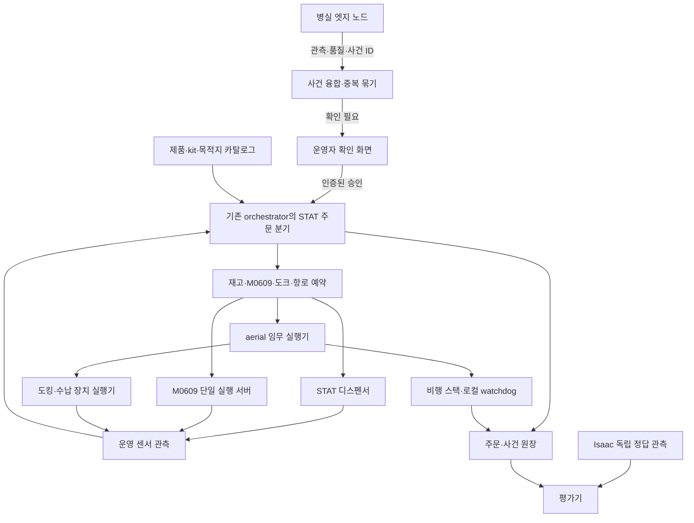

# P3-STAT 병실 엣지 센싱·응급 물품 항공 배송 구현 계획 및 원안 재검토

- 문서 버전: **v1.2 — proposed / S0·S1 우선, Pegasus 기반 S2 검증 계획 보강**
- 작성일: 2026-09-20
- 대상: ROKEY P3 A3의 독립 실행 가능한 Future Work. 기본 본선 기능에 대한 변경 승인이 아니다.
- 입력: 사용자 첨부 「P3-STAT 병실 엣지 센싱 기반 초응급 약물 드론 직배송 서브시스템」 1–8장 전체.
- 완성도 기준: [UR5 약포지 피킹·병원 배송 구현 계획 및 원안 검토](ur5-hospital-delivery-implementation-plan.md).
- 저장소 검토 기준: `68d9d10b83b055e1b7f97fe20a83ead9644bf699`. 아래 현재 상태는 이 커밋의 문서와 관련 코드 경계에 대한 정적 검토다. 저장소 전체 감사나 동작 확인이 아니다.
- v1.2 추가 검토: P3 `0ab13374096b024394e6fb1b5fb0426c7ff6b124`, Pegasus `v5.1.0`의 실제 커밋 `644da37e9d5268e5f9a34e78bdcfd57a8bab82b4`. 외부 보고서를 1차 출처와 대조했다. 기존 기준의 전면 재감사가 아니며, 추가 근거는 §24.4에 둔다.
- 실행 상태: **ROS/Isaac/PX4 실행, 기구 실측, 모델 학습, 약제 검증 모두 미실행**. 본 문서의 수치는 출처가 있는 제품 사양, 산술 예시, 원안 목표, 검증 예정값으로 구분한다.
- 우선순위: 확정 시나리오 → 채택된 계약·ADR → 별도 채택할 STAT 계약 → 이 구현 제안. 기존 배송 계약도 문서상 `proposed`인 부분이 있으므로 존재 자체를 승인으로 해석하지 않는다.

## 0. 먼저 확정할 설계 결론

목표는 **병실의 관측 가능한 이상 징후 → 담당자의 확인과 승인된 물품 주문 → 사전 준비된 STAT-Pod 출고 → M0609 탑재 → 전용 항로 비행 → 인증된 수납 장치에 인계 → 복귀·기록**이다. 카메라·마이크가 질환을 진단하거나 약제를 결정하는 시스템으로 구현하지 않는다.

첫 통합 범위는 **동일 층, 드론 1대, Pod 1개, 조제실 1곳, 인증된 수납 스테이션 1곳, 합성 환자·주문, 명시적인 운영자 승인**이다. 이 단계의 수납 스테이션은 출입문을 가로질러 비행하지 않는 복도 측 벽면 도킹 장치로 둔다. 병실 안 비행과 침상별 인계는 별도 확장이다. 복도 수납 완료를 침상 배송 완료라고 표시하지 않는다.

본선의 Ubuntu 24.04·ROS 2 Jazzy·Isaac Sim 5.1을 재현 기준으로 유지한다. 현재 NVIDIA 문서는 5.1을 지원 종료 릴리스로 표시하므로, 고정 환경의 교육용 검증과 장기 지원 버전 전환을 별도 결정으로 관리한다. STAT 구현을 이유로 본선 환경을 일괄 교체하지 않는다. [NVIDIA 5.1 설치 문서](https://docs.isaacsim.omniverse.nvidia.com/5.1.0/installation/install_ros.html)

| 결정 | 기본안 | 변경하려면 필요한 증거 |
| --- | --- | --- |
| 주문 상태 소유자 | 기존 orchestrator 안의 STAT 분기. 별도 총괄 주문 FSM 서버를 중복 운영하지 않음 | 기존 소유권으로 해결하지 못하는 구체적 충돌과 새 ADR |
| 비행 제어 | 신규 aerial 실행 계층이 한 비행 스택만 소유 | 선택한 PX4/브리지/시뮬레이터 조합의 SITL 결과 |
| 긴급 감지 | 확인 요청 생성. 승인 전 물리 출고 없음 | 실제 운영 범위를 바꾸는 별도 임상·제품 검토 |
| Pod 준비 | 승인된 구성의 사전 밀봉 물품 | 자동 조제·혼합은 본 계획 밖의 별도 시스템 |
| M0609 | 독립 STAT 장면에서는 기존 모델 재사용, 본선과 실물 공유는 자원 중재 통과 후 | 그리퍼 호환, 레일 경로, 보충 중단 가능 지점, 단일 명령 작성자 |
| 항로 | 사전 검증한 3D 회랑과 지정 비상 착륙 지점 | 새로운 edge별 공간·제동·센서·통신 검증 |
| 인계 | 착륙·기체 고정·모터 정지 후 수납 장치가 Pod를 지지·인출 | 호버링 인계는 별도 장치와 별도 위험 검증 |
| 성능 | 60초와 조제실 8초는 도전 목표. 먼저 측정 가능한 한 바퀴 완성 | 사전 고정 protocol에서 목표 달성 결과 |
| 본선 활성화 | `enable_stat=false` 기본값, 전용 launch로만 시작 | 본선 회귀·STAT 완료 gate·운영 절차 채택 |

### 0.1 교차 검토 반영과 이번 시연의 범위

사용자가 교차 검토 완료를 전달하고 PR 게시를 요청했다. 다음은 전달된 검토 의견의 반영 사항이다. 문서 검토 완료와 코드·기구·비행 시험 완료는 구분한다.

- **이번 시연의 구현 상한은 S0 계약·스텁과 S1 고정 셀 파지·래치 검증이다.** S2 이후 비행·엣지 학습·본선 자원 공유는 후속 확장으로 둔다. S1도 미구현이면 S0 성과만 보고한다.
- S0는 승인·멱등 접수·custody·실패 복구의 실행 결과를 보여 준다. S1은 별도 물리 셀 결과이며 스텁을 실행했다고 S1까지 완료한 것으로 세지 않는다.
- §19의 12개 PR과 §20의 6주·48–70인일은 전체 확장 로드맵이다. 이번 본선 일정에 전부 착수한다는 계획이 아니다. 초기 작업은 A·D 및 S1에 필요한 B·E·F 범위로 제한한다.
- Pegasus/PX4 비행 스파이크 C는 초기 S0/S1의 선행 조건이 아니다. 후속 비행 단계에서 별도 착수하며, 환경 조사에 1인일을 쓰고도 재현 가능한 빈 장면 실행을 확보하지 못하면 의존성 수정을 확대하지 않고 대안 ADR로 전환한다. 이 1인일은 작업 상한 제안이며 성능 기준이 아니다.
- 대안인 Isaac 강체 추력 모델은 시각화/제어 배선 또는 모델 범위의 시험에 사용할 수 있다. 실제 힘·센서·제어와 검증이 없으면 L0/L2로 표기하고 PX4 SITL·비행 안전 검증을 대신하지 않는다.
- 6.41 m 제동거리는 §8.2의 속도·지연·감속도 가정에 따른 계산값이다. 이를 모든 기체에서의 최소거리나 1.2 m 검출 시의 무조건 충돌로 일반화하지 않는다.
- 발표에서는 완료한 계약 설계·위험 분석과 실제 실행 결과를 앞에 둔다. **44개 항목은 시험 명세·매트릭스이며 실행 가능한 검증 벡터나 통과한 시험 44건이 아니다.** FMEA와 fail-closed 설계도 특정 산업 안전 표준의 적합성 인증을 뜻하지 않는다.

### 0.2 Pegasus 검토의 결론과 적용 범위

**Pegasus는 S2의 기체 동역학·모의 센서·PX4 연결을 재사용하는 우선 후보로 유지한다.** 기존 S0/S1 범위·주문 원장·승인·custody·M0609 소유권은 그대로 둔다. 이번 보강은 설치·비행 착수나 본선 의존성 변경의 승인이 아니다.

- 첫 비행 후보는 **Pegasus v5.1.0 + PX4 SITL + 모의 GPS**다. GPS 없는 실제 병원 항법의 검증 결과와 분리한다(§13.7).
- `ROS2Backend`는 로터 속도 명령의 통신 경계다. 위치·자세 제어기를 제공하는 경량 autopilot로 취급하지 않는다(§13.6).
- Pod의 `FixedJoint`는 래치의 제약 모델 후보다. 생성 ACK나 Prim 존재로 탑재·인계를 확정하지 않는다(§17.5).
- 실행 순서는 **기존 S0/S1 → C0 환경 조사 → C1 빈 기체 → C2 지상 결합 → C3 적재 비행 → C4 수납·복구 → 병원 회랑**이다(§19.2). 각 실패 지점에서 지원 범위를 축소하며 다른 비행 스택으로 자동 전환하지 않는다.

## 1. 목적, 사용 상황, 범위

### 1.1 검증하려는 가설

1. 병실 이상 징후의 위치와 증거를 정리하면 운영자가 확인할 사건을 일관되게 생성할 수 있다.
2. 사전 준비된 Pod와 전용 도킹 장치를 사용하면 조제실 출고부터 인증된 목적지 수납까지 자동화할 수 있다.
3. 동일 거리·출발 조건에서 지상 경로 혼잡의 영향을 줄일 수 있는 항공 물류 경로가 존재한다.
4. 공통 주문·식별·관측·평가 원칙을 유지하면서 운송 수단을 확장할 수 있다.

원안의 엘리베이터 대기 120–300초, 오경보 98.5% 감소, E2E 48초는 입력 가정이다. 현장 관측이나 비교 시험이 없으므로 기존 시스템의 실제 문제·성능으로 인용하지 않는다. 첫 범위는 동일 층이므로 엘리베이터 시간 절감은 첫 실험의 성과 지표가 아니다.

### 1.2 단계별 범위

| 단계 | 포함 | 제외 | 완성의 의미 |
| --- | --- | --- | --- |
| S0 계약 검증 | 합성 이벤트, 수동 승인, 예약, 스텁 출고·비행·인계 | 물리 성공·AI 정확도 주장 | 주문·실패·중복·재시작 계약이 일관됨 |
| S1 고정 셀 | 디스펜서, M0609, Pod, 지상 도크 | 자유 비행 | 지지·파지·래치·해제·팔 이탈의 물리 검증 |
| S2 단일 비행 | 고정 항로, 무인 시뮬 공간, 수납 스테이션 | 실제 환자, 문 자동 개폐, 사람 위 실비행 | 센서·제어·비상 절차가 연결된 시뮬 배송 |
| S3 엣지 연동 | 합성/허가된 재생 데이터, 감지→확인 요청 | 임상 진단·자동 처방 | 데이터 기반 사건 탐지 성능과 승인 흐름 검증 |
| S4 본선 공존 | M0609 공유 중재, 일반 배송 동시 관측 | 진행 중 본선 동작 강제 취소 | 정상 배송을 손상시키지 않는 자원 공유 |
| S5 후속 연구 | 다중 드론, 병실 직접 인계, 실제 콜드체인·시제품 | 자동 투약 | 새 범위별 별도 계획·시험 필요 |

### 1.3 끝점 정의

- `STATION_DELIVERED`: 승인된 Pod가 지정 스테이션 수납부에 있고 기체에서 분리된 운영 상태.
- `RECIPIENT_COLLECTED`: 인증된 담당자가 스테이션에서 수령한 별도 사건.
- `BEDSIDE_DELIVERED`: 침상 식별·수납 관측까지 확장 구현한 경우에만 사용.
- `ADMINISTERED`: 투약 사실. 이 시스템의 제어·평가 범위에 없다.
- `MISSION_COMPLETE`: 배송 상태와 별개로 드론의 안전 복귀·도킹 또는 승인된 대체 안전 종결까지 기록된 상태.

## 2. 원안 검토: 채택·수정·보류

| ID | 원안 | 판단 | 이 계획의 처리 |
| --- | --- | --- | --- |
| R01 | 본선과 Future Work 분리 | 채택 | 독립 launch·설정·실험 protocol. 공통 자원 사용 때만 명시적 중재 |
| R02 | 60초, 최대 180초 | 재정의 | 감지·승인·물류 시간을 분리. 180초는 제안된 서비스 timeout이며 임상 허용 한계가 아님 |
| R03 | 자동 조제 포함 조제실 8초 | 변경 | 사전 밀봉 Pod 출고만 측정. 약품 조제·혼합 시간은 포함한다고 주장하지 않음 |
| R04 | 정확도 99%, 오경보 98.5% 감소 | 보류 | 사건 단위 recall·precision, 병상 시간당 오경보, 신뢰구간으로 검증 |
| R05 | 래치 실패율 0.001% 미만 | 보류 | 수십 회 시연으로 입증 불가. 반복 수와 고장 정의를 별도 설정 |
| R06 | Fail-Closed 100% | 변경 | 시험한 고장 조건의 대응 결과로 보고. 비행 중에는 자세·추력 유지가 필요 |
| R07 | 질환 코드별 필수 약제·고정 용량 | 변경 | 원안의 임상 후보 목록으로만 보관. 제품·처방·승인된 kit version으로 주문 |
| R08 | 약물명별 법적 보관 온도 | 거절 | 실제 제품의 허가사항·포장·조제 전후 상태에 연결. 질환 코드에 온도 고정 금지 |
| R09 | Pod 140×90×65 mm, 280–380 g | 후보 채택 | 도면·적재 배치·PCM·태그·래치 포함 최종 질량 측정 필요 |
| R10 | PCM으로 30분 냉장 | 보류 | 초기 상태·주변 온도·반복 출고·센서 위치를 포함한 열시험 필요 |
| R11 | V블록 ±0.3 mm | 후보 | 가이드 재현성·마모·오염·삽입힘 측정. 총 체결 오차와 구분 |
| R12 | M0609 3.5초 핸들링 | 보류 | 레일·TCP·부하·관절 한계·실제 정착·인터록을 포함해 측정 |
| R13 | 폼핏 그리퍼 바로 재사용 | 수정 | 본선 캐니스터 그리퍼와 Pod 러그의 호환 여부 미확인. 공구 변경도 자원·상태로 관리 |
| R14 | 220 mm 기체, 3인치, 4S 1300 mAh, 12분 | 후보 | 추력·총중량·무게중심·배터리·덕트 간섭의 일관성 검증 전 구매 사양으로 확정하지 않음 |
| R15 | ToF 0.05–4 m, 순항 4.5 m/s, 1.2 m 장애물 정지 | 수정 | 제동거리 계산상 양립 여부 먼저 검증. 센서 거리보다 필요한 정지거리가 길면 속도 제한 |
| R16 | UWB ±50 mm와 비행 중 ±30 mm | 보류 | 측정 조건·축별 오차·백분위·NLOS를 명시하고 별도 실험 |
| R17 | Humble와 ROS 2 마스터 관제 | 수정 | Jazzy 유지. ROS 2 마스터가 아닌 애플리케이션 orchestrator로 표현 |
| R18 | 비상 명령 transient-local, depth 1, CRITICAL | 수정 | 명령 재생 차단, 사건 원장 보존, 상태와 명령 QoS 분리. CRITICAL은 표준 rclcpp QoS 항목으로 쓰지 않음 |
| R19 | 85 dBA와 모델 confidence만으로 위험 판단 | 수정 | 마이크 교정·시간창·모달 품질·누락·비명 없는 사건을 별도 처리 |
| R20 | 10초 무응답 자동 승인 | 거절 | 미응답은 미승인·에스컬레이션. 위험 점수로 약제 승인 우회 불가 |
| R21 | 일반 컨베이어와 M0609 즉시 선점 | 거절 | 새 작업 배정에서 우선권. 진행 중 물품은 안전한 인계 지점까지 보존 |
| R22 | 천장 안전 착륙, 통신 두절 후 무조건 RTH | 거절 | 실제 존재하는 지지면·현재 항법 상태·예약 경로로 판단. 천장 면은 착륙지가 아님 |
| R23 | 슬립 시 폐기 빈 투하 | 거절 | 지지·파지 상태에 따라 홀드 또는 검증된 회수. 임의 투하 금지 |
| R24 | 실패 시 30 cm 호버링 수동 수령 | 거절 | 착륙·모터 정지·회전부 접근 통제 이후에만 수령 |
| R25 | 48초에 투약 완료 | 변경 | 물류 수납·담당자 수령·투약을 분리. 시뮬로 투약 완료를 검증하지 않음 |
| R26 | Pegasus 또는 Rotorcraft 확장으로 충분 | 구체화 | 이름만 있는 대안은 구현 의존성으로 채택하지 않음. 버전·API·좌표·시계·센서 경계를 먼저 검증 |

## 3. 저장소 현재 상태와 확장 경계

### 3.1 확인한 기반

아래의 “확인”은 파일·코드 구조 존재의 확인이다. 통합 실행 성공을 뜻하지 않는다.

| 근거 | 확인한 내용 | STAT에서 할 일 |
| --- | --- | --- |
| `docs/planning/scenario.md` | 본선은 M0609 보충, UR5 약포지 적재, AMR 이송·인증·보관함 인계. 긴급은 진행 작업을 끊지 않음 | STAT를 기존 urgent의 의미로 몰래 치환하지 않고 별도 기능 범위로 채택 |
| `docs/architecture/delivery-contract-v1.md` | epoch, reset barrier, 토큰, 운영 상태와 평가 분리, 신규 관측 제안 | STAT에서도 같은 원칙을 유지하되 공중 운용에 맞는 fault 동작 추가 |
| `trip_fsm.py` | `TripFsm`, 요청·결과·취소·리셋 처리. action token과 현재 상태 결합 | 일반 배송 분기를 보존하고 상위 주문 소유자 아래 STAT 작업 실행기 추가 |
| `pick_plan.py` | M0609 rail v2용 순수 계획, IK 후보·clearance 선택 | 검증된 공통 기하 함수를 재사용. 기존 캐니스터 경로를 Pod 경로로 취급하지 않음 |
| `arm_node.py` | UR5 `PickPouch`·`ScanTag` 서버, reset fencing | M0609 STAT 로더와 UR5 배송 팔의 역할 분리 |
| `isaac_adapter.py` 및 계약 | Isaac JSON와 외부 ROS 타입의 경계 | STAT용 스키마 검증·명령 상관관계·stub 동시 갱신 |
| `docs/policy/metrics.md` | pilot/acceptance 분리, 사전 protocol, 누락·실패 보존 | STAT 전용 protocol과 증거를 추가하고 기존 frozen 결과를 고치지 않음 |

읽은 파일 범위에서 항공 배송의 완료를 확인하지 못했다. 이를 근거로 저장소 전체에 관련 파일이 전혀 없다고 단정하지 않는다. PR-A 착수 때 파일·브랜치 중복과 진행 중 작업을 추가 확인한다.

**v1.2 시점 보충:** `0ab1337`에는 [STAT S0 계약](../architecture/stat-delivery-contract-v1.md), `stat_intake.py`, `stat_ledger.py`, `test_stat_intake.py`가 있다. 계약은 `proposed`이며 순수 Python S0와 후속 ROS/물리 범위를 구분한다. 조회 시 PR #358의 stub·실행기는 OPEN이었다. 후속 검토 기준 main `95bb056`에서는 #358이 병합되어 `stat_dispatch.py`·`stat_stub.py`가 존재한다. 따라서 A/D를 처음부터 중복 구현하지 않고 해당 작업을 이어받는다. 파일 존재와 PR 작성자의 시험 보고를 이 검토의 실행 증거로 세지 않는다.

### 3.2 제안 파일 배치

아래는 최초 배치 제안이다. `[신규]`는 v1.2 기준 제안 경로이며, 진행 중 PR의 파일과 실제 API는 착수 시 재대조한다.

```text
docs/architecture/stat-delivery-contract-v1.md                 [존재, S0 proposed]
docs/adr/XXXX-stat-order-and-resource-ownership.md              [신규]
docs/adr/XXXX-stat-flight-stack.md                            [신규]
src/rokey_p3_interfaces/{msg,srv,action}/Stat*.{msg,srv,action}  [신규 묶음]
src/rokey_p3_orchestrator/rokey_p3_orchestrator/stat_dispatch.py [PR #358 병합됨; 후속 검토 기준]
src/rokey_p3_orchestrator/rokey_p3_orchestrator/stat_custody.py  [신규]
src/rokey_p3_orchestrator/rokey_p3_orchestrator/resource_lease.py[신규]
src/rokey_p3_manipulation/rokey_p3_manipulation/stat_loader.py  [신규]
src/rokey_p3_perception/rokey_p3_perception/stat_event_fusion.py[신규]
src/rokey_p3_aerial/                                           [신규 ROS 2 패키지]
src/rokey_p3_description/config/stat/                         [신규]
src/rokey_p3_bringup/launch/stat_stub.launch.py                 [신규]
src/rokey_p3_bringup/launch/stat_isaac.launch.py                [신규]
sim/standalone/p3sim/stat/                                    [신규]
experiments/protocols/stat-*-pilot-v1.json                     [신규]
docs/runbooks/stat-delivery.md                                [신규]
```

신규 aerial 패키지는 비행 임무·도킹·비행 스택 어댑터를 담당한다. 주문 승인·재고·약제 선택·전체 주문 상태는 담당하지 않는다. 기존 `Deliver` 메시지에 항공 필드를 임의로 덧붙이는 대신 신규 STAT 진입 계약을 둔다. 내부 주문 서비스는 단일 소유자이며 일반/항공 실행기를 선택한다. 실제 API 이름과 빌드 등록은 PR-A에서 확정한다.

## 4. 요구사항과 검증 연결

| 요구 ID | 요구사항 | 소유 역할 | 최소 증거 / 관련 시험 |
| --- | --- | --- | --- |
| Q01 | 승인 없이 출고하지 않음 | orchestration·웹 | T01–T04의 주문 원장·명령 수 |
| Q02 | 주문·Pod·제품·목적지·승인을 끝까지 결합 | orchestration·인지 | T05–T08의 불일치 거부 |
| Q03 | 응답 소실·재시작에도 중복 출고 방지 | orchestration·장치 | T09–T12의 실제 출고 횟수 |
| Q04 | M0609·도크·항로 명령 소유권 단일화 | 실행 계층 | T13–T16의 writer·permit·물리 상태 |
| Q05 | 래치 체결·팔 이탈 전 이륙 차단 | manipulation·aerial | T17–T20의 이륙 명령·기체 움직임 |
| Q06 | 사람 접근 영역과 비행 회랑 분리 | simulation·navigation | T21–T24의 swept volume·경계 침범 |
| Q07 | 통신 소실·항법 저하 시 로컬 대응 | aerial | T25–T28의 탐지·감속·착륙 시각 |
| Q08 | 실제 지지·도킹·목적지 확인 전 해제 차단 | aerial·수납 장치 | T29–T32의 해제 명령·Pod 위치 |
| Q09 | 온도·충격·봉인 이상은 품질 상태로 보존 | 재고·장치 | T33–T34의 격리·수령 차단 |
| Q10 | 본선 urgent·보충·배송 의미 보존 | orchestration | T35의 기존 모드 회귀 |
| Q11 | UNKNOWN을 성공·빈 공간·안전으로 바꾸지 않음 | 전 계층 | T12·T18·T27·T30·T36 |
| Q12 | 운영 센서와 평가 정답 분리 | simulation·기록 | T37의 구독·데이터 유출 검사 |
| Q13 | 실패·누락 포함 재현 가능한 지표 | 기록 | T38과 run manifest |
| Q14 | 모델·센서 결손 시 사건의 의미 보존 | perception | T39–T42와 독립 데이터셋 |
| Q15 | 목표 시간과 물리 제약을 함께 충족 | 전체 | T43–T44, 동일 조건 비교 시험 |

## 5. 전체 구조와 명령 소유권



| 자원/상태 | 유일한 명령·변경 주체 | 다른 노드가 할 수 있는 일 |
| --- | --- | --- |
| 승인 레코드 | 인증 게이트웨이/승인 서비스 | 승인 요청·조회. ROS bool로 승인 생성 불가 |
| 주문·배송 상태 | orchestrator | 관측·하위 작업 결과 전달 |
| Pod 재고와 예약 | orchestrator의 STAT 재고 관리자 | 물리 위치·품질 보고 |
| M0609 팔·레일·그리퍼 | 기존 M0609 실행 주체에 통합할 단일 서버 | 보충/STAT 작업 요청. 별도 노드의 직접 관절 발행 금지 |
| 디스펜서 푸셔 | STAT dispenser 실행기 | 배출 작업 요청 |
| 비행 setpoint·arm/disarm | aerial이 소유한 단일 비행 어댑터 | 임무·취소·안전 복귀 요청 |
| Pod 해제 액추에이터 | 도킹 핸드셰이크를 검증하는 기체 실행기 | 일회성 해제 작업 요청 |
| 수납 인출·도어 | 수납 스테이션 실행기 | 예약·인계 요청 |
| 운영 관측 | 해당 센서 소유 노드 | 관측 구독. 명령 echo를 관측으로 위장 불가 |
| 평가 결과 | 독립 evaluator | 운영 상태와 비교하되 제어 허가를 발급하지 않음 |

DDS namespace는 식별 구분이며 접근 통제 자체가 아니다. 실제 권한은 인증 게이트웨이·프로세스/네트워크 배치·필요 시 DDS 보안 정책으로 구성하고 침투성 시험 범위를 명시한다. 첫 교육용 모드에서도 브라우저가 ROS 그래프에 직접 명령을 발행하지 않게 한다.

## 6. 이상 징후, 임상 판단, 물류 주문의 경계

### 6.1 세 개의 객체를 분리한다

| 객체 | 포함 | 포함하지 않음 |
| --- | --- | --- |
| `EmergencyObservation` | 낙상 의심·비명·움직임 변화, 관측 시간창, 방/침상 추정, 품질, 모델 버전 | 확정 질환·처방·투약 지시 |
| `ApprovalRecord` | 승인자 역할, 승인 시간·만료, 대상·제품·수량·목적지·정책 버전 | 센서의 confidence를 대신한 자동 승인 |
| `StatOrder` | 승인된 kit version, Pod, 물류 SLA, 인계 대상, 추적 ID | 환자별 치료 적절성의 독자 판단 |

원안 STAT-01–05는 시연 분류표의 코드로 남길 수 있다. 그러나 `STAT-02`라는 문자열만으로 에피네프린 출고를 허가하지 않는다. 이벤트→코드→약물의 자동 매핑을 제거하고, 검토된 카탈로그에서 선택한 구체적 kit와 유효한 승인으로 주문을 만든다. 시험용 제품 ID는 `SIM-KIT-*`로 표시한다.

### 6.2 품목 카탈로그의 필수 필드

`sku_id`, 표시명, 제조사/제품 식별자, 제형·포장 단위, `kit_id/kit_revision`, 수량, lot, expiry, 조제 전후 상태, 보관 하한·상한, 차광, 동결 금지 여부, 허용 이탈 정책 참조, 포장 검증 버전, 질량·무게중심, 봉인 ID, 취급 제한, 허가사항 출처·조회일·검토자.

원안 약제 표는 그대로 운영 설정으로 옮기지 않는다. 예를 들어 미국 Activase 설명서는 동결건조 제품에 실온 상한 조건 또는 냉장을 제시하고, 재구성 후 조건을 별도로 적는다. 따라서 “알테플라제는 법적으로 반드시 2–8°C”라는 일반화는 성립하지 않는다. 이 예시는 국내 해당 제품의 허가사항을 대신하지 않는다. 제품 선정 후 국내 제조사·허가 문서를 별도로 연결해야 한다. [제조사 Activase 설명서 §16.2](https://www.gene.com/download/pdf/activase_prescribing.pdf)

### 6.3 확인 화면과 승인 정책

1. 화면에 사건 ID, 발생/수신 시간, 병실·침상 추정과 불확실성, 센서 결손, 짧은 근거를 표시한다.
2. 담당자가 사건을 확인한다. 화면의 “확인”과 물품의 “출고 승인”은 다른 동작이다.
3. 대상·kit·수량·목적지·유효기간을 확인한 승인만 주문에 결합한다.
4. 무응답이면 `ACK_REQUIRED`를 유지하고 지정 경보 경로로 에스컬레이션한다. 타이머 종료는 승인으로 바뀌지 않는다.
5. 유효기간 경과·취소·대상 변경은 출고 전 재확인을 요구한다. 비행 중 승인이 철회되면 새 인계를 막고 안전 복귀/격리를 수행한다.
6. 시연에서는 합성 사용자와 승인 버튼을 쓰되 실제 의료진 권한체계가 구현되었다고 표현하지 않는다.

의료 대응은 배송의 성공을 기다리는 흐름으로 설계하지 않는다. 시스템은 승인된 물품의 보충·이송을 돕는 역할이며, 응급 대응의 우선순위나 치료 절차를 정하지 않는다.

### 6.4 개인정보와 데이터 보존

시연 데이터는 합성 인물·합성 ID를 사용한다. 화면 클립은 기본 로컬 순환 버퍼에서 생성하고 원본 영상의 중앙 상시 전송을 전제로 하지 않는다. 실제 데이터 단계에서는 촬영 범위·동의/권한 근거·보존 기간·접근 기록·삭제 전파를 결정 항목으로 둔다. 확정되지 않은 보존 기간을 법적 기준이라고 적지 않는다. 운송 Pod 태그에는 직접 식별 개인정보 대신 주문/Pod의 불투명 ID를 쓴다.

## 7. 하드웨어·기구 설계와 인계 구조

### 7.1 STAT-Pod

원안의 140×90×65 mm는 CAD 시작 치수다. 외형에 러그·레일·래치·태그·돌출 센서가 포함되는지 정의해야 한다. 완성품 질량에는 하우징, 약제/모형, 내부 홀더, PCM, 온도 로거, 봉인, 결합 부품을 모두 포함한다.

| 설계 항목 | 구현 작업 | 검증 산출물 |
| --- | --- | --- |
| 외형·적재 | 가장 큰 구성품, 희석액·부속품까지 3D 배치. 조립·수령 여유 확인 | 제품별 포장도, 간섭표, CAD revision |
| 로봇 파지부 | 러그 형합, 접근 가능 방향, 조 탈락 방지, 측면 오삽입 방지 | 파지 자세·가공 공차·보유력 시험 |
| 드론 결합부 | 도브테일 삽입 방향, 종단 스톱, 무전력 잠금, 잠금 위치 검출 | 단면도, 삽입/인출힘, 잠금 확인 기준 |
| 수납 인출부 | 수납 장치가 Pod를 지지한 뒤 해제·수평 인출 | 인계 순서, 지지 센서, 끼임 감지 |
| 열관리 | 제품별 단열·PCM 선택, 직접 냉각 접촉과 동결 위험 관리 | 열시험 조건·센서 위치·온도 이력 |
| 청소·수명 | 틈새·탈착 인서트·재사용 식별, 재질 적합성 확인 | 점검 주기 후보, 수명·마모 시험 |
| 식별 | 외부에서 읽을 수 있는 Pod ID와 봉인 ID | 가림·반사·읽기 거리별 판독 결과 |

기계식 래치는 “명령을 보냈다”가 아니라 실제 잠금 상태를 읽어야 한다. 최소한 잠금 위치 관측과 별도 Pod 존재/하중 관측을 조합한다. 두 센서가 같은 잘못된 장착으로 함께 속을 수 있는 공통 원인도 시험한다. 태그 ID만 맞는 빈 하우징을 정상 적재로 인정하지 않는다.

### 7.2 디스펜서

냉장/실온 두 챔버는 제품 카탈로그가 요구할 때 적용한다. 사전 조립·검수한 Pod를 FEFO로 선택하고, `AVAILABLE → RESERVED → EJECTING → PICKUP_READY → REMOVED`의 위치 상태와 `QUALIFIED/QUARANTINED/UNKNOWN` 품질 상태를 별도로 둔다.

구현 순서는 다음과 같다.

1. 슬롯 ID와 Pod ID를 연결하고 재고 원장·물리 관측을 대조한다.
2. 목표 슬롯을 예약하고 픽업 스테이지의 빈 상태와 팔 이탈을 확인한다.
3. 도어·푸셔의 단일 작업 ID를 발급하고 동작을 기록한다.
4. 위치 리밋·전류/힘·Pod 존재 관측으로 `PICKUP_READY`를 판정한다.
5. M0609의 안전한 인출과 스테이지 비움이 확인되어야 자원을 반환한다.

1.2초 토출과 도어 1.0초 개방이 함께 가능한지 전체 푸셔 왕복·간섭으로 검증한다. 시간이 지났다는 이유로 Pod를 가로질러 도어를 닫지 않는다. 걸림 발생 시 같은 출구에 두 번째 Pod를 밀어 넣지 않는다. 푸셔가 멈추고 출구·첫 Pod 위치가 확인된 뒤에만 보조 슬롯을 사용한다.

### 7.3 M0609와 레일·그리퍼

제조사 공개 M0609 자료는 가반하중 6 kg, 반경 900 mm, 현행 설명서 반복정밀도 ±0.03 mm를 제시한다. 원안의 ±0.1 mm와 다르므로 실제 모델 세대·매뉴얼·USD 자산에 대응하는 값을 고정한다. 반복정밀도는 절대 위치 정확도나 전체 체결 오차를 뜻하지 않는다. [Doosan M0609 설명서](https://manual.doosanrobotics.com/en/user-manual/3.2.0/1-m-h-series/m0609)

- 레일 형상·축 수는 시나리오 문서와 `pick_plan.py`의 rail v2 설명 사이에 차이가 있다. 활성 장면의 manifest를 기준으로 확정한다.
- Pod만 380 g이라고 해서 팔 부하 검증이 끝나지 않는다. 그리퍼·센서·브래킷·배관의 질량, TCP 편심, 관성도 포함한다.
- 기존 캐니스터 그리퍼와 Pod 러그의 형합이 되지 않으면 교환식 핑거 또는 별도 공구가 필요하다. 첫 고정 셀에서는 STAT 공구만 장착하고, 자동 공구 교환은 후속 범위로 둔다.
- 공압 상실 시 그리퍼 유지 특성이 불명확하면 적재 상태 이송을 허가하지 않는다. 스프링 파지·기계 지지 등 구체적 보유 구조와 회수 위치를 검증한다.
- 경로는 `home → pre_pick → engage → lift → pre_load → insert → latch_verify → release_gripper → retract → clear`로 정의한다. 각 자세는 실측 TCP·부하 형상·기구 도면에 연결한다.
- 삽입 구간은 낮은 속도와 제한된 힘·변위로 별도 제어한다. 검증되지 않은 고속 waypoint 보간을 쓰지 않는다.
- 팔 이탈 허가는 홈 Bool 하나가 아니라 기체·프로펠러 swept volume 밖에 있는 링크·공구·배관·Pod의 상태로 판단한다.

### 7.4 적재 도크와 수납 스테이션

원안에는 하부 도브테일에 끼운 Pod를 병실에서 어떻게 수평으로 빼내는지가 없다. 래치를 풀기만 해서는 마찰·레일 구조 때문에 Pod가 남을 수 있고, 수직 투하는 별도 위험을 만든다. 다음 구조를 기본안으로 추가한다.

**출발 도크:** 기체 지지대·기체 위치 핀·기체 고정 확인·프로펠러 회전 금지 인터록·팔 접근 공간·팔 이탈 센서/기하 검증·출발문 상태를 포함한다. 탑재 동안 비행 모터는 disarmed이며, M0609와 푸셔가 완전히 이탈한 뒤 고정 장치를 풀고 이륙한다.

**목적지 수납:** 착륙 지지대 → 기체 고정 → 모터 정지 확인 → Pod 지지 포크 접근 → 지지 확인 → 래치 해제 → 수평 인출 → 수납 구역 안착·ID 확인 → 지지 포크 후퇴 → 수령 도어 해제 순서다. 기체가 다시 출발할 때는 수령 도어·포크가 비행 공간을 침범하지 않는지 확인한다.

기체의 `landed` 보고, 도크의 지지/하중, 모터 상태를 함께 사용한다. 수납 장치 없는 벽면 선반을 자동 인계 장치라고 가정하지 않는다. 스테이션 ID에 병실/침상 인계 책임자를 매핑하고, 잘못된 목적지에서 물품을 해제하지 않는다.

## 8. 물리 타당성: 숫자를 먼저 연결한다

이 절의 계산은 설계를 거르는 예시다. 실물이나 시뮬 측정값이 아니다.

### 8.1 질량·추력·전력

```text
m_total = m_airframe + m_motors_esc + m_battery + m_avionics
          + m_guards + m_mount + m_pod_loaded
T_hover_total ≈ m_total × g
T_required_max ≥ 검증할 추력 여유 계수 × m_total × g
```

원안의 1,200 g이 Pod 포함 질량인지 먼저 고정한다. 포함하면 1.2 kg, 미포함이면 380 g Pod 기준 최소 1.58 kg이며 추가 부품에 따라 달라진다. 가정한 추력비 2.0을 쓴다면 로터당 최대 추력은 각각 약 5.89 N과 7.75 N이다. 이 비율은 확정 합격선이 아니라 후보 설계 여유다. 모터 KV만으로 추력을 계산하지 않는다. 동일 프로펠러·덕트·전압·ESC 조합의 추력/전류 곡선이 필요하다.

4S 1,300 mAh의 공칭 에너지는 `14.8 V × 1.3 Ah = 19.24 Wh`다. 공칭 에너지를 모두 쓴다고 가정해도 12분 비행은 평균 약 96 W에 해당한다. 실제 사용 가능 에너지·전압 강하·예비량을 고려하면 허용 평균 전력은 더 낮아진다. 따라서 12분을 확정 스펙으로 두지 않고 적재 호버링 전류·비행 경로의 에너지로 측정한다.

### 8.2 정지거리와 속도 제한

```text
d_required = v × t_total_latency + v² / (2 × a_brake_guaranteed) + margin
```

`v=4.5 m/s`, 전체 지연 `0.30 s`, 보장 감속 `2.0 m/s²`를 가정하면 여유를 빼고도 **6.41 m**가 필요하다. 원안의 장애물 검출 1.2 m와 최대 ToF 4 m보다 크다. 이 가정에서는 원안 속도로 안전 정지를 주장할 수 없다. 0.30초 통신 감시 시한과 전체 장애물 대응 지연은 실제로 다른 값이므로 각각 계측해야 한다.

사용 가능한 거리 `d_available`가 알려졌다면 후보 속도 상한은 다음과 같다.

```text
v_max = -a × t + sqrt((a × t)² + 2 × a × (d_available - margin))
```

거리 품질, 최대 표적 접근 속도, 기울기·적재 시 감속 저하, 제어 지연의 상한을 반영해 구간 속도를 정한다. 미관측 영역으로 1.5 m 후진하는 복구는 금지한다. 회피는 비어 있다고 확인한 예약 구역 안에서만 수행한다.

### 8.3 회랑 높이와 기체 형상

고도 2.4–2.8 m는 중심 높이 후보 범위이며 그 자체가 통과 가능한 체적이 아니다. 220 mm 휠베이스도 덕트·프로펠러·Pod를 포함한 최대 외형이 아니다.

```text
W_clear ≥ W_swept + 2 × (e_localization + e_tracking + e_map + clearance)
H_clear ≥ H_swept + 위쪽 오차·여유 + 아래쪽 오차·여유
```

가속·제동 때 기체가 기울며 Pod가 그리는 전체 부피를 검사한다. 문 상단, 방화 구획, 스프링클러·조명·표지·공조구와 통로가 끊기는 지점은 현장/장면 조사 대상이다. 폭·높이가 부족하면 센서 공차를 임의로 줄이지 않고 `ROUTE_INFEASIBLE`로 처리한다. 천장 가까이의 유동·덕트 영향은 일반 강체 시뮬만으로 검증되었다고 하지 않는다.

### 8.4 도킹 오차와 콜드체인

UWB 전역 위치 오차가 ±50 mm라고 해서 삽입 공차 ±0.3 mm를 충족하지 않는다. 전역 접근 → 근거리 마커/깊이 정렬 → 기계 가이드 수용 범위 → 지지 상태 확인의 단계가 필요하다. 위치뿐 아니라 yaw·roll·pitch, 속도, 가이드 허용힘을 함께 제한한다.

열시험은 `t=출고 준비 시점`부터 온도 이력을 이어 간다. 왕복·대기·출고 실패로 챔버에 돌아왔다고 이탈 시간이 초기화되지 않는다. PCM 잠열 계산은 초기 설계용이며 30분 유지의 증거는 가장 불리한 적재·초기 온도·주변 조건에서 얻은 시험 결과다. 온도 센서가 없거나 교정 만료면 `TEMP_UNKNOWN`으로 두고 정상 품질로 인계하지 않는다.

## 9. 병실 엣지 센싱 구현

### 9.1 관측 가능성부터 제한한다

낙상·큰 소리·일정한 움직임 패턴은 영상/음향의 탐지 대상이 될 수 있지만, 이 입력만으로 무맥박·혈압 저하·뇌졸중·패혈성 쇼크를 확정할 수 없다. “움직임이 적다”와 “임상적으로 무반응이다”도 같은 라벨이 아니다. 모델 출력은 `FALL_SUSPECTED`, `DISTRESS_SOUND`, `REPETITIVE_MOTION`, `LOW_MOTION_AFTER_EVENT`, `UNKNOWN` 등 관측 언어로 정의한다.

### 9.2 음향 파이프라인

1. 마이크 배열 위치·채널 순서·동기·게인을 고정하고 교정 기록을 남긴다.
2. 입력 clipping, dropout, 포화, 마이크 단선 여부를 품질 필드로 발행한다.
3. 16 kHz 입력·특징창 길이·hop·추론 주기·모델 버전을 manifest에 고정한다.
4. Log-mel과 CRNN은 후보 조합이다. 최종 모델은 데이터·장치 지연·메모리로 비교한다.
5. TDOA 결과는 반사음·침상 간 거리·동시 음원 조건의 위치 불확실성과 함께 사용한다.

교정하지 않은 디지털 진폭 dBFS를 85 dBA로 표시하지 않는다. 모델 35 ms는 전처리·입력창·통신·추론 대기까지 포함한 감지 지연과 구분한다. 85 dBA AND confidence 0.85를 유일한 출구로 두면 조용한 낙상을 놓치므로, 음향 없는 비전 사건도 확인 요청 경로를 갖는다.

### 9.3 비전 파이프라인

- 카메라 내부/외부 파라미터, 침상 ROI, 가림 구역, 시간 동기, 조도 조건을 등록한다.
- YOLOv8-Pose의 관절 검출은 후보이다. 사용 버전·가중치·라이선스·추론 엔진을 고정하고 장면별 holdout으로 평가한다.
- 2D 관절 중심을 3D 질량중심으로 부르지 않는다. 낙하 속도 m/s를 쓰려면 깊이 또는 보정된 기하 모델이 필요하다. 그렇지 않으면 정규화된 영상 특징으로 명시한다.
- 침구·휠체어·보조자·침상 밖 이동·추적 ID 교체를 포함한다. 환자 ID는 외형 추정으로 생성하지 않는다.
- 경련 후보의 2.5–6 Hz는 탐지 가설이다. 프레임 누락·동작 aliasing·카메라 흔들림·떨림·반복 간호 동작과 구분하고 진단명으로 출력하지 않는다.

### 9.4 융합·중복·결손 처리

원안 confidence는 0–1인데 위험 임계값은 85여서 수치 척도가 연결되지 않는다. S0에서는 설명 가능한 규칙표로 사건을 생성하고, S3에서 검증 데이터로 보정한 분류기를 비교한다.

```text
S0: evidence rules + modality health + time overlap → event class / severity
S3 후보: p = sigmoid(b + Σ w_i × calibrated_feature_i)
          risk_score = 100 × p
```

`risk_score`는 명시한 탐지 라벨에 대한 보정 점수이며 질환 확률이 아니다. sigmoid를 붙였다는 이유로 보정되었다고 주장하지 않는다. 가중치·임계값은 개발/validation에서 정하고 test에는 고정한다.

동일 침상·겹치는 시간창의 관측을 `incident_id` 하나에 모으고 update sequence를 올린다. 새 증거는 기존 사건을 갱신하며 주문을 추가 생성하지 않는다. 조용해졌다는 이유만으로 승인된 배송을 취소하지 않는다. 센서 하나가 사라지면 가중치를 무조건 재정규화해 고신뢰도로 올리지 않고 `DEGRADED`와 결손을 표시한다. 모든 센서 소실은 정상 사건 없음이 아닌 `SENSING_UNAVAILABLE`이다.

### 9.5 데이터 평가

사건/사람/방/촬영 세션 단위로 train·validation·test를 분리한다. 같은 영상의 인접 프레임이 양쪽에 들어가지 않게 한다. 합성 장면, 허가된 실제 데이터, 재생 데이터의 결과는 따로 보고한다. 오경보는 음성 구간의 개수만 아니라 **병상·시간당 오경보**로 측정한다. 민감도와 탐지 지연, 미감지, unknown 비율도 같이 보고한다.

## 10. ROS 2·API 계약 초안

아래 정의는 **신규 제안**이다. 현재 저장소에 이 메시지가 존재한다는 뜻이 아니다. 구현 전 PR-A에서 enum·길이 제한·단위·생산자/소비자·JSON 매핑을 동결한다.

### 10.1 공통 문맥과 관측

```text
# msg/StatContext.msg
uint16 schema_version
uint64 epoch
string session_id       # 실행 세션; 재시작·영속 원장과 결합
string request_id
string order_id
string operation_id     # 하나의 물리 작업을 식별
uint64 generation       # 제어권 fence
string scene_revision

# msg/StatObservationMeta.msg
std_msgs/Header header  # 측정 시각·frame, 지정된 ROS 시간영역
StatContext context
string source_id
string source_boot_id
uint64 sample_seq       # 같은 boot에서 실제 새 표본일 때만 증가
uint64 last_applied_command_seq
uint8 mode              # STUB / SIM_SENSOR / PERCEPTION / HARDWARE
uint8 validity          # UNKNOWN / VALID / INVALID
```

관측 수신 monotonic 시각은 각 수신기가 로컬 저장한다. 새 패킷에 오래된 sample을 반복한 것을 새 측정으로 인정하지 않는다. `source_boot_id`가 바뀌면 seq 초기화를 허용하되 재준비가 필요하다. source timestamp·epoch·수신 나이를 함께 검사한다.

### 10.2 사건과 승인된 주문

```text
# msg/StatEmergencyEvent.msg
StatObservationMeta meta
string incident_id
string room_id
string bed_id                    # 모르면 빈 값 + 위치 품질 UNKNOWN
builtin_interfaces/Time window_start
builtin_interfaces/Time window_end
string[] event_labels
float32[] event_scores           # labels와 길이 일치, 유한한 0..1
uint8 audio_health
uint8 vision_health
float32 location_uncertainty_m
float32 risk_score               # 0..100, 의미는 model_revision으로 고정
string model_revision
string evidence_ref              # 권한 검사되는 참조, 원본 영상 자체 아님

# srv/SubmitStatOrder.srv
StatContext context
string incident_id
string approval_id               # 서버가 신뢰 저장소에서 대조
string approval_revision
string subject_ref               # 합성/가명 ID
string kit_id
string kit_revision
string destination_id
string recipient_role
uint32 requested_sla_ms          # 임상 시한이 아닌 요청 물류 예산
---
uint8 disposition               # ACCEPTED / REPLAY / REJECTED / PENDING
string reason_code
string tracking_ticket
bool eta_valid
uint32 eta_lower_ms
uint32 eta_upper_ms
```

원안 `nurse_override` Bool은 제거한다. 신뢰할 수 있는 approval 레코드와 권한 검사를 대신할 수 없기 때문이다. 응답 `ACCEPTED`는 주문 원장에 내구적으로 수락한 상태일 뿐 출고·배송 완료가 아니다. ETA를 모르면 `eta_valid=false`이며 0초로 표시하지 않는다.

### 10.3 예약·소유권

`StatReservation`은 reservation ID, context, 자원 ID 목록, 소유자, lease generation, 허가 모드, 사용 중/준비 상태를 가진다. TTL은 수신 노드의 monotonic 기준으로 계산하며 호스트 간 monotonic 절대값을 전송해 빼지 않는다. 발급자의 잔여 TTL과 전송 지연 처리 규칙을 계약에 둔다.

`StatMotionPermit`은 `HOLD / ARM_LOADING / FLIGHT / DOCK_TRANSFER` 중 하나다. 실행기는 작업 도중에도 generation·TTL·현재 센서 guard를 검사한다. 만료는 새 동작 권한을 제거하지만 공중 기체의 모터를 끄라는 명령은 아니다. 하위 비행 스택의 안전 전이로 넘긴다.

### 10.4 로딩과 비행 액션

```text
# action/StatLoadPod.action
StatContext context
string pod_id
string pickup_station_id
string drone_id
string dock_id
string reservation_id
string approval_id
---
uint8 outcome             # LOADED / REJECTED / FAILED / CANCELLED / RECONCILE
uint8 custody             # SOURCE / GRIPPER / DRONE / RECEIVER / UNKNOWN
string reason_code
uint64 evidence_seq
bool mass_valid
float32 measured_mass_kg
bool arm_clear
---
uint8 phase               # APPROACH / GRASP / TRANSFER / INSERT / VERIFY / RETRACT
uint8 custody
string reason_code

# action/StatFlyMission.action
StatContext context
string pod_id
string drone_id
string destination_id
string route_revision
string reservation_id
string approval_id
---
uint8 outcome             # DELIVERED / RETURNED_WITH_POD / SAFE_DIVERT / FAILED / RECONCILE
uint8 custody
bool delivery_confirmed
bool vehicle_safe
string final_station_id
string reason_code
---
uint8 phase
string current_edge_id
float32 distance_remaining_m
bool eta_valid
uint32 eta_ms
```

`LOADED`는 fresh 래치·Pod 존재·질량/식별·그리퍼 해제·팔 이탈이 모두 확인된 결과다. `SUCCEEDED` wrapper만 보고 물품 인계를 확정하지 않는다. 로딩 중 80% 같은 임의 진척률보다 단계와 지연 원인을 표시한다.

### 10.5 필수 상태와 전송 경계

| 제안 경계 | 생산자 → 소비자 | 내용 / 완료 근거 |
| --- | --- | --- |
| `/stat/emergency_events` | fusion → orchestrator·웹 | 사건·품질·update seq. 출고 명령 아님 |
| `/stat/submit_order` | gateway → orchestrator | 승인 검증·멱등 접수 |
| `/stat/dispenser/execute` | orchestrator → dispenser | 장기 작업 action. 작업 ID·예약·취소·관측 결과 |
| `/m0609/stat_load_pod` | orchestrator → M0609 단일 서버 | 본선 refill과 동시에 구동하지 않음 |
| `/stat/drone_1/fly_mission` | orchestrator → aerial | aerial만 비행 스택에 연결 |
| `/stat/drone_1/state` | aerial → orchestrator·웹 | mode, armed, landed, pose covariance, battery validity, health |
| `/stat/drone_1/pod_state` | 기체 관측 → aerial·orchestrator | Pod ID, latch UNKNOWN/LOCKED/UNLOCKED, 존재·하중·온도 |
| `/stat/stations/<id>/state` | 스테이션 → aerial·orchestrator | 예약, 지지, 포크, 문, 수납부 점유, observed Pod ID |
| `/stat/orders/status` | orchestrator → 웹·logger | 주문 상태·custody·품질·reason code·revision |
| `/stat/events` | 정의된 사건 소유자 → logger | 명령 문맥·관측 근거·상태 전이. detail로 로직 분기 금지 |
| `/evaluator/stat_delivery` | 독립 sim observer → evaluator | 실제 목적지·Pod·이탈·충돌·인계 정답. 운영 구독 금지 |

디스펜서 action, 스테이션 인계 action, State 메시지의 상세 enum은 PR-A 산출물이다. 여기의 이름만 추가하고 임의 String JSON으로 물리 실행을 켜지 않는다. 각 요청·상태의 최대 크기, 누락 필드, 알 수 없는 enum, NaN/Inf, 단위·좌표 오류를 거부하는 contract vector를 함께 작성한다.

### 10.6 QoS·시간 정책

| 데이터 종류 | 제안 정책 | 추가 보장 |
| --- | --- | --- |
| 일회성 장치 명령·서비스 | RELIABLE, VOLATILE, 제한된 큐 | operation ID·중복 검사·유효기간·generation |
| 액션 | 선택한 ROS 구현의 요청/피드백/결과 정책 명시 | 재접속 시 작업 조회, cancel 확인, stale 결과 차단 |
| 안전 관측 heartbeat | 실제 장치/PX4와 호환되는 설정, VOLATILE | sample seq·freshness·로컬 watchdog. RELIABLE 자체를 시간 보장으로 간주하지 않음 |
| 영상/음향 | BEST_EFFORT, VOLATILE, bounded depth | 결손률·프레임 나이·최대 지연 측정 |
| 화면 상태 snapshot | RELIABLE, TRANSIENT_LOCAL, depth 1 후보 | 상태 revision·epoch. snapshot은 물리 명령이 아님 |
| 사건·감사 기록 | 내구 원장+제한된 전송 버퍼 | ACK·재전송·gap 탐지. depth 1에 모든 사건을 맡기지 않음 |

ROS 문서는 service의 오래된 요청 재생을 피하기 위한 volatile 정책을 설명한다. 본 계획은 그 원칙과 애플리케이션 멱등성을 함께 적용한다. `Priority=CRITICAL`만 적어 네트워크 선점이 보장된다고 주장하지 않는다. [ROS 2 QoS 공식 설명](https://docs.ros.org/en/humble/Concepts/Intermediate/About-Quality-of-Service-Settings.html)

원안의 CycloneDDS는 후보이며 실제 본선 RMW와 PX4 브리지의 조합을 확인한 뒤 고정한다. 네트워크 대역폭, discovery, 영상 부하, Wi-Fi 음영을 포함해 시험한다. 고속 루프는 비행 제어기에 두고 중앙 ROS 노드의 왕복 지연에 기체 안정화를 맡기지 않는다.

## 11. 주문 상태, 물품 위치, 정확히 한 번의 인계

### 11.1 서로 다른 상태 축

- 주문: `PENDING_APPROVAL / ACCEPTED / RESERVED / PREPARING / LOADED / IN_TRANSIT / HANDOVER / DELIVERED / FAILED / CANCELLED / EXPIRED / PAUSED_RECONCILE`.
- 물품 위치(custody): `SOURCE / PICKUP_STAGE / GRIPPER / DRONE / RECEIVER / RETURN_STATION / UNKNOWN`.
- 품질: `QUALIFIED / QUARANTINED / UNKNOWN`.
- 비행: `DISARMED_DOCKED / ARMING / TAKEOFF / CRUISE / APPROACH / LANDING / DOCKED / DIVERTING / FAULT`.

한 축으로 다른 축을 추론하지 않는다. timeout 주문의 Pod는 아직 드론에 있을 수 있다. 배송 완료 후 복귀 실패도 가능하다. 품질 이상인 Pod가 목적지에 물리적으로 도착했다고 정상 납품 성공으로 세지 않는다.

### 11.2 정상 전이표

| 현재 → 다음 | 실행 / 소유자 | 반드시 관측할 조건 | 실패 시 |
| --- | --- | --- | --- |
| 사건 → PENDING_APPROVAL | 확인 요청 생성 / fusion·gateway | 사건·위치·품질과 중복 묶기 | 관측 결손 표시, 출고 없음 |
| PENDING_APPROVAL → ACCEPTED | 승인 대조·내구 기록 / orchestrator | 대상·kit·목적지·유효 승인·키 일치 | REJECT 또는 미승인 유지 |
| ACCEPTED → RESERVED | Pod·팔·도크·항로 예약 | 품질·재고·도달성·전력·목적지 준비 | 대기/거절. 물리 배출 없음 |
| RESERVED → PREPARING | 토출 / dispenser | 올바른 Pod가 픽업 스테이지에 안정 지지 | 정지·위치 조사 |
| PREPARING → LOADED | 파지·이송·래치·팔 후퇴 / M0609 | 실제 체결·Pod ID·그리퍼 분리·팔 이탈 | 지지 유지, 비행 금지 |
| LOADED → IN_TRANSIT | arm·이륙 / aerial | 최신 승인, 도크 해제, 항로 permit, 항법·전력·래치 유효 | 도크에 유지 또는 로컬 비상 전이 |
| IN_TRANSIT → HANDOVER | 정렬·착륙·고정 / aerial·station | 목적지 인증, 지지·모터 정지·인출 공간 | 제한 재접근/복귀/대체 안전 지점 |
| HANDOVER → DELIVERED | 지지·해제·인출·확정 / station·orchestrator | receiver의 올바른 Pod + 기체에서 분리 + 품질 유효 | UNKNOWN이면 재대조, 재출고 금지 |
| DELIVERED → mission close | 빈 기체 복귀·도킹 / aerial | 목적지 Pod 유지, 복귀/대체 안전 종결 기록 | 배송 결과 유지, vehicle fault 별도 |

### 11.3 해제 전후 트랜잭션

인계는 물리 동작이므로 데이터베이스 트랜잭션만으로 원자화할 수 없다. 다음 단계를 원장과 실제 관측으로 연결한다.

1. `PREPARE`: receiver 예약·빈 상태·목적지·Pod ID·신선한 지지 관측을 검증한다.
2. `INTENT_LOGGED`: 해제 작업 ID·expected custody·명령 seq를 영속 기록한다.
3. `RELEASE_SENT`: 단일 명령을 전송한다. ACK는 수납 완료가 아니다.
4. `OBSERVE`: 기체의 래치·Pod 분리, receiver 점유·ID·지지 상태를 대조한다.
5. `COMMIT`: 인계 ID에 대한 상태·재고 변경을 한 번 기록하고 outbox로 사건을 발행한다.
6. 응답/관측 소실 시 `PAUSED_RECONCILE`: 실제 위치를 확인할 때까지 같은 Pod 재출고·대체 배송을 자동 생성하지 않는다.

`exactly once`는 네트워크가 제공하는 약속으로 쓰지 않는다. 멱등 명령·내구 journal·관측 대조로 **중복 물리 실행 방지**를 구현하고 고장 시험으로 확인한다. 명령 실행기가 재시작해 멱등 기록을 잃었으면 `EXECUTION_UNKNOWN`을 반환한다.

### 11.4 멱등키·재시도·재시작

접수 키는 클라이언트가 만든 request ID와 주문 내용 해시를 묶는다. 같은 키·같은 내용은 기존 ticket과 상태 반환, 같은 키·다른 내용은 충돌 거부다. 사건 ID는 여러 관측을 묶는 키이며 새로운 처방 변경까지 영구 차단하는 키로 쓰지 않는다.

물리 작업 키는 `session_id/epoch/order_id/operation_id`이고 명령에는 generation·seq가 추가된다. 재전송은 같은 operation ID를 사용한다. 새로운 operation은 이전 작업 종결과 custody 확인 뒤에만 만든다. 프로세스 재시작은 원장 복구→명령 차단→물리 상태 조회→미결 작업 대조→새 generation 발급 순서다. 재시작만으로 재고를 초기 설정으로 채우지 않는다.

재시도 소유자는 orchestrator 하나다. 드론의 국소 자세 제어 반복은 배송 재시도가 아니며 별도 시한을 갖는다. 첫 후보 budget은 토출 물리 재시도 0회, 파지 1회, 도킹 재접근 1회다. 파지는 SOURCE/PICKUP_STAGE가 확실할 때만 가능하며, 도킹 재접근은 검증된 접근 경로·전력·빈 공간이 유지될 때만 가능하다. 실패 원인을 제거하지 못하면 횟수가 남아도 반복하지 않는다.

## 12. 긴급 큐, 자원 공유, 취소

### 12.1 본선과 함께 사용할 때의 선점 경계

본선 시나리오의 긴급 요청은 배출 요청 사이에서 우선 처리하고 이미 진행 중인 트립·벨트 물품을 건드리지 않는다. STAT도 이 규칙을 지킨다. 공유 M0609가 캐니스터를 들고 있다면 물품이 안전하게 지지되고 팔·레일이 정의된 전환 위치에 도달하기 전에는 STAT 작업을 시작하지 않는다. 단순 action cancel ACK는 전환 허가가 아니다.

| 공유 자원 | 선점 가능 지점 | 기다리는 동안 | 재개 조건 |
| --- | --- | --- | --- |
| M0609 | 빈손·검증된 정지 위치·기존 goal 종결 | STAT 대기 원인과 ETA 불확실성 표시 | 이전 작업 기록·공구·관측 대조 |
| 일반 컨베이어 | 현재 요청/물품의 계약상 경계 | 진행 중 물품 유지 | 본선 guard 그대로 |
| STAT 픽업 스테이지 | 비어 있고 푸셔 후퇴·팔 이탈 | 예약만 유지 | 미결 Pod 없음 |
| 출발 도크 | 기체 disarmed·고정·새 작업 수락 가능 | 다른 임무 배정 금지 | 이전 임무·래치·적재 대조 |
| 목적지 수납부 | 빈 수납칸·문·포크 안전 | 이륙 전 대기. 비행 중이면 지정 대기/대체 지점 | 점유·예약 일치 |
| 항로 구간 | 이전 기체의 실제 이탈 확인 | 신규 진입 차단 | fresh 구간 이탈 관측 |

### 12.2 교착·기아·과부하

단일 드론에서도 목적지 수납부를 확인하지 않고 출발하면 도착 후 갈 곳이 없어진다. 기본안은 출고 전에 destination과 비행 경로를 검증하고, 예약 자원 획득 순서를 고정한다. 예: 목적지 수납→도크/드론→항로→Pod→M0609. 하나라도 얻지 못하면 아직 물리 점유하지 않은 예약은 정해진 규칙으로 반납한다. 이후 실제 물품 점유는 lease 만료만으로 지우지 않는다.

동일 임상 우선순위 내에는 승인 시각 FIFO를 쓴다. 센서 risk score가 자원 우선순위를 임의로 바꾸지 않는다. 대기열 상한·최대 대기·우선순위 변경 권한·일반 작업 starvation 상한은 protocol 파라미터로 확정한다. 미설정이면 공유 모드를 켜지 않는다. 지속적인 STAT 폭주가 발생하면 불가능한 60초 ETA 대신 `CAPACITY_UNAVAILABLE`을 반환한다.

다중 드론 단계는 edge 용량, 양방향 통행, 탈출 지점, lease fencing, 대기 순서가 추가된 별도 ADR로 다룬다. 첫 버전에는 1대만 허가하여 다중 교착 해결을 구현한 것처럼 보이지 않게 한다.

### 12.3 취소의 물리 의미

- 출고 전: 예약을 반납하고 `CANCELLED`로 종료한다.
- 푸셔 동작 중: 안전 정지·위치 대조 후 물품을 회수한다. 원장만 되돌리지 않는다.
- 팔 파지 중: 검증된 지지면에 놓을 수 있으면 회수, 아니면 홀드·운영자 확인이다.
- 비행 중: 배송 인계를 취소하고 안전 복귀 또는 지정 대체 착륙으로 전환한다. 모터 정지로 해석하지 않는다.
- 해제 이후: 취소로 Pod를 자동 재파지하지 않는다. 실제 receiver 상태를 먼저 확정한다.
- 배송 확정 이후: 배송 사실은 유지하고 회수는 새로운 승인된 작업으로 만든다.

AMR 대체 운송은 Pod 적재·도달성·고정·인계 계약을 별도로 검증하기 전에는 자동 fallback이 아니다. 현행 본선은 약포지 운반이므로 Pod를 그대로 싣는다고 가정하지 않는다. 첫 버전은 자동 배송 불가 알림과 지정된 수동 물류 절차의 요청 상태까지만 연결한다.

## 13. 비행·항로·도킹 제어

### 13.1 스택 선택과 환경 고정

후보 기본안은 Pegasus 기반 물리 장면과 PX4 SITL, 외부 Jazzy의 aerial 어댑터다. Pegasus 공식 설치 페이지는 Isaac Sim 5.1.0·Ubuntu 22.04·특정 드라이버·PX4 버전의 시험 조합을 제시한다. 이는 본선 Ubuntu 24.04 환경에서의 동작 증거가 아니므로 PR-C의 호환성 spike를 선행한다. [Pegasus 설치 문서](https://pegasussimulator.github.io/PegasusSimulator/source/setup/installation.html)

환경 조사는 1인일 상한의 C0, 비행·센서·좌표·clock/pause/reset·명령 소실 검증은 후속 C1 이후로 나눈다(§19.2). 성공한 정확한 commit·패키지·브리지·펌웨어 해시를 고정한다. 실패하면 본선 환경을 바꾸지 않고 별도 실행 환경을 검토한다. 대안은 §13.6의 제어기 포함 Pegasus 경로 또는 Isaac 힘/토크 모델이며, 어느 쪽도 검증 없이 PX4 비행과 동등하다고 하지 않는다.

### 13.2 좌표계와 시간

병원 좌표계는 로컬 map으로 정의하고 ENU convention을 선택할 경우 축 정의를 manifest에 기록한다. 드론 본체는 ROS FLU, PX4 경계는 선택한 메시지의 NED/FRD 규칙을 확인한다. position·velocity·acceleration뿐 아니라 attitude quaternion·covariance도 일관되게 변환한다. 부호 하나만 바꿔 해결하지 않는다. [PX4 ROS 2 좌표계 안내](https://docs.px4.io/main/en/ros2/user_guide.html)

필수 벡터 시험: 동/북/상향 단위 이동, yaw +90°, roll/pitch 작은 회전, 원점 이동, 비대칭 covariance, 단위 quaternion, invalid quaternion. map→local origin 변경은 새 revision으로 관리하며 비행 중 조용히 원점을 바꾸지 않는다.

### 13.3 항로 그래프

`stat_air_corridors.yaml`은 새 제안이다. 노드는 출발 도크, 필수 정지점, 도킹 접근점, 비상 착륙점이고 edge는 단순 선이 아니라 다음 속성을 가진다.

| 항목 | 의미 |
| --- | --- |
| geometry | 통과 가능한 3D 체적·방향·시작/끝 연결 영역 |
| clearance | 기체/Pod swept volume과 오차 예산을 뺀 잔여 공간 |
| speed/acceleration | 검증된 속도·가속·감속·jerk 후보 상한 |
| sensing | 필수 관측 범위·음영·NLOS·조도 조건 |
| recovery | 마지막 정지점, 지정 착륙점, 진입 후 회복 경로 |
| capacity | 초기 1, 상호 배타 점유와 이탈 확인 |
| energy | 출발/도착/대체 지점까지의 모델·여유 |
| revision | scene·좌표·도킹·비행 파라미터 manifest 참조 |

없는 노드 참조·끊긴 구간·비상 대안 없는 edge·허용 체적 밖 연결·음수 비용·불명 좌표는 기동 시 거부한다. 경로 선택은 검증 edge의 예상 시간/에너지 비용을 사용한다. 2D Nav2 경로를 고도만 올려 드론 경로로 쓰지 않는다.

### 13.4 비행 허가와 연속 guard

이륙 시 필요한 것은 유효 승인·예약·Pod ID/질량/품질·래치 LOCKED·팔 이탈·도크 개방·비행 스택 건강·항법 품질·경로·도착지 준비·에너지다. 하나라도 UNKNOWN이면 이륙하지 않는다. 이륙 후에는 계속 확인하되, 깨진 guard에 대한 대응은 기체 상태에 따라 결정한다.

PX4 Offboard는 지속적인 생존 신호와 모드 상실 대응 설정을 요구한다. 중앙 주문 heartbeat와 Offboard setpoint 생존 신호를 구분하고, 설정된 loss timeout·동작을 SITL에서 확인한다. “ROS Heartbeat 300 ms” 하나로 모든 단절을 다루지 않는다. [PX4 Offboard 문서](https://docs.px4.io/main/en/flight_modes/offboard.html)

| 상실한 정보 | 로컬로 남은 기능 | 가능한 기본 대응 | 금지 동작 |
| --- | --- | --- | --- |
| 중앙 관제 연결 | pose·장애물·배터리·기체 제어 정상 | 검증된 정지/지정 착륙 절차. 미확정 인계 중단 | 중앙 승인 없이 새 목적지 배송 |
| 전역 UWB | 유효한 로컬 추정·거리 센서 | 사전 허용 구간 내 감속·대체 착륙 | 드리프트 상한 없이 계속 순항 |
| 위치 추정 전체 | 자세 제어·제한된 거리만 | 시험한 위치상실 절차, 허가된 비상 공간 | 위치 제어 호버링/RTH가 가능하다고 가정 |
| 장애물 센서 | 위치 추정 정상 | 제동 가능한 알려진 공간에서 정지·착륙 전이 | 보이지 않는 우회로 진입 |
| 배터리 상태 | 전압/전류도 불명확 | 새 이륙 금지, 비행 중 즉시 검증된 안전 전이 | 잔량을 임의 100%로 보간 |

각 비행 가능 구간은 필요한 고장 대응에 쓸 공간·센서가 있어야 한다. 위치 상실 시 안전 절차 자체를 성립시킬 수 없는 회랑은 활성화하지 않는다. 모델로 확인할 수 없는 동시 고장은 잔여 위험으로 기록하고 시험 범위를 확대한다.

### 13.5 도킹 허용오차와 재접근

coarse UWB/추정 위치 → 근거리 마커·거리 기반 정렬 → 제한 속도 착륙 → 지지 확인 → 기체 고정 → 모터 정지 → Pod 인계 순으로 분리한다. 마커가 보였다는 것과 실제 도크에 지지되었다는 것은 다르다. 가이드 수용 범위, 접촉 속도, x/y/z/yaw/roll/pitch 공차, 안정 유지 시간을 calibration에서 정한다.

재접근은 검증된 탈출 궤적으로만 수행한다. 목적지가 닫혀 있거나 사람이 수납 구역을 점유하면 자동 투하·저고도 수동 수령을 하지 않는다. 인계에 실패한 Pod는 기체에 유지하고 에너지 예산이 허용하는 목적지/복귀/비상 지점을 선택한다.

### 13.6 Pegasus/PX4/ROS 2의 실제 책임과 스택 선택

다음은 개발 순서 제안이며 자원 사용량의 실측 순위가 아니다. 공통 Isaac 장면·렌더링 비용이 있으므로 PX4를 뺀 것만으로 VRAM/RTF 개선을 확정하지 않는다.

| 경로 | 제공되는 것 / 추가로 만들 것 | P3 선택 |
| --- | --- | --- |
| A: Pegasus + PX4 SITL | 동역학·센서 모델 + PX4 추정·제어. P3 aerial은 임무 setpoint·모드·도킹 guard를 구현 | **우선 후보**. 기존 §13.1 유지 |
| B: Pegasus + 직접 제어기 | `ROS2Backend`가 받는 값은 로터별 `Float64` 각속도(rad/s). 위치·자세·rate 제어, mixer, 포화, watchdog는 별도 필요 | 독립 제어 연구/진단용. 이미 시험한 제어기가 있을 때 비교 |
| B의 단순 실행형: Python backend | `examples/4_python_single_vehicle.py`와 `utils/nonlinear_controller.py`를 출발점으로 동일 프로세스 제어 가능 | ROS rotor 전송을 생략하는 비교 후보. 예제 제어기를 적재 기체의 검증된 제어기로 간주하지 않음 [PG15] |
| C: Isaac 강체 힘/토크 | 물리 엔진에 더해 추력·센서·제어·고장 대응을 직접 구현 | 배선/시각화 대안 또는 별도 모델 연구. 구현·시험 범위에 맞춰 L0/L2/L3b 표기 |

**A에는 simulator 통신과 임무 통신이 있다.**

- Pegasus↔PX4는 모의 센서와 actuator를 교환하는 MAVLink simulator 연결이다. 고정 버전 기본값은 `tcpin`, base port `4560`이며 vehicle ID에 따른 실제 endpoint를 확인한다. 단순히 MAVLink/UDP라고 고정하지 않는다. [PG5]
- P3 aerial↔PX4는 임무 제어 경로다. 첫 후보는 외부 Jazzy 프로세스가 MAVSDK/MAVLink를 감싸는 방식이다. `px4_msgs`+uXRCE-DDS Agent는 대안이며, 이 경로를 선택할 때 PX4·메시지 정의·Agent 호환성을 추가로 고정한다. [PX1]

두 경로 모두 설치·포트·종료·재연결 검증 전에는 실행 준비 완료로 표시하지 않는다.

- 두 경로의 endpoint, system/component ID, writer와 허용 명령을 분리한다. MAVSDK와 ROS Offboard가 동시에 setpoint를 쓰지 않게 한다. QGroundControl 수동 시험도 writer 전환을 기록한다.
- `Multirotor.update()`는 첫 backend의 `input_reference()`를 사용한다. backend를 배열에 더해 자동 중재가 되는 것으로 해석하지 않는다. PX4 경로에 관측용 ROS backend를 함께 둘 경우 `sub_control=false`와 순서를 검사한다. [PG4], [PG12]
- ROS2Backend를 쓰면 #140/#141의 콜백 캡처 결함을 **고정 SHA에 적용할 별도 patch**로 관리한다. `lambda msg, idx=i: ...`처럼 메시지 인자와 인덱스를 모두 받게 하고, 서로 다른 네 입력과 하나씩 바꾸는 입력으로 슬롯 대응을 시험한다. 한 줄 수정이 자세 안정화·명령 신선도·원자적 4로터 갱신까지 해결하지 않는다. [PG4], [PG8], [PG9]
- 프로세스 재시작·샘플 지연 시 마지막 로터 값을 무기한 유지하지 않도록 제어기 내부 fault 동작을 정한다. 공중에서 무조건 0으로 만들지는 않는다. 직접 제어기에도 §13.4의 위치/통신 상실 시험을 요구한다.

### 13.7 실내 장면과 항법 검증을 분리하는 세 프로파일

| 제안 프로파일 | 위치 입력 | 확인할 수 있는 것 | 확인할 수 없는 것 |
| --- | --- | --- | --- |
| `S2-GPS-SIM` | Pegasus의 모의 GPS + IMU/기압/자력계 | PX4 연결·비행·적재·배송·고장 대응의 모델 범위 | 실제 실내 GNSS 수신·GPS-denied 항법 |
| `S2-EV-SIM` | 별도 모의 odometry adapter의 pose·속도·covariance·지연·결손 | 외부 위치 융합 배선·좌표·지연/단절 반응 | 실제 카메라 VIO 또는 UWB 정확도 |
| `S2-VIO` | 카메라/IMU에서 실제 estimator가 계산한 odometry | 해당 장면·조명·텍스처·가림 조건의 추정 성능 | 다른 병원·실물 장치의 자동 성능 보장 |

**새 Fake GPS 발생기는 만들지 않는다.** Pegasus GPS 모델은 이미 시뮬 위치를 위경도로 재투영하고 위치 노이즈·bias를 더한다. 기본 fix type 3과 위성 수 10은 설정값이며, 병원 USD를 넣는 것만으로 전파 차폐가 반영되지 않는다.

`PegasusInterface.set_global_coordinates()`로 장면 원점과 지리 원점을 대응시키고, 센서 생성·원점 적용 시점을 확인한다. 보고서의 `setting_global_coordinates`를 API명으로 복사하지 않는다. 완벽한 GPS 또는 즉시 arming을 보장하지도 않는다. [PG3], [PG14]

GPS가 없어도 유효한 local position/velocity 추정과 선택한 모드 조건을 만족하면 Offboard를 구성할 수 있다. PX4 v1.14 계열 외부 비전 설정은 `EKF2_EV_CTRL`, `EKF2_HGT_REF`, `EKF2_EV_DELAY` 등을 사용하므로 `EKF2_AID_SRC` 한 줄을 버전 공통 처방으로 두지 않는다. 실제 firmware의 파라미터 목록·센서 offset·융합 축을 고정한다. Pegasus 카메라 출력만으로 VIO가 생기지 않으며 estimator·변환기·품질 감시가 필요하다. [PX1], [PX2]

`S2-GPS-SIM`과 `S2-EV-SIM`의 정답 접근은 **명시한 모의 센서 어댑터 안으로 제한**한다. aerial이 `/evaluator/*`나 USD pose를 직접 읽어 도착을 확정하면 T37 실패다. ROS2Backend의 `pub_state`는 기본 true이며 시뮬 상태를 발행하므로 필요 없으면 끄고, 사용할 경우 정답 보조 관측으로 식별한다. GPS·EV·VIO 결과는 별도 분모로 보고하고 중간에 자동 fallback하여 성공률을 합치지 않는다. [PG4]

### 13.8 재현 가능한 환경·시계·중지 조건

Pegasus v5.1.0 릴리스는 2025-10-26이며 실제 commit은 `644da37e9d5268e5f9a34e78bdcfd57a8bab82b4`다. 설치 문서의 시험 조합은 Isaac 5.1.0·Ubuntu 22.04·driver 550.163.01·PX4 v1.14.3이다. 본선 Ubuntu 24.04/Jazzy는 별도 검증 대상이다. #144는 조회 시 OPEN이며 대상은 `dev_6.0.1`이다. 이를 main에 6.0 변경이 반영되었다는 근거로 쓰지 않는다. [PG1], [PG2], [PG10]

`isaac_run`은 문서가 정의하는 shell 함수이며 내부에서 기존 `ISAACSIM_PYTHON`을 호출한다. ROS launch를 대체하는 설치된 표준 CLI가 아니다. 비대화형 launch에서 함수가 자동으로 존재한다고 가정하지 말고, 확인한 Isaac 실행 파일과 인자를 명시하는 전용 실행 스크립트를 만든다. [PG2]

고정 manifest에는 P3/페가수스 SHA, patch hash, PX4 tag+SHA+airframe+parameter dump, USD와 종속 자산 hash, 질량·관성·추력/항력 계수, Isaac build·Python·driver·ROS/RMW, MAVSDK 또는 Agent/message revision, 포트·ID·namespace, origin/TF, physics/sensor/control rate, seed, navigation profile을 넣는다. 리소스 지표는 GPU VRAM·CPU/RAM·RTF·최장 step·setpoint gap·센서 나이이며 빈 장면과 병원 장면을 따로 잰다.

- worktree는 소스만 분리한다. Python 설치·extension cache·PX4 프로세스·DDS domain·GPU는 자동 격리되지 않는다. 별도 실행 환경/설정/포트와 GPU 예약을 포함하며 본선 전역 pip·shell 설정을 바꾸지 않는다.
- P3와 Pegasus를 통합할 때 `SimulationApp`, `World`, physics step, `/clock`의 소유자는 각각 하나다. 예제의 별도 world 생성·scene clear를 본선 실행기에 그대로 호출하지 않는다.
- PX4 lockstep 대기가 P3 물리 step까지 막는지 측정한다. 동일 step 안의 watchdog도 함께 멈출 수 있으므로 별도 wall-clock 감시에서 정지 사실을 기록한다. timeout 후 센서/물리 정합 없이 계속 진행한 run은 통과시키지 않는다.
- pause/resume, 낮은 RTF, PX4 종료, bridge 재시작을 각각 시험한다. ROS stamp와 실제 표본 생성 시각·PX4 부트 시간·wall timeout의 대응을 확인하고 `/clock` 발행자를 하나로 둔다. Offboard의 2 Hz 초과 생존 신호 요구와 진입 전 1초 이상 수신 조건은 하한이며, 목표 제어 주기와 손실 동작은 따로 고정한다. [PX1]

**MAVSDK의 링크 생존과 원본 명령의 신선도를 별도로 감시한다.** Offboard의 자동 setpoint 재전송은 상위 명령 생성기가 정상이라는 증거가 아니다. 아래는 S2 어댑터의 구현·검증 요구이며 S0의 ROS 인터페이스를 추가하는 계약이 아니다. [MS1]

- 원본 명령에 `generation`, `sequence`, 생성 시각, 유효기간을 둔다. 같은 명령의 SDK 재전송·중복 수신으로 만료 시각을 갱신하지 않는다. 이전 generation과 역행 sequence는 거부한다.
- 생성 시각의 clock domain과 어댑터 시각의 대응·허용 오차를 manifest에 고정한다. 서로 다른 프로세스/호스트의 monotonic 값을 직접 빼지 않는다. 원본 생성 나이를 판정할 수 없으면 명령을 수락하지 않는다. 만료 감시는 `/clock` 정지에 함께 멈추지 않는 로컬 monotonic clock으로 수행한다.
- 명령 생성 루프와 분리된 감시 경로가 만료를 판정한다. 만료 시 임무 진행을 막고, 위치 추정이 유효하면 검증된 정지·유지 동작으로 전환한다. 위치 추정도 무효하면 별도로 검증한 PX4 failsafe 정책을 적용한다. 전환 명령 ACK뿐 아니라 실제 모드·운동 상태를 관측하고, 감시 프로세스 자체 소실도 시험한다.
- 복구는 새 generation과 명시적 재개 조건을 요구한다. 오래된 명령을 자동 재실행하지 않는다. MAVSDK의 heartbeat watchdog을 사용할 때에도 지원 버전·활성화·PX4 수신 측 반응을 고정하며, heartbeat 중단을 setpoint 만료 대응과 동일시하지 않는다. [MS2]
- PG-T04에서 SDK/server와 통신·재전송을 유지한 채 명령 생성기만 정지한다. 원본 명령 나이·재전송 시각·만료 판정·실제 대응 전환 시각을 따로 기록한다. 감지/전환 시간과 허용 이동량은 pilot 전에 제안하고 acceptance 전에 동결한다. 미설정이면 `NOT_READY`이며 마지막 이동 명령의 무기한 유지는 실패다.

- 첫 비행 reset은 기체·Pod의 지상 지지와 disarmed를 확인한 상태로 제한한다. full restart가 필요하면 미결 원장을 보존하고 새 boot/generation으로 대조한다. 공중 reset으로 물품을 초기 위치에 재생성하지 않는다. S0 계약의 본선 reset 비참여 범위를 바꾸려면 별도 계약 개정이 필요하다.

## 14. 시간·에너지 예산과 성능 주장

### 14.1 측정 시계와 구간

```text
T_sensor = event_onset → incident_created
T_human = incident_created → approval_recorded
T_queue = order_accepted → resources_acquired
T_load = resources_acquired → loaded_and_arm_clear
T_flight = takeoff_begin → landed_at_destination
T_handover = landed_at_destination → receiver_commit
T_logistics = order_accepted → receiver_commit
T_event_to_delivery = event_onset → receiver_commit
T_mission = order_accepted → return_or_safe_terminal
```

`T_sensor`의 onset은 시험 데이터에 독립 라벨이 있는 경우에만 잰다. 실제 현장에서 onset을 모르면 정확한 감지 지연을 계산했다고 하지 않는다. 사람 확인은 시뮬 clock을 빨리 돌려 단축할 수 없다. 시뮬 경과와 실제 wall 경과·RTF를 함께 기록한다.

### 14.2 초기 계획 예산

아래는 **구현 난도를 나누기 위한 예산 예시**다. 합격선·보장값·실측이 아니다. 승인 대기와 공유 M0609 대기는 별도로 더한다.

| 구간 | 초기 예산 예시 | 60초 도전 예산 | 선행 검증 |
| --- | ---: | ---: | --- |
| 승인 주문 검증·예약 | 3 s | 2 s | 캐시 freshness·저장 지연·재고 준비 |
| 토출·피킹·래치·팔 이탈 | 15 s | 8 s | 조제 제외, 공구/레일 이동 포함 |
| 이륙·회랑 진입 | 5 s | 4 s | 도크 이탈·안정화 |
| 80 m 이동·감속·접근 | 55 s | 32 s | 실제 경로 길이·구간 속도·제동거리 |
| 착륙·고정·인출·확정 | 12 s | 8 s | 기구·센서·목적지 인증 |
| 변동 여유 | 15 s | 6 s | 큐·재접근과 중복 계산 금지 |
| 합계 | **105 s** | **60 s** | 감지·사람 승인·공유 자원 대기 제외 |

80 m를 1.5 m/s로 순항하는 시간만 약 53.3초이고 4.5 m/s면 약 17.8초다. 실제 이동에는 가속·곡선·제동·접근이 더해진다. 32초 이동 예산도 해당 경로와 센서로 입증해야 한다. 위 60초는 승인 후 물류 도전안이므로 원안의 “감지부터 60초”와 같은 지표가 아니다.

감지부터 60초 목표를 유지하려면 `T_sensor + T_human + T_logistics ≤ 60 s`를 별도 평가한다. 무응답 자동 승인을 넣어 시간을 맞추지 않는다. 180초 timeout이 나도 물리 회수·기체 안전 업무는 계속하며 주문의 시간 초과 기록을 보존한다.

### 14.3 에너지 출발 조건

```text
E_available_lower_bound ≥ E_delivery_upper + E_docking_upper
                          + E_safe_recovery_upper + E_reserve
```

빈 기체와 적재 기체, 배터리 온도·열화·전압 강하, 대기 호버링, 재접근, 선택 가능한 착륙 지점을 반영한다. 단순 SoC 30% 같은 미검증 임계값을 고정하지 않는다. 배터리 모델이 없으면 `energy_model_valid=false`로 표시하고 실제 비행 가능 시간을 주장하지 않는다.

### 14.4 비교 실험

AMR 비교는 같은 출발 준비 상태·거리·목적지 인계 정의·혼잡 조건·시간 기준으로 한다. 드론만 사전 적재하고 AMR에 주문 준비 시간을 포함하지 않는다. 본선 AMR이 Pod를 지원하지 않는다면 같은 물류 단위 비교가 성립하지 않으므로 운송 구간 비교로 범위를 좁힌다. 보고 항목은 성공률, p50/p95 지연, 대기, 인계 실패, 에너지 모델 범위, 본선 처리 지연이다.

## 15. 통신 단절·취소·리셋·복구

### 15.1 시간 영역과 stale 판정

이벤트·TF·센서 시각은 선언한 sim time/실시간 영역을 사용한다. 수신 freshness, 서비스 응답 제한, 명령 heartbeat는 로컬 monotonic 시간으로 검사한다. 서로 다른 PC의 monotonic 값을 직접 빼지 않는다. 호스트 간 지연은 검증된 동기 시계 또는 단일 수집기 계측으로 계산하고 동기 오차도 남긴다.

timestamp가 현재보다 지나치게 미래, 역행, 다른 epoch, 잘못된 frame이거나 동일 표본이 반복되면 유효 관측으로 쓰지 않는다. clock pause 동안 command feed가 계속 살아 있는 문제와 command heartbeat가 먼저 만료되는 문제 모두 시험한다. PX4의 clock/lockstep 방식은 선택한 Pegasus 연결에서 실제 확인하며 Gazebo의 동기화 설명을 그대로 적용하지 않는다.

### 15.2 교육용 시뮬 reset

1. 새 주문·새 물리 작업을 막고 진행 중 주문을 이전 epoch의 결과로 기록한다.
2. 새 epoch/generation으로 명령 권한을 fence한다.
3. 팔·푸셔·인계 장치·비행 mission의 취소/중지 경로를 각각 실행한다.
4. 모든 명령 작성자가 차단되었는지 확인한다. drain 제한 시간 초과는 차단 성공의 증거가 아니다.
5. 시뮬 비행 제어기·bridge·물리 장면의 재설정 순서를 고정하고 이전 명령 버퍼를 비운다.
6. 물품·드론·레일·도크·재고·예약·센서 캐시·평가기를 동일 manifest의 초기 상태로 복원한다.
7. 각 실행기의 reset 완료, 새 관측, clock·TF·ID 일치를 확인한 후 `RESET_DONE`을 기록한다.
8. 새 준비 검사 통과 후 요청을 받는다. 초기화 실패는 자동 우회하지 않는다.

본선 reset contract에 STAT 참여 노드를 추가하는 변경은 명시적 계약 개정이다. 기존 10초 drain 규칙을 이유로 비행 노드가 계속 명령하는 상태에서 scene만 리셋하지 않는다. hard fence가 검증되지 않으면 통합 run을 중단하고 프로세스를 재시작한다.

### 15.3 실물 재시작의 차이

실물에서 순간이동·물품 삭제·재고 복원은 없다. 비행 중 관제 재시작은 기체의 로컬 안전 절차와 상태 대조를 수행한다. 안전 복귀 또는 착륙이 확인되기 전에는 새 임무를 배정하지 않는다. 네트워크가 돌아오면 이전 goal을 그대로 부활시키지 않는다.

### 15.4 lease 소실과 실제 점유

기체가 항로 안에서 통신 두절되면 예약 시간이 끝나도 항로가 비었다고 판단하지 않는다. 해당 구간은 `OCCUPANCY_UNKNOWN/BLOCKED`이고, 독립 관측 또는 회수 확인까지 다른 기체 진입을 막는다. 같은 규칙을 M0609 파지물과 수납 스테이션에도 적용한다.

## 16. 위험·예외 대응 매트릭스

심각도 S는 사람·기체·물품·업무 영향으로 별도 정의한다. 발생도 O와 검출도 D는 데이터가 없으므로 숫자를 지어 RPN을 계산하지 않는다. 아래 표는 초기 FMEA 작업 목록이며 검증 후 잔여 위험을 채운다.

| 위험 ID | 고장/위험 | 탐지 증거 | 즉시 대응 | 복구 조건 / 담당 |
| --- | --- | --- | --- | --- |
| H01 | 센서 오경보 | 독립 라벨·운영자 판정 | 확인 요청만, 출고 없음 | 사건 종결·모델 오류 기록 / perception |
| H02 | 미감지·센서 정지 | heartbeat·장치 health·시험 라벨 | 감시 불가 표시, 수동 사건 등록 유지 | 센서 복구·자체 검사 / perception |
| H03 | 침상 오귀속 | 위치 불확실성·ROI 충돌 | 특정 대상 주문 생성 차단 | 대상 확인 / gateway |
| H04 | 승인 만료·위조·중복 | 승인 원장·content hash | 수락/해제 거부 | 유효 승인 또는 기존 상태 조회 / orchestration |
| H05 | 잘못된 Pod·lot·품질 | 태그·재고·봉인·온도 | 출고 금지·격리 | 승인된 품질 검토 / 재고 |
| H06 | 푸셔 걸림·도어 끼임 | 전류/힘·리밋·물품 존재 | 구동 정지, 두 번째 토출 금지 | 위치 확인·회수 / dispenser |
| H07 | 파지 슬립·공압 상실 | 파지·하중·위치 불일치 | 이송 중단, 검증된 지지/홀드 | custody 확인·안전 회수 / manipulation |
| H08 | 래치 반체결 | 잠금 위치·하중·Pod 자세 | 이륙 금지, 팔/도크 지지 유지 | 재체결 시험·오염 제거 / manipulation |
| H09 | 팔 잔류 중 모터 시작 | permit·팔 swept volume·모터 상태 | arming 거부 | 팔 이탈 재관측 / aerial |
| H10 | 기체 이륙 중 Pod 이탈 | 래치/하중·기체 응답·독립 영상 | 지정 비상 절차, 구역 접근 차단 | 기체·Pod 위치 확인 / aerial |
| H11 | 센서 검출거리 부족 | 속도·유효거리·지연 상한 | 속도 제한 또는 항로 폐쇄 | 제동 시험 통과 / aerial |
| H12 | UWB NLOS·위치 jump | 잔차·covariance·다른 센서 불일치 | 감속·고정된 로컬 비상 전이 | 안정 추정 재확보 또는 착륙 / aerial |
| H13 | 중앙 통신 소실 | 로컬 수신 watchdog | 새 인계 금지, 로컬 안전 비행 | 안전 지점·재대조 / aerial |
| H14 | Offboard/FC 장애 | FC mode·heartbeat·failsafe | 검증된 FC 대응 | 원인 확인 후 재준비 / flight |
| H15 | 장애물·사다리·문 폐쇄 | 전방/측방 거리·회랑 상태 | 제동, 미관측 우회 금지 | 검증된 경로만 재선택 / aerial |
| H16 | 배터리 부족·전압 급락 | 전압·전류·에너지 잔차 | 가까운 검증 지점으로 전이 | 충전/교환·건강 검사 / aerial |
| H17 | 잘못된 수납 스테이션 | 고정 ID·주문 destination 대조 | 래치 해제 거부 | 올바른 목적지 재확인 / station |
| H18 | 착륙·기체 고정 실패 | 지지·위치·고정 센서 | 인계 금지, 제한 재접근 | 예산 내 재접근 또는 복귀 / aerial |
| H19 | 인출 끼임·부분 해제 | 포크 힘·Pod 존재·래치 불일치 | 기체 고정 유지, 재이륙 금지 | 실제 위치 대조·수동 정비 / station |
| H20 | 해제 후 결과 유실 | command journal·양쪽 관측 | 재해제·중복 출고 금지 | receiver/기체 대조 후 commit / orchestration |
| H21 | 사람 접근·수령문 개방 | 구역 센서·도어 상태 | arming/포크 동작 금지 | 구역 비움·문 상태 확인 / station |
| H22 | 리셋·재시작 후 오래된 명령 | epoch·boot·generation | 폐기·fence | fresh 관측·미결 작업 대조 / 전 계층 |
| H23 | 열 이탈·로거 단절·충격 | 온도·교정·충격 기록 | 품질 격리, 정상 수령 표시 금지 | 정해진 품질 검토 / 재고 |
| H24 | 배터리 열 이상·설비 위험 | 장치 경보·상태 | 시설 비상 절차와 구역 통제 | 별도 하드웨어 위험 검토 / 시설 |

실제 사람 주위 비행의 안전성, 배터리 화재, 회전부 파손·이물, 소음·진동·다운워시·감염관리 적합성은 단순 시뮬 통과로 완료하지 않는다. 이는 실제 적용 단계의 필수 설계 입력이다. 현 단계의 폐쇄 시뮬 검증 범위와 구분해 기록한다.

## 17. Isaac Sim·SITL 구현과 검증 수준

### 17.1 장면 구성

새 STAT 레이어를 기존 병원 USD에 선택적으로 합성한다. 조제실 셀, 전용 항로, 복도 수납 스테이션, 비상 착륙 지점, 침상 ROI를 분리된 prim 경로로 구성한다. 원본 본선 자산의 transform·물리 속성을 덮어쓰지 않는다. 기존 병원 도면의 치수를 모르면 후보값으로 표시하고 실행 준비 검사를 막는다.

manifest 필수값은 scene USD와 종속 asset 해시, `metersPerUnit`, up-axis, 합성 transform, robot/Pod collision·mass·inertia, joint limit, sensor extrinsic/intrinsic, 물리 step·substep, render step, CCD/solver 설정, contact material, 초기 상태, seed, 모델 가중치, 비행 스택·브리지 버전이다.

### 17.2 수준을 구분한다

| 수준 | 방법 | 말할 수 있는 결과 | 말할 수 없는 결과 |
| --- | --- | --- | --- |
| L0 개념 시각화 | scripted pose, 임의 attach | 배치·시나리오 설명 | 피킹·래치·비행 물리 성공 |
| L1 순수 논리 | FSM·기하·키·guard 단위 시험 | 계약·분기·수학적 제약의 시험 결과 | ROS 통신·장치 동작 |
| L2 인터페이스 | ROS stub·네트워크 fault·원장 재시작 | 배선·동작 순서·멱등·복구 | 실제 접촉·센서 정확도 |
| L3a 물리 셀 | 질량·충돌·접촉·제약 기반 탑재/수납 | 모델 범위 내 파지·래치·인계 | 실물 가공·재질·공압 신뢰도 |
| L3b 비행/SITL | 동역학·비행 제어기·센서 모델 | 명시한 모델 범위의 비행·failsafe | 실제 병원 항공 운용 적합성 |
| L3c 통합 시뮬 | 승인부터 인계·복귀와 독립 평가 | 명시된 장면·분포에서 통합 결과 | 임상 효과·실장비 안전 인증 |
| L4 후속 실물 | 폐쇄 시험장·기구/열/통신 시험 | 실제 시험한 하드웨어 조건 | 환자 대상 사용의 자동 승인 |

### 17.3 물리 모델 구현 순서

1. Pod를 강체로 만들고 질량·관성·충돌 형상을 표시한다. 앰플 파손은 별도 모델이 없으면 충격 기록만 평가한다.
2. 디스펜서 푸셔를 prismatic joint로 만들고 센서·리밋·문 인터록을 붙인다.
3. 그리퍼와 러그를 맞추고 접촉·유지력·지지 전이를 검증한다.
4. 래치는 제약 기반 모델과 실제 접촉 기반 모델을 구분한다. D6 고정 joint 생성 성공을 실물 래치 신뢰도로 세지 않는다.
5. 수납 포크·기체 고정·해제·인출을 구현하고 Pod의 두 장치 동시 강제 부착을 막는다.
6. 기체 질량·추력·drag·배터리 모델을 선택하고 빈/적재 조건을 비교한다.
7. 센서 노이즈·dropout·UWB NLOS·마커 가림·지연을 추가하고 제어에 사용한 모드를 기록한다.

Isaac 기본 기능만으로 실제 UWB 전파·음향 반사·PCM 열역학·천장 근접 공력을 모두 재현한다고 가정하지 않는다. 지원하지 않는 항목은 replay, 별도 모델 또는 후속 실측으로 채운다. 힘을 주지 않고 pose를 이동시키는 기체는 L0/L2 대상이다.

### 17.4 운영 관측과 평가 관측

운영에는 모의 카메라·IMU·거리·래치·슬롯 센서를 사용한다. 정확한 simulator pose를 센서처럼 사용하면 `SIM_SENSOR`로 표시하고 현실 센서 정확도 주장과 분리한다. PX4에 전달되는 상태가 정답인지 노이즈가 포함된 추정인지도 기록한다.

평가기는 별도 namespace에서 Pod 전체 경계가 올바른 수납 volume 안에 있고, 드론/그리퍼와 분리되었으며, 안정 유지 조건을 만족하는지 확인한다. 중심점 하나가 volume 안에 들어온 것만으로 성공하지 않는다. 운영 노드가 evaluator 토픽이나 직접 USD 정답을 읽는지 정적·동적 검사한다.

물리 인계 성공과 주문/품질 적합성을 evaluator에서 결합하되, 각 구성 요소를 별도 필드로 보존한다. 스텁 arm의 완료 이벤트를 독립 물리 정답으로 재발행한 결과는 L2에만 집계한다.

### 17.5 Pegasus와 STAT-Pod의 물리 결합·해제

`UsdPhysics.FixedJoint`는 body0/body1 사이의 자유도를 구속하는 모델이다. 독립 강체의 하중은 constraint를 통해 전달되며, USD 부모의 mass 값이나 제어기의 질량 추정·feed-forward가 자동 수정된다고 가정하지 않는다. 두 강체를 둔 채 기체 질량에도 Pod 질량을 더하면 이중 계산이다. 실제 적용 API와 runtime topology 변경 가능 여부는 Isaac 5.1 시험으로 확정한다. [USD1]

구현 경계는 다음과 같다. **M0609 완료 콜백에서 바로 Joint를 생성하지 않는다.** 콜백은 operation을 전달할 뿐이며 Isaac 실행기가 아래 guard를 확인하고 허용한 physics step 경계에서 변경한다.

1. 기체/Pod의 실제 rigid body 경로, `metersPerUnit`, `kilogramsPerUnit`, 질량·관성·충돌·dynamic 상태를 조회한다. `/World/Drone/base_link`를 모든 asset에 하드코딩하지 않는다. 부모 Xform 아래 배치만으로 물리 결합을 대신하지 않는다.
2. 착륙 지지·기체 고정·disarmed·Pod ID·삽입 위치/자세·낮은 상대속도·지지 상태가 fresh일 때 결합 intent를 기록한다. 오삽입을 teleport로 정렬하지 않는다.
3. 접촉·마찰식 그립과 FixedJoint식 그립을 구분하고 도크/포크의 독립 지지를 확인한다. 접촉식은 드론 Joint 생성·검증 뒤 그리퍼를 개방한다. FixedJoint식은 **포크 지지 확인 → 그리퍼 Joint 제거·확인 → 드론 Joint 생성·검증 → 하중 이전 관측 → 팔 철수** 순서다. 두 FixedJoint가 동시에 활성화된 physics step을 허용하지 않는다. 팔·Pod·기체·world의 폐루프 강체 구속을 만들지 않는다.
4. body0/body1 및 양쪽 local joint frame을 실제 접합점에서 계산한다. joint path를 operation ID와 대응시켜 중복 생성하지 않는다. articulation 구조의 기체와 별도 Pod 연결의 `excludeFromArticulation` 후보, 충돌 필터·solver 설정을 시험으로 결정한다. 방 전체나 기체 전체의 충돌을 끄지 않는다. Joint 구성 결과와 독립 상대 pose/속도·Pod ID/존재 관측을 대조한다. 잘못된 body/world 연결, 과한 초기 보정 impulse, 관절 solver 오류가 있으면 LOADED로 가지 않는다. 무한 보유력 FixedJoint의 유지 성공을 실물 래치 강도·삽입 성공으로 보고하지 않는다.
5. 구속 교체 동안 포크는 Pod를 독립 지지하며 기체는 착륙·고정·disarmed를 유지한다. 그리퍼 Joint 제거 실패, 드론 Joint 생성 실패 또는 지지 소실 시 다음 단계·LOADED·이륙을 금지하고 확보된 지지를 유지한다. 지지가 실제로 소실되면 유지 성공으로 기록하지 않는다. 실제 custody를 확인하지 못하면 `UNKNOWN`, 작업 결과가 미확정이면 `PAUSED_RECONCILE`로 대조한다. 자동 재결합으로 실패를 숨기지 않는다. 하중 이전·상대 움직임을 관측한 후 팔을 빼고 `arm_clear`를 확인한다. 비행용 기체 고정 해제는 이보다 뒤다.
6. 목적지에서는 **착륙·고정·모터 정지 → 수납 포크 지지 → 래치 해제 → 수평 인출 → 수납부 전체 안착·ID 확인**을 따른다. Joint 제거는 해제 행위일 뿐 `DELIVERED` 근거가 아니다. 자연 낙하를 정상 인계로 채택하지 않는다.
7. 적용 뒤 ACK 소실·중복 명령·Isaac 재시작은 실제 Joint/Pod 상태와 journal을 재대조한다. session layer에서 Joint가 사라졌는데 원장만 DRONE이면 `UNKNOWN/PAUSED_RECONCILE`이며, 재생성·재해제·재출고하지 않는다.

적재 효과는 빈 기체 → 중심 적재 → 허용 편심 적재 순서로 같은 조건에서 비교한다. 총중량·무게중심, pose 추종 오차, 각 로터 명령/모델 각속도, 추력 포화 시간, 기울기·Pod 상대 이동·충돌을 기록한다. 로터 애니메이션 속도만으로 힘이나 실제 RPM을 판정하지 않는다. [PG5], [PG6]

예를 들어 **Pod 제외 1.20 kg + 0.38 kg**, 동일한 로터 네 개·수평 정상 호버·`T=kω²`를 가정하면 필요한 총추력은 약 31.7%, 각속도는 `sqrt(1.58/1.20)-1`로 약 **14.7%** 증가한다. 이는 산술 예시이며 PX4가 포화 없이 적응한다는 보장이나 전력 증가율이 아니다. 1.20 kg이 Pod 포함 값이거나 편심이 있으면 이 비교를 그대로 쓸 수 없다.

고정 버전 `QuadraticThrustCurve`는 입력 각속도를 즉시 clipping하여 힘을 계산하며 모터 관성 지연을 구현하지 않는다. `LinearDrag`도 선형 속도에 대한 항력이다. 지연·회전 항력·전력/배터리·덕트·천장 유동이 필요하면 별도 모델/파라미터와 시험을 추가한다. 이 항목의 부재를 PX4 펌웨어 사용만으로 보완했다고 주장하지 않는다. [PG6], [PG13]

## 18. 검증 protocol과 44개 필수 시험

### 18.1 판정 원칙

L1/L2 기능 완료, L3 시뮬 물리 완료, 속도 목표 달성, 실제 기구 신뢰도, 인식 모델 성능을 각각 판정한다. 한 항목의 성공을 다른 항목으로 승격하지 않는다. pilot 전에 정의·분모·seed·시계·실패 처리를 고정하고, pilot에서 확보한 근거로 별도 acceptance protocol을 채택한 뒤 독립 run을 시작한다. 기존 저장소의 [측정 정책](../policy/metrics.md)을 그대로 적용한다.

### 18.2 시험 매트릭스

| 시험 | 계층 | 재현 입력·고장 주입 | 기대 결과와 확인할 증거 |
| --- | --- | --- | --- |
| T01 | L1/L2 | 승인 없는 고위험 이벤트 | incident만 생성. dispense/load/flight 명령 0건 |
| T02 | L2 | 확인 화면 10초 이상 무응답 | 미승인 유지·경보 상태, 자동 출고 0건 |
| T03 | L1/L2 | 만료·철회·권한 없는 approval | 접수/이륙/해제 단계별 거부, reason 기록 |
| T04 | L1/L2 | 같은 사건을 여러 센서·여러 번 전송 | 사건 업데이트로 결합, 승인 주문 중복 생성 없음 |
| T05 | L1/L3 | 다른 Pod ID·kit revision | 출고/탑재 차단, 실제 잘못된 Pod 위치 기록 |
| T06 | L1/L3 | 다른 destination·스테이션 태그 | 래치 해제 0건, custody DRONE 유지 |
| T07 | L1/L2 | 방·침상 관계 오류·대상 변경 | 승인 내용과 불일치 거부 |
| T08 | L1/L3 | 유통기한·봉인·질량 불일치 | 품질 격리, 정상 인계 없음 |
| T09 | L2 | 접수 응답을 유실하고 같은 키 재전송 | ticket 동일, 물리 작업 1개 |
| T10 | L2/L3 | 토출 동작 직후 응답 유실 | 작업 조회·관측 대조, 두 번째 Pod 토출 없음 |
| T11 | L2/L3 | 해제 성공 직후 ACK/result 유실 | UNKNOWN→대조→한 번 commit, 중복 해제 없음 |
| T12 | L2 | 원장 기록/전송 사이와 재기동 시점별 crash | 미결 작업 복구·fence, 재고 임의 복원 없음 |
| T13 | L2/L3 | 본선 refill 파지 중 STAT 도착 | refill 안전 지점 전 STAT 관절 명령 없음 |
| T14 | L2 | 잘못된 generation·만료 permit·중복 writer | 실행기 자체 거부, 상위 guard 우회 실패 |
| T15 | L2 | 항로 lease 만료 때 기체 위치 미확인 | 구간 BLOCKED 유지, 재배정 없음 |
| T16 | L2 | 목적지·드론·Pod 예약 경쟁/대기열 폭주 | 고정 획득 순서·상한·명시적 거절, 교착 없음 |
| T17 | L3a | 반체결·Pod 미삽입·래치 센서 고착 | 이륙 금지. 센서 공통 실패 포함 |
| T18 | L2/L3a | stale LOCKED·중복 sample seq | fresh 체결로 인정하지 않음 |
| T19 | L3a | 팔 링크/배관/Pod가 프로펠러 체적 침범 | arm 명령 거부, 기하 근거 기록 |
| T20 | L3a | 그리퍼 공압 상실·해제 실패 | custody 확인·안전 지지, Pod 낙하를 성공 처리하지 않음 |
| T21 | L1/L3b | 회랑 최소 여유·기울어진 적재물 | swept volume 경계 판정, 부적합 경로 거부 |
| T22 | L3b | 정지거리 한계 직전 장애물 출현 | 검증된 거리 내 제동 또는 해당 속도 승인 실패 |
| T23 | L3b | 옆·뒤 공간 없는 장애물 | 미관측 후진·우회 없음, 지정 안전 전이 |
| T24 | L3b | 도어/시설물로 edge 폐쇄 | 새 진입 차단, 가능한 검증 경로만 선택 |
| T25 | L2/L3b | 중앙 관제·Wi-Fi 단절 | 로컬 대응 실행, 새 해제 없음, 관측된 대응 지연 |
| T26 | L3b | Offboard 입력 소실·FC 모드 변경 | 선택한 FC failsafe와 aerial 상태 일치 |
| T27 | L3b | UWB jump·NLOS·위치 추정 전체 상실 | 상실 종류별 대응, 위치 없는 RTH/호버링 주장 없음 |
| T28 | L3b | 저전압·에너지 추정 결손·센서 소실 | 출발 차단 또는 검증된 대체 착륙, 결과 기록 |
| T29 | L3a/b | 도킹 마커 가림·offset·기체 고정 실패 | 인계 금지, 예산 내 재접근 또는 복귀 |
| T30 | L3a | receiver 지지 없음·문 열림·포크 미후퇴 | 해제/출발 차단, UNKNOWN 보존 |
| T31 | L3a | 인출 도중 걸림·일부만 분리 | 기체 고정 유지, 물품 위치 대조 후 회수 |
| T32 | L3a/c | 정상 인계 후 기체 복귀 실패 | DELIVERED 유지, mission/vehicle 실패 별도 기록 |
| T33 | L2/후속 열시험 | 온도 이탈·반복 챔버 복귀 | 누적 이력 유지, 격리 상태 유지 |
| T34 | L2/후속 기구시험 | 충격 한계 초과·온도 로거 결손 | 품질 UNKNOWN/QUARANTINED, 정상 물품으로 수령 불가 |
| T35 | L2/L3c | STAT off/on에서 본선 4모드·보충 | off 의미 보존, on 자원 공존·지연 별도 측정 |
| T36 | L2/L3c | reset·clock pause·늦은 callback·bridge 재시작 | 이전 epoch 실행/성공 없음, 새 준비 완료 전 차단 |
| T37 | L2/L3 | evaluator 차단·운영 구독 감시 | 제어가 정답에 의존하지 않음. L2 synthetic 구분 |
| T38 | L2 | logger 종료·disk full·outbox 재전송 | 수집 gap·누락 표시. 실패를 성공으로 집계하지 않음 |
| T39 | 데이터/L2 | 큰 소리 없는 낙상·음향 단독 사건 | 모달별 정의대로 확인 요청, 자동 처방 없음 |
| T40 | 데이터 | 침구 가림·동시 음원·보조자·카메라 흔들림 | 클래스별 오경보/미감지/unknown 기록 |
| T41 | 데이터/L2 | 마이크/카메라 단절·오래된 영상 재생 | DEGRADED/UNAVAILABLE, 신뢰도 자동 상승 없음 |
| T42 | 데이터 | 사람·방·세션이 겹치지 않는 holdout | 사건 recall·precision·오경보율·보정 결과 |
| T43 | L3c | 동일 seed군에서 승인→배송→복귀 | 전 구간 시간·성공·실패·RTF, evaluator 대조 |
| T44 | L3c | AMR/드론 동일 조건 및 혼잡 변화 | 정의가 일치하는 비교만 제시, 우위 없는 조건도 보존 |

한 케이스를 한 번 통과한 것을 신뢰도 달성으로 보지 않는다. 각 케이스의 injection 시점(명령 전·중·후), 지연, noise, 질량, pose 편차를 protocol에 열거한다. 최댓값·경계 바로 안/밖과 두 가지 동시 결함도 위험 분석에 따라 추가한다.

### 18.3 Pilot 반복안과 acceptance 준비

반복 수 아래 값은 **검토할 초기 실행 계획**이다. 통계적 보장이나 확정 합격선이 아니다.

| 실험 묶음 | 초기 계획 | purpose |
| --- | --- | --- |
| L1 계약·기하 | 유효·무효·경계·순서 교란 벡터 전수 | 금지 전이·키 충돌·단위·좌표 검증 |
| L2 정상·재시작 | 정상 20회 + 정의한 crash boundary별 5회 | 원장·관측·reset·재현 도구 검증 |
| L3a 로딩·수납 | 3질량 조건 × 3초기 정렬 조건 × 5 seed = 45회 | 공차·접촉·실패 모드 탐색 |
| L3b 비행 | 3적재 조건 × 3항로/센서 조건 × 5 seed = 45회 | 항법·제동·에너지 모델 탐색 |
| L3c 정상 한 바퀴 | 사전 정의한 조건의 30회 | 시간 예산·상태/평가 불일치 탐색 |
| fault injection | 해당 계층의 필수 케이스별 최소 3 seed | 고장 대응 경로의 실행·기록 확인 |
| 엣지 모델 | 사건 수·관측 병상시간·클래스별 표본을 먼저 산정 | 임의의 영상 10개로 정확도 주장 방지 |

정량 acceptance를 만들려면 요구 성능·대상 분포·허용 오류·신뢰구간·검정 단위·표본 수를 먼저 정해야 한다. 예를 들어 독립·동일 분포 Bernoulli 시험에서 실패 0회일 때 실패확률의 단측 95% 상한은 `1 - 0.05^(1/N)`이다. 실패율 0.001% 미만을 이 방식으로 보이려면 약 **299,572회 무실패**가 필요하다. 동일 시뮬 seed 반복이 이 독립 조건을 충족한다는 뜻은 아니다. 따라서 원안 래치 신뢰도는 이번 시연의 완료 기준에서 제외하고 장기 기구 신뢰성 목표로 남긴다.

### 18.4 합격 판정 구조

**기능 gate:** 승인 없는 출고, 다른 목적지 해제, 팔 침범 중 이륙, UNKNOWN의 성공 처리, 미결 작업 중복 출고가 시험에서 한 번이라도 발생하면 기능 gate 실패다. 수리 후 새 버전으로 재실행한다. “시험에서 위반 0건”이라고 보고하며 실환경 고장률 0을 주장하지 않는다.

**성능 gate:** 지원할 장면·적재·센서 모드, 성공률 하한, p95 시간, 위치/속도 오차, 대응 지연, 온도 한계가 frozen acceptance에 있어야 한다. 값이 null이면 해당 gate는 `NOT_READY`이고 통과시킬 수 없다. 기능만 구현된 버전을 성능 목표 달성으로 표시하지 않는다.

### 18.5 데이터·원본·집계

run마다 다음을 남긴다.

- commit·protocol revision/hash·scene/map/route/calibration·모델·펌웨어·브리지·driver 해시.
- seed·physics/render step·sensor rate·network profile·RTF·clock 동기 상태.
- incident/approval/request/order/Pod/operation/session/epoch ID와 상태 revision.
- commands, 실제 관측, custody transitions, 품질, 위치·래치·도킹·전력·온도·충격, fault injection.
- 주문 수락/거절, 실패·취소·timeout, 미실행 예정 run, 누락·logger fault, warmup 제외 이유.
- 운영 DELIVERED와 평가 SUCCESS 각각의 근거. 영상은 별도 저장소·접근 정책·해시로 연결.

핵심 지표는 수락 주문 대비 적합 인계율, 첫 시도/최종 로딩 성공률, 오배송·낙하·충돌·금지 해제 수, 해제/재고 중복 수, 시간 p50/p95/최대와 실패, 도킹 6D 오차, 통신 소실 대응 지연, 물품 위치 미확정 시간, 본선 추가 지연이다.

시간 분포를 성공 run에서만 계산하면 실패 수·비율을 바로 옆에 표시한다. 시간 제한 내 적합 인계율은 **수락한 전체 주문**을 분모로 한다. 거절률은 전체 유효 접수 시도 대비 별도로 보여 좋은 조건만 받아 성공률을 높이는 문제를 드러낸다. 온도 시험 없는 run은 온도 적합률을 null로 둔다.

## 19. 구현 PR 분할과 완료 조건

각 PR은 `요구 ID → 계약 → 코드 → 시험 → 증거`를 연결한다. 새 메시지·enum은 client/server/adapter/stub/UI를 함께 바꾸고 기존 경로의 default를 유지한다. 아래는 제안 작업 묶음이며 실제 PR을 생성하거나 코드를 수정했다는 뜻이 아니다.

| PR | 역할·선행 | 구체적 산출물 | 완료 gate |
| --- | --- | --- | --- |
| A 범위·계약 | orchestration, 선행 없음 | STAT 계약·소유권 ADR·44시험 vector 목록·주문/품질/위치 enum·준비 검사 스키마 | Q01–Q15 추적 가능, 현재/제안 구분, 중복 API 없음 |
| B 형상·타당성 | simulation+manipulation, A | Pod·도크·수납 CAD/단면, M0609 공구·레일 manifest, 질량·추력·제동·공간 예산 | 실제 지원 가능 배치 선정. 미해결 파라미터는 null과 blocker |
| C 비행 스택 spike | navigation+simulation, A, S2 착수 시 | §19.2 C0 환경 조사와 C1 빈 기체 검증, §13.6–13.8의 스택·센서 profile·시계 고정 | 선택 환경에서 재현 가능한 SITL 로그, 아니면 대안 ADR |
| D 승인·원장·stub | orchestration+웹, A | 승인 검증·멱등 접수·journal/outbox·STAT stub launch·상태 화면 | T01–T12·T38 L1/L2, 재시작에도 출고 1회 |
| E 디스펜서·Pod 센서 | simulation+bringup, A+B | 슬롯·푸셔·도어·온도/품질 모의 관측·JSON schema | 토출·걸림·wrong ID·출구 점유 검증 |
| F M0609 로딩 | manipulation, A+B+D+E | `stat_loader.py`, 경로·충돌·공구·래치/팔 이탈 guard | T17–T20 L3a, 물리/가상 모드 분리 |
| G 비행·항로 | navigation, A+B+C+D | aerial 패키지·route validator·단일 비행 writer·로컬 fault | T21–T28 L3b. 위치/통신 상실 시험 |
| H 수납·custody | simulation+aerial+orchestration, A+B+D+G | receiver 기구·목적지 인증·해제 트랜잭션·reconcile | T06·T11·T29–T32. 해제 후 ACK 유실 복구 |
| I 엣지 센싱 | perception, A+D | 데이터 manifest·replay·품질/융합·사건 중복·화면 연결 | T39–T42, 자동 출고 없음, holdout 분리 |
| J 본선 자원 공존 | orchestration+manipulation, D+F+G+H | 공유 M0609 arbiter·lease/fence·전환 경계·기존 urgent 회귀 | T13–T16·T35. 본선 동작 중 임의 중단 없음 |
| K 통합·평가기 | 전 역할, F+G+H, I는 replay로 대체 가능 | 독립 evaluator·통합 launch·reset 참여·fault harness·pilot 기록 | T36–T38·T43, 모든 미결 custody의 종결/조사 경로 |
| L 평가·운영 | 기록+리뷰, K pilot | 별도 frozen acceptance·집계·runbook·지원 구성표·롤백 | 사전 protocol 이후 독립 run, 누락/실패 포함 결과 |

주 경로는 **A → B/C/D → E/F/G → H → K → L**이다. I는 승인 UI와 replay 계약 이후 진행할 수 있다. J는 독립 시연 완료 뒤 본선 공유를 여는 별도 gate이며, 공유가 미완성이면 “본선 동시 운영 완료”라고 발표하지 않는다. 같은 저장소를 동시에 수정할 때의 실제 작업 분배는 기존 팀 소유 규칙을 따른다.

### 19.1 첫 코드 PR의 범위

첫 구현 PR은 비행 애니메이션이 아니라 D의 최소 수직 흐름으로 제한한다.

1. 합성 사건 1건을 생성한다.
2. 승인 없는 submit을 거절한다.
3. 합성 승인에 결합된 주문을 한 번 저장한다.
4. stub 출고·로딩·비행·수납의 custody를 기록한다.
5. 인계 결과 소실·프로세스 재시작에도 두 번째 출고가 발생하지 않게 한다.
6. 화면에 `STUB / 미실측`과 현재 위치·실패 원인을 표시한다.

이 흐름이 통과한 뒤 장치 하나씩 물리 구현으로 교체한다. stage pose 이동이나 결과 강제 성공으로 L3 gate를 통과시키지 않는다.

### 19.2 Pegasus 도입 작업의 하위 단계와 중단 기준

C0–C4는 기존 C/F/G/H/K 작업을 더 작게 나눈 **후속 계획**이다. S0/S1 시연의 필수 선행 작업으로 올리지 않는다. S1의 지상 결합 시험은 Pegasus 없이 먼저 진행할 수 있다. 아래 증거는 아직 실행되지 않은 시험 명세다.

| 단계 | 담당·선행 | 산출물·통과에 필요한 증거 | 미달 시 |
| --- | --- | --- | --- |
| C0 환경 조사 | navigation+simulation, S2 착수 결정 뒤 | 고정 SHA·설치/실행 방법·자산 확보, 빈 장면 로딩과 PX4 연결 로그. **1인일 상한** | 환경/모델/통신 문제를 분류하고 중단. 본선 의존성 업그레이드 금지, 대안 ADR |
| C1 빈 기체 | navigation, C0 | 일치하는 Iris USD·추력·PX4 airframe으로 이륙/정지/착륙, 축/단위, Offboard loss, pause/reset·RTF 시험 | 모형·clock·sensor·FC 문제 해결 전 병원 장면 금지 |
| C2 지상 결합 | simulation+manipulation, C1+B/S1 | §17.5의 로딩/해제, wrong ID·오삽입·구속 중복·ACK 소실, 팔 이탈·모터 인터록 | 지상 셀 유지. 비행으로 결합 실패를 가리지 않음 |
| C3 적재 비행 | navigation+simulation, C2 | 중심/편심 적재 호버·저속 직선·정지, 추력 여유·제동·swept volume | 낮은 속도/질량·형상 재설계. 본래 목표 미달 기록 |
| C4 수납·복구 | aerial+station+orchestration, C3+D | 두 스테이션, 포크 인출, 목적지 오류, 해제 결과 유실, 재시작, 빈 기체 복귀 | custody 대조와 지정 회수. `DELIVERED` 강제 설정 금지 |
| 병원 회랑 통합 | simulation+navigation, C4+항로 조사 | 기존 World에 선택 레이어로 통합, 실제 회랑 치수·자산·RTF, 독립 평가와 반복 run | 단축 회랑/독립 장면으로 범위 축소. C4 성공을 병원 항로 성공으로 확대하지 않음 |

C1 이후 작업량은 C0에서 다시 추정한다. 1인일은 설치 조사 상한이지 위 여섯 단계의 완성 약속이 아니다. 첫 환경은 v5.1.0 예제의 `ROBOTS['Iris']`와 해당 설정을 그대로 대조한다. #146은 고정 예제와 달리 `ROBOTS['Pegasus']`와 Iris용 기본 추력 설정의 불일치를 보고하므로, 고정 예제에 무조건 같은 patch를 적용하지 않는다. 예제 Iris가 날았다는 사실도 220 mm/3인치 후보 기체의 성능 증거가 아니다. [PG7], [PG11]

기존 T01–T44 번호는 유지한다. 아래 `PG-T`는 Pegasus에 필요한 **하위 검증 목록**이며 새로 통과한 시험 건수가 아니다. 반복 수·정착 시간·오차/RTF 합격선은 pilot 전에 제안하고 acceptance 전에 동결한다. 미설정이면 `NOT_READY`다.

| 하위 검증 | 기존 시험 | 관측할 결과 |
| --- | --- | --- |
| PG-T01 버전·기체·로터 | T38·T43 | manifest 일치, 제어 명령을 소유한 backend 1개, ROS 경로 선택 시 4로터 각각의 입력 대응·한계/비정상 입력 처리 |
| PG-T02 축·원점·시각 | T21·T36 | 동/북/상·yaw 및 속도/자세/covariance 변환, 원점 revision, 단일 clock, pause/resume 뒤 stale 차단 |
| PG-T03 위치 프로파일 | T27·T37 | GPS/EV/VIO 입력 출처, 지연·결손·추정 무효 반응, 평가 정답으로 우회하지 않음 |
| PG-T04 링크·프로세스 소실 | T25–T28·T36 | 명령 링크·simulator 링크·PX4 process·감시 프로세스 소실, SDK 재전송 유지 중 명령 생성기만 정지. 원본 명령 만료·대응 전환 시간/이동량·step 정지·timeout. 멈춘 시뮬을 안전 착륙으로 세지 않음 |
| PG-T05 결합 실패·편심 | T17–T20·T43 | 오삽입/잘못된 body 거부, 그리퍼 Joint 제거 실패·드론 Joint 생성 실패·전환 중 지지 소실, 동시 FixedJoint step 0, 상대 pose·하중 전이·팔 이탈, 포화·충돌·이탈 보존 |
| PG-T06 수납·재대조 | T06·T11–T12·T29–T32 | 포크 지지 이전 해제 0, wrong destination 해제 0, 실제 분리/수납, ACK 유실·재시작 후 중복 물리 적용 0 |
| PG-T07 장면 부하·반복 | T35–T38·T43–T44 | 빈/병원 장면 RTF·센서 나이·VRAM·제어 gap, 정상→reset→정상 반복, 실패·누락 포함. 본선 공존은 S4에서 별도 시험 |

향후 파일은 `sim/standalone/p3sim/stat/`의 scene/센서/결합 어댑터, `rokey_p3_aerial`의 PX4 임무 어댑터, `config`의 환경 manifest/patch 목록, pilot protocol/runbook으로 나눈다. S0 Python 객체와 ID·generation·custody를 먼저 재사용하고, ROS 타입·interfaces·bringup은 기존 통합 담당과 계약 개정 이후 배선한다. Pegasus 전체 소스를 본선 패키지에 복사하거나 범용 플러그인 계층을 선행 개발하지 않는다.

## 20. 일정·담당·자원 계획

### 20.1 후속 전체 확장의 6주 계획안

§0.1의 S0/S1 우선 범위 이후 확장할 때의 일정이다. 본선 일정에 추가로 투입 가능한 4개 역할과 GPU 실행 슬롯이 있다는 가정이다. 시작일·사람별 가용 시간이 미확정이므로 달력 납기를 약속하지 않는다. 아래 인일은 개발 추정치이며 실제 하드웨어 제작·구매·임상 검토를 포함하지 않는다.

| 주차 | 작업 | 역할별 주요 책임 | 주말 gate |
| --- | --- | --- | --- |
| W1 | A·B·C의 핵심 spike | orchestration 계약, manipulation 인계 구조, navigation 비행 스택, simulation scene·asset | G0: 범위·스택·기구 경로 결정 가능 |
| W2 | D·E, F 기구/경로 초안 | 주문·승인·원장, dispenser, 고정 셀·좌표 | G1: 재시작 가능한 stub 한 바퀴 |
| W3 | F·G | M0609/Pod 물리, 단일 항로 비행·고장 | G2: 로딩 셀과 비행을 독립 통과 |
| W4 | H·I replay·K 통합 | receiver·custody, 사건 입력, E2E 배선 | G3: 합성 승인 주문의 물리 인계·복귀 |
| W5 | K fault pilot·J 선택 | 결함 주입·본선 공유 검토·측정 도구 | G4: protocol·파라미터·지원 범위 확정 가능 |
| W6 | L·발표·롤백 훈련 | acceptance run, 실패 분석, 지원 구성표 | G5: 달성 범위와 미달 목표를 구분한 결과 |

G2에서 제동거리/회랑/추력 문제가 해결되지 않으면 단축 항로나 낮은 속도로 지원 범위를 다시 정한다. 60초를 맞추려고 안전 여유를 제거하지 않는다. C의 환경 spike가 실패하면 K까지의 일정은 재산정한다. 본선 긴급 수정이 들어오면 STAT 작업을 분리 보류하고 본선 납기를 침범하지 않는다.

### 20.2 예상 노력과 담당 공백

초기 추정은 계약·원장/UI 10–14인일, 기구·조작 12–18인일, 비행·항법 12–18인일, 장면·통합·평가 14–20인일로 **48–70인일**이다. 모델 학습과 실제 장비 제작은 별도다. 이는 약속된 견적이 아니며 W1 결과로 다시 산정한다.

기존 역할을 재사용하되 약제 카탈로그 검토자, 시설/항로 담당자, 실제 비행 안전 책임자, 데이터·모델 검토자는 후속 실물 단계에서 별도 지정해야 한다. 현재 팀원이 그 자격이나 책임을 이미 가진 것으로 기록하지 않는다.

### 20.3 자원과 비용을 확정하는 순서

| 구분 | 초기 계획 | 구매/확장 전에 필요한 판단 |
| --- | --- | --- |
| GPU/Isaac | 기존 마스터의 전용 STAT 실행 시간 확보 | 본선과 동시 렌더/물리 부하·RTF·VRAM |
| ROS/CI | GPU 없는 L1/L2와 장치 stub | 새 패키지 의존성·버전 lock·빌드 시간 |
| 비행 스택 | 선택한 SITL·bridge | 호환·라이선스·재현성 |
| 데이터 | 합성·권한 있는 replay부터 | 라벨 품질·보존·접근·학습 권리 |
| CAD/제작 | 문서·시뮬 형상 먼저 | 실제 하중·기구 조립·제작 공차 |
| 드론/센서/배터리 | 원안 BOM은 후보로 보관 | 추력·전력·전체 질량·센서 거리 검증 |
| 수납/콜드체인 | 별도 장치 BOM·열시험 | 물품 적합성·청소·열 이력·작동 수명 |

가격은 조회·견적이 없으므로 작성하지 않는다. W1 산출물은 최소 구성을 선정하는 데 필요한 요구 사양과 구매 보류 항목이며, 검증되지 않은 특정 모터 조합을 확정 구매 목록으로 제공하지 않는다.

## 21. 실행 준비 검사, runbook, 롤백

### 21.1 준비 설정 예시

아래 YAML은 **스키마 설계 예시이며 실행 가능한 확정 설정이 아니다.** `null`은 미측정이고 물리 모드 활성화를 막아야 한다. 원점 좌표 0을 미설정과 혼동하지 않는다.

```yaml
schema_version: 1
enabled: false
execution_profile: stub
scope:
  drones: 1
  pods_per_mission: 1
  endpoint_kind: corridor_station
approval:
  required: true
  automatic_timeout_approval: false
revisions:
  scene: null
  pod: null
  route: null
  calibration: null
  flight_stack: null
limits:
  max_total_mass_kg: null
  corridor_speed_mps: null
  guaranteed_deceleration_mps2: null
  max_control_latency_s: null
  docking_tolerance_xyz_m: null
  docking_tolerance_rpy_rad: null
  latch_observation_max_age_s: null
  flight_fault_response_max_s: null
  energy_reserve_wh: null
quality:
  product_catalog_revision: null
  thermal_profile_revision: null
protocol:
  pilot: null
  acceptance: null
```

schema validator는 단위·유한수·양수 범위뿐 아니라 교차 제약도 검사한다. 예: 정지거리≤센서 유효거리, Pod 질량≤검증된 총중량 예산, 허용 기체 체적≤항로 체적, 도킹 오차≤가이드 수용 범위, 물리 mode에 stub writer 없음, 선택한 운송 endpoint에 승인된 인계 계약 존재.

### 21.2 시뮬 실행 순서

1. 지정 commit과 환경 manifest를 선택하고 지원 profile을 확인한다.
2. 본선 launch와 충돌하는 namespace·서비스·단일 writer가 없는지 검사한다.
3. Isaac/PX4/bridge를 정해진 순서로 실행하고 clock·TF·좌표 변환·초기 관측을 확인한다.
4. journal을 열고 미결 작업이 있으면 reconcile부터 수행한다.
5. scene·route·calibration·catalog·protocol의 hash를 교차 확인한다.
6. 금지 조건·센서 health·도크/receiver·공구·Pod를 확인하고 `READY`를 기록한다.
7. 합성 사건과 명시적 승인으로 한 건 실행한다. 승인 전에는 출고하지 않는다.
8. delivery·mission·quality·independent evaluation 결과를 각각 확인한다.
9. logger flush·원본 hash·누락 검사를 마친 뒤 프로세스를 종료한다.

구체적인 launch 명령은 각 PR에서 실제 생성·실행 확인 후 runbook에 추가한다. 이 문서의 제안 launch 경로를 지금 존재하는 실행 명령처럼 안내하지 않는다.

### 21.3 중지·운영자 조치

정상 중지는 새 주문 차단→현재 custody 확인→안전 종결→명령 작성자 종료→로그 저장 순서다. fault 중에는 원인을 지우기 위해 reset부터 누르지 않는다. 화면은 마지막 확실한 물품 위치·현재 불확실성·기체 상태·허용 조치를 보여 준다. 조치 예시는 “출발 금지 상태에서 슬롯 확인”, “도크 고정·모터 정지 확인 후 회수”처럼 상태에 따라 제한한다.

### 21.4 롤백

공통 인터페이스·원장 schema가 바뀌면 이전 프로그램이 새 journal을 잘못 읽지 않도록 migration/호환 경계를 정의한다. 미결 물품·비행이 있는 동안 바이너리를 단순 교체하지 않는다. 안전 종결 또는 reconcile을 완료하고, 검증된 이전 commit+scene+config+interface+firmware 묶음으로 돌아간다.

STAT 장애로 기본 배송을 복구할 때는 feature를 끄고 잔여 STAT 명령 writer·자원 lock·도크 점유를 확인한다. 기존 설정을 되돌렸다는 이유만으로 공유 M0609가 비었다고 간주하지 않는다. 본선 회귀 한 바퀴와 미결 STAT 물품 목록을 함께 확인한다.

## 22. 의사결정 목록과 단계별 완료 정의

### 22.1 현재 남아 있는 결정

| 결정 ID | 질문 | 본 계획 기본안 | 확정 책임/시점 | 미확정 시 막히는 것 |
| --- | --- | --- | --- | --- |
| D01 | 시연 끝점 | 복도 측 인증 수납 스테이션 | 팀/PR-A | 침상 배송 완료 주장 |
| D02 | 승인 정책 | 명시적 합성 운영자 승인 | orchestration/PR-A | 물리 출고 |
| D03 | M0609 공유 | 독립 장면 먼저, 공유는 J 이후 | manipulation/PR-B·J | 본선 동시 운용 |
| D04 | Pod·공구·레일 | 원안 치수를 CAD 후보로 | simulation·manipulation/PR-B | 로딩 L3 |
| D05 | 비행 스택 | Pegasus+PX4 spike | navigation/PR-C | 비행 L3 |
| D06 | 총질량·추력·센서 | 실측/모델 manifest | navigation·simulation/PR-B·G | 해당 기체 profile |
| D07 | 항로·도크 | 동일 층 1경로·검증 지점 | simulation/PR-B·G·H | 이륙 |
| D08 | 상품·콜드체인 | SIM-KIT, 실제 제품 미선정 | 후속 제품 담당 | 실제 약제 적합성 주장 |
| D09 | 모델·데이터 | 합성/replay→독립 test | perception/PR-I | 정확도 목표 주장 |
| D10 | 관측 공차·시한 | calibration 후 수치 고정 | 실행기 소유자/K 이전 | acceptance |
| D11 | 목표 시간 | 물류·감지·승인 분리 | 팀/pilot 이후 | 60초 달성 주장 |
| D12 | 장기 환경 | 본선 재현 후 지원 버전 검토 | 팀/별도 ADR | 장기 유지·외부 배포 판단 |

문서를 구체화하는 데 필요한 기본안은 위와 같이 선택했다. 미확정 값은 해당 기능의 readiness gate로 표현했으며, 현재 계획서 작성을 멈추는 승인 요청으로 사용하지 않는다.

### 22.2 완료 체크리스트

**설계 완료:** 원안의 모든 항목에 판단이 있고, 주문·실행기·자원의 소유자가 하나씩 지정되며, 핵심 위험과 시험·PR가 연결되어 있다. 미측정 수치·미구현 파일·지원하지 않는 주장이 명시되어 있다.

**구현 완료:** 동일 층 1대·1Pod·1목적지의 승인→출고→탑재→비행→인계→복귀가 지원 환경에서 재현된다. 취소·단절·재시작·부분 해제에서 물품 위치를 보존하거나 UNKNOWN으로 멈춘다. 본선 공유를 켜면 기존 네 배송 모드와 보충 회귀도 통과한다.

**평가 완료:** 사전 frozen protocol, 독립 정답, 실패·누락 포함 원본, 환경 hash, 통계·시간 정의가 일치한다. 목표 미달을 숨기지 않고 기능/성능/실물/임상 범위를 구분한다.

**발표 준비 완료:** STUB·가상 attach·센서 모델·SITL·물리 접촉을 영상과 화면에 표기한다. 장면의 물리 검증과 실제 병원 적용의 차이, 60초 미달 여부, 남은 위험과 후속 작업을 설명할 수 있다.

## 23. 발표 구성과 산출물

발표 순서는 문제 가설→본선과의 관계→승인·식별·인계 구조→정상 한 바퀴→고장 한 가지→측정 결과→남은 과제로 잡는다. 개념 이미지에만 의존하지 않고, 해제 ACK 유실이나 래치 반체결에서 잘못된 완료가 발생하지 않는 장면을 포함한다.

| 산출물 | 꼭 포함할 것 |
| --- | --- |
| 아키텍처 1장 | 본선·STAT 경계, 단일 주문 소유자, 비행 계층, 독립 평가 |
| 정상 시퀀스 1장 | 승인, 예약, 적재 인터록, 이륙, 수납 인출, 완료·복귀 구분 |
| 예외 시퀀스 1장 | 해제 후 통신 소실→reconcile→중복 출고 없는 확정 |
| 기구 단면 1장 | Pod 러그·도브테일·래치·지지 포크·인출 방향 |
| 결과표 1장 | N, 지원 조건, 성공/실패/누락, 시간 분포, 본선 영향 |
| 한계·후속 1장 | 감지 임상 한계, 실제 기체·열·시설 검증, 병실 직접 인계 |

48초 애니메이션은 48초 물류 실측의 증거가 아니다. 결과가 없을 때는 목표·예산·구현 단계와 남은 gate를 제시한다. Future Work의 설득력은 빠른 숫자보다 **실행 조건과 실패 경로를 설명할 수 있는 설계**에서 확보한다.

## 24. 근거와 검토 이력

### 24.1 저장소 근거

공통 기준 커밋은 `68d9d10b83b055e1b7f97fe20a83ead9644bf699`다. 다음 blob SHA는 읽은 파일의 버전을 식별한다. 파일 존재·정적 코드 경계 확인과 실행 검증을 구분한다.

| 파일 | blob SHA | 본 계획에서 사용한 범위 |
| --- | --- | --- |
| [UR5 구현 계획](ur5-hospital-delivery-implementation-plan.md) | `72a5bcd19438d281dc3e6e8330d17bc7f2845351` | 문서 수준·계약/관측/평가/PR 분할 방식 |
| [확정 시나리오](scenario.md) | `c79331e444fe2ad69072cbd66ac8df1c77d2191b` | 본선 범위·선점·배송 끝점 |
| [배송 계약](../architecture/delivery-contract-v1.md) | `4c104caa6c498eed78733f35e460884b6950a841` | 인터페이스·reset·관측 보강의 현재/제안 구분 |
| [측정 정책](../policy/metrics.md) | `31be98b97d46003e4badecd1b58453542c410668` | pilot/acceptance·실패/누락·독립 평가 |
| [trip_fsm.py](../../src/rokey_p3_orchestrator/rokey_p3_orchestrator/trip_fsm.py) | `d15b79210c6b50d189fd6764faaee71279319a81` | 요청·토큰·취소·reset 경계 |
| [pick_plan.py](../../src/rokey_p3_manipulation/rokey_p3_manipulation/pick_plan.py) | `c0fb6f0323d39e17978d93b97266c01e3ff5955a` | M0609 rail v2·순수 계획 재사용 경계 |
| [arm_node.py](../../src/rokey_p3_manipulation/rokey_p3_manipulation/arm_node.py) | `a3f12eaba006f0d224f62c7e5c89a057a23474f9` | UR5 액션·reset fencing 관련 발췌 |
| [isaac_adapter.py](../../src/rokey_p3_bringup/rokey_p3_bringup/isaac_adapter.py) | `dc03319491f94d8f22a851eff39116842da29a0f` | 어댑터 파일·계약 경계. 런타임 호환 미검증 |

### 24.2 외부 공식 근거

조회일은 2026-09-20이다. 동적으로 바뀌는 main 문서는 구현 시 선택 버전으로 다시 고정한다.

| 출처 | 사용한 사실 | 해석 범위 |
| --- | --- | --- |
| [NVIDIA Isaac Sim 5.1 ROS 설치](https://docs.isaacsim.omniverse.nvidia.com/5.1.0/installation/install_ros.html) | Ubuntu 24.04/Jazzy 안내, Python 경계, 지원 종료 표시 | 본선 재현 기준 유지와 후속 업그레이드 분리 |
| [ROS 2 QoS](https://docs.ros.org/en/humble/Concepts/Intermediate/About-Quality-of-Service-Settings.html) | volatile 서비스·QoS 정책의 의미 | 해당 일반 원칙 참조. Jazzy 실제 조합은 L2 확인 |
| [Pegasus 설치](https://pegasussimulator.github.io/PegasusSimulator/source/setup/installation.html) | 개발자가 명시한 시험 환경 | 본선 환경 호환을 자동 인정하지 않음 |
| [PX4 Offboard](https://docs.px4.io/main/en/flight_modes/offboard.html) | 생존 신호·상실 대응·모드 조건 | 선택 펌웨어 파라미터를 별도 고정 |
| [PX4 ROS 2 guide](https://docs.px4.io/main/en/ros2/user_guide.html) | ROS/PX4 좌표계·QoS 차이 | 변환·호환성 시험 요구 |
| [Doosan M0609 manual](https://manual.doosanrobotics.com/en/user-manual/3.2.0/1-m-h-series/m0609) | 가반·반경·반복정밀도 | 실제 장비 세대와 USD 대응 필요 |
| [Activase 제조사 설명서](https://www.gene.com/download/pdf/activase_prescribing.pdf) | 제품/조제 상태별 저장 조건 차이 | 국내 제품 규정·임상 처방으로 대체하지 않음 |

### 24.3 원안 1–8장 누락 확인

| 원안 장 | 본 문서의 처리 위치 |
| --- | --- |
| 1. 아키텍처·KPI | §0–5, §14, §18 |
| 2. 임상·약제·Pod | §6–8, §16, §22 |
| 3. 디스펜서·M0609·드론 | §7–8, §12–13, §17 |
| 4. ROS·인터페이스·센싱 | §5, §9–11, §15 |
| 5. E2E 시퀀스 | §11–14, §21 |
| 6. FMEA·Fail-Closed | §12–13, §15–16, §18 |
| 7. Isaac·SITL | §13, §17–19 |
| 8. 발표·Future Work | §1, §20, §22–23 |

### 24.4 외부 Pegasus 보고서 대조 및 v1.2 근거

조회일 2026-09-20. 소스 판단은 Pegasus `644da37e9d5268e5f9a34e78bdcfd57a8bab82b4` 기준이다. 논문은 모듈 구조의 근거이며 2025/2026 릴리스·이슈의 증거는 아니다. 이슈 작성자의 재현 보고도 P3에서 재현한 사실과 구분한다. [Pegasus 논문 v2](https://arxiv.org/html/2307.05263v2)

| 보고서 주장 | 대조 결과 | 계획에 반영한 처리 |
| --- | --- | --- |
| v5.1.0이 Isaac 5.1 지원 | 설치 문서가 해당 조합을 명시하고 릴리스는 2025-10-26. Ubuntu 24.04/Jazzy 통합 보증은 아님 | release tag뿐 아니라 commit 고정, C0 재현 [PG1], [PG2] |
| 최신 master에서 6.0 전환 진행 | #144는 조회 시 OPEN, base `dev_6.0.1`. 기본 브랜치 반영으로 해석 불가 | 미병합 PR과 release 소스 분리 [PG10] |
| `isaac_run`이 기존 실행 방식을 교체 | shell helper이며 `ISAACSIM_PYTHON` 호출을 감쌈 | 실행 파일·환경을 고정하고 launch 배선은 별도 구현 [PG2] |
| #146은 실내 GPS 차단 때문에 preflight 실패 | 보고 내용은 기체 asset/추력 설정 불일치. v5.1.0 예제 1은 이미 Iris | 실패 로그만 보고 GPS 문제로 단정하거나 health check를 끄지 않음 [PG7], [PG11] |
| Fake GPS를 새로 주입하면 즉시 비행 | GPS 모듈에 이미 위치 재투영·noise/bias가 있음. fix 설정은 EKF 건강의 보증이 아님 | 기존 센서로 `S2-GPS-SIM`, 원점 API는 `set_global_coordinates` [PG3], [PG14] |
| ROS2Backend로 추력·자세를 바로 제어 | 실제 제어 입력은 로터별 각속도. 자세/위치 controller 필요 | B를 별도 제어기 경로로 재정의 [PG4], [PG5] |
| #140은 Jazzy 잠재 결함, 1줄로 해결 | 해당 조합의 보고는 맞지만 원인은 Python closure. #141은 조회 시 OPEN·미병합 | 필요한 경로에서 patch+4로터 대응 시험, OS 고유 결함으로 일반화하지 않음 [PG4], [PG8], [PG9] |
| 기본 모터 관성 지연·회전 항력 제공 | 기본 thrust 모델은 지연 없는 입력 적용, LinearDrag는 병진 항력 | 모델의 실제 구현 범위와 추가 모델을 분리 [PG6], [PG13] |
| Joint가 질량/관성을 합쳐 RPM 자동 증가 | 하중 전달과 제어 반응/설정 갱신은 별개. 약 30% 하중 증가는 기준 질량에 의존하고 RPM 변화와도 구분해야 함 | 중심/편심 적재·포화·하중 이전 시험, 산술 예시는 §17.5 [USD1], [PG6] |
| PX4에는 MicroXRCE-DDS가 필수 | MAVLink Offboard도 지원 | simulator 연결과 임무 연결 분리, transport 하나 선택 [PG5], [PX1] |
| `EKF2_AID_SRC`로 Vision 전환 | 선택 버전에 따라 파라미터가 다름. v1.14 문서는 `EKF2_EV_CTRL` 등 사용 | 버전별 dump와 융합·시각·센서 offset 검증 [PX2] |
| 도착 후 Joint 제거·자연 낙하/슬라이드 | 기존 P3 §7.4의 지지·인출·관측 인계 조건을 충족하지 않음 | 지상 수납 포크와 실제 분리 관측을 먼저 구현 |

아래 소스 링크는 commit을 고정했고 이슈·PR 상태는 조회 시점 기준이다. 기본값이 바뀌면 새 manifest와 새로운 pilot으로 다룬다.

[PG1]: https://github.com/PegasusSimulator/PegasusSimulator/releases/tag/v5.1.0
[PG2]: https://github.com/PegasusSimulator/PegasusSimulator/blob/644da37e9d5268e5f9a34e78bdcfd57a8bab82b4/docs/source/setup/installation.rst
[PG3]: https://github.com/PegasusSimulator/PegasusSimulator/blob/644da37e9d5268e5f9a34e78bdcfd57a8bab82b4/extensions/pegasus.simulator/pegasus/simulator/logic/sensors/gps.py
[PG4]: https://github.com/PegasusSimulator/PegasusSimulator/blob/644da37e9d5268e5f9a34e78bdcfd57a8bab82b4/extensions/pegasus.simulator/pegasus/simulator/logic/backends/ros2_backend.py
[PG5]: https://github.com/PegasusSimulator/PegasusSimulator/blob/644da37e9d5268e5f9a34e78bdcfd57a8bab82b4/extensions/pegasus.simulator/pegasus/simulator/logic/backends/px4_mavlink_backend.py
[PG6]: https://github.com/PegasusSimulator/PegasusSimulator/blob/644da37e9d5268e5f9a34e78bdcfd57a8bab82b4/extensions/pegasus.simulator/pegasus/simulator/logic/thrusters/quadratic_thrust_curve.py
[PG7]: https://github.com/PegasusSimulator/PegasusSimulator/blob/644da37e9d5268e5f9a34e78bdcfd57a8bab82b4/examples/1_px4_single_vehicle.py
[PG8]: https://github.com/PegasusSimulator/PegasusSimulator/issues/140
[PG9]: https://github.com/PegasusSimulator/PegasusSimulator/pull/141
[PG10]: https://github.com/PegasusSimulator/PegasusSimulator/pull/144
[PG11]: https://github.com/PegasusSimulator/PegasusSimulator/issues/146
[PG12]: https://github.com/PegasusSimulator/PegasusSimulator/blob/644da37e9d5268e5f9a34e78bdcfd57a8bab82b4/extensions/pegasus.simulator/pegasus/simulator/logic/vehicles/multirotor.py
[PG13]: https://github.com/PegasusSimulator/PegasusSimulator/blob/644da37e9d5268e5f9a34e78bdcfd57a8bab82b4/extensions/pegasus.simulator/pegasus/simulator/logic/dynamics/linear_drag.py
[PG14]: https://github.com/PegasusSimulator/PegasusSimulator/blob/644da37e9d5268e5f9a34e78bdcfd57a8bab82b4/extensions/pegasus.simulator/pegasus/simulator/logic/interface/pegasus_interface.py
[PG15]: https://github.com/PegasusSimulator/PegasusSimulator/blob/644da37e9d5268e5f9a34e78bdcfd57a8bab82b4/examples/utils/nonlinear_controller.py
[PX1]: https://docs.px4.io/v1.14/en/flight_modes/offboard
[PX2]: https://docs.px4.io/v1.14/en/ros/external_position_estimation
[MS1]: https://mavsdk.mavlink.io/main/en/cpp/guide/offboard.html
[MS2]: https://mavsdk.mavlink.io/main/en/cpp/guide/heartbeat_watchdog.html
[USD1]: https://openusd.org/23.05/api/class_usd_physics_fixed_joint.html


v1.2는 계획·출처·시험 명세의 보강이다. Pegasus/PX4/ROS/Isaac 실행, 물리 Joint 생성·해제, 하중 변화 측정은 **모두 미실행**이다.

본 문서의 완료는 상세 구현 계획 작성과 근거 검토다. 제품 선정, 계약 채택, 코드 구현, 시뮬 합격, 실장비 안전성, 임상 적용의 완료를 의미하지 않는다.
