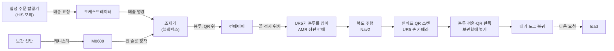
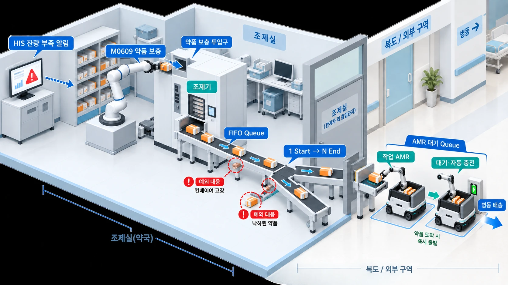

# P3 시나리오 — 병원 약제 전달

- 상태: **팀 확정** (2026-09-16, 4인 합의). 채택 PR: #21. 개정 이력은 [10절](#10-변경-이력).
- 이 문서가 [기획서](p3-project-plan.md)의 시나리오 후보를 대체한다. 충돌하면 이 문서가 우선한다.
  달라진 점은 [9절](#9-기획서와-달라진-점).
- 이 문서는 **무엇을 만드는가**만 정한다. 합격선·반복 수는 [지표 정책](../policy/metrics.md)과 protocol,
  토픽·프레임·이벤트 이름은 [계약](../architecture/README.md), 날짜는 [일정](schedule.md)에서 정한다.
- 실패·예외 시나리오는 별도 문서로 쓴다. **아직 없다.** 이 문서에는 종료 상태의 이름과 정의만 둔다.

## 0. 한눈에

원안의 4단계 구조(보충·출고 준비 → 자율 이송 → 인증·전달 → 복귀·대기)를 유지한다. [4절](#4-단계별-흐름).

### 원안 도판

4인 합의 당시의 개념도다. **기준은 이 문서의 글이고, 그림과 다르면 글이 맞다.** 그림이 글과 다른 곳:

| 그림 | 확정 |
| --- | --- |
| 벨트 위에 상자가 여러 개 줄지어 있다 | 벨트 위 봉투는 한 번에 1개. 앞 봉투가 집힌 뒤 다음을 배출한다. 누적 대기열은 보류 — [단계 1](#단계-1-약품-보충-및-출고-준비-조제실), [8절](#8-범위-밖보류미정) |
| 컨베이어가 두 갈래 | 벨트 하나에 적재 위치 하나 |
| 예외 대응(컨베이어 고장, 낙하한 약품) | 별도 예외 문서로 미룸. 미작성 — [8절](#8-범위-밖보류미정) |

그림과 같은 것: 벨트 끝에서 AMR의 팔이 봉투를 집는다. 적재 위치와 대기 열은 조제실 문 밖 복도 쪽이고, AMR은 관계자 외 출입금지 구역인 조제실에 들어가지 않는다.

## 1. 구성

### 장소와 장치

| 구역 | 장치 | 역할 |
| --- | --- | --- |
| 조제실 | 보관 선반 | 캐니스터 보관. 여러 단·여러 칸이고 칸 위치는 고정. 레일 위 M0609가 집는다 |
| 조제실 | 조제기 | 블랙박스. 배송 요청을 받아 봉투를 QR 면이 위로 오게 벨트에 떨어뜨린다. 약품당 슬롯 2개. 실제 조제 로직은 범위 밖 |
| 조제실 | 컨베이어 | 조제기에서 적재 위치까지. 벨트 위 봉투는 **한 번에 1개**. 끝 정지 위치 센서로 봉투가 서면 벨트를 멈춘다 |
| 조제실 문 밖(복도 쪽) | 적재 위치 | 컨베이어 끝. 벨트가 조제실 벽을 지나 복도 쪽으로 나온다. 대기 열 맨 앞 AMR이 도킹하고 UR5가 벨트 끝 정지 위치에서 봉투를 집는 자리 1개. AMR은 조제실 안에 들어가지 않는다 |
| 조제실 문 밖(복도 쪽) | 대기 도크 5개 | 복귀·대기 자리. 도킹이 곧 충전. 충전기도 5개라 충전 대기 큐는 생기지 않는다 |
| 복도·외부 구역 | 보행자, 의료기기 | 동적 장애물. 로봇 이동 영역은 [단계 2](#단계-2-자율-이송-조제실--병동) |
| 병동 | 병실, 침상, 침상 보관함 | 침상마다 환자 인식표 QR. 보관함은 위가 열린 칸 |
| 병동 | 병동 스테이션, 스테이션 보관함 | 스테이션 인식표 QR. 묶음 배송(병동)의 목적지 |

### 로봇과 센서

| 로봇 | 위치 | 하는 것 | 센서 |
| --- | --- | --- | --- |
| M0609 | 조제실, 2축 레일(x·y) 위 | 레일로 선반 칸 앞에 가서 캐니스터를 집고, 조제기 투입구 앞으로 가서 빈 슬롯에 장착 | 없음. 선반 칸·슬롯·레일 정지 위치는 고정 좌표 |
| Ridgeback_UR5 | 이동 | 벨트 끝에서 봉투를 집어 상판 칸에 적재, 주행, 인식표 스캔, 봉투를 보관함에 놓기 | 베이스 라이다, 베이스 전방 카메라(사람 인식), UR5 손 카메라(QR·봉투) |

- 상정 규모는 Ridgeback_UR5 **5대**, 조제실 앞 대기 열 5자리. 시뮬에 실제로 띄우는 대수는
  [일정](schedule.md) D5 판정에서 정한다. 대기 열·배차 논리는 2대로 검증된다.
- 로봇 교체(Nova Carter → Ridgeback_UR5)의 비용은 미확정이다. [8절](#8-범위-밖보류미정).
- M0609 는 바닥 고정이 아니라 **2축 레일 위**에 둔다(2026-09-17 재범 결정, [10절](#10-변경-이력)). 선반 전체와 조제기 투입구를 팔 하나로 다루기 위해서다.
  고정 팔로는 이 범위에 닿지 않는다는 도달 범위 계산은 아직 없다(미확인). 레일 행정·선반 크기 같은 수치는 시뮬 배치 인자이고 이 문서에서 정하지 않는다.

### 호스트

| 호스트 | 실행 |
| --- | --- |
| 마스터 1 | Isaac Sim: 병원 씬, 로봇, 컨베이어, 센서, `/clock`, 리셋 |
| 마스터 2 | YOLO(봉투·사람), QR 디코더, 오케스트레이터, 상태 GUI, 메트릭 |
| 개인 노트북 | 제어·Nav2 개발. 실제 배치는 부하 측정 후 정한다 — [셋업](../setup/README.md) |

### 시뮬 자산 후보

D1 자산 표([기획서 3.1](p3-project-plan.md#31-씬에셋-후보))에 더해 확인할 것. 존재·호환이 확인됐다는 뜻이 아니다.

| 후보 | 확인할 것 |
| --- | --- |
| `Isaac/Robots/Clearpath/` Ridgeback + UR5 | 5.1 설치본에 있는지. 베이스는 바퀴 물리가 아니라 dummy prismatic x·y, revolute z 조인트 속도 제어다. 라이다·odom·ROS2 그래프는 직접 붙인다 |
| [`isaacsim.asset.gen.conveyor`](https://docs.isaacsim.omniverse.nvidia.com/5.1.0/py/source/extensions/isaacsim.asset.gen.conveyor/docs/index.html) | 강체에 표면 속도를 주는 방식. 봉투가 벨트 위를 미끄러져 끝 정지 위치에 서는 물리와 정지 센서. 9/18 결정: 병원 씬 이식에서는 우리 벨트(xform 몸체)를 쓰고 씬의 벨트는 끈다(#215 코멘트) |
| 얇은 강체 상자 + QR 텍스처 | 봉투. UR5 손 카메라 거리에서 QR이 읽히는 해상도 |
| Replicator | 봉투 YOLO 학습용 합성 데이터 |

## 2. 물품과 단위

| 이름 | 무엇 | 시뮬 물리 | 데이터 |
| --- | --- | --- | --- |
| 캐니스터 | 보충 단위. 약품 1종이 든 통 | 상자 1개 | 약품 ID, 로트 ID, 유통기한, 수량 |
| 봉투 | **최소 배송 단위.** 알약이 든 봉투 1개, 윗면에 QR | 얇은 강체 상자 1개. QR은 윗면 텍스처 | 주문 ID(QR 내용), 약품 ID |
| 상판 칸 | AMR 상판에 고정된 봉투 자리. 칸 N개, N은 설정값(상정 5). 봉투 1개씩, QR 위 | AMR에 고정된 위가 열린 칸. 옮겨 다니는 물체가 아니다 | 칸별 주문 ID |
| 보관함 | 침상·스테이션의 목적지 | 위가 열린 칸 | 잠금 상태. 이벤트만, 물리 잠금 없음 |
| 인식표 | 환자·스테이션 QR | 텍스처 | 환자 ID 또는 스테이션 ID |

- 알약 낱개는 물리로 다루지 않는다. 보충은 캐니스터 단위, 배출은 봉투 단위다.
- 조제실에 트레이는 없다. 1인·긴급은 봉투 1개, 묶음은 봉투 N개를 벨트 끝에서 하나씩 집어 상판 칸에 놓는다.
- QR 이미지는 합성 주문 풀의 주문 ID별로 미리 만들어 두고, 조제기가 봉투를 스폰할 때 그 주문의 이미지를 붙인다.
  판독은 마스터 2의 OpenCV QR 디코더.
- 차량 쪽 잠금 장치는 없다. 봉투는 상판 칸에 놓인 채 이동한다.

## 3. 배송 유형

| 유형 | 봉투 수 | 목적지 | 인증 태그 | 조제기 큐 | 알람 |
| --- | --- | --- | --- | --- | --- |
| 1인 배송 | 봉투 1 | 환자 침상 | 환자 QR | FIFO | 없음 |
| 긴급 배송 | 봉투 1 | 환자 침상 | 환자 QR | 배출 큐 맨 앞 선점 | 도착 직전 ARRIVING 이벤트 |
| 묶음 배송(병실) | 봉투 N, 같은 병실 | 침상 순회 | 침상마다 환자 QR | FIFO | 없음 |
| 묶음 배송(병동) | 봉투 N, 다른 병실 | 스테이션 보관함 | 스테이션 QR | FIFO | 없음 |

- 유형은 요청한 사용자가 고른다. 시뮬에서는 합성 주문 발행기의 `mode` 필드다. 간호사 화면은 만들지 않는다.
- 원안 명칭 "묶음 예약 배송"의 예약 시각은 아직 모델링하지 않는다 — [8절](#8-범위-밖보류미정).
- 긴급이 FIFO를 끊는 자리는 **조제기 배출 큐의 요청 사이**뿐이다. 배출 중인 요청의 봉투, 벨트 위 봉투, 진행 중인 트립은 건드리지 않는다.
- 요청 1개 = 트립 1개. 요청의 봉투를 모두 실은 뒤 출발한다. 요청 안의 주문(봉투)마다 종료 상태를 따로 기록한다 — [5절](#5-종료-상태).

## 4. 단계별 흐름

### 단계 1. 약품 보충 및 출고 준비 (조제실)

**배송 요청.** 합성 주문 발행기(HIS 모의)가 요청을 낸다. 요청 = 요청 ID, 유형, 목적지(침상·병실·스테이션), 주문 목록.
주문 = 주문 ID, 환자 ID, 약품 ID. 중복 ID, 알 수 없는 목적지, 빈 주문 목록은 거부한다. 수락 이벤트에서 cycle_time이 시작된다.

**배차.** 대기 열 맨 앞 AMR이 적재 위치로 이동해 도킹한다. 배차 순서는 대기 도크 복귀 순서다. 배터리 모델은 없다.
적재 위치의 AMR에는 조제기가 다음에 배출하는 요청이 배정된다.

**배출.** 세 조건이 모두 참일 때만 봉투 1개를 배출한다: 벨트가 비어 있다, 적재 위치에 AMR이 도킹 완료됐다, 배정된 요청에 아직 안 나간 주문이 있다.
요청 순서는 FIFO, 긴급 요청은 큐 맨 앞. 한 요청의 봉투는 연속으로 나가고, 긴급은 요청 사이에서만 끼어든다.
조제기는 주문마다 봉투 1개를 QR 면이 위로 오게 벨트에 떨어뜨린다. 벨트 위 위치·yaw는 설정 범위에서 무작위이고 범위는 설정값으로 기록한다.
벨트 위 봉투는 한 번에 1개다. 앞 봉투가 집힌 뒤 다음 봉투를 배출한다.

**픽.** 봉투가 벨트 끝 정지 위치에 서면 벨트가 멈추고, 도킹한 AMR의 UR5가 손 카메라로 봉투를 검출하고 QR을 읽어 배정된 요청의 주문인지 확인한 뒤
집어서 상판 칸에 놓는다. 픽 허가 조건은 벨트 정지, 봉투 정지, AMR 도킹 완료 셋이다. 적재 위치는 조제실 문 밖 복도 쪽이다.
원안의 "허용 가능 높이"는 도킹 자세에서 UR5가 벨트 끝에 닿는 높이라는 뜻이다. 적재 완료는 상판 칸 안착 이벤트로 판정하고 평가용 실제 상태 관측과 분리한다.
요청의 봉투를 모두 실으면 즉시 출발한다.

**재고와 보충.** 조제기 슬롯은 약품당 2개(A, B). 슬롯 하나 = 캐니스터 하나 = 로트 ID, 유통기한, 수량.

- 배출은 유통기한이 빠른 로트부터 한다(FEFO). 수량이 0이 된 슬롯은 빈 슬롯이다.
- 활성 슬롯 수량이 임계값 이하이고 다른 슬롯이 비어 있으면 보충 요청 이벤트를 낸다. 임계값은 설정값이다.
  원안의 "HIS 잔량 부족 알림"은 이 이벤트로 구현한다.
- M0609는 유휴면 즉시 실행한다: 레일로 선반의 해당 칸 앞에 가서 약품 캐니스터를 집고, 레일로 조제기 앞에 가서 빈 슬롯(원안의 투입구)에 장착한다. 장착 완료 이벤트에 로트 데이터가 등록된다.
- 두 슬롯이 다 비면 조제기는 그 약품의 배출을 멈추고 정지 이벤트를 낸다. 보충 완료 후 재개한다.
- 보충은 "추가"이지 "교체"가 아니므로 남은 약이 버려지지 않는다. 로트·유통기한은 조제기 블랙박스의 데이터로만 다룬다.
  물리로는 캐니스터 상자 하나다.

### 단계 2. 자율 이송 (조제실 → 병동)

- 맵은 Isaac occupancy map 생성기로 씬에서 뽑는다. 주행 중 위치 추정은 AMCL, 계획·제어는 Nav2. SLAM은 쓰지 않는다.
- 이동 1단계: 라이다 기반으로 보행자·의료기기를 피해 목적지까지 간다.
- 이동 2단계: 복도에 로봇 이동 영역을 두어 보행자를 방해하지 않는다. Nav2 costmap의 keepout·speed 필터 마스크로 구현한다.
  새 플래너는 만들지 않는다.
- 사람 인식: 베이스 전방 카메라와 YOLO. 사람이 있다는 사실만 기록한다. 동작은 바꾸지 않는다.
- 긴급 배송은 도착 직전에 ARRIVING 이벤트를 낸다. 알람 화면은 마스터 2 상태 GUI다.
- 목적지의 지정 좌표에 도착해 정차한다. 묶음(병실)은 침상을 순서대로 방문한다.
- 층간 이동(엘리베이터 연동)은 원안의 (선택) 항목이며 **보류**다.

### 단계 3. 인증 및 약제 전달 (병실·스테이션)

1. UR5가 침상(또는 스테이션) 인식표에 손 카메라(eye-in-hand)를 대고 QR을 판독한다.
2. 판독한 ID를 오케스트레이터의 요청 데이터와 대조한다.
3. 일치하면 상판 칸을 내려다보고 YOLO로 봉투를 검출하고, 봉투마다 QR을 판독해 이 침상의 주문에 해당하는 봉투를 고른다.
   봉투 QR과 환자 QR의 주문이 같아야 한다. 이것이 검수다.
4. 그 봉투를 집어 보관함의 열린 칸에 놓는다. 놓기 완료 후 보관함 잠금 이벤트를 낸다. 물리 잠금은 없다.
5. 주문의 전달 완료 로그를 발행한다. 상태 토픽으로 나가고 마스터 2 GUI가 보여 준다. 간호사용 열람 시스템은 만들지 않는다.

- 묶음(병실): 침상마다 1-5를 반복한다.
- 묶음(병동): 스테이션 QR로 1-2를 한 번 하고, 상판의 봉투를 하나씩 스테이션 보관함에 놓으며 주문마다 로그를 낸다.
  파지 유형은 벨트 끝이든 침상이든 봉투 하나다.
- 1인·긴급: 봉투 1개.
- 불일치·미검출·타임아웃 시의 동작은 예외 문서에서 정한다. 이 문서는 그 결과가 [5절](#5-종료-상태)의 어느 상태로 끝나는지만 정한다.

### 단계 4. 복귀 및 대기

- 요청의 주문이 모두 종료 상태가 되면 조제실 문 밖 대기 도크로 복귀한다. 도킹이 곧 충전이다. 다음 요청을 기다린다.
- 실행 사이 리셋 범위: 조제기 슬롯 재고·로트, 벨트 위 봉투, AMR 상판 칸의 봉투, 침상·스테이션 보관함 내용물, 인식표 배치,
  AMR 위치와 대기 열 순서, 요청 큐, 인식·TF 캐시, epoch. 순서와 barrier는 [계약](../architecture/README.md)의 reset 규칙을 따른다.
- 순간 이동·리스폰은 리셋이며 처리량에 넣지 않는다.

## 5. 종료 상태

단위는 **주문(봉투)** 이다. 트립(요청)은 주문 상태의 집계다.

| 상태 | 정의 |
| --- | --- |
| `SUCCESS` | 평가기가 그 봉투 ID를 목적지 보관함 안에서 관측 |
| `HOLD_RETURN` | 인증 불일치나 미검출로 봉투가 상판 칸에 남은 채 조제실 복귀. 재배차 가능 |
| `ABORT` | 봉투 낙하·이탈 등으로 주문 종료. 재배차 불가 |
| `TIMEOUT` | protocol 제한 시간 초과. 봉투 위치는 별도 기록 |

- 제어기의 잠금 완료 로그는 `SUCCESS`의 근거가 아니다. 성공 판정은 평가 전용 관측 경로가 낸다.
- 트립 성공 = 요청의 모든 주문이 `SUCCESS`. 부분 배송은 성공에 합산하지 않는다.
- 어떤 조건이 어느 상태로 가는지는 예외 문서에서 정한다.

## 6. 측정 연결

| 지표 | 시작 | 종료 | 비고 |
| --- | --- | --- | --- |
| cycle_time(주문) | 요청 수락 이벤트 | 그 주문의 보관함 잠금 이벤트 | 묶음은 주문마다 따로 |
| trip_time(요청) | 요청 수락 이벤트 | 대기 도크 복귀 이벤트 | cycle_time과 합치지 않음 |
| 보충 루프 | 보충 요청 이벤트 | 장착 완료 이벤트 | cycle_time에 넣지 않음 |
| 조제기 정지 | 정지 이벤트 | 재개 이벤트 | 따로 기록 |
| 검수 | 벨트 끝: 봉투 QR과 배정 요청 대조. 침상: 봉투 QR과 환자 QR 대조 | 독립 정답과 confusion matrix | 지표 정책의 inspection. 두 곳을 따로 센다 |
| 파지(적재) | 벨트 끝 픽 시도 | 상판 칸 안착 | 첫 시도와 재시도 분리 |
| 파지(전달) | 상판 칸 픽 시도 | 보관함 칸 안착 | 첫 시도와 재시도 분리 |

정의·분모·합격선은 [지표 정책](../policy/metrics.md)과 D6 frozen protocol에서 확정한다. 이 표는 이벤트 이름 후보다.

## 7. 이 시나리오가 요구하는 계약 항목

계약은 `docs/architecture/`에 [계약 템플릿](../templates/contract.md)으로 쓴다. 아래는 후보 이름이며 계약에서 확정한다.
파일로 옮긴 초안은 [src/rokey_p3_interfaces](../../src/rokey_p3_interfaces/README.md).

| 종류 | 후보 |
| --- | --- |
| 요청·주문 필드 | `request_id`, `mode` (single, urgent, batch_room, batch_ward), `destination_id`, `orders[]`: `order_id`, `patient_id`, `item_id` |
| 조제기 이벤트 | `DISPENSED`, `DISPENSER_PAUSED`, `DISPENSER_RESUMED`, `REFILL_REQUESTED`, `REFILL_DONE` |
| 적재·주행 | `AMR_DOCKED_LOAD`, `POUCH_AT_END`, `POUCH_PICKED`, `POUCH_LOADED`, `LOAD_DONE`, `DEPARTED`, `ARRIVING`, `ARRIVED` |
| 전달 | `AUTH_OK`, `AUTH_FAIL`, `POUCH_DETECTED`, `POUCH_PLACED`, `CABINET_LOCKED`, `ORDER_DONE` |
| 복귀 | `RETURNED`, `DOCKED` |
| M0609 레일 | 레일 관절 상태와 명령. 시뮬 쪽 제안 이름은 `/m0609/rail/joint_states`, `/m0609/rail/joint_command`. 계약 v1 에 없다. 넣을지 미결정 — [8절](#8-범위-밖보류미정) |
| 네임스페이스·구역 | `amr_1`-`amr_5`, `m0609`. 구역 `pharm`, `load`, `dock_1`-`dock_5`, `ward_a`, `station_a`, `bed_a1`… |
| 설정값 | 보충 임계값, 상판 칸 수 N, 벨트 위 봉투 무작위 범위, 벨트 속도, 재시도 횟수, 타임아웃, ARRIVING 발행 시점(거리 또는 시간), 사람 인식 카메라 주기 |

## 8. 범위 밖·보류·미정

| 항목 | 상태 |
| --- | --- |
| 실패·예외 시나리오(인증 실패, 컨베이어 고장, 낙하 봉투, 통신 두절 등) | 별도 문서. **미작성** |
| 벨트 위 봉투 누적(FIFO 대기열) | 보류. G1은 한 번에 1개, 누적은 G2 이후 검토 |
| 층간 이동(엘리베이터) | 보류 |
| 로봇 교체 비용(Nova Carter → Ridgeback_UR5) | 미확정 |
| 시뮬에 띄우는 AMR 대수 | D5 판정 |
| 배터리 모델, 충전 대기 큐 | 없음 |
| 간호사 열람·주문 화면 | 없음. 합성 주문 발행기와 마스터 2 상태 GUI로 갈음 |
| 봉투 YOLO 학습 데이터(Replicator 합성) 담당·날짜 | 미정 |
| 묶음 배송의 예약 시각 처리 | 미정. 지금은 발행기가 요청을 내는 시점에 바로 처리 |
| Isaac 5.1 설치본의 Ridgeback UR5 자산 | 미확인 |
| M0609 레일 토픽을 계약에 넣을지, 레일 이동을 `/m0609/refill` 안에서 할지 | 미결정 |
| 고정 M0609 로 선반·투입구에 닿는지(레일 필요성의 도달 범위 근거) | 미확인 |
| 실제 조제·투약·환자 데이터 | 범위 밖 — [기획서 2절](p3-project-plan.md#2-목적과-범위) |

## 9. 기획서와 달라진 점

| 항목 | 기획서 | 이 문서 |
| --- | --- | --- |
| AMR | Nova Carter 2대 | Ridgeback_UR5. 상정 5대, 시뮬 대수는 D5 판정 |
| 적재 | M0609가 AMR에 적재 | 조제기 → 컨베이어 → 벨트 끝에서 UR5가 집어 상판 칸에. M0609는 조제기 보충 |
| 병동 인계 | 인계 모델 미정 | UR5가 보관함 칸에 봉투를 놓는다 |
| 검수 | AprilTag 후보 | 환자·스테이션·봉투 QR + YOLO 봉투 검출 |
| 배송 유형 | 1주문 1병동 | 1인, 긴급, 묶음(병실·병동) |
| 보행자 | G2 동적 장애물 | 이동 1단계 회피, 2단계 이동 영역, 사람 인식 기록 |
| 맵 | 미정 | Isaac occupancy map 생성기 + AMCL |

## 10. 변경 이력

| 날짜 | 내용 | PR |
| --- | --- | --- |
| 2026-09-16 | 4인 합의 시나리오 확정 | #21 |
| 2026-09-16 | 원안 도판 추가, 적재 위치를 조제실 문 밖으로 정정 | #22 |
| 2026-09-16 | 조제실 트레이 제거. 조제기가 봉투를 QR 위로 벨트에 직접 배출, 벨트 끝에서 Ridgeback_UR5가 집어 상판 칸에 적재 | #23 |
| 2026-09-17 | M0609 를 조제실 고정에서 2축 레일 위로(재범 결정, 문서 반영 제안). 레일 토픽의 계약 반영은 미결정 | #101 |
| 2026-09-18 | 병원 씬 이식 결정(재범): M0609 기준 우선 설계(씬 M0617 끔), 조제실 원점 A `0.25 13.3 0 0`, 우리 벨트(씬 벨트 끔), `/clock` 은 우리 스테이지 하나. 이 절 밖의 본문(2축 레일, 약통, 마스터 배치)은 아직 고치지 않았다 | #215 코멘트 |
| 2026-09-24 | **as-built 대조 13건**(아래 10.1). 본문은 소급해 고치지 않는다. 각 행은 확정 문서 값이다. 다음은 as-built 값이다. 다음은 결정 출처다. 다음은 회차다. 출처는 [설계 갭 점검](../analysis/2026-09-24-jaebeom-architecture-gap-review.md) P0-5 · 4.5절이다 | 이 PR |

### 10.1 9/24 as-built 대조

기준 main `8caa155`. 행 번호는 이 파일(scenario.md) 기준이다. 다른 문서면 경로를 적었다. "결정 기록 없음" 은 찾지 못했다는 뜻이다. 결정은 재범이 한다.
ADR 0003–0006 은 아직 없다. [설계 갭 점검](../analysis/2026-09-24-jaebeom-architecture-gap-review.md) P0-4 의 예정 번호다. "재범 결정" 칸의 댓글은 재범 결정을 이슈에 옮겨 적은 것이다.

| # | 항목 | 확정 문서 값 | as-built 값(9/24) | 결정 출처 | 회차 |
| ---: | --- | --- | --- | --- | --- |
| 1 | 레일 축 | 2축 레일(x·y) — 62·68행 | 3축 `rail_x`·`rail_y`·`rail_z` — `sim/standalone/pharmacy_stage.py` 58행, `m0609_arm_node.py` 218행 | 결정 기록 없음. 도입 PR #170 · #180 · #183. 9/17 결정(#101)은 2축뿐이다 | #240 5795627672 |
| 2 | AMR 대수 · 동결 시점 | 상정은 5대다. 시뮬 대수는 D5 판정이다. D6 는 frozen protocol 이다. 65–66·210·236행이다. | 기본은 1대다. 부하 측정은 1–4대다(`tools/demo_v2.sh` 47·127행). 촬영은 합본 2대(배송 1 + 대기 1). 병동 acceptance protocol 은 `proposed`(미동결) | #576 5795950859 ②, #576 5801973227(촬영 2대 판정 확정). acceptance 동결 결정은 없음 | #240 5802664758 |
| 3 | 레일 토픽 계약 반영 | 계약 v1 에 넣을지 미결정 — 224·242행 | 계약 밖. 레일은 `/m0609/refill` 안에 둔다(`sim/README.md` 1037행, `m0609_arm_node.py` 31–32행) | #101 5723429576(재범 9/18), 구현 PR #154 | #240 5795175482 |
| 4 | 도크 · 충전 | 대기 도크는 5개다. 도킹이 곧 충전이다. 53·225행이다. | 병원 도크 4개(`zones.hospital.yaml` `dock_1`–`dock_4`, 14행 "사람 결정 전 기본값"). 충전 모델 없음 | 결정 기록 없음(도크 4 는 씬 창구 A1–A4 에서) | #240 5807102321 |
| 5 | 벨트 출처 | 우리 벨트다. 씬 벨트는 끔이다(#215). 86·266행이다. | 씬 컨베이어, A1 끝 롤러(`sim/standalone/p3sim/hospital_conveyor.py` 1–4행). 우리 벨트는 만들지 않는다 | #527 5790278911 ③(#215 5728694347 대체). ADR 0006 예정 | #240 5795627672 |
| 6 | 인증 방식 | UR5 손 카메라로 인식표 QR 이다. YOLO 봉투 검출이다. 19·63·135·163–166행이다. | 참값 센서 v0(`scan_tag_source: sim`, `pouch_source:=sim`). 카메라 인증 · 집기는 v1 옵션(`docs/architecture/k5-delivery-interface.md` 5행) | #576 5795950859 ①, #576 5807716915 ②. ADR 0004 예정 | #240 5807102321 |
| 7 | 묶음(병동) | 유형 넷 중 하나다. 스테이션 QR 1회 + 봉투 N개다. 113·171행이다. | 코드 경로만(`trip_fsm.py` `batch_ward`). 병원 주문 풀에 묶음(병동) 주문 없음. `schedule.md` 92행 C 등급 | 결정 기록 없음 | 회차 없음 |
| 8 | 빈월드 범위 | (scenario.md 밖) `integration-resource-two-phase-plan.md` 120행은 "픽·적재까지만" 이다. 같은 문서 0절은 "한 바퀴" 다. | 요청 → 복귀 한 바퀴(`zones.emptyworld.yaml`, `routes.emptyworld.yaml`) | #239 5754740667(재범 결정) | #240 5789784385 |
| 9 | 호스트 배치 | 마스터1 은 Isaac 이다. 마스터2 는 YOLO · QR · 오케스트레이터 · GUI 다. 75–76행이다. | 한 PC 기본. 두 대는 `P3_ROLES`(stage=master01, 나머지=master02)(`docs/runbooks/hospital-demo.md` 184–185행) | #576 5797408402 ⑤, #602 본문(재범 요청 9/23). ADR 0005 예정 | #240 5797973069 |
| 10 | 도메인 번호 | (scenario.md 에 값 없음) `schedule.md` 는 115/117 이다. 계획서는 117/118/119/120 이다. | 런북은 `P3_DOMAIN` 으로 받는다(값 고정 없음). 실제 회차는 121 · 131 | #239 5754740667(결정 43), #576 5807716915 ⑤(웹 118 삭제) | #240 5797973069 |
| 11 | 간호사 화면 | 만들지 않는다 — 115·168·238행 | 있다. `web/frontend/nurse.html`(PR #564, 요청 `postRequest`) | 결정 기록 없음(#576 5797408402 계획표 카드로만) | #240 5807102321 |
| 12 | hospital-v2 상태 | (scenario.md 밖) "병원 L3 미확인" 이다. "한 번도 안 돎" 이다. | preset 은 남아 있다. 병원 경로는 `--preset hospital` 로 바뀌었다. hospital-v2 는 9/21 RC-4 병원 씬 smoke 로 한 번 돌았다 | #527 5790278911 ③(씬 컨베이어 채택으로 대체). ADR 0006 예정 | #240 5755586172 |
| 13 | 기획안 미개정 | scenario.md 9절은 Ridgeback_UR5 · QR 이다. `p3-project-plan.md` 86·90·140행은 Nova Carter · AprilTag 그대로다. | AMR 은 합본 Ridgeback_UR5, 인식은 QR. 코드에 AprilTag · Nova 0건 | 시나리오 확정 PR #21 9절. 기획서 본문 개정 PR 없음 | #240 5807102321 |
