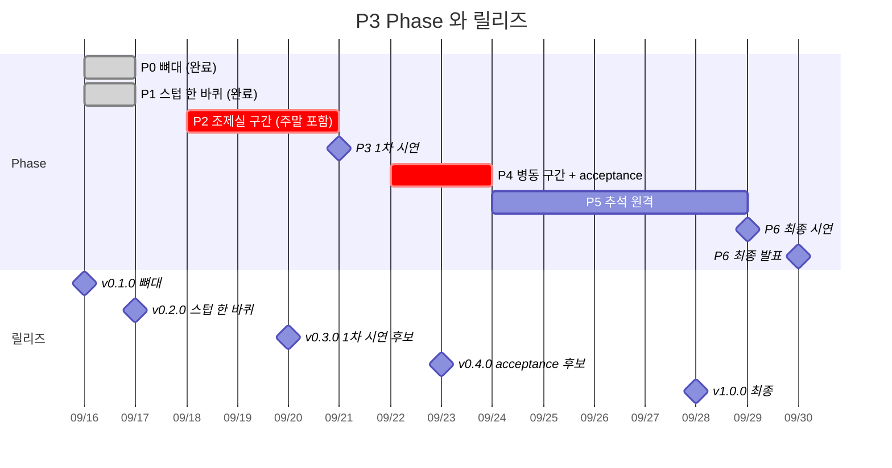
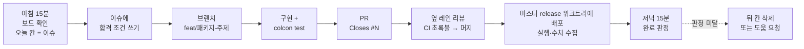

# 일정

**1차 시연 9/21 (월), 최종 시연 9/29 (화), 최종 발표 9/30 (수). 9/24 (목)부터 9/28 (월)까지 추석.**

교육장 근무일은 9/16, 17, 18, 22, 23 다섯 날이다. 주말과 추석에도 **원격으로 일한다**.
마스터 PC 는 켜 둔 채 Tailscale 로 SSH 하고, 코드는 노트북에서 Git 으로 올린다. 방법은 아래 [휴일·원격 작업 규칙](#휴일원격-작업-규칙).

일정은 **Phase** 로 나누고 Phase 가 끝날 때마다 **릴리즈 태그**를 찍는다. 시연과 배포는 태그로만 한다.
날짜를 `D1`-`D8` 로도 센다(`D1` = 9/15). 무엇을 만드는지는 [시나리오](scenario.md)가 확정 문서이고, 이 일정은 그 항목을 어느 Phase 에 넣는지만 정한다.

## 담당

팀장이 정한 배정이다. 작업 볼륨이 큰 자리에는 주 담당과 부 담당이 같이 있다.
단독 영역과 공용 패키지 규칙은 [Git 가이드의 담당 표](../process/git-start-guide.md#담당-다섯-자리--내-폴더만-고친다).

| 담당 | 주 | 부 | 맡는 것 |
| --- | --- | --- | --- |
| **simulation** | 박세준 (`dev04`) | 이태규 (`dev03`) | Isaac 월드맵 구성, 자산 조사, standalone 로드 파일(씬 + ROS 브릿지 + 리셋) |
| **manipulation** (+perception) | 전제환 (`dev02`, 팀장) | 임재범 (`dev01`) | 1차: M0609 약재 보충 pick & place, UR5 QR 스캔 동작, UR5 약재 적재 pick & place. 2차: 병실·환자 정보 스캔, UR5 약재 전달 pick & place. 검출 모델 |
| **navigation** | 이태규 (`dev03`) | — | 1차: 충전 구역 주차(도킹), 맵 생성(yaml·png). 2차: 침상까지(main2person), 스테이션까지(main2nurse) 주행 |
| **orchestration** (+interfaces, bringup, config) | 임재범 (`dev01`) | — | 요청 = 합성 요청 발행기와 `Deliver` 액션. 배차 = 대기 열·적재 위치 배정·픽 허가·출발. 제조 = 조제기 블랙박스(재고·배출·보충 요청) |
| **저장소 관리** | 임재범 (`dev01`) | — | 문서, 검사기, 이슈·보드, 릴리즈 태그, GitHub 설정 |

- 부 담당은 주 담당 패키지에 **PR 을 내고 주 담당이 리뷰**한다. 주 담당이 4시간 안에 못 보면 저장소 관리 담당이 대신 본다.
- 이태규는 두 자리를 맡는다. simulation 몫으로는 **로봇 자산 조립**(Ridgeback UR5 에 라이다·손 카메라·상판 칸 부착)을 가져간다. 로봇 위 센서는 navigation 이 어차피 써야 하는 것이라 한 사람이 끝까지 가져가는 편이 낫다.
- 임재범도 두 자리를 맡는다. orchestration 이 먼저고, manipulation 몫으로는 팔 제어와 떨어진 조각(스텁, Replicator 합성 데이터, YOLO 학습, 검출 데이터)을 가져간다.
- 세준의 simulation 은 **월드맵·조제실 장치·브릿지·리셋**으로 좁힌다. 로봇 자산과 학습 데이터는 위 둘이 맡는다.

## Phase 와 릴리즈

팀장 배정의 **1차 = 조제실 구간**, **2차 = 병동 구간**이다. 1차 시연(9/21)은 조제실 구간만, 최종 시연(9/29)은 병동까지 한 바퀴다.

| Phase | 기간 | 목표 | 끝나면 찍는 태그 | 판정 |
| --- | --- | --- | --- | --- |
| **P0 뼈대** | 9/16 (수) | 인터페이스 v1, 빈 패키지 6개, 담당·일정 문서, 계약 v1, ADR 0001 | `v0.1.0` = 702bc2a | **끝났다** (#21-#34 병합). 태그는 9/17 아침 |
| **P1 스텁 한 바퀴** | 9/16 (수) 저녁 | 모든 액션·서비스 서버가 스텁으로 존재하고, 오케스트레이터가 요청 하나를 스텁만으로 끝까지 돌린다. Isaac 없이 노트북에서 돈다 | `v0.2.0` = 1ce5a02 | **CI 에서 끝났다** (#35, #36, #40, #42, #43). `test_stub_loop.py` 가 요청 1건 `success=true`, 이벤트 21개 순서, run 기록 `SUCCESS` 를 검사한다. 9/17 아침 노트북에서 `ros2 launch rokey_p3_bringup stub_loop.launch.py` 를 사람이 한 번 돌리고 태그 |
| **P2 조제실 구간 (1차)** | 9/18 (금) - 9/20 (일) | 요청 → 조제기 배출 → 벨트 끝에서 UR5 가 QR 스캔·픽 → 상판 칸 적재 → AMR 이 적재 위치에서 충전 도크로 복귀 → 리셋. M0609 보충 pick & place. 맵 yaml·png | `v0.3.0` (9/20 저녁, 1차 시연 후보) | Isaac 에서 조제실 구간이 한 번 돌고 리셋 후 다시 돈다. M0609 보충 1회. run 기록 있음 |
| **P3 1차 시연** | 9/21 (월) | `v0.3.0` 으로 리허설·시연. 저녁 회고 | 핫픽스만 `v0.3.x` | 시연 완료. 회고에서 2차 범위(아래 B+)와 AMR 대수 결정 |
| **P4 병동 구간 (2차)** | 9/22 (화) - 9/23 (수) | 침상·스테이션까지 주행(main2person, main2nurse), 병실·환자 QR 스캔, UR5 약재 전달 pick & place → **전체 한 바퀴**. acceptance protocol 동결, 첫 묶음 실행 | `v0.4.0` (9/23 저녁, acceptance 후보) | 요청부터 보관함 잠금·복귀·리셋까지 한 바퀴. protocol `frozen` 병합. `v0.4.0` 으로 acceptance 첫 묶음 |
| **P5 추석 원격** | 9/24 (목) - 9/28 (월) | acceptance 반복(원격), 버그 수정 PR, 회고에서 고른 B+ 항목, 영상·리포트·발표 자료 | `v1.0.0` (9/28 18:00 까지) | 9/28 저녁 원격 리허설 통과. 이후 코드는 시연에 안 들어간다 |
| **P6 최종** | 9/29 (화) 시연, 9/30 (수) 발표 | `v1.0.0` 으로 리허설·시연·발표 | 없음 | 시연 = 태그, 발표 자료 = 태그의 run 수치 |
| **P7 운영 환경 최적화** | P6 완료 후, 착수일 미정 | [옵션 A 안정형 / 옵션 B 고도화형](two-master-final-stage-plan.md). 구현 미착수 | 선택안 검증 후 결정 | A: 현행 배치·유선 DDS 유지와 반복·수동 복구. B: 역할 분리·Zenoh·headless·Docker·자동 복구 비교 검증 |

**P6 이후 마지막 단계:** [P7 마스터 PC 운영의 두 옵션](two-master-final-stage-plan.md)을 후속 계획에 둔다. 기본 착수는 9/30 발표 완료 뒤이며, 기준 실행·롤백·장비 사용 기간 확보가 먼저다. 옵션 A는 검증된 배치·네이티브 실행·유선 DDS·수동 복구를 유지하는 안정형(집중 1-2일), 옵션 B는 Master 02=Isaac / Master 01=ROS 제어·빌드·관제와 Zenoh·headless·Docker·자동 복구를 검증하는 고도화형(집중 5-6일)이다. 두 옵션 중 선택하며 A 완료만으로 P7을 닫을 수 있다. 계획상 기본 권고는 A, 최종 선택·착수일은 미정이다. 현재 슬롯·네트워크 정책·시연 태그에는 적용하지 않는다.

Phase 는 겹치지 않는다. 앞 Phase 판정이 안 서면 다음 Phase 를 시작하지 않고 그 자리에서 범위를 줄인다.

찍힌 patch 태그(9/18 기준): `v0.2.1`(`cfa4932`, "빈 월드 조제실 한 바퀴", 9/17), `v0.2.2`(`e558ee2`, "레일 보충·장면 v2", 9/18). 위 Phase 표와 gantt 에 넣을지는 정하지 않았다.

## 릴리즈 규칙

- **태그 이름** `v<major>.<minor>.<patch>`. Phase 끝은 minor 를 올리고, 시연 전 핫픽스는 patch 를 올린다(`v0.3.1`). `latest`, `final2` 같은 이름은 [naming.md](../process/naming.md)대로 쓰지 않는다.
- **태그는 저장소 관리 담당이 `main` 에서 찍는다.** Phase 판정이 선 커밋에 `git tag -a v0.2.0 -m "P1 스텁 한 바퀴"` 후 `git push origin v0.2.0`. 브랜치에는 찍지 않는다.
- **GitHub Release** 를 태그마다 만든다. 본문은 셋만: 포함된 PR 목록, 판정 근거 run ID, 알려진 문제. 원본 로그·영상은 넣지 않는다([evidence](../../evidence/README.md)).
- **마스터 배포는 태그로만.** `git worktree add ../release/v0.3.0 v0.3.0` 처럼 태그 이름 폴더를 만들고 거기서 빌드한다 — [Git 가이드 워크트리 절](../process/git-start-guide.md#워크트리--마스터의-배포-폴더에는-쓴다). 배포 기록에 태그와 SHA 를 같이 적는다.
- **롤백은 이전 태그 폴더를 source** 하는 것이다. 시연 당일에는 태그를 새로 찍지 않는다.
- 태그를 찍은 뒤 발견한 버그는 PR → `main` 병합 → patch 태그. 태그를 옮기거나 지우지 않는다.

## 우선순위 — 무엇이 어느 시연에 들어가나

등급 이름은 A, B, B+, C 다. Phase 번호(P0-P7)와 헷갈리지 않게 문자로 쓴다.

| 등급 | 내용 | 들어가는 곳 |
| --- | --- | --- |
| **A 조제실 구간** | 요청 발행, 조제기 배출, 벨트 끝 UR5 QR 스캔·픽·상판 적재, M0609 보충 pick & place, AMR 적재 위치 도킹과 충전 도크 주차, 맵 yaml·png, 리셋. 봉투 검출은 YOLO 또는 색 검출 | **`v0.3.0`, 9/21 1차 시연** |
| **B 병동 구간** | 침상·스테이션까지 주행(main2person, main2nurse), 병실·환자 QR 스캔, UR5 약재 전달, 보관함 잠금 이벤트, 복귀. 전체 한 바퀴 + acceptance 수치 N회 + 시연 영상 | **`v0.4.0`, `v1.0.0`, 9/29 최종 시연** |
| **B+ 확장** | 긴급 선점, 묶음(병실 2-3침상), AMR 2대 대기 열, 보행자 회피 1단계, YOLO 로 교체 | 9/21 저녁 회고에서 고른 것만. 추석 원격 기간에 `v1.0.0` 에 포함 |
| **C** | 묶음(병동 스테이션 하역 논리), 사람 인식 기록, 이동 2단계 keepout 마스크, AMR 5대, 벨트 위 봉투 누적 대기열 | 시간이 남으면. 문서에는 "미구현"으로 적는다. 시나리오 8절의 보류 항목과 같다 |

A 가 9/20 에 안 돌면 B 를 시작하지 않는다. 9/22 는 A 안정화에 쓴다.

## Phase 별 패키지 완료 상태

| 패키지 (담당) | P0 `v0.1.0` (완료) | P1 `v0.2.0` 스텁 | P2 `v0.3.0` 조제실 구간 | P4 `v0.4.0` 병동 구간 |
| --- | --- | --- | --- | --- |
| `rokey_p3_interfaces` (재범) | msg 9, srv 2, action 4 초안 | 스텁 한 바퀴에 필요한 필드 보완. 이후 변경은 공용 파일 절차 | 실물 통합에서 드러난 필드만 추가 | 병동 구간·B+ 에 필요한 필드 |
| `rokey_p3_orchestrator` (재범) | 뼈대 노드, 종료 상태 | `Deliver` 상태 머신 v0. 요청 발행기 v0. Event 로거. 조제기 재고 로직(2슬롯·임계값, 데이터). `Dispense` 서버 | 실물 서버 통합. 배출 조건 3개, 픽 허가, 적재 완료 → 복귀. `Refill` 요청. 리셋 barrier. cycle_time 수집기 | 주행·인증·전달 단계 추가. acceptance 집계. B+ 채택 시 긴급·묶음·2대 배차 |
| `rokey_p3_manipulation` (제환, 부 재범) | 뼈대 노드, 픽 허가 함수 | `PickPouch`·`Refill` 액션 서버 **스텁** | **M0609 보충 pick & place. UR5 QR 스캔 동작 + 벨트 끝 픽 → 상판 칸.** Surface Gripper | 병실·환자 QR 스캔 동작. 상판 칸 픽 → 보관함 전달. `HOLD_RETURN` 경로 |
| `rokey_p3_perception` (제환, 부 재범) | 뼈대 노드, QR 파서 | `TagRead`·`PouchDetectionArray` **스텁 발행**. QR 디코더(OpenCV) 실물 | 봉투 검출은 색 검출로 먼저. Replicator 합성 데이터·YOLO 학습은 주말에 재범(master02 슬롯) | 환자·스테이션 QR. YOLO 교체는 B+ |
| `rokey_p3_navigation` (태규) | 뼈대 노드, 구역 ID 규칙 | `GoToZone` 액션 서버 **스텁** | 베이스 구동·odom·TF·라이다. **맵 yaml·png. 충전 도크 주차: dock → load → dock** | **main2person, main2nurse**: load → bed_a1 / station_a → dock. `ARRIVING`. 보행자 회피는 B+ |
| `rokey_p3_bringup` (재범) | skeleton.launch | 스텁 한 바퀴 launch (Isaac 없이) | 조제실 구간 launch. 호스트별 배치 초안(`config/`) | 전체 한 바퀴 launch 고정 |
| `rokey_p3_description`, `sim/` (세준, 부 태규) | USD 씬 1개 | **standalone 로드 파일**(씬 + 브릿지 + `Reset` 스텁). 봉투 자산(강체 상자 + QR 텍스처) | **월드맵**: 조제실·복도·충전 도크. 조제기 스폰, 컨베이어, 끝 정지 센서, `Reset` 실물. 로봇 자산 조립(라이다·손 카메라·상판 칸)은 태규 | 병실·침상·보관함·스테이션, 환자 QR. 보행자·AMR 2대 스폰은 B+ |
| 문서·evidence (재범) | 시나리오, 담당제, 일정 | 계약 문서 초안(토픽·프레임·시간) | pilot protocol `proposed`, 첫 run 파일 | acceptance protocol `frozen`, 예외 문서 초안, run 묶음 |

**P1 이 핵심이다.** 스텁 한 바퀴가 돌면 그 뒤로는 "스텁을 실물로 바꾸는" 작업만 남고, 네 명이 서로를 기다리지 않는다.
스텁은 액션 goal 을 받아 1초 뒤 `success=true` 를 돌려주는 서버면 충분하다. 실물이 붙기 전까지 launch 에서 스텁을 띄운다.

**9/16 저녁 현재.** P1 열은 전부 `main` 에 있다. 실제로는 P1 을 넘어 실물 노드 초안까지 들어갔다.
`rokey_p3_manipulation` 은 UR5 IK·`arm`·`PickPouch`·`ScanTag` 서버, `rokey_p3_perception` 은 QR·색 검출 `pouch_detector`,
`rokey_p3_navigation` 은 `base_driver`·`fleet`·`zones_tf`·Nav2 launch, `rokey_p3_description` 은 `zones.yaml` 뼈대(값 0).
전부 CI 의 colcon 과 스텁 L2 까지만 통과했고 **ROS 노트북·Isaac 실행은 한 번도 없다.** 실물 노드가 스텁을 대신하려면
`stub_loop.launch.py` 의 `use_stub_*` 인자를 하나씩 `false` 로 바꾸며 붙인다. "마스터에서 확인"으로 남은 값은
USD 조인트 이름, QR 판독 거리·해상도·`qr_min_size_px`, 봉투 폭 `pouch_width_m`, 색 검출 HSV, 도킹 허용오차 `tol_xy`·`tol_yaw` 다.

**9/17 저녁 현재.** `main` 에 #50-#87 이 들어갔다. 코드 쪽은 리셋 barrier v2(#76 `RESET_BEGIN`, #77 goal token, #78 팔 울타리, #80), 조제실 구간만 도는 `pharmacy_only`(#57),
M0609 보충 `m0609_arm`·`Refill` 클라이언트(#51, #58), stub_sim `publish_clock`(#54), `event_logger` 신호 처리와 run 경계(#65, #73, #87), 리셋 뒤 발행기(#72, #84), `sim/standalone/minimal_clock.py` 0단계(#83)다.
문서 쪽은 계약 v1·ADR 0001 을 코드에 맞춤(#59, #61, #81, #82, #86), pilot protocol·집계기(#62, #63), README 실행 절차(#64, #70, #75)다. 계약·ADR 은 여전히 proposed 다.
`master02` 에서 네이티브 빌드로 스텁 루프를 돌렸고 리셋 3회, 트립 중 리셋 5회를 관측했다(`master02`). `master01`·`master02` 사이 도메인 115 토픽 양방향도 확인했다([9/17 실측](../setup/ros2-wired-network.md#917-실측)).
Isaac 브릿지로 실물 노드가 스텁을 대신한 기록은 저장소에 없고 PC 간 Isaac `/clock` 은 미확인이다. 그래서 9/17 판정은 **미달(부분)** 이다.
- 관측(`master02`, 도메인 117, `master02` 보고를 전달받음, 이 문서는 run 파일을 보지 않음): orchestrator → `/m0609/refill` → Isaac 의 M0609 로 보충 2회 성공, 28.3 s·27.35 s(sim).
  스테이지는 **레일 없는 고정 받침** 스테이지(`sim/standalone/m0609_refill_stage.py`, `ab90cd5`)다. 이 두 run 에서 레일 스테이지(`pharmacy_stage.py`, #100)는 쓰지 않았다.
  run ID `20260917T070727Z-master02-9e95a366`, `20260917T070822Z-master02-6c3f14b1`. 두 run 모두 파일 다섯 개가 있고 스테이지는 SIGINT 로 끝나 exit 0 이었다(`master02`).
- 판단: M0609 보충 구간은 고정 받침 스테이지에서 Isaac 쪽이 stub_sim 을 대신해 돌았다. 레일 위 보충은 아직 기록이 없다. (9/18 갱신: 레일 위 오케스트레이터 보충이 [실습3](../practice/practice-03.md) 3-B 2/2, 실습4 3/3, 실습5 2/2 로 돌았다.)
  도메인 117 은 개발 확인용이다(115 는 통합용, 9/17 운영 규칙이며 재범 확정 전). protocol 밖의 개발 확인이라 evidence run 으로 올리지 않는다. 위 판정을 바꿀지는 재범이 정한다.
- 재범 결정 대기(9/17 오후):
  M0609 레일을 계약에 넣을지(#101 은 시나리오만 바꿨다. 9/18 갱신: 레일은 `/m0609/refill` 안에 두고 계약 v1 은 바꾸지 않는다, #154), `/m0609/refill` 수락에 `at_home` 인터락을 둘지(#99 본문 질문), 도메인 규칙(115 통합·117 개발),
  `master02` 시간 창(다른 사용자와 공유), 웹 관제의 `master02` pip 설치 동의([관제 웹 서비스](../architecture/web-console.md)). 조제실 레일 스테이지(#100)는 뒤에 Isaac 에서 돌았다.
- 관측(`master02` 보고, 문서 미확인): #100 `147c8ee` 첫 실행은 sim 12.8 s 에 crash 했다(실행 중 봉투 prim 삭제로 physics tensor view 무효화). `--pick-delay-s` 로 우회한 실행은 반복되지만 `canister_in_inlet=False` 였다(레일이 0.35 m 못 미침). 수정 `16a6f09` 는 재실행 대기다.
- 관측(9/17 17:08 부터 `master02`, 도메인 117 개발 확인, `master02` 관측, 문서 미확인). protocol `pharmacy-lap-pilot-v1`(proposed) 밖이라 evidence run 이 아니다.
  - 구성:
    - sim `ed91f0b`: `pharmacy_stage.py --mode ros --ros-refill-selfdemo --ros-pick-stand-in-s 3`.
    - ROS `9eaf573`(#108 `isaac_adapter`): `stub_loop.launch.py use_isaac_adapter:=true pharmacy_only:=true publish_clock:=false emulate_m0609:=false`.
    - `/clock` 발행자는 Isaac 하나였다. `/pharmacy/dispense`·`/sim/reset` 서버는 `isaac_adapter` 하나였고 stub_sim 은 서버가 없었다.
  - epoch 1-13 을 돌렸고 리셋은 모두 11회였다.
    - epoch 1·2·4-13 은 `HOLD_RETURN`/`pharmacy_only` 로 끝났다.
    - epoch 3 은 `ABORT`/`reset_interrupted` 였다. 반복 스크립트가 최신 run 을 mtime 으로 골라 `DOCKED` 전에 리셋을 한 번 더 부른 실수로 생긴 인위적 중단이다(개입 이력).
  - 수치(sim s): `REQUEST_ACCEPTED`→`DOCKED` 8.92-9.82, `DISPENSED`→`POUCH_AT_END` 5.83-6.20(Isaac 물리 벨트). RTF 0.98.
    - 주석(9/17 저녁 추가): 이 5.83-6.20 s 는 벨트가 실측 0.24 m/s 로 돈 값이다. 설정 0.15 m/s 의 설계값은 9.0-9.7 s 다. 아래 벨트 속도 관측 참고.
  - 집계기 `tools/aggregate_runs.py`(`9eaf573`):
    - epoch 1 은 `not_a_trial` 이었다.
    - 시행 11개 중 `lap_success` 10/11 이다. 실패 1개가 위 개입이다.
    - 보충 요청이 없어(기본 재고) `refill_s` 는 null 이었다.
  - 닫힌 run 12개 모두 파일 다섯 개가 있었다. 기록 위치는 `$HOME/.ros/rokey_p3/runs` 다.
    - 닫힌 run ID: `20260917T080914Z-master02-9cbe728a`, `20260917T081021Z-master02-26a66f71`, `20260917T081201Z-master02-317c809d`, `20260917T081211Z-master02-e315f6b1`, `20260917T081231Z-master02-08d42dab`, `20260917T081251Z-master02-89723f32`, `20260917T081312Z-master02-9a7ab31b`, `20260917T081331Z-master02-02c9def3`, `20260917T081352Z-master02-0c7581cb`, `20260917T081412Z-master02-5f2c6371`, `20260917T081433Z-master02-b4f34a5e`, `20260917T081452Z-master02-053aea22`.
    - 열린 채인 마지막 run: `20260917T081512Z-master02-cb772a8f`.
  - Isaac 의 reset scope 줄은 12회 모두 같았다. 거부 0, timeline STOP·PAUSE 0, 어댑터 WARN 0.
  - 보충 selfdemo 는 리셋 간격이 짧아 한 바퀴도 끝내지 못했다. 이 구성에서 보충은 오케스트레이터와 무관한 화면용이다.
- 판단: A 구간의 벨트·배출·리셋이 Isaac 물리와 계약 v1 오케스트레이터로 이어졌다.
  - 팔 픽은 스텁이다(봉투는 시간 대역으로 치움). 주행도 스텁이다.
  - M0609 보충은 이 구성에서 오케스트레이터와 연동되지 않았다. 고정 받침 구성에서는 따로 2회 성공했다.
  - 9/17 판정을 바꿀지는 재범이 정한다.
- 관측(9/17 18시대 `master02`, 도메인 117 개발 확인, `master02` 관측, 문서 미확인):
  - 레일 보충 selfdemo: sim `f796210`, 창 모드. 11바퀴 모두 `canister_in_inlet=True` 였다(TIMEOUT 2, `master02` 보고 그대로).
  - 18:09:12 에 `app_stopped` 로 꺼졌다. 원인은 미확인이다. 같은 X 세션의 다른 창 모드 Isaac 과 시간대가 겹친다는 관찰이 있다. headless 실행은 꺼지지 않았다.
  - 18:32 부터 시연 구성: sim `9d0a441` `--preset demo-ros` + 어댑터 `b3bb789`.
    - pick_notice 가 실물 경로로 처음 확인됐다: `ros pick_notice order_id=ord-0002 delay_s=0.350`.
    - stand-in(시간 대역 픽)은 발동하지 않았고 어댑터 WARN 은 0 이었다.
- 판단: 시연 구성(preset + 어댑터)에서 봉투 치우기가 시간 대역이 아니라 pick_notice 로 돈다. 시연을 창 모드로 띄울지 headless 로 띄울지는 재범 결정이다.
- 관측(9/17 저녁 `master02`, 도메인 117 개발 확인, `master02` 관측, 문서 미확인):
  - 시연 구성(sim `9d0a441` `--preset demo-ros` + 어댑터 `b3bb789`): reset 30회 모두 완주했다. pick_notice 31회, delay 0.317-0.717 s, 폴백(stand-in) 0회.
  - 벨트 실측 속도가 같은 설정(0.15 m/s)에서 실행마다 0.24 또는 0.15 m/s 였다.
    - 0.24 는 창 모드 + ros 모드에서만 나왔다(17:08, 18:32, 19:38 실행). headless selfdemo 8/8 은 0.15 였다.
    - USD 속성과 그래프 변수는 0.15 인데 봉투 실측이 1.6배다. 1.6 은 벨트 몸체의 x scale 과 같다.
    - 그래서 위 17:08 실행 집계의 `DISPENSED`→`POUCH_AT_END` 5.83-6.20 s 는 0.24 로 돈 값이다(설계값 9.0-9.7 s).
  - 창 모드 Isaac 의 `app_stopped`: `master02` 의 GNOME `idle-delay` 300 s, `lock-delay` 0 이다. 유휴 5분에 화면이 꺼지고 즉시 잠긴다. `gnome-session-inhibit` 로 감싼 판별 실험(19:43)에서 Monitor On, `IdleHint` no, `LockedHint` no 인 채로 wall 287 s 에 꺼졌다(14바퀴 뒤). 같은 실행의 벨트는 14/14 바퀴 모두 1.6배였다(실행 안에서는 고정).
- 판단:
  - 벨트 속도 원인은 미확인이다. 1.6배가 몸체 scale 과 같다는 것은 단서일 뿐이다.
  - 벨트를 거치는 시간 지표(`dispense_to_end_s`)는 벨트 실측 속도를 같이 적지 않으면 실행끼리 비교할 수 없다.
  - 화면 유휴·잠금 가설은 기각이다. `app_stopped` 원인은 미확인이다.
  - headless 는 9/17 에 꺼진 적이 없다. 다만 가장 긴 headless 실행이 330 s 라 장시간 생존은 미확인이다.
- 관측(9/17 밤 `master02`, 도메인 117 개발 확인, `master02` 관측, 문서 미확인):
  - 벨트 1.6배 판별(20:38-20:49, 창 모드 + ros 모드, 각 5바퀴):
    - scale (1.6, 0.25, 0.1) Cube 몸체는 5/5 가 1.6배였다.
    - 같은 몸체에 surface velocity API 를 미리 붙여도 5/5 가 1.6배였다.
    - scale 없는 xform 몸체는 5/5 가 1.0배였다.
    - 기본 몸체를 xform 으로 바꾸는 변경은 #128(9/18 머지)이다.
    - headless selfdemo 8/8 은 같은 scale 몸체에서 1.0 이었다.
  - 창 모드 Isaac 종료에 두 형태가 보였다.
    - (A) STOP 없이 앱이 바로 꺼진다. 빈 월드 `minimal_clock`(15:22)에서도 났다.
    - (B) Kit 안에서 타임라인 STOP 이 난다. 20:49:19 에 처음 포착했다. 1 s 프로세스 기록·journal·Kit 로그에 외부 입력이 없었다. STOP 복구 코드가 동작해 앱은 살았다.
    - 우리 코드에 stop·pause 호출은 없다(grep). STOP 순간 계측은 #128 에 있다(9/18 [실습1](../practice/practice-01.md)이 #128 헤드 `174bb6a` 로 돌렸다).
  - 관제 웹이 `master02` 에 떴다(20:32, `main` `a57c4ed`, venv 안에만 설치, 보기 전용 `127.0.0.1:8000`, 도메인 117).
    - index 200, 명령 403, stale 0, 이벤트 stamp 순, reset 에 epoch 1→3, firefox·chrome 둘 다 로드했다.
    - 상대는 스텁 스택이었다. 이 연결에서 트립의 `robot_id` 가 `dispenser` 로 찍히는 결함이 드러나 #139 로 고쳤다.
- 판단(밤 관측 뒤 갱신):
  - 벨트 1.6배의 직접 원인은 "scale 이 걸린 강체 몸체에 surface velocity 를 걸면 x scale 이 곱해진다" 로 좁혀졌다. 위 저녁 판단의 "원인 미확인" 을 이것으로 대신한다.
  - headless 에서는 같은 몸체가 1.0 이었던 이유는 남은 의문이다.
  - 9/17 의 벨트를 거치는 시간 지표는 1.6배 속도의 값이라 xform 몸체로 다시 재야 한다.
  - 창 모드 종료는 형태 (A)가 빈 월드에서도 나서 우리 스테이지 동작 탓으로 보기 어렵다. (B)의 원인은 미확인이다.
  - 관제 웹의 Isaac 구성 상대 관측은 아직 보고가 없다. (9/18 갱신: [실습1](../practice/practice-01.md)에서 Isaac 스택 + 관제 웹(명령 허용)을 돌렸다.)

## 날짜별 — 누가 언제 무엇을

각 칸은 그날 저녁에 "된다/안 된다"로 판정할 수 있는 크기다. 브랜치 `feat/<패키지>-<주제>` 하나에 칸 하나.
쉬는 날 없이 매일 일하는 것으로 잡았다. **원격** 표시가 있는 날은 집에서 하고, 마스터 슬롯은 아래 규칙대로 예약한다.
**부하** 열은 그 사람의 그날 부하다. 반나절 = 1, 하루 = 2. 네 명 모두 하루 2 를 넘지 않게 맞췄다.

GitHub 미리보기에서는 표 열 너비를 지정할 수 없다. 날짜를 제목으로, 담당별 할 일을 열 세 개짜리 표로 둔다. 왼쪽 Files 목차는 GitHub UI 이므로 문서에서 줄이지 못한다. 표를 넓게 보려면 Files 패널을 접는다.

### 9/16 (수) P0

| 담당 | 부하 | 할 일 |
| --- | --- | --- |
| simulation (세준) | 2 | 자산 조사 3건을 숫자로 이슈에: hospital.usd 열림·RTF·VRAM(헤드리스 + WebRTC 상태의 사용률까지, 80% 넘으면 방·센서를 줄인다), 5.1 에 Ridgeback UR5 있음, 컨베이어 확장 동작. 월드맵 v0(조제실·복도·충전 도크 구역 prim). 봉투 자산(얇은 강체 상자 + QR 텍스처) |
| navigation + 로봇 자산 (태규) | 2 | 베이스 `cmd_vel` → dummy 조인트 속도 노드, odom·TF. 로봇 자산 조립: Ridgeback UR5 에 라이다·손 카메라·상판 칸 N개 부착, `/scan` 확인. 자산은 `rokey_p3_description` 소유라 태규가 PR, 세준이 리뷰 |
| manipulation (제환) | 2 | Ridgeback 위 UR5 관절 제어·IK 경로. Surface Gripper 로 봉투 집기. 손 카메라 이미지 확인 |
| orchestration + 검출 데이터 + 저장소 (재범) | 1 + 1 | 보호 규칙 켜기, 슬롯 예약 이슈, `v0.1.0` 태그. 요청 발행기 v0 + Event 로거 |

### 9/17 (목) P2 준비

P1 코드가 9/16 저녁에 끝나서 이날은 P2 준비다. 판정은 **"Isaac 브릿지가 뜨고 실물 노드 하나가 스텁 하나를 대신한다"** 다.
아침 전원: `rm -rf build install log` 뒤 다시 빌드한다. 어제 interfaces 가 v1.1 로 바뀌었고 패키지 다섯이 통째로 들어왔다.

| 담당 | 부하 | 할 일 |
| --- | --- | --- |
| simulation (세준) | 2 | **standalone 로드 파일 v0**: 씬 + ROS 브릿지(`/clock`, `/amr_1/scan`, `/amr_1/joint_states`, 손 카메라 10 Hz 이하) + `/sim/reset` 스텁 + `/pharmacy/belt`. 이미지는 master01 → master02 한 경로만. master02·노트북에서 `/clock` 수신 확인. USD 조인트 이름 9개를 태규·제환에게 넘긴다 |
| navigation + 로봇 자산 (태규) | 2 | USD 조인트 이름을 `base_driver` 파라미터에 넣고 브릿지가 뜨면 `cmd_vel` 로 베이스가 움직이는지 확인. 맵 yaml·png 생성, `zones.yaml` 의 0 을 좌표로 채우는 PR(세준 리뷰). AMCL + Nav2 기동 |
| manipulation (제환) | 2 | master02 에 CUDA·ultralytics·OpenCV 설치. UR5 관절 이름을 `arm` 파라미터에 넣고 브릿지가 뜨면 관절이 움직이는지 확인. 손 카메라 이미지로 QR 판독 거리·해상도·`qr_min_size_px` 실측. Surface Gripper 명령 경로는 세준과 |
| orchestration + 저장소 (재범) | 1 + 1 | 아침: 노트북에서 스텁 한 바퀴 실행, `v0.1.0`·`v0.2.0` 태그와 Release, 보호 규칙(검사 required, up-to-date 필수, 보호 경로 Code Owners 승인, 봇 머지는 조건부 허용), 슬롯 예약 이슈. 낮: 유선망 4 PC 교대 확인 주관, ADR 0001 표를 코드에 맞춰 정정. 저녁: 브릿지가 뜨면 `use_stub_fleet:=false` 부터 실물 교체 지휘 |
| 전원 | — | 유선망 4 PC 통신(우선순위 표 3번). 퇴실 전 체크리스트 |

### 9/18 (금) P2

| 담당 | 부하 | 할 일 |
| --- | --- | --- |
| simulation (세준) | 2 | 조제기 스폰(봉투가 QR 위로 벨트에), 컨베이어 표면 속도, 끝 정지 센서 이벤트 |
| navigation + 로봇 자산 (태규) | 2 | 충전 도크 주차 실물: dock → load → dock. 적재 위치 도킹 → `AMR_DOCKED_LOAD` |
| manipulation (제환) | 2 | 벨트 끝 픽 실물 → 상판 칸 안착. M0609 URDF·제어 확인 |
| orchestration + 검출 데이터 + 저장소 (재범) | 2 | 재고 로직·인터락은 9/16 에 들어갔다(#40, #43). 스텁 인자를 하나씩 `false` 로 바꾸며 조제실 구간 실물 통합 지휘, 첫 run 파일. `rokey_p3_bringup/config/hosts.yaml` 초안 |
| 전원 | — | 토픽 4 PC 수신 확인(케이블 교대). Isaac 프로세스 정리 스크립트(`sim/` 에 두고 마스터 홈에 복사)를 한 번 실행해 본다. 퇴실 전 체크리스트 |

### 9/19 (토) 원격

| 담당 | 부하 | 할 일 |
| --- | --- | --- |
| simulation (세준) | 2 | 슬롯 09-13: `Reset` 실물(epoch), 리셋 3회 반복 초기 상태 동일. 노트북: N회마다 standalone 프로세스를 통째로 재시작하는 래퍼, 실행마다 VRAM·RSS 기록 |
| navigation + 로봇 자산 (태규) | 1.5 | 노트북: Nav2 파라미터. 슬롯 17-21: 도킹 오차 측정. 허용 오차 기준은 UR5 도달 범위와 손 카메라 시야로 정하고 Nav2 goal tolerance 를 거기에 맞춘다. 부족하면 전진·후진 정렬 루틴 |
| manipulation (제환) | 2 | 노트북: 보충 궤적. 슬롯 13-17: M0609 보충 pick & place 실물 |
| orchestration + 검출 데이터 + 저장소 (재범) | 1 + 1 | master02 슬롯: Replicator 봉투 합성 데이터 → YOLO 학습 시작. 노트북: 상태 머신 실패 경로, pilot protocol `proposed` |

### 9/20 (일) 원격

| 담당 | 부하 | 할 일 |
| --- | --- | --- |
| simulation (세준) | 2 | 조제실 구간 안정화(씬·리셋). 병실·침상 뼈대 prim(벽·침대만, 보관함·QR 은 9/22) |
| navigation + 로봇 자산 (태규) | 2 | 조제실 구간 안정화(도킹). 뼈대 prim 이 들어간 씬으로 전체 맵 yaml·png 재생성, 웨이포인트(dock, load, bed_a1, station_a) 좌표 추출 |
| manipulation (제환) | 1.5 | 조제실 구간 안정화(픽·보충) |
| orchestration + 검출 데이터 + 저장소 (재범) | 2 | **조제실 구간 3회 연속 성공** → run 기록. `v0.3.0` 태그·Release, master `../release/v0.3.0` 원격 빌드 |

### 9/21 (월) P3

| 담당 | 부하 | 할 일 |
| --- | --- | --- |
| simulation (세준) | — | 리허설 |
| navigation + 로봇 자산 (태규) | — | 리허설 |
| manipulation (제환) | — | 리허설 |
| orchestration + 검출 데이터 + 저장소 (재범) | — | **오전 리허설, 1차 시연, 저녁 회고.** B+ 범위·AMR 대수 결정 |

### 9/22 (화) P4

| 담당 | 부하 | 할 일 |
| --- | --- | --- |
| simulation (세준) | 2 | 병실·침상·보관함·스테이션 씬, 환자·스테이션 QR 텍스처 |
| navigation + 로봇 자산 (태규) | 2 | main2person(load → bed_a1), main2nurse(load → station_a), `ARRIVING` |
| manipulation (제환) | 2 | 병실·환자 QR 스캔 동작. 상판 칸 픽 → 보관함 전달 |
| orchestration + 검출 데이터 + 저장소 (재범) | 2 | 주행·인증·전달 단계 추가 → 전체 한 바퀴. **acceptance protocol `frozen` PR 병합**(프로세스 재시작 주기·VRAM 상한 포함). 예외 문서 초안 |

### 9/23 (수) P4

| 담당 | 부하 | 할 일 |
| --- | --- | --- |
| simulation (세준) | 2 | acceptance 지원, 영상 촬영. RTF·CPU 부하 측정 |
| navigation + 로봇 자산 (태규) | 2 | 도킹 오차·주행 시간 측정. 보행자 prim 준비(B+) |
| manipulation (제환) | 2 | 전달 성공률 측정, `HOLD_RETURN` 경로 |
| orchestration + 검출 데이터 + 저장소 (재범) | 2 | acceptance 첫 묶음 실행·집계(다른 담당 재집계). `v0.4.0` 태그·Release, master `../release/v0.4.0`. 퇴실 전 체크리스트 |

### 9/24 (목) 추석·원격

| 담당 | 부하 | 할 일 |
| --- | --- | --- |
| simulation (세준) | 1.5 | 슬롯: acceptance 반복 실행 |
| navigation + 로봇 자산 (태규) | 2 | 보행자 회피 1단계(B+ 채택 시) |
| manipulation (제환) | 1.5 | YOLO 교체 검증(master02, B+ 채택 시) |
| orchestration + 검출 데이터 + 저장소 (재범) | 2 | 긴급 선점 로직. 리포트 초안 |

### 9/25 (금) 추석·원격

| 담당 | 부하 | 할 일 |
| --- | --- | --- |
| simulation (세준) | 1.5 | 슬롯: AMR 2대 스폰(B+ 채택 시) |
| navigation + 로봇 자산 (태규) | 2 | AMR 2대 네임스페이스·대기 열 이동(B+ 채택 시) |
| manipulation (제환) | 2 | 묶음(병실): 상판 칸에서 주문별 봉투 선택(B+ 채택 시) |
| orchestration + 검출 데이터 + 저장소 (재범) | 2 | 묶음 요청·2대 배차(B+ 채택 시). 리뷰·머지 |

### 9/26 (토) 추석·원격

| 담당 | 부하 | 할 일 |
| --- | --- | --- |
| simulation (세준) | 1.5 | 슬롯: 영상 소재 촬영 |
| navigation + 로봇 자산 (태규) | 1.5 | 슬롯: acceptance 반복 실행 |
| manipulation (제환) | 1.5 | 버그 수정 PR |
| orchestration + 검출 데이터 + 저장소 (재범) | 2 | 집계 갱신. 발표 자료 초안 |

### 9/27 (일) 추석·원격

| 담당 | 부하 | 할 일 |
| --- | --- | --- |
| simulation (세준) | 1.5 | 수정 반영 재실행 |
| navigation + 로봇 자산 (태규) | 1.5 | 수정 반영 재실행 |
| manipulation (제환) | 1.5 | 수정 반영 확인 |
| orchestration + 검출 데이터 + 저장소 (재범) | 2 | 재실행 집계. 영상 편집 |

### 9/28 (월) 추석·원격

| 담당 | 부하 | 할 일 |
| --- | --- | --- |
| simulation (세준) | 1 | 리허설 지원 |
| navigation + 로봇 자산 (태규) | 1 | 리허설 지원 |
| manipulation (제환) | 1 | 리허설 지원 |
| orchestration + 검출 데이터 + 저장소 (재범) | 1.5 | **18:00 `v1.0.0` 태그·Release, master `../release/v1.0.0`. 저녁 원격 리허설** |

### 9/29 (화) P6

| 담당 | 부하 | 할 일 |
| --- | --- | --- |
| simulation (세준) | — | 리허설 |
| navigation + 로봇 자산 (태규) | — | 리허설 |
| manipulation (제환) | — | 리허설 |
| orchestration + 검출 데이터 + 저장소 (재범) | — | **오전 리허설, 최종 시연** |

### 9/30 (수)

| 담당 | 부하 | 할 일 |
| --- | --- | --- |
| simulation (세준) | — | 발표 |
| navigation + 로봇 자산 (태규) | — | 발표 |
| manipulation (제환) | — | 발표 |
| orchestration + 검출 데이터 + 저장소 (재범) | — | **최종 발표.** 수치는 `v1.0.0` 의 run |

무엇을 옮겼는가. 세준에게 몰려 있던 로봇 자산 조립(라이다·손 카메라·상판 칸)은 태규에게, Replicator 합성 데이터와 YOLO 학습은 재범(주말 master02 슬롯)에게, QR 디코더는 제환에게 갔다.
세준은 월드맵·조제실 장치·브릿지·리셋만 본다. 브릿지(standalone 로드 파일)를 9/17 하루로 잡은 이유는 그게 9/18 통합의 전제이고 원격으로 고치기 가장 어려운 부분이기 때문이다.

칸 하나가 하루 안에 안 끝나면 쪼개지 말고 **뒤 칸을 지운다.** 지운 것은 우선순위 C 로 내려가고 발표 자료에 "미구현"으로 적는다.

### 원격일 마스터 슬롯

master01 은 한 번에 한 명이므로 원격일은 시간으로 나눈다. 아래가 기본값이고, 바꾸면 슬롯 이슈 댓글로 바꾼다.
**통합 슬롯**은 한 사람이 프로세스를 띄우고 나머지는 WebRTC·SSH 로 붙는 시간이다. 그 시간에는 다른 슬롯이 없다.

#### 9/19 (토)

| 호스트 | 부하 자리 | 할 일 |
| --- | --- | --- |
| master01 | 09-13 세준 | `Reset` 실물·반복 |
| master01 | 13-17 제환 | M0609 보충 |
| master01 | 17-21 태규 | 도킹 오차·파라미터 |
| master02 | 종일 재범 | Replicator → YOLO 학습 |

#### 9/20 (일)

| 호스트 | 부하 자리 | 할 일 |
| --- | --- | --- |
| master01 | 09-12 세준 | 병실·침상 뼈대 prim |
| master01 | 12-15 태규 | 전체 맵·웨이포인트 |
| master01 | **15-21 통합 슬롯**(재범 주관) | 조제실 구간 3회 연속, `v0.3.0` 빌드 |
| master02 | — | 통합 슬롯에 붙음 |

#### 9/24 (목)

| 호스트 | 부하 자리 | 할 일 |
| --- | --- | --- |
| master01 | 09-13 세준 | acceptance 반복 |
| master01 | 13-19 태규 | 보행자 회피 |
| master02 | 제환 | YOLO 교체 검증 |

#### 9/25 (금)

| 호스트 | 부하 자리 | 할 일 |
| --- | --- | --- |
| master01 | **09-15 통합 슬롯**(세준·태규) | AMR 2대 스폰 + 네임스페이스·대기 열 |
| master01 | 15-19 제환 | 묶음 봉투 선택 |
| master02 | 재범 | 2대 배차 확인 |

#### 9/26 (토)

| 호스트 | 부하 자리 | 할 일 |
| --- | --- | --- |
| master01 | 09-13 세준 | 영상 소재 |
| master01 | 13-19 태규 | acceptance 반복 |
| master02 | 제환 | 버그 재현 |

#### 9/27 (일)

| 호스트 | 부하 자리 | 할 일 |
| --- | --- | --- |
| master01 | **09-15 통합 슬롯**(재범 주관) | 수정 반영 재실행·집계 |
| master02 | — | 통합 슬롯에 붙음 |

#### 9/28 (월)

| 호스트 | 부하 자리 | 할 일 |
| --- | --- | --- |
| master01 | **17-21 통합 슬롯**(재범 주관) | `v1.0.0` 빌드·원격 리허설 |
| master02 | — | 통합 슬롯에 붙음 |

슬롯 밖 시간은 노트북 작업이다. 슬롯 안에서 못 끝낸 것은 다음 자기 슬롯으로 넘기고, 남의 슬롯을 빌리지 않는다.

## 시나리오와 Phase 의 대응

[시나리오](scenario.md)는 확정 문서다. 시나리오를 바꾸는 일은 시나리오 PR 로 한다.

| 시나리오 항목 | 절 | Phase |
| --- | --- | --- |
| 배송 요청 발행기, 배차(대기 열·도크), 배출 조건 3개, 벨트 끝 픽, 상판 칸 | 단계 1 | P1 스텁 → P2 실물 |
| 조제기 블랙박스, 2슬롯·임계값·FEFO 재고 로직(데이터), M0609 보충 | 단계 1 | P1 로직 → P2 `Refill` 실물 |
| 맵(yaml·png) + AMCL + Nav2, 충전 도크 주차, 적재 위치 도킹 | 단계 2·4 | P2 |
| 침상·스테이션까지 주행, `ARRIVING` | 단계 2 | P4 |
| 이동 1단계 보행자 회피 | 단계 2 | B+ |
| 이동 2단계 keepout 마스크, 사람 인식 기록 | 단계 2 | C 등급(시간 남으면) |
| 환자·스테이션 QR 인증, 봉투 검출 + QR 대조, 보관함 놓기, 잠금 이벤트, 로그 | 단계 3 | P4 (검출은 YOLO 또는 색) |
| 묶음(병실) 침상 순회, 긴급 선점 | 3절 | B+ |
| 묶음(병동) 스테이션 하역 논리 | 3절 | C 등급. 주행(main2nurse)만 P4 |
| 리셋 범위 | 단계 4 | P1 부터 스텁, P2 실물 |
| 종료 상태 4개 | 5절 | P1 부터 Event·OrderStatus 에 |
| 측정 이벤트, cycle_time·trip_time·검수·파지 | 6절 | P2 pilot → P4 acceptance |
| 계약 후보 이름 | 7절 | P0 `rokey_p3_interfaces` 초안, P1 에서 보완 |
| 보류·미정 항목 | 8절 | 이 일정에 없음. 시나리오 8절이 바뀌면 여기도 바꾼다 |

## 교육장에서 최우선으로 할 것

교육장에서만 할 수 있는 일은 셋뿐이다. **GPU 가 있는 마스터를 만지는 일, 유선망으로 PC 여러 대를 붙이는 일, 퇴실 전에 원격 준비를 확인하는 일.**
문서·순수 로직·리뷰·PR 은 집에서도 되니 교육장 시간에 하지 않는다. 우선순위는 아래 번호 순서다.

| 순위 | 할 것 | 왜 먼저인가 | 누가 | 언제 |
| --- | --- | --- | --- | --- |
| 1 | **원격 작업 기반**: 마스터 1·2 절전 해제, 자동 재부팅 없음, 노트북 4대에서 `ssh` 성공(키 등록), Isaac 헤드리스 기동 + WebRTC 접속 1회 성공, 마스터에 클론과 `../release/` 자리 | 이게 없으면 주말·추석 원격 작업일이 전부 사라진다 | 재범 + 세준 | **9/16 오늘** |
| 2 | **스파이크 4건**을 master01 에서 숫자로 확인: `hospital.usd` 열림·RTF·VRAM, 5.1 자산 브라우저에 Ridgeback UR5 있음, Surface Gripper 로 얇은 상자 집기, 움직이는 prim 이 라이다에 찍힘 | 시나리오가 성립하는지 결정한다. 실패하면 [판정 미달 표](#판정이-미달일-때)대로 당일 재설계 | 세준, 제환, 태규 | 9/16 |
| 3 | **유선망 4 PC 통신**: IP 표대로 설정(.3/.4 잔재 제거), `ROS_DOMAIN_ID` 115, 포트 범위, 화이트리스트, master01 의 `/clock` 이 master02 와 노트북에서 보임. 케이블을 교대해 노트북 4대 모두 1회 확인, 화면 캡처를 이슈에 | 평가 항목 "다중 PC ROS2 통신"의 근거이고, 유선 슬롯이 2개라 교대에 시간이 든다 | 전원 | 9/16-9/17 |
| 4 | **Isaac ROS2 브릿지**(standalone 로드 파일): 내부 Jazzy 라이브러리 방식, Isaac 프로세스에 DDS 프로파일 전달, `/clock`·`/scan`·손 카메라 이미지가 master02 와 노트북에 도착. 카메라 대역폭 측정 | 조제실 구간의 전제. 원격으로 디버깅하기 가장 어려운 부분 | 세준 (로봇 센서 부착은 태규) | 9/17 |
| 5 | **master02 환경**: CUDA·ultralytics·OpenCV 설치, 합성 데이터 저장 경로 | 학습 자체는 주말에 원격으로 하지만 설치와 데이터 경로는 현장이 빠르다 | 제환 (학습은 재범, 9/19) | 9/17 |
| 6 | **조제실 구간 실행**: 마스터 1·2 + 노트북 2대가 유선으로 붙은 상태에서 한 바퀴, run 기록, 30초 영상 | 네 대가 같은 자리에 있어야 문제를 그 자리에서 잡는다 | 전원 | 9/18 |
| 7 | **퇴실 전 체크리스트** ([아래](#휴일원격-작업-규칙)) + release 워크트리 빌드 + 슬롯 이슈 갱신 | 빠뜨리면 주말이 통째로 빈다 | 마지막에 나가는 사람 | 9/18, 9/23 |
| 8 | **병동 구간 현장 작업**: 병실·침상·보관함 씬, main2person·main2nurse 주행, 부하 측정(RTF·CPU) 후 호스트 배치 결정 | GPU 부하와 네트워크 부하는 현장에서만 잰다 | 세준, 태규, 재범 | 9/22 |
| 9 | **acceptance 첫 묶음 + 영상 촬영** | frozen protocol 실행은 마스터 슬롯이 필요하고 영상은 현장 화면이 낫다 | 전원 | 9/23 |
| 10 | **리허설**: 시연 순서표, 화면(WebRTC 또는 master01 모니터), 롤백 폴더 확인 | 시연 당일 아침에만 할 수 있다 | 전원 | 9/21, 9/29 오전 |

교육장에서 **하지 않는 것**: 문서 작성, 순수 로직·단위 테스트, PR 리뷰, 학습 로그 구경. 마스터 앞자리는 마스터가 필요한 사람에게 비워 준다.

## 휴일·원격 작업 규칙

주말과 추석에 일하는 방법은 둘이다. **마스터 PC 에 SSH** 하거나, **노트북에서 Git** 으로 올리거나.

**퇴실 전 체크리스트 (9/18, 9/23).** 마지막에 나가는 사람이 마스터 1·2 에서 확인한다.

- 전원·절전 해제. 화면 잠금은 켜도 된다. 재부팅 예약이 없는지. `unattended-upgrades` 의 자동 재부팅이 꺼져 있는지(`Unattended-Upgrade::Automatic-Reboot "false"`).
- BIOS 의 AC 전원 복구 옵션(Restore AC Power Loss)이 Power On 인지. 정전 뒤 스스로 켜져야 한다.
- `tailscale status` 에서 두 마스터가 보인다. 각자 노트북에서 `ssh` 한 번씩 성공한다. 관리 콘솔에서 두 마스터의 **키 만료를 끈다**(만료일이 연휴 안이면 접속이 끊긴다).
- release 워크트리(`../release/<태그>`)가 빌드된 상태로 있다. 개발 클론은 건드리지 않는다.
- Isaac 은 헤드리스로 띄울 수 있고 WebRTC 로 볼 수 있다 — [sim 안내](../../sim/README.md).
- 마스터 홈에 정리 스크립트가 있다: Isaac 프로세스 트리 종료, `tailscaled` 재시작. 원격에서 프로세스가 좀비가 되면 이것부터 실행한다.
- 유선망·`ROS_DOMAIN_ID` 설정 그대로. 노트북은 원격에서 ROS 토픽을 받지 않는다(Tailscale 로 ROS 를 보내지 않는다).

**마스터 슬롯.** master01 (Isaac) 은 **한 번에 한 명**이다. 이슈 하나에 댓글로 예약한다: `master01 9/19 14:00-16:00 <이름>`.
master02 (YOLO 학습·오케스트레이터) 도 같은 방식. 슬롯이 끝나면 프로세스를 내리고 댓글에 run ID 를 남긴다.
남의 슬롯 시간에 마스터에 접속해서 프로세스를 띄우지 않는다.

**원격에서 하는 것.** release 워크트리 배포·실행, 로그 수집, run 기록. 코드 수정은 노트북에서 브랜치·PR 로. 마스터 클론에서 브랜치를 바꾸지 않는다.
**모든 실행은 `tmux` 세션 안에서 띄운다.** SSH 가 끊겨도 노드와 로그 수집이 죽지 않는다. 세션 이름은 `<태그>-<담당>` 로 하고 슬롯 댓글에 적는다.

**원격에서 하지 않는 것.** `rm -rf`, 씬 파일 직접 편집, 설정 파일 즉석 수정, `main` 에 직접 푸시. 급한 수정도 PR 이다.

**보고.** 저녁 판정 대신 Slack 에 한 줄: `9/19 navigation: 도킹 오차 3cm 이내 5/5. run 20260919T...`. 안 됐으면 "안 됨 + 왜"만.

**리뷰·머지.** 원격에서도 옆 레인이 리뷰한다. 리뷰어가 4시간 안에 안 보면 저장소 관리 담당이 대신 본다. CI 초록불 없이는 머지하지 않는다.

**원격일도 근무일이다.** 날짜별 절의 부하 숫자대로 매일 일한다. 슬롯이 필요 없는 칸은 노트북에서 한다. 부하 숫자를 넘기지 않는다.

## 매일 이 흐름

**아침 15분**: 위 날짜별 절의 오늘 칸을 `In progress` 로 옮긴다. [매일 아침 3분](../process/git-start-guide.md#매일-아침-3분)으로 `main` 을 받는다.

**저녁 15분**: 오늘 칸을 "된다/안 된다"로 판정한다. 안 됐으면 **왜 안 됐는지**와 **내일 뭘 지울지**를 정한다.
CI 초록불은 Isaac 에서 돈다는 뜻이 아니다. 현장 수치가 예상과 다르면 코드보다 먼저 실행 태그·설정·원본 로그를 본다.

## 판정이 미달일 때

| 상황 | 줄이는 것 |
| --- | --- |
| 9/16 Ridgeback UR5 자산이 5.1 에 없다 | 베이스는 Nova Carter, 팔은 그 위에 UR5 를 얹은 자체 조립. 안 되면 팔 없는 AMR + 컨베이어 끝에서 M0609 가 싣는 방식으로 재설계. 당일 결정 |
| 9/16 파지가 안 된다 | Surface Gripper 고정. 그것도 안 되면 봉투를 상판에 "스폰 이동"으로 넘기고 픽은 C 등급 |
| 9/17 Isaac 브릿지가 안 뜬다 | 실물 노드는 노트북에서 스텁 sim 에 붙여 인터페이스만 맞춘다(`use_stub_sim:=true` 유지). 브릿지는 9/18 오전까지 세준 + 재범 둘이 붙는다. 9/18 오후에도 안 뜨면 P2 판정을 9/19 슬롯으로 미루고 조제실 구간 범위는 그대로 둔다 |
| 9/17 YOLO 학습이 안 끝난다 | 색 검출로 조제실 구간을 먼저 돌린다. YOLO 는 B+ |
| 9/20 조제실 구간이 안 돈다 | M0609 보충을 빼고 "배출 → 픽 → 적재 → 도크 복귀"만 닫는다. 1차 시연은 그 범위. 태그는 그래도 찍는다 |
| 9/21 저녁 A 가 불안정 | 9/22 는 전부 A 안정화. 병동 구간은 main2person 주행 하나만 |
| 9/22 protocol 을 못 얼린다 | 9/23 acceptance 를 하지 않는다. 9/23 은 pilot 반복이고 결과는 "미실행 acceptance"로 적는다. 숨기지 않는다 |
| 추석에 마스터가 꺼졌다·Tailscale 이 끊겼다 | 원격 실행은 포기하고 노트북 작업만. 9/29 오전에 `v0.4.0` 으로 리허설. 이유를 배포 기록에 적는다 |
| 9/28 원격 리허설 실패 | `v1.0.0` 을 찍지 않는다. 9/29 시연은 `v0.4.x` |
| 9/29 아침 리허설 실패 | 이전 태그 폴더로 롤백. 시연 당일 코드는 바꾸지 않는다 |

「검증 및 분석」이 채점 항목이라 **측정은 못 줄인다.** 줄일 것은 시나리오 범위다.

## 무엇을 언제 고정하는가

| 시점 | 고정 대상 | 바꾸는 방법 |
| --- | --- | --- |
| 9/16 | 인터페이스 v1 (`v0.1.0`) | [공용 파일 절차](../process/git-start-guide.md#공용-파일을-바꿔야-할-때). 당일 병합 |
| 9/17 아침 | 스텁 한 바퀴 (`v0.2.0`, 9/16 저녁 CI 통과) | 이후 스텁은 실물로만 바뀐다 |
| 9/20 저녁 | 1차 시연 커밋 (`v0.3.0`) | 9/21 아침 핫픽스만 patch 태그 |
| 9/22 | acceptance protocol (지표 정의·분모·합격선·N·중단 규칙) | 새 버전 protocol. 이미 본 결과에 소급 적용 금지 |
| 9/23 저녁 | acceptance 후보 (`v0.4.0`) | 추석 중 수정은 PR → `main` → `v1.0.0` 에 포함 |
| 9/28 18:00 | 최종 (`v1.0.0`) | 없음. 롤백만 가능 |
| 각 실행 전 | 태그·씬·모델·설정 | 바뀌면 새 실행으로 기록 |

DevOps 확장(self-hosted 러너, L3 자동화)은 이 일정에서 하지 않는다 — [개발 프로세스](../process/development-process.md).
