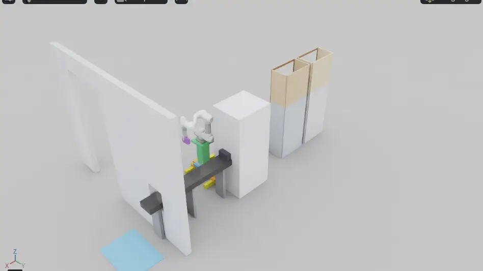
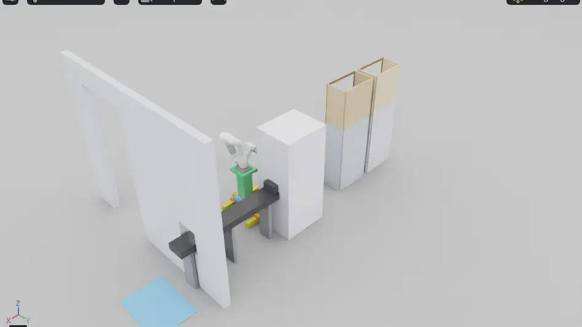
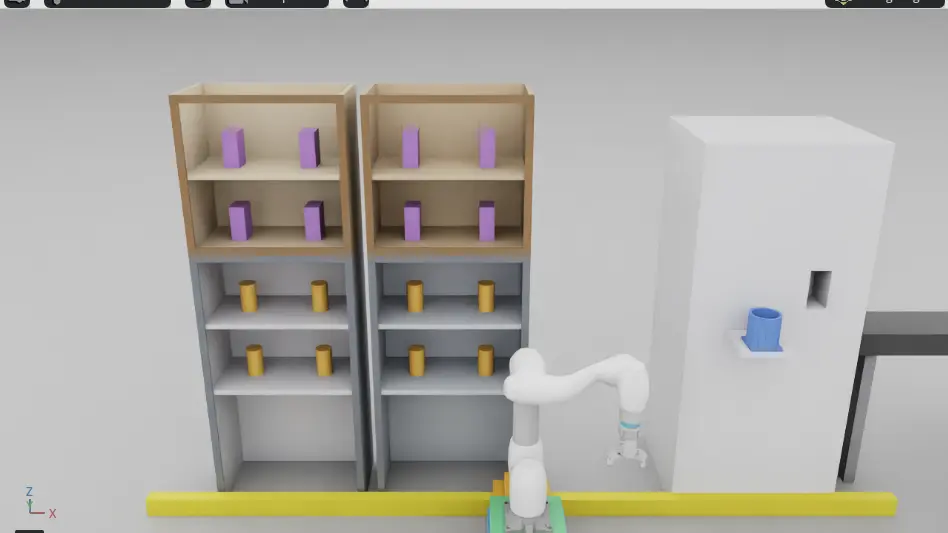
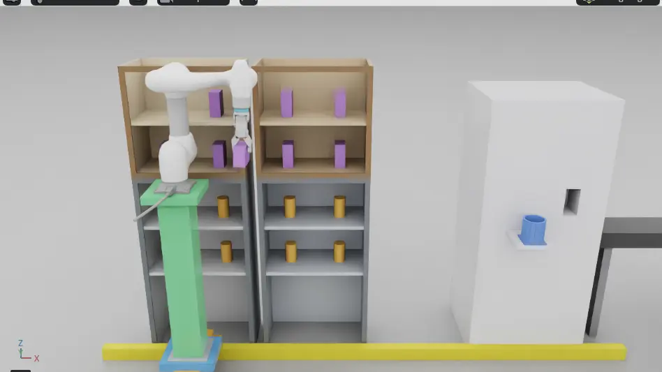
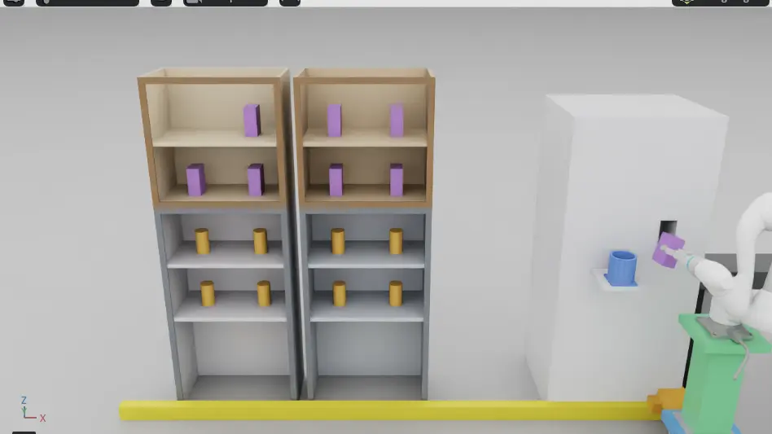
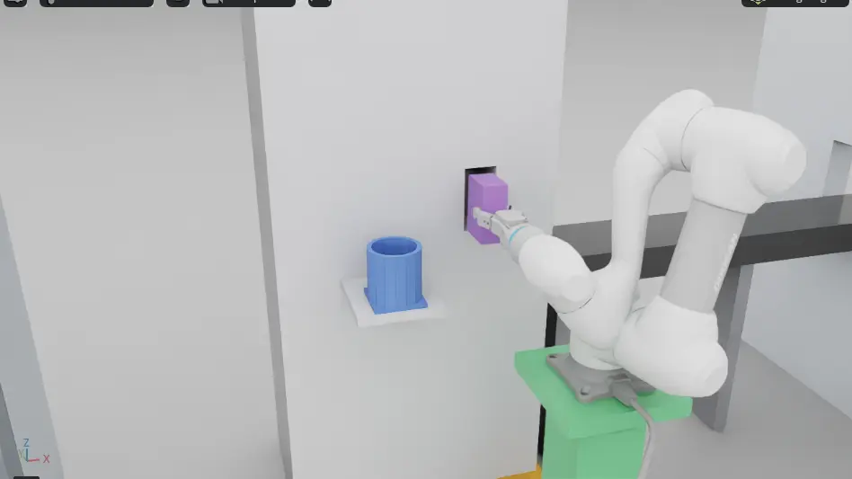

# 실습7 — master02, 장면 v2 + 팔 v2 레일 보충

| 항목 | 값 |
| --- | --- |
| 번호 | 실습7(7-a, 7-a2, 7-a3, 7-a4, 7-a5, 7-b) |
| 날짜·시각 | 2026-09-18(KST). 7-a 14:52:24-15:18:45, 7-a2 15:19:17-15:28:43 무렵, 7-a3 15:31:59-17:18:03, 7-a4 17:40:52-17:56:38, 7-a5 17:56:53-18:16:52, 7-b 18:26:31 부터 5분, 스테이지 18:48:02 종료 |
| 장소 | `master02`, 도메인 117 |
| 돌린 사람 | 재범(지시·화면). 기동·goal 보냄·녹화는 `master02` 원격 셸 |
| 출처 | master02 실습7-a·7-a2·7-a3·7-a4 보고, 7-b 는 master02 실습8·실습7-b 보고 원문, 7-a5 는 전달받은 master02 보고 요지와 캡처(핵심을 옮긴 것). 전문은 `master02` 의 `practice07a_report.txt`(저장소 밖). 이 기록은 `master02` 화면을 직접 보지 않고 썼다 |

## 목적

[조제실 장면 변경 계획](../planning/pharmacy-scene-v2-plan.md) 의 팔 v2(3축 레일, 약통 2종, 칸 랜덤, 실행 중 IK)를 v2 장면에서 돌린다. 실습7 은 5분 연속 구동이 목표이고, 7-a 는 goal 을 하나씩 보내 본 것이다.

## 구성

| 부분 | 값 |
| --- | --- |
| 트리(7-a) | `candidate/practice-07` `affd1ee` = `main` `ca93791` + `origin/feat/manipulation-m0609-scene-v2` `a696fb6`(#177). 로컬 merge, push 안 함. 빌드 7 packages [2.84s] |
| 트리(7-a2) | 개발 클론을 `main` `1828bfe` 로 fast-forward(#177 팔 v2, #180 v2 레일 받침 0.25·`rail_z` 0..1.10·드라이브 강화·`rail_overlap`, #178·#179 포함). 빌드 7 packages [3.04s]. #177·#178·#180 머지와 `1828bfe` 는 원격에서 확인했다 |
| 커밋 확인 | `ca93791` 은 `main`(#176 머지 커밋), `a696fb6` 은 #177 브랜치에 있다. `affd1ee` 는 원격에 없어 확인할 수 없다 |
| 팔 | `-p use_sim_time:=true -p scene_version:=2 -p v2_seed:=7` |
| 트리(7-a3) | 개발 클론을 `main` `525a9e8` 로 fast-forward(#183 승강 기둥, #181 L2 teardown, #182 docs 포함). 빌드 7 packages [2.85s]. 팔은 #177 코드 그대로(`v2-rail-stages` 는 아직 없다). `525a9e8`, #181·#183 머지는 원격에서 확인했다 |
| 명령 | 저장소 밖 스크립트. 7-a `start_practice7a.sh`·`p7a_goal.sh`, 7-a2 `start_practice7a2.sh`·`p7a2_goal.sh`, 7-a3 `start_practice7a3.sh`(7-a2 와 같고 로그 이름만 `p7a3_`). 원문은 받지 못했다 |

## 관측

### 사람이 본 것 (재범 원문)

- 시작: "로컬 최신화한거야? 그럼 바로 실습 진행하자."
- 도중: "다시 실습하자 내가 문제를 발견했는데 기록을 못함."
- 문제 설명: "정확하게 기록을 해줘. 1) 레일의 z축이 따로 놀았음. 계속 높게 위치를 유지하도록 설정된 느낌? 2) 그리고 M0609가 베이스가 되는 레일을 관통하는 현상이 나타남. 3) 내가 생각했던 시나이로는 레일이 1차적으로 로봇이 집을 수 있는 최적의 위치로 간 이후에 로봇이 파지를 하고, 그 다음에 또 로봇이 원통을 원형에 넣거나 조제기에 넣을 수 있는 최적의 위치로 구분지어서 이동하는 것을 생각함. 이런 디테일한 부분들 전부 기록하고 … 상황 공유할 수 있도록."
- goal 7·8 전: "지금 못봤다 다시 한번 보여줘"
- goal 7·8 을 본 뒤: "1) 관통장면 로봇이 레일의 높이변경되는 곳을 관통해서 지속적으로 작업을 수행함. 레일을 물리적인 오브제로 인지를 하지 못하고 위치 경로를 계산하지 못하는 것으로 추정 2) 레일의 Z값은 M0609가 알약통을 집는 위치로 이동했을때 가장 최단 거리로 집는 형태를 생각함. 그렇기 때문에 그 해당 알약의 위치보다 로봇의 홈 자세보다 더 낮아야한다고 생각했음."

### 로그로 본 것

| 항목 | 값 |
| --- | --- |
| 기동 | 14:52:24 기동 전 확인(`others:[]`, `/clock` 없음) → 스테이지 PLAY → 14:52:34 팔 → 14:54:40 `v2 계획 캐시: 16/16칸 풀림, 전체 122.4 s, 칸당 4.5-11.1 s. 못 푼 칸 {}` |
| goal | 8/8 SUCCEEDED. 5·6 은 녹화하며 돌렸고, 7·8 은 재범이 다시 보여 달라고 해서 돌렸다 |
| 팔 경고 | 모듈 3회 모두 `inlet_front: 레일이 밀려 있다. 목표 [1.15, -0.02, 0.58] 현재 [1.1959, 0.0233, 0.4889] (허용 0.01 m)` 류가 `inlet_front`·`retreat` 에서 각 1줄. goal 8 에서도 2줄, 누적 8줄. 현재값은 goal 4 `[1.1965, 0.0224, 0.4875]`, goal 6 `[1.1983, 0.0195, 0.4815]`, retreat `[1.2, 0.031 안팎, 0.503 안팎]`. 원통은 0줄. 수신 공백 최대 0.24 s |
| 명령 흐름(goal 5, sim s) | rail 629.75-633.05 → arm 633.10-639.27 → arm 639.83-647.55 → rail 647.62-652.25 → arm 652.32-660.47 → arm 660.80-666.50 → rail 666.53-668.85. 레일 명령과 팔 명령은 겹치지 않는다. 레일이 움직일 때는 x·y·z 가 같이 움직인다 |
| 이동 중 z | 원통: 칸 0.296 → 원형 0.406. 모듈: 칸 0.086 → 구멍 0.576 |
| 관통(재범 관찰 2) | `contact_watch` 가 `ignore_inside=/World/P3Pharmacy/Arm/` 라 로봇↔레일 접촉은 로그에 없다. 로그로는 판정할 수 없다. 재범 화면 확인이 필요하다 |

goal 별(wall 시각, 칸, sim 시각 grasp → 넣기):

| goal | 약 | wall | 칸 | sim s |
| --- | --- | --- | --- | --- |
| 1 | amox | 14:54:46-14:55:21 | `floor_right/r0c1` | 140.517 → round 157.267 |
| 2 | ibu | 14:55:26-14:56:10 | `upper_left/r1c0` | 180.967 → module 202.333 |
| 3 | amox | 14:56:28-14:57:03 | `floor_right/r1c0` | 239.683 → 257.183 |
| 4 | ibu | 14:57:12-14:57:57 | `upper_left/r0c0` | 283.200 → 305.717 |
| 5 | amox | 15:03:17-15:03:59 | `floor_left/r0c1` | 639.300 → 660.500 |
| 6 | ibu | 15:04:02-15:04:57 | `upper_left/r0c1` | 686.017 → 713.767 |
| 7 | amox | 15:07:44-15:08:24 | `floor_right/r0c1` | 895.350 → round 914.667 |
| 8 | ibu | 15:08:27-15:09:14 | `upper_left/r0c0` | 936.050 → module 958.900 |

goal 6 모듈 넣기 때 레일 상태(녹화, sim s):

| sim s | 레일 |
| --- | --- |
| 709.62 | x 1.1499, z 0.5757 |
| 710.12 | x 1.2000, z 0.5688 |
| 711.13 | x 1.1964, y 0.0190, z 0.4787 |
| 712.13 | x 1.1538, z 0.5737 |
| 716.18 | retreat x 1.2000, y 0.0314, z 0.5024 |
| 717.20 | 복귀 |

같은 때 접촉(touch impulse):

| sim s | 쌍 | impulse |
| --- | --- | --- |
| 711.300 | 모듈↔`DispenserFrontBelow` | 2.0094 |
| 711.417 | 모듈↔`DispenserFrontRight` | 0.3012 |
| 714.233 | `left_inner_finger`↔`DispenserFrontRight` | 0.9413 |
| 714.300 | `right_inner_finger`↔`DispenserFrontLeft` | 0.1625 |
| 303.683(goal 4) | 모듈↔`DispenserFrontRight` | 4.1744 |

로그 파일(`$HOME/markle_tmp/`, 저장소 밖): `p7a_stage.log`, `kit-practice7a-145221.log`, `p7a_arm.log`, `p7a_goal1..6.log`, `p7a_rec_*.csv`, `p7a_rail_track.txt`.

### 7-a 끝과 7-a2

재범 지시: "로컬 최신화, 그리고 실습 바로 실행 및 기록 진행"

| 항목 | 값 |
| --- | --- |
| 7-a 끝 | 15:18:45 팔 C-c → 스테이지 C-c. `stop reason=sigint updates=91679 wall_s=1575.416 loop_hz=58.19 sim_s=1527.983 rtf=0.970`, `exit=0`, `app_stopped` 0 |
| 7-a2 기동 | 15:19:17 `others:[]` → 스테이지(`demo-ros-refill-v2`, 개발 클론) → 15:19:27 팔(`scene_version` 2, `v2_seed` 7) → 15:21:51 `v2 계획 캐시: 16/16칸 풀림, 전체 141.0 s, 칸당 5.1-12.6 s. 못 푼 칸 {}` |
| 레일 | `rail built … rail_x(X -1.40..1.40) rail_y(Y -0.10..0.33) rail_z=(Z 0.00..1.10) drive=(10000000.0, 100000.0, 100000000.0)` |
| goal | 4/4 SUCCEEDED. "레일이 밀려" 0줄 |
| 레일 z(녹화) | `rail.origin` z 0.25. 원통 잡기 0.650·0.950, 원형 0.760, 모듈 잡기 0.740·0.440, 구멍 0.870 |
| 받침 | Pedestal 은 높이 0.16 에 있고 x·y 만 움직인다. 로봇 베이스는 0.69-1.20 m 에 떠 있다(추정한 원인) |
| `rail_overlap` | 28줄: `LiftPlate`↔`link_2` 8, `link_4` 8, `link_5` 6, `LiftGuide`↔`link_3` 4, `link_4` 2 |
| 7-a2 끝 | 재범 "내려" → 15:28:40 `m2-arm` C-c, 3 s 뒤 `m2-stage` C-c. `stop reason=sigint updates=32450 wall_s=555.555 loop_hz=58.41 sim_s=540.833 rtf=0.974`, `exit=0`, `app_stopped` 0. `pgrep` 으로 프로세스가 없는 것을 확인한 뒤 kill-session |
| 로그 파일 | `$HOME/markle_tmp/` 의 `p7a2_stage.log`, `kit-practice7a2-151915.log`, `p7a2_arm.log`, `p7a2_goal1-4.log`, `p7a2_rec_*.csv`(저장소 밖) |

| goal | 약 | wall | 칸 | sim s |
| --- | --- | --- | --- | --- |
| 1 | amox | 15:22:02-15:22:43 | `floor_right/r0c1` | 164.800 → round 185.083 |
| 2 | ibu | 15:22:46-15:23:45 | `upper_left/r1c0` | 213.350 → module 244.017 |
| 3 | amox | 15:23:49-15:24:32 | `floor_right/r1c0` | 269.733 → 291.633 |
| 4 | ibu | 15:24:36-15:25:26 | `upper_left/r0c0` | 314.717 → 337.600 |

재범 말(7-a2 도중, 원문에서 앞의 감탄 표현만 줄임): "… 어떻게 요청을 한건지는 모르겠는데 M0609가 공중부양을 하잖아...."

### 7-a3

재범 지시: "깃 최신화 후 실습 진행"

| 항목 | 값 |
| --- | --- |
| 기동 | 15:31:59 기동 전 확인(`others:[]`, `/clock` 없음) → 스테이지 → 15:32:09 팔 → 15:33:54 `v2 계획 캐시: 16/16칸 풀림, 전체 103.4 s, 칸당 3.8-9.0 s. 못 푼 칸 {}` |
| 레일 | `rail built … rail_x(X -1.40..1.40) rail_y(Y -0.10..0.33) rail_z=(Z 0.00..1.10) drive=(10000000.0, 100000.0, 100000000.0)` |
| goal | 6/6 SUCCEEDED(goal 5·6 은 15:42-15:44 재범 "실습해줘" 로 더 돌림). "레일이 밀려" 0 |
| 레일 z(녹화) | 7-a2 와 같다(원통 잡기 0.650·0.950, 원형 0.760, 모듈 잡기 0.740·0.440, 구멍 0.870) |
| `rail_overlap` | goal 4 까지 87줄, goal 6 까지 누적 129줄. 87줄 내역: `LiftColumn`↔`link_4` 14, `link_5` 12, `link_6` 4, `link_3` 3, 그리퍼 prim 9개 각 4 / `LiftPlate`↔`link_2` 8, `link_4` 8, `link_5` 6 |
| 로그 파일 | `$HOME/markle_tmp/` 의 `p7a3_stage.log`, `kit-practice7a3-153157.log`, `p7a3_arm.log`, `p7a3_goal1-4.log`, `p7a3_rec_*.csv`(저장소 밖) |
| 재범 화면 소감 | 보고에 없다 |
| 끝 | 다른 사용자의 Isaac 에 GPU 를 양보하려고 17:17:58 `m2-arm` C-c → `m2-stage` C-c → 17:18:03 `stop reason=sigint updates=332484 wall_s=6352.006 loop_hz=52.34 sim_s=5541.500 rtf=0.872`, `exit=0`, `app_stopped` 0 |

| goal | 약 | wall | 칸 | sim s |
| --- | --- | --- | --- | --- |
| 1 | amox | 15:34:06-15:34:43 | `floor_right/r0c1` | 126.300 → round 144.733 |
| 2 | ibu | 15:34:47-15:35:44 | `upper_left/r1c0` | 172.867 → module 202.067 |
| 3 | amox | 15:35:47-15:36:28 | `floor_right/r1c0` | 227.617 → round 248.300 |
| 4 | ibu | 15:36:32-15:37:18 | `upper_left/r0c0` | 271.433 → module 295.117 |
| 5 | amox | 15:42:29-15:43:15 | `floor_left/r0c1` | → round(sim 시각 보고 없음) |
| 6 | ibu | 15:43:18-15:44:19 | `upper_left/r0c1` | → module(sim 시각 보고 없음) |

7-a3 에는 #183(승강 기둥)만 들어갔고 팔 코드는 7-a2 와 같다(P18 b 는 아직 없다). 레일 z 녹화값은 7-a2 와 같고, `rail_overlap` 에는 `LiftColumn` 과의 쌍이 새로 나왔다.

판단: 기둥(#183)이 생겨 로봇이 떠 보이지 않게 됐지만, 팔 계획(#177)이 레일 부품을 장애물로 보지 않아 낮은 칸을 잡을 때 팔·그리퍼가 기둥과 겹친다. 팔 `v2-rail-stages` PR 의 확인 기준은 `rail_overlap` 87 → 0 이다.

관측: 7-a3 은 창 모드로 wall 6352 s(약 106분) 돌았고 `app_stopped` 는 0 이었다. 9/18 실습 기록(실습1-7) 가운데 가장 긴 실행이다(다음은 실습3 3-B 4730 s, 실습4 4-B 4054 s). 이것을 창 모드 자동 종료 문제([외부 검토의 A1](../analysis/2026-09-18-jaebeom-a1-a4-code-review.md#a1), #185) 판단의 근거로 쓴다. 실습4·5 는 master02 보고 원문에 "창 모드" 표기가 없어 비교 문장에서 창 모드라고 쓰지 않았다.

### 7-a4 대기

- 16:40:01 부터 `master02` 에 우리 것이 아닌 Isaac(`kit/kit … isaacsim.exp.full.kit`)이 떠 있다. 재범: "아 아닌거 같음 ㅋㅋ"(재범 자신이 띄운 것이 아니다).
- 그 프로세스는 건드리지 않았다. 그래서 7-a4 는 띄우지 못하고 기다린다.
- 7-a4 트리(예정): `801ee52` = `96158eb` + `c40c3f3` + `8725515`. `96158eb`·`c40c3f3` 은 `main` 에 있고 `8725515` 는 `feat/manipulation-m0609-v2-plinth055` 에 있다. `801ee52` 는 원격에 없다.
- 7-a4 관련 PR: #188(v2 바닥 선반 받침 0.30 → 0.55, 머지), #190(팔 v2 장면을 받침 0.55 로, 이후 머지), #189(L2 협력 종료, 머지).

### 7-a4

재범 말 원문(순서대로):
- "지금 마스터 2 사용 가능? 나 나왔다 수업장에서"
- "아 아닌거 같음 ㅋㅋ"(16:40 에 뜬 Isaac 은 재범이 띄운 것이 아니다)
- "고고 지금 써도 된대"
- "죽이고 너것만 띄우고 앞으로 실습은 부분적으로 중요 순간 스크린 캡쳐해서 로컬로 저장 후 나중에 깃에 문서화 시 같이 올림"
- "너가 알아서 실행해. 나는 밖임."

| 항목 | 값 |
| --- | --- |
| 다른 사용자의 Isaac | `kit/kit … isaacsim.exp.full.kit`, 16:40:01 시작. 재범 지시("죽이고 너것만 띄우고…", "너가 알아서 실행해. 나는 밖임.")에 따라 17:39:53 SIGINT 를 보내 내렸다(2 s 뒤 종료). 첫 시도는 권한 분류기에 막혔고 재범이 다시 지시했다. 누구 것인지는 모른다. 그 전에 17:17:58 7-a3 을 내렸다(`exit=0`) |
| 트리 | `candidate/practice-07a4b` `801ee52` = `main` `96158eb`(#186 레일 단계, #187 `a1_probe`, #185) + `c40c3f3`(#188 받침 0.55) + `8725515`(#190). 로컬 merge, 빌드 7 packages [19.2s]. #185·#186·#187·#188·#190 은 모두 머지 |
| 기동 | 17:40:52 `others:[]` → 스테이지(`demo-ros-refill-v2`) → 17:41:02 팔 → 17:42:11 `v2 계획 캐시: 16/16칸 풀림, 전체 67.8 s, 칸당 2.3-8.5 s. 못 푼 칸 {}` |
| goal | 4/4 SUCCEEDED |
| 레일 | **`rail_overlap` 0**, "레일이 밀려" 0, 팔 동작 중 레일 명령 0. xy 와 z 가 동시에 바뀐 2건은 1e-4 임계로 본 구간 경계의 0.3 mm 미만 값이다(1 mm 임계로 보면 0) |
| 잡기 베이스 − 약통(m) | `floor_right/r0c1` -0.260, `upper_left/r1c0` -0.343, `floor_right/r1c0` -0.260, `upper_left/r0c0` -0.300 |
| `a1_probe` | 2줄 |
| 캡처 | `master02` 의 `markle_tmp/shots/p7a4_*.png` 37장(goal 도중 5 s 간격, Isaac 창만). 기본 카메라가 벽 뒤에 있어 대부분의 장에서 로봇이 보이지 않는다. 로봇이 보이는 goal 2 도중 두 장을 아래에 올렸다. 시연 카메라는 `sim` 작업으로 따로 다뤘다(#195) |

| goal | 약 | wall | 칸 | sim s |
| --- | --- | --- | --- | --- |
| 1 | amox | 17:42:25-17:43:01 | `floor_right/r0c1`(z 0.61) | 92.700 → round 110.233 |
| 2 | ibu | 17:43:09-17:43:58 | `upper_left/r1c0` | 141.283 → module 163.333 |
| 3 | amox | 17:44:02-17:44:40 | `floor_right/r1c0` | 191.067 → round 207.867 |
| 4 | ibu | 17:44:46-17:45:36 | `upper_left/r0c0` | 237.817 → module 261.017 |

7-a3 판단의 확인 기준 "`rail_overlap` 87 → 0" 은 7-a4 에서 0 이 되었다(로그 기준). 재범 화면 확인은 보고에 없다.

캡처(Isaac 뷰포트만 잘라 PIL 10.2.0 으로 webp q70, 948×533 으로 바꿨다. 받은 파일의 sha256 을 `master02` 에서 적은 값과 대조했다):

17:43:39, goal 2(ibu, `upper_left/r1c0`) 도중. 녹색 승강 기둥 위 M0609 가 보라 모듈 약통을 쥐고 조제기 쪽으로 이동한다. 레일(노랑 X 트랙·회색 빔)이 보인다. webp sha256 `48e625eeabd84a82c9e2caed60b7459ec986e76938fef9fd336ffda550cc3461`, 원본 PNG sha256 `d684e116aac74f9eb595775803b8d2695290e84a287efd1d76ebafd9c7b331ce`(`master02`).

17:43:44, goal 2 도중. 조제기 앞이고 넣기 직전으로 추정한다. webp sha256 `676b6f122319133c545ee25b23a589b46492d439bd01323e3a2a1a085be77b78`, 원본 PNG sha256 `ee3056c1809530e3b02f0f4529492f2265bfdf78e81e0b545a591f7c27196537`(`master02`).

### 7-a5 (master02 보고 요지, 캡처는 master02 에서 받음)

재범 지시: "잘 보고 이슈가 없는지 너도 체크해."

| 항목 | 값 |
| --- | --- |
| 7-a4 끝 | 17:56:38 C-c, `exit=0` |
| 트리 | `a39546f` = `main` `9f7ed04` + `dd859fb`(#195 시연 카메라 `--view`, 머지). colcon 14.6 s. `a39546f` 는 원격에 없다 |
| 기동 | 17:56:53 `others:[]` → 기동. 인자 없이 `viewport view=overview scene=v2 eye=[-0.2000, -2.3000, 2.2000] target=[-0.2000, 0.7500, 1.1000]`. 계획 캐시 16/16, 75.7 s |
| overview goal | 1 amox 17:58:42-17:59:20 `floor_right/r0c1`(바닥 아랫단) grasp 107.800 → round 126.683 / 2 ibu 17:59:25-18:00:17 `upper_left/r1c0`(위 윗단) 155.700 → module 180.933. 둘 다 성공 |
| `--view shelves` | 18:01:40 `eye=[-0.6500, -2.3000, 1.5500] target=[-0.6500, 0.9000, 0.9000]`, goal 3 ibu `upper_right/r0c1` 성공 |
| `--view bins` | 18:04:16 `eye=[0.5500, -0.9000, 1.6000] target=[1.0000, 0.6500, 0.9500]`, goal 4 ibu `upper_right/r0c1` 성공 |
| 끝 | 18:16:52 bins 뷰판 C-c, `exit=0`, `stop reason=sigint updates=44714 wall_s=748.691 … rtf=0.995`(master02 실습8 보고) |
| 레일·접촉 | 세 기동 모두 `rail_overlap` 0, "레일이 밀려" 0, 로봇↔`Room` touch 0 |
| 캡처 | 3 s 간격. overview 31장 + 시작, shelves 17장, bins 16장(`master02` 로컬). 대표 네 장을 아래에 올렸다 |
| 참고 | 원통 넣기 1.3 s 전 원형 수납통 벽 접촉(impulse 0.99 등, 판정은 정상). 안지름 0.10 → 0.12 는 #198. 위 윗단 잡기 때 팔이 선반 앞에서 접혀 겹쳐 보인다(접촉 없음, 재범 확인 대기). shelves 뷰는 넣기 때, bins 뷰는 잡기 때 로봇이 화면에 없다(뷰 목적대로) |

캡처(Isaac 뷰포트만 잘라 PIL 로 webp q75, 948×533 으로 바꿨다. sha256 을 대조했다. 원본 PNG 는 Isaac 창 전체 캡처로 `master02` 에 있다):

17:58:22, 기동 직후(goal 전) overview. 선반 두 층(아래 원통, 위 모듈), 홈 자세 M0609, 조제기 앞면 구멍과 파란 원형 수납통. webp sha256 `d274d85a8255eeb5f1f9edf96132df6262c86aa256450e5a5eb0701099e7e386`, 원본 PNG sha256 `c2930a197ad67f64b70df49050ba5b61fedaf77d4fc4ce71df6c219c00d098d2`.

17:59:46, goal 2(ibu, `upper_left/r1c0` 위 윗단) 잡기. 녹색 승강 기둥이 올라간 상태다. webp sha256 `b22012c2844b0fec0c8841e614815cd7a9e0c3dbe0bc497d2602e26c53153cbe`, 원본 PNG sha256 `621d7a33ca6d225d33b9f12bb1c666ce298b4e0775c1f20ae3b24a267ef13292`.

18:00:02, goal 2 모듈 넣기. **문제 사례(P19)**: 기본 overview 에서 로봇이 화면 오른쪽 밖으로 나가 약통·구멍과 팔 끝만 보인다. webp sha256 `1860397438fb6bf1289619e50095dce80eb2716a9683c562917dfa5ebcd3501e`, 원본 PNG sha256 `d9556f692d3fb8748975a876b35f3c69cecac92f89f01a8d5905774143967a0c`.

18:06:21, `--view bins` 재기동, goal 4(ibu, `upper_right/r0c1`) 모듈을 조제기 구멍에 넣는 장면. webp sha256 `77f842eeb0d7c35f91c7fcf2361d801724402bd96ea977e4158062186393b2d6`, 원본 PNG sha256 `eb9769d59b5107bfa4c7401487168e49c3bd9caf89dad81209001c2e89a1d4ed`.

### 7-b

실습7 의 목표인 5분 연속 구동이다. 트리·스테이지·팔은 [실습8](practice-08.md) 과 같은 것을 이어 썼고, 웹·스택·firefox 는 18:26 에 C-c 로 내렸다(`refill_soak` 은 오케스트레이터와 같이 띄우지 않는다).

| 항목 | 값 |
| --- | --- |
| 트리 | `candidate/practice-08` `a94f06e` = `main` `1f2fabb` + #197 `580d187` + #198 `3f20086`(실습8 구성 참고) |
| 명령 | 18:26:31 `ros2 run rokey_p3_manipulation refill_soak --ros-args -p use_sim_time:=false -p duration_s:=300.0 -p "item_ids:=['drug-amox','drug-ibu']" -p seed:=3 -p goal_timeout_s:=120.0 -p out_file:=$HOME/markle_tmp/soak_v2.jsonl` → `soak_exit=0` |
| 요약 | `{"sent": 7, "succeeded": 7, "failed": {}, "mean_s": 46.37, "max_s": 50.68, "by_kind": {"cylinder": {"sent": 3, "succeeded": 3}, "module": {"sent": 4, "succeeded": 4}}}` |
| 레일·약통 | 칸 5곳. `released` 10·`respawn` 10(실습8 포함), `target=none` 0, `rail_overlap` 0, "레일이 밀려" 0, 수신 공백 최대 0.32 s |
| 끝 | 재범 "내려". 18:47:57 m2-arm C-c → m2-stage C-c → 18:48:02 `stop reason=sigint updates=109727 wall_s=1850.680 loop_hz=59.29 sim_s=1828.767 rtf=0.988 dispensed=2 render_products=0 ur5=off contact_watch=on`, `exit=0`, `app_stopped` 0. 이후 `master02` 에는 `m2-pswatch`·`m2-browser` tmux 세션만 남았다 |
| 로그·캡처 | `soak_v2.log`, `soak_v2.jsonl`, `shots/p7b_t*`(30 s 간격). 모두 `master02`, 저장소 밖 |
| 녹화 | GStreamer, Isaac 뷰포트 948×532. `p7b_clip_cylinder.mp4` 9.4 MB 38.5 s(#3), `p7b_clip_module.mp4` 12.5 MB 49.4 s(#2), 전체 `p7b_isaac2.mp4` 73.1 MB 4:43. 깃에 올리지 않고 재범에게 파일로 보냈다(재범 요청은 [실습8](practice-08.md) 사람이 본 것) |

| # | 종류 | 칸 | 소요 s |
| --- | --- | --- | --- |
| 1 | cylinder | `floor_left/r0c1` | 42.2 |
| 2 | module | `upper_left/r0c1` | 49.9 |
| 3 | cylinder | `floor_right/r0c1` | 39.3 |
| 4 | module | `upper_left/r0c0` | 50.2 |
| 5 | cylinder | `floor_left/r1c1` | 43.0 |
| 6 | module | `upper_left/r0c0` | 50.7 |
| 7 | module | `upper_left/r0c1` | 49.2 |

## 문제

| 번호 | 무엇 | 출처 | 고치는 쪽 | PR |
| --- | --- | --- | --- | --- |
| P14 | 레일 z 축이 따로 논다. 계속 높게 위치를 유지하도록 설정된 느낌. 재범 생각(goal 7·8 뒤): 레일 z 는 집는 위치에서 최단 거리로 집는 형태여야 하고, 그래서 해당 알약 위치·로봇 홈 자세보다 더 낮아야 한다 | 재범 1, 재범 goal 7·8 뒤 2) | `sim`(v2 레일 드라이브, 레일 스트로크·구멍 위치 한계 여유) + 팔(한계 근처 레일 목표 제외, 잡기 레일 z 선택) | #180(머지): v2 레일 드라이브 (1e7, 1e5, 1e8), v2 행정 x ±1.40·z 0..0.80. 재범 기대에 대한 결정은 아래. 잡기 레일 z 는 #186(머지) |
| P15 | M0609 가 받침이 되는 레일을 관통한다. goal 7·8 에서 본 위치: 로봇이 레일의 높이가 바뀌는 곳을 관통한 채 작업을 계속한다. 재범 추정: 레일을 물리 물체로 인지하지 못해 경로를 계산하지 못한다 | 재범 2, 재범 goal 7·8 뒤 1). 로그로는 판정 불가(로봇↔레일 접촉을 보지 않음) | `sim` + 팔. 재범이 본 위치는 "레일의 높이변경되는 곳"(링크는 말하지 않음) | #180(머지, `f775853`): 재고 JSON `rail.parts` 로 팔 계획이 레일 부품을 피하게, 스테이지가 `rail_overlap part=… robot=<링크>` 를 기록. 물리 충돌은 아직 켜지 않았다 |
| P16 | 동작 순서가 재범 생각과 다르다. 재범 생각: 레일이 먼저 집기 최적 위치로 → 팔이 파지 → 레일이 넣기(원형 또는 조제기) 최적 위치로 구분지어 이동 | 재범 3 | 팔(잡기용·넣기용 최적 레일 자세를 명시적으로 고르고, 그 자세에 선 뒤 잡기·넣기가 끝날 때까지 레일 명령 없음, 레일 이동을 보이는 한 단계로). "레일 완전 고정" 으로 해석할지는 재범 확인 대기 | #186(머지). 7-a4 로그: 팔 동작 중 레일 명령 0 |
| P17 | 모듈 넣기 때 레일이 밀린다(목표 z 0.58 에 현재 0.48 안팎, x 1.15 에 1.196 안팎, 허용 0.01 m) | 로그 팔 경고, 녹화 | P14 와 같다(`sim` + 팔) | #180(머지). 7-a2 에서 "레일이 밀려" 0줄 → 로그 기준 해소 |
| P18 | M0609 가 공중에 떠 있다(재범 "공중부양"). 받침(Pedestal)은 높이 0.16 에 x·y 만 움직이고, 로봇 베이스가 0.69-1.20 m 에 있다 | 재범 7-a2, 로그 | (a) `sim`. (b) 팔 | (a) #183(`fix/sim-v2-lift-column` `6543ec4`): 승강 기둥 `LiftColumn`, `rail.parts` 에 z 를 따라 움직이는 bbox, `LiftGuide` 제거. (b) #186(`feat/manipulation-m0609-v2-rail-stages`, 머지): 도달 거리가 짧은 순서의 후보 중 처음 통과하는 것(IK·여유 1 cm·레일 한계 5 cm), 레일 이동의 z 와 x·y 분리, `rail.parts` 를 장애물로, 여유 모델의 베이스 원점이 v1 값 0.60 이던 버그 수정 |
| P19 | overview 에서 모듈을 넣을 때 로봇이 화면 오른쪽 밖으로 나간다(레일 x 1.30 안팎, 약 15 s) | master02 7-a5, 캡처 18:00:02 | `sim` | #197(`fix/sim-view-robot-envelope`, #195 가 먼저 머지돼 새 PR). 원인: 테스트가 캐리지를 받침 높이에서만 봐서 높은 자세에서 화면 폭이 모자랐다. 팔 레일 자세마다 로봇 외곽을 테스트에 넣고 overview 눈을 (0.0, -2.53, 2.17)로 옮긴다 |
| P20 | 기둥 받침판 옆에 회색 막대가 보인다 | master02 7-a5, 캡처 17:59:46 | `sim` | 조치 없음. 관측(자산 읽기): usd-core 로 수업 자산 `base_link` 메시 `MF0609_0_0` 을 읽어, 폭 2-3 cm 인 부분이 베이스 중심에서 -y 로 0.34 m·x -0.11 m·z -0.045 m 까지 비스듬히 뻗는 것을 확인했다(충돌 메시도 같은 범위). 이 위치가 화면의 막대와 맞는다. 판단(모양): 케이블로 본다. 레일 부품이 아니고 자산은 바꾸지 않으므로 그대로 두고 sim README 에 기록한다 |

P18 원인(판단, 9/18):
- (a) 스테이지의 승강부가 z 전 범위를 받치지 않는다. 받침은 x·y 로만 움직이고, z 를 따라가는 것은 승강판(두께 0.04)과 가이드(0.16)뿐이다. 받침 0.25 를 승인할 때 "승강부가 z 전 범위를 보이게 받친다" 는 조건을 걸지 않았다(검토 누락).
- (b) 팔 계획이 아직 "도달 거리 최소 z" 가 아니다. 받침이 낮아진 만큼 z 를 올려 예전 베이스 높이(원통 잡기 0.90)를 만든다.

번호 P14-P18 은 이 기록에서 이어 붙였다. 7-a2 에서 "레일이 밀려" 는 0줄이었다(P17 관련, #180 뒤). `rail_overlap` 28줄은 P15 의 겹침이 기록되기 시작한 것이다. P17 은 재범이 말한 것이 아니라 로그 관측이다. P14 와 P17 이 같은 현상인지는 판단을 보류한다(배정은 같다).
P15 원인(`sim` 코드 확인): 레일 캐리지 부품은 충돌이 없는 시각 부품이고 로봇과 한 articulation 에 있다. 그래서 물리가 로봇을 막지 않고, `contact_watch` 로도 원리상 보이지 않는다.

P14 재범 기대에 대한 결정(9/18):
- v2 에서만 받침 높이를 0.60 → 0.25 로, `rail_z` 를 0..1.10 으로 바꾼다. 베이스 높이는 0.25-1.35 가 된다(임시값).
- #180 에 커밋을 더할 예정이다.
- 잡기 레일 z 는 팔이 "도달 거리 최소" 로 고른다(#186, 머지).

참고로 로그의 명령 흐름에서는 레일과 팔 명령이 겹치지 않고 레일→팔→팔→레일 순서로 나뉘어 있다(goal 5).

## 다음 실습에서 확인할 것

- P15: 레일 높이가 바뀌는 곳에서 로봇의 어느 링크가 관통하는지(재범은 위치만 말했다).
- P16: "레일 완전 고정" 해석이 맞는지 재범 확인.
- P18: 받침이 로봇 베이스까지 올라오는지.
- P15: `rail_overlap` 이 0줄이 되는지(팔이 `rail.parts` 를 피하는지).
- P14·P15·P16·P18: 7-a4 로그로는 레일 겹침 0, 팔 동작 중 레일 명령 0 이다. 재범이 화면에서 확인해야 해소로 적는다.
- 캡처: 7-a5 부터 시연 카메라(#195) 뷰로 찍은 대표 이미지를 올린다. 전송은 webp(948×533, q75)를 base64 텍스트로 보내고 받은 파일의 sha256 을 대조한다(README 캡처 규칙).
- P19: #197 머지 뒤 overview 에서 모듈 넣기 때 로봇이 화면 안에 있는지.
- 위 윗단 잡기 때 팔이 선반 앞에서 접혀 겹쳐 보이는 것이 문제인지(재범 확인).
- 7-a5 는 전달받은 요지로 적었다. master02 원문에는 7-a5 끝 줄만 있어 나머지는 대조하지 못했다.
- 7-b 는 5분 연속 7/7 이다. P14·P15·P16·P18 해소는 여전히 재범이 화면(녹화 포함)으로 확인해야 적는다.
