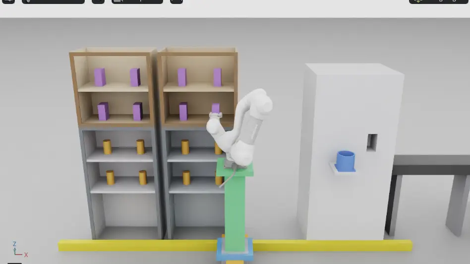
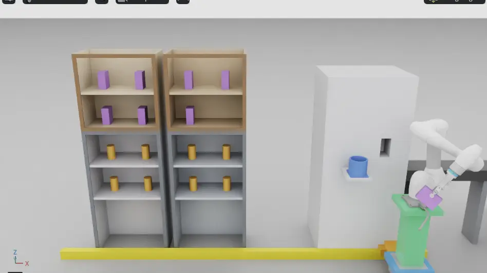
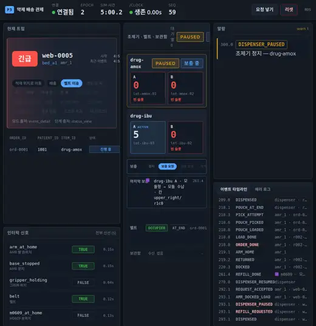
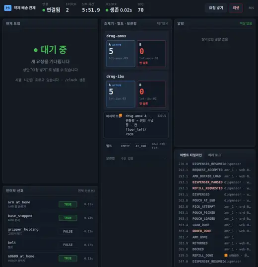

# 실습8 — master02, 장면 v2 + 오케스트레이터 + 웹, 9/21 시연 흐름 처음

| 항목 | 값 |
| --- | --- |
| 번호 | 실습8 |
| 날짜·시각 | 2026-09-18 18:16:59 기동, READY 18:18:44, 스택·웹·firefox 는 18:26 에 C-c, 스테이지와 팔은 18:47:57-18:48:02 에 내림(KST). 스테이지와 팔은 이어서 [실습7-b](practice-07.md#7-b)에 썼다 |
| 장소 | `master02`, 도메인 117 |
| 돌린 사람 | 재범(지시·화면). 기동·웹 조작·캡처·녹화는 `master02` 원격 셸 |
| 출처 | master02 실습8·실습7-b 보고 원문. 이 기록은 `master02` 화면을 직접 보지 않고 썼다 |

## 목적

[조제실 장면 변경 계획](../planning/pharmacy-scene-v2-plan.md) 의 실습8 = v2 + 오케스트레이터 + 웹. 9/21 시연 흐름(주문 → 조제기 재고 부족 → 레일 보충 → 조제 재개)을 v2 장면에서 처음 끝까지 돌린다.

## 구성

| 부분 | 값 |
| --- | --- |
| 트리 | `candidate/practice-08` `a94f06e` = `main` `1f2fabb` + #197 `580d187` + #198 `3f20086`. 로컬 merge, push 안 함. colcon 7 packages [14.9s] |
| 커밋 확인 | `1f2fabb` 는 `main`(#195 머지 커밋). `580d187` 은 #197 머리, `3f20086` 은 #198 머리이고 둘 다 아직 열려 있다. `a94f06e` 는 원격에 없어 확인할 수 없다 |
| 스테이지 | `demo-ros-refill-v2`, `--view` 없음. 스테이지 줄 `viewport view=overview scene=v2 eye=[0.0000, -2.5300, 2.1700] target=[0.0000, 0.7500, 1.1000]`, `round_bin={'center': [0.9, 0.56, 0.98], 'inner_diameter': 0.12, …}` |
| 스택 | `dispenser_refill.yaml`(a=1 b=0) |
| 순서 | 18:16:59 `others:[]` → 스테이지 → 18:17:09 팔 → 18:18:36 `v2 계획 캐시: 16/16칸 풀림, 전체 83.7 s, 칸당 3.0-9.8 s. 못 푼 칸 {}` → 스택 → 웹 200 → READY 18:18:44. 18:19:16 firefox 를 다시 띄움 |
| 명령 | 저장소 밖 스크립트. 원문은 받지 못했다 |

## 관측

### 사람이 본 것 (재범 원문)

- "야 너 동영상 촬영도 가능해? 가장 중심이 되는 부분만 화면 녹화를 해줄 수 있어?" 녹화는 실습7-b 에서 했다.
- 끝: "내려".

그 밖에 재범이 화면에서 본 것은 보고 대기.

### 로그로 본 것

흐름(sim s):

| 순서 | 요청 | 결과 |
| --- | --- | --- |
| 1 | 발행기 r001 `ord-0002`(ibu) | `REFILL_REQUESTED` 92.050 → `REFILL_DONE` 138.717(46.7 s, module `upper_right/r0c1` → module) → `DISPENSER_RESUMED` 147.467 |
| 2 | 웹 urgent `web-0001` `ord-0001`(amox) | `REFILL_REQUESTED` 190.017(draw 2 cylinder `floor_left/r1c0`). 18:20:36 웹 리셋 → `refill 결과를 버린다. epoch 1 != 2`, 팔 `Refill drug-amox: 취소됨. grasp_pose: 이동 실패`. 보충 중에 리셋을 넣은 시점 실수다 |
| 2' | 웹 single `web-0002` `ord-0003`(`bed_b1`) | 201.767 → 202.950 `ABORT out_of_stock`(이벤트 이름은 `ORDER_DONE`) |
| 3 | 발행기 r002 `ord-0002` | `REFILL_REQUESTED` 209.017 → `REFILL_DONE` 261.417(52.4 s, module `upper_right/r1c0`) → `DISPENSER_RESUMED` 270.833 |
| 4 | 웹 묶음 `ord-0001`·`ord-0003`·`ord-0004`(destination `bed_a1`), 18:20:54·18:21:54 두 번 | 둘 다 409 `orchestrator 가 요청을 거부했다 (사유 없음)`. 스택 `Deliver goal 거부: 진행 중 트립이 있거나 정거장을 만들 수 없다`. 원인은 요청의 `"mode":0`(아래 참고) |
| 5 | 웹 urgent `web-0005` `ord-0001` | `REFILL_REQUESTED` 293.083 → `REFILL_DONE` 339.467(46.4 s, cylinder `floor_left/r0c0` 바닥 아랫단 → round) → `DISPENSER_RESUMED` 346.983 |

- `REFILL_DONE` detail 예: `{"item":"drug-amox","slot":"a","kind":"cylinder","cell":"floor_left/r0c0","target":"round","seed":7,"draw":4,"clearance":0.0108}`. snapshot `last_refill` parsed=true.
- 웹: "마지막 보충 ■ drug-amox A · 원통형 → 원형 수납통 · 칸 floor_left/r0c0" 과 견본(원통 주황, 모듈 보라). 보충 중에는 PAUSED·보충 중·보충 흐름 칩, 끝나면 대기 중 초록. 알람 0(보충 중에만 `DISPENSER_PAUSED` warn 1).
- 스테이지: `rail_overlap` 0, "레일이 밀려" 0, 수신 공백 최대 0.32 s, `app_stopped` 0. 원통↔`RoundBin` touch 는 Floor 0.0076·Wall10 0.0046 뿐이다(7-a5 Wall06 0.99 보다 크게 줄었다, #198 안지름 0.12).
- stale/unknown: `event_logger` 끝 줄(`'stale': 0`) 1줄.
- 로그(`master02`, 저장소 밖): `p8_stage.log`, `kit-practice8-181657.log`, `p8_arm.log`, `p8_stack.log`, `p8_web.log`, `p8_driver.log`, runs `20260918T091837Z-master02-57682977`·`20260918T092036Z-master02-e618d1b1`, 캡처 `shots/p8_*`.

### 코드에서 확인한 것

- 409 의 "사유 없음" 은 웹 백엔드가 적는 문구다. goal 거부에는 사유가 실려 오지 않는다(`web/backend/app/ros_bridge.py`, api.md §0.4). 사유는 스택 로그의 `Deliver goal 거부:` 줄에만 남는다(`orchestrator_node.py` `_refuse`).
- `진행 중 트립이 있거나 정거장을 만들 수 없다` 는 주문 풀·중복·구역 ID 검사를 지난 뒤 `fsm.accepts` 가 거절할 때 나온다. `trip_fsm.py` `_build_stops` 는 single·urgent 모드에서 주문이 1개가 아니면 정거장을 만들지 않는다. 주문 3개를 `"mode":0`(single)으로 보내면 이 거부가 난다. master02 보고의 정정(팔 코드 기준 확인)과 맞다.
- `ABORT out_of_stock` 은 재고가 없을 때 그 주문을 `ABORT` 하는 정해진 동작이다([ADR 0001](../adr/0001-orchestrator-trip-fsm.md) 실패 행). 2' 는 amox 보충 중에 들어온 주문이고, master02 보고의 정정도 "설계대로의 out_of_stock ABORT" 다.

캡처 네 장(Isaac 2·웹 2). Isaac 은 뷰포트만 잘라 webp q75 948×532 로, 웹은 firefox 페이지 부분만 줄여 webp q65 520×537 로 바꿨다(PIL). 네 장 모두 크기·sha256 을 대조하고 화면을 봤다. 원본 PNG 는 `master02` 에 있다.

18:18:58, 첫 보충(발행기 r001, module `upper_right/r0c1`) 잡기. 녹색 승강 기둥이 올라간 채 팔이 위 선반 모듈 앞에 있다. webp sha256 `20d3baa661f1ad95559cbc3768bcda9f288bc8988e83f92501c3289573778838`, 원본 PNG sha256 `251a5c7406694ea96041b39b54c9cf979fc815d320fa633fe7527584e60cc4c5`.

18:19:16, 첫 보충(발행기 r001, module `upper_right/r0c1`). #197 의 새 기본 카메라에서 모듈을 쥔 팔이 화면 오른쪽 끝, 승강 기둥 위에 보인다(7-a5 의 P19 장면과 비교). master02 보고에는 "모듈을 조제기 구멍에 넣는 장면" 이라고 적혀 있다. 캡처 화면에서는 모듈이 아직 구멍 앞이다. webp sha256 `6cb15a159f7ac8f632ab16bdbc2bcb31d670e19c873d834028261709d1b5f514`, 원본 PNG sha256 `746353fd42198c76350c7a4a5eb1744550d92bd248a985bbd62e6523e6268c18`.

18:22:16, 웹. 긴급 `web-0005`(`bed_a1`) 트립 카드, 조제기 drug-amox PAUSED·보충 중(A 0), 보충 흐름 칩 "보충 요청", 마지막 보충은 앞 건(drug-ibu 모듈 `upper_right/r1c0`), 알람 `DISPENSER_PAUSED` warn 1. 조제기 카드 머리 "대기열 0" 이 세로로 줄바꿈되고 마지막 보충 줄이 좁게 줄바꿈된다(P21). webp sha256 `534c55cbbab4946d43e4a364436b5a0d58a9d3b5cf12bcfc58f2926d89d8a0a3`, 원본 PNG sha256 `10c767313c73adcf037976d9a38f5c0969ab62c2d4a48fc61d87e4002bf84d71`.

18:23:11, 웹. 원통 보충이 끝난 뒤 "대기 중" 초록, drug-amox A 5, 마지막 보충 "drug-amox A · 원통형 → 원형 수납통 · 칸 floor_left/r0c0"(주황 견본), 알람 없음, 타임라인 끝에 `REFILL_DONE`·`DISPENSER_RESUMED`. webp sha256 `4b66dead24be459101ee25d9f79adbfb60c663ad6e9522f5570f11be778a0de4`, 원본 PNG sha256 `c0b1f5c3ef52fa42c75f2e0bcf2e1ece44e6766eef65c62fd32abf29c319531c`.

## 문제

| P | 내용 | 출처 | 담당 | PR |
| --- | --- | --- | --- | --- |
| P21 | 웹 UI 세 가지: 견본 색이 "마지막 보충" 라벨 글자와 겹친다. 조제기 카드 머리 "대기열 0" 이 세로로 한 글자씩 줄바꿈된다. 보충 줄이 좁게 줄바꿈된다 | master02 실습8 | 프론트 | #203(1200 px 이하 두 칸, 글자 쪽이 양보. 실습8 에서 본 셋과 재현 중 찾은 셋) |
| P22 | firefox 창이 Isaac 창을 덮어 18:19:16 이후 Isaac 캡처에 웹이 찍혔다. `master02` 에 창을 옮길 도구가 없다 | master02 실습8 | 운영(재범) | 해당 없음. 운영 규칙: 웹을 먼저 찍거나 창을 나눠 배치한다. 7-b 는 웹을 내려서 피했다 |

참고(문제 아님):

- 웹 묶음 배송 409 두 번은 요청 실수다. 묶음인데 `"mode":0`(single)으로 보냈다. 묶음은 `"mode":2` 여야 한다(정정, 팔 코드 기준 확인). 처음 추정(목적지가 섞임)은 원인이 아니었다. 후속: #201(팔, `Deliver` 거부 로그에 `request_id` 와 갈라진 사유). 웹 백엔드 선검사(`bad_mode_for_orders`, 보충 중 `refill_in_progress`)는 진행 중이다. 재범 결정: "보충 중에는 웹에서 미리 거부".
- 보충 중 웹 리셋(18:20:36)은 조작 시점 실수다. 오케스트레이터는 이전 epoch 의 보충 결과를 버리고 팔은 goal 을 취소했다(로그 문구 그대로).
- 실습8 녹화는 자르기 높이를 홀수(533)로 줘서 0 byte 였다. 532 로 고쳤고 실습7-b 녹화는 532 로 찍었다.

## 다음 실습에서 확인할 것

- 웹 묶음 배송을 `"mode":2` 로 다시 보내 트립이 끝까지 가는지.
- P21: #203 머지 뒤 같은 화면.
- P22: 운영 규칙대로 찍었을 때 Isaac 캡처에 웹이 안 찍히는지.
- 재범이 화면에서 본 것(보고 대기).
