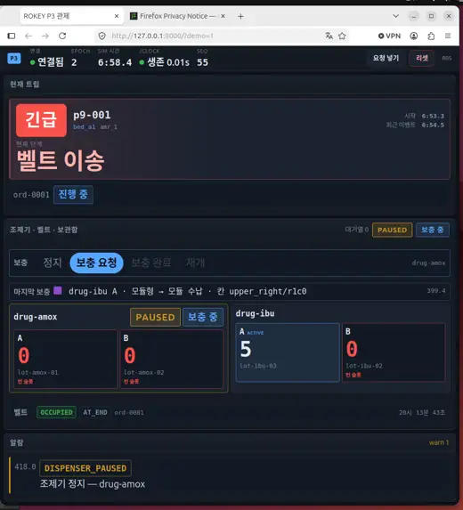
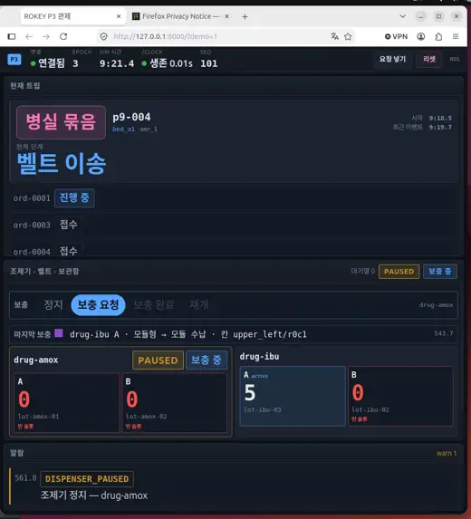
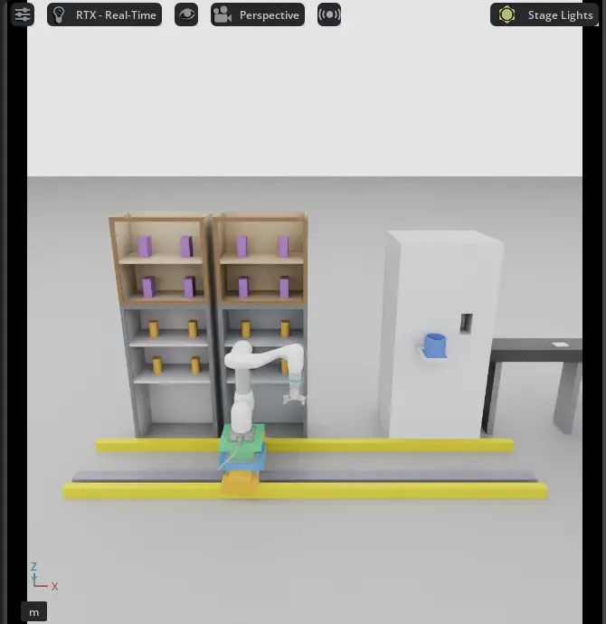

# 실습9 — master02, 9/21 시연 리허설(장면 v2, `demo_v2.sh` 첫 실물)

| 항목 | 값 |
| --- | --- |
| 번호 | 실습9 |
| 날짜·시각 | 2026-09-18 20:06 부터(KST). 끝 시각은 보고 대기 |
| 장소 | `master02`, 도메인 117 |
| 돌린 사람 | 재범(지시·화면). 기동·웹 요청·창 배치·녹화는 `master02` 원격 셸 |
| 출처 | master02 실습9 보고 요지와 전달받은 요지. 전문 대조는 보고 대기. 이 기록은 `master02` 화면을 직접 보지 않고 썼다 |

## 목적

[9/21 시연 runbook](../runbooks/demo-0921-v2.md) 대본(긴급 → 1인 → 묶음, 보충, 보충 중 거부, 리셋)을 `tools/demo_v2.sh` 로 처음 끝까지 돌려 본다.

## 구성

| 부분 | 값 |
| --- | --- |
| 트리 | `main` `10c8e83`(#216 `demo_v2.sh` 머지 커밋). `main` 에 있는 것을 확인했다 |
| 순서 | colcon 20:06:07 → `tools/demo_v2.sh up` 20:06:31 → PLAY 20:06:41 → 팔 계획 캐시 16/16, 65.1 s → 스택·웹 20:07:50 |
| 로그 | `$HOME/markle_tmp/p9_logs/20260918-200631-*.log`(`master02`, 저장소 밖) |
| 창 배치 | python3 ctypes + libX11(`XMoveResizeWindow`·`XIconifyWindow`·`XRaiseWindow`)로 firefox 를 오른쪽 반으로 옮기고, 가리던 창을 최소화했다. `wmctrl` 없이 됐다 |
| 녹화·캡처 | `videos/p9_full.mp4`(전체 화면 1536×864, 10 fps, 9:50, 102.9 MB, 깃에 올리지 않음), `shots/p9_a*`(대본 단계별 11장) |

## 관측

### 사람이 본 것 (재범 원문)

- "일단 로컬 최신화해서 기록 필요한 실습들 진행하고 기록할까?"
- 창 배치: "이거 너가 못하냐?"
- GDM 자동 로그인: "그 커맨드 날렸단다". 이때는 파일이 바뀌지 않았다. 9/20 에 두 번 더 시도해 10:23 에 적용됐다(아래).

### 로그로 본 것

대본(sim s):

| 순서 | 요청 | 결과 |
| --- | --- | --- |
| 1 | 긴급 `p9-001` | `REQUEST_ACCEPTED` 413.300 → `DOCKED` 426.333(13.0 s). 보충 cylinder `floor_left/r0c0` 45.5 s |
| 2 | 보충 중 1인 | 웹 409 "보충 중 — 재개 뒤 다시 (drug-amox)"(`refill_in_progress`). 보내기 전 거부가 실물에서 처음 확인됐다 |
| 3 | 1인 `p9-003` | 470.233 → 483.483(13.3 s) |
| 4 | 리셋 | epoch 2 → 3 |
| 5 | 묶음 `mode` 2 `p9-004` | 558.533 → 581.900(23.4 s). `ord-0001`·`ord-0004` 완료, **`ord-0003` 은 `ABORT out_of_stock`**. 같은 묶음 안에 amox 가 2건이고 재고는 1 이었다. 알람 error 1 이 남았다(P23) |

- 보충 6회 모두 성공, `rail_overlap` 0, "레일이 밀려" 0, 수신 공백 최대 0.29 s, `app_stopped` 0.
- 첫 시도는 스크립트 실수(순간 idle 판정, 쓴 주문 재사용, 보충 중 리셋)로 대본이 어긋나 다시 돌렸다. 위 표는 다시 돌린 것이다.
- 요청은 API 로 보냈다. 웹 "요청 넣기" 창에서 거부 문구가 뜨는 것은 아직 화면으로 보지 않았다.
- runs(`master02`): `20260918T110748Z-master02-adad1a91`, `20260918T111226Z-master02-423bb237`, `20260918T111454Z-master02-19d7634e`.

캡처: 네 장이 `master02` `$HOME/markle_tmp/shots/pick9/` 에 있다(9/18 20:19). 목록·sha256 은 아래 표다. 그 가운데 세 장은 아래에 넣었다. 네 번째(데스크톱 전체)는 원본 base64 가 메시지 한 통에 들어가지 않아 넣지 못했다. 전달은 base64 로 받았고, 크기·sha256 을 대조한 뒤 화면을 확인했다.

| 이름 | 크기 | 규격 | sha256 | 무엇 |
| --- | --- | --- | --- | --- |
| `p9_a21_web_refilling.webp` | 14,578 B | 520×573 | `fa815b30…` | 웹. 긴급 `p9-001` 벨트 이송 중, 조제기 `PAUSED`·`보충 중`, drug-amox A 0·B 0, 알림 `DISPENSER_PAUSED` |
| `p9_a60_web_bundle.webp` | 14,618 B | 520×573 | `dd19ec05…` | 웹. 39 s 뒤 병실 묶음 `p9-004`, `ord-0003`·`ord-0004` 접수 |
| `p9_a21_isaac_refill.webp` | 10,290 B | 670×690 | `4c9ad185…` | Isaac 뷰포트. 레일 위 M0609 가 선반으로 뻗음 |
| `p9_a60_full_half.webp` | 25,134 B | 1024×576 | `a20c7c8e…` | 데스크톱 전체(왼쪽 Isaac, 오른쪽 웹). 두 화면이 같은 시각이라는 증거 |

**주의**: 이 캡처는 xwd 기반이라 **색은 믿지 않는다**(실습6 P9 와 같은 제약). 배치·자세·UI 글자는 그대로 쓴다.

보충 중 화면. 긴급 `p9-001`(`bed_a1`)이 벨트 이송 단계이고, 조제기는 `PAUSED`·`보충 중`이다. drug-amox A·B 가 빈 슬롯이고 알람은 `DISPENSER_PAUSED` 하나다.

39 s 뒤. 현재 트립이 `병실 묶음 p9-004` 이고 `ord-0003`·`ord-0004` 가 접수로 쌓였다. 조제기는 그대로 `PAUSED`·`보충 중`이다.

같은 시각 Isaac 뷰포트. 선반 넷(위 모듈, 아래 원통), 레일 위 M0609, 조제기와 원형 수납통, 바닥의 레일 두 줄이 보인다.

녹화 `$HOME/markle_tmp/videos/p9_full.mp4`(9분 50초, 102,877,463 B, sha256 `8b04ce31…`)는 `master02` 로컬에만 둔다. 저장소에 올리지 않는다(파일당 10 MiB 한도). 같은 실행의 로그는 `$HOME/markle_tmp/p9_logs/20260918-200631-{stage,arm,stack,web,kit,browser}.log` 와 `p9_snapshot_end.json` 이다.

## 문제

| P | 내용 | 출처 | 담당 | PR |
| --- | --- | --- | --- | --- |
| P23 | 묶음 안에 같은 품목이 재고보다 많으면 넘치는 주문이 `ABORT out_of_stock` 으로 끝나고 error 알람이 남는다(`ord-0003`, amox 2건·재고 1) | master02 실습9 | 백엔드(보내기 전 `insufficient_stock` 선검사, 작업 중). 시연 대본은 runbook 에서 피한다 | 선검사는 아직 없음. 대본은 #308(묶음 = `ord-0003` amox + `ord-0004` ibu, 두 보충이 끝난 뒤) |

참고(문제 아님):

- P22(firefox 가 Isaac 캡처를 덮음)는 이번에 창을 libX11 로 옮겨 피했다. 방법이 스크립트로 남으면 P22 에 적는다.
- GDM 자동 로그인 명령은 재범이 쳤고 이날은 적용되지 않았다. 저장소 밖 설정이다. **9/20 에 밝혀진 원인은 오타가 아니라 절(section) 위치다**: 파일 끝에 덧붙이는 방식이라 두 줄이 마지막 절인 `[debug]` 소속으로 읽혀 무효였고(10:21), `[daemon]` 절 안으로 옮긴 뒤 적용됐다(10:23). 자세한 것은 [실습15](practice-15.md).

## 다음 실습에서 확인할 것

- 웹 "요청 넣기" 창에서 거부 문구(`refill_in_progress`, `bad_mode_for_orders`)가 화면에 뜨는지.
- 묶음을 품목이 겹치지 않게(amox 1 + ibu 1) 보냈을 때 모두 완료되는지. `insufficient_stock` 선검사가 들어오면 겹친 묶음이 보내기 전에 거부되는지.
- 끝 시각·stop 줄(보고 대기).
