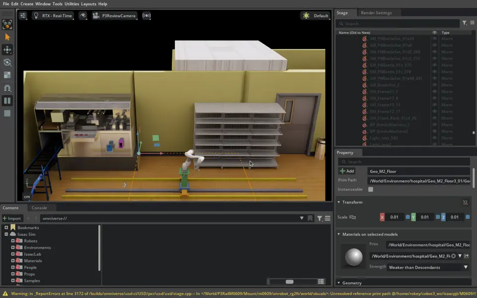

# 실습32 — 병원 조제기 모델링과 빈월드 배치 대조

- 날짜/호스트: 2026-09-22, master02 (`IsaacSim07`), Isaac Sim 5.1.
- 화면 확인·수정 지시: 임재범.
- 기준: 초기 단독 미리보기 `321c069`, 새 병원 씬 #484 `db9d9ad`, 조제기 에셋 #485 `fc8a71e`. 이 기록의 작성 기준 `bc350ff`.
- 정지 미리보기 실행. 최초 기동의 정확한 시각은 이 일지에서 미확인. 최종 에셋 뷰어는 이전 실행을 종료하고 새로 열었다. 정식 protocol/run ID는 없으며 acceptance 기록이 아니다.
- 실습31의 배송 스택 시험과 별개인 화면 모델링 작업이다.

## 사람이 본 것과 결정

임재범이 구버전 장면을 지적해 #476을 포함한 병원 장면으로 전환했다. 조제기 오른쪽 선반은 약/모듈 선반이며 벽까지 연장하고 옆 문을 제거할 계획이라고 설명했다. 이후 #484에서 새 선반 배치가 제공됐다.

투입기는 조제기의 오른쪽 측면이 아니라 컨베이어가 있는 정면에 있어야 한다고 수정했다. 양쪽 돌출부 제거와 컨베이어 개구부 가공을 요청했다. 투입기가 외판에서 떠 있는 것을 수정한 뒤, 유리창 아래 오른쪽 패널 배치를 확인하고 진행에 동의했다. 색상·데코는 별도 후속 작업으로 남겼다.

3축 레일과 M0609를 보여준 뒤, 임재범은 빈월드와 상대 좌표를 맞춰 실제 도달을 확인해야 한다고 지적했다. 이어 #484 기준으로 통합하되 조제기 에셋을 먼저 PR로 남기도록 요청했다.

## 문제와 처리

| 문제 | 처리 / 남은 검증 |
| --- | --- |
| P1 구버전 장면 표시 | #476 포함 단독 장면으로 전환. #484 최신 씬의 정식 런타임 연결은 후속 |
| P2 투입면 오류와 외판 사이 빈틈 | −Y 정면 금속 패널에 밀착. #485에 독립 에셋·앵커·해시 기록 |
| P3 카메라 회전 | Z-up 전용 카메라와 최종 에셋 정면 보기 적용 |
| P4 양쪽 돌출부 / 막힌 컨베이어 접점 | 본체 경계 절단, 실제 외부 컨베이어 위치에 개구부 가공. 초기 중앙 트레이 가공은 되돌림. #485 |
| P5 레일·팔 도달 미확인 | 임시 레일 Y를 10.25→10.75 m로 조정해 기존 작업 후보의 IK를 확인. 전체 선반·경로 충돌 검증은 미실행 |
| P6 표준 씬 준비 실패 | 39개를 기대하는 코드와 41개 토큰의 불일치. 합성 측정 미실행 |
| P7 미리보기 PhysX/CUDA 오류 | physics 중지, 뷰어 재시작. 동작 성공으로 기록하지 않음 |
| P8 #486에 댓글만 남김 | 파일 변경 누락을 인정. #486도 병합돼 최신 main의 후속 문서 PR에서 기록 보완 |

## 수치·산출물과 검증

수치 원장, 실패 명령, 파일별 해시는 [조제기·병원 정합 진단](../analysis/2026-09-22-dispenser-hospital-alignment.md)에 둔다. 원본은 `/home/rokey/markle_tmp/m2-pr486-diagnostic/`이며 git에 넣지 않았다.

#485의 최종 조제기 단독 파일을 새 Isaac 뷰어에서 열어 형상을 확인했다. repository/evidence 구조 검사, unittest 188개, Ruff, description 패키지 build·설치본 대조는 통과했다. 패키지 colcon test는 등록 테스트 0개다. 물리 collision, 실제 삽입/보충, #484 합성 L3는 미실행이다.

## 캡처·녹화

아래는 **수정 전 임시 레일 배치** 화면이다. 최종 도달 검증 이미지로 사용하지 않는다. 원본 `/tmp/p3-rail-robot.png`를 축소했다. 단독 병원과 최종 조제기 캡처의 원본 경로·해시는 정합 진단 5절에 있다. 이 모델링 작업의 동영상은 수집하지 않았다.

## 후속

#484의 선반 9개 전체와 #485 조제기를 합성한 뒤 슬롯·약통 실치수, 레일 작업 범위와 충돌을 검증한다. 기존 빈월드 IK 해를 병원 전체 동작 성공으로 취급하지 않는다.
