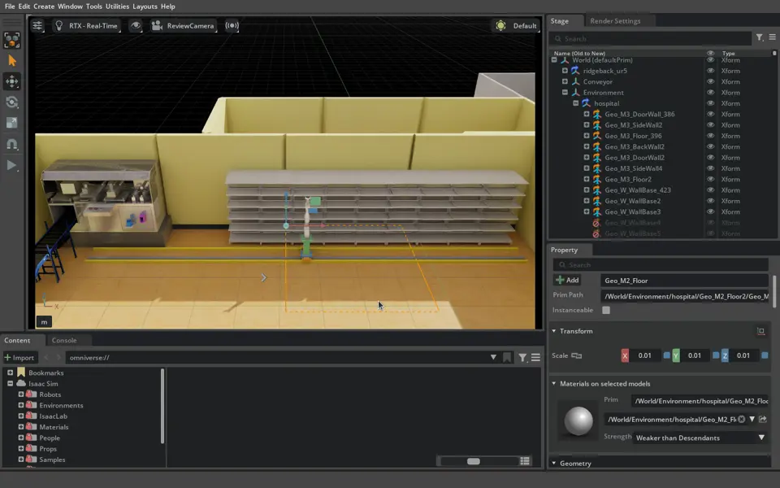

# 실습33 — #484 병원 배치와 수정 조제기 합성 확인

- 2026-09-22 master02, IsaacSim07, Isaac Sim 5.1. 임재범 요청.
- #484 `db9d9ad`의 hospital_navigationv1.usda와 #485 `fc8a71e`의 조제기 시각 에셋을 외부 검토 레이어에서 합성했다. 제품 실행 기본값을 교체하지 않았다.
- 실행 파일 `/tmp/p3_test484.py`, 외부 작업 폴더 `/home/rokey/markle_tmp/m2-pr484-test/`. r3 로그 2026-09-22T06:02:22Z(15:02:22 KST)에 레일 합성 기록, 이어 `PR484_INTEGRATION_READY` 확인. 매 시도 별도 Isaac 프로세스. 정식 protocol/run ID 없음.

## 준비와 실패

로컬에 없던 NVIDIA 원본 ConveyorBelt_A02/A05를 별도 폴더로 다운로드했다. 병원 씬은 자산 경로만 해석한 복사본을 사용했다. 원본 transform은 유지했다.

1. 첫 시도: 준비 스크립트가 두 개의 삭제 payload 경로를 동일하게 바꿔 USD 중복 목록 파싱 오류. 삭제 목록은 원래 경로로 유지하도록 수정했다. 원본 #484의 결함으로 분류하지 않는다.
2. 두 번째: 테스트 코드가 Isaac 내 USD의 미지원 `GetCompositionErrors`를 호출해 종료했다. 검사를 별도 usd-core 24.11로 옮겼다.
3. 별도 USD 검사에서 `Material%20Library` 경로의 누락 두 건을 발견해 로컬 자산 폴더의 이름 대응을 추가했다. 재검사 composition errors 0개.
4. 세 번째 창 모드 로드와 수정 조제기·레일 합성이 완료됐다. 그리퍼 원본 `/visuals/world` unresolved-reference 경고는 남았다. 이 경고를 숨기거나 동작 검증 성공으로 취급하지 않는다.

## 확인 결과

| 확인 | 결과 |
| --- | --- |
| 활성 선반 SM_MedShelf_01d_67–75 | 9개, world translate와 bbox 수집 |
| Conveyor 바로 아래 활성 ConveyorTrack 계열 | 12개, bbox 수집 |
| clock 이름 / ROS2PublishClock 타입 prim | stage traversal 검색 결과 0개 |
| 문 SM_Door_01b6/7/8, 문틀 Geo_M_DoorFrame51/53 | 5개 모두 inactive |
| 수정 조제기 | 기존 machine을 검토 레이어에서 끄고 #485 에셋을 앵커 위치에 참조 |
| 3축 레일 | 원점 (−3.30,10.75,0), X 이동폭 11.40 m, Y −0.10..0.33 m, Z 0..1.10 m |
| 고정 트랙 X 범위 | −9.20..2.60 m. 새 선반 열에 맞춘 시각·기구학 검토안 |
| 두 투입구의 명목 IK | 새 레일 원점/한계로 접근·삽입·후퇴를 재계산해 2/2 해 확인 |
| 실제 약통 파지·삽입, 선반 전체 경로, collision, ROS 배송, reset | 미실행 |

`baseline-check.json`의 composition_errors 필드는 Isaac 검사 API를 대체하면서 비운 자리이므로 판정 근거로 쓰지 않는다. 실제 composition 오류 판정은 별도 도구의 `composition-audit.json`이다. 해당 결과는 병원 기본 씬에 대한 것이며, 이후 추가한 그리퍼의 참조 경고까지 0이라는 뜻이 아니다.

## 화면·기록

원본 `integration-front.png`, 짧은 정지 검토 녹화 `review-r3.mkv`, 실행 실패 로그 `viewer.log`·`viewer-r2.log`, 최종 `viewer-r3.log`, 좌표 `baseline-check.json`, 레일 설정 `layout.json`, IK `inlet-ik.json`은 외부 작업 폴더에 둔다. `artifacts.json`에 수집 파일별 크기·해시를 기록한다. 녹화는 물리 동작 시험 영상이 아니다.

화면은 열린 상태로 두었다. 현재 상태는 장면 로드·배치와 명목 도달 확인이다. 시각 에셋의 collision과 실제 선반 슬롯/약통 치수가 준비되지 않았으므로 물리 보충 성공으로 판정할 수 없다.
