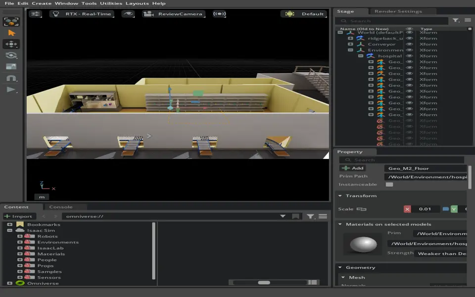
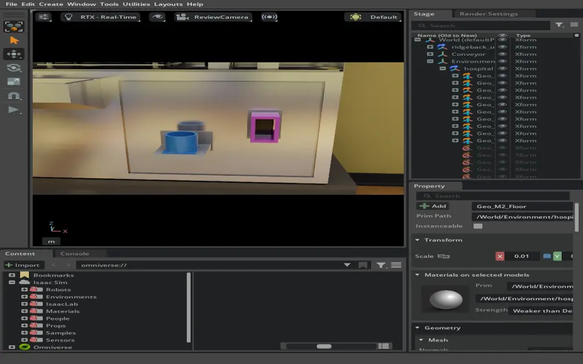

# 실습34 — 9개 선반 물품과 조제기 자동 인수 데모

- 2026-09-22 master02 (`IsaacSim07`), Isaac Sim 5.1. 임재범 요청.
- 기반 main `3a809fc` (#484 병원과 #485 조제기 포함). 새 opt-in `inlet_capture.py`와 `workcell_preview.py`를 열린 #484 검토 stage에 로드했다. 실행 당시 새 기능은 미커밋 작업본이며 아래 PR의 소스가 그 결과물이다.
- 범위: **KINEMATIC_INTAKE_FIXTURE**. 실제 로봇 파지·운반, 접촉·흡입력 physics, ROS/생산 재고 연동은 미실행. 물품을 시험 위치에 배치하는 장치가 그리퍼 해제/각도 입력을 대신한다.
- 코드·명령: [병원 조제실 데모](../../sim/standalone/hospital-workcell.md). 이번 실행은 기존 뷰어에 `IntakeDemo(stage, output).subscribe()`를 붙이는 경로이며 새 CLI 전체를 재기동한 검증은 미실행이다.

## 배치와 기대 동작

실제 선반 메시의 수평 윗면 삼각형 면적을 합산해 0.9 m에 가장 가까운 판을 선택했다. 선반 67의 후보 높이는 0.172/0.504/0.878/1.253/1.627 m, 선택은 0.878 m다. 각 선반을 개별 측정했고 `items.json`에 좌표를 남겼다. 선반 9개에 원통 약통 9개와 모듈 9개를 놓았다.

투입구에서 물품 종류·정렬·해제·속도가 0.25초 연속 조건을 만족하면 1초 동안 중심을 맞추며 안쪽으로 0.20 m 끌어들인다. 알약은 아래쪽, 모듈은 +Y 방향이다. 완료하면 숨기고 데모 내 ID를 한 번만 수납 처리한다. 잘못된 종류, 잡은 상태, 오정렬, 영역 밖은 거절해야 한다.

물품은 시험용 단순 도형이다. 실제 병원 약통 모델의 적합성이나 조제기 내부 물리 통로가 확인된 것이 아니다. 수납 애니메이션은 시각 모델의 바닥/내벽을 통과한다.

## 첫 회차 — 전체 22개 케이스

정상 18/18, 거절 조건 4/4, 총 22/22 기대 결과. 시간은 `fixture_placed`에서 `case_result`까지 벽시계 경과이며 흡입시간만을 뜻하지 않는다. 프레임 지연에 따라 조금 길어진다.

| 물품 | 입력 조건 | 경과 s | 마지막 gate 이유 | 판정 |
| --- | --- | ---: | --- | --- |
| shelf_67_module | held | 0.836 | held | PASS |
| shelf_67_module | misaligned | 0.805 | misaligned | PASS |
| shelf_67_pill | outside | 0.806 | outside | PASS |
| shelf_67_pill | wrong_kind | 0.804 | wrong_kind | PASS |
| shelf_67_pill | normal | 2.106 | capture_started | PASS |
| shelf_67_module | normal | 2.102 | capture_started | PASS |
| shelf_68_pill | normal | 2.102 | capture_started | PASS |
| shelf_68_module | normal | 2.105 | capture_started | PASS |
| shelf_69_pill | normal | 2.103 | capture_started | PASS |
| shelf_69_module | normal | 2.107 | capture_started | PASS |
| shelf_70_pill | normal | 2.101 | capture_started | PASS |
| shelf_70_module | normal | 2.103 | capture_started | PASS |
| shelf_71_pill | normal | 2.102 | capture_started | PASS |
| shelf_71_module | normal | 2.101 | capture_started | PASS |
| shelf_72_pill | normal | 2.112 | capture_started | PASS |
| shelf_72_module | normal | 2.134 | capture_started | PASS |
| shelf_73_pill | normal | 2.101 | capture_started | PASS |
| shelf_73_module | normal | 2.108 | capture_started | PASS |
| shelf_74_pill | normal | 2.105 | capture_started | PASS |
| shelf_74_module | normal | 2.110 | capture_started | PASS |
| shelf_75_pill | normal | 2.101 | capture_started | PASS |
| shelf_75_module | normal | 2.103 | capture_started | PASS |

거절 케이스는 capture_started가 없고 예상 거절 이유가 유지됐는지 확인했다. 정상은 capture_started 뒤 프레임별 위치 기록과 stored가 있는지 확인했다. 숨김은 실제 수납 센서 판정이 아니라 데모의 결과다.

## 두 번째 회차 — 투입구 확대 보기

원통·모듈 정상 수납 2건을 확대 화면으로 반복했고 2/2 통과했다. 초기 trial_ready는 기본 22개 일정으로 생성됐고 시작 전 일정을 2개로 좁혔다. 실제 분모는 summary.json의 case_result 2개다. 첫 회차와 분모를 합쳐 24개 독립 종류 시험이라고 해석하지 않는다.

실습 종료 후 화면 표시용으로 물품 18개를 선반에 다시 놓았다. 이 재배치는 생산 재고 이벤트를 만들지 않으며 `display-reset.json`에 별도로 적었다.

## 자동 검사와 한계

- 수납 상태 L1 6개: 완료 중복 방지, 거절 시 대기시간 재시작, busy, reset 취소, 시간 역행 거부, 원통 방향, 잘못된 설정 포함.
- 저장소 unittest 188개 통과. sim unittest 645개 통과(13 skipped).
- repository/evidence 구조 검사, Ruff, git diff 검사 통과.
- Isaac에서 신규 데모 어댑터 실행·로그·화면·영상 확인. 실제 로봇/물리 L3와 전체 standalone CLI 경로는 미실행.
- 기존 그리퍼 원본의 unresolved-reference 경고는 남음. 물리 실행을 시작하지 않았다.

## 화면·영상·원본

외부 원본 디렉토리: `/home/rokey/markle_tmp/m2-pr484-test/`. 이벤트에는 순번·경과시간·물품 ID·조건·거절 이유·프레임별 흡입 위치·완료·케이스 판정이 있다. `intake-artifacts.json`에 전체 원본의 크기·SHA-256을 저장했다.

| 원본 파일 | 크기 B | SHA-256 |
| --- | ---: | --- |
| intake-trial-01/intake-events.jsonl | 219873 | 6fe0493779fb0db3b19312dca5d87932411f7ea9d1e759def921c45355dccb26 |
| intake-trial-01/summary.json | 3358 | 6193e8c0aa789cf40e8c0026bbf2ec11c945fd50da10c149bee6e2fd66195f9c |
| intake-trial-01/items.json | 2364 | 93177fb60eefb27e71d7ac9c89da0d0b0ecf5b90d7751129d37b0490a6175d7b |
| intake-trial-01.mkv | 19977179 | 41cad84b2def631fa071c339f93fc03df7217b557a0613842a977bdb461320c4 |
| intake-trial-02/summary.json | 436 | d1c0b04a68dd8020985cb88a779903924760c87d8d2ccb2771820d2a39e9cae6 |
| intake-trial-02.mkv | 3184561 | 54999098998b82818efe027d33e748c0461316270ca2a3bd2038a8f795acfc4a |
| shelf-items.png | 328919 | e6514230df626be3b7e9fb8676d478551929a7ce2e73a89c670fc80ff8baa857 |
| intake-closeup.png | 381922 | a256bb08cebb2a5f374ba16fd7fd4eff0fe3c16535b4eae3d5660eac42b132c1 |

녹화는 각 회차 `intake-trial-01.mkv`, `intake-trial-02.mkv`이며 물품 시험 배치/수납 시각 동작이다. 로봇 운반 영상으로 사용하지 않는다.
