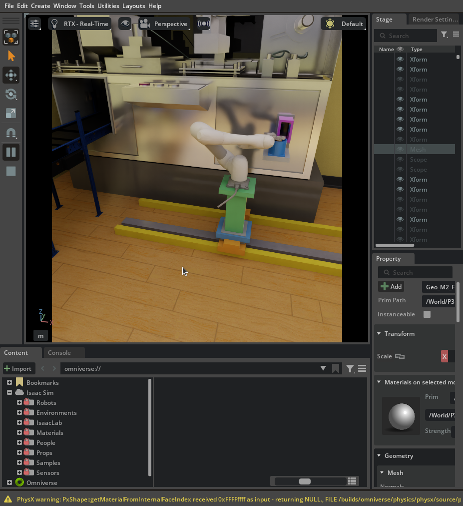

# 실습37 — 심월드 원통 3회 이송 관측과 미해결 항목

2026-09-22, master02(IsaacSim07). 임재범이 화면을 보며 실행을 요청했다.

**원통 3회는 거리 기반 attach·round 위치 해제·홈 복귀를 관측했다. 전체 통합 합격은 아니다.** 레일 속도 초과, 모듈 접근 간섭, 내부 흡입 동작 미구현이 남았다. #490 최신 코드의 검증 결과로 전용하지 않는다.

## 실행 대상과 조건

- stage·trial client: `c27d0d008ab4fe548be2986847a60d8fab8355ee`, 실행 시 clean.
- ROS 제어기: 기존 실습 설치본 `20260922-practice31-321c069`. arm PID 411637, 실행 직전 wall timestamp `1790064036.0394576`.
- Isaac 시작 직전 wall timestamp `1790068653.503471`; ROS_DOMAIN_ID 151.
- #490 후속 `2db6375`는 충돌 영역 축약·캐시 준비 상태·오래된 홈 상태 문제를 검토 댓글에 남겼고 이번 실행에 배포하지 않았다.
- 기존 ROS `/m0609/refill` 제어기가 셀 선택과 경로·팔·레일 명령을 전담했다. 자체 시연 IK를 쓰지 않았다.
- seed `835258728`, `preferred_first`, 9개 원통 칸, 재스폰 600 sim s, 레일 속도 설정 0.8 m/s·가속도 1 m/s², clearance 0.01 m. 노드 90 sim s 및 클라이언트 240 wall s 제한을 유지했다.
- 노드를 살려 둔 채 같은 geometry로 사전 계획을 완료했다. 1882.9 wall s 후 원통 9/9 계획 가능, 모듈 0/9. 준비 중에는 clock·관절 피드백·goal 없이 inventory만 공급했고 GUI 실행 전 준비용 발행기를 종료했다.
- 실제 inventory와 로컬 배치의 geometry 일치, 단일·진행 중 clock, 최근 홈 상태를 클라이언트가 검사한 뒤 goal을 보냈다.
- 기록 구간: `2026-09-22T09:21:31.730706+00:00`부터 `2026-09-22T09:24:08.115217+00:00`. GUI 카메라는 임재범이 관찰 중 변경했다. 녹화는 첫 goal 전 시작하고 3회 종료 후 닫았다.

## 회차별 관측

| 회차 | 선택된 칸 | attach sim s | round 해제 sim s | 액션 결과 | 결과 이후 홈 |
| --- | --- | --- | --- | --- | --- |
| 1 | shelf_74/r0c0 | 217.850 | 238.100 | success=true | true 관측 |
| 2 | shelf_75/r0c0 | 261.250 | 282.633 | success=true | true 관측 |
| 3 | shelf_69/r0c0 | 299.750 | 314.567 | success=true | true 관측 |

동일 seed 한 배치의 중복 없는 3개 선택이다. 일반적인 성공률이나 모든 선반의 실동작 검증으로 해석하지 않는다. #489 요약기로 액션·선택 셀·stage attach·동일 셀 round 해제·홈을 대조해 `completed_three=true`를 얻었다. 이 플래그는 속도 준수나 흡입·물리 파지를 검사하지 않는다.

## 실제 실습 화면

1회차 진행 중 Isaac Sim 창을 캡처했다. M0609·레일·원통/모듈 투입구의 배치와 접근 자세를 보여준다. 이 한 장으로 해제·홈 복귀·흡입 완료를 판정하지 않으며, 회차 결과는 위 로그 대조를 따른다. 문서 표시용 사본은 외부 원본 `trial1-screen.png`와 바이트가 같고 원본 해시는 아래 표에 있다.

## 실패·제한과 후속 수정

1. **속도 요구 미충족:** 실제 `/m0609/rail/joint_states` 4627표본에서 절댓값 최대는 X=2.3047783375, Y=0.1045115590, Z=0.6524655819 m/s. X가 설정 0.8을 초과했다. 순간 보고 속도와 위치 차분·명령 궤적을 대조해 원인을 교차 검증해야 한다. drive·제어기 원인은 아직 확정하지 않았다. clock 7314표본, 역행 0회.
2. **모듈 경로 실패:** 사전 계획에서 `link_2-RoundBinRim14` 여유 0.006 m로 0.01 m 기준 미달. 모듈 실동작은 미실행. 원통 투입구와 모듈 접근 동선 간섭을 모델 배치·경로로 해결해야 하며 clearance를 낮추지 않았다.
3. **내부 흡입 미구현:** 현재 stage는 놓는 순간 `judge_target`으로 위치를 판정하고 나중에 선반으로 재스폰한다. 투입구에서 조제기 내부로 인수하는 움직임이나 도킹 완료 확인은 없다. 앞선 시각 데모의 인수 동작이 이 ROS 통합 경로에 연결되지 않았다.
4. **물리 파지 미검증:** TCP와 물품 거리 조건으로 부착하고 자세를 따라간다. 마찰 파지·접촉 안정성 및 3개 수납 용량/누적 충돌을 입증하지 않는다.
5. **반복 PhysX 경고:** `PxShape::getMaterialFromInternalFaceIndex ... 0xFFFFffff ... returning NULL`이 stage 로그에 반복됐다. 이것만으로 팔 충돌이라고 판정하지 않았다. 원인 미확정.

#490 머지 보류를 유지한다. 배치 좌표와 자산 경로는 로컬 입력에만 남겼다. 공용 로직 수정은 별도 코드 변경과 교차 검증이 필요하다.

## 기록 범위와 원본

이번 기록은 진단 실습 관측이다. 실행 전 정식 run ID가 배정되지 않았고 사전 계산이 31분 소요돼, 기존 frozen pilot의 900초 제한에 적합한 정식 시행이라고 소급 등록하지 않는다. acceptance나 독립 리뷰 완료를 주장하지 않는다. 이전 실패 시행을 대체하지 않는다.

원본 작업 폴더는 master02 `/home/rokey/markle_tmp/m2-pr490-l3-10`. 종료한 클라이언트 원본·영상과 배치 종료 시점의 stage/arm 로그 스냅샷을 외부 저장소 `/home/rokey/markle_tmp/hospital-evidence-store`의 `sha256/<아래 해시>/<파일명>`에 복사하고 해시를 재확인했다. stage 자체는 임재범의 화면 관찰을 위해 켜 두었다. 추가 goal은 보내지 않았다. 원본·외부 복사본은 같은 PC이므로 타 장비 백업/공유 접근 검증은 미실행이다.

| 파일 | SHA-256 | bytes |
| --- | --- | ---: |
| `stage.log` | `77d0a053070c6392f6092b2703d462b39d894716c58c390486e47fa2c1b274a0` | 170335993 |
| `arm.log` | `c1cb09753d5704f068a724e376283d429a1e34af26b6ff96dbc55e46c49dda0c` | 10736 |
| `events.jsonl` | `fb2350860ff61f1c3239d79f6133834285ed528d988e2817921e650606309cec` | 6642389 |
| `results.json` | `4d5302d650e8913ba379d17b8672719d912b97ed18977a9d757f6e149a90a606` | 1228 |
| `preflight.json` | `f7b4821c8b8fde15d8aa5296a329ccc0bf200d6a1cb66dcf28db1d81a2f9ac1f` | 276 |
| `trials.log` | `019b67ebb57949f46d8676842dfdd22092305d9b0e3569797f0878e2fe34305c` | 1005 |
| `summary.json` | `2ec9992f562b4f7b5c193eaaf890dd51f529390440fe1dd1da7f7cbd349501a8` | 1055 |
| `deployment.json` | `5ef5db6feca6402fdf0dfe75acfa19e957a8f57b7cf915b5cbcc7cffff294569` | 455 |
| `workcell.local.json` | `7fb6c613d332e3570443d09865a85ae473e51aed3233ab8ba47a2ad2fe210ff1` | 73494 |
| `launch-stage.sh` | `91f1007d496ef7a01a84dea648f412bebd905156b177b3dfdcf334de75d4319a` | 1273 |
| `trials.mkv` | `a1581310a9a039cb3efeefeab79273d3e26317033398fa7f34c3f5ac70d685e9` | 54432502 |
| `trial1-screen.png` | `0b444518d26df8959a7d72b05104e92ee65e1f99005ae28f301d27aa7178bcbe` | 691006 |
