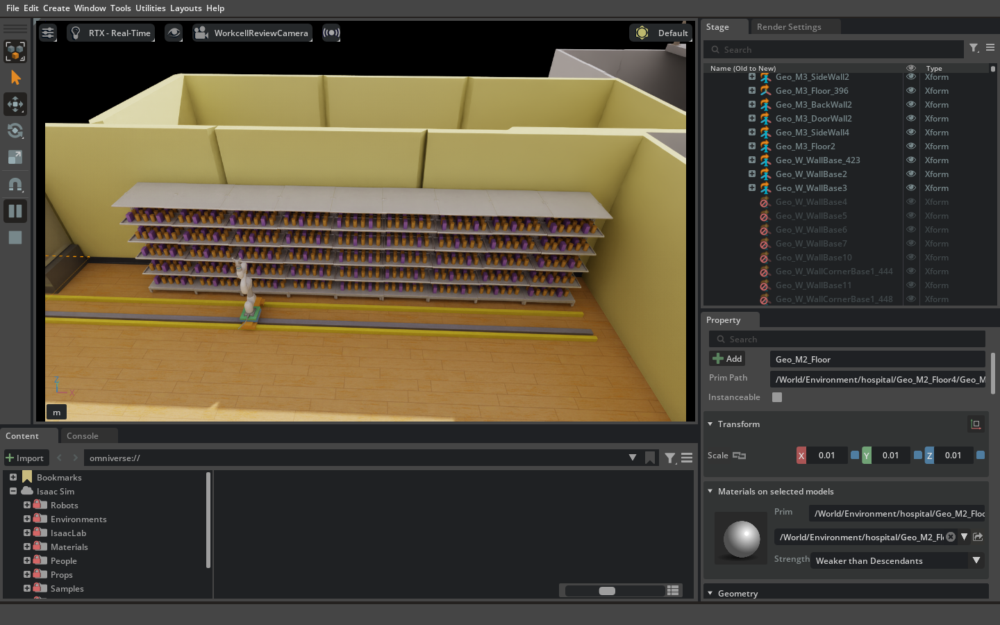
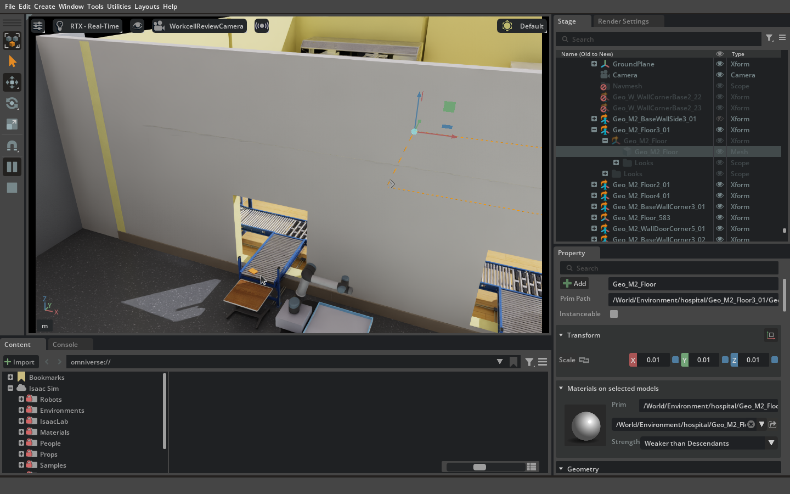
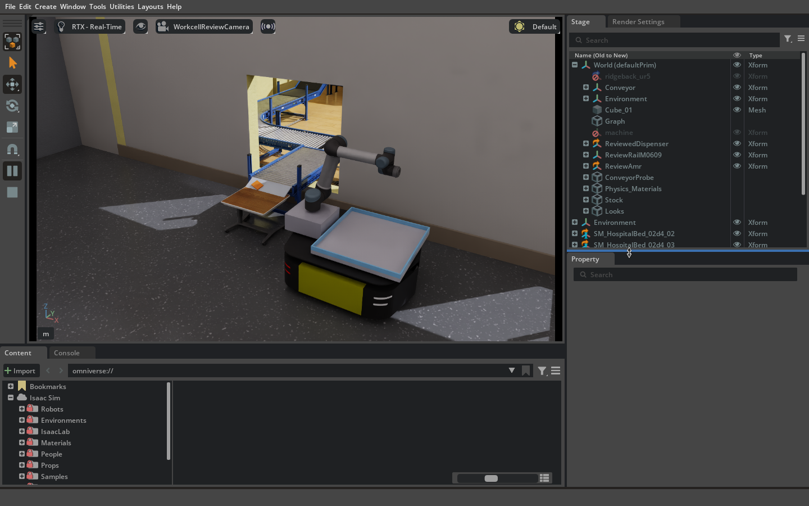
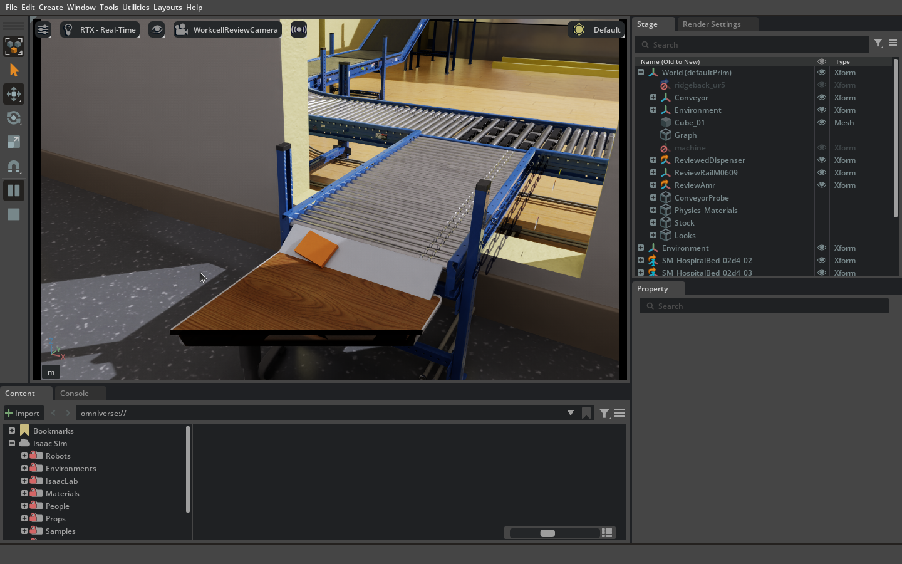

# 실습38 — 혼합 진열·실제 벨트 진단과 전체 루프 연결 준비

| 항목 | 값 |
| --- | --- |
| 날짜 | 2026-09-22, master02 |
| 실행 | `master02` 원격 실행, 재범 화면 관찰 |
| 환경 | #484 병원 + #485 원형 조제기(#496 반영) |
| 실행 코드 | `4f6e049005e4ada12f361960a53db09192c7fa79` 위 `feat/hospital-single-amr` 미커밋 변경으로 probe01–04 실행. 최종 SHA L3로 간주하지 않음 |
| 상태 | 진행 중. 전체 루프 미실행, 벨트 끝단 도달 판정 정정 필요 |
| 원본 | master02 외부 `markle_tmp/m2-hospital-conveyor-probe-01`부터 `-04`까지, `m2-original-intakes-practice-01` |

이 문서는 실습 관찰·중간 인계 기록이다. frozen protocol의 합격 evidence가 아니다. 기존 실습37과 원본 결과 파일은 수정하지 않는다.

## 재범 요구와 사람이 본 것

보고 싶은 것은 전체 루프다. 서로 다른 선반의 원통을 기존 알고리즘으로 무작위 3회 집고, 조제·벨트·AMR 적재·저장소의 Nav2 배송·복귀까지다. 재범은 9개 선반 모든 층을 채우라고 했다. 약 1/4은 보라색 사각 모듈, 나머지는 원형 약품이다. 기존 실습 AMR 합본은 출구 네 곳 중 한 곳 옆에 먼저 한 대만 둔다.

재범의 추가 관찰: **“컨베이어 벨트에서 약도 끝까지 내려가지 않던데?”** 이를 후속 관찰의 시작점으로 삼는다. 속도보다 구간별 확인과 기록을 우선한다. 화면 녹화 요청 이전 구간은 녹화되지 않았다.

## 로그로 확인한 범위

- 조제기 기준 SHA-256 `cd2591a821d96e44e3a0a90ef66ee33e6fd1b432582618163094bb22242ddaf2`, 열린 stage 메시·앵커 340개 검사 PASS. 입구 위치 변경 없음.
- 이전 실습의 `amr_base.reference`·팔 받침·밑동 프레임·트레이 생성 코드를 재사용해 합본 한 대를 배치했다. 이 회차에서는 로봇 관절·강체를 고정했다. 적재/주행 검증이 아니다.
- 9개 선반 × 5층 × 30개 = 1,350개. probe04는 모듈 338개·원형 1,012개. 후열은 전열을 치우지 않고 접근 가능하다고 간주하지 않는다.
- 기존 병원 `IsaacConveyor` 대상 강체 19개를 활성화해 시험 봉투 하나를 물리 이송했다. 물품 위치 재생/순간 이동 방식이 아니다. 조제기 내부에서 생성된 실물 주문 봉투는 아니다.

| 회차 | 입력 차이 | 로그 결과 | 해석 |
| --- | --- | --- | --- |
| probe01 | 원본 곡선 속도, 18개 진열 | 90 sim s timeout, 곡선 진입부에서 멈춤 | 실패 |
| probe02 | 첫 곡선 속도 부호 반전(로컬 후보), 18개 | 33.667 sim s `at_end_settled` | 아래 정정 적용 |
| probe03 | 1,350개 원형 진열 | 동일 33.667 sim s | 아래 정정 적용 |
| probe04 | 모듈 338 + 원형 1,012 | 동일 33.667 sim s | 아래 정정 적용 |

### 벨트 판정 정정 — supersedes 초기 구두 “끝까지 통과” 보고

`at_end_settled`는 임의 지정 end 좌표 반경 0.18 m에 진입하면 모든 벨트를 정지시키고, 같은 영역에서 1초 뒤 속도 0.03 m/s 미만인지 보는 **진단 조건**이었다. 실제 마지막 롤러/벨트 끝단이나 AMR 파지 위치와 대조하지 않았다. 따라서 probe02–04의 `success=true`를 **실제 출구 끝 도달 또는 적재 가능 판정으로 사용하면 안 된다.** 실제 정지 위치와 USD의 끝단을 다음 회차에서 대조한다. 기존 JSON은 당시 결과 그대로 보존한다.

첫 곡선 속도 부호 변경으로 이송이 진행된 것은 관측이다. 음수 스케일과의 인과관계는 아직 가설이며 공용 속도 설정으로 확정하지 않는다. 나머지 세 출구는 미검증이다.

## 원통 3개 사전 계획 실패

`c27d0d0` 기존 `scene_v2` 계획기, `first_feasible`, seed 835258728. 앞열 원통 후보 202개. 각 대상 이외의 1,349개 물품을 장애물로 더해 기존 고정 장애물 포함 1,498개로 계산했다. ROS goal 전송/Isaac 파지는 0회다.

| 선택 셀 | 결과 |
| --- | --- |
| SM_MedShelf_01d_74/r3d0c5 | 파지 레일 후보 3/4: IK 또는 여유 부족 |
| SM_MedShelf_01d_72/r0d0c1 | 파지 레일 후보 0/0: 현재 한계·도달 조건에서 후보 없음 |
| SM_MedShelf_01d_75/r1d0c1 | 파지 레일 후보 3/4: IK 또는 여유 부족 |

이것은 성공 가능한 칸만 골라 실행한 결과가 아니며, 실제 무작위 3회 L3 실패 횟수와도 구분한다. 최초 18칸 사전 계산은 진열 변경으로 취소됐다. 코드화한 재현 도구의 새 실행은 별도 파일로 기록한다.

## 전체 루프 연결 상태

- #490 최신 head `1dd8be5c51de5e9ecbb47e4a5bd1373255a9a994`도 `workcell_layout.load`가 18칸(선반당 원통·모듈 하나)을 요구한다. 1,350개를 현재 통합 런타임에 그대로 투입할 수 없다.
- Git의 Nav2 launch/config는 있고 Jazzy Nav2 설치를 확인했다. 현재 장면은 ROS off이며 `/clock`, `/amr_1/scan`, odom·TF·base 명령 연결을 하지 않았다. 과거 로컬 지도는 있지만 #484 배치와 일치 여부 미검증이다. 고정 waypoint 실행을 Nav2로 보고하지 않는다.
- 웹 관제는 기존 구현과 실습 기록이 있다. 이번에 현재 브랜치 backend를 `mode=ros`, 명령 비활성으로 localhost:8000에 시작했다. snapshot은 clock alive=false, trip/dispenser/belt=null이다. 서버 실행과 심월드 실시간 연결 완료는 다르다.

## PR 계획과 재개 순서

1. **배치·진단 PR:** 합본 한 대, 전 층 혼합 진열, 기존 물리 벨트 진단, 실제 화면, 원통 사전 계획 재현 도구를 올린다. 현장 좌표·절대 자산 경로는 외부 입력으로 남긴다.
2. **벨트 문제:** 실제 마지막 롤러 끝단, 진행 방향, 정지 위치를 측정한다. 구간별 영상/좌표로 걸림과 조기 정지를 구분한다. 끝단 판정을 수정한 후 같은 입력으로 재실행하며 원본 실패는 유지한다.
3. **파지/재고 연결:** #490에 18칸 제한·최하단 도달·주변 물품 장애물 포함 시 실패를 교차검토 요청한다. 알고리즘/레일 한계 변경은 근거와 별도 검증을 동반한다.
4. **Nav2 연결:** 최신 병원 지도와 센서·TF의 작성자/이름을 확인한 후 이동·정지·복귀를 검증한다. 적재·하차·실재고 이벤트와 연결해야 전체 루프다.
5. 각 단계의 성공/실패·미실행을 기록하고 코드/테스트를 먼저 push한 뒤 PR 댓글을 남긴다. 자기 PR 승인/병합은 하지 않는다.

## 녹화와 인계

연속 녹화는 외부 `markle_tmp/m2-hospital-single-amr-01/screen-from-user-request.mkv`에 보존 중이다. 녹화 요청 이전은 누락이며, 이후 실제 영상 프레임 디코딩을 확인했다. 최종 종료 후 해시를 남긴다. Isaac 재시작과 별도로 녹화를 유지한다.

현재 실제 화면은 probe04의 혼합 진열이며 시험 종료 후 벨트는 멈춘 상태다. 다음 작업은 **끝단 기하 측정과 조기 정지 원인 대조**다. 이 중간 기록의 체크포인트 이후 결과는 새 절로 추가한다.

## 체크포인트 2 — 실제 끝단 측정과 재실행

첫 출구 `ConveyorTrack_02/Rollers_01`의 끝단을 실제 USD에서 측정했다. 초기 정지 상태는 봉투 앞면이 끝단보다 약 0.26 m 앞이었다. 새 진단은 마지막 롤러 전체 XY 지지, 방향별 앞면과 끝단 간격, 표면 높이를 함께 검사한다. `edge_margin_m=0.03`, `height_tolerance_m=0.02`는 이번 로컬 진단 후보이며 생산 도착/적재 합격선이 아니다.

- probe05: 30.150 sim s에서 앱 종료. 마지막 봉투 앞면-끝단 간격 0.881 m, 결과 파일 없음. **중단/미완료**이며 종료 주체·원인은 확인되지 않았다. 영상은 계속 녹화됐다.
- 앱 종료 시 미완료 JSON을 남기고 기존 완료 결과를 덮어쓰지 않는 처리와 테스트를 추가했다.
- probe06 시작 SHA: `9b0ce16bb2b15786ee6ee36f753fc797bab92530`. 같은 장면/혼합 진열/벨트 입력으로 재실행. 결과는 아래 후속 절에 추가한다.
- 사전 계획 재현 CLI: `repro-three-distinct.jsonl`, 입력 해시 `337ae3d2e0b8b4d4763212e360d903e01cf057cbaf3bc469506e0d14ffb14fb5`. 같은 seed에서 서로 다른 선반으로 중복 제외한 선택은 `74/r3d0c5`, `72/r0d0c1`, `73/r0d0c1`이며 모두 계획 실패(3/4, 0/0, 0/0). 물리 goal 전송 0회.

## 체크포인트 3 — 재범 사진: 빠진 출구 경사 연결부

재범이 “컨베이어 벨트 끝부분에 경사가 없어”, “이렇게 걸림”과 사진으로 지적했다. **문제는 평평한 마지막 롤러에서 아래 갈색 받침대로 내려가는 경사 연결부가 없는 것**이다. 초기 진단은 이 인계 구간을 놓쳤다. 위 끝단 정지 진단만으로 재범이 지적한 문제를 해결했다고 하지 않는다.

probe06(`9b0ce16`)은 34.567 sim s에 마지막 롤러 끝 0.01997 m 앞에서 정지했다. 이는 평평한 롤러 위의 결과이며 **받침대 배출/AMR 적재는 미완료**다. 실제 mesh에서 롤러 상면은 약 0.38465 m, 받침대 상면은 약 0.32493 m로 높이 차 약 0.05972 m, 수평 간격 약 0.04402 m를 측정했다. 끝까지 배출하려면 이 간격과 단차를 잇는 형상/충돌 연결이 필요하다.

후속 수정: 측정한 롤러와 받침대 사이에 경사 연결부를 만들고, 봉투가 **받침대 위로 완전히 이동해 정지**하는 것을 새 진단 종료 조건으로 삼는다. 마찰 등 시험 후보를 실측 상수로 주장하지 않는다. 기존 평평한 끝단 결과 파일은 보존한다.

## 체크포인트 4 — 경사 연결부 구현

probe07 시작 SHA: `553c95d`. 수동 경사판은 마지막 롤러/기존 받침대에서 기하를 계산한다. 후보는 롤러 0.01 m 겹침, 받침대 0.15 m 겹침, 폭 여유 0.01 m, 두께 0.01 m, 정지/동 마찰 0.20/0.15다. **마찰은 측정값이 아니라 명시한 진단 후보다.** 경사판은 충돌 mesh이며 물품에 위치/속도 명령을 내지 않는다. USD in-memory 형상·물리 재질 바인딩 검사와 경사 연결/받침대 판정 회귀 시험을 먼저 통과했다.

이 회차는 사용 중인 첫 출구 하나를 대상으로 한다. 다른 세 출구의 경사 형상·분기 이송·AMR 인계는 아직 미검증이다. 결과가 나오기 전에 배출 성공으로 기록하지 않는다.

## 체크포인트 5 — 경사판 입구 걸림 재현과 보정 후보

- probe07 / `553c95d`: 준비 중 프로세스가 `Killed`로 종료, ready/최종 결과 없음. 원인 미확인. 커널 로그 검색에서 OOM 근거는 찾지 못했으며 이를 자원 문제나 수동 종료로 단정하지 않는다.
- probe08 / `17fd223`(실행 코드 동일): 최종 success=false다. 경사판은 붙였으나 봉투 앞면이 시작 모서리에서 멈춰 **90.000 sim s timeout**. 받침대에는 안 닿았다. 끝단 판정은 true였으나 받침대 도달 판정은 false여서 `receiver_settled` 결과를 기록하지 못했다. 받침대 판정이 필요한 이유가 이 회차에 보인다.
- 경사판 시작면 0.38465 m, 봉투 밑면 약 0.38393 m. 차는 약 0.72 mm다. 이 모서리 단차가 걸림 원인이라는 가설이다. 그래서 `entry_recess_m=0.002` 후보만 넣었다. 나머지 마찰/형상/속도는 유지한다.
- probe09 시작 SHA `3089f35`: 위 후보로 재실행. 이전 실패 JSON·사진·영상은 그대로 보존한다.
- PR: #500, Draft. 원통 사전 계획 실패는 #490 댓글에 코드 push 후 보고했다.
- CI / `17fd223`: CI와 Evidence harness 성공. 실제 jobs/steps에서 Ruff·repository/evidence·일반 sim launcher 시험 실행을 확인했다. **colcon과 usd-core job/step은 skipped**이므로 통과로 세지 않는다.

#499는 main에 들어왔지만 Nav2 연결 완료가 아니다. 문서 자체는 아직 검토하지 않은 메모다. 현재 배치의 map·scan·TF 연결로 올리지 않는다. 직접 본 prepared base USD에는 lidar/scan/ROS clock node가 없었다. 이번 실행도 ROS off다.

## 체크포인트 6 — 입구 통과 후 경사면 중간 정지

probe09 / `3089f35`: 받침대에 안착하지 못했다. 2 mm 입구 보정으로 앞 모서리는 지났으나 경사면 중간에서 멈춰 90 sim s timeout. 원인 후보는 경사판 15.80도와 현재 접촉 마찰의 조합이다. 물성 결론으로 확정하지 않는다.

다음 후보는 마찰(0.20/0.15)·입구 보정(2 mm)·속도를 유지하고 받침대 겹침 길이만 0.15 → 0.07 m로 줄여 경사를 높인다. 임의 허용오차 확대나 물품 강제 이동을 하지 않는다. 받침대 안착 조건도 동일하다. 검토 화면의 과노출과 먼 카메라는 기본 검토 조명 및 가까운 출구 카메라로 보정한다.

## 체크포인트 7 — 받침대 경계에서 비스듬히 멈춤

probe10 / `003c451`: **완료 판정을 완화하지 않았다.** 겹침 0.07 m 후보에서도 90 sim s timeout. 앞쪽은 받침대 높이에 닿았고 뒤쪽은 경사판에 걸쳐 비스듬했다. 전체 XY 지지와 평평함은 못 맞췄다.

경사판 재질만으로 접촉 마찰을 판단하면 안 된다. Isaac 5.1 설치 원본 `isaacsim.core.api/objects/cuboid.py`에서 기본 시험 cuboid의 정지 마찰 0.2, 동 마찰 1.0을 확인했다. 이 봉투의 물성은 실물 측정이 아니다. 다음 회차는 봉투·재질·속도를 그대로 둔다. 겹침만 0.03 m로 줄인 더 짧은 경사와 비교한다.

이 파일은 시험 시작 장면이다. 마지막 물리 상태도 아니고 전체 ROS 통합 장면도 아니다. `review.usda`는 초기 배치만 담는다. 진열·경사판을 만든 뒤의 장면은 `probe-review.usda`와 `probe-overrides.usda`로 따로 둔다.

## 최종 체크포인트 — PR #500 교차검토 상태

probe11 실행 SHA `79a2fbe0d245e20c4e84dcd9faf0bcd5d0cae6c0`. **받침대 배출은 미완료**다. 경사 34.49도 후보도 **90.000 sim s timeout**. 앞면은 받침대 높이에 닿았고 뒤쪽은 경사에 걸쳤다. `receiver.supported_xy=false`, `receiver.flat=false`, `success=false`. 경사 연결부는 넣었다. 같은 입력의 반복, 다른 봉투, 나머지 세 출구는 검증하지 못했다.

| 단계 | 최종 상태 |
| --- | --- |
| 원형 조제기/입구 위치 | 340개 검사 PASS, 위치 유지 |
| 전 층 혼합 진열 | 338 모듈 + 1,012 원형 배치, 재개 USD 재개방에서도 수량 확인 |
| 기존 합본 한 대 | 배치 완료, 이번 물리 진단에서는 로봇 고정 |
| 평평한 롤러까지 이송 | probe06에서 확인, 받침대 배출과 구분 |
| 경사 연결부 | 실제 두 표면 기준 형상·충돌 추가, 후보별 실패 보존 |
| 받침대 배출 | probe08–11 모두 timeout. 미해결 |
| 랜덤 원통 3회 파지 | 사전 계획 3개 실패, 실제 goal 0회 |
| 조제·적재·Nav2 배송·복귀 | 전체 루프 미실행 |
| 웹 관제 | localhost:8000 ROS 모드 서버만 실행, 심월드 /clock·상태 미연결 |

### 다음 수정의 재현·검증 계획

1. PhysX 접촉쌍·법선·분리거리와 충돌 메시를 표시해 경사판/받침대 경계의 실제 접촉을 확인한다. 전시 메시 AABB만으로 접촉 원인을 확정하지 않는다.
2. 봉투·경사판·받침대의 바인딩된 재질과 마찰 결합 규칙을 기록한다. 후보 물성을 실측값으로 승인하지 않는다. 기본 봉투 동 마찰 1.0은 따로 대조한다. 그 대조를 정상 배출 성공으로 바꾸지 않는다.
3. 접속부 형상과 수동/구동 배출 설계를 교차검토한 후 최소 수정 PR을 낸다. 원본 받침대·실제 속도·물성·봉투 크기를 함께 포함해 반복 안착 및 실패 복구를 확인한다.
4. 지금 상태를 전체 루프 성공으로 표시하지 않는다. 선행 단계가 실패했다. #490의 다층 재고·레일 도달 검토는 별도 PR이다. Nav2 map·scan·TF·zones 연결도 별도 통합 PR이다.

### 검증과 원본 인계

- root unittest 193 OK, sim unittest 692 OK(23 skipped), repository/evidence 구조/Ruff/diff 검사 PASS. ROS 소스 변경 없음, 이번 colcon 미실행.
- 실행 코드 `79a2fbe`의 CI, Evidence harness 성공. 앞서 확인한 Draft skip 조건은 유지된다. 별도 GPU L3 전체 합격이나 CD 배포 완료가 아니다.
- 재개 파일: master02 외부 `markle_tmp/m2-hospital-conveyor-probe-11/probe-review.usda`. 재개방 검사: Cube 338, Cylinder 1012, 경사판 존재. 준비 장면이며 마지막 물리 상태 파일은 아니다.
- 원본/입력 56개 해시 색인: `markle_tmp/m2-original-intakes-practice-01/artifact-manifest.json`, SHA-256 `5041bb5414388206265463647472c4fd8ca3559ffce5b2cc312fc74da63620c3`. 실패·중단 회차는 삭제/덮어쓰지 않았다.
- 녹화: `markle_tmp/m2-hospital-single-amr-01/screen-from-user-request.mkv`. 1725414806 bytes. SHA-256 `5ff6412686444d9b7d194b3fa5b3b327b5584c342a70f33d77a4b80a8be9b26b`. 요청 이후부터 probe11 결과 확인까지다. 요청 이전 영상은 없다. 파일은 정상 EOS로 끝냈다. 시작 메타데이터는 고치지 않았다. 종료·컨테이너 확인은 `recording-final.json`과 `recording-media-check.json`에 따로 있다.

## 녹화 보완과 마지막 재현 — probe12/13

전체 데스크톱 원본에는 다른 앱이 덮은 구간이 있다. probe12 영상은 **녹화 증거가 아니다.** 창 초기화 중 MIT-SHM BadMatch로 녹화기가 끝나 0 bytes다. 실습 자체는 같은 90 sim s timeout을 다시 냈다. 실패 로그는 보존했다.

probe13은 같은 코드 `b6af054`와 같은 입력이다. 창이 열린 뒤 0.05 sim s에서 잠시 멈췄다. 녹화 파일에 실제 인코딩 프레임이 생긴 것을 본 다음 재개했다. 물리 코드와 입력은 바꾸지 않았다. 같은 위치에서 90.000 sim s timeout을 다시 봤다. 준비 단계의 잠깐 정지는 물리 시간과 벽시계와 다른 일이다.

- 검토 영상: `markle_tmp/m2-hospital-conveyor-probe-13/20260922-practice38-outlet-stall.mp4`
- 길이 53.129초, 1440×900, 15 fps. 벽시계 영상 길이다. 90 sim s와 같은 단위가 아니다. 실시간 속도와 같은 실행이라고 하지 않는다.
- 16311901 bytes. SHA-256 `7c60ae330ae8a5c93c523e8c9b6cbf997585e3329ca20134c033af649d74e5f3`. 원본 MKV는 그대로 둔다. MP4는 재인코딩 없이 remux했다. 마지막 프레임을 디코딩해 Isaac 출구 화면임을 확인했다.
- 추가 원본 8개 색인: `markle_tmp/m2-hospital-conveyor-probe-13/artifact-manifest.json`, SHA-256 `3f96aedcf9a79344b5e7706506c4a0d4d47e2d850ca8dd2c9077b192fa800ca8`. 앞선 56개 색인은 수정하지 않았다.

**최종 인계:** 배출 문제는 미해결이다. 전체 루프는 미실행이다. 다음은 #500 Draft에서 접촉·충돌·재질 원인을 보고 최소 수정을 내는 일이다. 9/22 인계 당시 마지막 실패 장면은 Isaac에 남아 있었다. 녹화 두 건은 정상 종료해 저장했다. 추가 실습은 새 영상과 새 run 폴더로 시작한다.

## 체크포인트 9 — 9/23 열린 PR 점검

실행 완료와 코드·기록 완료를 구분한다.
이 절은 새 물리 회차가 아니며 probe01–13의 결과·SHA·원본은 그대로 보존한다.

### 점검 범위

PR 은 브랜치를 기준으로 대조했다. GitHub `repo:jaebeom/ROKEY_P3_A3 is:open` 검색(최대 100건)에서 열린 PR 5건을 받았다. 각 PR의 최신 SHA와 상태도 조회했다.
검색 시점의 목록이며 이후 생성·종료된 PR까지 포함한다고 주장하지 않는다.

| PR | 브랜치 | 이번 처리 |
| --- | --- | --- |
| #500 | `feat/hospital-single-amr` | 이번 수정 대상. 충돌·문서 피드백·정착 진단 수정 |
| #504 | `fix/sim-hospital-route-door-margin` | 변경하지 않음 |
| #508 | `fix/nav2-hospital-localization` | 변경하지 않음 |
| #509 | `fix/sim-pouch-qr-order-id` | 변경하지 않음 |
| #511 | `fix/navigation-fleet-shutdown` | 변경하지 않음 |

#510은 이 시점에 이미 머지됐으므로 열린 PR 목록에서 제외했다. #510 완료를 #500 전체 작업 완료로
보고한 것은 잘못된 상태 전달이었다. #500의 배출·파지·전체 루프 미완료는 계속 추적한다.

### 완료한 수정

- `origin/main` `53a260bd32dc0c4c39b9f53804359a723194c129`을 #500 브랜치에 병합했다.
  `hospital-workcell.md`의 충돌은 기존 ROS 연결 안내와 이번 진단 설명을 모두 보존해 해소했다.
- 가독성 검토 제안 25건을 검토·반영했다. SHA·수치·원본 결과는 유지했다.
  제안 중 `receiver_settled=false` 표기는 실제 JSON 필드가 아니므로 “받침대 도달 판정 false”로 썼다.
- 실습38이 별도 표로 갈라지던 빈 줄을 제거하고 전체 실습 색인에도 링크를 추가했다.
- 최초 도착 시각을 정착 시간으로 재사용하는 진단 결함을 수정했다. 도착 뒤 이탈·재진입하거나
  받침대 위에서 움직이다 멈추면, 기존 코드는 충분한 정착 관측 없이 성공을 기록할 수 있었다.
  이제 **해당 모드의 도착 조건과 속도 0.03 m/s 미만을 연속 1초 만족**해야 한다.
  이탈·이동 시 정착 시간을 처음부터 센다. 생산 합격선과 기존 실패 기록은 변경하지 않았다.
- 미완료 상태에서 앱 종료 시에도 벨트 속도 입력을 0으로 만든다. 종료 결과를 덮어쓰지 않는 동작은 유지한다.
- 기존 `435ce1d` 코드를 새 회귀 시험에 대입하면 재진입·이동 중 정착·abort 정지의 3개 검증이 모두 실패했다.
  수정 후 probe 시험 11개가 통과했다. 이는 대역을 사용하는 단위 시험이며 물리 L3가 아니다.

### 남은 작업과 검토 의견

#500 검토 댓글은
진단 도구·실패 기록의 가치와 실제 배출 해결을 구분했다. 마지막 롤러에서 직접 파지하는 안,
받침대까지 구동 롤러를 연장하는 안은 제안이며 이번 수정에서 채택·구현하지 않았다.
받침대를 끄거나 픽 목표를 바꾸면 재범 요구와 현장 배치가 바뀌므로 결과 판정만 바꿔 통과시키지 않는다.

| 미완료 | 다음 확인 | 이번 상태 |
| --- | --- | --- |
| 받침대 배출 | 배출 방식 결정 후 실제 접촉·충돌/재질 진단, 새 회차와 녹화 | 미해결 |
| 정착 보강 코드의 Isaac 동작 | 새 SHA로 timeout·정상 정착·앱 종료 확인 | L3 미실행 |
| 전 층 혼합 진열 원통 3회 | #490의 18칸 전제와 혼합 1,498 장애물 전제를 대조하고 경로 계획 재검토 | 기존 사전 계획 3/3 실패, 실제 파지 미실행 |
| 조제·AMR 적재·Nav2 전체 루프 | 선행 배출·파지와 주행 PR 검증 후 통합 | 미실행 |
| 머지 | 최신 검사와 보호 경로 검토, 실제 병합 상태 재확인 | 이번 점검에서 머지하지 않음 |

점검 중 다른 `pharmacy_stage.py --preset hospital-nav` 실습이 master02에서 실행 중임을
프로세스 명령줄로 확인했다. 해당 프로세스를 중단하거나 장면을 바꾸지 않았다. 이번 수정에 대한
물리 L3는 실행하지 않았으며 기존 probe13 실패를 새 코드의 실행 결과로 인용하지 않는다.

### 로컬 최신화

주 작업 폴더 main도 `53a260b`로 fast-forward했다. 기존 미커밋 실습31 문서의 SHA-256 일치와
색인의 추가 1행 보존을 확인했다. 백업은 `master02:/home/rokey/markle_tmp/main-sync-20260923/`에,
보존용 stash는 로컬에 유지했다. 이 로컬 변경을 #500에 섞지 않았다.

### 이번 수정 검증

저장소 검사·evidence 구조 검사·루트 unittest 193개·Ruff·diff 검사를 통과했다.
usd-core가 있는 환경에서 sim unittest 737개를 실행해 3개 skip으로 통과했다.
skip은 `P3_RUN_ROS_TESTS=1`일 때만 실행하는 ROS 통합 시험 3개다.
ROS 제품 코드는 main 병합분 외에 변경하지 않았고 colcon 재실행은 하지 않았다.
신규 물리 L3는 미실행이다. 이 결과를 받침대 배출 성공이나 전체 루프 완료로 해석하지 않는다.

원본 PR 조회, 이전 코드 회귀 실패, usd-core 시험 로그는
`master02:/home/rokey/markle_tmp/pr500-audit-20260923/`에 보존했다.
`validation-manifest.json`에 파일 크기와 SHA-256을 기록했다.

## 체크포인트 10 — 정착 L3와 SIGINT 결과 누락 수정

9/23 10:49-10:57 KST, master02에서 창 모드로 수행했다. 아래는 새 물리 회차다.
이전 체크포인트의 “이번 L3 미실행”은 그 시점의 기록이며 이 절에서 새 실행을 추가한다.

| 실행 코드 | 회차 | 결과 | 범위 |
| --- | --- | --- | --- |
| `84742dec6454115d07dc5229ece76ba459e75f6b` | terminal | 34.616668 sim s, `terminal_edge_settled`, 앞면 간격 0.019986 m | 롤러 끝 정착; 받침대 배출·파지 아님 |
| 같은 SHA | receiver | 90.000005 sim s, `timeout`, `supported_xy=false`, `flat=false` | 기존 받침대 경계 걸림 재현. 성공으로 오판하지 않음 |
| 같은 SHA | abort | 약 5.25 sim s에 SIGINT 요청, exit 0이나 결과 JSON 미생성 | **새 결함 발견**. 성공이나 정상 기록 완료가 아님 |
| `1e6e1d87db47949a7123d1640d7d53703b908c94` | terminal | 34.616668 sim s, `terminal_edge_settled`, 결과 보존 후 exit 0 | 종료 수정 뒤 기존 정착 회귀 확인 |
| 같은 SHA | abort | 5.416667 sim s, `application_closed_before_terminal_result`, `success=false`, exit 0 | SIGINT 미완료 결과 보존 확인 |

terminal 입력은 probe06과 같은 파일이다(`height_tolerance_m=0.02`). receiver 입력은 probe13과 같은
파일이다(`height_tolerance_m=0.004`, 짧은 경사판). 서로 다른 모드·허용값을 동일한 배출 합격 조건으로
합치지 않는다. 각 회차의 `start.json`·`end.json`에 원문 명령, SHA, 입력 해시, 시각, 종료 코드가 있다.

### 원인과 최소 수정

설치된 Isaac Sim 5.1의 `SimulationApp` SIGINT 핸들러는 Kit shutdown과 plugin unload를 먼저 수행한다.
따라서 기존 메인 루프의 `finally`에서 살아 있는 stage를 전제로 한 결과 저장을 보장할 수 없었다.
실제 abort 회차에서 결과 누락을 관측했고, 성공 회차의 `exit=0`만으로 이 경로를 검증할 수 없었다.

`hospital_workcell_demo.run_review_loop`에서 저장소의 기존
`minimal_clock.install_sigint_handler`를 재사용한다. SIGINT는 종료 플래그만 세우고,
루프가 벗어난 뒤 probe abort 결과 저장 → 로그 닫기 → `app.close()` 순서로 종료한다.
결과 저장 중 오류가 나도 로그와 Kit는 정리하고 이전 신호 핸들러를 복원한다.
실제 SIGINT를 보내는 단위 시험과 저장 실패 시험 2개를 추가했다.
수정 후 usd-core sim 시험 739개 중 opt-in ROS 3개 skip으로 통과했다.

이번 물리 검증은 정상 끝단 정착·기존 경사 실패·SIGINT 종료 범위다. 실제 중간 이탈 후 재진입은
단위 시험에서만 확인했다. 창 닫기 버튼·SIGTERM·SIGKILL·디스크 장애의 물리 회차는 미실행이다.
팔과 AMR은 고정됐고 ROS 생산 이벤트를 발행하지 않았다. 받침대 배출은 여전히 미해결이다.

### 녹화와 원본

모든 회차에 실제 Isaac 창 PNG와 MKV를 남겼다. 원본 영상 5개 모두 마지막 부근 프레임을 디코딩했다.
새 창이 준비된 뒤 녹화했으므로 초기 로딩과 약 0.03-0.05 sim s 앞부분은 담기지 않았다.
카메라는 작업대 전경이며 물품의 정밀 접촉은 화면으로 판정하지 않았다. 좌표·정착 결과는 JSONL과 JSON 기준이다.
영상 길이와 sim 시간은 다르다. 이번 실행 프로세스와 녹화기는 회차 종료 후 모두 종료했다.

| 외부 원본 디렉토리 (`master02:/home/rokey/markle_tmp/` 아래) | 영상 벽시계 길이 | artifact-manifest.json SHA-256 |
| --- | --- | --- |
| `pr500-l3-20260923/` | terminal 19.595 s / receiver 47.729 s / abort 3.262 s | `acf0770b2a269cd46d9d389702d292bb6c898ba2d715394aada42e3baef56d57` |
| `pr500-l3-shutdown-20260923/` | terminal 19.929 s / abort 3.128 s | `3e74bb9a2a9e42757d23da022afcde6065487d66591f07de8db07059baf0007f` |

두 목록은 각각 49개·34개 파일의 크기·전체 SHA-256을 담는다. 실패한 abort 원본은 수정하지 않았다.
외부 fixture는 새 출력 폴더만 사용했고, 결과 저장 후 감독 프로세스가 SIGINT로 실행을 닫았다.
원본은 master02 로컬에 있으며 팀 공유 저장소 업로드·다른 장비 접근 확인은 미실행이다.

### #500 검토·종결 조건

- [x] 최신 main 충돌 해소, 문서 피드백 반영, 실패 기록 유지.
- [x] 정착 시간과 SIGINT 결과 누락 수정·단위 회귀·물리 진단 회차 기록.
- [ ] 최신 head CI 확인 및 sim 보호 경로의 코드 검토·승인.
- [ ] 실제 GitHub 머지 상태와 merge SHA 확인. 댓글 게시를 승인이나 머지로 간주하지 않음.

#500은 opt-in 진단 도구·실패 기록 PR이다. 이 PR의 머지는 아래 실습 목표 완료를 뜻하지 않는다.
남은 기능 작업도 이 PR에서 링크와 상태를 계속 추적한다.

| 남은 작업 | 검토 범위 | 완료를 확인할 증거 |
| --- | --- | --- |
| 배출 구조 선택 | 재범 요구 확인, simulation 설계 검토. 구동 롤러 연장 또는 롤러 직접 파지; 받침대 제거는 미채택 | 선택 기록, 접촉·충돌/재질 검토, 실제 반복 배출 또는 픽 위치 도달 결과 |
| 혼합 진열 원통 3회 | manipulation·simulation. 기존 18칸과 전체 혼합 진열의 장애물 전제 대조 | 서로 다른 선반의 실제 파지 3회, 충돌·속도·홈 복귀·실패 로그와 녹화 |
| 조제·적재·Nav2 통합 | orchestration·manipulation·navigation. 관련 #504/#508/#511과 #509의 실행 SHA 대조 | 조제→배출→적재→이동/복귀 한 루프의 연속 로그·영상 |

이 표 작성만으로 검토·수락이 끝났다고 기록하지 않는다.
