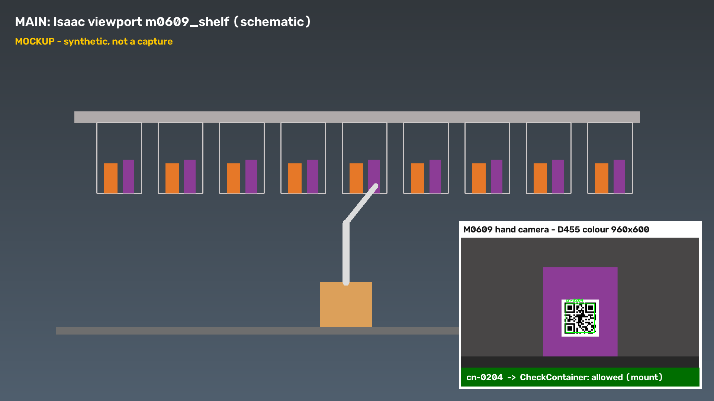

# 회차별 QR 판독 — 비전 10점 근거

- 2026-09-24. 카드 (#576 댓글 5797453658 "비전 10: 회차별 QR 판독 표").
- 이 표는 **회차 관측 기록**이다. frozen protocol 의 합격 evidence 가 아니다. px 는 `pouch_detector`·`m0609_detector` 로그 줄의 "한 변 N px" 원문이고, 없는 칸은 "로그 없음"이다.
- "원인" 칸은 해석이다. 원인이 영상·로그로 확인된 것만 "확인", 나머지는 "추정"이다.
- 계산값(판독 픽셀 식)과 배치는 [QR 배치와 카메라 구성](../architecture/qr-camera-layout.md)에 있다.

## 1. 봉투 `ord-` (AMR 손 카메라, UR5 가 집기 전)

| 회차 · SHA | 월드 · 해상도 | 판독(원문) | 결과 | 원인 |
| --- | --- | --- | --- | --- |
| 실습41 A · `311b1fc` | 빈월드 · 640×480 | `QR 을 못 읽었다. 한 변 58 px` / 61 / 58. 성공 줄 없음 | 불통과(⑧ `not_detected`) | 추정: 해상도·QR 면 비율(직사각 모듈)·고정 관측점 |
| master01 · `289a384` | 병원 · 1280×800 | `QR 을 못 읽었다. 한 변 83 px` | 불통과(`not_detected` ×2) | 확인(오프라인 재현): `detectAndDecodeMulti` 가 100 px 아래에서 네 점만 내고 내용을 비운다 |
| master01 회차17 · `4d01333` | 병원 · 1280×800 | `QR 을 키워서 읽었다: ord-0001. 한 변 49/65/64 px`, 41 px 1회 실패 | **판독 성공**이다. 집기는 timeout ×2 다. 재관측 자세에서 팔뚝과 컨베이어다. 판독과 별개다 | — |
| master01 회차20 · `626cb3f`(골든 + 재관측 생략) | 병원 · 1280×800 | `재관측 없이 간다: 첫 관측에서 ord-0001 QR 을 읽었다`, 판독 45–135 px | **판독 성공**이다. 팔뚝과 컨베이어 touch 는 0 이다. 회차17 은 7 이다. 집기는 `grasp_failed (holding=false)` ×2 다 | 집기: 흡착이 안 붙음(관측, 원인 미확인). 판독과 별개 |

## 2. 약통 `cn-` (M0609 손 카메라, 잡기 직전)

| 회차 · SHA | 월드 · 해상도 | 판독(원문) | 결과 | 원인 |
| --- | --- | --- | --- | --- |
| 실습41 B · `957347a` | 빈월드 · 960×600 | px 로그 없음 | 첫 보충 cn-0106 `expired` 거부까지 동작(판독됨) | — |
| master01 · `232931c` | 병원 · 960×600 | 줄 없음 | `unreadable` 2칸(shelf_68/r0c1, shelf_69/r0c1) | 추정: 윗면·평면 QR(스티커 전), 다시 읽기 전 |
| master02 · `35fb28a` | 병원 · 960×600 | 원통은 `펴서 읽었다: cn-0208. 한 변 81 px` 다. 같은 칸은 `못 읽었다(펴서 다시 읽기 포함) 81–83 px` 가 섞인다. 모듈은 거부 앞에 줄이 없다 | 원통 장착 허용. 모듈 3/3 `unreadable` | 원통: 확인(펴서 다시 읽기가 동작). 모듈: 아래 94f19fb 로 확인 |
| master01 회차3 · `ae8b0b9` | 병원 · 960×600 | 원통 `cn-0208` 81 px 성공·실패 섞임 | drug-ibu 3/3 `unreadable` | 35fb28a 와 같은 모양 |
| master02 · `94f19fb` | 병원 · 960×600 | 손 카메라 6장, 6장 모두 판독 0(`detectAndDecodeMulti`·다시 읽기·`detectAndDecode`) | 모듈 `unreadable` | **확인(영상)**이다. 모듈 가운데를 잡았다. 카메라가 선반면 2.2 cm 위로 내려왔다. 스티커가 선반 앞 가로보에 가렸다 |
| master02 · `f8eac1c` | 병원 · 960×600 | `약통 확인: cn-0204 cell=shelf_68/r0c1 장착 허용` | **모듈 판독 성공** → released target=module → `REFILL_DONE` 71.58 | — |
| master01 회차17 · `4d01333` | 병원 · 960×600 | `키워서 읽었다: cn-0204 59~74 px`, `cn-0208 63·82 px` | **판독 성공**, `REFILL_DONE` 2건 | — |

## 3. 개선과 효과

| 개선 | 커밋 | 무엇을 바꿨나 | 효과의 증거 |
| --- | --- | --- | --- |
| 약통 QR 을 몸통 앞 스티커로 | `2276027` | 윗면 평면 → 통로 쪽 옆면 곡면(원통)·앞면(모듈), 높이를 잡기 직전 카메라 축에 | 35fb28a 원통 cn-0208 판독(81 px) |
| 네 점으로 펴서 다시 읽기 | `429ac27` | 자리만 찾고 못 읽은 QR 을 정사각으로 펴 `detectAndDecode` | 35fb28a `펴서 읽었다: cn-0208` |
| 거울상 뒤집어 다시 읽기 | `87394bb` | 편 영상을 좌우로 뒤집어 한 번 더 | **회차 증거 없음.** master colcon 의 거울상 시험 회귀를 고쳤다(시뮬 영상은 거울상이 아니다) |
| 2 배로 키워 다시 읽기 | `05339c9` | 아무것도 못 읽은 영상을 2 배로 키워 한 장짜리로 | 회차17 `키워서 읽었다` ord-0001 49–65 px, cn-0204 59–74 px |
| 모듈 잡는 높이 중심 + 0.03 m | `f8eac1c` | 카메라를 선반면 5.2 cm 위로(원통과 같게) | f8eac1c `cn-0204 … 장착 허용` → REFILL_DONE |

- 처리 비용: 키워 읽기는 아무것도 못 읽은 프레임마다 약 30 ms 더 든다(오프라인 960×600). 회차 rtf 에 준 영향은 따로 재지 않았다(미실행).
- 판독률(시도 대비 성공 비율)은 로그 줄이 2 s 에 한 번으로 묶여(throttle) 이 표로는 셀 수 없다. 판독률 실측은 QR·DB·카메라 계약 6단계로 남아 있다(미실행).

## 4. 영상 PiP 시안 — "D455 = 약통 QR 확인" (결정 ④)

**시안이다.** 주 화면과 손 카메라 화면 모두 합성 도형이고 캡처가 아니다. 배치만 정한다.

- 주 화면: Isaac 뷰포트 `m0609_shelf`(또는 `m0609_dispenser`). 보충이 도는 동안 그대로 둔다.
- PiP: 오른쪽 아래, 폭 1/3(1920 폭에서 640×400), 흰 테두리. 원본은 회차 폴더 `<기동시각>-qr-reads/<sim s>-cn-….png`
  (`read_snapshot`, 약통 QR 을 읽은 순간 한 장, 판독 테두리·ID 가 이미 그려져 있다).
- PiP 아래 띠: 같은 sim 시각의 약통 확인 결과(`약통 확인: cn-… 장착 허용` 또는 `container_refused … reason=expired`).
  허용은 초록, 거부는 빨강.
- M0609 손 카메라 영상은 위아래가 뒤집혀 찍힌다. link_6 +y 는 월드 −z 다. PiP 에 넣을 때 180° 돌린다. 화면 아래쪽
  어두운 띠가 그리퍼다. 시안의 검은 띠다. master02 94f19fb 손 카메라 관측이다. 돌리면 png 에 그려진 ID 글자도 뒤집힌다.
  ID 는 아래 띠 글자로 읽힌다.
- 한글 자막은 편집에서 넣는다(OpenCV 는 한글을 못 그린다).
