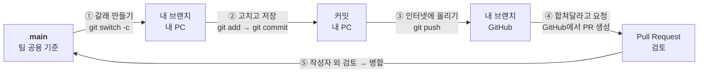
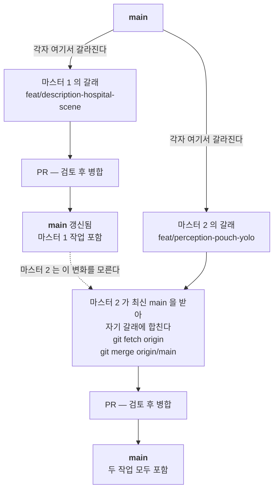
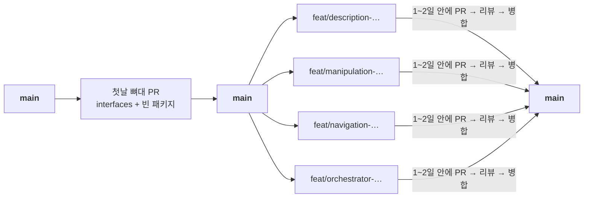

# Git 시작 가이드

Git을 처음 쓰는 팀원이 저장소를 망가뜨리지 않고 자신의 작업을 브랜치와 Pull Request로
제출하는 데 필요한 최소 지식을 정리한다.

이 문서는 **명령을 어떻게 치는가**를 다룬다. 무엇을 제출해야 하는지는
[기여 방법](../../CONTRIBUTING.md), 이름 규칙은 [이름과 위치](naming.md),
GitHub 설정 강제는 [GitHub 적용 상태](github-governance.md)를 따른다.
셋이 충돌하면 그쪽이 우선한다.

## 먼저 큰 그림 — Git이 처음이면 여기부터

### 한 문장으로

> 내 PC에서 `main`의 **작업용 갈래(브랜치)** 를 만들어 거기서만 고치고,
> 다 되면 GitHub에 올려 **"`main`에 합쳐 주세요"** 라고 요청(Pull Request)한다.

`main`을 직접 고치지 않는 이유는 하나다. 여러 사람이 동시에 `main`을 고치면
**나중에 올린 사람이 앞사람 작업을 덮어쓰거나, 아예 올리지 못한다.**
갈래를 따로 만들면 서로 방해하지 않고 동시에 작업할 수 있다.

### 한 사람의 전체 흐름



①②③은 **내 컴퓨터에서 하는 일**, ④⑤는 **GitHub에서 하는 일**이다.
`git push`까지 해도 아직 `main`에는 아무것도 안 들어갔다.
**PR이 병합돼야** 비로소 `main`이 바뀐다.

### 마스터 1과 마스터 2가 동시에 작업할 때

두 PC가 각자 갈래를 만들어 각자 PR을 올린다. 여기까지는 서로 몰라도 된다.



**핵심은 마지막 한 단계다.** 마스터 1의 PR이 먼저 병합되면 `main`이 바뀐다.
마스터 2의 갈래는 **갈라져 나온 시점의 옛날 `main`** 을 기준으로 하고 있어서
그 변화를 모른다. 그래서 마스터 2는 PR을 올리기 전에 최신 `main`을 자기 갈래에 한 번 합친다.

```bash
git fetch origin
git merge origin/main
```

두 PC가 서로 다른 파일을 고쳤으면 이 명령은 조용히 끝난다.
**같은 파일의 같은 줄**을 고쳤을 때만 충돌이 나고, 그때는
[충돌이 발생했을 때](#충돌이-발생했을-때)를 따른다.

### 복사해서 쓰는 전체 순서

```bash
# 0. 항상 최신 main 에서 시작한다
git switch main
git pull --ff-only origin main

# 1. 내 갈래를 만든다 (이름은 '하는 일'로 짓는다)
git switch -c feat/description-hospital-scene

# 2. 파일을 고친 뒤, 내가 고친 것만 담아 커밋한다
git status
git add <내가 고친 파일>
git commit -m "feat(description): 병원 씬 임포트"

# 3. GitHub 에 올린다
git push -u origin feat/description-hospital-scene

# 4. 터미널에 출력된 링크를 눌러 Pull Request 를 만든다 (Base 는 main)
```

각 단계의 자세한 확인 사항은 아래 [매 작업의 표준 순서](#매-작업의-표준-순서)에 있다.

### 자주 하는 오해 네 가지

| 오해 | 실제 |
|---|---|
| 브랜치를 만들면 폴더가 하나 더 생긴다 | 폴더는 그대로다. `git switch`를 하면 **같은 폴더 안의 파일 내용이 그 갈래의 상태로 바뀐다** |
| `git push` 하면 `main`에 들어간다 | GitHub의 **내 갈래**에만 올라간다. `main`은 PR이 병합될 때 바뀐다 |
| 마스터 1에서 만든 갈래를 마스터 2가 바로 볼 수 있다 | 못 본다. `git push`로 GitHub에 올라간 뒤 상대가 `git fetch`를 해야 보인다 |
| 브랜치 이름은 내 PC 이름으로 짓는다 | **하는 일**로 짓는다. `master01` 같은 이름은 다음 주에 내용을 알 수 없고, 그 PC에서 두 가지 일을 하면 곧바로 꼬인다 ([이름과 위치](naming.md)) |

### 마스터 PC에서 작업할 때만 추가로

- **커밋 작성자를 먼저 확인한다.** 마스터 PC는 공용 계정이라 내 커밋이 다른 사람 이름으로
  남을 수 있다. 아래 [작성자 확인](#작성자-확인)을 먼저 한다.
- **사람이 마스터 PC에서 브랜치를 만들어 PR을 올리는 것은 정상이다.**
  [에이전트 역할](agent-workflow.md)이 제한하는 것은 마스터에 붙은 코딩 에이전트가
  현장에서 즉석으로 코드를 고치는 것이지, 사람의 작업이 아니다.
- **긴 작업은 마스터에서 하지 않는 편이 낫다.** 마스터 1은 Isaac Sim이 GPU를 다 쓰므로
  빌드나 편집을 얹으면 시뮬레이션이 느려진다. 코드 작성은 개인 노트북에서 하고,
  마스터에서는 실행·측정에 필요한 변경만 다룬다.

## 이것만은 반드시 지킵니다

1. 작업을 시작할 때와 커밋하기 전에 항상 `git status`를 확인한다.
2. `main`에서 직접 작업하거나 푸시하지 않는다.
3. 최신 `main`에서 목적이 하나인 브랜치를 새로 만든다.
4. `git add .`보다 내가 수정한 파일을 지정해서 추가한다.
5. 다른 팀원의 변경을 삭제하거나 덮어쓰지 않는다.
6. 커밋하기 전에 `git diff`와 `git diff --staged`를 확인한다.
7. 원격에 올린 뒤에는 Pull Request와 작성자 외 검토를 거쳐 `main`에 병합한다. 검토는 사람, 또는 [봇 머지 조건](github-governance.md#봇-머지-조건)을 채운 봇이 한다.
8. 모르는 오류가 나오면 명령을 반복하거나 강제 옵션을 쓰지 말고 화면을 캡처해 도움을 요청한다.

다음 명령은 팀 합의와 충분한 이해 없이 쓰지 않는다.

```text
git push --force
git reset --hard
git clean -fd
git checkout -- <파일>      # 요즘 형태는 git restore <파일>
```

이 명령들은 다른 사람의 커밋이나 아직 복구 지점이 없는 로컬 작업을 없앨 수 있다.

> `--force`가 꼭 필요한 드문 경우에는 `--force-with-lease`를 쓴다.
> 내가 마지막으로 본 원격 상태와 지금이 다르면 푸시를 거부해 주므로,
> 그 사이 다른 사람이 올린 커밋을 말없이 지우는 사고를 막는다.

## Git과 GitHub의 차이

- **Git**: 내 컴퓨터에서 파일 변경 이력을 저장하고 브랜치를 관리하는 프로그램.
- **GitHub**: Git 저장소를 인터넷에서 공유하고 이슈·Pull Request·리뷰를 관리하는 서비스.

인터넷이 없어도 로컬에서 수정·커밋할 수 있다. 다만 `fetch`, `pull`, `push`는
원격 GitHub 저장소와 통신하므로 인터넷과 저장소 권한이 필요하다.

## 꼭 알아야 하는 구조

```text
Working tree  →  Staging area  →  Local repository  →  Remote repository
   파일 수정        git add           git commit            git push
```

- **Working tree(작업 트리)**: 지금 폴더에 보이는 실제 파일.
- **Staging area(스테이징 영역)**: 다음 커밋에 포함하기로 고른 변경.
- **Local repository(로컬 저장소)**: 내 컴퓨터의 커밋과 브랜치 기록.
- **Remote repository(원격 저장소)**: GitHub에 있는 팀 공유 저장소.

`git add`는 GitHub에 업로드하는 명령이 아니다. 다음 커밋에 넣을 변경을 고르는 명령이다.
`git commit`도 내 컴퓨터에 기록할 뿐이고, `git push`를 해야 GitHub에 올라간다.

## 최초 한 번 설정

### 저장소 복제

```bash
git clone https://github.com/jaebeom/pharmacy-to-bedside.git
cd ROKEY_P3_A3
```

이미 받은 폴더가 있으면 다시 `clone`하지 않는다. `pull`이나 `fetch`로 최신 변경을 가져온다.

### 작성자 확인

마스터 PC를 여러 사람이 공용 계정으로 쓰면 내 커밋이 다른 사람 이름으로 남는다.
[기여 방법](../../CONTRIBUTING.md)이 말하는 「기여의 1차 기록은 Git author」가
여기서 깨진다.

```bash
git config user.name
git config user.email
```

값이 없거나 다른 사람 것이면 **이 저장소에서만** 설정한다(`--global`을 쓰지 않는다).

```bash
git config user.name "본인 이름"
git config user.email "GitHub에 등록된 이메일 또는 noreply 이메일"
```

공동 작업은 커밋 메시지 끝에 `Co-authored-by:`를 쓴다. 실제로 함께 작업한 사람만 적는다.

### push 훅 설치

머지된 PR 의 브랜치에 커밋을 더 올리면 그 커밋은 `main` 에 들어가지 않는다. `tools/git-hooks/pre-push` 가 그 push 를 막는다.
클론마다 한 번 건다. `.git/hooks` 는 복제되지 않는다.

```bash
git config core.hooksPath tools/git-hooks
```

`gh` 가 없거나 조회가 실패하면 훅은 통과시킨다. 자세한 것은 [에이전트 역할](agent-workflow.md#확인-대상과-push-대상-918-에-더함)에 있다.

## 매 작업의 표준 순서

### 1. 현재 상태 확인

```bash
git status
git branch --show-current
```

수정 중인 파일이 남아 있으면 먼저 내 작업이 맞는지 확인한다.
누구 작업인지 모르는 변경은 삭제하지도, 커밋하지도 않는다.

### 2. 최신 `main` 받기

작업 트리가 깨끗할 때 실행한다.

```bash
git switch main
git pull --ff-only origin main
```

`--ff-only`는 로컬 `main`에 예상 못 한 커밋이 있으면 복잡한 병합을 자동으로 만들지 않고
그냥 멈춰 준다.

### 3. 작업 브랜치 만들기

브랜치 이름은 [이름과 위치](naming.md)를 따른다.
`feat` / `fix` / `docs` / `test` / `refactor` / `chore` / `ci` 뒤에 **주제**를 쓴다.
ROS 코드면 주제 앞에 **패키지 이름**을 먼저 쓴다 — [브랜치 이름과 수명](#브랜치-이름과-수명).
코딩 도구 이름 접두도 허용한다.

```bash
git switch -c fix/navigation-dock-timeout
git switch -c docs/git-start-guide
git switch -c feat/orchestrator-intersection-lease
```

**브랜치 이름에 사람 이름을 넣지 않는다.** `naming.md`가 말하듯 이름은
사람별 코드 복사본이 아니라 책임과 계약을 나타낸다. 담당은 issue와 PR로 드러낸다.

브랜치 하나는 목적 하나다. 관계없는 변경을 한 브랜치에 섞지 않는다.

### 4. 파일 수정 후 변경 확인

```bash
git status
git diff
```

이 저장소에서 특히 확인할 것:

- 새 문서·디렉토리 이름이 **ASCII kebab-case** 인가 (`naming.md`)
- 측정 결과·run 파일이 규칙에 맞는 이름인가
- 비밀번호·토큰·호스트 주소·개인정보가 섞이지 않았는가
- 큰 원본을 저장소에 직접 넣고 있지 않은가 → [evidence](../../evidence/README.md)의 외부 저장소로 보낸다

### 5. 필요한 파일만 스테이징

```bash
git add docs/process/git-start-guide.md
git add tests/test_evidence.py
```

폴더 전체가 전부 내 작업일 때만 폴더를 지정한다. 스테이징 결과를 다시 확인한다.

```bash
git diff --staged
git status
```

잘못 넣은 파일은 내용은 그대로 두고 스테이징에서만 뺀다.

```bash
git restore --staged <파일경로>
```

### 6. 검사 실행

[기여 방법](../../CONTRIBUTING.md)의 저장소 검사를 돌린다.

```bash
python3 tools/check_repository.py
python3 tools/evidence.py validate --base origin/main
python3 -m unittest discover -s tests -v
ruff check .          # pipx install ruff==0.15.8
```

ROS 변경은 `colcon build` / `colcon test`, Isaac 변경은 [sim 안내](../../sim/README.md)를 따른다.

**충돌 표시가 남아 있는지 확인한다.**

```bash
grep -rn "^<<<<<<<\|^>>>>>>>" --include=*.py --include=*.md . | head
```

검사가 실패하면 원인을 고치고 다시 스테이징한다. 실패한 검사를 숨기거나 테스트를
지워서 통과시키지 않는다. **CI와 실제 장비 검증은 구분해 보고한다.**

### 7. 커밋

```bash
git commit -m "docs(process): Git 시작 가이드 추가"
```

권장 형식은 `종류(영역): 작업 결과`다.

- `feat(interfaces): 교차로 lease 메시지 추가`
- `fix(nav): interlock timeout 시 정지하도록 수정`
- `docs(process): Git 시작 가이드 추가`
- `test(evidence): run 스키마 실패 경로 보강`

「수정」, 「작업함」, 「최종」, 「진짜 최종」처럼 결과를 알 수 없는 메시지는 쓰지 않는다.
`latest`, `final2`, `new_new` 를 버전 식별자로 쓰지 않는다(`naming.md`).

### 8. 내 브랜치를 GitHub에 푸시

```bash
git branch --show-current
git push -u origin fix/interlock-timeout
```

이후 같은 브랜치에서는 `git push`만 하면 된다.
`main`이 표시되면 푸시하지 말고 작업 브랜치를 만들었는지 다시 확인한다.

### 9. Pull Request 생성

- Base: `main`
- Compare: 자신의 작업 브랜치
- **Draft** 로 연다. 터미널에서는 `gh pr create --draft --base main` 이다
- 요구사항·변경·검사 결과·run·한계를 연결한다([기여 방법](../../CONTRIBUTING.md) 5번)
- 통과한 검사뿐 아니라 **못 돌려본 검증**도 적는다
- 단순 구현 선택은 PR에, 비용이 큰 결정은 [ADR](../adr/README.md)에 남긴다
- 기획·RFC의 미검토 주장을 승인 사실로 인용하지 않는다

작성자 외 검토를 받은 뒤 병합한다. 검토는 사람, 또는 봇 머지 조건을 채운 봇이 한다. 수정 요청을 받으면 같은 브랜치에서
수정·커밋·푸시하면 기존 PR이 자동으로 갱신된다.
반영한 커밋의 SHA 는 PR 댓글로 남긴다(예: #762 댓글 5855160914). 검토를 다 반영했으면 Ready 로 바꾼다. Ready 에서 CI 전체가 돈다.
순서와 실제 예(#762)는 [PR 흐름](github-governance.md#pr-흐름-draft-로-열고-ready-는-한-번)에 있다.

### 10. 병합 후 정리

PR이 GitHub에서 병합된 것을 확인한 뒤 실행한다.

```bash
git switch main
git pull --ff-only origin main
git branch -d docs/git-start-guide
```

이 저장소는 **merge commit** 방식으로 병합한다(squash가 아니다). 정상 병합됐다면
`-d`가 그대로 성공한다. **`-d`가 실패하면 진짜로 병합이 안 된 것이므로,
`-D`로 지우지 말고 먼저 PR 상태를 확인한다.**

> 저장소 설정이 squash merge로 바뀌면 이 절이 뒤집힌다. 그때는 병합된 브랜치에서도
> `-d`가 항상 실패하므로, PR이 `Merged`임을 확인한 뒤에만 `-D`를 쓴다.

## 작업 중 `main`이 바뀐 경우

다른 팀원의 PR이 먼저 병합됐다면 내 브랜치에 최신 `main`을 합친다.

```bash
git status
git fetch origin
git merge origin/main
```

작업 트리가 깨끗할 때 실행한다. 충돌이 없으면 검사 후 푸시한다.

**푸시 직전에 한 번 더 한다.** 작업이 하루 걸렸다면 시작할 때 받은 `main`은 이미 낡았다.
`evidence.py validate --base origin/main` 도 이때 다시 돌린다.

이미 공유한 커밋의 이력을 다시 쓰는 `rebase`보다 `merge`를 먼저 쓴다.
팀원이 함께 쓰는 브랜치에서 임의로 rebase 하거나 force push 하지 않는다.

## 병렬 작업에서 충돌 줄이기

### 한 문장으로

> **브랜치는 "하는 일" 단위로 짧게, 충돌 방지는 "패키지 담당제"로.**
> 사람마다 브랜치 하나를 두고 거기서 계속 일하는 방식은 쓰지 않는다.

### 왜 사람별 브랜치가 아니라 기능별 브랜치인가

"내 브랜치"를 하나 만들어 2주 내내 거기서 일하면 편해 보이지만, 실제로는 이렇게 된다.

| 사람별 브랜치를 쓰면 | 왜 문제인가 |
|---|---|
| 브랜치가 안 닫힌다 | 관계없는 변경이 한 PR에 수십 개 쌓여서 리뷰어가 무엇을 봐야 할지 모른다 |
| 충돌이 줄지 않는다 | 충돌은 **같은 파일의 같은 줄**을 두 사람이 고칠 때 난다. 브랜치를 사람별로 나눠도 같은 파일을 고치면 똑같이 난다 |
| 되돌릴 수 없다 | 한 기능이 잘못됐을 때 그 기능만 빼내기가 불가능하다 |

그래서 이 저장소는 **이슈 하나 = 브랜치 하나 = PR 하나**로 간다. 브랜치는 1-2일 안에 병합하고 지운다.
충돌은 브랜치가 아니라 **"누가 어느 폴더를 고치는가"** 를 정해서 막는다. 그게 아래 담당제다.

### 담당 다섯 자리 — 내 폴더만 고친다

기획서의 네 역할을 [계약 문서](../architecture/README.md)의 패키지에 그대로 얹는다.
**자기 단독 영역 안에서는 아무도 충돌하지 않는다.** 남의 영역을 고쳐야 할 때만 아래 [공용 파일 절차](#공용-파일을-바꿔야-할-때)를 따른다.

| 담당 | 단독 영역 (여기만 고친다) | 이번 시나리오에서 맡는 것 |
|---|---|---|
| **simulation** | `src/rokey_p3_description/`, `sim/` | 병원 씬, 조제기·컨베이어·보관함 자산, 봉투 스폰, 끝 정지 센서, 리셋 |
| **manipulation** | `src/rokey_p3_manipulation/`, `src/rokey_p3_perception/` | M0609 보충, UR5 벨트 끝 픽과 침상 플레이스, 봉투 YOLO·QR |
| **navigation** | `src/rokey_p3_navigation/` | occupancy map, Nav2, keepout 마스크, 도킹, 대기 열 이동, 사람 인식 노드(perception에 작은 PR로) |
| **orchestration** | `src/rokey_p3_orchestrator/`, **`src/rokey_p3_interfaces/`, `src/rokey_p3_bringup/`, `config/`** | 요청·배차·조제기 재고 로직·종료 상태·메트릭. 굵은 폴더는 **공용 파일의 소유자** |
| **저장소 관리** (1명) | `docs/`, `tools/`, `schemas/`, `evidence/` 규칙, `.github/`, GitHub 설정 | 시나리오·기획 문서, 검사기, 이슈·보드, branch protection |

- 담당 이름은 역할이지 사람 이름이 아니다. 누가 어느 역할인지는 [일정의 담당 표](../planning/schedule.md#담당)에 있다. 부 담당은 주 담당 패키지에 PR 을 내고 주 담당이 리뷰한다.
- `src/rokey_p3_perception/`은 manipulation 담당이 소유한다. navigation 담당의 사람 인식 노드는 그 패키지에 **작은 PR**로 넣고 manipulation 담당이 리뷰한다.
- 저장소 관리 담당은 코드 패키지를 소유하지 않는다. 대신 규약·검사기·문서를 혼자 짧은 PR로 고친다(아래 "높음" 경로).



### 첫날 순서 — 뼈대 PR이 제일 먼저

네 명이 각자 브랜치에서 메시지 타입을 따로 만들면, 합칠 때 **반드시** 충돌한다. 그래서 순서가 있다.

1. orchestration 담당이 **뼈대 PR** 하나를 올린다. 내용은 `rokey_p3_interfaces`(시나리오 7절의 후보 이름으로 msg/srv/action 초안)와
   빈 패키지 `rokey_p3_orchestrator`, `rokey_p3_manipulation`, `rokey_p3_navigation`, `rokey_p3_perception`, `rokey_p3_bringup`.
   각 패키지는 `package.xml`, `setup.py`, 빈 노드 하나, `test/` 자리만 있으면 된다.
2. 다른 세 명이 그 PR을 리뷰한다. 자기 패키지가 쓸 메시지 필드가 있는지만 본다. 당일 병합한다.
3. 병합된 뒤 각자 최신 `main`에서 자기 브랜치를 딴다. **뼈대 PR이 병합되기 전에는 `src/`를 건드리지 않는다.**
   그동안은 이슈에 합격 조건을 쓰고 자기 패키지의 설계를 정리한다.

### 공용 파일을 바꿔야 할 때

메시지 필드가 하나 더 필요하다, launch에 내 노드를 넣어야 한다, 설정값을 추가해야 한다. 자주 있는 일이고 정상이다. 다만 순서가 있다.

1. 소유자(orchestration 담당)에게 먼저 말한다. Slack 한 줄이면 된다. "`DeliveryRequest`에 `mode` 필드 추가 필요".
2. **그 변경만 담은 별도 브랜치·PR**을 만든다. 내 기능 PR과 섞지 않는다. 요청한 사람이 올려도 되고 소유자가 올려도 된다.
3. 메시지를 바꾸면 **그 메시지를 쓰는 쪽(생산자·소비자)도 같은 PR에서 고친다.** 계약 문서가 요구하는 규칙이다.
4. 소유자가 리뷰하고 **당일 병합**한다. 이런 PR을 이틀 넘게 열어 두면 모두가 막힌다.
5. 다음 날 아침 전원이 `main`을 받아 **깨끗이 다시 빌드**한다(아래 빌드 절).

### 브랜치 이름과 수명

`feat` / `fix` / `docs` … 뒤에 **패키지 이름을 먼저, 그다음 주제**를 쓴다. 이름만 봐도 누구 영역인지 보인다.

| 하는 일 | 브랜치 이름 |
|---|---|
| 병원 씬에 조제기·컨베이어 배치 | `feat/description-dispenser-conveyor` |
| UR5가 벨트 끝에서 봉투 집기 | `feat/manipulation-belt-pick` |
| 복도 keepout 마스크 | `feat/navigation-keepout-mask` |
| 요청 큐와 배차 상태 머신 | `feat/orchestrator-dispatch-fsm` |
| 메시지 필드 추가 (공용) | `feat/interfaces-request-mode` |
| 예외 시나리오 문서 | `docs/exception-scenario` |
| 도킹 타임아웃 버그 | `fix/navigation-dock-timeout` |

- 이슈 하나 = 브랜치 하나 = PR 하나. **1-2일 안에** 병합한다. 길어지면 잘라서 먼저 올린다.
- PR 하나는 리뷰어가 30분 안에 읽을 크기로 유지한다. 파일 10개가 넘으면 나눈다.
- 병합되면 브랜치를 지운다([병합 후 정리](#10-병합-후-정리)). 후속 작업은 최신 `main`에서 새 브랜치를 딴다.
- 원격 브랜치는 병합 뒤 GitHub 가 자동으로 지운다(저장소 설정 `delete_branch_on_merge`, 2026-09-30 조회).
- 실제로 쓰인 접두사(`evidence/`·`exp/` 등)는 [이름과 위치](naming.md#실제로-쓰인-이름-관측-2026-09-30)에 있다.

### 매일 아침 3분

작업을 시작하기 전에 어제 병합된 남의 작업을 받아 온다. 이걸 거르면 저녁에 큰 충돌을 만난다.

```bash
cd <저장소 경로>
git status                          # 깨끗해야 한다. 아니면 먼저 커밋
git switch main
git pull --ff-only origin main      # 최신 main
git switch feat/manipulation-belt-pick
git merge main                      # 내 브랜치에 최신 main 을 합친다
source /opt/ros/jazzy/setup.bash
colcon build --base-paths src --symlink-install
source install/setup.bash
```

`git merge main`에서 충돌이 나면 [충돌이 발생했을 때](#충돌이-발생했을-때)를 따른다.
어제 `interfaces`가 바뀌었다는 공지가 있었으면 빌드 전에 `rm -rf build install log`를 먼저 한다.

### 브랜치를 바꾸면 빌드는 어떻게 되나

이 저장소는 루트가 colcon 워크스페이스라 `build/`, `install/`, `log/`가 클론 안에 생긴다.
`git switch`는 **소스 파일만** 바꾸고 이 세 폴더는 그대로 둔다. 그래서 규칙이 둘이다.

1. **브랜치를 바꿨으면 무조건 `colcon build`를 다시 한다.** 새 패키지·launch·설정 파일은 빌드해야 `install/`에 들어간다.
2. **인터페이스(msg/srv/action)나 패키지 목록이 다른 브랜치 사이를 오갔으면 `rm -rf build install log` 후 빌드한다.**
   지운 패키지가 `install/`에 남아 있거나, 옛 메시지 정의가 섞여서 "필드가 없다"는 이상한 에러가 난다.

`--symlink-install`을 쓰면 Python 파일은 링크라서 고친 즉시 반영된다. 하지만 파일을 **새로 만들면** 다시 빌드해야 한다.

### 워크트리 — 노트북에서는 쓰지 않는다

`git worktree`는 한 저장소를 폴더 여러 개로 동시에 체크아웃하는 기능이다. 편리해 보이지만 이 저장소에서는 노트북에서 쓰지 않는다.

- 워크트리마다 `build/`·`install/`이 따로 생겨서 **폴더마다 전부 다시 빌드**해야 한다.
- 터미널에서 다른 워크트리의 `install/setup.bash`를 source하면 **옛 코드가 조용히 실행**된다. 이 저장소에서 가장 찾기 어려운 사고다.
- Git이 처음인 사람에게는 "지금 어느 폴더의 어느 브랜치인가"가 하나 더 늘어나는 셈이다.

**클론 하나, 브랜치 하나씩.** 기능을 하나 끝내 PR을 올리고, 리뷰를 기다리는 동안 `main`에서 다음 브랜치를 딴다.

**딱 하나 예외**: 내 작업이 반쯤 된 상태에서 남의 PR 브랜치를 내 PC에서 돌려 봐야 할 때.

```bash
git fetch origin
git worktree add ../ROKEY_P3_A3-review origin/feat/navigation-keepout-mask
cd ../ROKEY_P3_A3-review
# 새 터미널에서! 이 폴더의 install 만 source 한다
source /opt/ros/jazzy/setup.bash
colcon build --base-paths src --symlink-install
source install/setup.bash
# ... 확인이 끝나면
cd ../ROKEY_P3_A3
git worktree remove ../ROKEY_P3_A3-review
```

리뷰용 워크트리에서는 커밋하지 않는다. 고칠 게 있으면 PR에 댓글로 남긴다.

### 워크트리 — 마스터의 배포 폴더에는 쓴다

[배포 runbook](../runbooks/deployment.md)은 "release별 독립 디렉토리"를 요구한다. 워크트리가 정확히 그 용도다.
마스터에서는 **클론 안에서 브랜치를 바꾸지 않는다.** 배포할 커밋마다 폴더를 하나 만든다.

```bash
cd ~/Dev/cobot3_ws/ROKEY_P3_A3                       # 마스터의 클론. 여기서는 빌드하지 않는다
git fetch origin --tags
git worktree add ../release/v1.1.0 v1.1.0              # 릴리즈 태그 이름으로. 태그가 없는 후보 커밋은 <날짜-SHA7>
cd ../release/v1.1.0
source /opt/ros/jazzy/setup.bash
colcon build --base-paths src --symlink-install
source install/setup.bash                            # 이 터미널은 이 release 만 source 한다
```

- 롤백은 이전 release 폴더의 `install/setup.bash`를 source하는 것으로 끝난다. 다시 빌드하지 않는다.
- 아직 병합 전인 후보 커밋(L3 측정용)도 같은 방식이다. 브랜치 이름이 아니라 **태그 또는 SHA**로 폴더를 만든다. 태그 규칙은 [일정의 릴리즈 규칙](../planning/schedule.md#릴리즈-규칙).
- 배포 기록을 쓴 뒤 필요 없는 release는 `git worktree remove ../release/<폴더>`로 지운다. 마지막 정상 release 하나는 남긴다.
- Isaac 셸은 [sim 안내](../../sim/README.md)대로 별도 환경이며, 씬 경로만 그 release의 `install/`을 가리키게 한다.
- 마스터 클론 경로 `~/Dev/cobot3_ws/ROKEY_P3_A3` 는 두 마스터에서 관측한 값이다([장비 목록](../setup/host-inventory.md), [배포 runbook](../runbooks/deployment.md)).
  9/20 master02 의 release 폴더 이름은 `<날짜>-<sha>` 였다(예: `20260920-644ec0a`).
- `tools/demo_v2.sh` 를 release 폴더에서 부르면 `P3_REPO` 기본값이 그 폴더다. `P3_INSTALL` 기본값도 그 폴더의 `install/` 이다.

### 리뷰는 옆 레인이 한다

- 리뷰어는 **다른 담당**이다. manipulation PR은 navigation이나 orchestration 담당이 본다.
- 리뷰에서 보는 것 세 가지: 자기 단독 영역 밖의 파일을 고쳤는가, 계약(메시지·프레임·이벤트 이름)을 어겼는가, 검사 결과와 미실행 검증이 PR에 적혔는가.
- 병합은 merge commit이다(squash 아님). 병합 후 브랜치를 지운다.
- 봇이 병합해도 되는 PR 은 [봇 머지 조건](github-governance.md#봇-머지-조건)을 다 채운 것뿐이다. 보호 경로는 사람 승인이 필수다.
- 봇이 병합한 PR 도 사람이 사후 검토한다. 다음 날 스크럼 "어제 달라진 것"에서 훑고, 문제면 24시간 안에 revert PR 을 낸다.
- GitHub에서 main에 PR 필수·검사 required·보호 경로 Code Owners 승인을 켜는 것은 [GitHub 적용 상태](github-governance.md)의 첫 적용 체크대로 저장소 관리 담당이 한다.
  2026-09-30 조회로는 PR 필수·필수 검사는 켜져 있다. Code Owners 승인 필수는 꺼져 있다([조회한 상태](github-governance.md#조회한-상태)).
- 9/24 이후 PR 에는 봇의 문장 검토(Docs Readability)와 기술 판정 댓글이 붙었다([PR 흐름](github-governance.md#pr-흐름-draft-로-열고-ready-는-한-번)).

### 이럴 땐 이렇게

| 상황 | 하는 것 |
|---|---|
| 내 기능이 남의 패키지 파일을 고쳐야 한다 | 그 담당에게 말하고, 그 파일만 고치는 **별도 PR**. 내 기능 PR에 섞지 않는다 |
| 기능 두 개를 동시에 하고 싶다 | 브랜치 두 개. 하나를 끝내 PR을 올린 뒤 `main`에서 다음 브랜치를 딴다 |
| 브랜치를 바꿨더니 launch 파일이 없다고 한다 | `colcon build`를 안 한 것. 빌드하고 `source install/setup.bash` |
| 메시지에 필드가 없다는 에러가 난다 | interfaces가 다른 브랜치 사이를 오간 것. `rm -rf build install log` 후 빌드 |
| 남의 PR 브랜치를 내 PC에서 돌려 봐야 한다 | 위 리뷰용 워크트리 예외. 확인 후 지운다 |
| 마스터에 내 브랜치를 올려 시험하고 싶다 | 클론에서 switch하지 않는다. 이슈에 실험 슬롯을 예약하고 후보 **SHA**로 release 워크트리를 만든다 |
| 뼈대 PR이 아직 안 올라왔는데 코드를 쓰고 싶다 | 자기 패키지 폴더 안에서만 쓰고 커밋은 뼈대 병합 후 최신 `main`에서 딴 브랜치에 한다 |

### 어디서 충돌이 나는가

담당별로 디렉토리가 갈려 있어 대부분의 작업은 물리적으로 겹치지 않는다.
실제로 부딪히는 곳은 좁다.

| 경로 | 충돌 위험 | 이유 |
|---|---|---|
| `docs/process/`, `CONTRIBUTING.md` | **높음** | 규약이 바뀌면 여러 PR이 동시에 건드린다 |
| `docs/architecture/`, `schemas/` | **높음** | 계약을 바꾸면 메시지·검사·예제가 함께 움직인다 |
| `docs/planning/`, `docs/adr/`, `docs/rfc/` | 중간 | 번호가 겹칠 수 있다. 충돌은 PR에서 조정한다 |
| `config/`, `tools/` | 중간 | 검사기 변경은 모든 PR에 영향을 준다 |
| `src/<패키지>/` | 낮음 | 담당자 단독 영역이다 |

**높음** 경로는 먼저 팀에 알리고 한 사람이 한 PR로 짧게 끝낸다.
이 파일들을 건드리는 PR을 이틀 이상 열어두지 않는다.
검사기·schema·정책·agent 규칙 자체의 변경도 사람의 리뷰 대상이다.

### git이 잡아주지 못하는 충돌

같은 줄을 고쳐야 git이 충돌로 알려준다. **다른 파일의 상태를 서술한 문서**는
그 파일이 바뀌어도 충돌이 나지 않고 조용히 틀린 내용이 된다.

이 저장소는 문서가 서로를 인용하는 구조라 특히 그렇다. 계획 문서가 설정값을,
리뷰 메모가 다른 문서의 현재 내용을, 검사 결과가 도구 버전을 인용한다.
`mergeable_state`가 끝까지 `clean`이어도 병합 시점에는 틀린 문장이 될 수 있다.

→ PR이 하루 넘게 열려 있었다면 병합 전에 **내가 쓴 내용이 지금도 사실인지**
사람이 다시 확인한다. 특히 다른 문서나 코드의 현재 상태를 인용한 부분을 본다.

## 충돌이 발생했을 때

충돌은 Git이 두 변경 중 무엇을 고를지 자동으로 판단하지 못했다는 뜻이지,
저장소가 망가졌다는 뜻이 아니다.

### 1. 충돌 파일 확인

```bash
git status
```

파일 안에는 다음 표시가 생긴다.

```text
<<<<<<< HEAD
내 브랜치의 내용
=======
가져오려는 브랜치의 내용
>>>>>>> origin/main
```

### 2. 올바른 최종 내용으로 직접 편집

표시 줄을 포함해 필요 없는 내용을 지운다. 한쪽을 무조건 고르지 말고
두 작업의 의도를 확인한다. 다른 팀원 담당 코드면 당사자와 함께 정한다.

### 3. 해결한 파일 추가와 병합 완료

```bash
git add <해결한 파일>
grep -rn "^<<<<<<<\|^>>>>>>>" . | head    # 0건이어야 한다
python3 tools/check_repository.py
git status
git commit -m "merge main into feature branch"
```

**표시를 지웠는지 도구로 확인한다.** 편집기에서 지웠다고 생각하고 닫으면 남는다.
파이썬 파일에 표시가 남으면 `SyntaxError: invalid decimal literal` 로 죽는다.
`>>>>>>> 9a8bc1e…` 의 커밋 해시를 파이썬이 숫자로 읽으려다 나는 오류다.

아직 방법을 모르겠으면 병합 시작 전으로 되돌릴 수 있다.

```bash
git merge --abort
```

`git merge --abort` 후 `git status`를 확인하고 도움을 요청한다.

## 자주 생기는 상황

### 내가 어느 브랜치인지 모르겠다

```bash
git branch --show-current
git status
```

### 수정한 파일이 커밋에 포함되지 않았다

`git add`하지 않은 파일은 커밋되지 않는다.

```bash
git status
git add <파일>
git commit -m "종류(영역): 작업 결과"
```

### 커밋에 잘못된 파일을 넣기 직전이다

아직 커밋하지 않았다면 스테이징에서만 뺀다.

```bash
git restore --staged <파일>
```

### `.gitignore`에 넣었는데도 계속 올라간다

`.gitignore`는 **이미 추적 중인 파일에는 아무 영향이 없다.**
한 번 커밋된 파일은 그 뒤로도 계속 따라온다. 추적만 해제한다.

```bash
git rm -r --cached <경로>
git commit -m "chore(repo): <경로> 추적 해제"
```

파일 자체는 디스크에 남는다.

### 다른 브랜치로 이동할 수 없다

현재 수정사항과 이동할 브랜치의 파일이 충돌할 수 있어 Git이 막는 상황이다.
가장 안전한 방법은 지금 작업을 마무리해 커밋하는 것이다.
정말 잠깐 보관해야 하면:

```bash
git stash push -m "작업 내용 설명"
git switch <다른 브랜치>
```

돌아온 뒤 복원한다.

```bash
git switch <원래 브랜치>
git stash pop
```

`stash`는 잊기 쉬우니 `git stash list`로 남은 작업을 확인한다.

### 커밋 메시지를 잘못 적었다

아직 푸시하지 않은 가장 최근 커밋만 고칠 수 있다.

```bash
git commit --amend -m "올바른 메시지"
```

이미 푸시했다면 임의로 이력을 바꾸지 말고 그대로 두거나 먼저 팀원에게 묻는다.

### 병합이 끝난 브랜치에 이어서 작업했다

PR이 병합된 뒤 그 브랜치에 새 작업을 얹으면 이미 `main`에 들어간 변경이
다시 올라와 헷갈린다. **후속 작업은 최신 `main`에서 새 브랜치를 딴다.**

### Pull Request에 다른 사람의 변경이 섞였다

Base가 `main`, Compare가 내 작업 브랜치인지 먼저 확인한다.
브랜치를 잘못 만들었거나 예상 못 한 커밋이 있으면 force push로 숨기지 말고
커밋 목록과 `git log --oneline --graph --decorate -10` 결과를 공유해 도움을 요청한다.

## 필수 용어

| 용어 | 뜻 |
|---|---|
| Repository(저장소) | 파일과 Git 변경 이력을 보관하는 프로젝트 공간 |
| Clone | 원격 저장소를 내 컴퓨터에 처음 복제하는 것 |
| Working tree | 지금 컴퓨터에서 직접 수정 중인 파일 상태 |
| Staging area | 다음 커밋에 포함하도록 고른 변경 목록 |
| Commit | 변경 내용과 작성자를 하나의 이력 단위로 저장한 것 |
| Commit hash | `22aa26d` 같은 커밋 고유 식별자. 코드의 공식 식별자다 |
| Branch | 다른 작업과 분리된 커밋 작업선 |
| `main` | 팀이 검토를 마친 기준 코드가 모이는 기본 브랜치 |
| HEAD | 지금 체크아웃해 보고 있는 커밋 또는 브랜치 위치 |
| Remote | GitHub처럼 로컬 밖에 있는 연결된 저장소 |
| `origin` | clone할 때 기본으로 붙는 원격 저장소 별칭 |
| Fetch | 원격 변경을 내려받되 현재 파일에는 합치지 않는 것 |
| Pull | 원격 변경을 내려받고 현재 브랜치에 합치는 것 |
| Push | 로컬 커밋을 원격 저장소로 올리는 것 |
| Merge | 두 브랜치의 변경 이력을 하나로 합치는 것 |
| Merge conflict | 같은 부분의 변경을 Git이 자동으로 합치지 못한 상태 |
| Pull Request(PR) | 브랜치 변경을 검토하고 `main`에 합쳐 달라는 GitHub 요청 |
| Review | PR의 코드·문서·검사 결과를 다른 팀원이 확인하는 과정 |
| Issue | 할 일, 버그, 요구사항과 논의를 추적하는 GitHub 항목 |
| Co-authored-by | 커밋 메시지에 공동 작성자를 기록하는 줄 |
| Stash | 아직 커밋하지 않은 변경을 임시로 치워 두는 기능 |
| Revert | 기존 커밋을 지우지 않고 반대 변경을 새 커밋으로 만드는 것 |
| Rebase | 커밋의 기반을 옮겨 이력을 다시 쓰는 기능. 공유 브랜치에서는 팀 합의 없이 쓰지 않는다 |

## 명령어 빠른 참고표

| 목적 | 명령 |
|---|---|
| 현재 상태 | `git status` |
| 현재 브랜치 | `git branch --show-current` |
| 변경 내용 | `git diff` |
| 커밋 예정 변경 | `git diff --staged` |
| 최근 이력 | `git log --oneline --graph --decorate -10` |
| 브랜치 목록 | `git branch -a` |
| 브랜치 이동 | `git switch <브랜치>` |
| 새 브랜치 생성·이동 | `git switch -c <브랜치>` |
| 파일 스테이징 | `git add <파일>` |
| 스테이징 취소 | `git restore --staged <파일>` |
| 커밋 | `git commit -m "메시지"` |
| 원격 정보 받기 | `git fetch origin` |
| 최신 main 받기 | `git pull --ff-only origin main` |
| 첫 브랜치 푸시 | `git push -u origin <브랜치>` |
| 이후 푸시 | `git push` |
| 원격 목록 확인 | `git remote -v` |
| 추적만 해제 | `git rm -r --cached <경로>` |
| 충돌 표시 검사 | `grep -rn "^<<<<<<<" .` |

## 도움을 요청할 때 함께 보낼 정보

오류 문구를 생략하지 말고 다음 결과와 함께 공유한다.

```bash
git status
git branch --show-current
git log --oneline --graph --decorate -10
git remote -v
```

비밀번호·토큰·호스트 주소·개인정보는 가린 뒤 공유한다. 오류가 난 직후에
강제 명령을 실행하지 않아야 다른 팀원이 상태를 보고 안전하게 복구할 수 있다.

## 작업 완료 체크리스트

- [ ] `main`이 아닌 내 작업 브랜치인가
- [ ] 브랜치 이름이 [naming.md](naming.md) 규칙을 따르는가 (사람 이름 없이, ROS 코드는 패키지 이름 먼저)
- [ ] 내 단독 영역 밖의 파일을 고쳤다면 그 담당에게 알리고 별도 PR로 나눴는가
- [ ] `git config user.name`이 내 이름인가
- [ ] `git status`에서 의도한 파일만 변경됐는가
- [ ] 새 파일 이름이 ASCII kebab-case 인가
- [ ] 비밀정보·호스트 주소·생성 파일이 포함되지 않았는가
- [ ] 충돌 표시(`<<<<<<<`)가 0건인가
- [ ] `git diff`와 `git diff --staged`를 확인했는가
- [ ] 저장소 검사·`ruff check .`·해당 L1/L2를 통과했는가
- [ ] 커밋 메시지가 작업 결과를 설명하는가
- [ ] Base가 `main`인 Pull Request를 **Draft** 로 만들었는가
- [ ] 요구사항·변경·검사 결과·run·**미실행 검증**을 PR에 적었는가
- [ ] 검토를 반영하고 그 SHA 를 PR 댓글로 남긴 뒤 Ready 로 바꿨는가
- [ ] 작성자 외 검토(사람, 또는 봇 머지 조건을 채운 봇) 후 병합했는가
