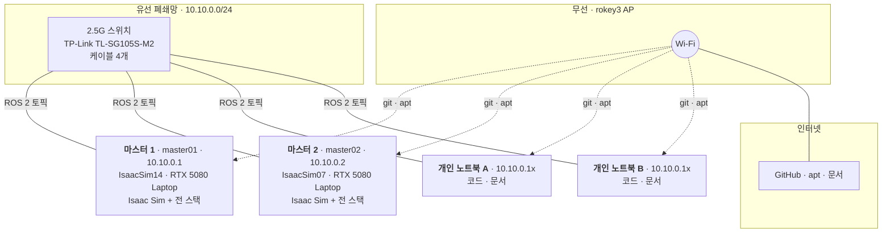
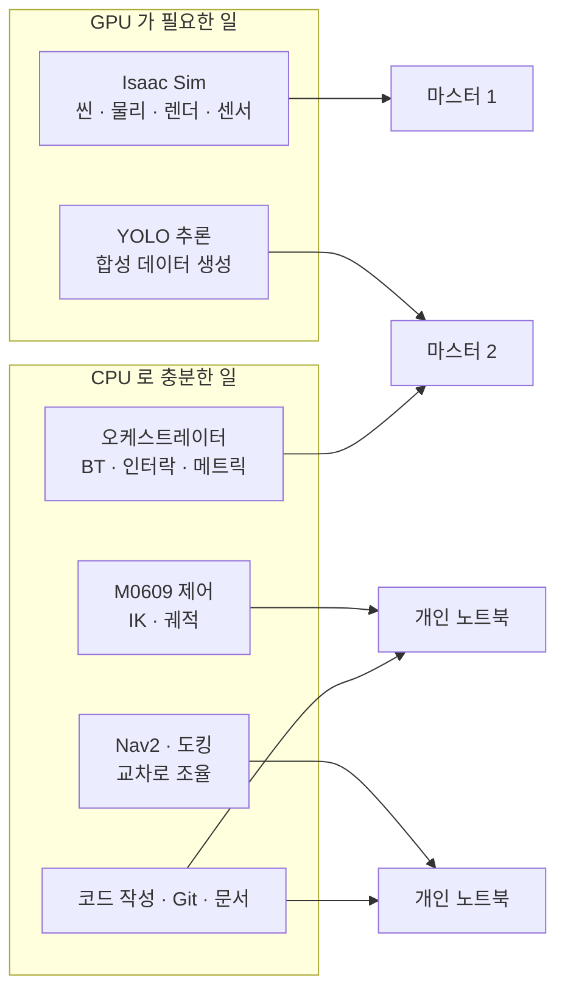
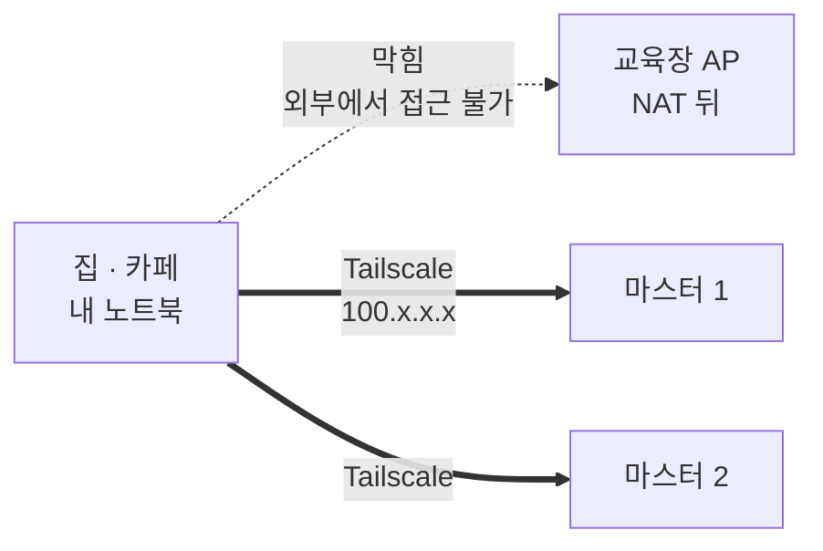

# 우리 셋업 — 왜 이렇게 생겼나

처음 합류하거나 "이 PC는 뭐 하는 거지" 싶을 때 읽는 문서.
설정 절차가 아니라 **왜 이런 구성인지**를 설명한다. 절차는 아래 링크를 따라간다.

- [장비 목록과 IP](host-inventory.md) — 누가 어느 PC, 어느 주소인가
- [ROS 2 유선 폐쇄망 구성](ros2-wired-network.md) — 고정 IP·방화벽·DDS 설정 절차
- [Tailscale 설정](tailscale.md) — 원격 접속
- [워크스페이스 배치](../process/workspace-layout.md) — 어디서 빌드하는가
- [새 PC 준비 순서](#새-pc-준비-순서) — 처음 한 바퀴를 돌리기까지

## 한눈에



**선이 두 종류인 게 핵심이다.** 실선(유선)은 로봇이 주고받는 데이터, 점선(무선)은 사람이 쓰는 인터넷.
섞이면 둘 다 망가진다.

## 세 개의 길

PC 한 대에 네트워크 인터페이스가 세 개 붙어 있다. 각각 하는 일이 다르다.

| 길 | 주소 | 나르는 것 | 나르면 안 되는 것 |
| --- | --- | --- | --- |
| **유선** (`enp*`) | `10.10.0.x` | ROS 2 토픽·서비스·액션, 카메라 영상, 라이다 | 인터넷 |
| **무선** (`wlo*`) | AP 할당 | git, apt, 브라우저, 문서 | **ROS 2 토픽** |
| **Tailscale** (`tailscale0`) | `100.x.x.x` | 원격 SSH, 외부에서 파일 확인 | **ROS 2 토픽** |

내가 지금 어디에 붙어 있는지는 이걸로 본다.

```bash
ip -br addr
```

```text
enp4s0      UP    10.10.0.11/24        ← 유선. ROS 2
wlo1        UP    172.16.0.124/24      ← 무선. 인터넷
tailscale0  UNKNOWN  100.121.31.4/32   ← 원격 접속
docker0     DOWN  172.17.0.1/16        ← 안 씀
```

### 왜 ROS 2 를 유선으로만 보내나

DDS 는 노드를 찾을 때 **멀티캐스트**를 뿌린다. Wi-Fi 에서 멀티캐스트는 가장 낮은 전송률로 나가고
재전송이 없어서 조용히 사라진다. "노드가 떴다 사라졌다" 하는 증상이 여기서 나온다.

거기다 Isaac Sim 의 카메라·포인트클라우드 토픽은 수십에서 수백 Mbps 를 쉽게 넘는다.
공용 AP 로는 감당이 안 되고 같은 AP 를 쓰는 다른 조까지 느려진다.

그래서 `~/.ros/fastdds_whitelist.xml` 이 **유선 주소만 허용**하도록 막아 둔다.
이 파일이 없으면 DDS 가 무선·Tailscale·Docker 주소까지 광고하고, 상대는 닿지 않는 경로로
연결을 시도하다 타임아웃을 기다린다.

## PC 마다 하는 일

### 지금 배치 (2026-09-30)

- 마스터 한 대가 월드의 역할을 전부 띄운다. 순서는 stage → arm → nav → stack → web 이다.
  `tools/demo_v2.sh up` 의 `P3_ROLES` 기본값이 "전부"다. 결정 기록은 [ADR 0005](../adr/0005-deployment-single-master-default.md)(proposed)다.
- 두 대로 나눌 수도 있다. `P3_ROLES`·`P3_PEER` 를 준다([병원 시연 런북 10절](../runbooks/hospital-demo.md)).
  두 대로 나눈 회차는 회차19(9/24, ADR 0005)와 acceptance attempt 12·13(phase E)이다([campaign 장부](../reha/campaigns.md)).
  v1.0.0 의 회전 7 은 attempt 12·13 을 생략했다(#772 댓글).
- 두 마스터는 각자 따로 회차를 돈다. 회전 2 에서는 master02 가 attempt 6·9·10·11 을 돌았다. 회전 7 은 master01 이 돌았다([campaign 장부](../reha/campaigns.md)).
- 개인 노트북은 시연 실행에 쓰지 않았다(ADR 0005 맥락).
- 관제 웹도 마스터에서 `web` 역할로 뜬다. 관제 창(브라우저)은 회차마다 1개다([병원 런카드 0절](../runbooks/hospital-full.md)).
- 두 마스터의 GPU 는 RTX 5080 Laptop 이다. 전력 상한은 80 W 다([장비 목록](host-inventory.md)).

### 처음 계획 (9/15)

아래 그림과 표는 처음 세운 배치 계획이다. 지금 배치는 위 절이다.



### 마스터 PC 가 왜 2대인가

**Isaac Sim 이 GPU 를 거의 다 먹기 때문이다.** 같은 PC 에서 YOLO 추론을 돌리면 시뮬레이션
프레임레이트가 떨어지고 추론도 느려진다. 둘 다 망가진다.

그래서 마스터 1은 **Isaac Sim 전용**이다. 브라우저도 열지 말라는 뜻이다.
"제어·Nav2 를 개인 노트북에서 돌린다"는 출발 배치이고, 마스터 2에 여유가 확인되면
하나씩 옮겨서 **개인 노트북 없이도 시연이 돌아가는 상태**를 목표로 한다.
어느 쪽이 맞는지는 실제 부하를 재 보고 정한다(첫날 확인 항목).

| PC | 주력 자원 | 여기서 돌리는 것 | 돌리면 안 되는 것 |
| --- | --- | --- | --- |
| 마스터 1 (`master01`) | **GPU 전부** | Isaac Sim, 보행자 스크립트, 리셋 서비스 | 학습, 브라우저, 빌드 |
| 마스터 2 (`master02`) | GPU 일부 + CPU | YOLO 추론·학습, 오케스트레이터, 메트릭, 상태 GUI | Isaac Sim |
| 개인 노트북 (`dev01`-`dev04`) | CPU | 노드 개발, 제어 로직, 코드·문서·Git | Isaac Sim, YOLO 학습 |

`master01` 같은 영문 별칭은 실행 기록(`evidence/`)에서 장비를 가리킬 때 쓰는 이름이다.
대화에서는 "마스터 1"이라고 불러도 된다.

이 표는 계획이었다. 지금은 두 마스터가 각자 Isaac 과 스택을 함께 띄운다(위 [지금 배치](#지금-배치-2026-09-30)).
한 대에 다 띄운 부하는 [병원 전 구간 성능](../analysis/hospital-perf-0923.md)에 있다.

### 개인 노트북은 시뮬을 돌리지 않는다

GPU 가 없거나 약하다. 대신 **마스터 1 의 화면을 끌어다 본다** —
Isaac Sim 을 헤드리스로 띄우고 WebRTC 클라이언트로 접속하면 GPU 없이도 씬을 볼 수 있다.
자세한 건 [`sim/README.md`](../../sim/README.md).

## 유선 케이블이 4개뿐이다

스위치는 5포트(TP-Link TL-SG105S-M2, 2.5G)인데 케이블이 4가닥이고, 그중 2개를 마스터 PC 가 상시 점유한다.
**개인 노트북은 동시에 2대까지만 붙는다.**

| 슬롯 | IP | 누구 |
| --- | --- | --- |
| 고정 | `10.10.0.1` | 마스터 1 |
| 고정 | `10.10.0.2` | 마스터 2 |
| 교대 2자리 | `10.10.0.11`-`.14` | 개인 노트북 4대. **사람마다 자기 주소가 있다** — [장비 목록](host-inventory.md) |

**IP 는 노트북의 네트워크 설정에 들어가는 값이지 케이블에 붙어 있지 않다.**
어느 케이블을 꽂든 같은 스위치·같은 브로드캐스트 도메인이다.
같은 주소를 가진 두 대가 동시에 꽂히면 ARP 충돌로 **양쪽 다 끊긴다.**
그래서 주소를 나눠 쓰지 않고 4명에게 하나씩 준다. 케이블만 교대한다.

유선에 못 붙은 사람은 코드 작성·문서·Git 을 하면 된다. ROS 2 통신 테스트가 필요할 때 교대한다.

## Tailscale 은 왜 필요한가



유선 폐쇄망은 교육장 안에서만 존재하고, 무선은 AP 의 NAT 뒤에 있어서 **밖에서는 들어올 수 없다.**
Tailscale 은 그 사이에 암호화된 오버레이 망을 깔아서, 어디서든 마스터 PC 에 `ssh` 로 붙게 해 준다.

쓰는 상황은 이렇다.

- 밤에 긴 시뮬레이션이나 학습을 걸어두고 **집에서 진행 상황 확인**
- 교육장에 못 간 날 **원격으로 코드 수정·재실행**
- 다른 사람이 붙잡고 있는 PC 의 로그를 **자리로 가지 않고 확인**

설정은 [Tailscale 설정](tailscale.md)을 따라가면 된다.

### Tailscale 로 ROS 2 를 보내지 않는다

가능은 하지만 하지 않는다. 지연이 유선보다 훨씬 크고 대역폭도 부족해서,
카메라 토픽을 태우면 시뮬레이션이 멈춘 것처럼 보인다.

FastDDS 화이트리스트가 `tailscale0` 을 이미 막고 있으므로, 설정만 지키면 실수로 새어 나가지 않는다.
**Tailscale 은 SSH 와 파일 확인용이다.**

## Isaac Sim 셸과 ROS 셸은 다르다

Isaac Sim 5.1 은 자기 Python(3.11)을 쓰고, Ubuntu 24.04 의 Jazzy 는 3.12 를 쓴다.
`~/.bashrc` 에서 `source /opt/ros/jazzy/setup.bash` 를 한 터미널에서 Isaac 을 띄우면 라이브러리가 섞여서
이상한 곳에서 죽는다. **Isaac 은 별도 터미널에서 `python.sh` 로** 띄운다.
절차는 [`sim/README.md`](../../sim/README.md).

`tools/demo_v2.sh` 는 이 분리를 스스로 한다. 스테이지를 `env -i` 로 띄워 시스템 ROS 를 source 하지 않는다.
Isaac 은 `P3_ISAAC_PY`(기본 `~/isaacsim/python.sh`)로 부른다.
브릿지 라이브러리는 `LD_LIBRARY_PATH` 로 준다(기본 `~/isaacsim/exts/isaacsim.ros2.bridge/jazzy/lib`).

시간 기준도 하나여야 한다. Isaac 이 `/clock` 을 발행하고 나머지 노드는 `use_sim_time=true` 로 그 시계를 따른다.
`/clock` 발행자가 둘이면 TF 가 튄다.

## 자원을 어디에 몰아야 하나

| 자원 | 병목이 되는 곳 | 몰아주는 방법 |
| --- | --- | --- |
| **GPU** | 각 마스터의 Isaac Sim. 전력 상한 80 W | 회차 중에는 관제 창 1개 밖의 브라우저·빌드를 띄우지 않는다 |
| **유선 대역폭** | 카메라·포인트클라우드 토픽 | 필요 없는 토픽은 발행하지 않는다. 이미지 압축 전송 검토 |
| **사람** | 유선 슬롯 2개 | 유선이 필요한 작업(통신 테스트)과 아닌 작업(코드 작성)을 나눠 교대 |

가장 흔한 낭비가 **회차에 쓰지 않는 창과 프로세스를 마스터에 남겨 두는 것**이다.
9/24 master02 에는 관제 창 60개와 15시간 된 녹화기가 남아 있었다. 그 상태로 회차가 돌았다.
그래서 기동 전과 종료 뒤에 잔류를 본다([병원 런카드 0절 7](../runbooks/hospital-full.md#0-새-pc-에서-처음-한-번만)).

## 마스터 PC 에 붙은 에이전트는 두 가지만 한다

1. **배포 지원** — 정해진 커밋을 받아 빌드·실행·중지·롤백.
2. **수치 확인과 진단** — 로그·토픽·자원 사용량을 모아 "무엇이 관측됐는지"를 정리.

코드 수정과 설계 변경은 하지 않는다. 그건 클라우드 개발 환경에서 PR 로 한다.
마스터마다 관측 에이전트가 하나씩 붙는다(master01·master02).
9/25 에는 다른 코딩 도구도 master observer 로 일했다(#240 댓글).
이유와 세부 규칙은 [도구 사용 규칙](../process/agent-workflow.md).

## 새 PC 준비 순서

마스터에서 병원 한 바퀴를 처음 돌리기까지의 순서다. 절차 본문은 링크한 문서에 있다.

| 순서 | 할 일 | 절차 |
| --- | --- | --- |
| 1 | Ubuntu 24.04 와 ROS 2 Jazzy(`/opt/ros/jazzy`)를 둔다 | [유선망 문서 전제](ros2-wired-network.md#전제) |
| 2 | 고정 IP·방화벽·ephemeral 포트·FastDDS 프로필·환경 변수를 맞춘다 | [유선망 문서 1–6번](ros2-wired-network.md#1-고정-ip-설정) |
| 3 | 저장소를 받는다. push 훅을 건다(`git config core.hooksPath tools/git-hooks`) | [Git 가이드](../process/git-start-guide.md#최초-한-번-설정) |
| 4 | 저장소 루트에서 `colcon build` 를 한다. `src/rokey_p3_*` 7개 패키지가 빌드된다 | [워크스페이스 배치](../process/workspace-layout.md) |
| 5 | Isaac Sim 5.1 을 둔다. `tools/demo_v2.sh` 는 `~/isaacsim/python.sh` 를 기본으로 부른다 | [sim 안내](../../sim/README.md#빌드-셸과-실행-셸-분리) |
| 6 | 웹 백엔드 venv 를 `web/backend/.venv` 에 만든다. `--system-site-packages` 가 필수다. Ubuntu 24.04 에는 `python3.12-venv` 가 있어야 한다 | [병원 런카드 0절 2](../runbooks/hospital-full.md#0-새-pc-에서-처음-한-번만), [웹 안내](../../web/README.md) |
| 7 | 자산을 받는다. 조제기 ZIP 은 `gh release download assets/hospital-20260918` 로 받는다. 합본 AMR·M0609 자산은 저장소에 없다 | [병원 런카드 0절 3·4](../runbooks/hospital-full.md#0-새-pc-에서-처음-한-번만) |
| 8 | 창 모드 전 구간 한 바퀴를 돌린다 | [병원 런카드](../runbooks/hospital-full.md) |

- `package.xml` 이 선언한 의존성(Nav2·OpenCV·cv_bridge 등)이 있어야 한다.
  CI 는 그중 `nav2_msgs`·`python3-opencv`·`cv_bridge` 만 apt 로 깐다(`.github/workflows/ci.yml`).
  마스터에 무엇을 어떤 명령으로 깔았는지는 기록을 찾지 못했다(미확인).
- 장비 사양과 확인일은 [장비 목록](host-inventory.md)에 적는다. 실측하지 않은 칸은 "미확인"으로 둔다.

## 문제가 생기면

증상을 계층으로 나눠서 좁힌다. 위에서부터 확인한다.

| 증상 | 먼저 볼 것 |
| --- | --- |
| ping 도 안 됨 | 케이블, `ip -br addr` 로 내 IP 확인 |
| ping 은 되는데 토픽이 안 옴 | `ROS_DOMAIN_ID` 일치, `sudo ufw status`, 화이트리스트 |
| 간헐적으로 노드가 사라짐 | ephemeral 포트 범위 ([네트워크 문서](ros2-wired-network.md) 4번) |
| 유선 꽂으니 인터넷이 끊김 | IPv4 설정에 Gateway 를 넣었거나 "only for resources on its network" 미체크 |
| 원격에서 SSH 가 안 됨 | `tailscale status` 로 상대가 온라인인지 |

자세한 진단 순서는 [네트워크 문서의 부록](ros2-wired-network.md#부록-이-설정을-왜-하는가)에 있다.
