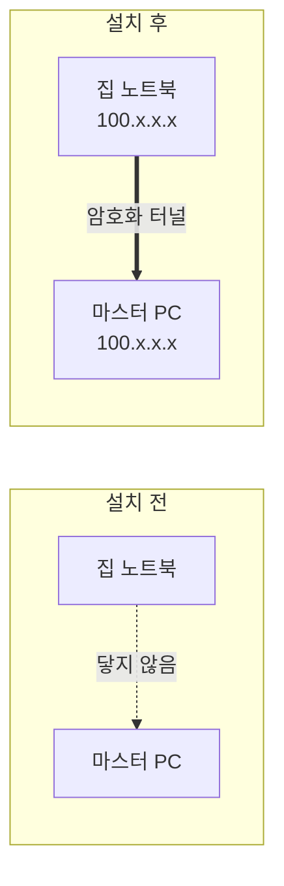

# Tailscale 설정

교육장 밖에서 마스터 PC 에 접속하기 위한 설정. **5분이면 끝난다.**

왜 필요한지는 [우리 셋업](README.md#tailscale-은-왜-필요한가) 참고.
요약하면 유선 폐쇄망은 교육장 안에만 있고 무선은 AP 의 NAT 뒤라, 밖에서는 들어올 길이 없기 때문이다.

## 무엇을 하는 것인가



Tailscale 을 설치한 기기끼리 `100.x.x.x` 주소를 하나씩 받고, 그 주소로 서로 직접 통신한다.
공유기 설정을 건드리거나 포트를 열 필요가 없다.

**같은 계정으로 로그인한 기기끼리만** 보인다. 팀 전체가 같은 계정을 쓸지, 각자 계정으로
서로를 초대할지는 팀에서 정한다.

## 설치

각 PC 에서 한 번씩 한다. 인터넷이 필요하므로 **무선이 연결된 상태**여야 한다.

```bash
curl -fsSL https://tailscale.com/install.sh | sh
```

## 로그인

```bash
sudo tailscale up --ssh --operator=$USER
```

브라우저로 열리는 URL 이 터미널에 뜬다. 그 주소로 로그인하면 기기가 등록된다.

| 옵션 | 의미 |
| --- | --- |
| `--ssh` | Tailscale 이 SSH 를 대신 처리한다. **키를 만들고 복사할 필요가 없다** |
| `--operator=$USER` | 이후 `sudo` 없이 `tailscale` 명령을 쓸 수 있다 |

헤드리스라 브라우저를 못 여는 상황이면, 뜬 URL 을 다른 기기에 복사해 붙여넣어도 된다.

## 확인

```bash
tailscale status
```

```text
100.x.x.x   isaacsim07        <계정>@  linux  -
100.x.x.x   my-laptop  <계정>@  linux  idle, tx 2067368 rx 936592
```

내 기기와 상대 기기가 같이 보이면 성공이다. 왼쪽이 Tailscale 주소, 가운데가 기기 이름.

> `talescale: command not found` — 오타다. `tailscale` 이다.

## 접속

기기 이름이나 `100.x` 주소 둘 다 된다.
마스터 두 대의 기기 이름은 `isaacsim14`(master01)와 `isaacsim07`(master02)다.
호스트 이름은 [장비 목록](host-inventory.md#마스터-두-대-요약-2026-09-30)에 있다. `isaacsim14` 로 붙은 기록은 [실습22](../practice/practice-22.md)다.

```bash
ssh rokey@isaacsim07
# 또는
ssh rokey@100.x.x.x
```

`--ssh` 로 올렸으면 **비밀번호도 키도 묻지 않는다.** Tailscale 이 계정으로 신원을 확인한다.

들어가면 프롬프트가 상대 PC 로 바뀐다. 나올 때는 `exit` 또는 `Ctrl+D`.

```text
rokey@my-laptop:~$ ssh rokey@isaacsim07
rokey@IsaacSim07:~$          ← 여기부터는 마스터 PC
```

## 오래 걸리는 작업은 tmux 안에서

SSH 연결이 끊기면 그 세션에서 띄운 프로세스가 같이 죽는다.
학습이나 긴 시뮬레이션을 걸어둘 거면 `tmux` 안에서 돌린다.

```bash
ssh rokey@isaacsim07
tmux new -s train          # 여기서 실행
# Ctrl+B 누른 뒤 D  →  빠져나와도 계속 돈다
```

나중에 다시 붙을 때:

```bash
ssh rokey@isaacsim07
tmux attach -t train
```

## 주의

**ROS 2 를 Tailscale 로 보내지 않는다.** 지연이 유선보다 훨씬 크고 대역폭도 부족해서,
카메라 토픽을 태우면 시뮬레이션이 멈춘 것처럼 보인다.

FastDDS 화이트리스트가 `tailscale0` 을 이미 막고 있으므로
([네트워크 문서](ros2-wired-network.md) 5번) 설정만 지키면 실수로 새어 나가지 않는다.

`ip -br addr` 에 `tailscale0` 이 보이는 것은 정상이다. **DDS 가 그 주소를 쓰지 않을 뿐이다.**

## 끄기

교육장에서 작업하는 동안 굳이 끌 필요는 없다. 꼭 꺼야 한다면:

```bash
sudo tailscale down      # 연결만 끊기, 등록은 유지
sudo tailscale up        # 다시 켜기
```

## 느릴 때

```bash
tailscale ping isaacsim07
```

`direct` 면 정상. `via DERP(relay)` 가 계속 나오면 NAT 를 못 뚫어 중계 서버를 거치는 상태다.
파일 복사가 느린 정도지 SSH 에는 지장이 없다. 같은 Wi-Fi 안에서는 보통 direct 가 된다.
