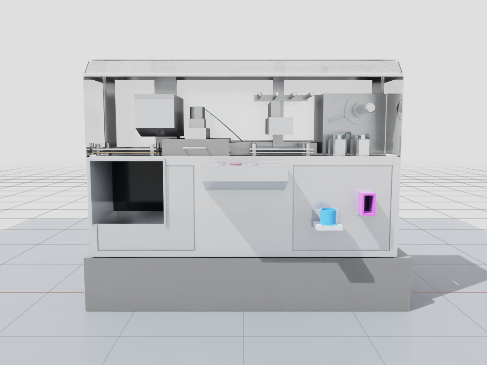
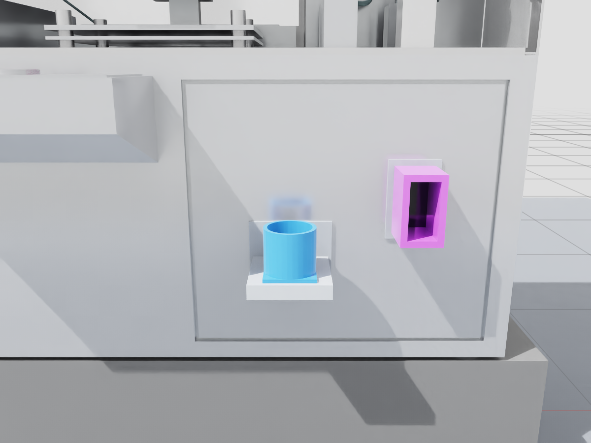
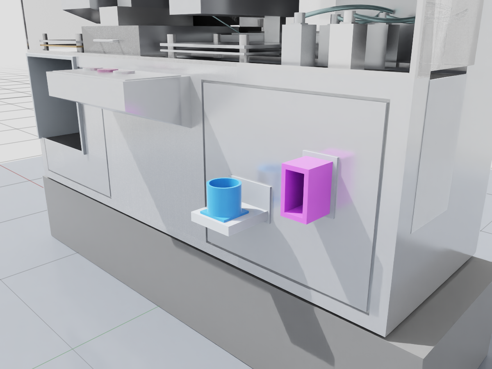
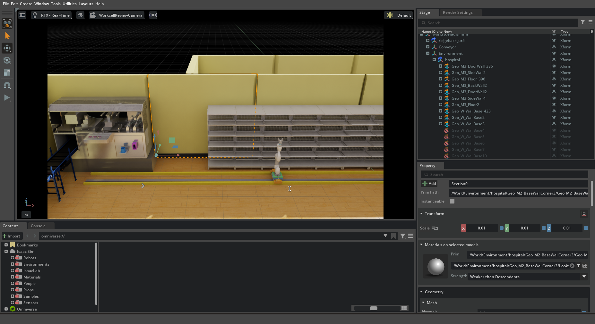

# 조제기 — 정면 투입구와 컨베이어 개구부

v1.1.0 병원 한 바퀴에서 `sim/standalone/prepare_workcell_integration.py` 가 이 에셋을 `/World/IntegratedDispenser` 로 병원 base 에 참조한다.
준비기는 루트만 평행이동하고 collision 을 붙인다. 투입구 앵커의 병원 좌표를 M0609 수납 목표(원통 `round`, 모듈 `module`)로 `workcell.json` 에 적는다.
`pharmacy_stage.py` 의 `base_scene.add_base_scene()` 은 기동 때 형상이 기준과 다르면 physics 시작 전에 멈춘다.

2026-09-22 임재범의 화면 검토로 승인한 **시각 에셋**. 양쪽 돌출부를 본체 경계에서 절단하고, 왼쪽 정면 외판에 실제 컨베이어가 들어가는 개구부와 내부 테두리를 만들었다. 유리창 아래 오른쪽 금속 패널에 알약 투입기와 모듈 투입기를 밀착 배치했다. 색상 변경과 데코는 후속 작업이다.

## 9/22 재확인한 기준 형상

임재범이 복원된 Isaac 화면을 보고 이 형상을 PR 기준으로 지정했다. **정면에서 원통 투입구는 왼쪽, 모듈 투입구는 오른쪽**이다. 입구 중심 X 간격은 0.35 m다.

아래 사진은 #485 원본 `fc8a71e`와 바이트가 같은 파일을 다시 열어 찍었다. #496 은 조제기 형상·색상·입구 위치를 바꾸지 않았다.

- 기준 파일 SHA-256: `cd2591a821d96e44e3a0a90ef66ee33e6fd1b432582618163094bb22242ddaf2` (336,026 bytes).
- 실습37은 로컬 합성 레이어에서 원통 입구를 +X 0.30 m, −Y 0.10 m 이동한 장면이다. 그 3회 결과를 이 기준 형상의 검증으로 전용하지 않는다.
- 이후 검토 중 만든 모듈 왼쪽·원통 오른쪽 0.55 m 분리 후보는 철회했다. 이 기준 파일이나 사진에 포함하지 않았다.
- 병원 배치 시 루트의 평행이동·회전은 가능하지만 투입구·받침·앵커를 개별적으로 이동하거나 축척을 바꾸지 않는다. 경로가 실패하면 같은 형상을 유지한 채 실패를 기록하고 경로 문제를 별도로 검토한다.

### 기준 사진







Isaac Sim 5.1의 Z-up 카메라로 찍은 실제 에셋 화면이다. 외형 확인용이며 팔 도달·충돌·흡입 완료 증거가 아니다.

밝기 차이는 검토 장면 조명이다. 재질은 안 고쳤다. 정지 검토에서는 physics와 ROS를 켜지 않았다.

### 파일·합성 장면 검증

저장소 루트에서 USD Python(`pxr`; Isaac Python 또는 usd-core 환경)으로 실행한다.

```bash
python3 tools/check_dispenser_asset.py \
  --asset src/rokey_p3_description/models/dispenser/dispenser.usdc \
  --metadata src/rokey_p3_description/models/dispenser/asset.json

python3 tools/check_dispenser_asset.py \
  --asset src/rokey_p3_description/models/dispenser/dispenser.usdc \
  --metadata src/rokey_p3_description/models/dispenser/asset.json \
  --scene /absolute/path/to/saved-composed-scene.usda \
  --prim /World/IntegratedDispenser
```

첫 검사는 파일 해시·루트·참조·메시 인덱스·앵커와 입구 형상·받침 연결을 본다.

두 번째는 저장된 합성 장면의 메시·치수·상대 변환·앵커·가시성을 기준 파일과 맞춘다. **파일 해시는 같아도 상위 레이어가 입구만 옮긴 경우**를 거부한다. CLI는 저장된 장면을 검사하므로 열린 Isaac 창의 저장하지 않은 변경은 보지 않는다.

### 실제 심월드 적용과 위치 유지

임재범의 요청 댓글에 따라, 외형·색상은 나중에 수정하더라도 `asset.json`의 입구 앵커 위치를 유지하는 것을 기준으로 삼는다. 팔 경로를 통과시키려고 입구를 임의로 이동하지 않는다. 위치 변경이 불가피하면 기존 좌표와 변경 이유를 별도 검토 대상으로 남긴다.

- `hospital_workcell_demo.py`는 기준 에셋을 병원에 참조한 직후 **열린 stage**를 검사한다. 입구를 바꾸는 별도 이동값은 쓰지 않는다. 출력 `dispenser-placement.json`에 파일 해시와 병원 장면의 앵커 좌표를 남긴다.
- `pharmacy_stage.py`가 사용하는 `base_scene.add_base_scene()`도 기본 장면 바로 아래의 `IntegratedDispenser` 또는 `ReviewedDispenser`를 자동 검사한다. 레이어 합성과 비활성화 처리가 끝난 뒤 검사하며, 불일치하면 physics 시작 전에 예외로 종료한다. 다른 이름의 조제기를 자동 탐지하는 기능은 아니다.
- 합성 뒤의 앵커뿐 아니라 메시·치수·상대 변환도 대조한다. **앵커는 그대로 두고 보이는 투입구만 움직이는 경우**도 거부한다. 전체 조제기의 강체 배치는 허용하되 축척 변경은 거부한다.
- 수납 시각 데모의 감지 중심도 하드코딩한 병원 좌표 대신 실제 입구 앵커에서 계산한다. 물품 반높이/반깊이에 해당하는 접근 오프셋은 형상 이동이 아니다.

이 검사는 **시작 시점의 배치 검사**다. 실행 도중 편집을 계속 감시하는 제어 인터락, 조제기 바깥 장애물 검사, 로봇 충돌·도킹 검증은 아니다. 새 로봇 실습은 별도 실행 결과로 기록한다.



2026-09-22 master02에서 #484 기준 병원 장면을 열고 기준 조제기를 참조한 화면이다. 임재범이 화면을 확인한 뒤 캡처했으며, 카메라 조작을 포함한 전체 Isaac 창을 그대로 기록했다. 정지 시각 배치이며 physics와 ROS는 OFF다.

시작 검사에서 형상·앵커 340개가 기준과 일치했다. 원통 입구의 병원 좌표는 (−8.05, 11.115, 0.98) m, 모듈 입구는 (−7.70, 11.11546546, 1.02) m다. 기존 #485 앵커에 원래 조제기 루트 배치를 적용한 값이며 새로운 위치 보정값이 아니다.

외부 출력 `m2-dispenser-reference-496/dispenser-placement.json`에 좌표와 기준 파일 해시가 있다. 합성 레이어와 `review.usda`도 같은 폴더에 보존했다. 로그는 `m2-dispenser-revision/hospital-reference.log`다. 기존 RG2 시각 참조 경고와 저장 후 익명 그리퍼 레이어 재개방 경고는 남아 있다. 저장본의 조제기 일치 검사는 통과하지만 로봇 전체를 재현하는 배포 파일로 사용하지 않는다.

USD 환경에서 전용 회귀 테스트 10개가 통과했다. 정상 합성은 통과하고 원통만 이동·전체 축척·앵커만 이동·모듈 면만 이동·받침 분리는 거부한다. 저장하지 않은 편집과 조제기 비활성화를 통한 검사 우회도 거부한다.

USD 없는 기본 환경에서는 이 10개가 skip된다. 기본 unittest만으로 확인했다고 쓰지 않는다.

같은 카메라의 사진 재현:

```bash
~/isaacsim/python.sh sim/standalone/review_dispenser_asset.py \
  --before /absolute/path/to/reference-dispenser.usdc \
  --after src/rokey_p3_description/models/dispenser/dispenser.usdc \
  --output /absolute/path/to/new-photo-directory --close
```

두 파일 모두 #485 기준 파일로 찍어 기준 사진을 만들었다. 출력 `before-*`·`after-*`가 이번 PR의 형상 전후를 뜻하지 않는다.

원본 사진·로그는 master02 외부 `m2-dispenser-revision/restored-485-photos`와 `restored-review.log`에 있다. 문서의 사진은 그 사본이다.

`dispenser.usdc` 하나에 본체·재질·투입기·개구부가 들어 있다. 외부 참조·payload·텍스처 파일 의존성은 없다. 레일, M0609, 병원, 컨베이어 본체는 포함하지 않는다.

## 사용과 좌표

- defaultPrim: `/Dispenser`, Z-up, 미터 단위, 루트 transform은 identity.
- 정면은 −Y, 알약 삽입 방향은 −Z, 모듈 삽입 방향은 +Y.
- `/Dispenser/Anchors/PillOpening`: 알약 투입기 테두리 중심.
- `/Dispenser/Anchors/ModuleEntry`: 모듈 입구 중심.
- `/Dispenser/Anchors/ConveyorOpening`: 컨베이어 개구부 전면 중심. 벨트 상면/배출 제어점이 아니다.
- 각 앵커의 로컬 좌표, bbox, SHA-256은 `asset.json`에 기록했다.

#484 기준 병원 씬에 배치할 때 아래 위치로 참조하고, 기존 `/World/machine`은 별도 합성 레이어에서 비활성화한다. #485 는 실행 기본 씬을 자동 교체하지 않았다. 지금은 워크셀 준비기가 같은 일을 한다(맨 위).

```usda
#usda 1.0
(
    metersPerUnit = 1
    upAxis = "Z"
)
def Xform "Dispenser" (
    prepend references = @dispenser.usdc@
)
{
    double3 xformOp:translate = (-8.78522324, 11.7254655, 0)
    uniform token[] xformOpOrder = ["xformOp:translate"]
}
```

위 예는 이 폴더 안에서의 상대 경로다. 다른 씬에서는 이 파일까지의 상대 경로를 사용한다. `models/`는 기존 CMake 설치 규칙으로 패키지 share에 포함된다.

## 출처와 변경 이력

> 공개 저장소에는 `dispenser.usdc` 를 넣지 않았다. 원본 자산의 제작자·배포 라이선스를 확인하지 못했기 때문이다. 조제기 모델이 있어야 하는 기능(병원 씬의 조제기, `sim/tests/test_dispenser_asset.py`)은 이 파일을 같은 자리에 두어야 돈다. 파일이 없으면 그 시험은 건너뛴다.

- 원본: 현장 병원 자산 묶음 `hospital_custome-20260921`의 `material/etc/Automatic+Blister+Packing+Machine+(DPB-80)/model.usd`. 원본 해시는 `asset.json`에 기록했다.
- 배치 기준: #476을 포함한 `321c069`, #484 병합 `db9d9ad`에서 조제기 transform 동일함을 대조했다.
- 원본 제작자·배포 라이선스는 별도 확인되지 않았다. 이 변경이 새 라이선스나 원본 제작자 표기를 부여하지 않는다.
- 좌우 절단: 병원 좌표 X −10.18522324..−7.38522324 m.
- 컨베이어 개구부 절삭 범위: X −10.145..−9.500, Y 11.245..11.900, Z 0.820..1.390 m. 개구부 안쪽 테두리와 뒷면을 추가했다.
- 알약 입구 중심: 병원 좌표 (−8.05, 11.115, 0.98) m.
- 모듈 입구 중심: 병원 좌표 (−7.70, 11.11546546, 1.02) m.
- 알약 내경 0.12 m, 모듈 입구 0.08 × 0.16 m, 깊이 0.15 m. 빈월드 임시 투입기 치수를 유지했다. 실제 약통 모델 적합성은 미검증이다.

## 검증 범위

> 이 절은 2026-09-22 에셋 단독 검증 기록이다. 병원 한 바퀴의 보충 결과는 [병원 전 구간 런북](../../../../docs/runbooks/hospital-full.md)과 릴리스 노트(`gh release view v1.0.0`)를 본다.

Isaac USD로 재개방, 외부 참조 없음, 관계 대상 유효성, 메시 인덱스, 루트 identity와 앵커를 검사했다. 마스터 화면에서 단독 에셋과 #484 병원 합성의 정지 외형·좌표를 확인했다. 물리 collision, 메시 수밀성, 실제 약통 삽입·보충·로봇 이동을 포함한 동작 L3는 **미실행**이다. 이 에셋을 충돌 검증 완료 모델로 사용하지 않는다.

보충 제어는 9/22 당시 후속 작업이었다(지금은 워크셀 준비기가 만든 `workcell.json` 을 스테이지가 받는다). 임시 레일 배치나 명목 IK 해를 이 에셋의 동작 검증으로 포함하지 않는다.

2026-09-22 master02 확인: repository check, evidence 구조 검사, unittest 188개, Ruff 0.15.8 통과. `colcon build --packages-select rokey_p3_description`와 설치본 바이트 대조 통과. 해당 패키지 `colcon test`는 등록 테스트 0개이므로 동작 검증을 의미하지 않는다. Isaac Sim 5.1에서 최종 패키지 파일을 새로 열어 조제기·개구부·투입기 표시를 확인했다. 구조 검증은 `asset.json`의 해시에 해당한다.
