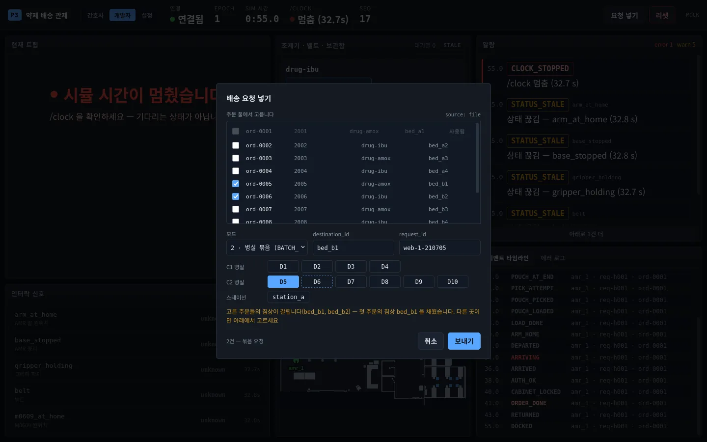
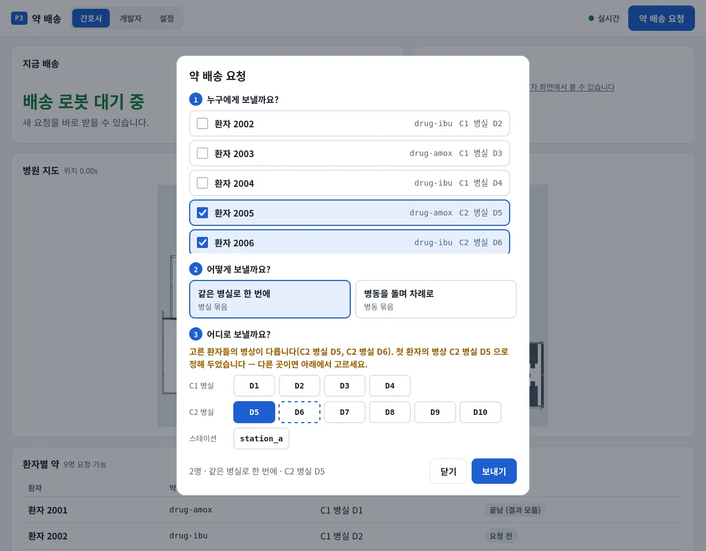
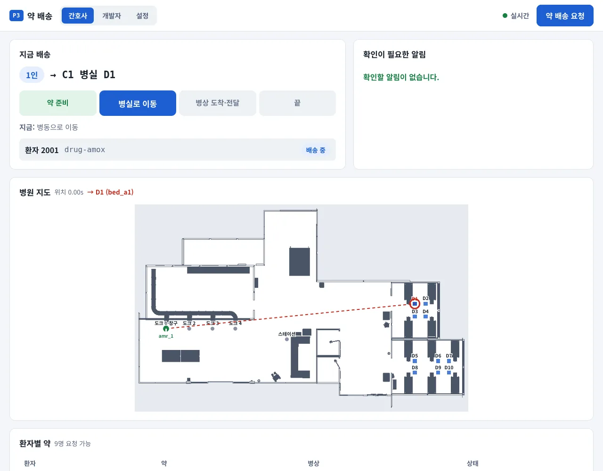
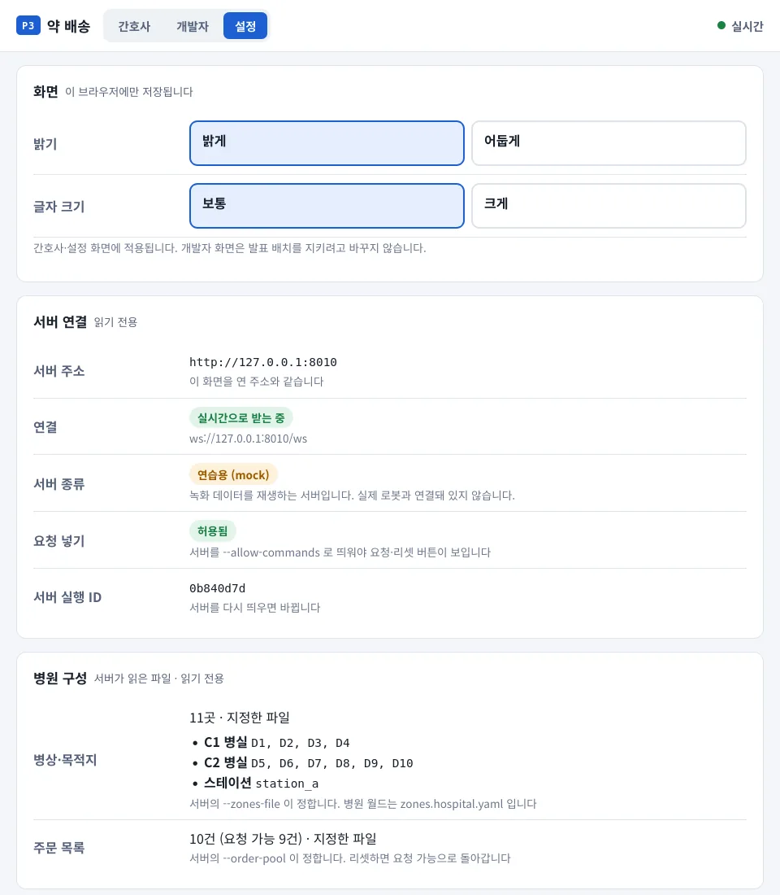
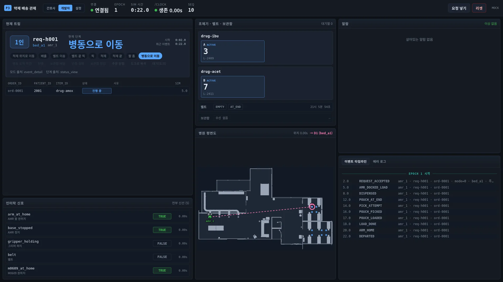
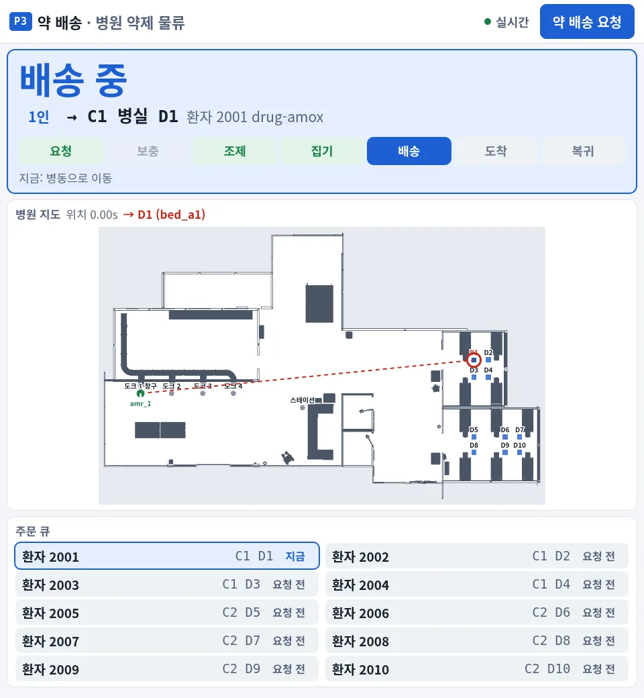
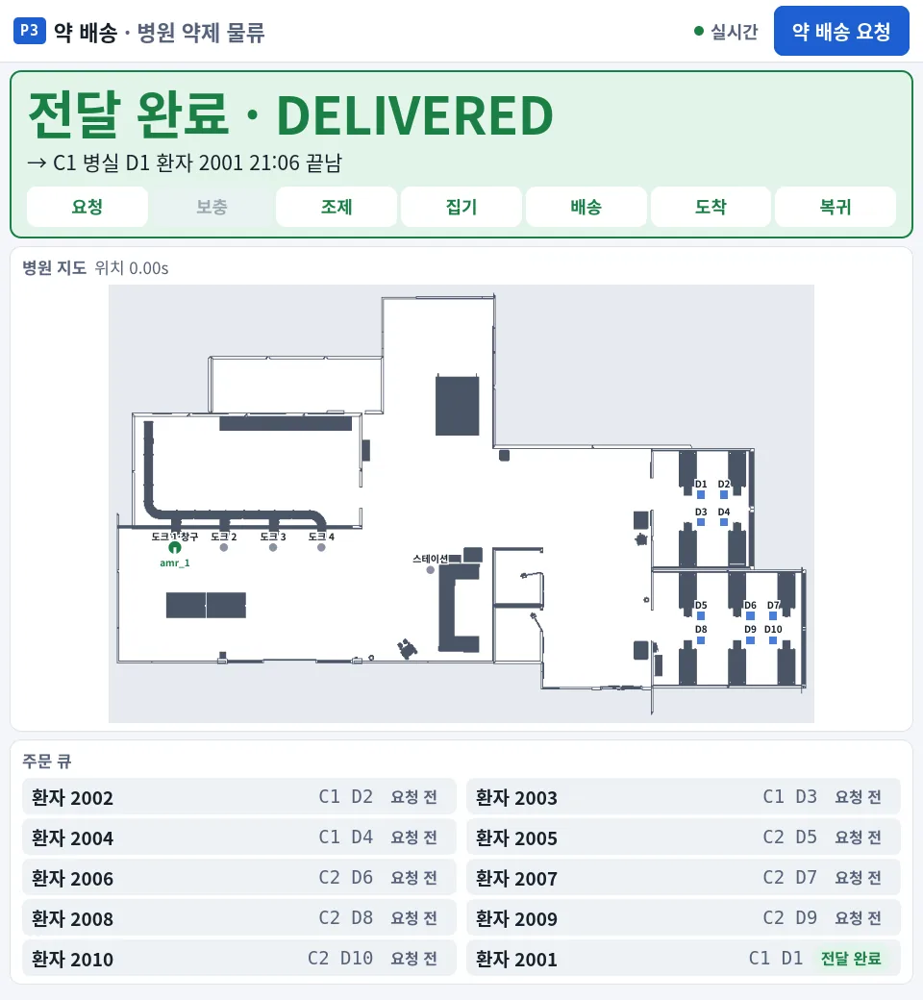
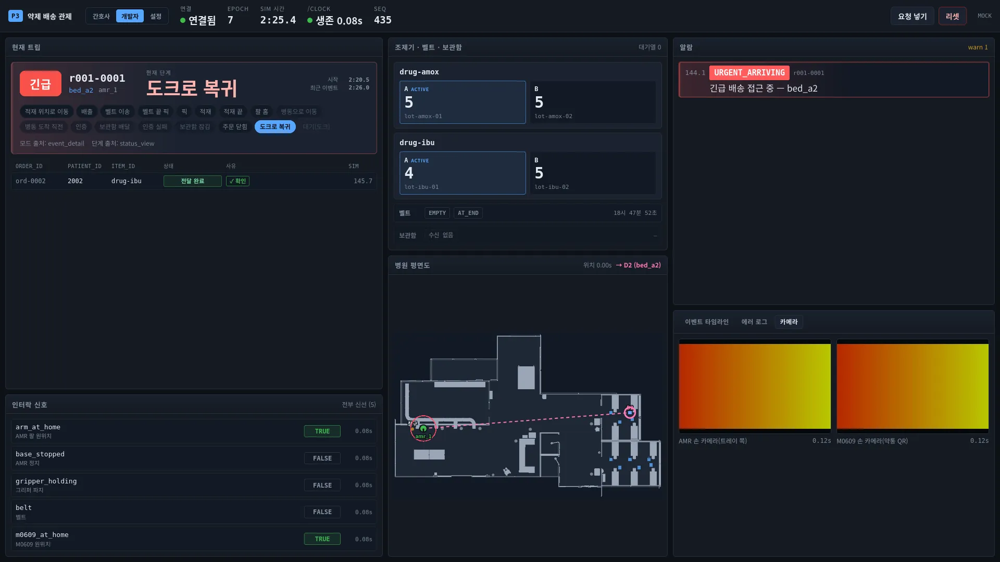
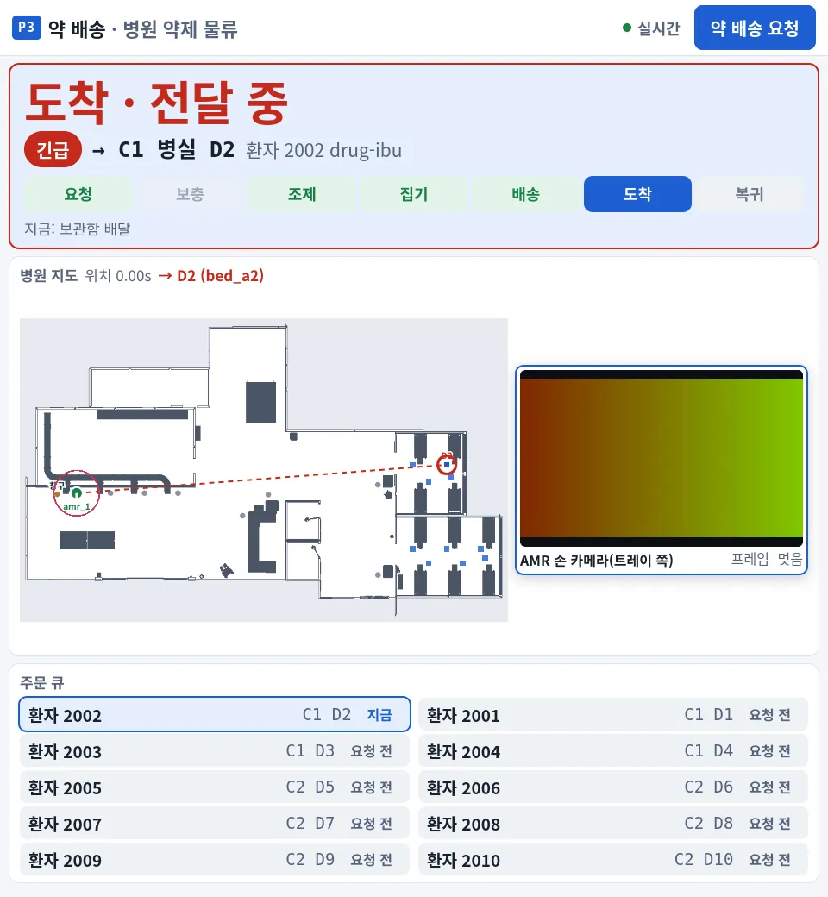

# 관제 웹 화면 (프론트)

병원 약제 배송 시뮬의 상태를 브라우저 한 장으로 본다.
**빌드 없는 정적 페이지다 — Node·npm·번들러 없음, 외부 CDN 없음.**
백엔드가 이 디렉터리를 정적 파일로 서빙하고, 데이터는 [`api.md`](../api.md) 의 API 만 쓴다. ROS 는 모른다.
**로그인·인증이 없다.** 서버 주소에 닿는 사람은 누구나 화면을 본다. 서버가 `--allow-commands` 로 떴으면 누구나 요청·리셋 버튼을 쓴다.
폰 같은 좁은 폭에서 쓸 화면은 `nurse.html` 이다. `index.html` 은 폰에서 쓸 수 없다(6절 "폰·좁은 폭").

대상 해상도는 **1920×1080 한 장, 바깥 스크롤 없음**.
키보드·마우스 조작 없이도 읽히는 것을 우선한다.

**9/21 시연은 1920 한 화면을 반으로 갈라 쓴다 — 왼쪽 Isaac, 오른쪽 약 960 이 이 화면이다
(재범 결정 9/18).** 그 폭에서는 `?demo=1` 로 **시연 모드**를 켠다(7절).

병원 월드 화면(요청 창 병실·병상, 간호사 화면, 설정, 평면도, 촬영 화면)은 **0절**에 스크린샷과 함께 모았다.

---

## 0. 병원 화면

화면은 셋이고 위 내비게이션으로 오간다. 촬영 화면은 간호사 화면의 배치 하나다.
스크린샷은 모두 병원 mock(0.6절)에서 찍었다. AMR 은 mock 에서 dock_1 에 서 있다. 실물에서는 TF 자세로 움직인다.

| 화면 | 주소 | 누가 | 무엇을 |
|---|---|---|---|
| 간호사 | `nurse.html` | 병동 간호사 | 지금 배송(4단계), 확인할 알림, 병원 지도, 환자별 약, 약 배송 요청 |
| 개발자 | `index.html` | 개발·관측·발표 | 1절부터의 전부. `?demo=1` 시연 모드도 여기다. `/` 가 이 화면이다 |
| 설정 | `settings.html` | 누구나 | 이 브라우저의 밝기·글자 크기. 서버 연결·병원 구성은 읽기 전용 |
| 촬영 | `nurse.html?film=1` | 영상 녹화 | 1920 녹화의 오른쪽 반(960×1040). 큰 단계 배너·평면도·주문 큐 |

간호사·촬영 화면은 판정을 새로 만들지 않는다. 같은 `api.js`·`store.js`·`format.js` 를 쓰고 말만 바꾼다.
주소의 `api`·`ws`·`fixture`·`file` 쿼리는 화면을 옮겨도 따라간다. `demo` 는 개발자 화면에만 남는다.

### 0.1 요청 창 — 병실·병상





개발자 창(위, 뒤 화면은 mock 재생이 끝나 시계가 멈춘 상태)과 간호사 창(아래)은 같은 규칙을 쓴다.

- 병상 버튼은 `GET /api/destinations` 의 `group`·`group_label`·`label` 로 병실별로 묶는다(C1 병실 D1–D4, C2 병실 D5–D10).
  서버가 안 주면 `kind` 로 묶고 ID 를 그대로 쓴다. ID 모양(`bed_a1` → A)은 해석하지 않는다.
- 침상이 갈리는 묶음은 **풀 순서로 첫 주문의 침상**을 채우고 주황 안내가 그 사실을 말한다. 고른 주문의 병상은 점선이다.
- 병실 묶음(2)인데 고른 주문이 두 병실 이상이면 보내기를 막는다(서버는 400 `mixed_rooms`). 병실을 모르는 병상이 있으면 서버에 맡긴다.
- 닫기·Esc 로 닫아도 입력이 남는다. 보내기가 수락됐을 때만 비운다.
- 간호사 창은 `request_id` 를 `nurse-<epoch>-<시각>` 으로 스스로 만든다. 1명이면 서버가 환자 침상으로 덮어쓰므로 병상을 고르지 않는다.

### 0.2 간호사 화면



- **지금 배송**은 17단계를 4단계(약 준비 → 병실로 이동 → 병상 도착·전달 → 끝)로 접고, 서버 원문 단계(`지금: 병동으로 이동`)를 같이 적는다.
- 트립이 끝나면 **방금 끝난 배송** 카드가 다음 트립까지 남는다. 전부 delivered 면 `전달 완료 · DELIVERED` 다.
- **확인이 필요한 알림**은 알람 kind 를 간호사 말과 할 일로 바꾼다. 손쓸 것이 아닌 기술 알람은 "시스템 경고 N건" 한 줄이다.
  긴급 도착 알림은 그 트립이 도는 동안만 보인다.
- **환자별 약**은 주문 풀 순서다. 서버는 지금 트립의 결말만 주므로, 화면이 연 뒤 본 결말만 안다. 그 전 것은 "끝남 (결과 모름)" 이다.

- **약 QR 확인**(#784): `POUCH_DETECTED`(검출기가 봉투 QR 을 읽으면 낸다)로 칩을 단다. 환자 확인 전이면 벨트 끝
  `✓ 약 QR`, 뒤면 병상 매칭 `✓ 약 매칭`(간호사 화면 `약 확인됨`). 주문이 약 QR 로 닫히면(`qr_mismatch`·`not_detected`)
  사유를 한글로 적고(`format.js REASON_KO`), 간호사 알림은 "약 봉투가 주문과 달라 멈췄습니다"·"… QR 을 읽지 못해 …" 다.
- **재고 한눈에**(§6.1 `stock`, 재범 9/29 N3): 개발자 조제기 칸 맨 아래 "재고" 줄 — 선반 약통·모듈 남은 수/칸 수,
  조제기 약통 수·약별 봉투 수, 이번 세대 보충 횟수. 간호사 화면은 배너 아래 한 줄 `약제실 재고 — …`(촬영 화면은 숨긴다).
- **QR 판독 내용**(§1.12, 재범 9/29): 개발자 화면 왼쪽 "QR 판독" 칸에 손 카메라가 읽은 QR 을 최근 것부터 적는다 — 종류·ID·요약
  (약 이름·환자·병상·로트·유효기간)·카메라·나이. 간호사 화면은 지금 배송 주문 줄 아래 한 줄 `▣ 약 QR: 아목시실린 … · 환자 QR: 2001 (D1)`.
  QR 그림이 아니다. 그 안 ID 를 서버가 주문 풀·약 카탈로그로 푼 것이다. 판독은 "주문과 맞았다"는 뜻이 아니다. 맞음은 칩이 말한다.
- **환자 확인**: 이번 epoch 의 `AUTH_OK` 와 `AUTH_FAIL` 로 칩을 단다. 주문마다다. `✓ 환자 확인됨` 이다. `✕ 환자 확인 실패` 다. 지금 배송이다. 끝난 배송이다. 환자별 약이다.
  주문 칸이 빈 인증(묶음 정거장)은 그 요청의 주문이 하나일 때만 그 주문 것으로 본다. 그 밖은 칩을 달지 않는다.
- **반쪽 폭이다.** 1100 px 이하다. 1920 녹화의 오른쪽 절반은 960×1040 이다. 한 장에 들어가게 한 칸으로 쌓는다. 글자는 18 px 다.
  간호사 알림이 없으면 알림 칸을 접는다. 있으면 지도를 줄인다. 환자별 약은 두 칸 목록이다. 환자다. 병상이다. 상태다. 확인이다.

### 0.3 설정



밝기·글자 크기는 이 브라우저에만 남는다(`localStorage`, 개발자 화면에는 적용하지 않는다).
서버 연결과 병원 구성(병상·주문 목록의 출처와 수)은 보여 주기만 한다 — 바꾸는 곳은 서버 기동 인자다.

### 0.4 병원 평면도



- 개발자 화면 가운데 칸(시연 모드에서는 트립 바로 아래), 간호사 화면, 촬영 화면에 있다.
- `GET /api/map`·`/api/map/image`(PGM 원본)·`/api/zones` 와 snapshot `robots[]` 를 쓴다. 서버가 지도를 모르면(404) 칸째 감춘다.
- PGM 을 캔버스로 직접 읽는다. 모르는 바깥(회색)은 1 m 여유만 두고 잘라 낸다. 좁으면(1 m < 14 px) 병상 이름표는 목적지·창구만 적는다.
- 목적지는 `robots[].goal_zone`, 없으면 `trip.destination_id` 다. 단계로 목적지를 추측하지 않는다.
- AMR 은 5 Hz 자세 사이를 보간해 그린다. 3 m 넘게 뛰면 보간하지 않는다. stale 이면 회색이다.

- 운영 상태다. 상단에 Isaac Play/Stop 이 있다(`sim_running`, §1.11 — `▶ 시뮬 실행 중`·`⏸ 시뮬 멈춤`·`Isaac 없음`).
  두 PC 모드도 있다(`deployment`, §1.10 — `다중 PC · 도메인 131 · 이 PC: …`). 간호사 화면은 멈춤·없음일 때만 연결 표시 옆에 단다. 설정 화면에도 두 줄이 있다.
- 새 알람(§4.1): 도킹 재시도·포기, 지도 개입·미수신, 장애물 정지. 개발자 알람 칸은 그대로 뜬다. 도킹 포기·지도 미수신은 맨 위에 고정한다.
  간호사 화면은 장애물 정지만 간호사 말로 보인다. 나머지는 "시스템 경고 N건" 으로 센다.
- 감속기(`signals.speed_limit`, api.md §1.9)다. 감속이면 주황 `감속 50%` 다. 정지 규칙이면 빨강 `정지 — 앞 장애물` 다. 3 s 넘게 멎으면 회색 `감속기 멎음` 다.
  제한 없음(100 %)이나 받은 적 없으면 아무것도 달지 않는다. 개발자 트립 칸 머리·평면도 머리·촬영 큰 배너에 단다.
- 여러 AMR(§1.6)이다. 주 AMR(`kind: amr`, TF)은 초록이다. 여벌 AMR(`spare_amr`, fleet_poses)은 보라다. 더미(`dummies[]`)는 노랑이다. 멎으면 회색.
  목적지 점선은 주 AMR 에서만 긋는다. 여벌·더미는 주문이 없다. 평면도 머리에 `여벌 N · 더미 N` 을 적는다.

### 0.5 촬영 화면 (`nurse.html?film=1`)

| 배송 중 | 도크 복귀 뒤 |
|---|---|
|  |  |

1920 녹화의 오른쪽 반(960×1040)에 스크롤 없이 한 장으로 넣는다. 글자 기본은 20 px 이다.
위에서부터 상황 띠, 큰 단계 배너, 병원 지도, 주문 큐 순이다. 지도는 남는 높이를 받는다. 알림은 간호사 알림이 있을 때만 나온다.

- 큰 배너는 지금 단계를 한 마디로 크게 적는다. 예는 배송 중이다. 그 아래에 목적지와 환자가 있다. 7 단계 막대도 있다. 단계는 요청, 보충, 조제, 집기, 배송, 도착, 복귀다.
- 단계는 서버의 `snapshot.stage`(api.md §1.7)를 쓴다. 옛 서버면 `trip.phase` 묶음을 쓴다. 보충은 이 트립이 실제로 거쳤을 때만 완료로 칠한다.
- 주문 큐는 `GET /api/queue`(§7.7)를 1초마다 받는다. 순서는 진행, 대기, 완료다. 두 칸에 그린다. 서버에 없으면 주문 풀로 만든다.
- 트립이 없으면 방금 끝난 결과(`전달 완료 · DELIVERED` 등), 대기, 리셋 중, 약 보충 중을 크게 적는다. 내비게이션은 감춘다. 요청 창은 간호사 화면과 같다.

### 0.5-1 카메라·상판 비전·라이다 (`--live-sensors`)





- 서버를 `--live-sensors` 로 띄울 때만 켜진다(api.md §1.8). 끄면 `/api/cameras` 가 `{"enabled": false}` 다. 카메라 탭이 없다.
- **보이는 동안만 스트림을 연다.** 개발자 화면은 "카메라" 탭을 누를 때 두 카메라를 연다. 탭을 옮기면 `src` 를 비운다. 스트림이 끊긴다.
  촬영 화면은 단계에 맞춰 하나만 연다: 보충·조제는 M0609 손 카메라(약통 QR), 집기·도착은 AMR 손 카메라(트레이 상판). 그 밖에는 닫는다.
  촬영 화면의 카메라는 지도 옆에 둔다. 병원 지도는 오른쪽이 병실(목적지)이다. 겹치면 목적지 고리를 가린다.
- 오버레이는 글자뿐이다(QR 판독·봉투 order_id·신뢰도). 픽셀 박스는 없다. 검출 메시지에 박스가 없다.
- 한 카메라 시청자는 3명까지다(429). 못 붙으면 "스트림 없음 — 다시 붙는 중" 을 띄운다. 3 s 뒤 다시 붙는다.
- 라이다 스캔(`snapshot.scan`, 2 Hz)은 `frame` 이 `map` 일 때만 평면도에 점으로 찍는다. 멎으면 흐리게 찍는다.

### 0.6 병원 mock 띄우는 법

백엔드 venv 는 8절과 같다. 병원 지도, 구역, 주문 풀, 병원 fixture 를 준다. 그러면 위 화면이 모두 병원으로 뜬다.
fixture 사본은 백엔드 `web/backend/fixtures/` 에 있다. 주문 풀 사본도 거기 있다. 백엔드 README 에도 같은 절차가 있다.

```bash
cd web/backend
.venv/bin/python -m app.main --mock --loop --allow-commands \
  --fixture fixtures/hospital_trip.json \
  --order-pool fixtures/order_pool.hospital.dev.yaml \
  --zones-file ../../src/rokey_p3_description/config/zones.hospital.yaml \
  --map-file ../../src/rokey_p3_navigation/config/maps/hospital.yaml \
  --static ../frontend
# http://127.0.0.1:8000/nurse.html          간호사
# http://127.0.0.1:8000/?demo=1             개발자 시연 모드
# http://127.0.0.1:8000/nurse.html?film=1   촬영
```

- `hospital_trip.json` 은 스텁 스택을 녹화한 것이다. 순서는 긴급, C1 병실 묶음, 병동 묶음, 리셋이다.
- `order_pool.hospital.dev.yaml` 은 녹화 때의 10건 사본이다. 원문 `src/rokey_p3_orchestrator/config/order_pool.hospital.yaml` 은 13건이다(테이블 주문 3건이 더 있다).
- `--loop` 를 빼면 재생이 끝난 뒤 `CLOCK_STOPPED`·`STATUS_STALE` 이 뜬다. 끝난 배송 카드처럼 트립 뒤의 대기 화면을 볼 때만 뺀다.
- `--map-file` 이 없으면 평면도와 `robots` 가 꺼진다. `--zones-file` 이 없으면 병상 버튼이 빈월드 목록(`bed_a1`·`station_a`)이다.
- mock AMR 은 `dock_1` 에 서 있다(api.md §1.6). 지도 위 이동은 실물(TF)에서만 보인다.
- 위 스크린샷은 이 fixture 가 들어오기 전에 찍었다. 1인 한 바퀴다. 경로는 ord-0001, bed_a1, 도크다. 합성 fixture 로 찍었다. 화면은 같다.

### 0.7 스크린샷 다시 찍기

firefox headless `--screenshot` 은 load 시점에 찍는다. 느리게 오는 이미지를 하나 물려 데이터가 올 시간을 준다. CSS·JS 에 `?v=` 를 붙인다. 프로필 캐시(`cache2`)를 지운다. import 된 모듈은 `?v=` 가 안 닿는다(9절). 한 프로필로는 한 번에 한 창만 찍힌다. 트립 전이(끝난 배송 카드 등)는 페이지를 연 채 트립이 끝나야 보인다. 지연을 트립 길이만큼 늘려 찍는다. 이미지는 `docs/images/web/*.webp` 로 줄여 넣는다.

---

## 1. 화면 구성

```
┌─ 상단바 ── 연결 · epoch · sim 시간 · /clock · seq ──────── [요청 넣기] [리셋] ─┐
├──────────────────┬──────────────────────┬──────────────────────────────────┤
│ 현재 트립         │ 조제기 · 벨트 · 보관함 │ 알람                              │
│  모드 배지        │  약별 슬롯 / 재고      │  level 색, kind, 메시지           │
│  단계 스텝퍼      │  PAUSED · 보충 흐름    │  최신이 위, URGENT_ARRIVING 강조   │
│  주문별 상태 표   │  벨트 · 보관함         ├──────────────────────────────────┤
├──────────────────┤                      │ [이벤트 타임라인] [에러 로그]      │
│ 인터락 신호       │                      │  서버 순서 그대로 · 리셋 구분선     │
│  값 + 신선도      │                      │  로그는 노드·level 필터           │
└──────────────────┴──────────────────────┴──────────────────────────────────┘
```

- **현재 트립** — orchestrator 는 동시에 한 트립만 받으므로 한 장을 크게 그린다.
  단계 스텝퍼의 글자는 `status_view.py` 의 한글 원문(`phase_label`)을 그대로 쓴다.
  1차 시연 구간이 조제실이라 **병동 단계는 자리만 두고 흐리게** 둔다.
- **알람** — 패널 밖으로 밀린 알람이 있으면 바닥에 `아래로 N건 더` 를 고정 표시한다.
  벽 화면에서는 아무도 스크롤하지 않기 때문이다. 잘린 것 중에 error 가 있으면 그것도 밝힌다.

### 사람이 잘못 읽던 것들

넷 다 **데이터는 맞는데 사람이 다르게 읽던** 경우다. 고친 이유를 남겨 둔다.

| 무엇 | 그 전에는 | 지금 |
|---|---|---|
| 트립이 없을 때 | 회색 "진행 중인 트립 없음" 한 줄 | 초록 **"대기 중 — 새 요청을 기다립니다"** + 깜빡이는 점. 갱신 끊김·리셋·`/clock` 멈춤과 각각 다르게 그린다 |
| 조제실 정상 완주 | 노란 "보류 회수" + 빨간 테두리 | 초록 **"조제실 구간 완료"**. 트립 전체가 그러면 머리에 "조제실 한 바퀴 완료" |
| 보충 | `REFILL_DONE` 원문 한 줄 | 약통 종류 색 견본 + **"원통형 → 원형 수납통 · 칸 floor_left/r0c0"** |
| `ORDER_DONE` | 이름만 | 그 주문의 **결말을 같이** 찍는다. "끝났다" 는 성공이 아니다 |

**대기 중은 정상이고 멈춤은 이상이다.** 실습3 에서 사람이 대기 상태를 "또 정지했다" 로 읽어서
갈랐다. 깜빡이는 점은 멈춘 화면과 구분되는 **유일한 움직임**이라, 글자를 안 읽어도 살아 있는 것이 보인다.

## 2. 파일 역할

| 파일 | 하는 일 |
|---|---|
| `index.html` | 골격. 패널 자리와 id 만 있고 값은 JS 가 채운다 |
| `css/app.css` | 1920×1080 한 장 레이아웃, 시연 모드(`body.is-demo`), 색·대비 |
| `js/api.js` | **서버 접촉을 모으는 유일한 모듈** — §3 참고 |
| `js/store.js` | seq 커서 / epoch 리셋 / `server_run_id` 교체 / 이벤트·알람 보관 |
| `js/format.js` | 코드 값 → 사람이 읽는 표기 (모드·주문 상태·단계 track) |
| `js/dom.js` | 작은 DOM 헬퍼. 텍스트는 전부 `textContent` 로 넣는다 |
| `js/main.js` | 개발자 화면 배선. 연결 → store → 패널. 판정 로직을 두지 않는다 |
| `js/live.js` | 연결 배선(snapshot → WS → store, 재연결 뒤 메우기). 세 화면이 같이 쓴다 |
| `js/nav.js` | 화면 사이 내비게이션. 서버를 가리키는 쿼리를 넘긴다 |
| `nurse.html` · `js/nurse.js` | 간호사 화면이다. 알람 kind·거부 code 를 간호사 말로 바꾸는 표가 여기 있다. api.md 에 kind·code 가 늘면 같이 본다 |
| `settings.html` · `js/settings.js` | 설정 화면 |
| `js/prefs.js` | 밝기·글자 크기(이 브라우저의 localStorage). 개발자 화면에는 적용하지 않는다 |
| `css/nurse.css` | 간호사·설정 화면. 밝은 바탕이 기본, 어두운 바탕은 `<html data-theme="dark">` |
| `js/panels/floormap.js` | 병원 평면도. PGM 을 캔버스로 직접 읽고, 구역·AMR 위치·목적지를 겹쳐 그린다. 두 화면이 같이 쓴다 |
| `js/panels/*.js` | 패널별 그리기. **서버 필드 이름을 모른다** — store 가 준 모양만 안다 |

## 3. api.md 가 바뀌면 — `js/api.js` 만 고친다

계약은 [`api.md`](../api.md) 한 곳이다.
패널은 서버 필드를 모르므로, 계약이 바뀌어도 손댈 곳은 한 파일이다.

| 바뀐 것 | 고칠 곳 |
|---|---|
| snapshot 필드 이름·모양 | `normalizeSnapshot()` 과 그 아래 `map*()` |
| WS 봉투(`type`) 종류 | `dispatch()` |
| 엔드포인트 경로·파라미터 | `fetchSnapshot` / `fetchEvents` / `fetchLogs` / `fetchAlarms` / `fetchOrderPool` |
| 명령 API | `postReset` / `postRequest` |
| 신선도 임계 | `STALE_TOPIC_S` / `STALE_CLOCK_S` |
| 신호 키 목록 | `SIGNAL_KEYS` / `SIGNAL_LABEL` |

`normalizeSnapshot()` 주석에 화면 모델의 모양이 적혀 있다. 그 모양만 유지하면 패널은 안 고쳐도 된다.

## 4. 지켜야 하는 규칙

계약([`api.md`](../api.md))에서 온 것들이고, 어기면 사람이 잘못된 판단을 한다.

- **"값이 낡았나" 와 "연결이 끊겼나" 는 다른 판정이다. 섞지 않는다.**

  | 보는 것 | 어떻게 |
  |---|---|
  | 신호가 낡았나 | 서버가 준 `age_wall_s` · `stale` **그대로** |
  | 연결이 끊겼나 | **마지막 WS 프레임 이후 3초 경과** (`PUSH_GRACE_S`) |

  `age_wall_s` 에 *스냅샷을 받은 뒤 흐른 시간*을 **더하지 않는다.** 한때 그렇게 했는데,
  서버가 조용한 구간에서 멀쩡한 신호가 전부 `unknown` 으로 뒤집혔다.
  서버는 변화가 없어도 1초에 한 번 `snapshot` 을 push 하므로 **소켓의 침묵은 곧 죽음**이다.
  생존 확인을 REST 로 하지 않는다 — 같은 일을 두 경로로 하면 어느 쪽이 화면을 갱신했는지 알 수 없다.
  `GET /api/snapshot` 은 첫 화면과 재연결 복구에만 쓴다.

- **연결이 끊기면 살아 있는 것처럼 보이지 않는다.** 배너 + 화면 전체 흐림 + 모든 신호 `unknown`.
- **이벤트는 서버가 준 순서 그대로** 그린다. 클라이언트에서 재정렬하지 않는다.
- **epoch 이 바뀌면 이벤트·알람을 통째로 버린다.** 세대가 다른 이벤트를 한 목록에 섞지 않는다.
- **`mode`·`destination_id`·`patient_id`·`item_id` 는 `null` 일 수 있다.**
  빈칸이 아니라 "알 수 없음"으로 그린다 (`/deliver` 가 액션이라 goal 이 토픽에 안 나온다).
- **`detail` 은 구조 파싱 대상이 아니다.** 유일한 예외가 `REQUEST_ACCEPTED` 의 compact JSON 이다.
- **`phase_label` 은 그대로 찍는다.** `ARRIVED` → `phase="arrived"` 인데 `phase_label="인증"` 처럼
  한 칸 어긋나 보이는 것은 status_monitor 터미널과 같은 규칙이다. 고쳐 쓰지 않는다.
- **주문의 종료 상태는 `ORDER_DONE` 이벤트가 아니라 `orders[].state_name` 이 말한다.**
- **명령 버튼은 `commands_enabled` 가 참일 때만 보이고, 403 을 받으면 숨긴다.** 확인 창 1회.
- **슬롯 용량은 계약에 없다.** 비율 막대를 만들지 않고 `count` 를 그대로 크게 보여준다.

## 5. 색

**약통 종류는 Isaac 스테이지 값 그대로다** — `sim/standalone/p3sim/layout.py` 의 `COLORS`.
같은 물건이 두 화면에 다른 색으로 보이면 안 된다.

| 뜻 | 값 | 비고 |
|---|---|---|
| 원통 약통 | `#F28C26` | 배경 대비 7.05:1 |
| 모듈 약통 | `#8C4CCC` | 배경 대비 **3.31:1 — 글자색으로 못 쓴다** |

3D 장면 조명을 받는 색이라 어두운 UI 에서 글자색으로 쓰면 대비가 모자란다. 그래서
**색 견본(작은 사각형)으로만 쓰고 글자는 일반 색**으로 둔다. 견본은 색을 보여주는 것이
목적이라 대비 규칙의 대상이 아니고, **스테이지 값은 한 비트도 바꾸지 않는다.**
"같게" 는 색조 수준이다 — Isaac 이 조명·톤매핑을 거치므로 픽셀 단위로는 다르다.

### 묶음 모드 배지는 자홍이다

병실 묶음이 보라 `#a371f7` 였는데 자홍 `#FF7AB6` 으로 옮겼다. 두 가지 이유다.

1. **녹색약 시야에서 `1인` 파랑과 RGB 거리 14** 로 사실상 같은 색이었다.
   약통 색 충돌이 없었어도 고쳐야 할 결함이었다.
2. 모듈 약통 보라 `#8C4CCC` 와도 겹쳤다.

자홍은 정상·녹색약·적색약 셋 다에서 다른 모든 색과 **97 이상** 떨어지고 배경 대비 7.18:1 이다.

`canister_pick`(`#E62626`, 스테이지의 "집을 것" 빨강)은 **쓰지 않았다.**
긴급 `#f85149` 와 적색약 시야에서 거리 17 로 거의 같다.

**색을 더할 때는 색약 시야에서도 재라.** 정상 시야 거리만 보면 오늘 같은 결함을 또 만든다.

## 6. 화면 크기 — 읽히는 것은 폭에 달려 있다

**글자 크기는 1920 폭에서 3 m 거리를 기준으로 잡았다.** 표지판 규칙(글자 높이 ≥ 거리/200,
3 m → 15 mm)으로 요소별 필요 화면 폭을 환산했다.

| 요소 | font-px | 3 m 에서 읽히려면 |
|---|---|---|
| 조제기 재고 숫자 | 30 | 화면 폭 1.4 m |
| 현재 단계 | 36 | 1.1 m |
| 모드 배지 | 22 | 1.9 m |
| 알람 메시지 | 17 | 2.4 m |
| 신호·스텝퍼·타임라인 | 12 | 3.4 m |

**두 층으로 나눈다.**

- **3 m 층** — 현재 단계, 모드 배지, 알람, 조제기 재고·`PAUSED`·보충 중, 상단바 연결·epoch.
  설명 없이 읽혀야 한다.
- **걸어가서 보는 층** — 타임라인, 에러 로그, 신호 값, 주문 표, 단계 스텝퍼.
  스텝퍼는 3 m 에 3.4 m 폭이 필요하고 키우면 17칸이 줄바꿈된다. 현재 단계 36px 로 대체한다.

### 창 폭이 1920 이 아니면 전제가 깨진다

실습8 의 master02 firefox 는 **창 폭이 1043** 이었다. 같은 화면이 물리적으로 절반 크기라
**3 m 층도 절반이 된다.** 55인치 TV 에서 안 읽히던 것이 1043 창에서는 프로젝터로 띄워도 안 읽힌다.

폭에 따라 배치가 달라진다.

| 폭 | 배치 |
|---|---|
| 1500 초과 | 세 칸. 현재 단계는 트립 머리 가운데 |
| 1200-1500 | 세 칸. **현재 단계를 한 줄 아래로** 내린다(가운데 두면 "적…" 으로 잘린다) |
| 1200 이하 | **두 칸.** 왼쪽 트립·신호, 오른쪽 조제기 / 알람·타임라인. 주문 표의 환자·약품은 접는다 |

**패널은 옆으로 스크롤되지 않는다**(`overflow-x: hidden`). 내용은 줄바꿈하거나 말줄임한다.
`overflow-y` 만 `auto` 로 두면 x 축도 `auto` 가 되어 좁은 창에서 흰 가로 스크롤바가 생겼다.

**위 표는 1920 을 통째로 쓸 때의 이야기다.** 9/21 시연은 그 절반(약 960)만 쓰기로 했으므로
크기를 그 폭 기준으로 다시 잡았다 — **7절**에 실제 화면에서 mm 로 잰 값과 결론이 있다.
요약하면 **이 노트북 패널로는 3 m 가 성립하지 않고, 보장되는 것은 1 m 다.**

### 폰·좁은 폭

- **`index.html`(개발자)은 폰에서 쓸 수 없다.** `app.css` 의 가장 좁은 배치는 1200 px 이하의 두 칸이다. 그보다 좁은 배치는 없다.
  `html, body` 가 `overflow: hidden` 이라 두 칸이 폰 폭으로 눌리고 넘친 내용은 스크롤로도 못 본다.
- **`nurse.html`(간호사)은 좁은 폭 배치가 있다.** `nurse.css` 가 900 px 이하에서 한 칸으로 쌓고(지금 배송 → 알림 → 지도 300 px → 환자별 약), 560 px 이하에서 환자별 약 표의 둘째 칸을 감춘다.
  요청 창 폭은 `min(640px, 100vw − 32px)` 이다. 폰에서 요청을 넣는다면 이 화면이다.
- `settings.html` 은 600 px 이하에서 설정 줄을 한 칸으로 접는다.
- 촬영 배치(`nurse.html?film=1`)는 960×1040 녹화용이다. 높이를 `100vh` 로 고정하고 스크롤을 막아 폰용이 아니다.
- 위는 CSS 규칙으로 본 것이다. 실제 폰 브라우저로 연 기록은 없다(미확인).

## 7. 시연 모드 (`?demo=1`)

1920 을 반으로 갈라 오른쪽 960 만 쓰는 배치다. 여는 방법은 **URL 파라미터뿐이다.**

```
http://<호스트>:<포트>/index.html?demo=1
```

**폭으로 자동 전환하지 않는다.** 이 모드는 신호 표·이벤트 타임라인·에러 로그·스텝퍼를
**감춘다.** 정보를 감추는 전환이 창 크기 때문에 저절로 일어나면 안 된다. 좁은 창은 이미
1200 px 아래 두 칸 배치가 따로 받고 있다.

| | |
|---|---|
| **키운다** | 모드 배지 36 px, 현재 단계 48 px, 재고 수량 44 px, 대기/멈춤 40 px, 정지·보충 배지 20 px, 주문 상태 20 px, 보충 흐름 22 px |
| **감춘다** | 인터락 신호 표, 이벤트 타임라인, 에러 로그 탭, 단계 스텝퍼, 주문 표 헤더와 환자·약품 칸, 출처 주석 |
| **조건부** | 알람 패널은 알람이 있을 때만 자리를 쓴다(`body.has-alarm`) |
| **남긴다** | 상단바의 `요청 넣기`·`리셋` — 운영자가 요청을 넣을 수 있어야 한다 |

조제기 패널은 보충 줄(`보충` 흐름, `마지막 보충`)을 **맨 위로** 올리고 조제기 두 대를
가로로 나란히 놓는다. 알람이 끼어들어 패널이 짧아져도 보충 흐름이 스크롤 밖으로
밀려나지 않게 하기 위해서다.

**1920 전체 화면 배치는 건드리지 않는다.** 모든 규칙이 `body.is-demo` 아래에만 있다.

### Zoom 같은 화면 공유로 보여줄 때

시연은 테이블 모니터 아니면 **PC 화면 공유**다(재범 9/18). 둘 다 보는 거리는 1 m 안팎이라
아래 mm 계산이 그대로 맞지만, 화면 공유에는 mm 과 **다른 제약**이 하나 더 붙는다.

**Zoom 은 1080p 이하로 압축해서 보낸다.** 대역이 좁으면 1280×720 까지 내려가는데, 그러면
이 화면의 960 폭은 상대 눈에 **640 px** 로 도착한다. 글자가 2/3 로 줄고 그 위에 손실 압축이
얹히므로, **작고 흐린 글자부터 뭉개진다** — `LOT` 13 px → 8.7 px, 패널 제목 15 px → 10 px,
주문 번호 16 px → 10.7 px. 색이 옅은 것(`--fg-faint`)이 먼저 사라진다.

시연 모드의 층 나누기가 그대로 방어가 된다. **키운 것들은 압축을 견딘다** — 현재 단계
48 px → 32 px, 재고 44 px → 29 px, 모드 배지 36 px → 24 px 로 도착한다. 못 견디는 것들은
이미 "걸어가서 보는 층" 으로 정리해 둔 것들이라, **화면 공유로는 원래 안 읽히는 게 맞다.**
발표자가 그 값을 말로 읽어 줘야 하는 것은 표 아랫줄들이다.

모니터 크기가 정해지면 아래 mm 표를 다시 계산한다.

### 3 m 가독은 이 노트북 패널에서 성립하지 않는다

시연 화면(`eDP-1`)은 1920×1080 px / 344×194 mm = **5.58 px/mm** 다.
#153 기준(글자높이 ≥ 거리/200)으로 3 m 는 15 mm 이고, 한글 기준 **font-size 105 px** 가
필요하다. 960 폭에 9 자 들어간다. 나머지 요소까지 그 크기로 올릴 자리는 없다.

960×1040 에서 실제로 잰 값(한글 0.80×font-size, 영숫자 0.72×font-size):

| 요소 | font-size | 글자높이 | 읽히는 거리 |
|---|---|---|---|
| 현재 단계 | 48 px | 6.9 mm | **1.38 m** |
| 재고 수량 | 44 px | 5.7 mm | **1.14 m** |
| 모드 배지 | 36 px | 5.2 mm | **1.03 m** |
| 보충 흐름 단계 | 22 px | 3.2 mm | 0.63 m |
| 주문 상태 | 20 px | 2.9 mm | 0.57 m |
| 마지막 보충 본문 | 17 px | 2.2 mm | 0.44 m |

**이 배치가 실제로 보장하는 것은 1 m 다** — 앞의 세 줄. 3 m 를 진짜로 맞추려면 큰 줄
하나만이라도 37 인치 이상 외부 디스플레이가 필요하고, 표의 아랫줄까지 맞추려면 96 인치가
필요하다. 노트북 패널로 하는 한 **심사위원이 화면 앞 1 m 안에 있어야 한다.**

---

## 8. 개발 중 보기

가장 쉬운 길 — 백엔드가 이 디렉터리를 서빙하게 한다 (같은 출처라 CORS 가 필요 없다):

```bash
cd web/backend
.venv/bin/python -m app.main --mock --allow-commands --loop \
  --static ../frontend
# http://127.0.0.1:8000
```

백엔드 없이 화면만 볼 때:

```bash
python3 -m http.server 8765        # 이 디렉터리에서
```

| 주소 | 무엇 |
|---|---|
| `index.html` | 같은 출처의 백엔드에 붙는다 (운영 경로) |
| `index.html?api=http://127.0.0.1:8000&ws=ws://127.0.0.1:8000/ws` | 다른 포트의 백엔드 (백엔드에 CORS 필요) |
| `index.html?fixture=1` | 서버 없이 `dev-fixture.json` 으로 화면만 |
| `index.html?fixture=1&file=dev-fixture-unknown.json` | `mode`·`patient_id`·`item_id` 가 전부 `null` 인 화면 |

fixture 는 **명시적으로 켜야만** 동작한다. 연결이 끊겼을 때 조용히 가짜 데이터로 떨어지면
옛 값이 살아 있는 것처럼 보이기 때문이다.

두 fixture 는 **mock 서버의 실제 `/api/snapshot` 응답을 그대로 받아 둔 것**이라 모양이 계약과 같다.
계약이 바뀌면 다시 받아 두면 된다:

```bash
curl -s http://127.0.0.1:8000/api/snapshot | python3 -m json.tool > dev-fixture.json
```

## 9. 검증 방법

브라우저 자동화 도구를 설치하지 않고 확인한다.

**눈으로 한 바퀴** — 위 `--static` 으로 띄우고 mock 한 편(조제실 한 바퀴 + 보충 + 리셋)을 본다.
`--loop` 를 붙이면 계속 돈다. 봐야 할 것:

| 볼 것 | 어디서 |
|---|---|
| 조제실 한 바퀴 | 타임라인에 배출→벨트→픽→적재→`ORDER_DONE`→`DOCKED` |
| 보충 | 조제기 패널의 보충 흐름 띠(정지→보충 중→재개). 단계는 서버의 `dispenser.paused`·`refilling` 으로만 정한다(#560) |
| epoch 전환 | 리셋 지날 때 타임라인·알람이 통째로 비워지는가 |
| `null` 화면 | `req-0002` 구간에서 "모드 불명" / "알 수 없음" |
| 끊김 | 서버를 내렸을 때 배너 + 흐림 + 신호 전부 `unknown` |

**스크린샷** — `firefox --headless --screenshot` 은 load 이벤트 시점에 캡처하므로
WS·fetch 로 오는 값이 안 잡힌다. 느린 이미지를 하나 물려 load 를 늦춘 임시 페이지로 찍는다.
방법은 `tools` 가 아니라 작업용 임시 디렉터리에 둔 `shotdelay.py` 주석에 적어 두었다.
firefox 가 snap 이면 `/tmp` 가 격리되니 프로필·출력 경로를 홈 밑으로 잡아야 한다.

> **캐시 무력화는 `import` 한 모듈까지 안 간다.** `index.html` 이 부르는 것은
> `css/app.css` 와 `js/main.js` 둘뿐이라 거기에만 `?v=` 를 붙이기 쉬운데,
> **`main.js` 가 `import` 하는 `panels/*.js`·`store.js`·`format.js`·`api.js` 는
> 그대로 캐시에서 나온다.** `alarms.js` 를 두 번 고치고 두 번 다 "화면이 안 바뀐다" 를
> 보고 **내 수정을 의심했다. 코드는 처음부터 맞았고 브라우저가 옛 파일을 읽고 있었다.**
> 찍기 전에 프로필 캐시(`<프로필>/**/cache2`)를 지운다.
>
> 서버 sha 를 적는 것과 같은 질문이다 — **"지금 도는 게 내가 고친 그것인가."**
> 서버만 확인하고 클라이언트를 안 보면 절반만 확인한 것이다.

**서버 없이 로직만** — `store.js` 의 이벤트 누적·epoch 리셋은 순수 함수에 가까워서,
받아 둔 snapshot 여러 장을 순서대로 먹여 보면 브라우저 없이도 확인된다.

**거부 문구** — 요청 거부(§7.2)는 **화면에서 재현하기가 어렵다.** 화면이 트립 중·리셋 중에
보내기를 미리 잠그기 때문에, 눌러서 거부를 받아 볼 수 있는 경우가 얼마 안 남는다.
그래서 두 층으로 나눠 확인한다.

1. **서버가 무엇을 주는가** — `POST /api/requests` 를 직접 찔러 `code` 와 `detail` 을 받아 적는다.
   순서가 있으므로(`api.md` §0.4) 앞 검사에 걸리면 뒤 code 는 안 나온다. 예: 묶음 요청에
   `destination_id: "room_a"` 를 쓰면 모양이 안 맞아 `bad_destination` 이 먼저 난다.
2. **화면이 뭐라고 쓰는가** — `js/main.js` 에서 `REJECT_HINT` 부터 `rejectHint` 까지의 블록만 떼어
   node 로 실행하고, 1에서 받아 둔 **진짜 `detail`** 을 먹인다. `main.js` 는 `document` 를
   건드려 통째로 import 가 안 되지만, 그 블록은 순수하다. **배포되는 그 문구가 도는지**를
   보는 것이 요점이고, 손으로 옮겨 적은 사본을 보면 의미가 없다.

**만들 수 없는 거부가 있다.** 확인했다고 쓰지 말고 못 만들었다고 쓴다.

| code | 왜 |
|---|---|
| `rejected` | orchestrator 가 사유 없이 거부하는 경로다. 웹에서 만들 수단이 없다 |
| `insufficient_stock` | 기본 풀(4건)로는 안 난다 — 재고가 더 많아 모자랄 수가 없고, 0 이 되면 `refill_in_progress` 가 먼저 잡는다. `--order-pool` 로 **재고보다 주문이 많은 풀**을 넣어야 난다 |
| `bad_destination` | 1인·긴급(mode 0·1)에서는 안 난다 — 서버가 목적지를 풀의 침상으로 덮어쓴다. 묶음(mode 2·3)으로 확인한다 |

### 잰 것을 보고할 때는 측정 대상을 먼저 적는다

```
pid 115720 · 2026-09-18 14:47:53 기동 · cwd ~/Dev/P3/ROKEY_P3_A3/web/backend · sha 6d3a2fc
--mock --loop --allow-commands --port 8001
```

**pid · 기동 시각 · 작업 디렉터리 · sha** 넷이다. 이 습관은 사고로 생겼다 — 고쳤다는 서버를
재 봤는데 **그 프로세스가 수정 전 코드로 돌고 있었다.** 기동 시각이 커밋 시각보다 빨랐는데
아무도 안 봤다. 명령줄에 다 적혀 있었다.

**그리고 "그 조건에서 그 버그가 드러날 수 있나" 를 결과와 같이 남긴다.**
커서 페이징을 14건으로 재고 통과했다고 읽은 적이 있다. 표본을 126건으로 키워도
**mock 은 그 버그가 나는 조건(seq 순서 ≠ 전달 순서)을 만들지 않아서** 여전히 무의미했다.
`p3web-front-tools/measure_cursor.py` 는 `RESULT` 옆에 `조건 재현: 예/아니오` 를 같이 찍는다.

### 실데이터로 확인한 이력

| 언제 | 무엇 | 결과 |
|---|---|---|
| 실물 ROS 스텁 (9/17) | 조제실 한 바퀴, 리셋, 긴급 배지 | **타임라인에서 `RESET_BEGIN`·`RESET_DONE` 이 사라졌다** — `seq` 로 중복을 걸러서. mock 에서는 안 나던 버그 |
| 실습8 Isaac v2 (9/18) | 보충 종류 표시 첫 실데이터 | 표시는 맞았고 **좁은 창(1043)에서 글자가 겹치고 쪼개졌다** |
| 실습8 (9/18) | 묶음 요청 거부 | 사유 없는 거부 문구가 도움이 안 됐다 |

**세 번 다 mock 으로는 안 나온 것들이다.** mock 은 이벤트를 한 줄로 재생하고, 창을 넓게 쓰고,
모든 거부에 `message` 를 채운다. **실물에 붙여 보기 전에는 "확인됐다" 고 쓰지 않는다.**

**확인한 브라우저는 firefox 뿐이다.** 작업 기계에 chromium 계열이 없고 설치가 금지라
Chrome/Chromium 은 **미검증**이다. 쓰는 기능은 표준 범위(ES 모듈, `<dialog>`, `color-mix()`,
`position: sticky`)라 큰 문제는 없을 것으로 보지만, 시연 기계 브라우저가 다르면 한 번 열어 봐야 한다.

## 10. 실물 연결 점검표

여기까지는 mock(fixture 재생)으로만 확인했다. 실물 ROS 에 붙이면 **mock 과 다를 수 있는 것**이
있고, 대부분 화면에서 먼저 드러난다. 첫 실물 한 바퀴에서 아래를 순서대로 본다.

실행은 그 기계 로컬에서: `stub_loop`(도메인 118) + 실물 모드 백엔드 + 이 화면.

| 볼 것 | mock 에서는 | 실물에서 달라질 수 있는 것 | 화면에서 확인 |
|---|---|---|---|
| **하트비트 주기** | 재생 중 마지막 값을 계속 다시 실어 신호 나이가 늘 0.1 s 아래 | 토픽마다 발행 주기가 다르다(Bool 하트비트, `BeltState` 5 Hz, `DispenserStatus` 1 Hz + 변화 시). 주기가 1.0 s 임계보다 느리면 신호가 정상인데도 `unknown` 으로 깜빡인다 | 인터락 신호 패널이 정상 운전 중에 `전부 신선 (5)` 를 유지하는가. `stale N/5` 가 오르내리면 임계(1.0 s)나 발행 주기 쪽 문제다 |
| **이벤트 도착 순서** (실물에서 확인됨) | 한 줄로 재생되어 `seq` 와 stamp 가 같이 증가 | `/events` 가 `transient_local` 이라 붙는 순간 작성자별로 뭉쳐 온다. **`seq` 가 25, 26, 1, 2, 9, 10 처럼 뒤죽박죽인데 stamp 는 단조 증가한다.** `seq` 는 서버가 도착 순으로 매기고, 전달 순서는 `event_key`(epoch, 리셋 구분, stamp, 도착 순번) 정렬이기 때문이다 | 타임라인의 stamp 가 단조 증가하는가. **`seq` 는 커서로만 쓰고 순서·중복 판정에 쓰지 않는다** — `seq > cursor` 로 거르면 뒤에 온 낮은 seq 를 통째로 버린다(실제로 `RESET_BEGIN`·`RESET_DONE` 이 사라졌다). 중복은 본 `seq` 집합으로 거르고, 세대 전체는 `since=0` 으로 한 번에 받아 서버 순서 그대로 쓴다 |
| **`detail` 실제 값** | `REQUEST_ACCEPTED.detail` 에 compact JSON 이 들어 있다 | 그 변경이 안 들어간 빌드면 `detail` 이 **빈 문자열**이다. 그러면 `mode`·`destination_id`·`patient_id`·`item_id` 가 전부 `null` 이다 | 트립 카드가 "모드 불명" + "알 수 없음" 으로 뜨는가. 그 화면은 **오류가 아니라 정상 경로**다. `mode_source` 값도 같이 본다 |
| **epoch 1 시작** | 1 에서 시작해 리셋마다 오른다 | `/events` 가 `transient_local` depth 500 이라, 붙는 순간 **지난 epoch 이벤트가 한꺼번에 들어올 수 있다** | 타임라인 머리의 `EPOCH N 시작` 이 현재 세대와 맞는가. 지난 세대 이벤트가 섞여 보이면 epoch 판정이 틀린 것이다 |
| **`/rosout` 실제 문구** | 합성 6줄, 짧고 노드 이름이 짧다 | 실제 노드 이름과 메시지는 더 길고 형식도 다르다 | 에러 로그 탭에서 노드 칸(126 px)이 잘리는가, 긴 메시지가 제대로 줄바꿈되는가, level 필터(fatal/error/warn)가 실제로 오는 level 을 다 덮는가 |
| **`/clock`** | 재생 속도대로 고르게 흐른다 | 실물은 멈추거나 튈 수 있다. 임계는 2.0 s | 상단바 `/clock` 이 정상 운전 중 `생존` 인가 |
| **WS 주기 push** | 변화가 없어도 1 초에 한 번 `snapshot` | 게이트웨이 동작이지 mock 전용이 아니어야 한다. 실물에서도 같은 주기가 나와야 침묵을 죽음으로 읽는 판정이 성립한다 | 조용한 구간(보충 대기 등)에서 화면이 `갱신 멎음` 으로 넘어가지 않는가 |
| **고장 흉내 배지** | `--mock-fault` 를 켜면 상단바에 뜬다 | 실물 모드에는 주입 경로가 없다(`--mock` 없이 `--mock-fault` 는 기동 거부) | 배지가 **안 보여야** 정상. 보이면 mock 모드로 띄운 것이다 |
| **명령 버튼** | `--allow-commands` 로 열어 뒀다 | 실물에서는 기본 403 이다 | 버튼이 안 보이는 것이 기본. 열었다면 리셋이 실제로 30 s 넘게 걸릴 수 있다 |

시연 전에 꼭 확인할 것: **주문 풀의 `bed_a2`·`bed_b1`·`bed_b2` 는 `zones.yaml` 에 없다.**
요청은 수락되지만 실물에서 `GoToZone` 이 거부해 `HOLD_RETURN`(사유 `goto_rejected`)으로 끝난다.
화면은 후보 목록에 없는 목적지에 경고를 띄우지만 막지는 않는다.
병원 월드는 `--zones-file` 로 `zones.hospital.yaml` 을 주면 후보가 `bed_a1`–`a4`·`bed_b1`–`b6`·`station_a`–`station_d` 로 늘어난다.
요청 창은 후보를 병동·병실별 버튼 줄로 늘어놓는다. 묶음 키와 이름표는 서버의 `group`·`group_label`·`label` 을 쓰고,
서버가 안 주면 `kind` 로 묶고 ID 를 그대로 적는다. 화면은 ID 모양(`bed_a1` → A)을 해석하지 않는다.
침상이 갈리는 묶음은 **풀 순서로 첫 주문의 침상**을 채우고 안내 줄이 그 사실을 말한다.
취소·Esc 로 닫아도 입력은 남고, 보내기가 수락됐을 때만 비워진다.
병실 묶음(2)은 한 병실만 돈다. 고른 주문의 병상이 서버 `group` 으로 두 병실 이상이면 안내 줄이 말하고
보내기를 막는다(서버는 400 `mixed_rooms`). 병실을 모르는 병상이 하나라도 있으면 판정하지 않고 서버에 맡긴다.

---
